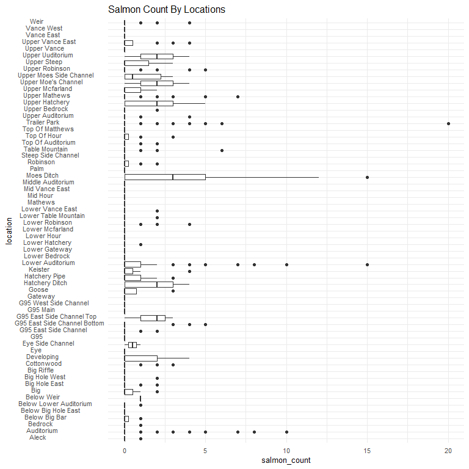
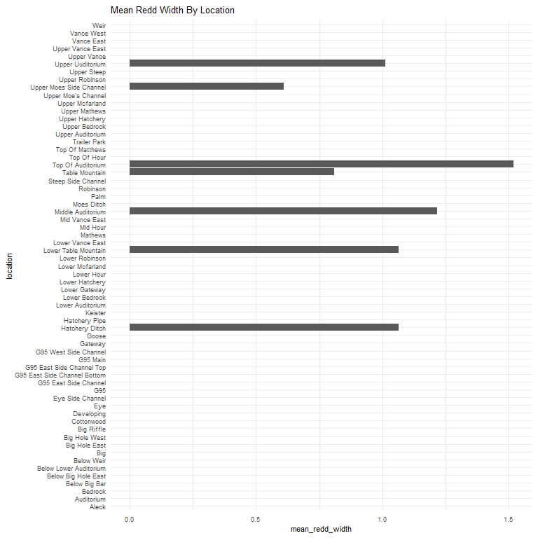
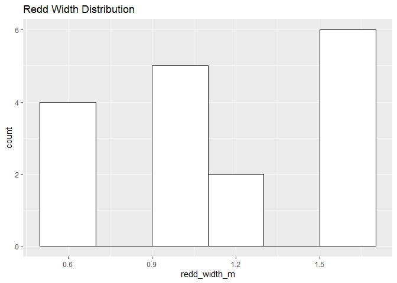
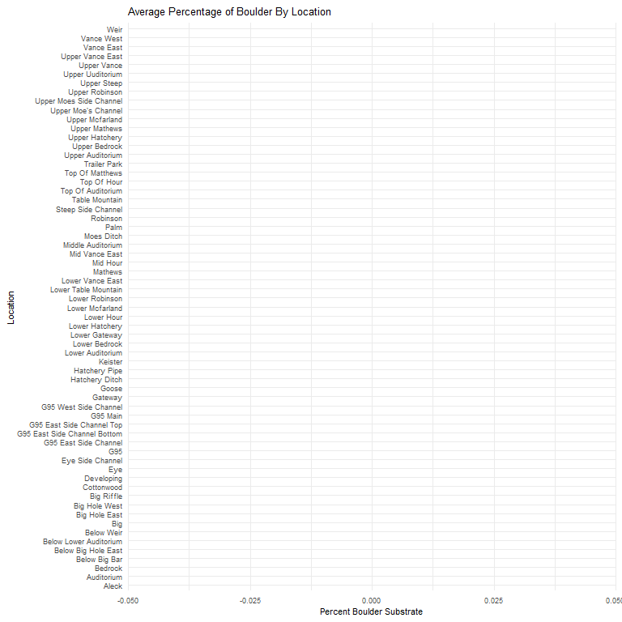
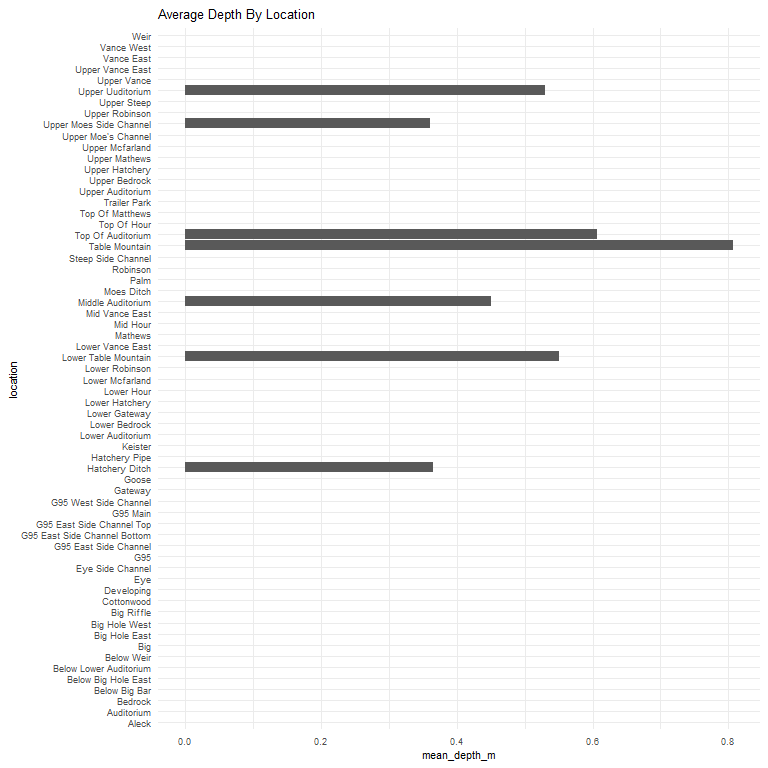
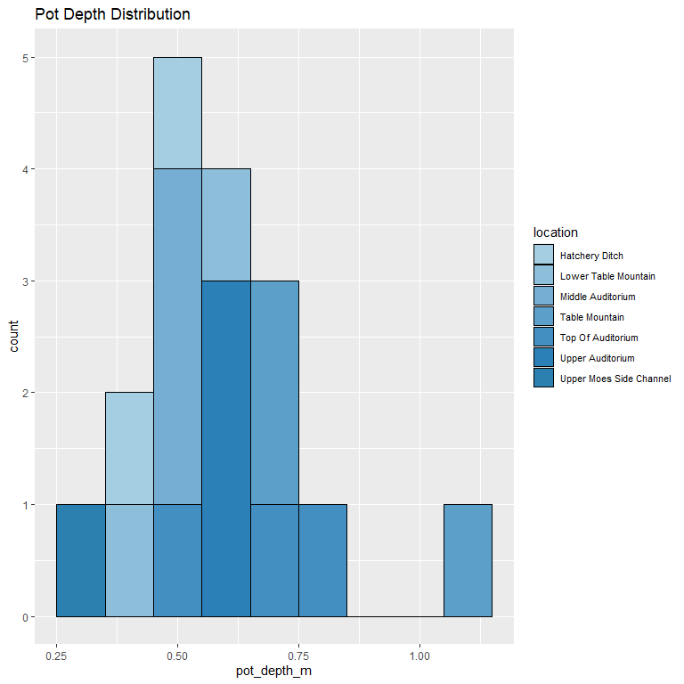
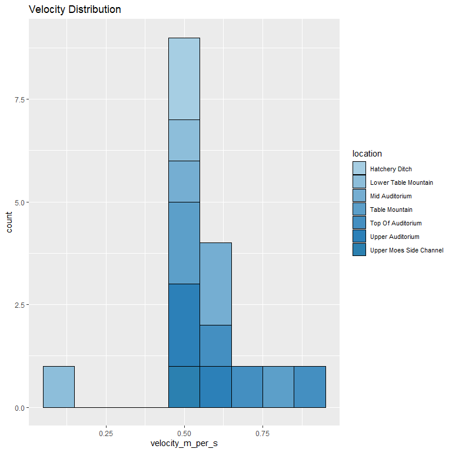

feather-river-redd-survey-qc-checklist-2011
================
Inigo Peng
10/6/2021

# Feather River Redd Survey Data

## Description of Monitoring Data

**Timeframe:** 2011

**Completeness of Record throughout timeframe:**

-   Longitude and latitude data are not available for 2009, 2010, 2011,
    2012, 2019, 2020. NA values will be filled in for these data sets in
    final cleaned data set.

**Sampling Location:** Various sampling locations on Feather River.

**Data Contact:** [Chris Cook](mailto::Chris.Cook@water.ca.gov)

Additional Info:  
1. Latitude and longitude are in NAD 1983 UTM Zone 10N  
2. The substrate is observed visually and an estimate of the percentage
of 5 size classes:

-   fines &lt;1cm  
-   small 1-5cm  
-   medium 6-15cm  
-   large 16-30cm  
-   boulder &gt;30cm

## Access Cloud Data

``` r
# Run Sys.setenv() to specify GCS_AUTH_FILE and GCS_DEFAULT_BUCKET before running
# Open object from google cloud storage
# Set your authentication using gcs_auth
gcs_auth(json_file = Sys.getenv("GCS_AUTH_FILE"))
# Set global bucket 
gcs_global_bucket(bucket = Sys.getenv("GCS_DEFAULT_BUCKET"))
gcs_list_objects()
# git data and save as xlsx
gcs_get_object(object_name = "adult-holding-redd-and-carcass-surveys/feather-river/data-raw/redd_survey/2011_Chinook_Redd_Survey_Data.xlsx",
               bucket = gcs_get_global_bucket(),
               saveToDisk = "2011_Chinook_Redd_Survey_Data_raw.xlsx",
               overwrite = TRUE)
```

Read in data from google cloud, glimpse raw data:

``` r
raw_data_2011 = readxl::read_excel("2011_Chinook_Redd_Survey_Data_raw.xlsx")
glimpse(raw_data_2011)
```

    ## Rows: 1,394
    ## Columns: 19
    ## $ Date                 <dttm> 2011-09-11, 2011-09-11, 2011-09-11, 2011-09-11, ~
    ## $ `Survey Wk`          <chr> "1", "1", "1", "1", "1", "1", "1", "1", "1", "1",~
    ## $ Location             <chr> "Table Mountain", "Table Mountain", "Table Mounta~
    ## $ `File #`             <dbl> 1, 2, 3, 4, 5, 6, 7, 8, 9, 10, 11, 12, 13, 14, 15~
    ## $ type                 <chr> "p", "p", "p", "p", "p", "p", "q", "p", "p", "p",~
    ## $ `# of redds`         <dbl> 1, 1, 1, 1, 2, 1, 0, 2, 1, 1, 1, 1, 2, 1, 2, 1, 2~
    ## $ `# salmon`           <dbl> 0, 0, 0, 0, 0, 0, 0, 1, 0, 0, 3, 2, 0, 4, 0, 0, 0~
    ## $ Latitude             <lgl> NA, NA, NA, NA, NA, NA, NA, NA, NA, NA, NA, NA, N~
    ## $ Longitude            <lgl> NA, NA, NA, NA, NA, NA, NA, NA, NA, NA, NA, NA, N~
    ## $ `Depth (m)`          <dbl> 0.78, 0.78, 0.86, NA, 0.42, 0.68, NA, 0.38, 0.80,~
    ## $ `Pot Depth (m)`      <dbl> 0.67, 0.67, 1.12, NA, 0.44, 0.65, NA, 0.52, 0.84,~
    ## $ `Velocity (m/s)`     <dbl> 0.55, 0.55, 0.79, NA, 0.12, 0.55, NA, 0.65, 0.75,~
    ## $ `% fines(<1 cm)`     <dbl> 30, 30, 20, NA, 10, 10, NA, 10, 10, 10, 10, 20, 3~
    ## $ `% small (1-5 cm)`   <dbl> 60, 60, 50, NA, 60, 20, NA, 40, 40, 50, 30, 60, 6~
    ## $ `% med (5-15 cm)`    <dbl> 10, 10, 30, NA, 30, 60, NA, 40, 50, 40, 60, 20, 1~
    ## $ `% large (15-30 cm)` <dbl> 0, 0, 0, NA, 0, 10, NA, 10, 0, 0, 0, 0, 0, 0, 0, ~
    ## $ `% boulder (>30 cm)` <dbl> 0, 0, 0, NA, 0, 0, NA, 0, 0, 0, 0, 0, 0, 0, 0, 0,~
    ## $ `redd width (ft)`    <dbl> 3, 3, 2, NA, 5, 2, NA, 5, 5, 5, 2, 3, 4, 3, 5, 2,~
    ## $ `redd length (ft)`   <dbl> 3, 3, 4, NA, 8, 2, NA, 10, 5, 5, 3, 4, 10, 5, 8, ~

## Data Transformations

``` r
#Convert feet to m
raw_data_2011$'redd_width_m' <- round(raw_data_2011$'redd width (ft)'*0.3048, 2)
raw_data_2011$'redd_length_m' <- round(raw_data_2011$'redd length (ft)'*0.3048, 2)

cleaner_data_2011 <- raw_data_2011 %>% 
  select(-c('Survey Wk', 'File #', 'redd width (ft)', 'redd length (ft)')) %>% 
  rename(
         'redd_count' = '# of redds', 
         'salmon_count'= '# salmon',
         'latitude' = 'Latitude',
         'longitude' = 'Longitude',
         'depth_m' = 'Depth (m)',
         'pot_depth_m' = 'Pot Depth (m)',
         'velocity_m_per_s' = 'Velocity (m/s)',
         'percent_fine_substrate' = '% fines(<1 cm)',
         'percent_small_substrate' = '% small (1-5 cm)',
         'percent_medium_substrate'= '% med (5-15 cm)',
         'percent_large_substrate' = '% large (15-30 cm)',
         'percent_boulder' = '% boulder (>30 cm)'
         ) %>% 
  mutate(latitude = as.numeric(latitude),
         longitude = as.numeric(longitude),
         Date = as.Date(Date))

#Convert to snakecase
cleaner_data_2011 <- cleaner_data_2011 %>% 
  set_names(tolower(colnames(cleaner_data_2011))) %>% 
  glimpse()
```

    ## Rows: 1,394
    ## Columns: 17
    ## $ date                     <date> 2011-09-11, 2011-09-11, 2011-09-11, 2011-09-~
    ## $ location                 <chr> "Table Mountain", "Table Mountain", "Table Mo~
    ## $ type                     <chr> "p", "p", "p", "p", "p", "p", "q", "p", "p", ~
    ## $ redd_count               <dbl> 1, 1, 1, 1, 2, 1, 0, 2, 1, 1, 1, 1, 2, 1, 2, ~
    ## $ salmon_count             <dbl> 0, 0, 0, 0, 0, 0, 0, 1, 0, 0, 3, 2, 0, 4, 0, ~
    ## $ latitude                 <dbl> NA, NA, NA, NA, NA, NA, NA, NA, NA, NA, NA, N~
    ## $ longitude                <dbl> NA, NA, NA, NA, NA, NA, NA, NA, NA, NA, NA, N~
    ## $ depth_m                  <dbl> 0.78, 0.78, 0.86, NA, 0.42, 0.68, NA, 0.38, 0~
    ## $ pot_depth_m              <dbl> 0.67, 0.67, 1.12, NA, 0.44, 0.65, NA, 0.52, 0~
    ## $ velocity_m_per_s         <dbl> 0.55, 0.55, 0.79, NA, 0.12, 0.55, NA, 0.65, 0~
    ## $ percent_fine_substrate   <dbl> 30, 30, 20, NA, 10, 10, NA, 10, 10, 10, 10, 2~
    ## $ percent_small_substrate  <dbl> 60, 60, 50, NA, 60, 20, NA, 40, 40, 50, 30, 6~
    ## $ percent_medium_substrate <dbl> 10, 10, 30, NA, 30, 60, NA, 40, 50, 40, 60, 2~
    ## $ percent_large_substrate  <dbl> 0, 0, 0, NA, 0, 10, NA, 10, 0, 0, 0, 0, 0, 0,~
    ## $ percent_boulder          <dbl> 0, 0, 0, NA, 0, 0, NA, 0, 0, 0, 0, 0, 0, 0, 0~
    ## $ redd_width_m             <dbl> 0.91, 0.91, 0.61, NA, 1.52, 0.61, NA, 1.52, 1~
    ## $ redd_length_m            <dbl> 0.91, 0.91, 1.22, NA, 2.44, 0.61, NA, 3.05, 1~

## Explore Categorical Variables

``` r
cleaner_data_2011 %>% 
  select_if(is.character) %>% colnames()
```

    ## [1] "location" "type"

### Variable:`location`

``` r
table(cleaner_data_2011$location)
```

    ## 
    ##                        Aleck                   Auditorium 
    ##                           44                          173 
    ##                      Bedrock                Below Big Bar 
    ##                           47                            4 
    ##          Below Big Hole East       Below Lower Auditorium 
    ##                            3                            8 
    ##                   Below weir                          Big 
    ##                            1                            7 
    ##                Big Hole East                Big Hole West 
    ##                           16                            5 
    ##                   Big Riffle                   Cottonwood 
    ##                            3                           15 
    ##                   Developing                          Eye 
    ##                            5                            4 
    ##             Eye Side Channel                          G95 
    ##                            2                            3 
    ##        G95 East Side Channel G95 East Side Channel Bottom 
    ##                           39                           42 
    ##    G95 East Side Channel Top                     G95 Main 
    ##                            3                           15 
    ##        G95 West Side Channel                      Gateway 
    ##                           13                            5 
    ##                        Goose               Hatchery Ditch 
    ##                            4                           25 
    ##                Hatchery Pipe                      Keister 
    ##                           11                            7 
    ##             Lower Auditorium                Lower Bedrock 
    ##                          121                            1 
    ##                Lower Gateway               Lower Hatchery 
    ##                            3                           16 
    ##                   Lower Hour              Lower McFarland 
    ##                            3                            6 
    ##               Lower Robinson         Lower Table Mountain 
    ##                           68                           40 
    ##             Lower Vance East                     Matthews 
    ##                           16                            2 
    ##                     Mid Hour               Mid Vance East 
    ##                            2                            4 
    ##            Middle Auditorium                  Moe's Ditch 
    ##                           18                           19 
    ##                         Palm                     Robinson 
    ##                            4                           20 
    ##           Steep Side Channel               Table Mountain 
    ##                            6                          103 
    ##        Top Moes Side Channel            Top of Auditorium 
    ##                            8                           17 
    ##                  Top of Hour              Top of Matthews 
    ##                            8                            2 
    ##               Top Vance East                 Trailer Park 
    ##                           20                          124 
    ##             Upper Auditorium                Upper Bedrock 
    ##                           16                           21 
    ##               Upper Hatchery               Upper Matthews 
    ##                           17                           68 
    ##              Upper McFarland          Upper Moe's Channel 
    ##                            3                            2 
    ##               Upper Robinson                  Upper Steep 
    ##                           79                            6 
    ##                  Upper Vance            Uppper Auditorium 
    ##                            1                            3 
    ##                   Vance East                   vance West 
    ##                            3                            6 
    ##                   Vance West                         Weir 
    ##                            3                           31

Locations names are changed to be consistent with the rest of the
Feather River redd survey files:

``` r
cleaner_data_2011 <- cleaner_data_2011 %>% 
  mutate(location = str_to_title(location),
    location = if_else(location == "Matthews", "Mathews", location),
          location = if_else(location == "Moe's Ditch", "Moes Ditch", location),
         location = if_else(location == "Top Moes Side Channel", "Upper Moes Side Channel", location),
         location = if_else(location == "Top of Matthews", "Top of Mathews", location),
         location = if_else(location == "Upper Matthews", "Upper Mathews", location),
         location = if_else(location == "Top Vance East", "Upper Vance East", location),
         location = if_else(location == "Uppper Auditorium", "Upper Uuditorium", location)
         )
table(cleaner_data_2011$location)
```

    ## 
    ##                        Aleck                   Auditorium 
    ##                           44                          173 
    ##                      Bedrock                Below Big Bar 
    ##                           47                            4 
    ##          Below Big Hole East       Below Lower Auditorium 
    ##                            3                            8 
    ##                   Below Weir                          Big 
    ##                            1                            7 
    ##                Big Hole East                Big Hole West 
    ##                           16                            5 
    ##                   Big Riffle                   Cottonwood 
    ##                            3                           15 
    ##                   Developing                          Eye 
    ##                            5                            4 
    ##             Eye Side Channel                          G95 
    ##                            2                            3 
    ##        G95 East Side Channel G95 East Side Channel Bottom 
    ##                           39                           42 
    ##    G95 East Side Channel Top                     G95 Main 
    ##                            3                           15 
    ##        G95 West Side Channel                      Gateway 
    ##                           13                            5 
    ##                        Goose               Hatchery Ditch 
    ##                            4                           25 
    ##                Hatchery Pipe                      Keister 
    ##                           11                            7 
    ##             Lower Auditorium                Lower Bedrock 
    ##                          121                            1 
    ##                Lower Gateway               Lower Hatchery 
    ##                            3                           16 
    ##                   Lower Hour              Lower Mcfarland 
    ##                            3                            6 
    ##               Lower Robinson         Lower Table Mountain 
    ##                           68                           40 
    ##             Lower Vance East                      Mathews 
    ##                           16                            2 
    ##                     Mid Hour               Mid Vance East 
    ##                            2                            4 
    ##            Middle Auditorium                   Moes Ditch 
    ##                           18                           19 
    ##                         Palm                     Robinson 
    ##                            4                           20 
    ##           Steep Side Channel               Table Mountain 
    ##                            6                          103 
    ##            Top Of Auditorium                  Top Of Hour 
    ##                           17                            8 
    ##              Top Of Matthews                 Trailer Park 
    ##                            2                          124 
    ##             Upper Auditorium                Upper Bedrock 
    ##                           16                           21 
    ##               Upper Hatchery                Upper Mathews 
    ##                           17                           68 
    ##              Upper Mcfarland          Upper Moe's Channel 
    ##                            3                            2 
    ##      Upper Moes Side Channel               Upper Robinson 
    ##                            8                           79 
    ##                  Upper Steep             Upper Uuditorium 
    ##                            6                            3 
    ##                  Upper Vance             Upper Vance East 
    ##                            1                           20 
    ##                   Vance East                   Vance West 
    ##                            3                            9 
    ##                         Weir 
    ##                           31

**NA and Unknown Values**

-   0 % of values in the `location` column are NA.

## Variable:`Type`

Description:

-   Area - polygon mapped with Trimble GPS unit

-   Point - points mapped with Trimble GPS unit

-   Questionable redds - polygon mapped with Trimble GPS unit where the
    substrate was disturbed but did not have the proper characteristics
    to be called a redd - it was no longer recorded after 2011

``` r
table(cleaner_data_2011$type)
```

    ## 
    ##    a    A    p    q 
    ##  208    4 1181    1

``` r
cleaner_data_2011 <- cleaner_data_2011 %>% 
  mutate(type = tolower(type),
         type = if_else(type == 'a', 'Area', type),
         type = if_else(type == 'p', 'Point', type),
         type = if_else(type == 'q', 'Questionable Redds', type))
table(cleaner_data_2011$type)
```

    ## 
    ##               Area              Point Questionable Redds 
    ##                212               1181                  1

## Expore Numeric Variables

``` r
cleaner_data_2011 %>% 
  select_if(is.numeric) %>% colnames()
```

    ##  [1] "redd_count"               "salmon_count"            
    ##  [3] "latitude"                 "longitude"               
    ##  [5] "depth_m"                  "pot_depth_m"             
    ##  [7] "velocity_m_per_s"         "percent_fine_substrate"  
    ##  [9] "percent_small_substrate"  "percent_medium_substrate"
    ## [11] "percent_large_substrate"  "percent_boulder"         
    ## [13] "redd_width_m"             "redd_length_m"

### Variable:`salmon_count`

``` r
cleaner_data_2011 %>% 
  ggplot(aes(x = date, y = salmon_count)) + 
  geom_col() +
  facet_wrap(~year(date), scales = "free") +
  scale_x_date(labels = date_format("%b"), date_breaks = "1 month")+
  theme_minimal() +
  theme(axis.text.x = element_text(size = 10,angle = 90, vjust = 0.5, hjust=0.1)) +
  theme(axis.text.y = element_text(size = 8))+
  labs(title = "Daily Count of Salmon in 2011")
```

<!-- -->

**Numeric Daily Summary of salmon\_count Over 2011**

``` r
cleaner_data_2011 %>%
  group_by(date) %>%
  summarise(count = sum(salmon_count, na.rm = T)) %>%
  pull(count) %>%
  summary()
```

    ##    Min. 1st Qu.  Median    Mean 3rd Qu.    Max. 
    ##    0.00    5.25   17.50   48.21   81.75  188.00

``` r
cleaner_data_2011  %>%
  ggplot(aes(y = location, x = salmon_count))+
  geom_boxplot() +
  theme_minimal() +
  theme(text = element_text(size = 10))+
  scale_y_discrete()+
  theme(axis.text.y = element_text(size = 8,vjust = 0.1, hjust=0.2))+
  labs(title = "Salmon Count By Locations")
```

<!-- -->

**Numeric summary of salmon\_count by location in 2011**

``` r
cleaner_data_2011 %>%
  group_by(location) %>% 
  summarise(count = sum(salmon_count, na.rm = T)) %>% 
  pull(count) %>%
  summary()
```

    ##    Min. 1st Qu.  Median    Mean 3rd Qu.    Max. 
    ##    0.00    0.00    3.00   10.71    6.00  117.00

**NA and Unknown Values**

-   0 % of values in the `salmon_count` column are NA.

### Variable:`redd_count`

``` r
cleaner_data_2011 %>% 
  ggplot(aes(x = date, y = redd_count)) + 
  geom_col() +
  facet_wrap(~year(date), scales = "free") +
  scale_x_date(labels = date_format("%b"), date_breaks = "1 month")+
  theme_minimal() +
  theme(axis.text.x = element_text(size = 10,angle = 90, vjust = 0.5, hjust=0.1)) +
  theme(axis.text.y = element_text(size = 8))+
  labs(title = "Daily Count of Redds in 2011")
```

<!-- -->

``` r
cleaner_data_2011  %>%
  ggplot(aes(y = location, x = redd_count))+
  geom_boxplot() +
  theme_minimal() +
  theme(text = element_text(size = 12))+
  theme(axis.text.x = element_text(size = 10,vjust = 0.5, hjust=0.1))+
  labs(title = "Redd Count By Locations")
```

<!-- -->

**Numeric Daily Summary of redd\_count Over 2011**

``` r
cleaner_data_2011 %>%
  group_by(date) %>%
  summarise(count = sum(redd_count, na.rm = T)) %>%
  pull(count) %>%
  summary()
```

    ##    Min. 1st Qu.  Median    Mean 3rd Qu.    Max. 
    ##    5.00   26.25   87.50  133.07  173.00  397.00

### Variable:`redd_width_m`

``` r
cleaner_data_2011 %>%
  group_by(location) %>%
  summarise(mean_redd_width = mean(redd_width_m, na.rm = TRUE)) %>%
  ggplot(aes(y = location, x = mean_redd_width)) +
  geom_col() +
  theme_minimal() +
  theme(text = element_text(size = 8)) +
  labs(title = "Mean Redd Width By Location")
```

<!-- -->

``` r
cleaner_data_2011 %>%
  ggplot(aes(x = redd_width_m)) +
  geom_histogram(binwidth = 0.5, color = "black", fill = "white") +
  scale_x_continuous(breaks = round(seq(min(cleaner_data_2011$redd_width_m, na.rm = TRUE), max(cleaner_data_2011$redd_width_m, na.rm = TRUE), by = 1),0))+
  labs(title = "Redd Width Distribution")
```

<!-- -->

**Numeric Summary of redd\_width\_m Over 2011**

``` r
summary(cleaner_data_2011$redd_width_m)
```

    ##    Min. 1st Qu.  Median    Mean 3rd Qu.    Max.    NA's 
    ##   0.610   0.910   0.910   1.091   1.520   1.520    1377

**NA and Unknown Values**

-   98.8 % of values in the `redd_width_m` column are NA.

### Variable: `redd_length_m`

``` r
cleaner_data_2011 %>%
  group_by(location) %>%
  summarise(mean_redd_length = mean(redd_length_m, na.rm = TRUE)) %>%
  ggplot(aes(y = location, x = mean_redd_length)) +
  geom_col() +
  theme_minimal() +
  theme(text = element_text(size = 8)) +
  labs(title = "Mean Redd Length By Location")
```

<!-- -->

``` r
cleaner_data_2011 %>%
  ggplot(aes(x = redd_length_m)) +
  geom_histogram(binwidth = 0.5, color = "black", fill = "white") +
  scale_x_continuous(breaks = round(seq(min(cleaner_data_2011$redd_length_m, na.rm = TRUE), max(cleaner_data_2011$redd_length_m, na.rm = TRUE), by = 1),0))+
  labs(title = "Redd Length Distribution")
```

<!-- -->

**Numeric Summary of redd\_length\_m Over 2011**

``` r
summary(cleaner_data_2011$redd_length_m)
```

    ##    Min. 1st Qu.  Median    Mean 3rd Qu.    Max.    NA's 
    ##   0.610   0.910   1.520   1.648   2.440   3.050    1377

**NA and Unknown Values**

-   98.8 % of values in the `redd_length_m` column are NA.

### Physical Attributes

### Variable:`percent_fine_substrate`

``` r
cleaner_data_2011 %>%
  group_by(location) %>% 
  summarise(mean_fine_substrate = mean(percent_fine_substrate, na.rm = TRUE)) %>%
  ggplot(aes(y = location, x = mean_fine_substrate)) +
  xlab("Percent Fine Substrate")+
  ylab("Location")+
  geom_col() +
  theme_minimal() +
  theme(text = element_text(size = 8)) +
  labs(title = "Average Percentage of Fine Substrate By Location")
```

<!-- -->

**Numeric Summary of percent\_fine\_substrate Over 2011**

``` r
summary(cleaner_data_2011$percent_fine_substrate)
```

    ##    Min. 1st Qu.  Median    Mean 3rd Qu.    Max.    NA's 
    ##    0.00   10.00   10.00   18.24   30.00   50.00    1377

**NA and Unknown Values**

-   98.8 % of values in the `percent_fine_substrate` column are NA.

### Variable:`percent_small_substrate`

``` r
cleaner_data_2011 %>%
  group_by(location) %>% 
  summarise(mean_small_substrate = mean(percent_small_substrate, na.rm = TRUE)) %>%
  ggplot(aes(y = location, x = mean_small_substrate)) +
  xlab("Percent Small Substrate")+
  ylab("Location")+
  geom_col() +
  theme_minimal() +
  theme(text = element_text(size = 8)) +
  labs(title = "Average Percentage of Small Substrate By Location")
```

<!-- -->

**Numeric Summary of percent\_small\_substrate Over 2011**

``` r
summary(cleaner_data_2011$percent_small_substrate)
```

    ##    Min. 1st Qu.  Median    Mean 3rd Qu.    Max.    NA's 
    ##   20.00   40.00   50.00   47.06   60.00   60.00    1377

**NA and Unknown Values**

-   98.8 % of values in the `percent_small_substrate` column are NA.

### Variable:`percent_medium_substrate`

``` r
cleaner_data_2011 %>%
  group_by(location) %>% 
  summarise(mean_medium_substrate = mean(percent_medium_substrate, na.rm = TRUE)) %>%
  ggplot(aes(y = location, x = mean_medium_substrate)) +
  xlab("Percent Medium Substrate")+
  ylab("Location")+
  geom_col() +
  theme_minimal() +
  theme(text = element_text(size = 8)) +
  labs(title = "Average Percentage of Medium Substrate By Location")
```

<!-- -->

**Numeric Summary of percent\_medium\_substrate Over 2011**

``` r
summary(cleaner_data_2011$percent_medium_substrate)
```

    ##    Min. 1st Qu.  Median    Mean 3rd Qu.    Max.    NA's 
    ##    0.00   20.00   30.00   32.35   50.00   60.00    1377

**NA and Unknown Values**

-   98.8 % of values in the `percent_medium_substrate` column are NA.

### Variable:`percent_large_substrate`

``` r
cleaner_data_2011 %>%
  group_by(location) %>% 
  summarise(mean_large_substrate = mean(percent_large_substrate, na.rm = TRUE)) %>%
  ggplot(aes(y = location, x = mean_large_substrate)) +
  xlab("Percent Large Substrate")+
  ylab("Location")+
  geom_col() +
  theme_minimal() +
  theme(text = element_text(size = 8)) +
  labs(title = "Average Percentage of Large Substrate By Location")
```

<!-- -->

**Numeric Summary of percent\_large\_substrate Over 2011**

``` r
summary(cleaner_data_2011$percent_large_substrate)
```

    ##    Min. 1st Qu.  Median    Mean 3rd Qu.    Max.    NA's 
    ##   0.000   0.000   0.000   2.353   0.000  10.000    1377

**NA and Unknown Values**

-   98.8 % of values in the `percent_large_substrate` column are NA.

### Variable:`percent_boulder`

``` r
cleaner_data_2011 %>%
  group_by(location) %>% 
  summarise(mean_boulder = mean(percent_boulder, na.rm = TRUE)) %>%
  ggplot(aes(y = location, x = mean_boulder)) +
  xlab("Percent Boulder Substrate")+
  ylab("Location")+
  geom_col() +
  theme_minimal() +
  theme(text = element_text(size = 8)) +
  labs(title = "Average Percentage of Boulder By Location")
```

<!-- -->

**Numeric Summary of percent\_boulder Over 2011**

``` r
summary(cleaner_data_2011$percent_boulder)
```

    ##    Min. 1st Qu.  Median    Mean 3rd Qu.    Max.    NA's 
    ##       0       0       0       0       0       0    1377

**NA and Unknown Values** NA and Unknown Values\*\*

-   98.8 % of values in the `percent_large_substrate` column are NA.

### Variable: `depth_m`

``` r
cleaner_data_2011 %>% 
  group_by(location) %>% 
  summarise(mean_depth_m = mean(depth_m, na.rm = TRUE)) %>%
  ggplot(aes(x = mean_depth_m, y = location)) + 
  geom_col() + 
  theme_minimal() + 
  theme(text = element_text(size = 8))+
  labs(title = "Average Depth By Location")
```

<!-- -->
**Numeric Summary of depth\_m Over 2011**

``` r
summary(cleaner_data_2011$depth_m)
```

    ##    Min. 1st Qu.  Median    Mean 3rd Qu.    Max.    NA's 
    ##  0.3400  0.4100  0.5000  0.5512  0.6800  0.8600    1377

**NA and Unknown Values**

-   98.8 % of values in the `depth_m` column are NA.

### Variable: `pot_depth_m`

``` r
cleaner_data_2011 %>% 
   group_by(location) %>% 
  summarise(mean_pot_depth_m = mean(pot_depth_m, na.rm = TRUE)) %>%
  ggplot(aes(x = mean_pot_depth_m, y = location)) + 
  geom_col() + 
  theme_minimal() + 
  theme(text = element_text(size = 8))+
  labs(title = "Average Pot Depth By Location")
```

<!-- -->
**Numeric Summary of pot\_depth\_m Over 2011**

``` r
summary(cleaner_data_2011$pot_depth_m)
```

    ##    Min. 1st Qu.  Median    Mean 3rd Qu.    Max.    NA's 
    ##  0.3100  0.5000  0.6100  0.6012  0.6700  1.1200    1377

**NA and Unknown Values**

-   98.8 % of values in the `pot_depth_m` column are NA.

### Variable: `velocity_m_per_s`

``` r
cleaner_data_2011 %>% 
  group_by(location) %>% 
  summarise(`mean_velocity_m_per_s` = mean(`velocity_m_per_s`, na.rm = TRUE)) %>%
  ggplot(aes(x = `mean_velocity_m_per_s`, y = location)) + 
  geom_col() + 
  theme_minimal() + 
  theme(text = element_text(size = 8))+
  labs(title = "Average Velocity By Location")
```

<!-- -->
**Numeric Summary of velocity\_m\_per\_s Over 2011**

``` r
summary(cleaner_data_2011$`velocity_m_per_s`)
```

    ##    Min. 1st Qu.  Median    Mean 3rd Qu.    Max.    NA's 
    ##  0.1200  0.5300  0.5500  0.5812  0.6400  0.9500    1377

**NA and Unknown Values**

-   98.8 % of values in the `velocity_m_per_s` column are NA.

### Add cleaned data back onto google cloud

``` r
feather_redd_survey_2011 <- cleaner_data_2011 %>% glimpse()
```

    ## Rows: 1,394
    ## Columns: 17
    ## $ date                     <date> 2011-09-11, 2011-09-11, 2011-09-11, 2011-09-~
    ## $ location                 <chr> "Table Mountain", "Table Mountain", "Table Mo~
    ## $ type                     <chr> "Point", "Point", "Point", "Point", "Point", ~
    ## $ redd_count               <dbl> 1, 1, 1, 1, 2, 1, 0, 2, 1, 1, 1, 1, 2, 1, 2, ~
    ## $ salmon_count             <dbl> 0, 0, 0, 0, 0, 0, 0, 1, 0, 0, 3, 2, 0, 4, 0, ~
    ## $ latitude                 <dbl> NA, NA, NA, NA, NA, NA, NA, NA, NA, NA, NA, N~
    ## $ longitude                <dbl> NA, NA, NA, NA, NA, NA, NA, NA, NA, NA, NA, N~
    ## $ depth_m                  <dbl> 0.78, 0.78, 0.86, NA, 0.42, 0.68, NA, 0.38, 0~
    ## $ pot_depth_m              <dbl> 0.67, 0.67, 1.12, NA, 0.44, 0.65, NA, 0.52, 0~
    ## $ velocity_m_per_s         <dbl> 0.55, 0.55, 0.79, NA, 0.12, 0.55, NA, 0.65, 0~
    ## $ percent_fine_substrate   <dbl> 30, 30, 20, NA, 10, 10, NA, 10, 10, 10, 10, 2~
    ## $ percent_small_substrate  <dbl> 60, 60, 50, NA, 60, 20, NA, 40, 40, 50, 30, 6~
    ## $ percent_medium_substrate <dbl> 10, 10, 30, NA, 30, 60, NA, 40, 50, 40, 60, 2~
    ## $ percent_large_substrate  <dbl> 0, 0, 0, NA, 0, 10, NA, 10, 0, 0, 0, 0, 0, 0,~
    ## $ percent_boulder          <dbl> 0, 0, 0, NA, 0, 0, NA, 0, 0, 0, 0, 0, 0, 0, 0~
    ## $ redd_width_m             <dbl> 0.91, 0.91, 0.61, NA, 1.52, 0.61, NA, 1.52, 1~
    ## $ redd_length_m            <dbl> 0.91, 0.91, 1.22, NA, 2.44, 0.61, NA, 3.05, 1~

``` r
f <- function(input, output) write_csv(input, file = output)

gcs_upload(feather_redd_survey_2011,
           object_function = f,
           type = "csv",
           name = "adult-holding-redd-and-carcass-surveys/feather-river/data/feather_redd_2011.csv")
```

    ## i 2021-10-14 16:29:03 > File size detected as  97.2 Kb

    ## i 2021-10-14 16:29:03 > Request Status Code:  400

    ## ! API returned: Cannot insert legacy ACL for an object when uniform bucket-level access is enabled. Read more at https://cloud.google.com/storage/docs/uniform-bucket-level-access - Retrying with predefinedAcl='bucketLevel'

    ## i 2021-10-14 16:29:03 > File size detected as  97.2 Kb

    ## ==Google Cloud Storage Object==
    ## Name:                adult-holding-redd-and-carcass-surveys/feather-river/data/feather_redd_2011.csv 
    ## Type:                csv 
    ## Size:                97.2 Kb 
    ## Media URL:           https://www.googleapis.com/download/storage/v1/b/jpe-dev-bucket/o/adult-holding-redd-and-carcass-surveys%2Ffeather-river%2Fdata%2Ffeather_redd_2011.csv?generation=1634254143433749&alt=media 
    ## Download URL:        https://storage.cloud.google.com/jpe-dev-bucket/adult-holding-redd-and-carcass-surveys%2Ffeather-river%2Fdata%2Ffeather_redd_2011.csv 
    ## Public Download URL: https://storage.googleapis.com/jpe-dev-bucket/adult-holding-redd-and-carcass-surveys%2Ffeather-river%2Fdata%2Ffeather_redd_2011.csv 
    ## Bucket:              jpe-dev-bucket 
    ## ID:                  jpe-dev-bucket/adult-holding-redd-and-carcass-surveys/feather-river/data/feather_redd_2011.csv/1634254143433749 
    ## MD5 Hash:            Ues3qWak6BkiptiiaC14hw== 
    ## Class:               STANDARD 
    ## Created:             2021-10-14 23:29:03 
    ## Updated:             2021-10-14 23:29:03 
    ## Generation:          1634254143433749 
    ## Meta Generation:     1 
    ## eTag:                CJXYxI2Hy/MCEAE= 
    ## crc32c:              t3sJLw==
