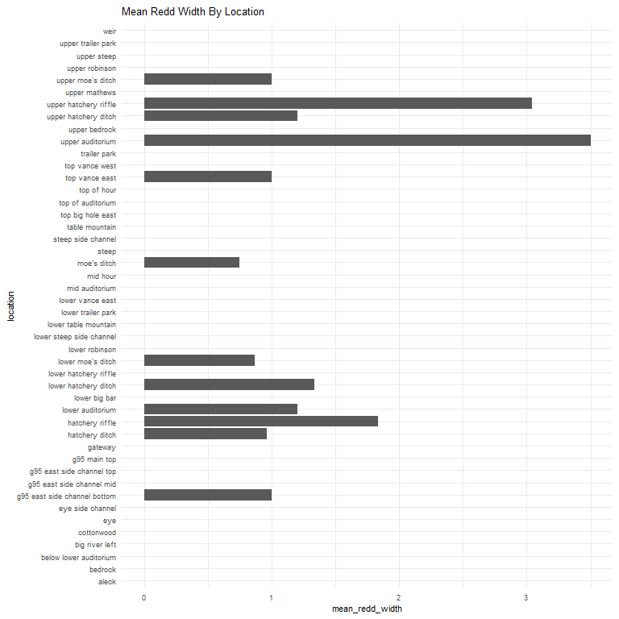
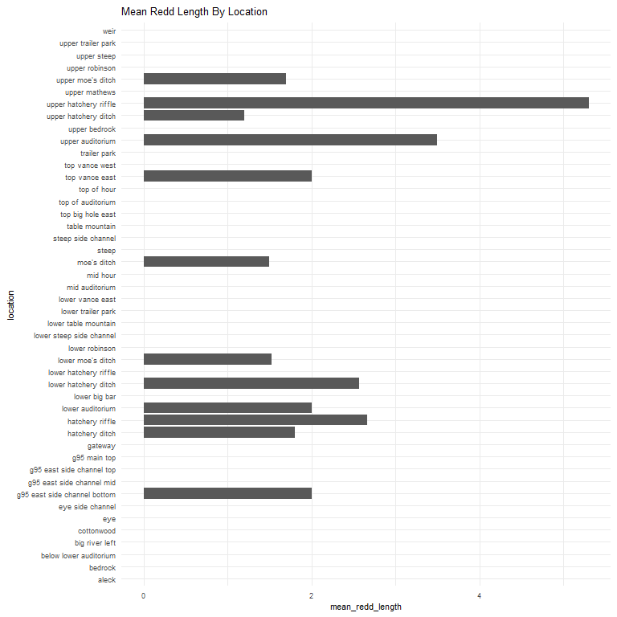
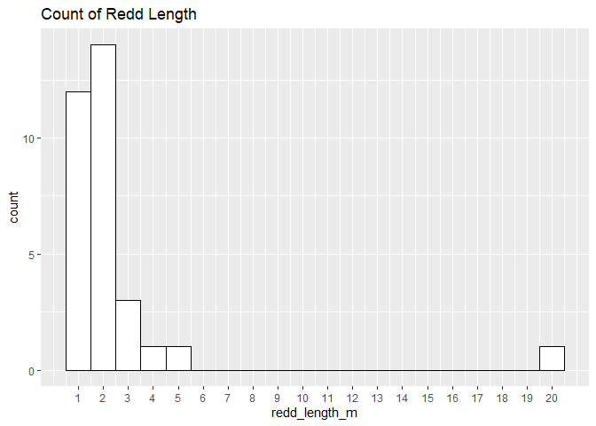
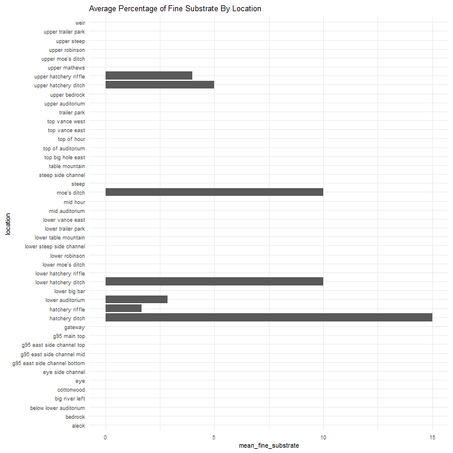
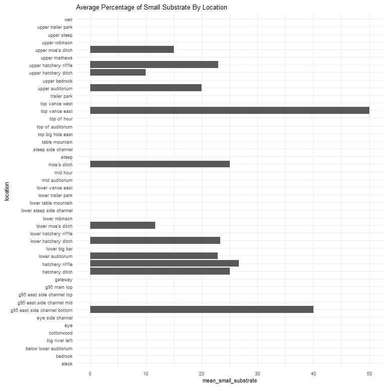
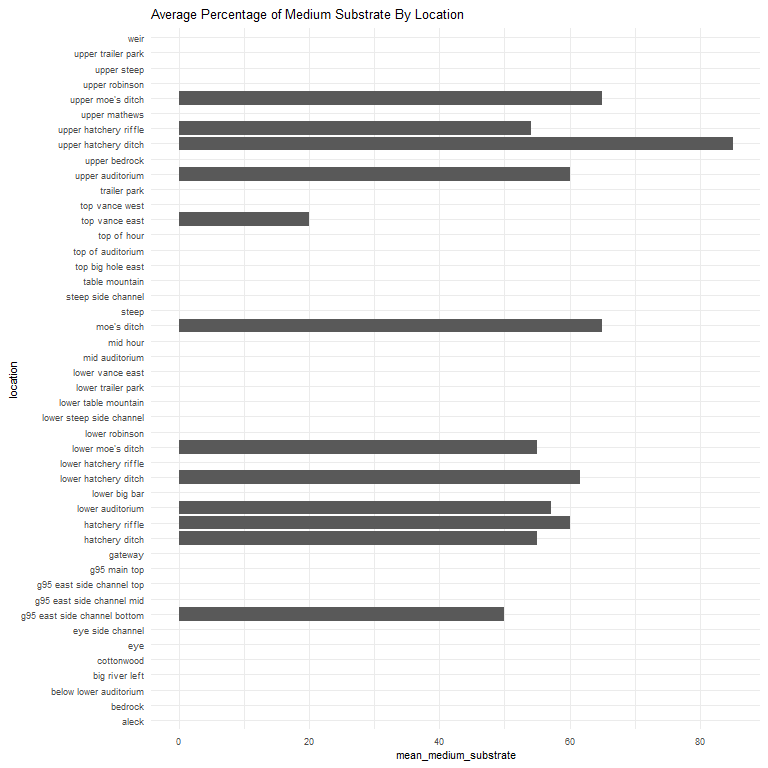
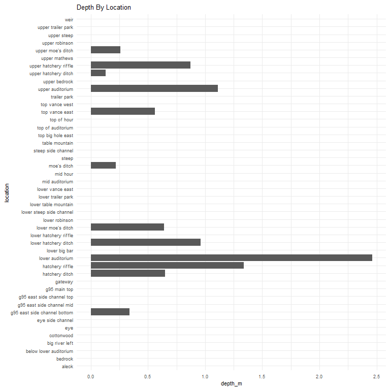

feather-river-adult-holding-redd-survey-qc-checklist-2012
================
Inigo Peng
10/6/2021

# Feather River Redd Survey Data

## Description of Monitoring Data

**Timeframe:** 2012

**Completeness of Record throughout timeframe: **  

-   Longitude and latitude data are not available for 2009, 2010, 2011,
    2012, 2019, 2020. NA values will be filled in for these data sets in
    final cleaned data set.

-   No data was recorded for “depth\_m”, “pot\_depth\_m”, and
    “velocity\_m/s” in 2009 data. NA values only.

**Sampling Location:** Feather River

**Data Contact:** [Chris Cook](Chris.Cook@water.ca.gov)

Additional Info:  
1. Latitude and longitude are in NAD 1983 UTM Zone 10N  
2. The substrate is observed visually and an estimate of the percentage
of 5 size classes:  
\* fines &lt;1cm  
\* small 1-5cm  
\* medium 6-15cm  
\* large 16-30cm  
\* boulder &gt;30cm

## Access Cloud Data

``` r
# Run Sys.setenv() to specify GCS_AUTH_FILE and GCS_DEFAULT_BUCKET before running
# Open object from google cloud storage
# Set your authentication using gcs_auth
gcs_auth(json_file = Sys.getenv("GCS_AUTH_FILE"))
# Set global bucket 
gcs_global_bucket(bucket = Sys.getenv("GCS_DEFAULT_BUCKET"))
gcs_list_objects()
# git data and save as xlsx
gcs_get_object(object_name = "adult-holding-redd-and-carcass-surveys/feather-river/data-raw/redd_survey/2012_Chinook_Redd_Survey_Data_raw.xlsx",
               bucket = gcs_get_global_bucket(),
               saveToDisk = "2012_Chinook_Redd_Survey_Data_raw.xlsx",
               overwrite = TRUE)
```

Read in data from google cloud, glimpse raw data:

``` r
raw_data_2012 = readxl::read_excel("2012_Chinook_Redd_Survey_Data_raw.xlsx")
glimpse(raw_data_2012)
```

    ## Rows: 1,774
    ## Columns: 19
    ## $ Date              <dttm> 2012-08-08, 2012-08-08, 2012-08-08, 2012-09-12, 201~
    ## $ `Survey Wk`       <dbl> 0, 0, 0, 1, 1, 1, 1, 1, 1, 1, 1, 1, 1, 1, 1, 1, 2, 2~
    ## $ Location          <chr> "Moes", "Moes", "Moes", "Table Mtn", "Table Mtn", "T~
    ## $ `File #`          <dbl> 1, 2, 3, 1, 2, 3, 4, 5, 6, 7, 8, 9, 10, 11, 12, 13, ~
    ## $ type              <chr> "p", "p", "p", "p", "p", "p", "p", "p", "p", "p", "p~
    ## $ `# of redds`      <dbl> 1, 1, 1, 1, 1, 1, 1, 1, 1, 1, 1, 1, 2, 1, 1, 1, 1, 1~
    ## $ `# salmon`        <dbl> 0, 0, 1, 0, 2, 0, 0, 2, 0, 0, 0, 1, 1, 1, 0, 1, 0, 0~
    ## $ Latitude          <lgl> NA, NA, NA, NA, NA, NA, NA, NA, NA, NA, NA, NA, NA, ~
    ## $ Longitude         <lgl> NA, NA, NA, NA, NA, NA, NA, NA, NA, NA, NA, NA, NA, ~
    ## $ `Depth (m)`       <dbl> 0.38, 0.32, 0.22, NA, NA, NA, NA, NA, NA, NA, NA, NA~
    ## $ `Pot Depth (m)`   <dbl> 0.40, 0.45, 0.28, NA, NA, NA, NA, NA, NA, NA, NA, NA~
    ## $ `Velocity (m/s)`  <dbl> 0.55, 0.64, 0.42, NA, NA, NA, NA, NA, NA, NA, NA, NA~
    ## $ `% fines`         <dbl> 0, 10, 10, NA, NA, NA, NA, NA, NA, NA, NA, NA, 0, NA~
    ## $ `% small`         <dbl> 40, 40, 25, NA, NA, NA, NA, NA, NA, NA, NA, NA, 20, ~
    ## $ `% med`           <dbl> 50, 50, 65, NA, NA, NA, NA, NA, NA, NA, NA, NA, 50, ~
    ## $ `% large`         <dbl> 10, 0, 0, NA, NA, NA, NA, NA, NA, NA, NA, NA, 30, NA~
    ## $ `% boulder`       <dbl> 0, 0, 0, NA, NA, NA, NA, NA, NA, NA, NA, NA, 0, NA, ~
    ## $ `redd width (m)`  <dbl> 1.00, 1.00, 0.75, NA, NA, NA, NA, NA, NA, NA, NA, NA~
    ## $ `redd length (m)` <dbl> 1.5, 1.5, 1.5, NA, NA, NA, NA, NA, NA, NA, NA, NA, 2~

## Data Transformation

``` r
cleaner_data_2012 <- raw_data_2012 %>% 
 select(-c('Survey Wk', 'File #', '# of redds')) %>% 
  rename('salmon_counted'= '# salmon',
         'latitude' = 'Latitude',
         'longitude' = 'Longitude',
         'depth_m' = 'Depth (m)',
         'pot_depth_m' = 'Pot Depth (m)',
         'velocity_m/s' = 'Velocity (m/s)',
         'percent_fine_substrate' = '% fines',
         'percent_small_substrate' = '% small',
         'percent_medium_substrate'= '% med',
         'percent_large_substrate' = '% large',
         'percent_boulder' = '% boulder',
         'redd_width_m' = 'redd width (m)',
         'redd_length_m' = 'redd length (m)',
         ) %>% 
  mutate(latitude = as.numeric(latitude),
         longitude = as.numeric(longitude)) %>% 
  filter(salmon_counted > 0) %>% 
  glimpse()
```

    ## Rows: 630
    ## Columns: 16
    ## $ Date                     <dttm> 2012-08-08, 2012-09-12, 2012-09-12, 2012-09-~
    ## $ Location                 <chr> "Moes", "Table Mtn", "Cottonwood", "Upper Aud~
    ## $ type                     <chr> "p", "p", "p", "p", "p", "p", "p", "p", "p", ~
    ## $ salmon_counted           <dbl> 1, 2, 2, 1, 1, 1, 1, 1, 2, 1, 1, 1, 2, 2, 1, ~
    ## $ latitude                 <dbl> NA, NA, NA, NA, NA, NA, NA, NA, NA, NA, NA, N~
    ## $ longitude                <dbl> NA, NA, NA, NA, NA, NA, NA, NA, NA, NA, NA, N~
    ## $ depth_m                  <dbl> 0.22, NA, NA, NA, 0.55, NA, NA, NA, 0.36, NA,~
    ## $ pot_depth_m              <dbl> 0.28, NA, NA, NA, 0.55, NA, NA, NA, 0.40, NA,~
    ## $ `velocity_m/s`           <dbl> 0.42, NA, NA, NA, 0.32, NA, NA, NA, 0.62, NA,~
    ## $ percent_fine_substrate   <dbl> 10, NA, NA, NA, 0, NA, NA, NA, 5, NA, NA, NA,~
    ## $ percent_small_substrate  <dbl> 25, NA, NA, NA, 20, NA, NA, NA, 30, NA, NA, N~
    ## $ percent_medium_substrate <dbl> 65, NA, NA, NA, 50, NA, NA, NA, 60, NA, NA, N~
    ## $ percent_large_substrate  <dbl> 0, NA, NA, NA, 30, NA, NA, NA, 5, NA, NA, NA,~
    ## $ percent_boulder          <dbl> 0, NA, NA, NA, 0, NA, NA, NA, 0, NA, NA, NA, ~
    ## $ redd_width_m             <dbl> 0.75, NA, NA, NA, 2.00, NA, NA, NA, 1.00, NA,~
    ## $ redd_length_m            <dbl> 1.5, NA, NA, NA, 2.0, NA, NA, NA, 2.0, NA, NA~

``` r
cleaner_data_2012 <- cleaner_data_2012 %>% 
  set_names(tolower(colnames(cleaner_data_2012))) %>% 
  mutate(date = as.Date(date)) %>% 
  glimpse()
```

    ## Rows: 630
    ## Columns: 16
    ## $ date                     <date> 2012-08-08, 2012-09-12, 2012-09-12, 2012-09-~
    ## $ location                 <chr> "Moes", "Table Mtn", "Cottonwood", "Upper Aud~
    ## $ type                     <chr> "p", "p", "p", "p", "p", "p", "p", "p", "p", ~
    ## $ salmon_counted           <dbl> 1, 2, 2, 1, 1, 1, 1, 1, 2, 1, 1, 1, 2, 2, 1, ~
    ## $ latitude                 <dbl> NA, NA, NA, NA, NA, NA, NA, NA, NA, NA, NA, N~
    ## $ longitude                <dbl> NA, NA, NA, NA, NA, NA, NA, NA, NA, NA, NA, N~
    ## $ depth_m                  <dbl> 0.22, NA, NA, NA, 0.55, NA, NA, NA, 0.36, NA,~
    ## $ pot_depth_m              <dbl> 0.28, NA, NA, NA, 0.55, NA, NA, NA, 0.40, NA,~
    ## $ `velocity_m/s`           <dbl> 0.42, NA, NA, NA, 0.32, NA, NA, NA, 0.62, NA,~
    ## $ percent_fine_substrate   <dbl> 10, NA, NA, NA, 0, NA, NA, NA, 5, NA, NA, NA,~
    ## $ percent_small_substrate  <dbl> 25, NA, NA, NA, 20, NA, NA, NA, 30, NA, NA, N~
    ## $ percent_medium_substrate <dbl> 65, NA, NA, NA, 50, NA, NA, NA, 60, NA, NA, N~
    ## $ percent_large_substrate  <dbl> 0, NA, NA, NA, 30, NA, NA, NA, 5, NA, NA, NA,~
    ## $ percent_boulder          <dbl> 0, NA, NA, NA, 0, NA, NA, NA, 0, NA, NA, NA, ~
    ## $ redd_width_m             <dbl> 0.75, NA, NA, NA, 2.00, NA, NA, NA, 1.00, NA,~
    ## $ redd_length_m            <dbl> 1.5, NA, NA, NA, 2.0, NA, NA, NA, 2.0, NA, NA~

## Explore Categorical Variables

``` r
cleaner_data_2012 %>% 
  select_if(is.character) %>% colnames()
```

    ## [1] "location" "type"

### Variable:`location`

``` r
table(cleaner_data_2012$location)
```

    ## 
    ##                     Aleck                   Bedrock    Below Lower Auditorium 
    ##                        13                         2                         2 
    ##            Big River Left Bottom G95 East Side Chnl                Cottonwood 
    ##                         1                         2                        12 
    ##                       Eye          Eye Side Channel                   Gateway 
    ##                         2                         4                         1 
    ##            Hatchery Ditch           Hatchery Riffle          Lower Auditorium 
    ##                        66                        14                        80 
    ##             Lower Big Bar      Lower Hatchery Ditch     Lower Hatchery Riffle 
    ##                         1                        31                        27 
    ##          Lower Moes Ditch            Lower Robinson     Lower Steep Side Chnl 
    ##                        27                        40                         1 
    ##           Lower Table Mtn        Lower Trailer Park          Lower Vance East 
    ##                         8                        12                         1 
    ##            Mid Auditorium    Mid G95 East Side Chnl                  Mid Hour 
    ##                         3                         1                         1 
    ##                      Moes                Moes Ditch                     Steep 
    ##                         1                         7                        10 
    ##        Steep Side Channel                 Table Mtn         Top Big Hole East 
    ##                        12                        38                         9 
    ##    Top G95 East Side Chnl              Top G95 Main                  Top Hour 
    ##                         4                         3                         2 
    ##         Top of Auditorium         Top of Moes Ditch            Top Vance East 
    ##                         6                         2                         7 
    ##            Top Vance West              Trailer Park          Upper Auditorium 
    ##                         1                         2                        27 
    ##             Upper Bedrock      Upper Hatchery Ditch     Upper Hatchery Riffle 
    ##                         9                        11                        58 
    ##             Upper Mathews                Upper Moes          Upper Moes Ditch 
    ##                         8                         6                         4 
    ##            Upper Robinson               Upper Steep        Upper Trailer Park 
    ##                        32                         3                         5 
    ##                      Weir 
    ##                        11

Locations names are changed to be consistent with the rest of the
Feather River redd survey files:

``` r
cleaner_data_2012 <- cleaner_data_2012 %>% 
  mutate(location = tolower(location),
         location = if_else(location == "bottom g95 east side chnl", "g95 east side channel bottom", location),
         location = if_else(location == "lower steep side chnl", "lower steep side channel", location),
         location = if_else(location == "lower table mtn", "lower table mountain", location),
         location = if_else(location == "lower moes ditch", "lower moe's ditch", location),
         location = if_else(location == "mid g95 east side chnl", "g95 east side channel mid", location),
         location = if_else(location == "moes", "moe's ditch", location),
         location = if_else(location == "moes ditch", "moe's ditch", location),
         location = if_else(location == "table mtn", "table mountain", location),
         location = if_else(location == "top g95 east side chnl", "g95 east side channel top", location),
         location = if_else(location == "top g95 main", "g95 main top", location),
         location = if_else(location == "top hour", "top of hour", location),
         location = if_else(location == "top of moes ditch", "upper moe's ditch", location),
         location = if_else(location == "upper moes", "upper moe's ditch", location),
         location = if_else(location == "upper moes ditch", "upper moe's ditch", location),
         )
table(cleaner_data_2012$location)
```

    ## 
    ##                        aleck                      bedrock 
    ##                           13                            2 
    ##       below lower auditorium               big river left 
    ##                            2                            1 
    ##                   cottonwood                          eye 
    ##                           12                            2 
    ##             eye side channel g95 east side channel bottom 
    ##                            4                            2 
    ##    g95 east side channel mid    g95 east side channel top 
    ##                            1                            4 
    ##                 g95 main top                      gateway 
    ##                            3                            1 
    ##               hatchery ditch              hatchery riffle 
    ##                           66                           14 
    ##             lower auditorium                lower big bar 
    ##                           80                            1 
    ##         lower hatchery ditch        lower hatchery riffle 
    ##                           31                           27 
    ##            lower moe's ditch               lower robinson 
    ##                           27                           40 
    ##     lower steep side channel         lower table mountain 
    ##                            1                            8 
    ##           lower trailer park             lower vance east 
    ##                           12                            1 
    ##               mid auditorium                     mid hour 
    ##                            3                            1 
    ##                  moe's ditch                        steep 
    ##                            8                           10 
    ##           steep side channel               table mountain 
    ##                           12                           38 
    ##            top big hole east            top of auditorium 
    ##                            9                            6 
    ##                  top of hour               top vance east 
    ##                            2                            7 
    ##               top vance west                 trailer park 
    ##                            1                            2 
    ##             upper auditorium                upper bedrock 
    ##                           27                            9 
    ##         upper hatchery ditch        upper hatchery riffle 
    ##                           11                           58 
    ##                upper mathews            upper moe's ditch 
    ##                            8                           12 
    ##               upper robinson                  upper steep 
    ##                           32                            3 
    ##           upper trailer park                         weir 
    ##                            5                           11

-   0 % of values in the `location` column are NA.

## Variable:`Type`

Description:  
Area - polygon mapped with Trimble GPS unit Point - points mapped with
Trimble GPS unit Questionable redds - polygon mapped with Trimble GPS
unit where the substrate was disturbed but did not have the proper
characteristics to be called a redd - it was no longer recorded after
2012

``` r
table(cleaner_data_2012$type)
```

    ## 
    ##   a   p 
    ##  56 574

``` r
cleaner_data_2012 <- cleaner_data_2012 %>% 
  mutate(type = tolower(type),
         type = if_else(type == 'a', 'Area', type),
         type = if_else(type == 'p', 'Point', type),
         type = if_else(type == 'q', 'Questionable Redds', type))
table(cleaner_data_2012$type)
```

    ## 
    ##  Area Point 
    ##    56   574

## Expore Numeric Variables

``` r
cleaner_data_2012 %>% 
  select_if(is.numeric) %>% colnames()
```

    ##  [1] "salmon_counted"           "latitude"                
    ##  [3] "longitude"                "depth_m"                 
    ##  [5] "pot_depth_m"              "velocity_m/s"            
    ##  [7] "percent_fine_substrate"   "percent_small_substrate" 
    ##  [9] "percent_medium_substrate" "percent_large_substrate" 
    ## [11] "percent_boulder"          "redd_width_m"            
    ## [13] "redd_length_m"

### Variable:`salmon_counted`

#### Plotting salmon counted in 2012

``` r
cleaner_data_2012 %>% 
  ggplot(aes(x = date, y = salmon_counted)) + 
  geom_col() +
  facet_wrap(~year(date), scales = "free") +
  scale_x_date(labels = date_format("%b"), date_breaks = "1 month")+
  theme_minimal() +
  theme(axis.text.x = element_text(size = 10,angle = 90, vjust = 0.5, hjust=0.1)) +
  theme(axis.text.y = element_text(size = 8))+
  labs(title = "Daily Count of Salmon Counted in 2012")
```

<!-- -->
**Numeric Daily Summary of salmon\_counted Over 2012**

``` r
cleaner_data_2012 %>%
  group_by(date) %>%
  summarise(count = sum(salmon_counted, na.rm = T)) %>%
  pull(count) %>%
  summary()
```

    ##    Min. 1st Qu.  Median    Mean 3rd Qu.    Max. 
    ##    1.00   55.50   77.00   84.47  124.00  168.00

``` r
cleaner_data_2012  %>%
  ggplot(aes(y = location, x = salmon_counted))+
  geom_boxplot() +
  theme_minimal() +
  theme(text = element_text(size = 10))+
  scale_y_discrete()+
  theme(axis.text.y = element_text(size = 8,vjust = 0.1, hjust=0.2))+
  labs(title = "Salmon Count By Locations")
```

<!-- -->
**Numeric summary of salmon\_counted by location in 2012**

``` r
cleaner_data_2012 %>%
  group_by(location) %>% 
  summarise(count = sum(salmon_counted, na.rm = T)) %>% 
  pull(count) %>%
  summary()
```

    ##    Min. 1st Qu.  Median    Mean 3rd Qu.    Max. 
    ##    1.00    3.00   12.50   27.54   37.50  181.00

**NA and Unknown Values** \* 0 % of values in the `salmon_counted`
column are NA.

### Variable:`redd_width_m`

``` r
cleaner_data_2012 %>%
  group_by(location) %>%
  summarise(mean_redd_width = mean(redd_width_m, na.rm = TRUE)) %>%
  ggplot(aes(y = location, x = mean_redd_width)) +
  geom_col() +
  theme_minimal() +
  theme(text = element_text(size = 8)) +
  labs(title = "Mean Redd Width By Location")
```

<!-- -->

``` r
cleaner_data_2012 %>%
  ggplot(aes(x = redd_width_m)) +
  geom_histogram(binwidth = 1, color = "black", fill = "white") +
  scale_x_continuous(breaks = round(seq(min(cleaner_data_2012$redd_width_m, na.rm = TRUE), max(cleaner_data_2012$redd_width_m, na.rm = TRUE), by = 0.5),0))+
  labs(title = "Count of Redd Width")
```

<!-- -->

**Numeric Summary of redd\_width\_m Over 2012**

``` r
summary(cleaner_data_2012$redd_width_m)
```

    ##    Min. 1st Qu.  Median    Mean 3rd Qu.    Max.    NA's 
    ##   0.500   1.000   1.050   1.609   1.500  10.000     598

**NA and Unknown Values** \* 94.9 % of values in the `redd_width_m`
column are NA.

### Variable: `redd_length_m`

``` r
cleaner_data_2012 %>%
  group_by(location) %>%
  summarise(mean_redd_length = mean(redd_length_m, na.rm = TRUE)) %>%
  ggplot(aes(y = location, x = mean_redd_length)) +
  geom_col() +
  theme_minimal() +
  theme(text = element_text(size = 8)) +
  labs(title = "Mean Redd Length By Location")
```

<!-- -->

``` r
cleaner_data_2012 %>%
  ggplot(aes(x = redd_length_m)) +
  geom_histogram(binwidth = 1, color = "black", fill = "white") +
  scale_x_continuous(breaks = round(seq(min(cleaner_data_2012$redd_length_m, na.rm = TRUE), max(cleaner_data_2012$redd_length_m, na.rm = TRUE), by = 1),1))+
  labs(title = "Count of Redd Length")
```

<!-- -->

**Numeric Summary of redd\_length\_m Over 2012**

``` r
summary(cleaner_data_2012$redd_length_m)
```

    ##    Min. 1st Qu.  Median    Mean 3rd Qu.    Max.    NA's 
    ##   1.000   1.500   2.000   2.606   2.125  20.000     598

**NA and Unknown Values** \* 94.9 % of values in the `redd_length_m`
column are NA.

### Location Physical Attributes

### Variable:`percent_fine_substrate`

``` r
cleaner_data_2012 %>%
  group_by(location) %>% 
  summarise(mean_fine_substrate = mean(percent_fine_substrate, na.rm = TRUE)) %>%
  ggplot(aes(y = location, x = mean_fine_substrate)) +
  geom_col() +
  theme_minimal() +
  theme(text = element_text(size = 8)) +
  labs(title = "Average Percentage of Fine Substrate By Location")
```

<!-- -->

**Numeric Summary of percent\_fine\_substrate Over 2012**

``` r
summary(cleaner_data_2012$percent_fine_substrate)
```

    ##    Min. 1st Qu.  Median    Mean 3rd Qu.    Max.    NA's 
    ##   0.000   0.000   0.000   4.688  10.000  40.000     598

**NA and Unknown Values** \* 94.9 % of values in the
`percent_fine_substrate` column are NA.

### Variable:`percent_small_substrate`

``` r
cleaner_data_2012 %>%
  group_by(location) %>% 
  summarise(mean_small_substrate = mean(percent_small_substrate, na.rm = TRUE)) %>%
  ggplot(aes(y = location, x = mean_small_substrate)) +
  geom_col() +
  theme_minimal() +
  theme(text = element_text(size = 8)) +
  labs(title = "Average Percentage of Small Substrate By Location")
```

<!-- -->

**Numeric Summary of percent\_small\_substrate Over 2012**

``` r
summary(cleaner_data_2012$percent_small_substrate)
```

    ##    Min. 1st Qu.  Median    Mean 3rd Qu.    Max.    NA's 
    ##    5.00   15.00   20.00   23.12   30.00   70.00     598

**NA and Unknown Values** \* 94.9 % of values in the
`percent_small_substrate` column are NA.

### Variable:`percent_medium_substrate`

``` r
cleaner_data_2012 %>%
  group_by(location) %>% 
  summarise(mean_medium_substrate = mean(percent_medium_substrate, na.rm = TRUE)) %>%
  ggplot(aes(y = location, x = mean_medium_substrate)) +
  geom_col() +
  theme_minimal() +
  theme(text = element_text(size = 8)) +
  labs(title = "Average Percentage of Medium Substrate By Location")
```

<!-- -->

**Numeric Summary of percent\_medium\_substrate Over 2012**

``` r
summary(cleaner_data_2012$percent_medium_substrate)
```

    ##    Min. 1st Qu.  Median    Mean 3rd Qu.    Max.    NA's 
    ##   10.00   50.00   60.00   57.03   65.00   85.00     598

**NA and Unknown Values** \* 94.9 % of values in the
`percent_medium_substrate` column are NA.

### Variable:`percent_large_substrate`

``` r
cleaner_data_2012 %>%
  group_by(location) %>% 
  summarise(mean_large_substrate = mean(percent_large_substrate, na.rm = TRUE)) %>%
  ggplot(aes(y = location, x = mean_large_substrate)) +
  geom_col() +
  theme_minimal() +
  theme(text = element_text(size = 8)) +
  labs(title = "Average Percentage of Large Substrate By Location")
```

<!-- -->

**Numeric Summary of percent\_large\_substrate Over 2012**

``` r
summary(cleaner_data_2012$percent_large_substrate)
```

    ##    Min. 1st Qu.  Median    Mean 3rd Qu.    Max.    NA's 
    ##    0.00    3.75   10.00   13.75   20.00   55.00     598

**NA and Unknown Values** \* 94.9 % of values in the
`percent_large_substrate` column are NA.

### Variable:`percent_boulder`

``` r
cleaner_data_2012 %>%
  group_by(location) %>% 
  summarise(mean_boulder = mean(percent_boulder, na.rm = TRUE)) %>%
  ggplot(aes(y = location, x = mean_boulder)) +
  geom_col() +
  theme_minimal() +
  theme(text = element_text(size = 8)) +
  labs(title = "Average Percentage of Boulder By Location")
```

<!-- -->

**Numeric Summary of percent\_boulder Over 2012**

``` r
summary(cleaner_data_2012$percent_large_substrate)
```

    ##    Min. 1st Qu.  Median    Mean 3rd Qu.    Max.    NA's 
    ##    0.00    3.75   10.00   13.75   20.00   55.00     598

**NA and Unknown Values** NA and Unknown Values\*\* \* 94.9 % of values
in the `percent_large_substrate` column are NA.

### Variable: `depth_m`

``` r
cleaner_data_2012 %>% 
  ggplot(aes(x = depth_m, y = location)) + 
  geom_col() + 
  theme_minimal() + 
  theme(text = element_text(size = 8))+
  labs(title = "Depth By Location")
```

<!-- -->
**Numeric Summary of depth\_m Over 2012**

``` r
summary(cleaner_data_2012$depth_m)
```

    ##    Min. 1st Qu.  Median    Mean 3rd Qu.    Max.    NA's 
    ##  0.1100  0.1700  0.2600  0.2981  0.4000  0.5600     598

**NA and Unknown Values** NA and Unknown Values\*\* \* 94.9 % of values
in the `depth_m` column are NA.

### Variable: `pot_depth_m`

``` r
cleaner_data_2012 %>% 
  ggplot(aes(x = pot_depth_m, y = location)) + 
  geom_col() + 
  theme_minimal() + 
  theme(text = element_text(size = 8))+
  labs(title = "Pot Depth By Location")
```

<!-- -->
**Numeric Summary of pot\_depth\_m Over 2012**

``` r
summary(cleaner_data_2012$pot_depth_m)
```

    ##    Min. 1st Qu.  Median    Mean 3rd Qu.    Max.    NA's 
    ##  0.2000  0.2800  0.3400  0.3788  0.5000  0.6400     598

**NA and Unknown Values** NA and Unknown Values\*\* \* 94.9 % of values
in the `pot_depth_m` column are NA.

### Variable: `velocity_m/s`

``` r
cleaner_data_2012 %>% 
  ggplot(aes(x = `velocity_m/s`, y = location)) + 
  geom_col() + 
  theme_minimal() + 
  theme(text = element_text(size = 8))+
  labs(title = "Velocity By Location")
```

<!-- -->
**Numeric Summary of velocity\_m/s Over 2012**

``` r
summary(cleaner_data_2012$`velocity_m/s`)
```

    ##    Min. 1st Qu.  Median    Mean 3rd Qu.    Max.    NA's 
    ##  0.1500  0.3175  0.4200  0.4528  0.6200  0.7800     598

**NA and Unknown Values** NA and Unknown Values\*\* \* 94.9 % of values
in the `velocity_m/s` column are NA.
