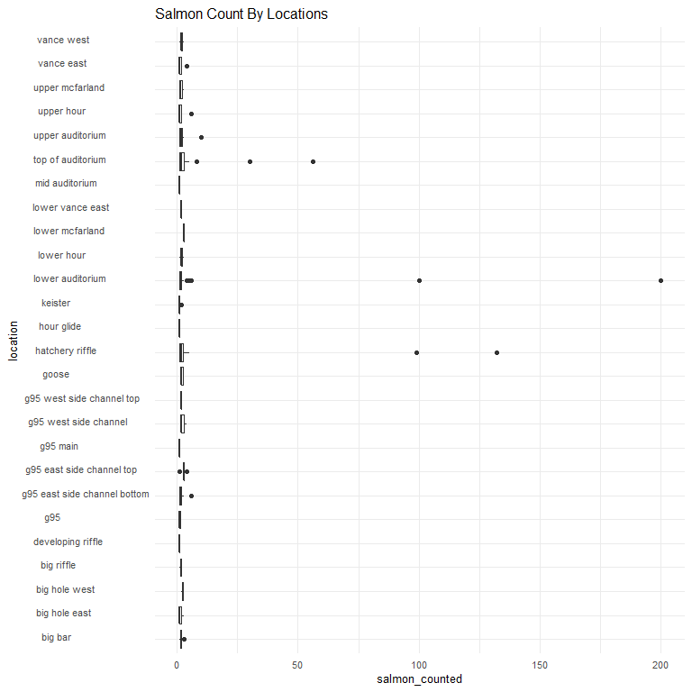
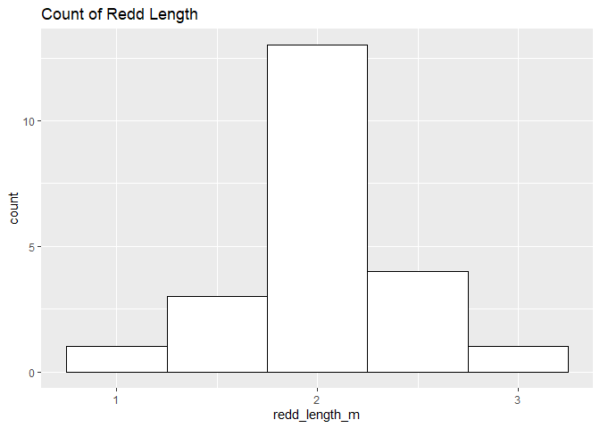
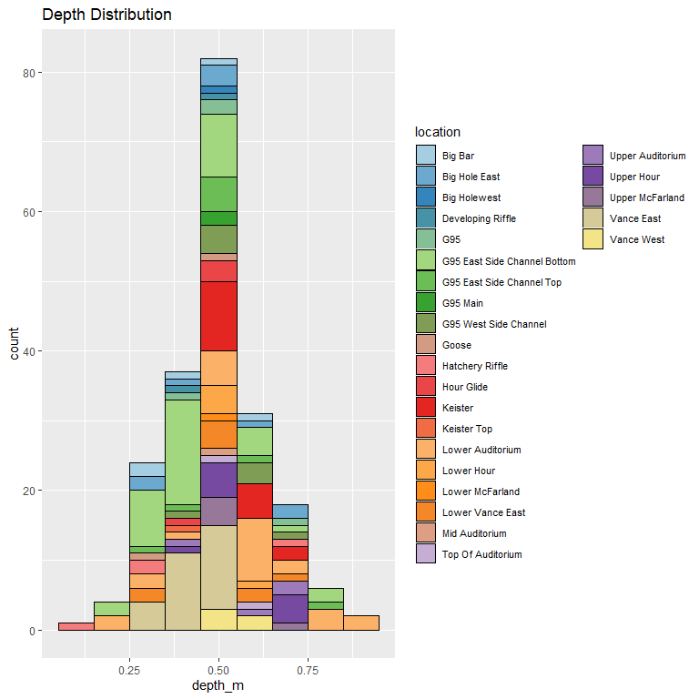

feather-river-redd-survey-qc-checklist-2013
================
Inigo Peng
10/6/2021

# Feather River Redd Survey Data

## Description of Monitoring Data

**Timeframe:** 2013

**Completeness of Record throughout timeframe: **  

-   Longitude and latitude data are not available for 2009, 2010, 2011,
    2012, 2019, 2020. NA values will be filled in for these data sets in
    final cleaned data set.

**Sampling Location:** Feather River

**Data Contact:** [Chris Cook](Chris.Cook@water.ca.gov)

Additional Info:  
1. Latitude and longitude are in NAD 1983 UTM Zone 10N  
2. The substrate is observed visually and an estimate of the percentage
of 5 size classes:  
\* fines &lt;1cm  
\* small 1-5cm  
\* medium 6-15cm  
\* large 16-30cm  
\* boulder &gt;30cm

## Access Cloud Data

``` r
# Run Sys.setenv() to specify GCS_AUTH_FILE and GCS_DEFAULT_BUCKET before running
# Open object from google cloud storage
# Set your authentication using gcs_auth
gcs_auth(json_file = Sys.getenv("GCS_AUTH_FILE"))
# Set global bucket 
gcs_global_bucket(bucket = Sys.getenv("GCS_DEFAULT_BUCKET"))
gcs_list_objects()
# git data and save as xlsx
gcs_get_object(object_name = "adult-holding-redd-and-carcass-surveys/feather-river/data-raw/redd_survey/2013_Chinook_Redd_Survey_Data_raw.xlsx",
               bucket = gcs_get_global_bucket(),
               saveToDisk = "2013_Chinook_Redd_Survey_Data_raw.xlsx",
               overwrite = TRUE)
```

Read in data from google cloud, glimpse raw data:

``` r
raw_data_2013 = readxl::read_excel("2013_Chinook_Redd_Survey_Data_raw.xlsx")
glimpse(raw_data_2013)
```

    ## Rows: 748
    ## Columns: 19
    ## $ All               <chr> "41527", "41527", "41527", "41527", "41527", "41527"~
    ## $ `Survey Wk`       <chr> "1-1", "1-1", "1-1", "1-1", "1-1", "1-1", "1-1", "1-~
    ## $ Location          <chr> "Lower Auditorium", "Lower Auditorium", "Lower Audit~
    ## $ `File #`          <dbl> 3, 4, 5, 6, 7, 8, 9, 10, 11, 12, 13, 14, 15, 16, 17,~
    ## $ type              <chr> "p", "p", "p", "p", "p", "p", "p", "p", "p", "p", "p~
    ## $ `# of redds`      <dbl> 1, 1, 1, 1, 1, 1, 1, 1, 1, 1, 1, 1, 1, 1, 1, 1, 1, 1~
    ## $ `# salmon`        <dbl> 0, 1, 1, 0, 1, 0, 3, 1, 0, 0, 0, 1, 1, 0, 1, 0, 2, 0~
    ## $ Latitude          <dbl> 393055.9, 393056.1, 393055.7, 393055.8, 393056.5, 39~
    ## $ Longitude         <dbl> 1213338, 1213338, 1213338, 1213338, 1213337, 1213337~
    ## $ `Depth (m)`       <dbl> NA, NA, NA, NA, NA, NA, NA, NA, NA, 0.25, NA, NA, NA~
    ## $ `Pot Depth (m)`   <dbl> NA, NA, NA, NA, NA, NA, NA, NA, NA, 0.43, NA, NA, NA~
    ## $ `Velocity (m/s)`  <dbl> NA, NA, NA, NA, NA, NA, NA, NA, NA, 0.71, NA, NA, NA~
    ## $ `% fines`         <dbl> NA, NA, NA, NA, NA, NA, NA, NA, NA, 10, NA, NA, NA, ~
    ## $ `% small`         <dbl> NA, NA, NA, NA, NA, NA, NA, NA, NA, 50, NA, NA, NA, ~
    ## $ `% med`           <dbl> NA, NA, NA, NA, NA, NA, NA, NA, NA, 25, NA, NA, NA, ~
    ## $ `% large`         <dbl> NA, NA, NA, NA, NA, NA, NA, NA, NA, 15, NA, NA, NA, ~
    ## $ `% boulder`       <dbl> NA, NA, NA, NA, NA, NA, NA, NA, NA, 0, NA, NA, NA, N~
    ## $ `redd width (m)`  <dbl> NA, NA, NA, NA, NA, NA, NA, NA, NA, 1, NA, NA, NA, N~
    ## $ `redd length (m)` <dbl> NA, NA, NA, NA, NA, NA, NA, NA, NA, 1.5, NA, NA, NA,~

## Data Transformation

``` r
cleaner_data_2013 <- raw_data_2013 %>% 
  select(-c('Survey Wk', 'File #', '# of redds')) %>% 
  rename('Date' = All,
         'salmon_counted'= '# salmon',
         'latitude' = 'Latitude',
         'longitude' = 'Longitude',
         'depth_m' = 'Depth (m)',
         'pot_depth_m' = 'Pot Depth (m)',
         'velocity_m/s' = 'Velocity (m/s)',
         'percent_fine_substrate' = '% fines',
         'percent_small_substrate' = '% small',
         'percent_medium_substrate'= '% med',
         'percent_large_substrate' = '% large',
         'percent_boulder' = '% boulder',
         'redd_width_m' = 'redd width (m)',
         'redd_length_m' = 'redd length (m)',
         ) %>%
  mutate(Date = as.Date(as.numeric(Date), origin = "1899-12-30")) %>% 
  filter(salmon_counted > 0, rm.na = TRUE) %>% 
  glimpse()
```

    ## Rows: 384
    ## Columns: 16
    ## $ Date                     <date> 2013-09-10, 2013-09-10, 2013-09-10, 2013-09-~
    ## $ Location                 <chr> "Lower Auditorium", "Lower Auditorium", "Lowe~
    ## $ type                     <chr> "p", "p", "p", "p", "p", "p", "p", "p", "p", ~
    ## $ salmon_counted           <dbl> 1, 1, 1, 3, 1, 1, 1, 1, 2, 1, 1, 1, 1, 1, 1, ~
    ## $ latitude                 <dbl> 393056.1, 393055.7, 393056.5, 393056.5, 39305~
    ## $ longitude                <dbl> 1213338, 1213338, 1213337, 1213334, 1213334, ~
    ## $ depth_m                  <dbl> NA, NA, NA, NA, NA, NA, NA, NA, NA, NA, NA, N~
    ## $ pot_depth_m              <dbl> NA, NA, NA, NA, NA, NA, NA, NA, NA, NA, NA, N~
    ## $ `velocity_m/s`           <dbl> NA, NA, NA, NA, NA, NA, NA, NA, NA, NA, NA, N~
    ## $ percent_fine_substrate   <dbl> NA, NA, NA, NA, NA, NA, NA, NA, NA, NA, NA, N~
    ## $ percent_small_substrate  <dbl> NA, NA, NA, NA, NA, NA, NA, NA, NA, NA, NA, N~
    ## $ percent_medium_substrate <dbl> NA, NA, NA, NA, NA, NA, NA, NA, NA, NA, NA, N~
    ## $ percent_large_substrate  <dbl> NA, NA, NA, NA, NA, NA, NA, NA, NA, NA, NA, N~
    ## $ percent_boulder          <dbl> NA, NA, NA, NA, NA, NA, NA, NA, NA, NA, NA, N~
    ## $ redd_width_m             <dbl> NA, NA, NA, NA, NA, NA, NA, NA, NA, NA, NA, N~
    ## $ redd_length_m            <dbl> NA, NA, NA, NA, NA, NA, NA, NA, NA, NA, NA, N~

``` r
cleaner_data_2013 <- cleaner_data_2013 %>% 
  set_names(tolower(colnames(cleaner_data_2013))) %>% 
  mutate(date = as.Date(date)) %>% 
  glimpse()
```

    ## Rows: 384
    ## Columns: 16
    ## $ date                     <date> 2013-09-10, 2013-09-10, 2013-09-10, 2013-09-~
    ## $ location                 <chr> "Lower Auditorium", "Lower Auditorium", "Lowe~
    ## $ type                     <chr> "p", "p", "p", "p", "p", "p", "p", "p", "p", ~
    ## $ salmon_counted           <dbl> 1, 1, 1, 3, 1, 1, 1, 1, 2, 1, 1, 1, 1, 1, 1, ~
    ## $ latitude                 <dbl> 393056.1, 393055.7, 393056.5, 393056.5, 39305~
    ## $ longitude                <dbl> 1213338, 1213338, 1213337, 1213334, 1213334, ~
    ## $ depth_m                  <dbl> NA, NA, NA, NA, NA, NA, NA, NA, NA, NA, NA, N~
    ## $ pot_depth_m              <dbl> NA, NA, NA, NA, NA, NA, NA, NA, NA, NA, NA, N~
    ## $ `velocity_m/s`           <dbl> NA, NA, NA, NA, NA, NA, NA, NA, NA, NA, NA, N~
    ## $ percent_fine_substrate   <dbl> NA, NA, NA, NA, NA, NA, NA, NA, NA, NA, NA, N~
    ## $ percent_small_substrate  <dbl> NA, NA, NA, NA, NA, NA, NA, NA, NA, NA, NA, N~
    ## $ percent_medium_substrate <dbl> NA, NA, NA, NA, NA, NA, NA, NA, NA, NA, NA, N~
    ## $ percent_large_substrate  <dbl> NA, NA, NA, NA, NA, NA, NA, NA, NA, NA, NA, N~
    ## $ percent_boulder          <dbl> NA, NA, NA, NA, NA, NA, NA, NA, NA, NA, NA, N~
    ## $ redd_width_m             <dbl> NA, NA, NA, NA, NA, NA, NA, NA, NA, NA, NA, N~
    ## $ redd_length_m            <dbl> NA, NA, NA, NA, NA, NA, NA, NA, NA, NA, NA, N~

## Explore Categorical Variables

``` r
cleaner_data_2013 %>% 
  select_if(is.character) %>% colnames()
```

    ## [1] "location" "type"

### Variable:`location`

``` r
table(cleaner_data_2013$location)
```

    ## 
    ##           Big Bar     Big Hole East      Big HoleWest        Big Riffle 
    ##                 7                 7                 2                 3 
    ## Developing Riffle               G95   G95 East Bottom      G95 East Top 
    ##                 1                 3                20                 5 
    ##          G95 Main          G95 West      G95 West Top             Goose 
    ##                 1                 5                 1                 3 
    ##   Hatchery Riffle        Hour Glide           Keister  Lower Auditorium 
    ##                42                 1                 5               173 
    ##        lower Hour   Lower McFarland  Lower Vance East    Mid Auditorium 
    ##                 4                 1                 2                 5 
    ## Top of Auditorium  Upper Auditorium        Upper Hour   Upper McFarland 
    ##                23                28                10                 4 
    ##        Vance East  Vance East Lower        Vance West 
    ##                21                 3                 4

Locations names are changed to be consistent with the rest of the
Feather River redd survey files:

``` r
cleaner_data_2013 <- cleaner_data_2013 %>% 
  mutate(location = tolower(location),
         location = if_else(location == "big holewest", "big hole west", location),
         location = if_else(location == "g95 east bottom", "g95 east side channel bottom", location),
         location = if_else(location == "g95 east top", "g95 east side channel top", location),
         location = if_else(location == "g95 west", "g95 west side channel", location),
         location = if_else(location == "g95 west top", "g95 west side channel top", location),
         location = if_else(location == "vance east lower", "lower vance east", location),
         )
table(cleaner_data_2013$location)
```

    ## 
    ##                      big bar                big hole east 
    ##                            7                            7 
    ##                big hole west                   big riffle 
    ##                            2                            3 
    ##            developing riffle                          g95 
    ##                            1                            3 
    ## g95 east side channel bottom    g95 east side channel top 
    ##                           20                            5 
    ##                     g95 main        g95 west side channel 
    ##                            1                            5 
    ##    g95 west side channel top                        goose 
    ##                            1                            3 
    ##              hatchery riffle                   hour glide 
    ##                           42                            1 
    ##                      keister             lower auditorium 
    ##                            5                          173 
    ##                   lower hour              lower mcfarland 
    ##                            4                            1 
    ##             lower vance east               mid auditorium 
    ##                            5                            5 
    ##            top of auditorium             upper auditorium 
    ##                           23                           28 
    ##                   upper hour              upper mcfarland 
    ##                           10                            4 
    ##                   vance east                   vance west 
    ##                           21                            4

-   0 % of values in the `location` column are NA.

## Variable:`Type`

Description:  
Area - polygon mapped with Trimble GPS unit Point - points mapped with
Trimble GPS unit Questionable redds - polygon mapped with Trimble GPS
unit where the substrate was disturbed but did not have the proper
characteristics to be called a redd - it was no longer recorded after
2013

``` r
table(cleaner_data_2013$type)
```

    ## 
    ##   A   p 
    ##   7 377

``` r
cleaner_data_2013 <- cleaner_data_2013 %>% 
  mutate(type = tolower(type),
         type = if_else(type == 'a', 'Area', type),
         type = if_else(type == 'p', 'Point', type),
         type = if_else(type == 'q', 'Questionable Redds', type))
table(cleaner_data_2013$type)
```

    ## 
    ##  Area Point 
    ##     7   377

## Expore Numeric Variables

``` r
cleaner_data_2013 %>% 
  select_if(is.numeric) %>% colnames()
```

    ##  [1] "salmon_counted"           "latitude"                
    ##  [3] "longitude"                "depth_m"                 
    ##  [5] "pot_depth_m"              "velocity_m/s"            
    ##  [7] "percent_fine_substrate"   "percent_small_substrate" 
    ##  [9] "percent_medium_substrate" "percent_large_substrate" 
    ## [11] "percent_boulder"          "redd_width_m"            
    ## [13] "redd_length_m"

### Variable:`salmon_counted`

#### Plotting salmon counted in 2013

``` r
cleaner_data_2013 %>% 
  ggplot(aes(x = date, y = salmon_counted)) + 
  geom_col() +
  facet_wrap(~year(date), scales = "free") +
  scale_x_date(labels = date_format("%b"), date_breaks = "1 month")+
  theme_minimal() +
  theme(axis.text.x = element_text(size = 10,angle = 90, vjust = 0.5, hjust=0.1)) +
  theme(axis.text.y = element_text(size = 8))+
  labs(title = "Daily Salmon Counted in 2013")
```

<!-- -->
**Numeric Daily Summary of salmon\_counted Over 2013**

``` r
cleaner_data_2013 %>%
  group_by(date) %>%
  summarise(count = sum(salmon_counted, na.rm = T)) %>%
  pull(count) %>%
  summary()
```

    ##    Min. 1st Qu.  Median    Mean 3rd Qu.    Max. 
    ##     2.0    25.5    57.0    98.0   100.5   382.0

``` r
cleaner_data_2013  %>%
  ggplot(aes(y = location, x = salmon_counted))+
  geom_boxplot() +
  theme_minimal() +
  theme(text = element_text(size = 10))+
  scale_y_discrete()+
  theme(axis.text.y = element_text(size = 8,vjust = 0.1, hjust=0.2))+
  labs(title = "Salmon Count By Locations")
```

<!-- -->
**Numeric summary of salmon\_counted by location in 2013**

``` r
cleaner_data_2013 %>%
  group_by(location) %>% 
  summarise(count = sum(salmon_counted, na.rm = T)) %>% 
  pull(count) %>%
  summary()
```

    ##    Min. 1st Qu.  Median    Mean 3rd Qu.    Max. 
    ##    1.00    5.00    8.00   52.77   16.25  651.00

**NA and Unknown Values** \* 0 % of values in the `salmon_counted`
column are NA.

### Variable:`redd_width_m`

``` r
cleaner_data_2013 %>%
  group_by(location) %>%
  summarise(mean_redd_width = mean(redd_width_m, na.rm = TRUE)) %>%
  ggplot(aes(y = location, x = mean_redd_width)) +
  geom_col() +
  theme_minimal() +
  theme(text = element_text(size = 8)) +
  labs(title = "Mean Redd Width By Location")
```

<!-- -->

``` r
cleaner_data_2013 %>%
  ggplot(aes(x = redd_width_m)) +
  geom_histogram(binwidth = 0.5, color = "black", fill = "white") +
  scale_x_continuous(breaks = round(seq(min(cleaner_data_2013$redd_width_m, na.rm = TRUE), max(cleaner_data_2013$redd_width_m, na.rm = TRUE), by = 0.5),0))+
  labs(title = "Count of Redd Width")
```

<!-- -->

**Numeric Summary of redd\_width\_m Over 2013**

``` r
summary(cleaner_data_2013$redd_width_m)
```

    ##    Min. 1st Qu.  Median    Mean 3rd Qu.    Max.    NA's 
    ##   0.500   1.000   1.375   1.329   1.500   2.000     362

**NA and Unknown Values** \* 94.3 % of values in the `redd_width_m`
column are NA.

### Variable: `redd_length_m`

``` r
cleaner_data_2013 %>%
  group_by(location) %>%
  summarise(mean_redd_length = mean(redd_length_m, na.rm = TRUE)) %>%
  ggplot(aes(y = location, x = mean_redd_length)) +
  geom_col() +
  theme_minimal() +
  theme(text = element_text(size = 8)) +
  labs(title = "Mean Redd Length By Location")
```

<!-- -->

``` r
cleaner_data_2013 %>%
  ggplot(aes(x = redd_length_m)) +
  geom_histogram(binwidth = 0.5, color = "black", fill = "white") +
  scale_x_continuous(breaks = round(seq(min(cleaner_data_2013$redd_length_m, na.rm = TRUE), max(cleaner_data_2013$redd_length_m, na.rm = TRUE), by = 1),1))+
  labs(title = "Count of Redd Length")
```

<!-- -->

**Numeric Summary of redd\_length\_m Over 2013**

``` r
summary(cleaner_data_2013$redd_length_m)
```

    ##    Min. 1st Qu.  Median    Mean 3rd Qu.    Max.    NA's 
    ##   1.000   2.000   2.000   2.023   2.000   3.000     362

**NA and Unknown Values** \* 94.3 % of values in the `redd_length_m`
column are NA.

### Location Physical Attributes

### Variable:`percent_fine_substrate`

``` r
cleaner_data_2013 %>%
  group_by(location) %>% 
  summarise(mean_fine_substrate = mean(percent_fine_substrate, na.rm = TRUE)) %>%
  ggplot(aes(y = location, x = mean_fine_substrate)) +
  geom_col() +
  theme_minimal() +
  theme(text = element_text(size = 8)) +
  labs(title = "Average Percentage of Fine Substrate By Location")
```

<!-- -->

**Numeric Summary of percent\_fine\_substrate Over 2013**

``` r
summary(cleaner_data_2013$percent_fine_substrate)
```

    ##    Min. 1st Qu.  Median    Mean 3rd Qu.    Max.    NA's 
    ##    5.00    5.00   10.00   10.91   10.00   50.00     362

**NA and Unknown Values** \* 94.3 % of values in the
`percent_fine_substrate` column are NA.

### Variable:`percent_small_substrate`

``` r
cleaner_data_2013 %>%
  group_by(location) %>% 
  summarise(mean_small_substrate = mean(percent_small_substrate, na.rm = TRUE)) %>%
  ggplot(aes(y = location, x = mean_small_substrate)) +
  geom_col() +
  theme_minimal() +
  theme(text = element_text(size = 8)) +
  labs(title = "Average Percentage of Small Substrate By Location")
```

<!-- -->

**Numeric Summary of percent\_small\_substrate Over 2013**

``` r
summary(cleaner_data_2013$percent_small_substrate)
```

    ##    Min. 1st Qu.  Median    Mean 3rd Qu.    Max.    NA's 
    ##    5.00   11.25   20.00   20.00   20.00   50.00     362

**NA and Unknown Values** \* 94.3 % of values in the
`percent_small_substrate` column are NA.

### Variable:`percent_medium_substrate`

``` r
cleaner_data_2013 %>%
  group_by(location) %>% 
  summarise(mean_medium_substrate = mean(percent_medium_substrate, na.rm = TRUE)) %>%
  ggplot(aes(y = location, x = mean_medium_substrate)) +
  geom_col() +
  theme_minimal() +
  theme(text = element_text(size = 8)) +
  labs(title = "Average Percentage of Medium Substrate By Location")
```

<!-- -->

**Numeric Summary of percent\_medium\_substrate Over 2013**

``` r
summary(cleaner_data_2013$percent_medium_substrate)
```

    ##    Min. 1st Qu.  Median    Mean 3rd Qu.    Max.    NA's 
    ##   15.00   25.00   30.00   36.36   50.00   70.00     362

**NA and Unknown Values** \* 94.3 % of values in the
`percent_medium_substrate` column are NA.

### Variable:`percent_large_substrate`

``` r
cleaner_data_2013 %>%
  group_by(location) %>% 
  summarise(mean_large_substrate = mean(percent_large_substrate, na.rm = TRUE)) %>%
  ggplot(aes(y = location, x = mean_large_substrate)) +
  geom_col() +
  theme_minimal() +
  theme(text = element_text(size = 8)) +
  labs(title = "Average Percentage of Large Substrate By Location")
```

<!-- -->

**Numeric Summary of percent\_large\_substrate Over 2013**

``` r
summary(cleaner_data_2013$percent_large_substrate)
```

    ##    Min. 1st Qu.  Median    Mean 3rd Qu.    Max.    NA's 
    ##    0.00   20.00   30.00   29.09   35.00   65.00     362

**NA and Unknown Values** \* 94.3 % of values in the
`percent_large_substrate` column are NA.

### Variable:`percent_boulder`

``` r
cleaner_data_2013 %>%
  group_by(location) %>% 
  summarise(mean_boulder = mean(percent_boulder, na.rm = TRUE)) %>%
  ggplot(aes(y = location, x = mean_boulder)) +
  geom_col() +
  theme_minimal() +
  theme(text = element_text(size = 8)) +
  labs(title = "Average Percentage of Boulder By Location")
```

<!-- -->

**Numeric Summary of percent\_boulder Over 2013**

``` r
summary(cleaner_data_2013$percent_large_substrate)
```

    ##    Min. 1st Qu.  Median    Mean 3rd Qu.    Max.    NA's 
    ##    0.00   20.00   30.00   29.09   35.00   65.00     362

**NA and Unknown Values** NA and Unknown Values\*\* \* 94.3 % of values
in the `percent_large_substrate` column are NA.

### Variable: `depth_m`

``` r
cleaner_data_2013 %>% 
  ggplot(aes(x = depth_m, y = location)) + 
  geom_col() + 
  theme_minimal() + 
  theme(text = element_text(size = 8))+
  labs(title = "Depth By Location")
```

<!-- -->
**Numeric Summary of depth\_m Over 2013**

``` r
summary(cleaner_data_2013$depth_m)
```

    ##    Min. 1st Qu.  Median    Mean 3rd Qu.    Max.    NA's 
    ##  0.1200  0.4300  0.4900  0.4996  0.5550  0.9200     281

**NA and Unknown Values** NA and Unknown Values\*\* \* 73.2 % of values
in the `depth_m` column are NA.

### Variable: `pot_depth_m`

``` r
cleaner_data_2013 %>% 
  ggplot(aes(x = pot_depth_m, y = location)) + 
  geom_col() + 
  theme_minimal() + 
  theme(text = element_text(size = 8))+
  labs(title = "Pot Depth By Location")
```

<!-- -->
**Numeric Summary of pot\_depth\_m Over 2013**

``` r
summary(cleaner_data_2013$pot_depth_m)
```

    ##    Min. 1st Qu.  Median    Mean 3rd Qu.    Max.    NA's 
    ##  0.2600  0.4925  0.6150  0.6014  0.7475  0.9200     362

**NA and Unknown Values** NA and Unknown Values\*\* \* 94.3 % of values
in the `pot_depth_m` column are NA.

### Variable: `velocity_m/s`

``` r
cleaner_data_2013 %>% 
  ggplot(aes(x = `velocity_m/s`, y = location)) + 
  geom_col() + 
  theme_minimal() + 
  theme(text = element_text(size = 8))+
  labs(title = "Velocity By Location")
```

<!-- -->
**Numeric Summary of velocity\_m/s Over 2013**

``` r
summary(cleaner_data_2013$`velocity_m/s`)
```

    ##    Min. 1st Qu.  Median    Mean 3rd Qu.    Max.    NA's 
    ## -0.0400  0.3475  0.4900  0.4418  0.5750  0.7500     362

**NA and Unknown Values** NA and Unknown Values\*\* \* 94.3 % of values
in the `velocity_m/s` column are NA.
