feather-river-redd-survey-qc-checklist-2016
================
Inigo Peng
10/6/2021

# Feather River Redd Survey Data

## Description of Monitoring Data

**Timeframe:** 2016

**Completeness of Record throughout timeframe:**

-   Longitude and latitude data are not available for 2009, 2010, 2011,
    2012, 2019, 2020. NA values will be filled in for these data sets in
    final cleaned data set.

**Sampling Location:** Various sampling locations on Feather River.

**Data Contact:** [Chris Cook](mailto::Chris.Cook@water.ca.gov)

Additional Info:  
1. Latitude and longitude are in NAD 1983 UTM Zone 10N  
2. The substrate is observed visually and an estimate of the percentage
of 5 size classes:

-   fines &lt;1cm  
-   small 1-5cm  
-   medium 6-15cm  
-   large 16-30cm  
-   boulder &gt;30cm

## Access Cloud Data

``` r
# Run Sys.setenv() to specify GCS_AUTH_FILE and GCS_DEFAULT_BUCKET before running
# Open object from google cloud storage
# Set your authentication using gcs_auth
gcs_auth(json_file = Sys.getenv("GCS_AUTH_FILE"))
# Set global bucket 
gcs_global_bucket(bucket = Sys.getenv("GCS_DEFAULT_BUCKET"))
gcs_list_objects()
# git data and save as xlsx
gcs_get_object(object_name = "adult-holding-redd-and-carcass-surveys/feather-river/data-raw/redd_survey/2016_Chinook_Redd_Survey_Data_raw.xlsx",
               bucket = gcs_get_global_bucket(),
               saveToDisk = "2016_Chinook_Redd_Survey_Data_raw.xlsx",
               overwrite = TRUE)
```

Read in data from google cloud, glimpse raw data:

``` r
raw_data_2016 = readxl::read_excel("2016_Chinook_Redd_Survey_Data_raw.xlsx")
glimpse(raw_data_2016)
```

    ## Rows: 1,570
    ## Columns: 19
    ## $ Date              <dttm> 2016-09-20, 2016-09-20, 2016-09-20, 2016-09-20, 201~
    ## $ `Survey Wk`       <chr> "1-1", "1-1", "1-1", "1-1", "1-1", "1-1", "1-1", "1-~
    ## $ Location          <chr> "Cottonwood", "Cottonwood", "Cottonwood", "Cottonwoo~
    ## $ `File #`          <dbl> 1, 2, 3, 4, 5, 6, 7, 8, 9, 10, 11, 12, 13, 14, 15, 1~
    ## $ type              <chr> "p", "p", "p", "p", "p", "p", "p", "p", "p", "p", "p~
    ## $ `# of redds`      <dbl> 1, 1, 1, 1, 1, 1, 1, 1, 1, 1, 1, 1, 1, 1, 1, 1, 1, 1~
    ## $ `# salmon`        <dbl> 0, 0, 0, 0, 3, 0, 0, 3, 0, 2, 1, 0, 5, 0, 2, 3, 1, 0~
    ## $ `Latitude mN`     <dbl> 4375097, 4375101, 4375108, 4375111, 4375123, 4375135~
    ## $ `Longitude mE`    <dbl> 624148.9, 624146.1, 624152.3, 624169.5, 624172.1, 62~
    ## $ `Depth (m)`       <dbl> NA, NA, NA, NA, NA, NA, NA, 0.54, NA, NA, NA, NA, 0.~
    ## $ `Pot Depth (m)`   <dbl> NA, NA, NA, NA, NA, NA, NA, 0.62, NA, NA, NA, NA, 0.~
    ## $ `Velocity (m/s)`  <dbl> NA, NA, NA, NA, NA, NA, NA, 0.34, NA, NA, NA, NA, 0.~
    ## $ `% fines`         <dbl> NA, NA, NA, NA, NA, NA, NA, 10, NA, NA, NA, NA, 5, N~
    ## $ `% small`         <dbl> NA, NA, NA, NA, NA, NA, NA, 30, NA, NA, NA, NA, 30, ~
    ## $ `% med`           <dbl> NA, NA, NA, NA, NA, NA, NA, 40, NA, NA, NA, NA, 50, ~
    ## $ `% large`         <dbl> NA, NA, NA, NA, NA, NA, NA, 10, NA, NA, NA, NA, 15, ~
    ## $ `% boulder`       <dbl> NA, NA, NA, NA, NA, NA, NA, 10, NA, NA, NA, NA, 0, N~
    ## $ `redd width (m)`  <dbl> NA, NA, NA, NA, NA, NA, NA, 1.0, NA, NA, NA, NA, 1.0~
    ## $ `redd length (m)` <dbl> NA, NA, NA, NA, NA, NA, NA, 2.5, NA, NA, NA, NA, 1.5~

## Data Transformations

``` r
cleaner_data_2016 <- raw_data_2016 %>% 
  select(-c('Survey Wk', 'File #')) %>% 
  rename('redd_count' = '# of redds',
         'salmon_count'= '# salmon',
         'latitude' = 'Latitude mN',
         'longitude' = 'Longitude mE',
         'depth_m' = 'Depth (m)',
         'pot_depth_m' = 'Pot Depth (m)',
         'velocity_m_per_s' = 'Velocity (m/s)',
         'percent_fine_substrate' = '% fines',
         'percent_small_substrate' = '% small',
         'percent_medium_substrate'= '% med',
         'percent_large_substrate' = '% large',
         'percent_boulder' = '% boulder',
         'redd_width_m' = 'redd width (m)',
         'redd_length_m' = 'redd length (m)',
         ) %>% 
  mutate(Date = as.Date(Date))
cleaner_data_2016 <- cleaner_data_2016 %>% 
  set_names(tolower(colnames(cleaner_data_2016))) %>% 
  glimpse()
```

    ## Rows: 1,570
    ## Columns: 17
    ## $ date                     <date> 2016-09-20, 2016-09-20, 2016-09-20, 2016-09-~
    ## $ location                 <chr> "Cottonwood", "Cottonwood", "Cottonwood", "Co~
    ## $ type                     <chr> "p", "p", "p", "p", "p", "p", "p", "p", "p", ~
    ## $ redd_count               <dbl> 1, 1, 1, 1, 1, 1, 1, 1, 1, 1, 1, 1, 1, 1, 1, ~
    ## $ salmon_count             <dbl> 0, 0, 0, 0, 3, 0, 0, 3, 0, 2, 1, 0, 5, 0, 2, ~
    ## $ latitude                 <dbl> 4375097, 4375101, 4375108, 4375111, 4375123, ~
    ## $ longitude                <dbl> 624148.9, 624146.1, 624152.3, 624169.5, 62417~
    ## $ depth_m                  <dbl> NA, NA, NA, NA, NA, NA, NA, 0.54, NA, NA, NA,~
    ## $ pot_depth_m              <dbl> NA, NA, NA, NA, NA, NA, NA, 0.62, NA, NA, NA,~
    ## $ velocity_m_per_s         <dbl> NA, NA, NA, NA, NA, NA, NA, 0.34, NA, NA, NA,~
    ## $ percent_fine_substrate   <dbl> NA, NA, NA, NA, NA, NA, NA, 10, NA, NA, NA, N~
    ## $ percent_small_substrate  <dbl> NA, NA, NA, NA, NA, NA, NA, 30, NA, NA, NA, N~
    ## $ percent_medium_substrate <dbl> NA, NA, NA, NA, NA, NA, NA, 40, NA, NA, NA, N~
    ## $ percent_large_substrate  <dbl> NA, NA, NA, NA, NA, NA, NA, 10, NA, NA, NA, N~
    ## $ percent_boulder          <dbl> NA, NA, NA, NA, NA, NA, NA, 10, NA, NA, NA, N~
    ## $ redd_width_m             <dbl> NA, NA, NA, NA, NA, NA, NA, 1.0, NA, NA, NA, ~
    ## $ redd_length_m            <dbl> NA, NA, NA, NA, NA, NA, NA, 2.5, NA, NA, NA, ~

## Explore `date`

``` r
cleaner_data_2016 %>%
  ggplot(aes(x = date)) +
  geom_histogram(binwidth = 7, position = 'stack', color = "black") +
  labs(title = "Value Counts For Survey Season Dates")+
  theme(legend.text = element_text(size = 8))
```

<!-- -->

**Numeric Summary of `date` in 2016**

``` r
summary(cleaner_data_2016$date)
```

    ##         Min.      1st Qu.       Median         Mean      3rd Qu.         Max. 
    ## "2016-09-20" "2016-10-11" "2016-10-19" "2016-10-20" "2016-10-31" "2016-11-18"

**NA and Unknown Values**

-   0 % of values in the `date` column are NA.

## Explore Categorical Variables

``` r
cleaner_data_2016 %>% 
  select_if(is.character) %>% colnames()
```

    ## [1] "location" "type"

### Variable:`location`

``` r
table(cleaner_data_2016$location)
```

    ## 
    ##            Cottonwood       Hatchery Riffle      Lower Auditorium 
    ##                    56                   149                   701 
    ##     Middle Auditorium           Moe's Ditch     Top of Auditorium 
    ##                   105                    65                   156 
    ##      Upper Auditorium      Upper Cottonwood Upper Hatchery Riffle 
    ##                    89                    80                   169

Locations names are changed to be consistent with the rest of the
Feather River redd survey files:

``` r
cleaner_data_2016 <- cleaner_data_2016 %>% 
  mutate(location = if_else(location == "Moe's Ditch", "Moes Ditch", location),
        location = if_else(location == "Middle Auditorium", "Mid Auditorium", location))
table(cleaner_data_2016$location)
```

    ## 
    ##            Cottonwood       Hatchery Riffle      Lower Auditorium 
    ##                    56                   149                   701 
    ##        Mid Auditorium            Moes Ditch     Top of Auditorium 
    ##                   105                    65                   156 
    ##      Upper Auditorium      Upper Cottonwood Upper Hatchery Riffle 
    ##                    89                    80                   169

**NA and Unknown Values**

-   0 % of values in the `location` column are NA.

## Variable:`type`

Description:

-   Area - polygon mapped with Trimble GPS unit

-   Point - points mapped with Trimble GPS unit

-   Questionable redds - polygon mapped with Trimble GPS unit where the
    substrate was disturbed but did not have the proper characteristics
    to be called a redd - it was no longer recorded after 2011

``` r
table(cleaner_data_2016$type)
```

    ## 
    ##    p 
    ## 1570

``` r
cleaner_data_2016 <- cleaner_data_2016 %>% 
  mutate(type = tolower(type),
         type = if_else(type == 'p', 'Point', type))
table(cleaner_data_2016$type)
```

    ## 
    ## Point 
    ##  1570

## Expore Numeric Variables

``` r
cleaner_data_2016 %>% 
  select_if(is.numeric) %>% colnames()
```

    ##  [1] "redd_count"               "salmon_count"            
    ##  [3] "latitude"                 "longitude"               
    ##  [5] "depth_m"                  "pot_depth_m"             
    ##  [7] "velocity_m_per_s"         "percent_fine_substrate"  
    ##  [9] "percent_small_substrate"  "percent_medium_substrate"
    ## [11] "percent_large_substrate"  "percent_boulder"         
    ## [13] "redd_width_m"             "redd_length_m"

### Variable:`salmon_count`

``` r
cleaner_data_2016 %>% 
  ggplot(aes(x = date, y = salmon_count)) + 
  geom_col() +
  facet_wrap(~year(date), scales = "free") +
  scale_x_date(labels = date_format("%b"), date_breaks = "1 month")+
  theme_minimal() +
  theme(axis.text.x = element_text(size = 10,angle = 90, vjust = 0.5, hjust=0.1)) +
  theme(axis.text.y = element_text(size = 8))+
  labs(title = "Daily Salmon Count in 2016")
```

<!-- -->

**Numeric Daily Summary of salmon\_count Over 2016**

``` r
cleaner_data_2016 %>%
  group_by(date) %>%
  summarise(count = sum(salmon_count, na.rm = T)) %>%
  pull(count) %>%
  summary()
```

    ##    Min. 1st Qu.  Median    Mean 3rd Qu.    Max. 
    ##   14.00   24.00   35.50   53.83   77.50  137.00

``` r
#Find the most distinctive colours for visual
colourCount = length(unique(cleaner_data_2016$location))
getPalette = colorRampPalette(brewer.pal(12, "Paired"))

cleaner_data_2016  %>%
  ggplot(aes(x = salmon_count, fill = location))+
  scale_fill_manual(values = getPalette(colourCount))+
  geom_histogram() +
  theme_minimal() +
  theme(text = element_text(size = 7))+
  theme(axis.text.x = element_text(size = 10,vjust = 0.5, hjust=0.1))+
  labs(title = "Daily Salmon Count Distribution",
       x = 'Daily Salmon Count')+
  guides(fill = guide_legend(nrow = 13),
         shape = guide_legend(orride.aes = list(size =0.5)),
         color = guide_legend(orride.aes = list(size = 0.5)))
```

    ## `stat_bin()` using `bins = 30`. Pick better value with `binwidth`.

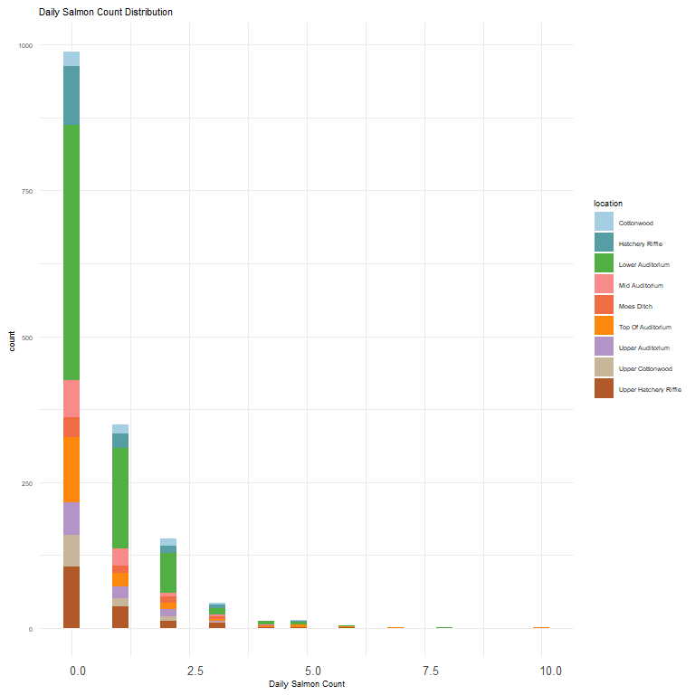<!-- -->

**Numeric summary of salmon\_count by location in 2016**

``` r
cleaner_data_2016 %>%
  group_by(location) %>% 
  summarise(count = sum(salmon_count, na.rm = T)) %>% 
  pull(count) %>%
  summary()
```

    ##    Min. 1st Qu.  Median    Mean 3rd Qu.    Max. 
    ##    44.0    53.0    67.0   107.7   101.0   402.0

**NA and Unknown Values**

-   0 % of values in the `salmon_count` column are NA.

### Variable:`redd_count`

``` r
cleaner_data_2016 %>% 
  filter(is.na(date)==FALSE) %>% 
  ggplot(aes(x = date, y = redd_count)) + 
  geom_col() +
  facet_wrap(~year(date), scales = "free") +
  scale_x_date(labels = date_format("%b"), date_breaks = "1 month")+
  theme_minimal() +
  theme(axis.text.x = element_text(size = 10,angle = 90, vjust = 0.5, hjust=0.1)) +
  theme(axis.text.y = element_text(size = 8))+
  labs(title = "Daily Count of Redds in 2016")
```

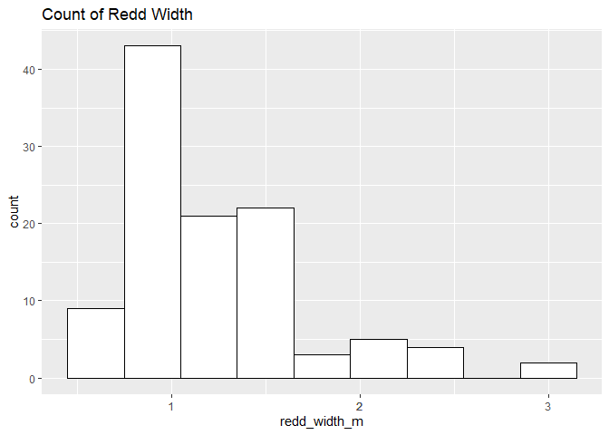<!-- -->

**Numeric Daily Summary of redd\_count Over 2016**

``` r
cleaner_data_2016 %>%
  group_by(date) %>%
  summarise(count = sum(redd_count, na.rm = T)) %>%
  pull(count) %>%
  summary()
```

    ##    Min. 1st Qu.  Median    Mean 3rd Qu.    Max. 
    ##   28.00   54.25   79.50   87.22  116.00  182.00

**NA and Unknown Values**

-   0 % of values in the `redd_count` column are NA.

### Variable:`redd_width_m`

``` r
cleaner_data_2016 %>%
  ggplot(aes(x = redd_width_m)) +
  geom_histogram(binwidth = 0.3, color = "black", fill = "white") +
  scale_x_continuous(breaks = round(seq(min(cleaner_data_2016$redd_width_m, na.rm = TRUE), max(cleaner_data_2016$redd_width_m, na.rm = TRUE), by = 0.5),0))+
  labs(title = "Redd Width Distribution")
```

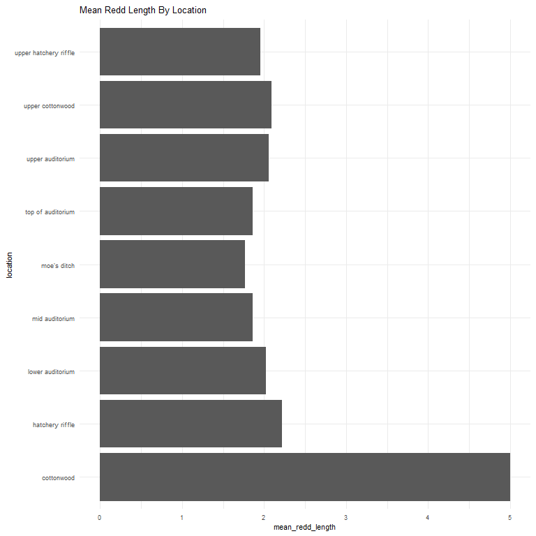<!-- -->

**Numeric Summary of redd\_width\_m Over 2016**

``` r
summary(cleaner_data_2016$redd_width_m)
```

    ##    Min. 1st Qu.  Median    Mean 3rd Qu.    Max.    NA's 
    ##   0.500   1.000   1.200   1.252   1.500   3.000    1461

**NA and Unknown Values**

-   93.1 % of values in the `redd_width_m` column are NA.

### Variable: `redd_length_m`

``` r
cleaner_data_2016 %>%
  ggplot(aes(x = redd_length_m)) +
  geom_histogram(binwidth = 0.5, color = "black", fill = "white") +
  scale_x_continuous(breaks = round(seq(min(cleaner_data_2016$redd_length_m, na.rm = TRUE), max(cleaner_data_2016$redd_length_m, na.rm = TRUE), by = 1),0))+
  labs(title = "Redd Length Distribution")
```

<!-- -->

**Numeric Summary of redd\_length\_m Over 2016**

``` r
summary(cleaner_data_2016$redd_length_m)
```

    ##    Min. 1st Qu.  Median    Mean 3rd Qu.    Max.    NA's 
    ##   0.900   1.500   2.000   2.004   2.500   5.000    1461

**NA and Unknown Values**

-   93.1 % of values in the `redd_length_m` column are NA.

\#\#\#Physical Attributes

### Variable: `longitude and latitude`

``` r
utm_coords <- na.omit(subset(cleaner_data_2016, select = c("longitude", "latitude")))
utm_coords <- SpatialPoints(utm_coords,
                            proj4string=CRS("+proj=utm +zone=10 +datum=WGS84"))
long_lat_coords <- spTransform(utm_coords, CRS("+proj=longlat +datum=WGS84"))
summary(long_lat_coords)
```

    ## Object of class SpatialPoints
    ## Coordinates:
    ##                  min        max
    ## longitude -121.56115 -121.55365
    ## latitude    39.51501   39.51689
    ## Is projected: FALSE 
    ## proj4string : [+proj=longlat +datum=WGS84 +no_defs]
    ## Number of points: 1570

**NA and Unknown Values**

-   0 % of values in the `longitude` column are NA.

-   0 % of values in the `latitude` column are NA.

### Variable:`percent_fine_substrate`

``` r
cleaner_data_2016 %>%
  ggplot(aes(x = percent_fine_substrate, fill = location)) +
  scale_fill_manual(values = getPalette(colourCount))+
  geom_histogram(binwidth = 5, position = 'stack', color = "black") +
  labs(title = "Percent Fine Substrate Distribution")+
  theme(legend.text = element_text(size = 8)) +
  guides(fill = guide_legend(nrow = 10))
```

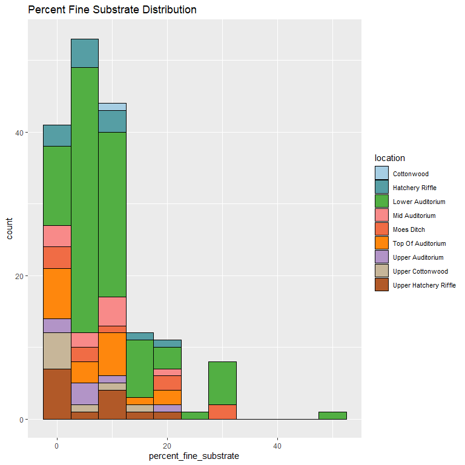<!-- -->

**Numeric Summary of percent\_fine\_substrate Over 2016**

``` r
summary(cleaner_data_2016$percent_fine_substrate)
```

    ##    Min. 1st Qu.  Median    Mean 3rd Qu.    Max.    NA's 
    ##   0.000   5.000   5.000   8.304  10.000  50.000    1399

**NA and Unknown Values**

-   89.1 % of values in the `percent_fine_substrate` column are NA.

### Variable:`percent_small_substrate`

``` r
cleaner_data_2016 %>%
  ggplot(aes(x = percent_small_substrate, fill = location)) +
  scale_fill_manual(values = getPalette(colourCount))+
  geom_histogram(binwidth = 10, position = 'stack', color = "black") +
  labs(title = "Percent Small Substrate Distribution")+
  theme(legend.text = element_text(size = 8)) +
  guides(fill = guide_legend(nrow = 10))
```

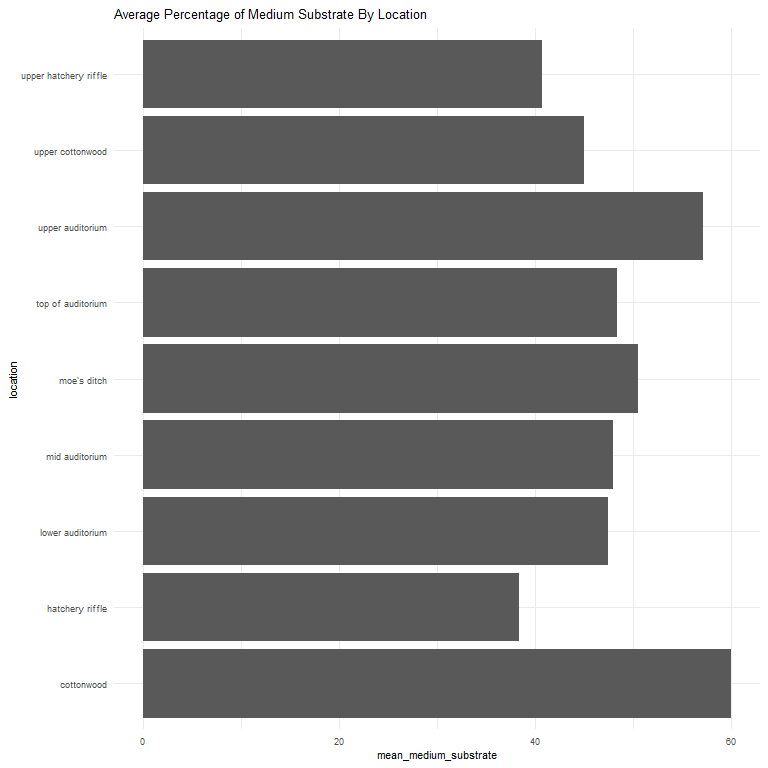<!-- -->

**Numeric Summary of percent\_small\_substrate Over 2016**

``` r
summary(cleaner_data_2016$percent_small_substrate)
```

    ##    Min. 1st Qu.  Median    Mean 3rd Qu.    Max.    NA's 
    ##    0.00   15.00   25.00   25.56   30.00   60.00    1399

**NA and Unknown Values**

-   89.1 % of values in the `percent_small_substrate` column are NA.

### Variable:`percent_medium_substrate`

``` r
cleaner_data_2016 %>%
  ggplot(aes(x = percent_medium_substrate, fill = location)) +
  scale_fill_manual(values = getPalette(colourCount))+
  geom_histogram(binwidth = 10, position = 'stack', color = "black") +
  labs(title = "Percent Medium Substrate Distribution")+
  theme(legend.text = element_text(size = 8)) +
  guides(fill = guide_legend(nrow = 10))
```

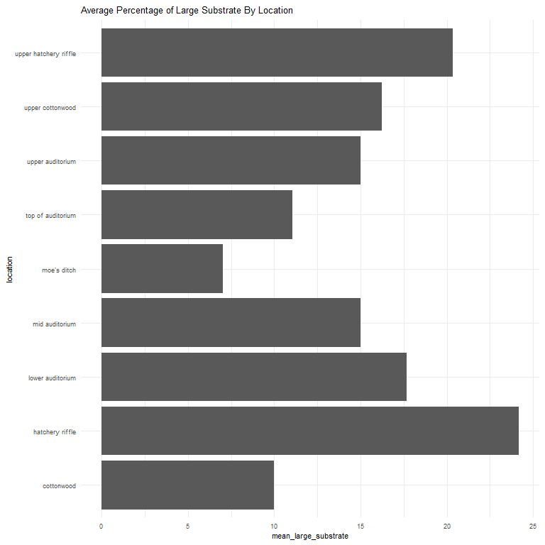<!-- -->

**Numeric Summary of percent\_medium\_substrate Over 2016**

``` r
summary(cleaner_data_2016$percent_medium_substrate)
```

    ##    Min. 1st Qu.  Median    Mean 3rd Qu.    Max.    NA's 
    ##    5.00   40.00   50.00   46.96   60.00   80.00    1399

**NA and Unknown Values**

-   89.1 % of values in the `percent_medium_substrate` column are NA.

### Variable:`percent_large_substrate`

``` r
cleaner_data_2016 %>%
  ggplot(aes(x = percent_large_substrate, fill = location)) +
  scale_fill_manual(values = getPalette(colourCount))+
  geom_histogram(binwidth = 10, position = 'stack', color = "black") +
  labs(title = "Percent Large Substrate Distribution")+
  theme(legend.text = element_text(size = 8)) +
  guides(fill = guide_legend(nrow = 10))
```

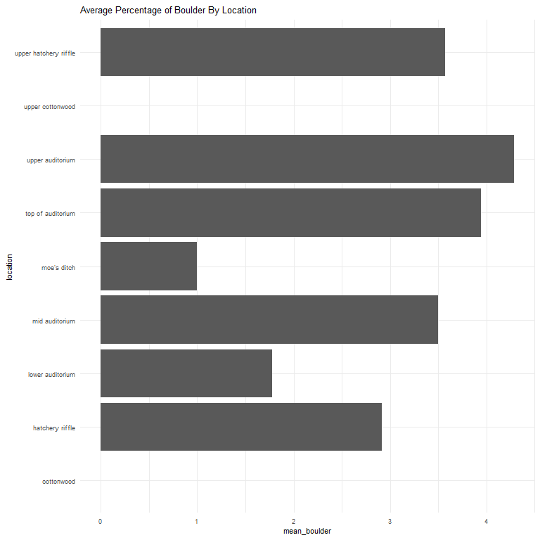<!-- -->

**Numeric Summary of percent\_large\_substrate Over 2016**

``` r
summary(cleaner_data_2016$percent_large_substrate)
```

    ##    Min. 1st Qu.  Median    Mean 3rd Qu.    Max.    NA's 
    ##    0.00    5.00   10.00   16.61   20.00   70.00    1399

**NA and Unknown Values**

-   89.1 % of values in the `percent_large_substrate` column are NA.

### Variable:`percent_boulder`

``` r
cleaner_data_2016 %>%
  ggplot(aes(x = percent_boulder, fill = location, )) +
  scale_fill_manual(values = getPalette(colourCount))+
  geom_histogram(binwidth = 7, position = 'stack', color = "black") +
  labs(title = "Percent Boulder Distribution")+
  theme(legend.text = element_text(size = 8)) +
  guides(fill = guide_legend(nrow = 10))
```

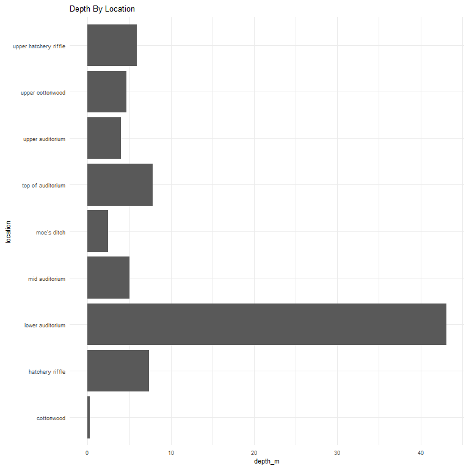<!-- -->

**Numeric Summary of percent\_boulder Over 2016**

``` r
summary(cleaner_data_2016$percent_large_substrate)
```

    ##    Min. 1st Qu.  Median    Mean 3rd Qu.    Max.    NA's 
    ##    0.00    5.00   10.00   16.61   20.00   70.00    1399

**NA and Unknown Values**

-   89.1 % of values in the `percent_boulder` column are NA.

### Summary of Mean Percent Substrate In Each Location

``` r
cleaner_data_2016 %>% 
  group_by(location) %>% 
  summarise(mean_percent_fine_substrate = mean(percent_fine_substrate, na.rm = TRUE),
            mean_percent_small_substrate = mean(percent_small_substrate, na.rm = TRUE),
            mean_percent_medium_substrate = mean(percent_medium_substrate, na.rm = TRUE),
            mean_percent_large_substrate = mean(percent_large_substrate, na.rm = TRUE),
            mean_percent_boulder = mean(percent_boulder, na.rm = TRUE),
            ) %>% 
  pivot_longer(
    cols = starts_with("mean"),
    names_to = "substrate_type",
    values_to = "percent",
    values_drop_na = TRUE
  ) %>%
  ggplot(aes(fill = substrate_type,
             y = location,
             x = percent))+
  geom_bar(position = 'stack', stat = 'identity', color = 'black')+
  labs(title = "Mean Percent Substrate by Location")
```

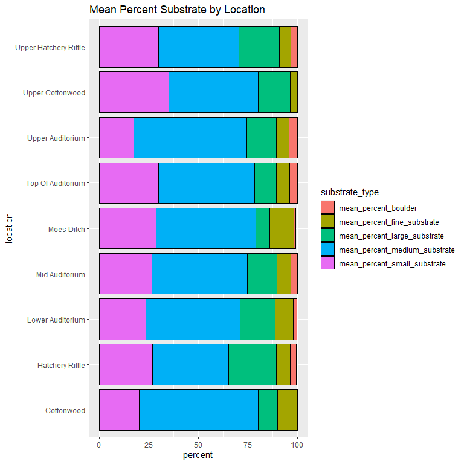<!-- -->

### Variable: `depth_m`

``` r
cleaner_data_2016 %>%
  ggplot(aes(x = depth_m, fill = location, )) +
  scale_fill_manual(values = getPalette(colourCount))+
  geom_histogram(binwidth = 0.15, position = 'stack', color = "black") +
  labs(title = "Depth Distribution")+
  theme(legend.text = element_text(size = 8)) +
  guides(fill = guide_legend(nrow = 10))
```

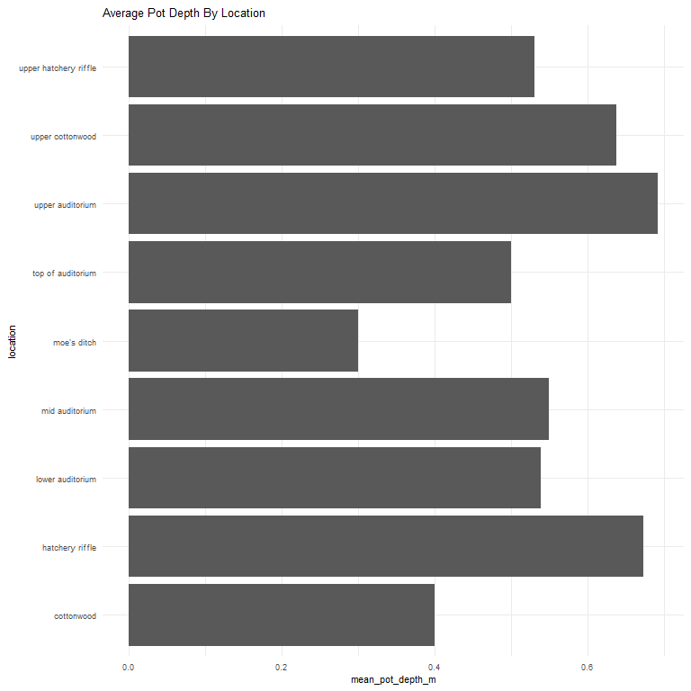<!-- -->

**Numeric Summary of depth\_m Over 2016**

``` r
summary(cleaner_data_2016$depth_m)
```

    ##    Min. 1st Qu.  Median    Mean 3rd Qu.    Max.    NA's 
    ##  0.1600  0.3400  0.4600  0.4743  0.6000  1.0800    1400

**NA and Unknown Values**

-   89.2 % of values in the `depth_m` column are NA.

### Variable: `pot_depth_m`

``` r
cleaner_data_2016 %>%
  ggplot(aes(x = pot_depth_m, fill = location, )) +
  scale_fill_manual(values = getPalette(colourCount))+
  geom_histogram(binwidth = 0.15, position = 'stack', color = "black") +
  labs(title = "Pot Depth Distribution")+
  theme(legend.text = element_text(size = 8)) +
  guides(fill = guide_legend(nrow = 10))
```

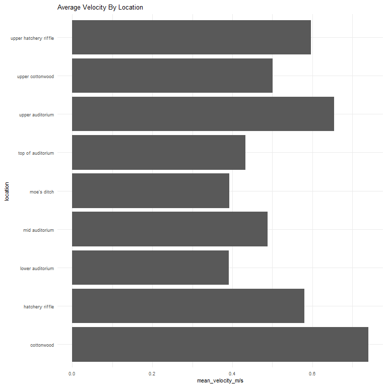<!-- -->

**Numeric Summary of pot\_depth\_m Over 2016**

``` r
summary(cleaner_data_2016$pot_depth_m)
```

    ##    Min. 1st Qu.  Median    Mean 3rd Qu.    Max.    NA's 
    ##  0.1900  0.4200  0.5400  0.5396  0.6400  1.0000    1400

**NA and Unknown Values** NA and Unknown Values\*\* \* 89.2 % of values
in the `pot_depth_m` column are NA.

### Variable: `velocity_m_per_s`

``` r
cleaner_data_2016 %>%
  ggplot(aes(x = velocity_m_per_s, fill = location, )) +
  scale_fill_manual(values = getPalette(colourCount))+
  geom_histogram(binwidth = 0.25, position = 'stack', color = "black") +
  labs(title = "Velocity Distribution")+
  theme(legend.text = element_text(size = 8)) +
  guides(fill = guide_legend(nrow = 10))
```

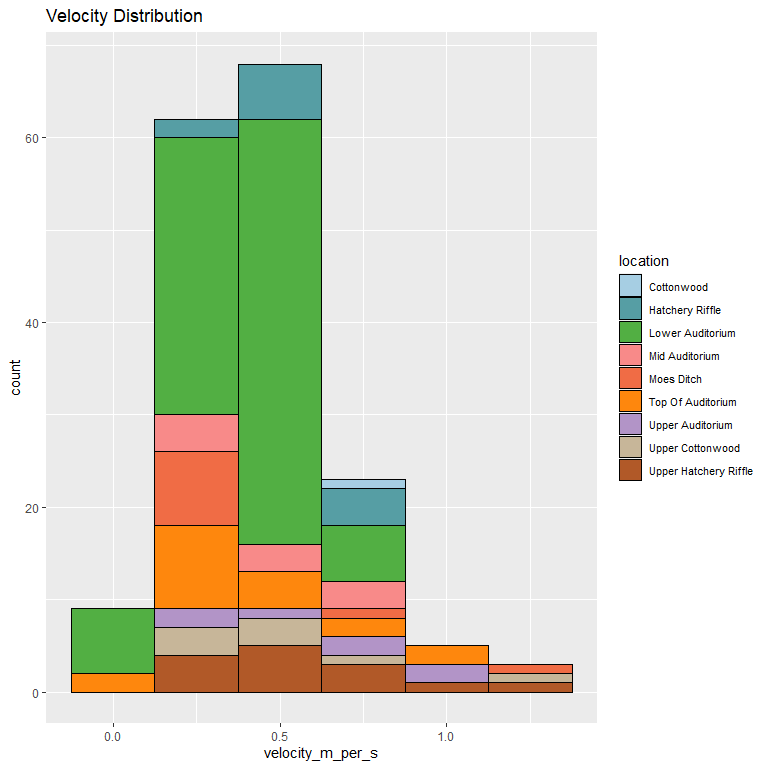<!-- -->

**Numeric Summary of velocity\_m\_per\_s Over 2016**

``` r
summary(cleaner_data_2016$`velocity_m_per_s`)
```

    ##    Min. 1st Qu.  Median    Mean 3rd Qu.    Max.    NA's 
    ##  0.0200  0.2900  0.4200  0.4500  0.5875  1.3200    1400

**NA and Unknown Values**

-   89.2 % of values in the `velocity_m_per_s` column are NA.

### Add cleaned data back onto google cloud

``` r
feather_redd_survey_2016 <- cleaner_data_2016 %>% glimpse()
```

    ## Rows: 1,570
    ## Columns: 17
    ## $ date                     <date> 2016-09-20, 2016-09-20, 2016-09-20, 2016-09-~
    ## $ location                 <chr> "Cottonwood", "Cottonwood", "Cottonwood", "Co~
    ## $ type                     <chr> "Point", "Point", "Point", "Point", "Point", ~
    ## $ redd_count               <dbl> 1, 1, 1, 1, 1, 1, 1, 1, 1, 1, 1, 1, 1, 1, 1, ~
    ## $ salmon_count             <dbl> 0, 0, 0, 0, 3, 0, 0, 3, 0, 2, 1, 0, 5, 0, 2, ~
    ## $ latitude                 <dbl> 4375097, 4375101, 4375108, 4375111, 4375123, ~
    ## $ longitude                <dbl> 624148.9, 624146.1, 624152.3, 624169.5, 62417~
    ## $ depth_m                  <dbl> NA, NA, NA, NA, NA, NA, NA, 0.54, NA, NA, NA,~
    ## $ pot_depth_m              <dbl> NA, NA, NA, NA, NA, NA, NA, 0.62, NA, NA, NA,~
    ## $ velocity_m_per_s         <dbl> NA, NA, NA, NA, NA, NA, NA, 0.34, NA, NA, NA,~
    ## $ percent_fine_substrate   <dbl> NA, NA, NA, NA, NA, NA, NA, 10, NA, NA, NA, N~
    ## $ percent_small_substrate  <dbl> NA, NA, NA, NA, NA, NA, NA, 30, NA, NA, NA, N~
    ## $ percent_medium_substrate <dbl> NA, NA, NA, NA, NA, NA, NA, 40, NA, NA, NA, N~
    ## $ percent_large_substrate  <dbl> NA, NA, NA, NA, NA, NA, NA, 10, NA, NA, NA, N~
    ## $ percent_boulder          <dbl> NA, NA, NA, NA, NA, NA, NA, 10, NA, NA, NA, N~
    ## $ redd_width_m             <dbl> NA, NA, NA, NA, NA, NA, NA, 1.0, NA, NA, NA, ~
    ## $ redd_length_m            <dbl> NA, NA, NA, NA, NA, NA, NA, 2.5, NA, NA, NA, ~

``` r
f <- function(input, output) write_csv(input, file = output)

gcs_upload(feather_redd_survey_2016,
           object_function = f,
           type = "csv",
           name = "adult-holding-redd-and-carcass-surveys/feather-river/data/feather_redd_2016.csv")
```

    ## i 2021-10-22 13:32:07 > File size detected as  140 Kb

    ## i 2021-10-22 13:32:07 > Request Status Code:  400

    ## ! API returned: Cannot insert legacy ACL for an object when uniform bucket-level access is enabled. Read more at https://cloud.google.com/storage/docs/uniform-bucket-level-access - Retrying with predefinedAcl='bucketLevel'

    ## i 2021-10-22 13:32:07 > File size detected as  140 Kb

    ## ==Google Cloud Storage Object==
    ## Name:                adult-holding-redd-and-carcass-surveys/feather-river/data/feather_redd_2016.csv 
    ## Type:                csv 
    ## Size:                140 Kb 
    ## Media URL:           https://www.googleapis.com/download/storage/v1/b/jpe-dev-bucket/o/adult-holding-redd-and-carcass-surveys%2Ffeather-river%2Fdata%2Ffeather_redd_2016.csv?generation=1634934727637032&alt=media 
    ## Download URL:        https://storage.cloud.google.com/jpe-dev-bucket/adult-holding-redd-and-carcass-surveys%2Ffeather-river%2Fdata%2Ffeather_redd_2016.csv 
    ## Public Download URL: https://storage.googleapis.com/jpe-dev-bucket/adult-holding-redd-and-carcass-surveys%2Ffeather-river%2Fdata%2Ffeather_redd_2016.csv 
    ## Bucket:              jpe-dev-bucket 
    ## ID:                  jpe-dev-bucket/adult-holding-redd-and-carcass-surveys/feather-river/data/feather_redd_2016.csv/1634934727637032 
    ## MD5 Hash:            YwOQl6WVBz6jDGMrE2IsYA== 
    ## Class:               STANDARD 
    ## Created:             2021-10-22 20:32:07 
    ## Updated:             2021-10-22 20:32:07 
    ## Generation:          1634934727637032 
    ## Meta Generation:     1 
    ## eTag:                CKjwr73u3vMCEAE= 
    ## crc32c:              OlcVjQ==
