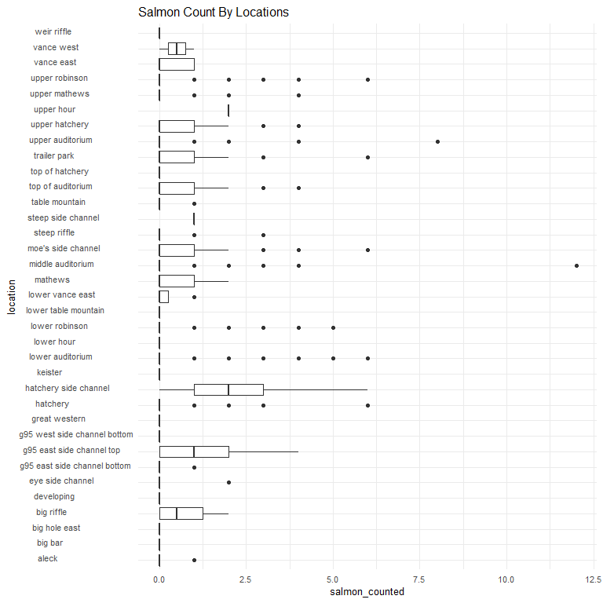
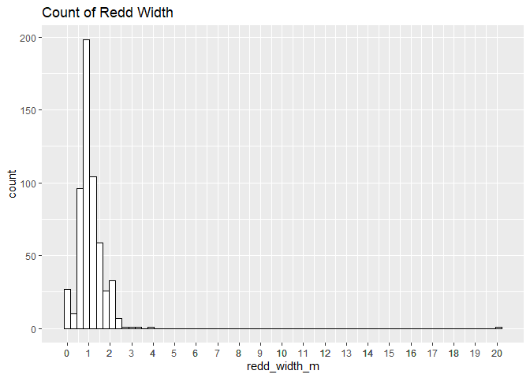
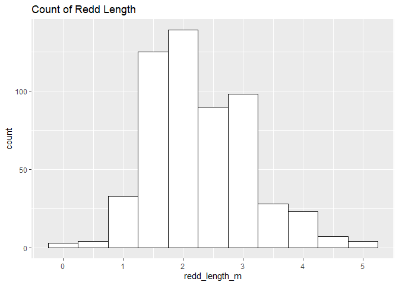
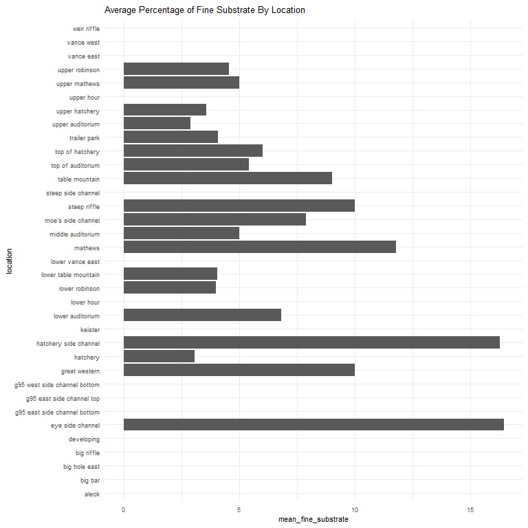
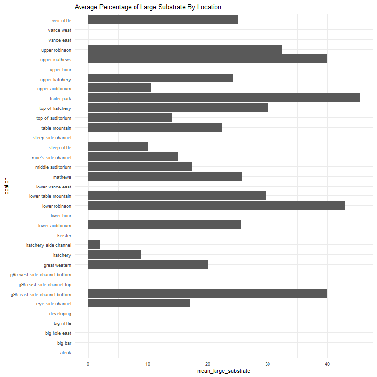
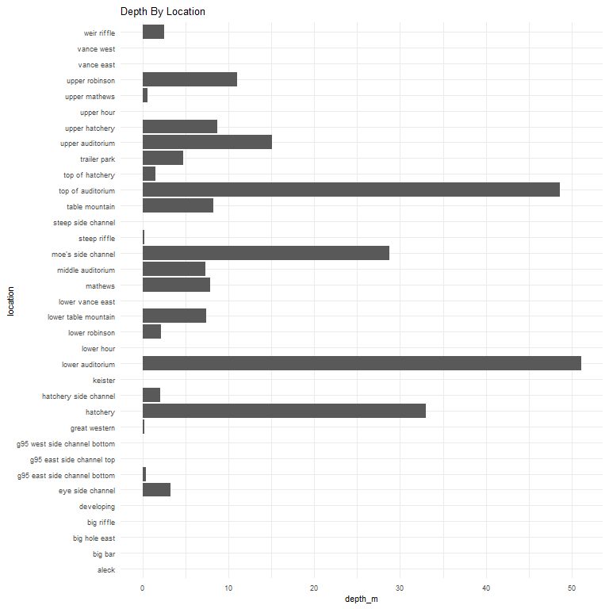
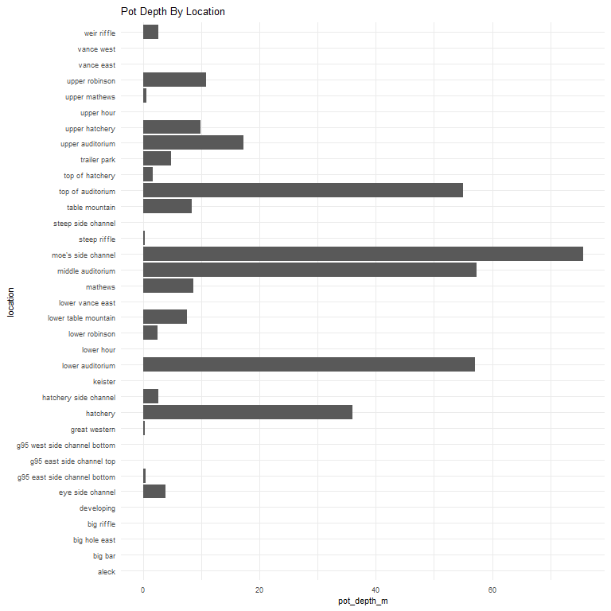
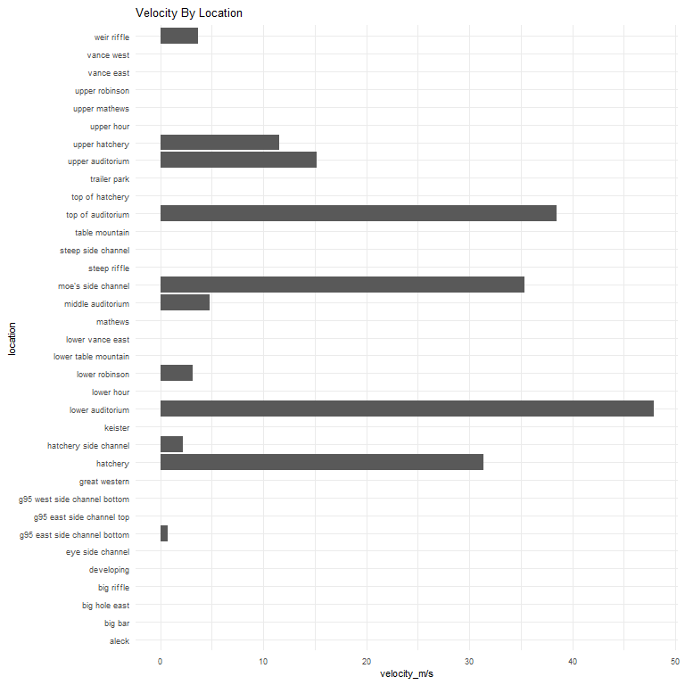

feather-river-redd-survey-qc-checklist-2017
================
Inigo Peng
10/6/2021

# Feather River Redd Survey Data

## Description of Monitoring Data

**Timeframe:** 2017

**Completeness of Record throughout timeframe: **  

-   Longitude and latitude data are not available for 2009, 2010, 2011,
    2012, 2019, 2020. NA values will be filled in for these data sets in
    final cleaned data set.

**Sampling Location:** Feather River

**Data Contact:** [Chris Cook](Chris.Cook@water.ca.gov)

Additional Info:  
1. Latitude and longitude are in NAD 1983 UTM Zone 10N  
2. The substrate is observed visually and an estimate of the percentage
of 5 size classes:  
\* fines &lt;1cm  
\* small 1-5cm  
\* medium 6-15cm  
\* large 16-30cm  
\* boulder &gt;30cm

## Access Cloud Data

``` r
# Run Sys.setenv() to specify GCS_AUTH_FILE and GCS_DEFAULT_BUCKET before running
# Open object from google cloud storage
# Set your authentication using gcs_auth
gcs_auth(json_file = Sys.getenv("GCS_AUTH_FILE"))
# Set global bucket 
gcs_global_bucket(bucket = Sys.getenv("GCS_DEFAULT_BUCKET"))
gcs_list_objects()
# git data and save as xlsx
gcs_get_object(object_name = "adult-holding-redd-and-carcass-surveys/feather-river/data-raw/redd_survey/2017_Chinook_Redd_Survey_Data_raw.xlsx",
               bucket = gcs_get_global_bucket(),
               saveToDisk = "2017_Chinook_Redd_Survey_Data_raw.xlsx",
               overwrite = TRUE)
```

Read in data from google cloud, glimpse raw data:

``` r
raw_data_2017 = readxl::read_excel("2017_Chinook_Redd_Survey_Data_raw.xlsx")
glimpse(raw_data_2017)
```

    ## Rows: 2,717
    ## Columns: 19
    ## $ Date              <dttm> 2017-10-03, 2017-10-03, 2017-10-03, 2017-10-03, 201~
    ## $ `Survey Wk`       <chr> "1-1", "1-1", "1-1", "1-1", "1-1", "1-1", "1-1", "1-~
    ## $ Location          <chr> "Hatchery", "Hatchery", "Top of Auditorium", "Top of~
    ## $ `File #`          <dbl> 1, 2, 3, 4, 5, 6, 7, 8, 9, 10, 11, 12, 13, 1, 2, 3, ~
    ## $ Type              <chr> "p", "p", "p", "p", "p", "p", "p", "p", "p", "p", "p~
    ## $ `# redds`         <dbl> 1, 1, 1, 1, 1, 1, 1, 1, 1, 1, 1, 1, 1, 1, 1, 1, 1, 1~
    ## $ `# salmon`        <dbl> 1, 0, 0, 0, 0, 0, 0, 1, 1, 0, 0, 0, 0, 0, 1, 0, 0, 3~
    ## $ `Latitude mN`     <dbl> 4375041, 4375035, 4375077, 4375074, 4375069, 4375043~
    ## $ `Longitude mE`    <dbl> 624281.7, 624285.5, 624062.3, 624060.5, 624069.0, 62~
    ## $ `Depth (m)`       <dbl> 0.32, 0.50, 0.48, 0.34, 0.52, 0.48, 0.70, 0.64, 0.28~
    ## $ `Pot Depth (m)`   <dbl> 0.48, 0.42, 0.56, 0.40, 0.66, 0.62, 0.80, 0.58, 0.40~
    ## $ `Velocity (m/s)`  <dbl> 0.64, 0.55, 0.45, 0.57, 0.95, 0.30, 0.42, 0.42, 0.44~
    ## $ `% fines`         <dbl> 0, 0, 5, 5, 0, 5, 0, 0, 10, 10, 10, 10, 5, 0, 0, 0, ~
    ## $ `% small`         <dbl> 5, 5, 30, 30, 30, 30, 50, 60, 20, 20, 30, 30, 20, 40~
    ## $ `% med`           <dbl> 65, 65, 50, 50, 70, 50, 50, 40, 40, 40, 30, 30, 40, ~
    ## $ `% large`         <dbl> 30, 30, 15, 15, 0, 15, 0, 0, 30, 30, 30, 30, 35, 0, ~
    ## $ `% boulder`       <dbl> 0, 0, 0, 0, 0, 0, 0, 0, 0, 0, 0, 0, 0, 0, 0, 0, 0, 0~
    ## $ `redd width (m)`  <dbl> 2.2, 2.2, 1.2, 1.0, 1.2, 1.4, 1.9, 1.4, 1.8, 1.2, 1.~
    ## $ `redd length (m)` <dbl> 3.6, 2.9, 2.7, 1.3, 3.2, 2.8, 3.2, 2.3, 4.0, 3.2, 2.~

## Data Transformation

``` r
glimpse(raw_data_2017)
```

    ## Rows: 2,717
    ## Columns: 19
    ## $ Date              <dttm> 2017-10-03, 2017-10-03, 2017-10-03, 2017-10-03, 201~
    ## $ `Survey Wk`       <chr> "1-1", "1-1", "1-1", "1-1", "1-1", "1-1", "1-1", "1-~
    ## $ Location          <chr> "Hatchery", "Hatchery", "Top of Auditorium", "Top of~
    ## $ `File #`          <dbl> 1, 2, 3, 4, 5, 6, 7, 8, 9, 10, 11, 12, 13, 1, 2, 3, ~
    ## $ Type              <chr> "p", "p", "p", "p", "p", "p", "p", "p", "p", "p", "p~
    ## $ `# redds`         <dbl> 1, 1, 1, 1, 1, 1, 1, 1, 1, 1, 1, 1, 1, 1, 1, 1, 1, 1~
    ## $ `# salmon`        <dbl> 1, 0, 0, 0, 0, 0, 0, 1, 1, 0, 0, 0, 0, 0, 1, 0, 0, 3~
    ## $ `Latitude mN`     <dbl> 4375041, 4375035, 4375077, 4375074, 4375069, 4375043~
    ## $ `Longitude mE`    <dbl> 624281.7, 624285.5, 624062.3, 624060.5, 624069.0, 62~
    ## $ `Depth (m)`       <dbl> 0.32, 0.50, 0.48, 0.34, 0.52, 0.48, 0.70, 0.64, 0.28~
    ## $ `Pot Depth (m)`   <dbl> 0.48, 0.42, 0.56, 0.40, 0.66, 0.62, 0.80, 0.58, 0.40~
    ## $ `Velocity (m/s)`  <dbl> 0.64, 0.55, 0.45, 0.57, 0.95, 0.30, 0.42, 0.42, 0.44~
    ## $ `% fines`         <dbl> 0, 0, 5, 5, 0, 5, 0, 0, 10, 10, 10, 10, 5, 0, 0, 0, ~
    ## $ `% small`         <dbl> 5, 5, 30, 30, 30, 30, 50, 60, 20, 20, 30, 30, 20, 40~
    ## $ `% med`           <dbl> 65, 65, 50, 50, 70, 50, 50, 40, 40, 40, 30, 30, 40, ~
    ## $ `% large`         <dbl> 30, 30, 15, 15, 0, 15, 0, 0, 30, 30, 30, 30, 35, 0, ~
    ## $ `% boulder`       <dbl> 0, 0, 0, 0, 0, 0, 0, 0, 0, 0, 0, 0, 0, 0, 0, 0, 0, 0~
    ## $ `redd width (m)`  <dbl> 2.2, 2.2, 1.2, 1.0, 1.2, 1.4, 1.9, 1.4, 1.8, 1.2, 1.~
    ## $ `redd length (m)` <dbl> 3.6, 2.9, 2.7, 1.3, 3.2, 2.8, 3.2, 2.3, 4.0, 3.2, 2.~

``` r
cleaner_data_2017 <- raw_data_2017 %>% 
  select(-c('Survey Wk', 'File #', '# redds')) %>% 
  rename('type'= 'Type',
         'salmon_counted'= '# salmon',
         'latitude' = 'Latitude mN',
         'longitude' = 'Longitude mE',
         'depth_m' = 'Depth (m)',
         'pot_depth_m' = 'Pot Depth (m)',
         'velocity_m/s' = 'Velocity (m/s)',
         'percent_fine_substrate' = '% fines',
         'percent_small_substrate' = '% small',
         'percent_medium_substrate'= '% med',
         'percent_large_substrate' = '% large',
         'percent_boulder' = '% boulder',
         'redd_width_m' = 'redd width (m)',
         'redd_length_m' = 'redd length (m)',
         ) %>% 
  glimpse()
```

    ## Rows: 2,717
    ## Columns: 16
    ## $ Date                     <dttm> 2017-10-03, 2017-10-03, 2017-10-03, 2017-10-~
    ## $ Location                 <chr> "Hatchery", "Hatchery", "Top of Auditorium", ~
    ## $ type                     <chr> "p", "p", "p", "p", "p", "p", "p", "p", "p", ~
    ## $ salmon_counted           <dbl> 1, 0, 0, 0, 0, 0, 0, 1, 1, 0, 0, 0, 0, 0, 1, ~
    ## $ latitude                 <dbl> 4375041, 4375035, 4375077, 4375074, 4375069, ~
    ## $ longitude                <dbl> 624281.7, 624285.5, 624062.3, 624060.5, 62406~
    ## $ depth_m                  <dbl> 0.32, 0.50, 0.48, 0.34, 0.52, 0.48, 0.70, 0.6~
    ## $ pot_depth_m              <dbl> 0.48, 0.42, 0.56, 0.40, 0.66, 0.62, 0.80, 0.5~
    ## $ `velocity_m/s`           <dbl> 0.64, 0.55, 0.45, 0.57, 0.95, 0.30, 0.42, 0.4~
    ## $ percent_fine_substrate   <dbl> 0, 0, 5, 5, 0, 5, 0, 0, 10, 10, 10, 10, 5, 0,~
    ## $ percent_small_substrate  <dbl> 5, 5, 30, 30, 30, 30, 50, 60, 20, 20, 30, 30,~
    ## $ percent_medium_substrate <dbl> 65, 65, 50, 50, 70, 50, 50, 40, 40, 40, 30, 3~
    ## $ percent_large_substrate  <dbl> 30, 30, 15, 15, 0, 15, 0, 0, 30, 30, 30, 30, ~
    ## $ percent_boulder          <dbl> 0, 0, 0, 0, 0, 0, 0, 0, 0, 0, 0, 0, 0, 0, 0, ~
    ## $ redd_width_m             <dbl> 2.2, 2.2, 1.2, 1.0, 1.2, 1.4, 1.9, 1.4, 1.8, ~
    ## $ redd_length_m            <dbl> 3.6, 2.9, 2.7, 1.3, 3.2, 2.8, 3.2, 2.3, 4.0, ~

``` r
cleaner_data_2017 <- cleaner_data_2017 %>% 
  set_names(tolower(colnames(cleaner_data_2017))) %>% 
  mutate(date = as.Date(date)) %>% 
  glimpse()
```

    ## Rows: 2,717
    ## Columns: 16
    ## $ date                     <date> 2017-10-03, 2017-10-03, 2017-10-03, 2017-10-~
    ## $ location                 <chr> "Hatchery", "Hatchery", "Top of Auditorium", ~
    ## $ type                     <chr> "p", "p", "p", "p", "p", "p", "p", "p", "p", ~
    ## $ salmon_counted           <dbl> 1, 0, 0, 0, 0, 0, 0, 1, 1, 0, 0, 0, 0, 0, 1, ~
    ## $ latitude                 <dbl> 4375041, 4375035, 4375077, 4375074, 4375069, ~
    ## $ longitude                <dbl> 624281.7, 624285.5, 624062.3, 624060.5, 62406~
    ## $ depth_m                  <dbl> 0.32, 0.50, 0.48, 0.34, 0.52, 0.48, 0.70, 0.6~
    ## $ pot_depth_m              <dbl> 0.48, 0.42, 0.56, 0.40, 0.66, 0.62, 0.80, 0.5~
    ## $ `velocity_m/s`           <dbl> 0.64, 0.55, 0.45, 0.57, 0.95, 0.30, 0.42, 0.4~
    ## $ percent_fine_substrate   <dbl> 0, 0, 5, 5, 0, 5, 0, 0, 10, 10, 10, 10, 5, 0,~
    ## $ percent_small_substrate  <dbl> 5, 5, 30, 30, 30, 30, 50, 60, 20, 20, 30, 30,~
    ## $ percent_medium_substrate <dbl> 65, 65, 50, 50, 70, 50, 50, 40, 40, 40, 30, 3~
    ## $ percent_large_substrate  <dbl> 30, 30, 15, 15, 0, 15, 0, 0, 30, 30, 30, 30, ~
    ## $ percent_boulder          <dbl> 0, 0, 0, 0, 0, 0, 0, 0, 0, 0, 0, 0, 0, 0, 0, ~
    ## $ redd_width_m             <dbl> 2.2, 2.2, 1.2, 1.0, 1.2, 1.4, 1.9, 1.4, 1.8, ~
    ## $ redd_length_m            <dbl> 3.6, 2.9, 2.7, 1.3, 3.2, 2.8, 3.2, 2.3, 4.0, ~

## Explore Categorical Variables

``` r
cleaner_data_2017 %>% 
  select_if(is.character) %>% colnames()
```

    ## [1] "location" "type"

### Variable:`location`

``` r
table(cleaner_data_2017$location)
```

    ## 
    ##                         Aleck                       Big Bar 
    ##                             6                             1 
    ##                 Big Hole East                    Big Riffle 
    ##                             6                             4 
    ##                    Developing              Eye Side Channel 
    ##                             1                            14 
    ## G-95 East Side Channel Bottom G-95 West Side Channel Bottom 
    ##                             1                             1 
    ##               G95 East Bottom                  G95 East Top 
    ##                             8                             5 
    ##                 Great Western                      Hatchery 
    ##                             1                           300 
    ##         Hatchery Side Channel                       Keister 
    ##                            27                             3 
    ##              Lower Auditorium                    Lower Hour 
    ##                           486                             6 
    ##                Lower Robinson          Lower Table Mountain 
    ##                           149                            16 
    ##              Lower Vance East                       Mathews 
    ##                             4                            68 
    ##             Middle Auditorium            Moe's Side Channel 
    ##                            74                           488 
    ##                  Steep Riffle            Steep Side Channel 
    ##                            25                             1 
    ##                Table Mountain             Top of Auditorium 
    ##                            30                           371 
    ##               Top of Hatchery                  Trailer Park 
    ##                             9                           105 
    ##              Upper Auditorium                Upper Hatchery 
    ##                           204                           120 
    ##                    Upper Hour                 Upper Mathews 
    ##                             1                            15 
    ##                Upper Robinson                    Vance East 
    ##                           152                             9 
    ##                    Vance West                   Weir Riffle 
    ##                             2                             4

Locations names are changed to be consistent with the rest of the
Feather River redd survey files:

``` r
cleaner_data_2017 <- cleaner_data_2017 %>% 
  mutate(location = tolower(location),
         location = if_else(location == "g-95 east side channel bottom", "g95 east side channel bottom", location),
         location = if_else(location == "g-95 west side channel bottom", "g95 west side channel bottom", location),
         location = if_else(location == "g95 east bottom", "g95 east side channel bottom", location),
         location = if_else(location == "g95 east top", "g95 east side channel top", location),
         location = if_else(location == "middle auditoium", "mid auditorium", location)
         )
table(cleaner_data_2017$location)
```

    ## 
    ##                        aleck                      big bar 
    ##                            6                            1 
    ##                big hole east                   big riffle 
    ##                            6                            4 
    ##                   developing             eye side channel 
    ##                            1                           14 
    ## g95 east side channel bottom    g95 east side channel top 
    ##                            9                            5 
    ## g95 west side channel bottom                great western 
    ##                            1                            1 
    ##                     hatchery        hatchery side channel 
    ##                          300                           27 
    ##                      keister             lower auditorium 
    ##                            3                          486 
    ##                   lower hour               lower robinson 
    ##                            6                          149 
    ##         lower table mountain             lower vance east 
    ##                           16                            4 
    ##                      mathews            middle auditorium 
    ##                           68                           74 
    ##           moe's side channel                 steep riffle 
    ##                          488                           25 
    ##           steep side channel               table mountain 
    ##                            1                           30 
    ##            top of auditorium              top of hatchery 
    ##                          371                            9 
    ##                 trailer park             upper auditorium 
    ##                          105                          204 
    ##               upper hatchery                   upper hour 
    ##                          120                            1 
    ##                upper mathews               upper robinson 
    ##                           15                          152 
    ##                   vance east                   vance west 
    ##                            9                            2 
    ##                  weir riffle 
    ##                            4

-   0 % of values in the `location` column are NA.

## Variable:`Type`

Description:  
Area - polygon mapped with Trimble GPS unit Point - points mapped with
Trimble GPS unit Questionable redds - polygon mapped with Trimble GPS
unit where the substrate was disturbed but did not have the proper
characteristics to be called a redd - it was no longer recorded after
2017

``` r
table(cleaner_data_2017$type)
```

    ## 
    ##    p 
    ## 2717

``` r
cleaner_data_2017 <- cleaner_data_2017 %>% 
  mutate(type = tolower(type),
         type = if_else(type == 'p', 'Point', type))
table(cleaner_data_2017$type)
```

    ## 
    ## Point 
    ##  2717

## Explore Numeric Variables

``` r
cleaner_data_2017 %>% 
  select_if(is.numeric) %>% colnames()
```

    ##  [1] "salmon_counted"           "latitude"                
    ##  [3] "longitude"                "depth_m"                 
    ##  [5] "pot_depth_m"              "velocity_m/s"            
    ##  [7] "percent_fine_substrate"   "percent_small_substrate" 
    ##  [9] "percent_medium_substrate" "percent_large_substrate" 
    ## [11] "percent_boulder"          "redd_width_m"            
    ## [13] "redd_length_m"

### Variable:`salmon_counted`

#### Plotting salmon counted in 2017

``` r
cleaner_data_2017 %>% 
  ggplot(aes(x = date, y = salmon_counted)) + 
  geom_col() +
  facet_wrap(~year(date), scales = "free") +
  scale_x_date(labels = date_format("%b"), date_breaks = "1 month")+
  theme_minimal() +
  theme(axis.text.x = element_text(size = 10,angle = 90, vjust = 0.5, hjust=0.1)) +
  theme(axis.text.y = element_text(size = 8))+
  labs(title = "Daily Salmon Counted in 2017")
```

<!-- -->
**Numeric Daily Summary of salmon\_counted Over 2017**

``` r
cleaner_data_2017 %>%
  group_by(date) %>%
  summarise(count = sum(salmon_counted, na.rm = T)) %>%
  pull(count) %>%
  summary()
```

    ##    Min. 1st Qu.  Median    Mean 3rd Qu.    Max. 
    ##    0.00    1.00    8.00   28.37   26.00  156.00

``` r
cleaner_data_2017  %>%
  ggplot(aes(y = location, x = salmon_counted))+
  geom_boxplot() +
  theme_minimal() +
  theme(text = element_text(size = 10))+
  scale_y_discrete()+
  theme(axis.text.y = element_text(size = 8,vjust = 0.1, hjust=0.2))+
  labs(title = "Salmon Count By Locations")
```

<!-- -->
**Numeric summary of salmon\_counted by location in 2017**

``` r
cleaner_data_2017 %>%
  group_by(location) %>% 
  summarise(count = sum(salmon_counted, na.rm = T)) %>% 
  pull(count) %>%
  summary()
```

    ##    Min. 1st Qu.  Median    Mean 3rd Qu.    Max. 
    ##    0.00    0.00    3.00   33.23   53.50  300.00

**NA and Unknown Values** \* 0 % of values in the `salmon_counted`
column are NA.

### Variable:`redd_width_m`

``` r
cleaner_data_2017 %>%
  group_by(location) %>%
  summarise(mean_redd_width = mean(redd_width_m, na.rm = TRUE)) %>%
  ggplot(aes(y = location, x = mean_redd_width)) +
  geom_col() +
  theme_minimal() +
  theme(text = element_text(size = 8)) +
  labs(title = "Mean Redd Width By Location")
```

<!-- -->

``` r
cleaner_data_2017 %>%
  ggplot(aes(x = redd_width_m)) +
  geom_histogram(binwidth = 0.3, color = "black", fill = "white") +
  scale_x_continuous(breaks = round(seq(min(cleaner_data_2017$redd_width_m, na.rm = TRUE), max(cleaner_data_2017$redd_width_m, na.rm = TRUE), by = 0.5),0))+
  labs(title = "Count of Redd Width")
```

<!-- -->

**Numeric Summary of redd\_width\_m Over 2017**

``` r
summary(cleaner_data_2017$redd_width_m)
```

    ##    Min. 1st Qu.  Median    Mean 3rd Qu.    Max.    NA's 
    ##   0.000   0.800   1.000   1.103   1.300  20.000    2152

**NA and Unknown Values** \* 79.2 % of values in the `redd_width_m`
column are NA.

### Variable: `redd_length_m`

``` r
cleaner_data_2017 %>%
  group_by(location) %>%
  summarise(mean_redd_length = mean(redd_length_m, na.rm = TRUE)) %>%
  ggplot(aes(y = location, x = mean_redd_length)) +
  geom_col() +
  theme_minimal() +
  theme(text = element_text(size = 8)) +
  labs(title = "Mean Redd Length By Location")
```

<!-- -->

``` r
cleaner_data_2017 %>%
  ggplot(aes(x = redd_length_m)) +
  geom_histogram(binwidth = 0.5, color = "black", fill = "white") +
  scale_x_continuous(breaks = round(seq(min(cleaner_data_2017$redd_length_m, na.rm = TRUE), max(cleaner_data_2017$redd_length_m, na.rm = TRUE), by = 1),0))+
  labs(title = "Count of Redd Length")
```

<!-- -->

**Numeric Summary of redd\_length\_m Over 2017**

``` r
summary(cleaner_data_2017$redd_length_m)
```

    ##    Min. 1st Qu.  Median    Mean 3rd Qu.    Max.    NA's 
    ##   0.000   1.700   2.200   2.296   2.900   5.000    2163

**NA and Unknown Values** \* 79.6 % of values in the `redd_length_m`
column are NA.

### Location Physical Attributes

### Variable:`percent_fine_substrate`

``` r
cleaner_data_2017 %>%
  group_by(location) %>% 
  summarise(mean_fine_substrate = mean(percent_fine_substrate, na.rm = TRUE)) %>%
  ggplot(aes(y = location, x = mean_fine_substrate)) +
  geom_col() +
  theme_minimal() +
  theme(text = element_text(size = 8)) +
  labs(title = "Average Percentage of Fine Substrate By Location")
```

<!-- -->

**Numeric Summary of percent\_fine\_substrate Over 2017**

``` r
summary(cleaner_data_2017$percent_fine_substrate)
```

    ##    Min. 1st Qu.  Median    Mean 3rd Qu.    Max.    NA's 
    ##   0.000   0.000   5.000   6.023  10.000  80.000    2153

**NA and Unknown Values** \* 79.2 % of values in the
`percent_fine_substrate` column are NA.

### Variable:`percent_small_substrate`

``` r
cleaner_data_2017 %>%
  group_by(location) %>% 
  summarise(mean_small_substrate = mean(percent_small_substrate, na.rm = TRUE)) %>%
  ggplot(aes(y = location, x = mean_small_substrate)) +
  geom_col() +
  theme_minimal() +
  theme(text = element_text(size = 8)) +
  labs(title = "Average Percentage of Small Substrate By Location")
```

<!-- -->

**Numeric Summary of percent\_small\_substrate Over 2017**

``` r
summary(cleaner_data_2017$percent_small_substrate)
```

    ##    Min. 1st Qu.  Median    Mean 3rd Qu.    Max.    NA's 
    ##    0.00   15.00   25.00   27.27   40.00   80.00    2152

**NA and Unknown Values** \* 79.2 % of values in the
`percent_small_substrate` column are NA.

### Variable:`percent_medium_substrate`

``` r
cleaner_data_2017 %>%
  group_by(location) %>% 
  summarise(mean_medium_substrate = mean(percent_medium_substrate, na.rm = TRUE)) %>%
  ggplot(aes(y = location, x = mean_medium_substrate)) +
  geom_col() +
  theme_minimal() +
  theme(text = element_text(size = 8)) +
  labs(title = "Average Percentage of Medium Substrate By Location")
```

<!-- -->

**Numeric Summary of percent\_medium\_substrate Over 2017**

``` r
summary(cleaner_data_2017$percent_medium_substrate)
```

    ##    Min. 1st Qu.  Median    Mean 3rd Qu.    Max.    NA's 
    ##    0.00   30.00   40.00   42.47   50.00   90.00    2151

**NA and Unknown Values** \* 79.2 % of values in the
`percent_medium_substrate` column are NA.

### Variable:`percent_large_substrate`

``` r
cleaner_data_2017 %>%
  group_by(location) %>% 
  summarise(mean_large_substrate = mean(percent_large_substrate, na.rm = TRUE)) %>%
  ggplot(aes(y = location, x = mean_large_substrate)) +
  geom_col() +
  theme_minimal() +
  theme(text = element_text(size = 8)) +
  labs(title = "Average Percentage of Large Substrate By Location")
```

<!-- -->

**Numeric Summary of percent\_large\_substrate Over 2017**

``` r
summary(cleaner_data_2017$percent_large_substrate)
```

    ##    Min. 1st Qu.  Median    Mean 3rd Qu.    Max.    NA's 
    ##    0.00    5.00   15.00   19.33   30.00   80.00    2153

**NA and Unknown Values** \* 79.2 % of values in the
`percent_large_substrate` column are NA.

### Variable:`percent_boulder`

``` r
cleaner_data_2017 %>%
  group_by(location) %>% 
  summarise(mean_boulder = mean(percent_boulder, na.rm = TRUE)) %>%
  ggplot(aes(y = location, x = mean_boulder)) +
  geom_col() +
  theme_minimal() +
  theme(text = element_text(size = 8)) +
  labs(title = "Average Percentage of Boulder By Location")
```

<!-- -->

**Numeric Summary of percent\_boulder Over 2017**

``` r
summary(cleaner_data_2017$percent_large_substrate)
```

    ##    Min. 1st Qu.  Median    Mean 3rd Qu.    Max.    NA's 
    ##    0.00    5.00   15.00   19.33   30.00   80.00    2153

**NA and Unknown Values** NA and Unknown Values\*\* \* 79.4 % of values
in the `percent_large_substrate` column are NA.

### Variable: `depth_m`

``` r
cleaner_data_2017 %>% 
  ggplot(aes(x = depth_m, y = location)) + 
  geom_col() + 
  theme_minimal() + 
  theme(text = element_text(size = 8))+
  labs(title = "Depth By Location")
```

<!-- -->
**Numeric Summary of depth\_m Over 2017**

``` r
summary(cleaner_data_2017$depth_m)
```

    ##    Min. 1st Qu.  Median    Mean 3rd Qu.    Max.    NA's 
    ##    0.08    0.30    0.41    0.43    0.52    1.50    2147

**NA and Unknown Values** NA and Unknown Values\*\* \* 79 % of values in
the `depth_m` column are NA.

### Variable: `pot_depth_m`

``` r
cleaner_data_2017 %>% 
  ggplot(aes(x = pot_depth_m, y = location)) + 
  geom_col() + 
  theme_minimal() + 
  theme(text = element_text(size = 8))+
  labs(title = "Pot Depth By Location")
```

<!-- -->

**Numeric Summary of pot\_depth\_m Over 2017**

``` r
summary(cleaner_data_2017$pot_depth_m)
```

    ##    Min. 1st Qu.  Median    Mean 3rd Qu.    Max.    NA's 
    ##  0.0000  0.3800  0.4600  0.6392  0.5800 50.0000    2148

**NA and Unknown Values** NA and Unknown Values\*\* \* 79.1 % of values
in the `pot_depth_m` column are NA.

### Variable: `velocity_m/s`

``` r
cleaner_data_2017 %>% 
  ggplot(aes(x = `velocity_m/s`, y = location)) + 
  geom_col() + 
  theme_minimal() + 
  theme(text = element_text(size = 8))+
  labs(title = "Velocity By Location")
```

<!-- -->

**Numeric Summary of velocity\_m/s Over 2017**

``` r
summary(cleaner_data_2017$`velocity_m/s`)
```

    ##    Min. 1st Qu.  Median    Mean 3rd Qu.    Max.    NA's 
    ##  0.0300  0.3400  0.4600  0.5009  0.6200  1.2700    2329

**NA and Unknown Values** NA and Unknown Values\*\* \* 85.7 % of values
in the `velocity_m/s` column are NA.
