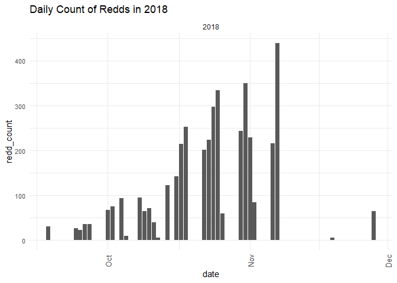
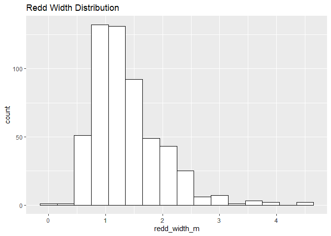
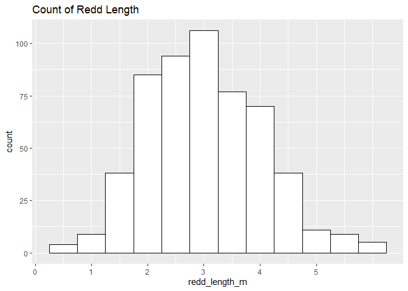
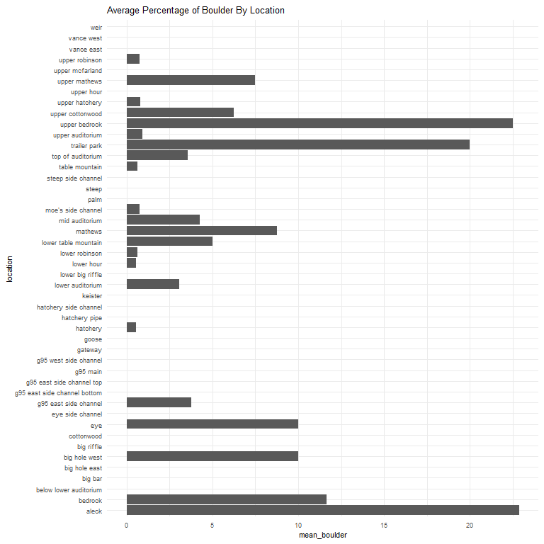
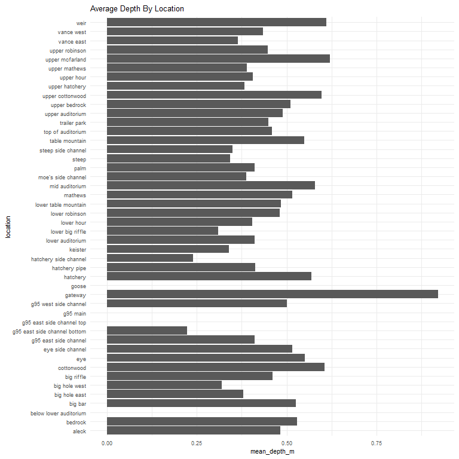
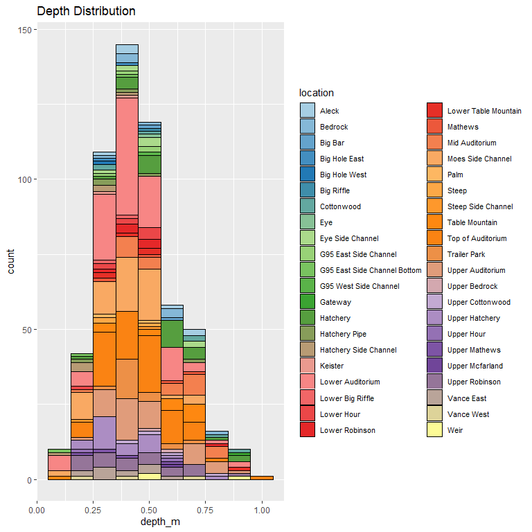
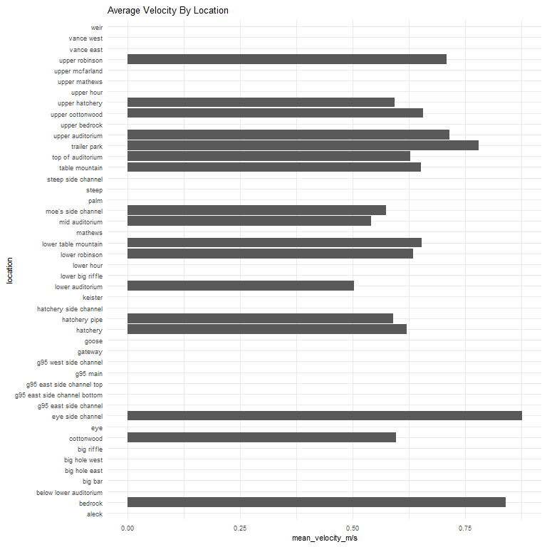

feather-river-redd-survey-qc-checklist-2018
================
Inigo Peng
10/6/2021

# Feather River Redd Survey Data

## Description of Monitoring Data

**Timeframe:** 2018

**Completeness of Record throughout timeframe: **  

-   Longitude and latitude data are not available for 2009, 2010, 2011,
    2012, 2019, 2020. NA values will be filled in for these data sets in
    final cleaned data set.

**Sampling Location:** Feather River

**Data Contact:** [Chris Cook](Chris.Cook@water.ca.gov)

Additional Info:  
1. Latitude and longitude are in NAD 1983 UTM Zone 10N  
2. The substrate is observed visually and an estimate of the percentage
of 5 size classes:  
\* fines &lt;1cm  
\* small 1-5cm  
\* medium 6-15cm  
\* large 16-30cm  
\* boulder &gt;30cm

## Access Cloud Data

``` r
# Run Sys.setenv() to specify GCS_AUTH_FILE and GCS_DEFAULT_BUCKET before running
# Open object from google cloud storage
# Set your authentication using gcs_auth
gcs_auth(json_file = Sys.getenv("GCS_AUTH_FILE"))
# Set global bucket 
gcs_global_bucket(bucket = Sys.getenv("GCS_DEFAULT_BUCKET"))
gcs_list_objects()
# git data and save as xlsx
gcs_get_object(object_name = "adult-holding-redd-and-carcass-surveys/feather-river/data-raw/redd_survey/2018_Chinook_Redd_Survey_Data_raw.xlsx",
               bucket = gcs_get_global_bucket(),
               saveToDisk = "2018_Chinook_Redd_Survey_Data_raw.xlsx",
               overwrite = TRUE)
```

Read in data from google cloud, glimpse raw data:

``` r
raw_data_2018 = readxl::read_excel("2018_Chinook_Redd_Survey_Data_raw.xlsx")
glimpse(raw_data_2018)
```

    ## Rows: 4,156
    ## Columns: 19
    ## $ Date              <dttm> 2018-09-18, 2018-09-18, 2018-09-18, 2018-09-18, 201~
    ## $ `Survey Wk`       <chr> "1-1", "1-1", "1-1", "1-1", "1-1", "1-1", "1-1", "1-~
    ## $ Location          <chr> "Lower Auditorium", "Lower Auditorium", "Lower Audit~
    ## $ `File #`          <dbl> 1, 2, 3, 4, 5, 6, 7, 8, 9, 10, 11, 12, 13, 14, 15, 1~
    ## $ Type              <chr> "p", "p", "p", "p", "p", "p", "p", "p", "p", "p", "p~
    ## $ `# redds`         <dbl> 1, 1, 1, 1, 1, 1, 1, 1, 1, 1, 1, 1, 1, 1, 1, 1, 1, 1~
    ## $ `# salmon`        <dbl> 0, 0, 0, 0, 0, 0, 0, 0, 0, 0, 0, 0, 0, 0, 1, 1, 1, 1~
    ## $ `Latitude mN`     <dbl> 4374970, NA, 4374978, 4374983, 4374987, 4374984, 437~
    ## $ `Longitude mE`    <dbl> 623743.6, NA, 623812.0, 623810.8, 623810.3, 623819.6~
    ## $ `Depth (m)`       <dbl> 0.58, 0.38, 0.46, 0.44, 0.32, 0.46, 0.52, 0.41, 0.75~
    ## $ `Pot Depth (m)`   <dbl> 0.58, 0.46, 0.48, 0.52, 0.34, 0.56, 0.58, 0.41, 0.68~
    ## $ `Velocity (m/s)`  <dbl> 0.36, 0.39, 0.27, 0.52, 0.66, 0.55, 0.75, 0.47, 0.66~
    ## $ `% fines`         <dbl> 25, 10, 10, 20, 20, 20, 10, 15, 5, 10, 5, 10, 5, 5, ~
    ## $ `% small`         <dbl> 20, 15, 10, 30, 50, 40, 20, 30, 25, 40, 50, 55, 55, ~
    ## $ `% med`           <dbl> 40, 50, 55, 25, 25, 25, 60, 50, 65, 40, 40, 35, 25, ~
    ## $ `% large`         <dbl> 15, 25, 25, 25, 5, 15, 10, 5, 5, 10, 5, 0, 15, 30, 1~
    ## $ `% boulder`       <dbl> 0, 0, 0, 0, 0, 0, 0, 0, 0, 0, 0, 0, 0, 0, 0, 0, 0, 0~
    ## $ `redd width (m)`  <dbl> 3.00, 1.75, 1.50, 2.00, 1.50, 1.00, 2.50, 1.50, 1.75~
    ## $ `redd length (m)` <dbl> 1.75, 2.50, 2.50, 2.50, 2.50, 1.75, 2.50, 2.25, 2.25~

## Data Transformation

``` r
cleaner_data_2018 <- raw_data_2018 %>% 
  select(-c('Survey Wk', 'File #', '# redds')) %>% 
  rename('type' = Type,
         'salmon_counted'= '# salmon',
         'latitude' = 'Latitude mN',
         'longitude' = 'Longitude mE',
         'depth_m' = 'Depth (m)',
         'pot_depth_m' = 'Pot Depth (m)',
         'velocity_m/s' = 'Velocity (m/s)',
         'percent_fine_substrate' = '% fines',
         'percent_small_substrate' = '% small',
         'percent_medium_substrate'= '% med',
         'percent_large_substrate' = '% large',
         'percent_boulder' = '% boulder',
         'redd_width_m' = 'redd width (m)',
         'redd_length_m' = 'redd length (m)',) %>% 
  glimpse()
```

    ## Rows: 4,156
    ## Columns: 16
    ## $ Date                     <dttm> 2018-09-18, 2018-09-18, 2018-09-18, 2018-09-~
    ## $ Location                 <chr> "Lower Auditorium", "Lower Auditorium", "Lowe~
    ## $ type                     <chr> "p", "p", "p", "p", "p", "p", "p", "p", "p", ~
    ## $ salmon_counted           <dbl> 0, 0, 0, 0, 0, 0, 0, 0, 0, 0, 0, 0, 0, 0, 1, ~
    ## $ latitude                 <dbl> 4374970, NA, 4374978, 4374983, 4374987, 43749~
    ## $ longitude                <dbl> 623743.6, NA, 623812.0, 623810.8, 623810.3, 6~
    ## $ depth_m                  <dbl> 0.58, 0.38, 0.46, 0.44, 0.32, 0.46, 0.52, 0.4~
    ## $ pot_depth_m              <dbl> 0.58, 0.46, 0.48, 0.52, 0.34, 0.56, 0.58, 0.4~
    ## $ `velocity_m/s`           <dbl> 0.36, 0.39, 0.27, 0.52, 0.66, 0.55, 0.75, 0.4~
    ## $ percent_fine_substrate   <dbl> 25, 10, 10, 20, 20, 20, 10, 15, 5, 10, 5, 10,~
    ## $ percent_small_substrate  <dbl> 20, 15, 10, 30, 50, 40, 20, 30, 25, 40, 50, 5~
    ## $ percent_medium_substrate <dbl> 40, 50, 55, 25, 25, 25, 60, 50, 65, 40, 40, 3~
    ## $ percent_large_substrate  <dbl> 15, 25, 25, 25, 5, 15, 10, 5, 5, 10, 5, 0, 15~
    ## $ percent_boulder          <dbl> 0, 0, 0, 0, 0, 0, 0, 0, 0, 0, 0, 0, 0, 0, 0, ~
    ## $ redd_width_m             <dbl> 3.00, 1.75, 1.50, 2.00, 1.50, 1.00, 2.50, 1.5~
    ## $ redd_length_m            <dbl> 1.75, 2.50, 2.50, 2.50, 2.50, 1.75, 2.50, 2.2~

``` r
cleaner_data_2018 <- cleaner_data_2018 %>% 
  set_names(tolower(colnames(cleaner_data_2018))) %>% 
  mutate(date = as.Date(date)) %>% 
  glimpse()
```

    ## Rows: 4,156
    ## Columns: 16
    ## $ date                     <date> 2018-09-18, 2018-09-18, 2018-09-18, 2018-09-~
    ## $ location                 <chr> "Lower Auditorium", "Lower Auditorium", "Lowe~
    ## $ type                     <chr> "p", "p", "p", "p", "p", "p", "p", "p", "p", ~
    ## $ salmon_counted           <dbl> 0, 0, 0, 0, 0, 0, 0, 0, 0, 0, 0, 0, 0, 0, 1, ~
    ## $ latitude                 <dbl> 4374970, NA, 4374978, 4374983, 4374987, 43749~
    ## $ longitude                <dbl> 623743.6, NA, 623812.0, 623810.8, 623810.3, 6~
    ## $ depth_m                  <dbl> 0.58, 0.38, 0.46, 0.44, 0.32, 0.46, 0.52, 0.4~
    ## $ pot_depth_m              <dbl> 0.58, 0.46, 0.48, 0.52, 0.34, 0.56, 0.58, 0.4~
    ## $ `velocity_m/s`           <dbl> 0.36, 0.39, 0.27, 0.52, 0.66, 0.55, 0.75, 0.4~
    ## $ percent_fine_substrate   <dbl> 25, 10, 10, 20, 20, 20, 10, 15, 5, 10, 5, 10,~
    ## $ percent_small_substrate  <dbl> 20, 15, 10, 30, 50, 40, 20, 30, 25, 40, 50, 5~
    ## $ percent_medium_substrate <dbl> 40, 50, 55, 25, 25, 25, 60, 50, 65, 40, 40, 3~
    ## $ percent_large_substrate  <dbl> 15, 25, 25, 25, 5, 15, 10, 5, 5, 10, 5, 0, 15~
    ## $ percent_boulder          <dbl> 0, 0, 0, 0, 0, 0, 0, 0, 0, 0, 0, 0, 0, 0, 0, ~
    ## $ redd_width_m             <dbl> 3.00, 1.75, 1.50, 2.00, 1.50, 1.00, 2.50, 1.5~
    ## $ redd_length_m            <dbl> 1.75, 2.50, 2.50, 2.50, 2.50, 1.75, 2.50, 2.2~

## Explore Categorical Variables

``` r
cleaner_data_2018 %>% 
  select_if(is.character) %>% colnames()
```

    ## [1] "location" "type"

### Variable:`location`

``` r
table(cleaner_data_2018$location)
```

    ## 
    ##                   Aleck                 Bedrock  Below Lower Auditorium 
    ##                      52                      62                      13 
    ##                 Big Bar           Big Hole East           Big Hole West 
    ##                       8                      20                       2 
    ##              Big Riffle              Cottonwood                     Eye 
    ##                       6                      57                       7 
    ##        Eye Side Channel                G95 East         G95 East Bottom 
    ##                      33                      15                       9 
    ##   G95 East Side Channel            G95 East Top                G95 Main 
    ##                      17                       2                       2 
    ##                G95 West                 Gateway                   Goose 
    ##                       9                      13                       3 
    ##                Hatchery           Hatchery Pipe   Hatchery Side Channel 
    ##                     280                      53                      77 
    ##                 Keister        Lower Auditorium        Lower Big Riffle 
    ##                      12                     724                       8 
    ##              Lower Hour          Lower Robinson    Lower Table Mountain 
    ##                      33                      50                      44 
    ##                 Mathews        Middle Auditoium      Moe's Side Channel 
    ##                      40                     216                     433 
    ##                    Palm                   Steep      Steep Side Channel 
    ##                       5                      20                      18 
    ##          Table Mountain       Top of Auditorium            Trailer Park 
    ##                     107                     530                     181 
    ##        Upper Auditorium           Upper Bedrock        Upper Cottonwood 
    ##                     414                      47                      13 
    ##          Upper Hatchery              Upper Hour           Upper Mathews 
    ##                     208                      21                      38 
    ##         Upper Mcfarland          Upper Robinson              Vance East 
    ##                       7                     179                      15 
    ## Vance East Side Channel              Vance West                    Weir 
    ##                       1                      24                      28

Locations names are changed to be consistent with the rest of the
Feather River redd survey files:

``` r
cleaner_data_2018 <- cleaner_data_2018 %>% 
  mutate(location = tolower(location),
         location = if_else(location == "g95 east", "g95 east side channel", location),
         location = if_else(location == "g95 east bottom", "g95 east side channel bottom", location),
         location = if_else(location == "g95 east top", "g95 east side channel top", location),
         location = if_else(location == "g95 west", "g95 west side channel", location),
         location = if_else(location == "middle auditoium", "mid auditorium", location),
         location = if_else(location == "vance east side channel", "vance east", location)
         )
table(cleaner_data_2018$location)
```

    ## 
    ##                        aleck                      bedrock 
    ##                           52                           62 
    ##       below lower auditorium                      big bar 
    ##                           13                            8 
    ##                big hole east                big hole west 
    ##                           20                            2 
    ##                   big riffle                   cottonwood 
    ##                            6                           57 
    ##                          eye             eye side channel 
    ##                            7                           33 
    ##        g95 east side channel g95 east side channel bottom 
    ##                           32                            9 
    ##    g95 east side channel top                     g95 main 
    ##                            2                            2 
    ##        g95 west side channel                      gateway 
    ##                            9                           13 
    ##                        goose                     hatchery 
    ##                            3                          280 
    ##                hatchery pipe        hatchery side channel 
    ##                           53                           77 
    ##                      keister             lower auditorium 
    ##                           12                          724 
    ##             lower big riffle                   lower hour 
    ##                            8                           33 
    ##               lower robinson         lower table mountain 
    ##                           50                           44 
    ##                      mathews               mid auditorium 
    ##                           40                          216 
    ##           moe's side channel                         palm 
    ##                          433                            5 
    ##                        steep           steep side channel 
    ##                           20                           18 
    ##               table mountain            top of auditorium 
    ##                          107                          530 
    ##                 trailer park             upper auditorium 
    ##                          181                          414 
    ##                upper bedrock             upper cottonwood 
    ##                           47                           13 
    ##               upper hatchery                   upper hour 
    ##                          208                           21 
    ##                upper mathews              upper mcfarland 
    ##                           38                            7 
    ##               upper robinson                   vance east 
    ##                          179                           16 
    ##                   vance west                         weir 
    ##                           24                           28

-   0 % of values in the `location` column are NA.

## Variable:`Type`

Description:  
Area - polygon mapped with Trimble GPS unit Point - points mapped with
Trimble GPS unit Questionable redds - polygon mapped with Trimble GPS
unit where the substrate was disturbed but did not have the proper
characteristics to be called a redd - it was no longer recorded after
2018

``` r
table(cleaner_data_2018$type)
```

    ## 
    ##    p 
    ## 4156

``` r
cleaner_data_2018 <- cleaner_data_2018 %>% 
  mutate(type = tolower(type),
         type = if_else(type == 'p', 'Point', type))
table(cleaner_data_2018$type)
```

    ## 
    ## Point 
    ##  4156

## Explore Numeric Variables

``` r
cleaner_data_2018 %>% 
  select_if(is.numeric) %>% colnames()
```

    ##  [1] "salmon_counted"           "latitude"                
    ##  [3] "longitude"                "depth_m"                 
    ##  [5] "pot_depth_m"              "velocity_m/s"            
    ##  [7] "percent_fine_substrate"   "percent_small_substrate" 
    ##  [9] "percent_medium_substrate" "percent_large_substrate" 
    ## [11] "percent_boulder"          "redd_width_m"            
    ## [13] "redd_length_m"

### Variable:`salmon_counted`

#### Plotting salmon counted in 2018 

``` r
cleaner_data_2018 %>% 
  ggplot(aes(x = date, y = salmon_counted)) + 
  geom_col() +
  facet_wrap(~year(date), scales = "free") +
  scale_x_date(labels = date_format("%b"), date_breaks = "1 month")+
  theme_minimal() +
  theme(axis.text.x = element_text(size = 10,angle = 90, vjust = 0.5, hjust=0.1)) +
  theme(axis.text.y = element_text(size = 8))+
  labs(title = "Daily Salmon Counted in 2018")
```

<!-- -->

**Numeric Daily Summary of salmon\_counted Over 2018**  

``` r
cleaner_data_2018 %>%
  group_by(date) %>%
  summarise(count = sum(salmon_counted, na.rm = T)) %>%
  pull(count) %>%
  summary()
```

    ##    Min. 1st Qu.  Median    Mean 3rd Qu.    Max. 
    ##    0.00   12.00   30.00   37.45   55.00  125.00

``` r
cleaner_data_2018  %>%
  ggplot(aes(y = location, x = salmon_counted))+
  geom_boxplot() +
  theme_minimal() +
  theme(text = element_text(size = 10))+
  scale_y_discrete()+
  theme(axis.text.y = element_text(size = 8,vjust = 0.1, hjust=0.2))+
  labs(title = "Salmon Count By Locations")
```

<!-- -->

**Numeric summary of salmon\_counted by location in 2018**

``` r
cleaner_data_2018 %>%
  group_by(location) %>% 
  summarise(count = sum(salmon_counted, na.rm = T)) %>% 
  pull(count) %>%
  summary()
```

    ##    Min. 1st Qu.  Median    Mean 3rd Qu.    Max. 
    ##    0.00    3.00    7.50   25.24   19.50  158.00

**NA and Unknown Values** \* 0 % of values in the `salmon_counted`
column are NA.

### Variable:`redd_width_m`

``` r
cleaner_data_2018 %>%
  group_by(location) %>%
  summarise(mean_redd_width = mean(redd_width_m, na.rm = TRUE)) %>%
  ggplot(aes(y = location, x = mean_redd_width)) +
  geom_col() +
  theme_minimal() +
  theme(text = element_text(size = 8)) +
  labs(title = "Mean Redd Width By Location")
```

<!-- -->

``` r
cleaner_data_2018 %>%
  ggplot(aes(x = redd_width_m)) +
  geom_histogram(binwidth = 0.3, color = "black", fill = "white") +
  scale_x_continuous(breaks = round(seq(min(cleaner_data_2018$redd_width_m, na.rm = TRUE), max(cleaner_data_2018$redd_width_m, na.rm = TRUE), by = 0.5),0))+
  labs(title = "Count of Redd Width")
```

<!-- -->

**Numeric Summary of redd\_width\_m Over 2018**

``` r
summary(cleaner_data_2018$redd_width_m)
```

    ##    Min. 1st Qu.  Median    Mean 3rd Qu.    Max.    NA's 
    ##   0.100   1.000   1.225   1.381   1.700   4.500    3610

**NA and Unknown Values** \* 86.9 % of values in the `redd_width_m`
column are NA.

### Variable: `redd_length_m`

``` r
cleaner_data_2018 %>%
  group_by(location) %>%
  summarise(mean_redd_length = mean(redd_length_m, na.rm = TRUE)) %>%
  ggplot(aes(y = location, x = mean_redd_length)) +
  geom_col() +
  theme_minimal() +
  theme(text = element_text(size = 8)) +
  labs(title = "Mean Redd Length By Location")
```

<!-- -->

``` r
cleaner_data_2018 %>%
  ggplot(aes(x = redd_length_m)) +
  geom_histogram(binwidth = 0.5, color = "black", fill = "white") +
  scale_x_continuous(breaks = round(seq(min(cleaner_data_2018$redd_length_m, na.rm = TRUE), max(cleaner_data_2018$redd_length_m, na.rm = TRUE), by = 1),0))+
  labs(title = "Count of Redd Length")
```

<!-- -->

**Numeric Summary of redd\_length\_m Over 2018**

``` r
summary(cleaner_data_2018$redd_length_m)
```

    ##    Min. 1st Qu.  Median    Mean 3rd Qu.    Max.    NA's 
    ##   0.320   2.300   3.000   3.034   3.700   6.000    3610

**NA and Unknown Values** \* 86.9 % of values in the `redd_length_m`
column are NA.

### Location Physical Attributes

### Variable: `longitude and latitude`

``` r
# TODO: Mutate coordinate in the dataframe 
# cleaner_data_2018 <- cleaner_data_2018 %>% 
#   mutate(cleaner_data_2018, geometry = ifelse(is.na(longitude), 'no geometry', 'geometry'))
#   mutate(geometry = c(longitude, latitude),
#          crs_geometry = SpatialPoints(c(longitude, latitude), 
#                               proj4string=CRS("+proj=utm +zone=10 +datum=WGS84")),
#          lat_lon_coords = coordinates(spTransform(crs_geometry, CRS("+proj=longlat +datum=WGS84")))
#          
#          )
# # 
utm_coords <- na.omit(subset(cleaner_data_2018, select = c("longitude", "latitude")))
utm_coords <- SpatialPoints(utm_coords,
                            proj4string=CRS("+proj=utm +zone=10 +datum=WGS84"))
long_lat_coords <- spTransform(utm_coords, CRS("+proj=longlat +datum=WGS84"))
summary(long_lat_coords)
```

    ## Object of class SpatialPoints
    ## Coordinates:
    ##                  min        max
    ## longitude -121.56048 -121.55101
    ## latitude    39.51546   39.51789
    ## Is projected: FALSE 
    ## proj4string : [+proj=longlat +datum=WGS84 +no_defs]
    ## Number of points: 57

**NA and Unknown Values** \* 98.6 % of values in the `longitude` column
are NA.  
\* 98.6 % of values in the `latitude` column are NA.

### Variable:`percent_fine_substrate`

``` r
cleaner_data_2018 %>%
  group_by(location) %>% 
  summarise(mean_fine_substrate = mean(percent_fine_substrate, na.rm = TRUE)) %>%
  ggplot(aes(y = location, x = mean_fine_substrate)) +
  geom_col() +
  theme_minimal() +
  theme(text = element_text(size = 8)) +
  labs(title = "Average Percentage of Fine Substrate By Location")
```

<!-- -->

**Numeric Summary of percent\_fine\_substrate Over 2018**

``` r
summary(cleaner_data_2018$percent_fine_substrate)
```

    ##    Min. 1st Qu.  Median    Mean 3rd Qu.    Max.    NA's 
    ##   0.000   0.000   5.000   6.421  10.000  40.000    3614

**NA and Unknown Values** \* 87 % of values in the
`percent_fine_substrate` column are NA.

### Variable:`percent_small_substrate`

``` r
cleaner_data_2018 %>%
  group_by(location) %>% 
  summarise(mean_small_substrate = mean(percent_small_substrate, na.rm = TRUE)) %>%
  ggplot(aes(y = location, x = mean_small_substrate)) +
  geom_col() +
  theme_minimal() +
  theme(text = element_text(size = 8)) +
  labs(title = "Average Percentage of Small Substrate By Location")
```

<!-- -->

**Numeric Summary of percent\_small\_substrate Over 2018**

``` r
summary(cleaner_data_2018$percent_small_substrate)
```

    ##    Min. 1st Qu.  Median    Mean 3rd Qu.    Max.    NA's 
    ##    0.00   20.00   30.00   31.41   40.00   80.00    3613

**NA and Unknown Values** \* 86.9 % of values in the
`percent_small_substrate` column are NA.

### Variable:`percent_medium_substrate`

``` r
cleaner_data_2018 %>%
  group_by(location) %>% 
  summarise(mean_medium_substrate = mean(percent_medium_substrate, na.rm = TRUE)) %>%
  ggplot(aes(y = location, x = mean_medium_substrate)) +
  geom_col() +
  theme_minimal() +
  theme(text = element_text(size = 8)) +
  labs(title = "Average Percentage of Medium Substrate By Location")
```

<!-- -->

**Numeric Summary of percent\_medium\_substrate Over 2018**

``` r
summary(cleaner_data_2018$percent_medium_substrate)
```

    ##    Min. 1st Qu.  Median    Mean 3rd Qu.    Max.    NA's 
    ##    0.00   30.00   40.00   42.79   55.00   90.00    3613

**NA and Unknown Values** \* 86.9 % of values in the
`percent_medium_substrate` column are NA.

### Variable:`percent_large_substrate`

``` r
cleaner_data_2018 %>%
  group_by(location) %>% 
  summarise(mean_large_substrate = mean(percent_large_substrate, na.rm = TRUE)) %>%
  ggplot(aes(y = location, x = mean_large_substrate)) +
  geom_col() +
  theme_minimal() +
  theme(text = element_text(size = 8)) +
  labs(title = "Average Percentage of Large Substrate By Location")
```

<!-- -->

**Numeric Summary of percent\_large\_substrate Over 2018**

``` r
summary(cleaner_data_2018$percent_large_substrate)
```

    ##    Min. 1st Qu.  Median    Mean 3rd Qu.    Max.    NA's 
    ##    0.00    5.00   15.00   16.11   25.00   80.00    3613

**NA and Unknown Values** \* 86.9 % of values in the
`percent_large_substrate` column are NA.

### Variable:`percent_boulder`

``` r
cleaner_data_2018 %>%
  group_by(location) %>% 
  summarise(mean_boulder = mean(percent_boulder, na.rm = TRUE)) %>%
  ggplot(aes(y = location, x = mean_boulder)) +
  geom_col() +
  theme_minimal() +
  theme(text = element_text(size = 8)) +
  labs(title = "Average Percentage of Boulder By Location")
```

<!-- -->

**Numeric Summary of percent\_boulder Over 2018**

``` r
summary(cleaner_data_2018$percent_large_substrate)
```

    ##    Min. 1st Qu.  Median    Mean 3rd Qu.    Max.    NA's 
    ##    0.00    5.00   15.00   16.11   25.00   80.00    3613

**NA and Unknown Values** NA and Unknown Values\*\* \* 86.9 % of values
in the `percent_large_substrate` column are NA.

### Variable: `depth_m`

``` r
cleaner_data_2018 %>% 
  group_by(location) %>% 
  summarise(mean_depth_m = mean(depth_m, na.rm = TRUE)) %>%
  ggplot(aes(x = mean_depth_m, y = location)) + 
  geom_col() + 
  theme_minimal() + 
  theme(text = element_text(size = 8))+
  labs(title = "Average Depth By Location")
```

<!-- -->
**Numeric Summary of depth\_m Over 2018**

``` r
summary(cleaner_data_2018$depth_m)
```

    ##    Min. 1st Qu.  Median    Mean 3rd Qu.    Max.    NA's 
    ##   0.070   0.338   0.430   0.452   0.550   0.960    3596

**NA and Unknown Values** NA and Unknown Values\*\* \* 86.5 % of values
in the `depth_m` column are NA.

### Variable: `pot_depth_m`

``` r
cleaner_data_2018 %>% 
  group_by(location) %>% 
  summarise(mean_pot_depth_m = mean(pot_depth_m, na.rm = TRUE)) %>%
  ggplot(aes(x = mean_pot_depth_m, y = location)) + 
  geom_col() + 
  theme_minimal() + 
  theme(text = element_text(size = 8))+
  labs(title = "Average Pot Depth By Location")
```

<!-- -->

**Numeric Summary of pot\_depth\_m Over 2018**

``` r
summary(cleaner_data_2018$pot_depth_m)
```

    ##    Min. 1st Qu.  Median    Mean 3rd Qu.    Max.    NA's 
    ##   0.170   0.430   0.510   0.537   0.622   1.100    3596

**NA and Unknown Values** NA and Unknown Values\*\* \* 86.5 % of values
in the `pot_depth_m` column are NA.

### Variable: `velocity_m/s`

``` r
cleaner_data_2018 %>% 
  group_by(location) %>% 
  summarise(`mean_velocity_m/s` = mean(`velocity_m/s`, na.rm = TRUE)) %>%
  ggplot(aes(x = `mean_velocity_m/s`, y = location)) + 
  geom_col() + 
  theme_minimal() + 
  theme(text = element_text(size = 8))+
  labs(title = "Average Velocity By Location")
```

<!-- -->

**Numeric Summary of velocity\_m/s Over 2018**

``` r
summary(cleaner_data_2018$`velocity_m/s`)
```

    ##    Min. 1st Qu.  Median    Mean 3rd Qu.    Max.    NA's 
    ##   0.140   0.450   0.560   0.607   0.750   1.570    3960

**NA and Unknown Values** NA and Unknown Values\*\* \* 95.3 % of values
in the `velocity_m/s` column are NA.

``` r
feather_redd_survey_2018 <- cleaner_data_2018 %>% glimpse()
```

    ## Rows: 4,156
    ## Columns: 16
    ## $ date                     <date> 2018-09-18, 2018-09-18, 2018-09-18, 2018-09-~
    ## $ location                 <chr> "lower auditorium", "lower auditorium", "lowe~
    ## $ type                     <chr> "Point", "Point", "Point", "Point", "Point", ~
    ## $ salmon_counted           <dbl> 0, 0, 0, 0, 0, 0, 0, 0, 0, 0, 0, 0, 0, 0, 1, ~
    ## $ latitude                 <dbl> 4374970, NA, 4374978, 4374983, 4374987, 43749~
    ## $ longitude                <dbl> 623743.6, NA, 623812.0, 623810.8, 623810.3, 6~
    ## $ depth_m                  <dbl> 0.58, 0.38, 0.46, 0.44, 0.32, 0.46, 0.52, 0.4~
    ## $ pot_depth_m              <dbl> 0.58, 0.46, 0.48, 0.52, 0.34, 0.56, 0.58, 0.4~
    ## $ `velocity_m/s`           <dbl> 0.36, 0.39, 0.27, 0.52, 0.66, 0.55, 0.75, 0.4~
    ## $ percent_fine_substrate   <dbl> 25, 10, 10, 20, 20, 20, 10, 15, 5, 10, 5, 10,~
    ## $ percent_small_substrate  <dbl> 20, 15, 10, 30, 50, 40, 20, 30, 25, 40, 50, 5~
    ## $ percent_medium_substrate <dbl> 40, 50, 55, 25, 25, 25, 60, 50, 65, 40, 40, 3~
    ## $ percent_large_substrate  <dbl> 15, 25, 25, 25, 5, 15, 10, 5, 5, 10, 5, 0, 15~
    ## $ percent_boulder          <dbl> 0, 0, 0, 0, 0, 0, 0, 0, 0, 0, 0, 0, 0, 0, 0, ~
    ## $ redd_width_m             <dbl> 3.00, 1.75, 1.50, 2.00, 1.50, 1.00, 2.50, 1.5~
    ## $ redd_length_m            <dbl> 1.75, 2.50, 2.50, 2.50, 2.50, 1.75, 2.50, 2.2~

### Add cleaned data back onto google cloud

``` r
f <- function(input, output) write_csv(input, file = output)

gcs_upload(feather_redd_survey_2018,
           object_function = f,
           type = "csv",
           name = "adult-holding-redd-and-carcass-surveys/feather-river/data/2018_Chinook_Redd_Survey_Data.csv")
```

    ## i 2021-10-13 09:23:30 > File size detected as  289.5 Kb

    ## i 2021-10-13 09:23:32 > Request Status Code:  400

    ## ! API returned: Cannot insert legacy ACL for an object when uniform bucket-level access is enabled. Read more at https://cloud.google.com/storage/docs/uniform-bucket-level-access - Retrying with predefinedAcl='bucketLevel'

    ## i 2021-10-13 09:23:32 > File size detected as  289.5 Kb

    ## ==Google Cloud Storage Object==
    ## Name:                adult-holding-redd-and-carcass-surveys/feather-river/data/2018_Chinook_Redd_Survey_Data.csv 
    ## Type:                csv 
    ## Size:                289.5 Kb 
    ## Media URL:           https://www.googleapis.com/download/storage/v1/b/jpe-dev-bucket/o/adult-holding-redd-and-carcass-surveys%2Ffeather-river%2Fdata%2F2018_Chinook_Redd_Survey_Data.csv?generation=1634142212959098&alt=media 
    ## Download URL:        https://storage.cloud.google.com/jpe-dev-bucket/adult-holding-redd-and-carcass-surveys%2Ffeather-river%2Fdata%2F2018_Chinook_Redd_Survey_Data.csv 
    ## Public Download URL: https://storage.googleapis.com/jpe-dev-bucket/adult-holding-redd-and-carcass-surveys%2Ffeather-river%2Fdata%2F2018_Chinook_Redd_Survey_Data.csv 
    ## Bucket:              jpe-dev-bucket 
    ## ID:                  jpe-dev-bucket/adult-holding-redd-and-carcass-surveys/feather-river/data/2018_Chinook_Redd_Survey_Data.csv/1634142212959098 
    ## MD5 Hash:            3rUpixNPFugd+x0NFopsTg== 
    ## Class:               STANDARD 
    ## Created:             2021-10-13 16:23:32 
    ## Updated:             2021-10-13 16:23:32 
    ## Generation:          1634142212959098 
    ## Meta Generation:     1 
    ## eTag:                CPrW9pDmx/MCEAE= 
    ## crc32c:              /W/mjQ==
