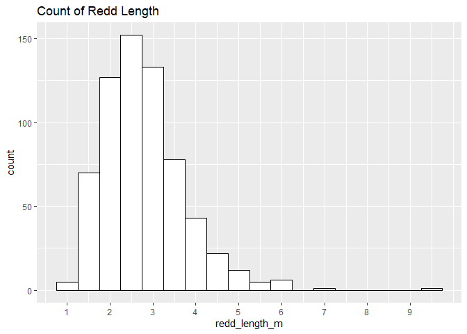
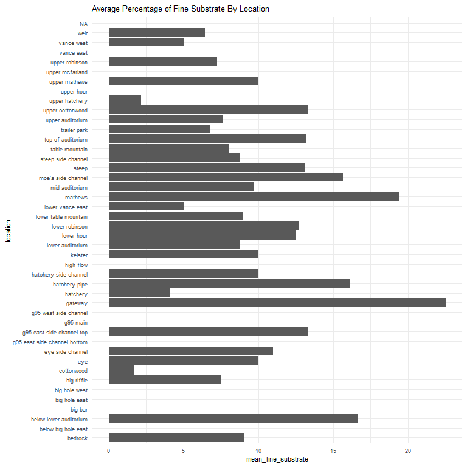
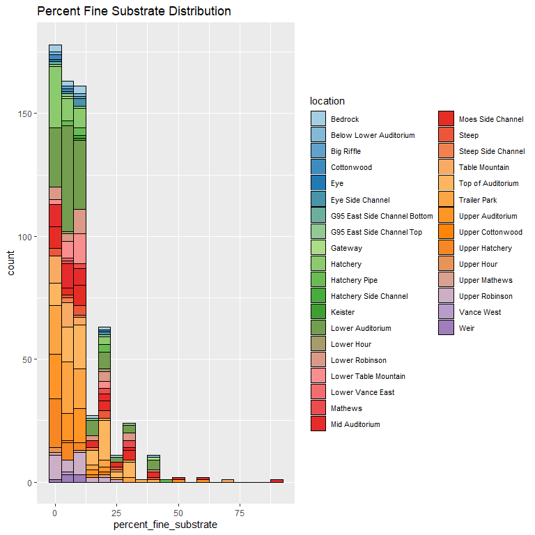
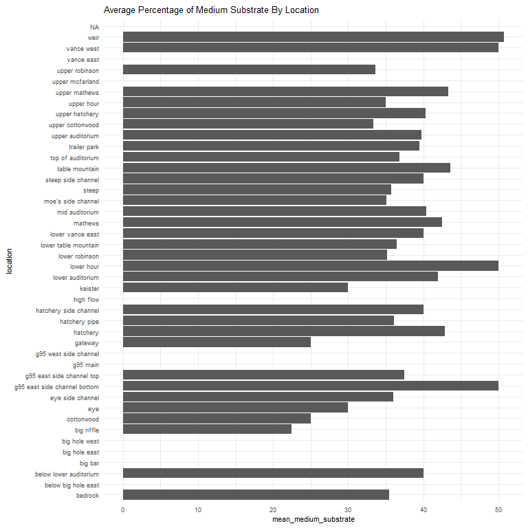
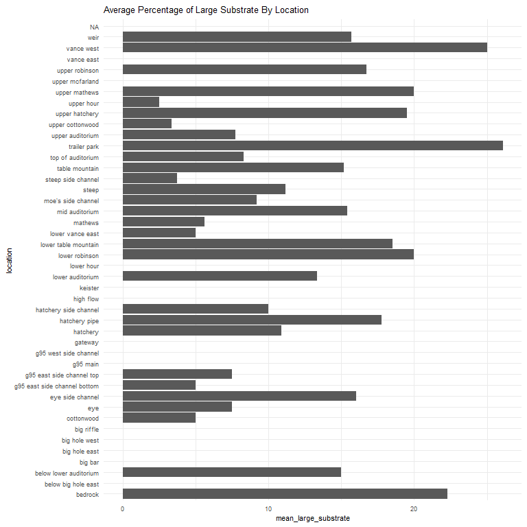
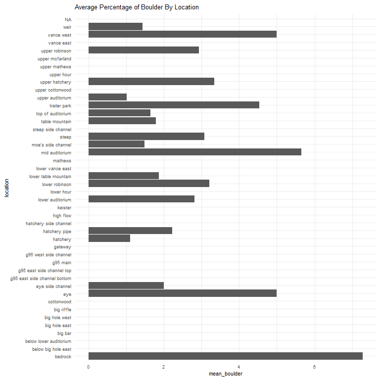
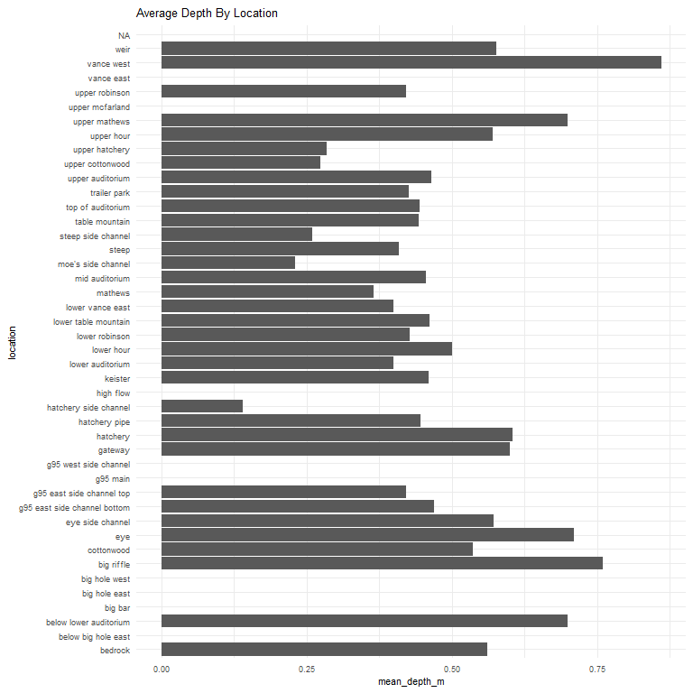
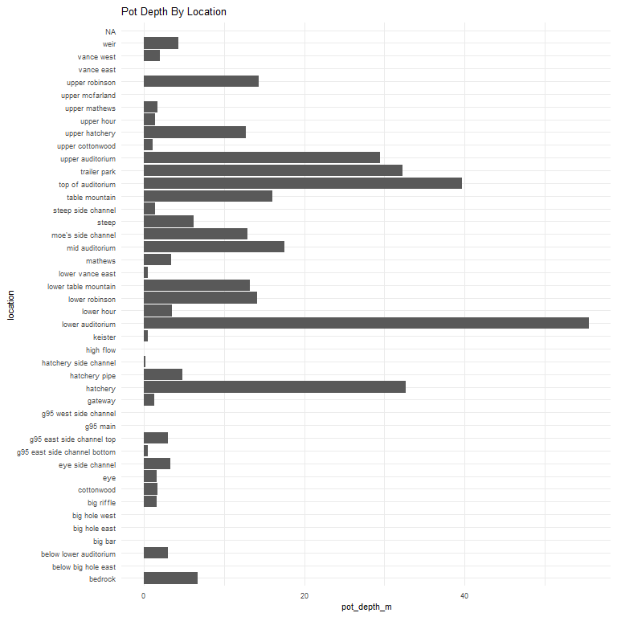
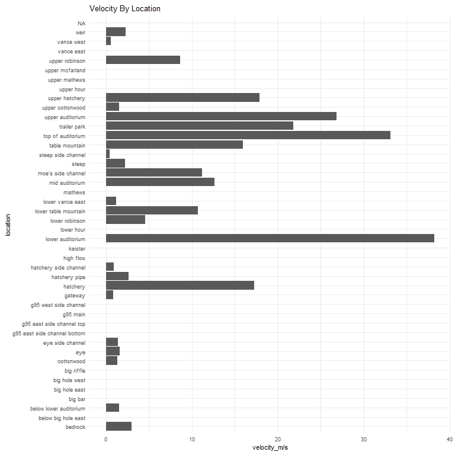

feather-river-redd-survey-qc-checklist-2019
================
Inigo Peng
10/6/2021

# Feather River Redd Survey Data

## Description of Monitoring Data

**Timeframe:** 2019

**Completeness of Record throughout timeframe: **  

-   Longitude and latitude data are not available for 2009, 2010, 2011,
    2012, 2019, 2020. NA values will be filled in for these data sets in
    final cleaned data set.

**Sampling Location:** Feather River

**Data Contact:** [Chris Cook](Chris.Cook@water.ca.gov)

Additional Info:  
1. Latitude and longitude are in NAD 1983 UTM Zone 10N  
2. The substrate is observed visually and an estimate of the percentage
of 5 size classes:  
\* fines &lt;1cm  
\* small 1-5cm  
\* medium 6-15cm  
\* large 16-30cm  
\* boulder &gt;30cm

## Access Cloud Data

``` r
# Run Sys.setenv() to specify GCS_AUTH_FILE and GCS_DEFAULT_BUCKET before running
# Open object from google cloud storage
# Set your authentication using gcs_auth
gcs_auth(json_file = Sys.getenv("GCS_AUTH_FILE"))
# Set global bucket 
gcs_global_bucket(bucket = Sys.getenv("GCS_DEFAULT_BUCKET"))
gcs_list_objects()
# git data and save as xlsx
gcs_get_object(object_name = "adult-holding-redd-and-carcass-surveys/feather-river/data-raw/redd_survey/2019_Chinook_Redd_Survey_Data_raw.xlsx",
               bucket = gcs_get_global_bucket(),
               saveToDisk = "2019_Chinook_Redd_Survey_Data_raw.xlsx",
               overwrite = TRUE)
```

Read in data from google cloud, glimpse raw data:

``` r
raw_data_2019 = readxl::read_excel("2019_Chinook_Redd_Survey_Data_raw.xlsx")
glimpse(raw_data_2019)
```

    ## Rows: 5,048
    ## Columns: 19
    ## $ Date              <dttm> 2019-09-03, 2019-09-04, 2019-09-05, 2019-09-06, 201~
    ## $ `Survey Wk`       <chr> "1-1", "1-2", "1-3", "1-4", "2-1", "3-1", "3-1", "3-~
    ## $ Location          <chr> NA, NA, NA, NA, NA, "Middle Auditorium", "Middle Aud~
    ## $ `File #`          <dbl> NA, NA, NA, NA, NA, 1, 2, 3, 1, 2, 3, 4, 5, 6, 7, 8,~
    ## $ Type              <chr> NA, NA, NA, NA, NA, "p", "p", "p", "p", "p", "p", "p~
    ## $ `# redds`         <dbl> 0, 0, 0, 0, 0, 1, 1, 1, 1, 1, 1, 1, 1, 1, 1, 1, 1, 1~
    ## $ `# salmon`        <dbl> 0, 0, 0, 0, 0, 1, 3, 2, 0, 0, 0, 0, 0, 0, 0, 0, 0, 0~
    ## $ `Latitude mN`     <lgl> NA, NA, NA, NA, NA, NA, NA, NA, NA, NA, NA, NA, NA, ~
    ## $ `Longitude mE`    <lgl> NA, NA, NA, NA, NA, NA, NA, NA, NA, NA, NA, NA, NA, ~
    ## $ `Depth (m)`       <dbl> NA, NA, NA, NA, NA, 0.24, 0.47, 0.56, 0.48, 0.50, 0.~
    ## $ `Pot Depth (m)`   <dbl> NA, NA, NA, NA, NA, 0.34, 0.60, 0.72, 0.52, 0.54, 0.~
    ## $ `Velocity (m/s)`  <dbl> NA, NA, NA, NA, NA, 0.64, 1.10, 0.50, 0.47, 0.69, 0.~
    ## $ `% fines`         <dbl> NA, NA, NA, NA, NA, 10, 0, 0, 5, 0, 0, 5, 5, 40, 10,~
    ## $ `% small`         <dbl> NA, NA, NA, NA, NA, 40, 40, 60, 35, 30, 40, 20, 40, ~
    ## $ `% med`           <dbl> NA, NA, NA, NA, NA, 50, 50, 40, 60, 70, 55, 70, 50, ~
    ## $ `% large`         <dbl> NA, NA, NA, NA, NA, 0, 0, 0, 0, 0, 5, 5, 5, 5, 0, 5,~
    ## $ `% boulder`       <dbl> NA, NA, NA, NA, NA, 0, 10, 0, 0, 0, 0, 0, 0, 0, 0, 0~
    ## $ `redd width (m)`  <dbl> NA, NA, NA, NA, NA, 1.1, 1.5, 2.0, 1.1, 1.0, 1.2, 0.~
    ## $ `redd length (m)` <dbl> NA, NA, NA, NA, NA, 4.5, 4.5, 3.7, 2.0, 1.5, 3.1, 1.~

## Data Transformation

``` r
cleaner_data_2019 <- raw_data_2019 %>% 
  select(-c('Survey Wk', 'File #', '# redds')) %>% 
  rename('type'= Type,
         'salmon_counted'= '# salmon',
         'latitude' = 'Latitude mN',
         'longitude' = 'Longitude mE',
         'depth_m' = 'Depth (m)',
         'pot_depth_m' = 'Pot Depth (m)',
         'velocity_m/s' = 'Velocity (m/s)',
         'percent_fine_substrate' = '% fines',
         'percent_small_substrate' = '% small',
         'percent_medium_substrate'= '% med',
         'percent_large_substrate' = '% large',
         'percent_boulder' = '% boulder',
         'redd_width_m' = 'redd width (m)',
         'redd_length_m' = 'redd length (m)',
         ) %>% 
  mutate(latitude = as.numeric(latitude),
         longitude = as.numeric(longitude)) %>% 
  glimpse()
```

    ## Rows: 5,048
    ## Columns: 16
    ## $ Date                     <dttm> 2019-09-03, 2019-09-04, 2019-09-05, 2019-09-~
    ## $ Location                 <chr> NA, NA, NA, NA, NA, "Middle Auditorium", "Mid~
    ## $ type                     <chr> NA, NA, NA, NA, NA, "p", "p", "p", "p", "p", ~
    ## $ salmon_counted           <dbl> 0, 0, 0, 0, 0, 1, 3, 2, 0, 0, 0, 0, 0, 0, 0, ~
    ## $ latitude                 <dbl> NA, NA, NA, NA, NA, NA, NA, NA, NA, NA, NA, N~
    ## $ longitude                <dbl> NA, NA, NA, NA, NA, NA, NA, NA, NA, NA, NA, N~
    ## $ depth_m                  <dbl> NA, NA, NA, NA, NA, 0.24, 0.47, 0.56, 0.48, 0~
    ## $ pot_depth_m              <dbl> NA, NA, NA, NA, NA, 0.34, 0.60, 0.72, 0.52, 0~
    ## $ `velocity_m/s`           <dbl> NA, NA, NA, NA, NA, 0.64, 1.10, 0.50, 0.47, 0~
    ## $ percent_fine_substrate   <dbl> NA, NA, NA, NA, NA, 10, 0, 0, 5, 0, 0, 5, 5, ~
    ## $ percent_small_substrate  <dbl> NA, NA, NA, NA, NA, 40, 40, 60, 35, 30, 40, 2~
    ## $ percent_medium_substrate <dbl> NA, NA, NA, NA, NA, 50, 50, 40, 60, 70, 55, 7~
    ## $ percent_large_substrate  <dbl> NA, NA, NA, NA, NA, 0, 0, 0, 0, 0, 5, 5, 5, 5~
    ## $ percent_boulder          <dbl> NA, NA, NA, NA, NA, 0, 10, 0, 0, 0, 0, 0, 0, ~
    ## $ redd_width_m             <dbl> NA, NA, NA, NA, NA, 1.1, 1.5, 2.0, 1.1, 1.0, ~
    ## $ redd_length_m            <dbl> NA, NA, NA, NA, NA, 4.5, 4.5, 3.7, 2.0, 1.5, ~

``` r
cleaner_data_2019 <- cleaner_data_2019 %>% 
  set_names(tolower(colnames(cleaner_data_2019))) %>% 
  mutate(date = as.Date(date)) %>% 
  glimpse()
```

    ## Rows: 5,048
    ## Columns: 16
    ## $ date                     <date> 2019-09-03, 2019-09-04, 2019-09-05, 2019-09-~
    ## $ location                 <chr> NA, NA, NA, NA, NA, "Middle Auditorium", "Mid~
    ## $ type                     <chr> NA, NA, NA, NA, NA, "p", "p", "p", "p", "p", ~
    ## $ salmon_counted           <dbl> 0, 0, 0, 0, 0, 1, 3, 2, 0, 0, 0, 0, 0, 0, 0, ~
    ## $ latitude                 <dbl> NA, NA, NA, NA, NA, NA, NA, NA, NA, NA, NA, N~
    ## $ longitude                <dbl> NA, NA, NA, NA, NA, NA, NA, NA, NA, NA, NA, N~
    ## $ depth_m                  <dbl> NA, NA, NA, NA, NA, 0.24, 0.47, 0.56, 0.48, 0~
    ## $ pot_depth_m              <dbl> NA, NA, NA, NA, NA, 0.34, 0.60, 0.72, 0.52, 0~
    ## $ `velocity_m/s`           <dbl> NA, NA, NA, NA, NA, 0.64, 1.10, 0.50, 0.47, 0~
    ## $ percent_fine_substrate   <dbl> NA, NA, NA, NA, NA, 10, 0, 0, 5, 0, 0, 5, 5, ~
    ## $ percent_small_substrate  <dbl> NA, NA, NA, NA, NA, 40, 40, 60, 35, 30, 40, 2~
    ## $ percent_medium_substrate <dbl> NA, NA, NA, NA, NA, 50, 50, 40, 60, 70, 55, 7~
    ## $ percent_large_substrate  <dbl> NA, NA, NA, NA, NA, 0, 0, 0, 0, 0, 5, 5, 5, 5~
    ## $ percent_boulder          <dbl> NA, NA, NA, NA, NA, 0, 10, 0, 0, 0, 0, 0, 0, ~
    ## $ redd_width_m             <dbl> NA, NA, NA, NA, NA, 1.1, 1.5, 2.0, 1.1, 1.0, ~
    ## $ redd_length_m            <dbl> NA, NA, NA, NA, NA, 4.5, 4.5, 3.7, 2.0, 1.5, ~

## Explore Categorical Variables

``` r
cleaner_data_2019 %>% 
  select_if(is.character) %>% colnames()
```

    ## [1] "location" "type"

### Variable:`location`

``` r
table(cleaner_data_2019$location)
```

    ## 
    ##                Bedrock    Below Big Hole East Below Lower Auditorium 
    ##                    125                      3                    126 
    ##                Big Bar          Big Hole East          Big Hole West 
    ##                      6                     51                      6 
    ##             Big Riffle             Cottonwood                    Eye 
    ##                     11                     93                     21 
    ##       Eye Side Channel        G95 East Bottom           G95 East Top 
    ##                     12                      4                     42 
    ##               G95 Main               G95 West  G95 West Side Channel 
    ##                     11                      4                      1 
    ##                Gateway               Hatchery          Hatchery Pipe 
    ##                     11                    471                    122 
    ##  Hatchery Side Channel              High Flow                Keister 
    ##                      1                      1                      5 
    ##       Lower Auditorium             lower Hour             Lower Hour 
    ##                    737                      5                     14 
    ##         Lower Robinson   Lower Table Mountain       Lower Vance East 
    ##                    224                    197                      6 
    ##               Matthews      Middle Auditorium     Moe's Side Channel 
    ##                     81                    204                    268 
    ##                  Steep     Steep Side Channel         Table Mountain 
    ##                     44                      9                    245 
    ##      Top of Auditorium           Trailer Park       Upper Auditorium 
    ##                    434                    567                    365 
    ##       Upper Cottonwood         Upper Hatchery             Upper Hour 
    ##                     31                    222                      8 
    ##         Upper Matthews        Upper McFarland         Upper Robinson 
    ##                     33                      2                    137 
    ##             Vance East             Vance West                   Weir 
    ##                     21                      4                     58

Locations names are changed to be consistent with the rest of the
Feather River redd survey files:

``` r
cleaner_data_2019 <- cleaner_data_2019 %>% 
  mutate(location = tolower(location),
         location = if_else(location == "g95 east bottom", "g95 east side channel bottom", location),
         location = if_else(location == "g95 east top", "g95 east side channel top", location),
         location = if_else(location == "g95 west", "g95 west side channel", location),
         location = if_else(location == "matthews", "mathews", location),
         location = if_else(location == "middle auditorium", "mid auditorium", location),
         location = if_else(location == "upper matthews", "upper mathews", location)
         )
table(cleaner_data_2019$location)
```

    ## 
    ##                      bedrock          below big hole east 
    ##                          125                            3 
    ##       below lower auditorium                      big bar 
    ##                          126                            6 
    ##                big hole east                big hole west 
    ##                           51                            6 
    ##                   big riffle                   cottonwood 
    ##                           11                           93 
    ##                          eye             eye side channel 
    ##                           21                           12 
    ## g95 east side channel bottom    g95 east side channel top 
    ##                            4                           42 
    ##                     g95 main        g95 west side channel 
    ##                           11                            5 
    ##                      gateway                     hatchery 
    ##                           11                          471 
    ##                hatchery pipe        hatchery side channel 
    ##                          122                            1 
    ##                    high flow                      keister 
    ##                            1                            5 
    ##             lower auditorium                   lower hour 
    ##                          737                           19 
    ##               lower robinson         lower table mountain 
    ##                          224                          197 
    ##             lower vance east                      mathews 
    ##                            6                           81 
    ##               mid auditorium           moe's side channel 
    ##                          204                          268 
    ##                        steep           steep side channel 
    ##                           44                            9 
    ##               table mountain            top of auditorium 
    ##                          245                          434 
    ##                 trailer park             upper auditorium 
    ##                          567                          365 
    ##             upper cottonwood               upper hatchery 
    ##                           31                          222 
    ##                   upper hour                upper mathews 
    ##                            8                           33 
    ##              upper mcfarland               upper robinson 
    ##                            2                          137 
    ##                   vance east                   vance west 
    ##                           21                            4 
    ##                         weir 
    ##                           58

-   0.1 % of values in the `location` column are NA.

## Variable:`Type`

Description:  
Area - polygon mapped with Trimble GPS unit Point - points mapped with
Trimble GPS unit Questionable redds - polygon mapped with Trimble GPS
unit where the substrate was disturbed but did not have the proper
characteristics to be called a redd - it was no longer recorded after
2019

``` r
table(cleaner_data_2019$type)
```

    ## 
    ##    p 
    ## 5042

``` r
cleaner_data_2019 <- cleaner_data_2019 %>% 
  mutate(type = tolower(type),
         type = if_else(type == 'p', 'Point', type))
table(cleaner_data_2019$type)
```

    ## 
    ## Point 
    ##  5042

## Explore Numeric Variables

``` r
cleaner_data_2019 %>% 
  select_if(is.numeric) %>% colnames()
```

    ##  [1] "salmon_counted"           "latitude"                
    ##  [3] "longitude"                "depth_m"                 
    ##  [5] "pot_depth_m"              "velocity_m/s"            
    ##  [7] "percent_fine_substrate"   "percent_small_substrate" 
    ##  [9] "percent_medium_substrate" "percent_large_substrate" 
    ## [11] "percent_boulder"          "redd_width_m"            
    ## [13] "redd_length_m"

### Variable:`salmon_counted`

#### Plotting salmon counted in 2019 

``` r
cleaner_data_2019 %>% 
  ggplot(aes(x = date, y = salmon_counted)) + 
  geom_col() +
  facet_wrap(~year(date), scales = "free") +
  scale_x_date(labels = date_format("%b"), date_breaks = "1 month")+
  theme_minimal() +
  theme(axis.text.x = element_text(size = 10,angle = 90, vjust = 0.5, hjust=0.1)) +
  theme(axis.text.y = element_text(size = 8))+
  labs(title = "Daily Salmon Counted in 2019")
```

<!-- -->

**Numeric Daily Summary of salmon\_counted Over 2019**

``` r
cleaner_data_2019 %>%
  group_by(date) %>%
  summarise(count = sum(salmon_counted, na.rm = T)) %>%
  pull(count) %>%
  summary()
```

    ##    Min. 1st Qu.  Median    Mean 3rd Qu.    Max. 
    ##    0.00    3.50    7.00   12.88   15.50  101.00

``` r
cleaner_data_2019  %>%
  ggplot(aes(y = location, x = salmon_counted))+
  geom_boxplot() +
  theme_minimal() +
  theme(text = element_text(size = 10))+
  scale_y_discrete()+
  theme(axis.text.y = element_text(size = 8,vjust = 0.1, hjust=0.2))+
  labs(title = "Salmon Count By Locations")
```

<!-- -->
**Numeric summary of salmon\_counted by location in 2019**

``` r
cleaner_data_2019 %>%
  group_by(location) %>% 
  summarise(count = sum(salmon_counted, na.rm = T)) %>% 
  pull(count) %>%
  summary()
```

    ##    Min. 1st Qu.  Median    Mean 3rd Qu.    Max. 
    ##    0.00    0.00    3.50   12.59   11.50  143.00

**NA and Unknown Values** \* 0 % of values in the `salmon_counted`
column are NA.

### Variable:`redd_width_m`

``` r
cleaner_data_2019 %>%
  group_by(location) %>%
  summarise(mean_redd_width = mean(redd_width_m, na.rm = TRUE)) %>%
  ggplot(aes(y = location, x = mean_redd_width)) +
  geom_col() +
  theme_minimal() +
  theme(text = element_text(size = 8)) +
  labs(title = "Mean Redd Width By Location")
```

<!-- -->

``` r
cleaner_data_2019 %>%
  ggplot(aes(x = redd_width_m)) +
  geom_histogram(binwidth = 0.3, color = "black", fill = "white") +
  scale_x_continuous(breaks = round(seq(min(cleaner_data_2019$redd_width_m, na.rm = TRUE), max(cleaner_data_2019$redd_width_m, na.rm = TRUE), by = 0.5),0))+
  labs(title = "Count of Redd Width")
```

<!-- -->

**Numeric Summary of redd\_width\_m Over 2019**

``` r
summary(cleaner_data_2019$redd_width_m)
```

    ##    Min. 1st Qu.  Median    Mean 3rd Qu.    Max.    NA's 
    ##   0.600   1.200   1.400   1.539   1.900   6.100    4393

**NA and Unknown Values** \* 87 % of values in the `redd_width_m` column
are NA.

### Variable: `redd_length_m`

``` r
cleaner_data_2019 %>%
  group_by(location) %>%
  summarise(mean_redd_length = mean(redd_length_m, na.rm = TRUE)) %>%
  ggplot(aes(y = location, x = mean_redd_length)) +
  geom_col() +
  theme_minimal() +
  theme(text = element_text(size = 8)) +
  labs(title = "Mean Redd Length By Location")
```

<!-- -->

``` r
cleaner_data_2019 %>%
  ggplot(aes(x = redd_length_m)) +
  geom_histogram(binwidth = 0.5, color = "black", fill = "white") +
  scale_x_continuous(breaks = round(seq(min(cleaner_data_2019$redd_length_m, na.rm = TRUE), max(cleaner_data_2019$redd_length_m, na.rm = TRUE), by = 1),0))+
  labs(title = "Count of Redd Length")
```

<!-- -->

**Numeric Summary of redd\_length\_m Over 2019**

``` r
summary(cleaner_data_2019$redd_length_m)
```

    ##    Min. 1st Qu.  Median    Mean 3rd Qu.    Max.    NA's 
    ##   1.000   2.110   2.600   2.788   3.300   9.700    4393

**NA and Unknown Values** \* 87 % of values in the `redd_length_m`
column are NA.

### Location Physical Attributes

### Variable:`percent_fine_substrate`

``` r
cleaner_data_2019 %>%
  group_by(location) %>% 
  summarise(mean_fine_substrate = mean(percent_fine_substrate, na.rm = TRUE)) %>%
  ggplot(aes(y = location, x = mean_fine_substrate)) +
  geom_col() +
  theme_minimal() +
  theme(text = element_text(size = 8)) +
  labs(title = "Average Percentage of Fine Substrate By Location")
```

<!-- -->

**Numeric Summary of percent\_fine\_substrate Over 2019**

``` r
summary(cleaner_data_2019$percent_fine_substrate)
```

    ##    Min. 1st Qu.  Median    Mean 3rd Qu.    Max.    NA's 
    ##   0.000   0.000   5.000   9.263  10.000  90.000    4402

**NA and Unknown Values** \* 87.2 % of values in the
`percent_fine_substrate` column are NA.

### Variable:`percent_small_substrate`

``` r
cleaner_data_2019 %>%
  group_by(location) %>% 
  summarise(mean_small_substrate = mean(percent_small_substrate, na.rm = TRUE)) %>%
  ggplot(aes(y = location, x = mean_small_substrate)) +
  geom_col() +
  theme_minimal() +
  theme(text = element_text(size = 8)) +
  labs(title = "Average Percentage of Small Substrate By Location")
```

<!-- -->

**Numeric Summary of percent\_small\_substrate Over 2019**

``` r
summary(cleaner_data_2019$percent_small_substrate)
```

    ##    Min. 1st Qu.  Median    Mean 3rd Qu.    Max.    NA's 
    ##    0.00   20.00   30.00   35.03   45.00   90.00    4402

**NA and Unknown Values** \* 87.2 % of values in the
`percent_small_substrate` column are NA.

### Variable:`percent_medium_substrate`

``` r
cleaner_data_2019 %>%
  group_by(location) %>% 
  summarise(mean_medium_substrate = mean(percent_medium_substrate, na.rm = TRUE)) %>%
  ggplot(aes(y = location, x = mean_medium_substrate)) +
  geom_col() +
  theme_minimal() +
  theme(text = element_text(size = 8)) +
  labs(title = "Average Percentage of Medium Substrate By Location")
```

<!-- -->

**Numeric Summary of percent\_medium\_substrate Over 2019**

``` r
summary(cleaner_data_2019$percent_medium_substrate)
```

    ##    Min. 1st Qu.  Median    Mean 3rd Qu.    Max.    NA's 
    ##     0.0    30.0    40.0    39.1    50.0    90.0    4402

**NA and Unknown Values** \* 87.2 % of values in the
`percent_medium_substrate` column are NA.

### Variable:`percent_large_substrate`

``` r
cleaner_data_2019 %>%
  group_by(location) %>% 
  summarise(mean_large_substrate = mean(percent_large_substrate, na.rm = TRUE)) %>%
  ggplot(aes(y = location, x = mean_large_substrate)) +
  geom_col() +
  theme_minimal() +
  theme(text = element_text(size = 8)) +
  labs(title = "Average Percentage of Large Substrate By Location")
```

<!-- -->

**Numeric Summary of percent\_large\_substrate Over 2019**

``` r
summary(cleaner_data_2019$percent_large_substrate)
```

    ##    Min. 1st Qu.  Median    Mean 3rd Qu.    Max.    NA's 
    ##    0.00    0.00   10.00   14.07   20.00   70.00    4402

**NA and Unknown Values** \* 87.2 % of values in the
`percent_large_substrate` column are NA.

### Variable:`percent_boulder`

``` r
cleaner_data_2019 %>%
  group_by(location) %>% 
  summarise(mean_boulder = mean(percent_boulder, na.rm = TRUE)) %>%
  ggplot(aes(y = location, x = mean_boulder)) +
  geom_col() +
  theme_minimal() +
  theme(text = element_text(size = 8)) +
  labs(title = "Average Percentage of Boulder By Location")
```

<!-- -->

**Numeric Summary of percent\_boulder Over 2019**

``` r
summary(cleaner_data_2019$percent_boulder)
```

    ##    Min. 1st Qu.  Median    Mean 3rd Qu.    Max.    NA's 
    ##   0.000   0.000   0.000   2.508   5.000  70.000    4402

**NA and Unknown Values** NA and Unknown Values\*\* \* 87.2 % of values
in the `percent_large_substrate` column are NA.

### Variable: `depth_m`

``` r
cleaner_data_2019 %>% 
  group_by(location) %>% 
  summarise(mean_depth_m = mean(depth_m, na.rm = TRUE)) %>%
  ggplot(aes(x = mean_depth_m, y = location)) + 
  geom_col() + 
  theme_minimal() + 
  theme(text = element_text(size = 8))+
  labs(title = "Average Depth By Location")
```

<!-- -->
**Numeric Summary of depth\_m Over 2019**

``` r
summary(cleaner_data_2019$depth_m)
```

    ##    Min. 1st Qu.  Median    Mean 3rd Qu.    Max.    NA's 
    ##   0.070   0.300   0.420   0.435   0.540   1.200    4389

**NA and Unknown Values** NA and Unknown Values\*\* \* 86.9 % of values
in the `depth_m` column are NA.

### Variable: `pot_depth_m`

``` r
cleaner_data_2019 %>% 
  group_by(location) %>% 
  summarise(mean_pot_depth_m = mean(pot_depth_m, na.rm = TRUE)) %>%
  ggplot(aes(x = mean_pot_depth_m, y = location)) + 
  geom_col() + 
  theme_minimal() + 
  theme(text = element_text(size = 8))+
  labs(title = "Average Pot Depth By Location")
```

<!-- -->

**Numeric Summary of pot\_depth\_m Over 2019**

``` r
summary(cleaner_data_2019$pot_depth_m)
```

    ##    Min. 1st Qu.  Median    Mean 3rd Qu.    Max.    NA's 
    ##   0.100   0.400   0.500   0.523   0.640   1.400    4389

**NA and Unknown Values** NA and Unknown Values\*\* \* 86.9 % of values
in the `pot_depth_m` column are NA.

### Variable: `velocity_m/s`

``` r
cleaner_data_2019 %>% 
  group_by(location) %>% 
  summarise(`mean_velocity_m/s` = mean(`velocity_m/s`, na.rm = TRUE)) %>%
  ggplot(aes(x = `mean_velocity_m/s`, y = location)) + 
  geom_col() + 
  theme_minimal() + 
  theme(text = element_text(size = 8))+
  labs(title = "Average Velocity By Location")
```

<!-- -->

**Numeric Summary of velocity\_m/s Over 2019**

``` r
summary(cleaner_data_2019$`velocity_m/s`)
```

    ##    Min. 1st Qu.  Median    Mean 3rd Qu.    Max.    NA's 
    ##   0.050   0.330   0.478   0.503   0.648   1.400    4570

**NA and Unknown Values** NA and Unknown Values\*\* \* 90.5 % of values
in the `velocity_m/s` column are NA.

``` r
feather_redd_survey_2019 <- cleaner_data_2019 %>% glimpse()
```

    ## Rows: 5,048
    ## Columns: 16
    ## $ date                     <date> 2019-09-03, 2019-09-04, 2019-09-05, 2019-09-~
    ## $ location                 <chr> NA, NA, NA, NA, NA, "mid auditorium", "mid au~
    ## $ type                     <chr> NA, NA, NA, NA, NA, "Point", "Point", "Point"~
    ## $ salmon_counted           <dbl> 0, 0, 0, 0, 0, 1, 3, 2, 0, 0, 0, 0, 0, 0, 0, ~
    ## $ latitude                 <dbl> NA, NA, NA, NA, NA, NA, NA, NA, NA, NA, NA, N~
    ## $ longitude                <dbl> NA, NA, NA, NA, NA, NA, NA, NA, NA, NA, NA, N~
    ## $ depth_m                  <dbl> NA, NA, NA, NA, NA, 0.24, 0.47, 0.56, 0.48, 0~
    ## $ pot_depth_m              <dbl> NA, NA, NA, NA, NA, 0.34, 0.60, 0.72, 0.52, 0~
    ## $ `velocity_m/s`           <dbl> NA, NA, NA, NA, NA, 0.64, 1.10, 0.50, 0.47, 0~
    ## $ percent_fine_substrate   <dbl> NA, NA, NA, NA, NA, 10, 0, 0, 5, 0, 0, 5, 5, ~
    ## $ percent_small_substrate  <dbl> NA, NA, NA, NA, NA, 40, 40, 60, 35, 30, 40, 2~
    ## $ percent_medium_substrate <dbl> NA, NA, NA, NA, NA, 50, 50, 40, 60, 70, 55, 7~
    ## $ percent_large_substrate  <dbl> NA, NA, NA, NA, NA, 0, 0, 0, 0, 0, 5, 5, 5, 5~
    ## $ percent_boulder          <dbl> NA, NA, NA, NA, NA, 0, 10, 0, 0, 0, 0, 0, 0, ~
    ## $ redd_width_m             <dbl> NA, NA, NA, NA, NA, 1.1, 1.5, 2.0, 1.1, 1.0, ~
    ## $ redd_length_m            <dbl> NA, NA, NA, NA, NA, 4.5, 4.5, 3.7, 2.0, 1.5, ~

### Add cleaned data back onto google cloud

``` r
f <- function(input, output) write_csv(input, file = output)

gcs_upload(feather_redd_survey_2019,
           object_function = f,
           type = "csv",
           name = "adult-holding-redd-and-carcass-surveys/feather-river/data/2019_Chinook_Redd_Survey_Data.csv")
```

    ## i 2021-10-13 10:09:17 > File size detected as  348.1 Kb

    ## i 2021-10-13 10:09:18 > Request Status Code:  400

    ## ! API returned: Cannot insert legacy ACL for an object when uniform bucket-level access is enabled. Read more at https://cloud.google.com/storage/docs/uniform-bucket-level-access - Retrying with predefinedAcl='bucketLevel'

    ## i 2021-10-13 10:09:18 > File size detected as  348.1 Kb

    ## ==Google Cloud Storage Object==
    ## Name:                adult-holding-redd-and-carcass-surveys/feather-river/data/2019_Chinook_Redd_Survey_Data.csv 
    ## Type:                csv 
    ## Size:                348.1 Kb 
    ## Media URL:           https://www.googleapis.com/download/storage/v1/b/jpe-dev-bucket/o/adult-holding-redd-and-carcass-surveys%2Ffeather-river%2Fdata%2F2019_Chinook_Redd_Survey_Data.csv?generation=1634144958871590&alt=media 
    ## Download URL:        https://storage.cloud.google.com/jpe-dev-bucket/adult-holding-redd-and-carcass-surveys%2Ffeather-river%2Fdata%2F2019_Chinook_Redd_Survey_Data.csv 
    ## Public Download URL: https://storage.googleapis.com/jpe-dev-bucket/adult-holding-redd-and-carcass-surveys%2Ffeather-river%2Fdata%2F2019_Chinook_Redd_Survey_Data.csv 
    ## Bucket:              jpe-dev-bucket 
    ## ID:                  jpe-dev-bucket/adult-holding-redd-and-carcass-surveys/feather-river/data/2019_Chinook_Redd_Survey_Data.csv/1634144958871590 
    ## MD5 Hash:            bo5PLrvQljCPmH5sngQIEg== 
    ## Class:               STANDARD 
    ## Created:             2021-10-13 17:09:18 
    ## Updated:             2021-10-13 17:09:18 
    ## Generation:          1634144958871590 
    ## Meta Generation:     1 
    ## eTag:                CKbwo67wx/MCEAE= 
    ## crc32c:              HRQKDQ==
