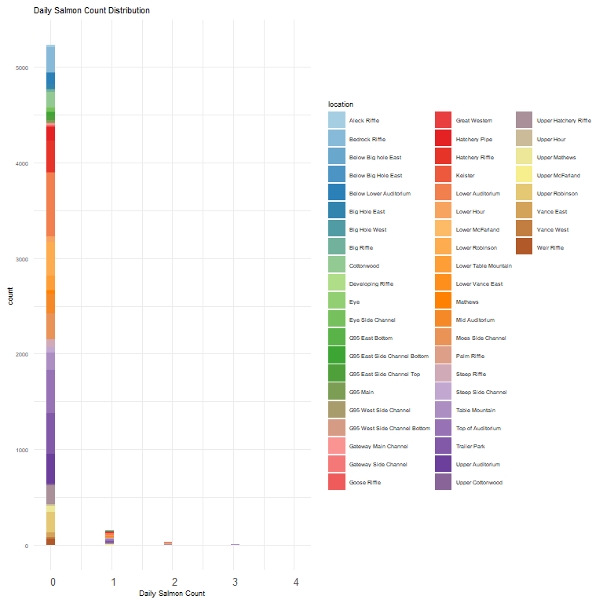
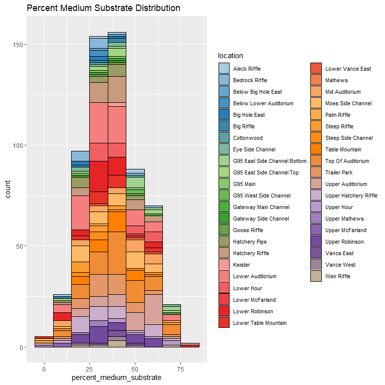
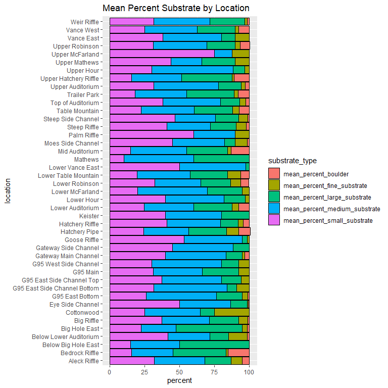

feather-river-redd-survey-qc-checklist-2020
================
Inigo Peng
10/6/2021

# Feather River Redd Survey Data

## Description of Monitoring Data

**Timeframe:** 2020

**Completeness of Record throughout timeframe:**

-   Longitude and latitude data are not available for 2009, 2010, 2011,
    2012, 2019, 2020. NA values will be filled in for these data sets in
    final cleaned data set.

**Sampling Location:** Various sampling locations on Feather River.

**Data Contact:** [Chris Cook](mailto::Chris.Cook@water.ca.gov)

Additional Info:  
1. Latitude and longitude are in NAD 1983 UTM Zone 10N  
2. The substrate is observed visually and an estimate of the percentage
of 5 size classes:

-   fines &lt;1cm  
-   small 1-5cm  
-   medium 6-15cm  
-   large 16-30cm  
-   boulder &gt;30cm

## Access Cloud Data

``` r
# Run Sys.setenv() to specify GCS_AUTH_FILE and GCS_DEFAULT_BUCKET before running
# Open object from google cloud storage
# Set your authentication using gcs_auth
gcs_auth(json_file = Sys.getenv("GCS_AUTH_FILE"))
# Set global bucket 
gcs_global_bucket(bucket = Sys.getenv("GCS_DEFAULT_BUCKET"))
gcs_list_objects()
# git data and save as xlsx
gcs_get_object(object_name = "adult-holding-redd-and-carcass-surveys/feather-river/data-raw/redd_survey/2020_Chinook_Redd_Survey_Data_raw.xlsx",
               bucket = gcs_get_global_bucket(),
               saveToDisk = "2020_Chinook_Redd_Survey_Data_raw.xlsx",
               overwrite = TRUE)
```

Read in data from google cloud, glimpse raw data:

``` r
raw_data_2020 = readxl::read_excel("2020_Chinook_Redd_Survey_Data_raw.xlsx",
                                   col_types = c("date","text","text","numeric","text","numeric", "numeric", "numeric","numeric","numeric","numeric","numeric","numeric","numeric","numeric"
                                                 ,"numeric","numeric","numeric","numeric"))
glimpse(raw_data_2020)
```

    ## Rows: 5,432
    ## Columns: 19
    ## $ Date              <dttm> 2020-09-22, 2020-09-22, 2020-09-22, 2020-09-22, 202~
    ## $ `Survey Wk`       <chr> "1-1", "1-1", "1-1", "1-1", "1-1", "1-1", "1-1", "1-~
    ## $ Location          <chr> "Table Mountain", "Table Mountain", "Lower Table Mou~
    ## $ `File#`           <dbl> 1, 2, 3, 4, 5, 6, 7, 8, 9, 10, 11, 12, 13, 14, 15, 1~
    ## $ Type              <chr> "p", "p", "p", "p", "p", "p", "p", "p", "p", "p", "p~
    ## $ `#Redds`          <dbl> 1, 1, 1, 1, 1, 1, 1, 1, 1, 1, 1, 1, 1, 1, 1, 1, 1, 1~
    ## $ `# Salmon`        <dbl> 0, 0, 0, 1, 4, 2, 0, 1, 0, 0, 0, 0, 0, 0, 0, 0, 0, 0~
    ## $ `Latitude mN`     <dbl> NA, NA, NA, NA, NA, NA, NA, NA, NA, NA, NA, NA, NA, ~
    ## $ `Longitude nE`    <dbl> NA, NA, NA, NA, NA, NA, NA, NA, NA, NA, NA, NA, NA, ~
    ## $ `Depth (m)`       <dbl> 0.48, 0.72, NA, NA, NA, 0.47, NA, NA, 0.49, 0.52, 0.~
    ## $ `Pot Depth (m)`   <dbl> 0.54, 0.84, NA, NA, NA, 0.50, NA, NA, 0.50, 0.55, 0.~
    ## $ `Velocity (m/s)`  <dbl> 0.718, 1.012, NA, NA, NA, 0.250, NA, NA, 0.282, 0.34~
    ## $ `% Fines`         <dbl> 10, 0, NA, NA, NA, 10, NA, NA, 20, 20, 30, 0, 10, NA~
    ## $ `% Small`         <dbl> 20, 30, NA, NA, NA, 20, NA, NA, 40, 40, 40, 10, 30, ~
    ## $ `% Med`           <dbl> 30, 40, NA, NA, NA, 50, NA, NA, 30, 30, 20, 30, 40, ~
    ## $ `% Large`         <dbl> 30, 30, NA, NA, NA, 20, NA, NA, 10, 10, 10, 50, 20, ~
    ## $ `% Boulder`       <dbl> 10, 0, NA, NA, NA, 0, NA, NA, 0, 0, 0, 10, 0, NA, NA~
    ## $ `Redd Width (m)`  <dbl> 0.5, 0.5, NA, NA, NA, 0.7, NA, NA, 1.0, 1.2, 1.0, 0.~
    ## $ `Redd Length (m)` <dbl> 1.8, 1.5, NA, NA, NA, 1.8, NA, NA, 2.0, 2.2, 2.0, 1.~

## Data Transformations

``` r
cleaner_data_2020 <- raw_data_2020 %>% 
  select(-c('Survey Wk', 'File#')) %>% 
  rename('redd_count' = '#Redds',
         'salmon_count'= '# Salmon',
         'latitude' = 'Latitude mN',
         'longitude' = 'Longitude nE',
         'depth_m' = 'Depth (m)',
         'pot_depth_m' = 'Pot Depth (m)',
         'velocity_m_per_s' = 'Velocity (m/s)',
         'percent_fine_substrate' = '% Fines',
         'percent_small_substrate' = '% Small',
         'percent_medium_substrate'= '% Med',
         'percent_large_substrate' = '% Large',
         'percent_boulder' = '% Boulder',
         'redd_width_m' = 'Redd Width (m)',
         'redd_length_m' = 'Redd Length (m)'
         ) %>% 
  mutate(Date = as.Date(Date))
cleaner_data_2020 <- cleaner_data_2020 %>% 
  set_names(tolower(colnames(cleaner_data_2020))) %>% 
  glimpse()
```

    ## Rows: 5,432
    ## Columns: 17
    ## $ date                     <date> 2020-09-22, 2020-09-22, 2020-09-22, 2020-09-~
    ## $ location                 <chr> "Table Mountain", "Table Mountain", "Lower Ta~
    ## $ type                     <chr> "p", "p", "p", "p", "p", "p", "p", "p", "p", ~
    ## $ redd_count               <dbl> 1, 1, 1, 1, 1, 1, 1, 1, 1, 1, 1, 1, 1, 1, 1, ~
    ## $ salmon_count             <dbl> 0, 0, 0, 1, 4, 2, 0, 1, 0, 0, 0, 0, 0, 0, 0, ~
    ## $ latitude                 <dbl> NA, NA, NA, NA, NA, NA, NA, NA, NA, NA, NA, N~
    ## $ longitude                <dbl> NA, NA, NA, NA, NA, NA, NA, NA, NA, NA, NA, N~
    ## $ depth_m                  <dbl> 0.48, 0.72, NA, NA, NA, 0.47, NA, NA, 0.49, 0~
    ## $ pot_depth_m              <dbl> 0.54, 0.84, NA, NA, NA, 0.50, NA, NA, 0.50, 0~
    ## $ velocity_m_per_s         <dbl> 0.718, 1.012, NA, NA, NA, 0.250, NA, NA, 0.28~
    ## $ percent_fine_substrate   <dbl> 10, 0, NA, NA, NA, 10, NA, NA, 20, 20, 30, 0,~
    ## $ percent_small_substrate  <dbl> 20, 30, NA, NA, NA, 20, NA, NA, 40, 40, 40, 1~
    ## $ percent_medium_substrate <dbl> 30, 40, NA, NA, NA, 50, NA, NA, 30, 30, 20, 3~
    ## $ percent_large_substrate  <dbl> 30, 30, NA, NA, NA, 20, NA, NA, 10, 10, 10, 5~
    ## $ percent_boulder          <dbl> 10, 0, NA, NA, NA, 0, NA, NA, 0, 0, 0, 10, 0,~
    ## $ redd_width_m             <dbl> 0.5, 0.5, NA, NA, NA, 0.7, NA, NA, 1.0, 1.2, ~
    ## $ redd_length_m            <dbl> 1.8, 1.5, NA, NA, NA, 1.8, NA, NA, 2.0, 2.2, ~

## Explore `date`

``` r
cleaner_data_2020 %>%
  ggplot(aes(x = date)) +
  geom_histogram(binwidth = 7, position = 'stack', color = "black") +
  labs(title = "Value Counts For Survey Season Dates")+
  theme(legend.text = element_text(size = 8))
```

<!-- -->

**Numeric summary of date in 2019**

``` r
summary(cleaner_data_2020$date)
```

    ##         Min.      1st Qu.       Median         Mean      3rd Qu.         Max. 
    ## "2020-09-22" "2020-10-15" "2020-10-23" "2020-10-25" "2020-11-05" "2020-11-20"

**NA and Unknown Values**

-   0 % of values in the `date` column are NA.

## Explore Categorical Variables

``` r
cleaner_data_2020 %>% 
  select_if(is.character) %>% colnames()
```

    ## [1] "location" "type"

### Variable:`location`

``` r
table(cleaner_data_2020$location)
```

    ## 
    ##                 Aleck Riffle               Bedrock Riffle 
    ##                           27                          262 
    ##          Below Big hole East          Below Big Hole East 
    ##                            1                            7 
    ##       Below Lower Auditorium                Big Hole East 
    ##                          115                           55 
    ##                Big Hole West                   Big Riffle 
    ##                            7                           28 
    ##                   Cottonwood            Developing Riffle 
    ##                          156                            1 
    ##                          Eye             Eye Side Channel 
    ##                           13                           33 
    ##              G95 East Bottom G95 East Side Channel Bottom 
    ##                           11                           34 
    ##    G95 East Side Channel Top                 G95 East Top 
    ##                           27                           22 
    ##                     G95 Main              G95 West Bottom 
    ##                           29                            1 
    ##        G95 West Side Channel         Gateway Main Channel 
    ##                            9                           15 
    ##         Gateway Side Channel                 Goose Riffle 
    ##                            8                            7 
    ##                Great Western                Hatchery Pipe 
    ##                           11                          143 
    ##              Hatchery Riffle                      Keister 
    ##                          345                            6 
    ##             Lower Auditorium                   Lower Hour 
    ##                          694                           64 
    ##              Lower McFarland               Lower Robinson 
    ##                            5                          357 
    ##         Lower Table Mountain             Lower Vance East 
    ##                          153                            6 
    ##                      Mathews            Middle Auditorium 
    ##                           35                          212 
    ##           Moe's Side Channel                  Palm Riffle 
    ##                          292                            1 
    ##                 Steep Riffle           Steep Side Channel 
    ##                           79                           63 
    ##               Table Mountain            Top of Auditorium 
    ##                          195                          468 
    ##                 Trailer Park             Upper Auditorium 
    ##                          439                          328 
    ##             Upper Cottonwood        Upper Hatchery Riffle 
    ##                           15                          215 
    ##                   Upper Hour                Upper Mathews 
    ##                           18                           61 
    ##              Upper McFarland               Upper Robinson 
    ##                            7                          222 
    ##                   Vance East                   Vance West 
    ##                           48                           16 
    ##                  Weir Riffle 
    ##                           66

Locations names are changed to be consistent with the rest of the
Feather River redd survey files:

``` r
cleaner_data_2020 <- cleaner_data_2020 %>% 
  mutate(location = if_else(location == "Moe's Side Channel", "Moes Side Channel", location),
         location = if_else(location == "G95 East Top", "G95 East Side Channel Top", location),
         location = if_else(location == "G95 West Bottom", "G95 West Side Channel Bottom", location),
         location = if_else(location == "Middle Auditorium", "Mid Auditorium", location)
         )
table(cleaner_data_2020$location)
```

    ## 
    ##                 Aleck Riffle               Bedrock Riffle 
    ##                           27                          262 
    ##          Below Big hole East          Below Big Hole East 
    ##                            1                            7 
    ##       Below Lower Auditorium                Big Hole East 
    ##                          115                           55 
    ##                Big Hole West                   Big Riffle 
    ##                            7                           28 
    ##                   Cottonwood            Developing Riffle 
    ##                          156                            1 
    ##                          Eye             Eye Side Channel 
    ##                           13                           33 
    ##              G95 East Bottom G95 East Side Channel Bottom 
    ##                           11                           34 
    ##    G95 East Side Channel Top                     G95 Main 
    ##                           49                           29 
    ##        G95 West Side Channel G95 West Side Channel Bottom 
    ##                            9                            1 
    ##         Gateway Main Channel         Gateway Side Channel 
    ##                           15                            8 
    ##                 Goose Riffle                Great Western 
    ##                            7                           11 
    ##                Hatchery Pipe              Hatchery Riffle 
    ##                          143                          345 
    ##                      Keister             Lower Auditorium 
    ##                            6                          694 
    ##                   Lower Hour              Lower McFarland 
    ##                           64                            5 
    ##               Lower Robinson         Lower Table Mountain 
    ##                          357                          153 
    ##             Lower Vance East                      Mathews 
    ##                            6                           35 
    ##               Mid Auditorium            Moes Side Channel 
    ##                          212                          292 
    ##                  Palm Riffle                 Steep Riffle 
    ##                            1                           79 
    ##           Steep Side Channel               Table Mountain 
    ##                           63                          195 
    ##            Top of Auditorium                 Trailer Park 
    ##                          468                          439 
    ##             Upper Auditorium             Upper Cottonwood 
    ##                          328                           15 
    ##        Upper Hatchery Riffle                   Upper Hour 
    ##                          215                           18 
    ##                Upper Mathews              Upper McFarland 
    ##                           61                            7 
    ##               Upper Robinson                   Vance East 
    ##                          222                           48 
    ##                   Vance West                  Weir Riffle 
    ##                           16                           66

**NA and Unknown Values**

-   0 % of values in the `location` column are NA.

## Variable:`type`

# Description:

-   Area - polygon mapped with Trimble GPS unit

-   Point - points mapped with Trimble GPS unit

-   Questionable redds - polygon mapped with Trimble GPS unit where the
    substrate was disturbed but did not have the proper characteristics
    to be called a redd - it was no longer recorded after 2011

``` r
table(cleaner_data_2020$type)
```

    ## 
    ##    p 
    ## 5432

``` r
cleaner_data_2020 <- cleaner_data_2020 %>% 
  mutate(type = tolower(type),
         type = if_else(type == 'p', 'Point', type))
table(cleaner_data_2020$type)
```

    ## 
    ## Point 
    ##  5432

## Explore Numeric Variables

``` r
cleaner_data_2020 %>% 
  select_if(is.numeric) %>% colnames()
```

    ##  [1] "redd_count"               "salmon_count"            
    ##  [3] "latitude"                 "longitude"               
    ##  [5] "depth_m"                  "pot_depth_m"             
    ##  [7] "velocity_m_per_s"         "percent_fine_substrate"  
    ##  [9] "percent_small_substrate"  "percent_medium_substrate"
    ## [11] "percent_large_substrate"  "percent_boulder"         
    ## [13] "redd_width_m"             "redd_length_m"

### Variable:`salmon_count`

``` r
cleaner_data_2020 %>% 
  ggplot(aes(x = date, y = salmon_count)) + 
  geom_col() +
  facet_wrap(~year(date), scales = "free") +
  scale_x_date(labels = date_format("%b"), date_breaks = "1 month")+
  theme_minimal() +
  theme(axis.text.x = element_text(size = 10,angle = 90, vjust = 0.5, hjust=0.1)) +
  theme(axis.text.y = element_text(size = 8))+
  labs(title = "Daily Salmon Count in 2020")
```

<!-- -->

**Numeric Daily Summary of salmon\_count Over 2020**

``` r
cleaner_data_2020 %>%
  group_by(date) %>%
  summarise(count = sum(salmon_count, na.rm = T)) %>%
  pull(count) %>%
  summary()
```

    ##    Min. 1st Qu.  Median    Mean 3rd Qu.    Max. 
    ##   0.000   4.750   7.000   7.306   9.000  19.000

``` r
#Find the most distinctive colours for visual
colourCount = length(unique(cleaner_data_2020$location))
getPalette = colorRampPalette(brewer.pal(12, "Paired"))

cleaner_data_2020  %>%
  ggplot(aes(x = salmon_count, fill = location))+
  scale_fill_manual(values = getPalette(colourCount))+
  geom_histogram() +
  theme_minimal() +
  theme(text = element_text(size = 7))+
  theme(axis.text.x = element_text(size = 10,vjust = 0.5, hjust=0.1))+
  labs(title = "Daily Salmon Count Distribution",
       x = 'Daily Salmon Count')+
  guides(fill = guide_legend(nrow = 21),
         shape = guide_legend(orride.aes = list(size =0.5)),
         color = guide_legend(orride.aes = list(size = 0.5)))
```

    ## `stat_bin()` using `bins = 30`. Pick better value with `binwidth`.

<!-- -->

**Numeric summary of salmon\_count by location in 2020**

``` r
cleaner_data_2020 %>%
  group_by(location) %>% 
  summarise(count = sum(salmon_count, na.rm = T)) %>% 
  pull(count) %>%
  summary()
```

    ##    Min. 1st Qu.  Median    Mean 3rd Qu.    Max. 
    ##    0.00    0.00    2.00    5.26    6.00   39.00

**NA and Unknown Values**

-   0 % of values in the `salmon_count` column are NA.

### Variable:`redd_count`

``` r
cleaner_data_2020 %>% 
  ggplot(aes(x = date, y = redd_count)) + 
  geom_col() +
  facet_wrap(~year(date), scales = "free") +
  scale_x_date(labels = date_format("%b"), date_breaks = "1 month")+
  theme_minimal() +
  theme(axis.text.x = element_text(size = 10,angle = 90, vjust = 0.5, hjust=0.1)) +
  theme(axis.text.y = element_text(size = 8))+
  labs(title = "Daily Count of Redds in 2020")
```

<!-- -->

**Numeric Daily Summary of redd\_count Over 2020**

``` r
cleaner_data_2020 %>%
  group_by(date) %>%
  summarise(count = sum(redd_count, na.rm = T)) %>%
  pull(count) %>%
  summary()
```

    ##    Min. 1st Qu.  Median    Mean 3rd Qu.    Max. 
    ##    40.0    87.0   146.5   150.9   196.2   325.0

**NA and Unknown Values**

-   0 % of values in the `redd_count` column are NA.

### Variable:`redd_width_m`

``` r
cleaner_data_2020 %>%
  ggplot(aes(x = redd_width_m)) +
  geom_histogram(binwidth = 0.3, color = "black", fill = "white") +
  scale_x_continuous(breaks = round(seq(min(cleaner_data_2020$redd_width_m, na.rm = TRUE), max(cleaner_data_2020$redd_width_m, na.rm = TRUE), by = 0.5),0))+
  labs(title = "Redd Width Distribution")
```

<!-- -->

**Numeric Summary of redd\_width\_m Over 2020**

``` r
summary(cleaner_data_2020$redd_width_m)
```

    ##    Min. 1st Qu.  Median    Mean 3rd Qu.    Max.    NA's 
    ##   0.400   1.075   1.300   1.380   1.600   3.700    4816

**NA and Unknown Values**

-   88.7 % of values in the `redd_width_m` column are NA.

### Variable: `redd_length_m`

``` r
cleaner_data_2020 %>%
  ggplot(aes(x = redd_length_m)) +
  geom_histogram(binwidth = 0.5, color = "black", fill = "white") +
  scale_x_continuous(breaks = round(seq(min(cleaner_data_2020$redd_length_m, na.rm = TRUE), max(cleaner_data_2020$redd_length_m, na.rm = TRUE), by = 1),0))+
  labs(title = "Redd Length Distribution")
```

<!-- -->

**Numeric Summary of redd\_length\_m Over 2020**

``` r
summary(cleaner_data_2020$redd_length_m)
```

    ##    Min. 1st Qu.  Median    Mean 3rd Qu.    Max.    NA's 
    ##   0.800   2.100   2.600   2.587   3.000   5.300    4816

**NA and Unknown Values**

-   88.7 % of values in the `redd_length_m` column are NA.

### Physical Attributes

### Variable:`percent_fine_substrate`

``` r
cleaner_data_2020 %>%
  ggplot(aes(x = percent_fine_substrate, fill = location)) +
  scale_fill_manual(values = getPalette(colourCount))+
  geom_histogram(binwidth = 5, position = 'stack', color = "black") +
  labs(title = "Percent Fine Substrate Distribution")+
  theme(legend.text = element_text(size = 8)) +
  guides(fill = guide_legend(nrow = 23))
```

<!-- -->

**Numeric Summary of percent\_fine\_substrate Over 2020**

``` r
summary(cleaner_data_2020$percent_fine_substrate)
```

    ##    Min. 1st Qu.  Median    Mean 3rd Qu.    Max.    NA's 
    ##   0.000   0.000   0.000   4.741  10.000  70.000    4814

**NA and Unknown Values**

-   88.6 % of values in the `percent_fine_substrate` column are NA.

### Variable:`percent_small_substrate`

``` r
cleaner_data_2020 %>%
  ggplot(aes(x = percent_small_substrate, fill = location)) +
  scale_fill_manual(values = getPalette(colourCount))+
  geom_histogram(binwidth = 10, position = 'stack', color = "black") +
  labs(title = "Percent Small Substrate Distribution")+
  theme(legend.text = element_text(size = 8)) +
  guides(fill = guide_legend(nrow = 23))
```

<!-- -->

**Numeric Summary of percent\_small\_substrate Over 2020**

``` r
summary(cleaner_data_2020$percent_small_substrate)
```

    ##    Min. 1st Qu.  Median    Mean 3rd Qu.    Max.    NA's 
    ##    0.00   20.00   30.00   30.74   40.00   90.00    4813

**NA and Unknown Values**

-   88.6 % of values in the `percent_small_substrate` column are NA.

### Variable:`percent_medium_substrate`

``` r
cleaner_data_2020 %>%
  ggplot(aes(x = percent_medium_substrate, fill = location)) +
  scale_fill_manual(values = getPalette(colourCount))+
  geom_histogram(binwidth = 10, position = 'stack', color = "black") +
  labs(title = "Percent Medium Substrate Distribution")+
  theme(legend.text = element_text(size = 8)) +
  guides(fill = guide_legend(nrow = 23))
```

<!-- -->

**Numeric Summary of percent\_medium\_substrate Over 2020**

``` r
summary(cleaner_data_2020$percent_medium_substrate)
```

    ##    Min. 1st Qu.  Median    Mean 3rd Qu.    Max.    NA's 
    ##    0.00   30.00   40.00   38.05   50.00   80.00    4813

**NA and Unknown Values**

-   88.6 % of values in the `percent_medium_substrate` column are NA.

### Variable:`percent_large_substrate`

``` r
cleaner_data_2020 %>%
  ggplot(aes(x = percent_large_substrate, fill = location)) +
  scale_fill_manual(values = getPalette(colourCount))+
  geom_histogram(binwidth = 10, position = 'stack', color = "black") +
  labs(title = "Percent Large Substrate Distribution")+
  theme(legend.text = element_text(size = 8)) +
  guides(fill = guide_legend(nrow = 23))
```

<!-- -->

**Numeric Summary of percent\_large\_substrate Over 2020**

``` r
summary(cleaner_data_2020$percent_large_substrate)
```

    ##    Min. 1st Qu.  Median    Mean 3rd Qu.    Max.    NA's 
    ##     0.0     0.0    20.0    21.4    30.0    90.0    4813

**NA and Unknown Values**

-   88.6 % of values in the `percent_large_substrate` column are NA.

### Variable:`percent_boulder`

``` r
cleaner_data_2020 %>%
  ggplot(aes(x = percent_boulder, fill = location)) +
  scale_fill_manual(values = getPalette(colourCount))+
  geom_histogram(binwidth = 3, position = 'stack', color = "black") +
  labs(title = "Percent Boulder Distribution")+
  theme(legend.text = element_text(size = 8)) +
  guides(fill = guide_legend(nrow = 23))
```

<!-- -->

**Numeric Summary of percent\_boulder Over 2020**

``` r
summary(cleaner_data_2020$percent_boulder)
```

    ##    Min. 1st Qu.  Median    Mean 3rd Qu.    Max.    NA's 
    ##   0.000   0.000   0.000   5.081  10.000  60.000    4814

**NA and Unknown Values**

-   88.6 % of values in the `percent_boulder` column are NA.

### Summary of Mean Percent Substrate In Each Location

``` r
cleaner_data_2020 %>% 
  group_by(location) %>% 
  summarise(mean_percent_fine_substrate = mean(percent_fine_substrate, na.rm = TRUE),
            mean_percent_small_substrate = mean(percent_small_substrate, na.rm = TRUE),
            mean_percent_medium_substrate = mean(percent_medium_substrate, na.rm = TRUE),
            mean_percent_large_substrate = mean(percent_large_substrate, na.rm = TRUE),
            mean_percent_boulder = mean(percent_boulder, na.rm = TRUE),
            ) %>% 
  pivot_longer(
    cols = starts_with("mean"),
    names_to = "substrate_type",
    values_to = "percent",
    values_drop_na = TRUE
  ) %>%
  ggplot(aes(fill = substrate_type,
             y = location,
             x = percent))+
  geom_bar(position = 'stack', stat = 'identity', color = 'black')+
  labs(title = "Mean Percent Substrate by Location")
```

<!-- -->

### Variable: `depth_m`

``` r
cleaner_data_2020 %>%
  ggplot(aes(x = depth_m, fill = location, )) +
  scale_fill_manual(values = getPalette(colourCount))+
  geom_histogram(binwidth = 0.1, position = 'stack', color = "black") +
  labs(title = "Depth Distribution")+
  theme(legend.text = element_text(size = 8)) +
  guides(fill = guide_legend(nrow = 23))
```

<!-- -->

**Numeric Summary of depth\_m Over 2020**

``` r
summary(cleaner_data_2020$depth_m)
```

    ##    Min. 1st Qu.  Median    Mean 3rd Qu.    Max.    NA's 
    ##    0.02    0.32    0.44    0.45    0.56    1.20    4813

**NA and Unknown Values**

-   88.6 % of values in the `depth_m` column are NA.

### Variable: `pot_depth_m`

``` r
cleaner_data_2020 %>%
  ggplot(aes(x = pot_depth_m, fill = location, )) +
  scale_fill_manual(values = getPalette(colourCount))+
  geom_histogram(binwidth = 0.1, position = 'stack', color = "black") +
  labs(title = "Pot Depth Distribution")+
  theme(legend.text = element_text(size = 8)) +
  guides(fill = guide_legend(nrow = 23))
```

<!-- -->

**Numeric Summary of pot\_depth\_m Over 2020**

``` r
summary(cleaner_data_2020$pot_depth_m)
```

    ##    Min. 1st Qu.  Median    Mean 3rd Qu.    Max.    NA's 
    ##   0.130   0.400   0.520   0.533   0.640   1.340    4813

**NA and Unknown Values**

-   88.6 % of values in the `pot_depth_m` column are NA.

### Variable: `velocity_m_per_s`

``` r
cleaner_data_2020 %>%
  ggplot(aes(x = velocity_m_per_s, fill = location, )) +
  scale_fill_manual(values = getPalette(colourCount))+
  geom_histogram(binwidth = 0.1, position = 'stack', color = "black") +
  labs(title = "Velocity Distribution")+
  theme(legend.text = element_text(size = 8)) +
  guides(fill = guide_legend(nrow = 23))
```

<!-- -->

**Numeric Summary of velocity\_m\_per\_s Over 2020**

``` r
summary(cleaner_data_2020$`velocity_m_per_s`)
```

    ##    Min. 1st Qu.  Median    Mean 3rd Qu.    Max.    NA's 
    ##  -0.013   0.333   0.509   0.540   0.710   1.810    4813

**NA and Unknown Values**

-   88.6 % of values in the `velocity_m_per_s` column are NA.

### Add cleaned data back onto google cloud

``` r
feather_redd_survey_2020 <- cleaner_data_2020 %>% glimpse()
```

    ## Rows: 5,432
    ## Columns: 17
    ## $ date                     <date> 2020-09-22, 2020-09-22, 2020-09-22, 2020-09-~
    ## $ location                 <chr> "Table Mountain", "Table Mountain", "Lower Ta~
    ## $ type                     <chr> "Point", "Point", "Point", "Point", "Point", ~
    ## $ redd_count               <dbl> 1, 1, 1, 1, 1, 1, 1, 1, 1, 1, 1, 1, 1, 1, 1, ~
    ## $ salmon_count             <dbl> 0, 0, 0, 1, 4, 2, 0, 1, 0, 0, 0, 0, 0, 0, 0, ~
    ## $ latitude                 <dbl> NA, NA, NA, NA, NA, NA, NA, NA, NA, NA, NA, N~
    ## $ longitude                <dbl> NA, NA, NA, NA, NA, NA, NA, NA, NA, NA, NA, N~
    ## $ depth_m                  <dbl> 0.48, 0.72, NA, NA, NA, 0.47, NA, NA, 0.49, 0~
    ## $ pot_depth_m              <dbl> 0.54, 0.84, NA, NA, NA, 0.50, NA, NA, 0.50, 0~
    ## $ velocity_m_per_s         <dbl> 0.718, 1.012, NA, NA, NA, 0.250, NA, NA, 0.28~
    ## $ percent_fine_substrate   <dbl> 10, 0, NA, NA, NA, 10, NA, NA, 20, 20, 30, 0,~
    ## $ percent_small_substrate  <dbl> 20, 30, NA, NA, NA, 20, NA, NA, 40, 40, 40, 1~
    ## $ percent_medium_substrate <dbl> 30, 40, NA, NA, NA, 50, NA, NA, 30, 30, 20, 3~
    ## $ percent_large_substrate  <dbl> 30, 30, NA, NA, NA, 20, NA, NA, 10, 10, 10, 5~
    ## $ percent_boulder          <dbl> 10, 0, NA, NA, NA, 0, NA, NA, 0, 0, 0, 10, 0,~
    ## $ redd_width_m             <dbl> 0.5, 0.5, NA, NA, NA, 0.7, NA, NA, 1.0, 1.2, ~
    ## $ redd_length_m            <dbl> 1.8, 1.5, NA, NA, NA, 1.8, NA, NA, 2.0, 2.2, ~

``` r
f <- function(input, output) write_csv(input, file = output)

gcs_upload(feather_redd_survey_2020,
           object_function = f,
           type = "csv",
           name = "adult-holding-redd-and-carcass-surveys/feather-river/data/feather_redd_2020.csv")
```

    ## i 2021-10-22 13:21:41 > File size detected as  391.4 Kb

    ## i 2021-10-22 13:21:41 > Request Status Code:  400

    ## ! API returned: Cannot insert legacy ACL for an object when uniform bucket-level access is enabled. Read more at https://cloud.google.com/storage/docs/uniform-bucket-level-access - Retrying with predefinedAcl='bucketLevel'

    ## i 2021-10-22 13:21:41 > File size detected as  391.4 Kb

    ## ==Google Cloud Storage Object==
    ## Name:                adult-holding-redd-and-carcass-surveys/feather-river/data/feather_redd_2020.csv 
    ## Type:                csv 
    ## Size:                391.4 Kb 
    ## Media URL:           https://www.googleapis.com/download/storage/v1/b/jpe-dev-bucket/o/adult-holding-redd-and-carcass-surveys%2Ffeather-river%2Fdata%2Ffeather_redd_2020.csv?generation=1634934101783231&alt=media 
    ## Download URL:        https://storage.cloud.google.com/jpe-dev-bucket/adult-holding-redd-and-carcass-surveys%2Ffeather-river%2Fdata%2Ffeather_redd_2020.csv 
    ## Public Download URL: https://storage.googleapis.com/jpe-dev-bucket/adult-holding-redd-and-carcass-surveys%2Ffeather-river%2Fdata%2Ffeather_redd_2020.csv 
    ## Bucket:              jpe-dev-bucket 
    ## ID:                  jpe-dev-bucket/adult-holding-redd-and-carcass-surveys/feather-river/data/feather_redd_2020.csv/1634934101783231 
    ## MD5 Hash:            6zEQOBkCVQpzwEh4LSnM8Q== 
    ## Class:               STANDARD 
    ## Created:             2021-10-22 20:21:41 
    ## Updated:             2021-10-22 20:21:41 
    ## Generation:          1634934101783231 
    ## Meta Generation:     1 
    ## eTag:                CL/l+JLs3vMCEAE= 
    ## crc32c:              Xrr4dQ==
