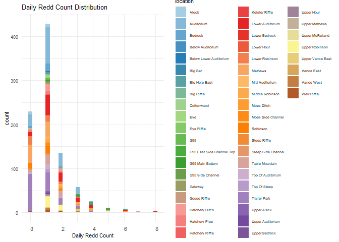
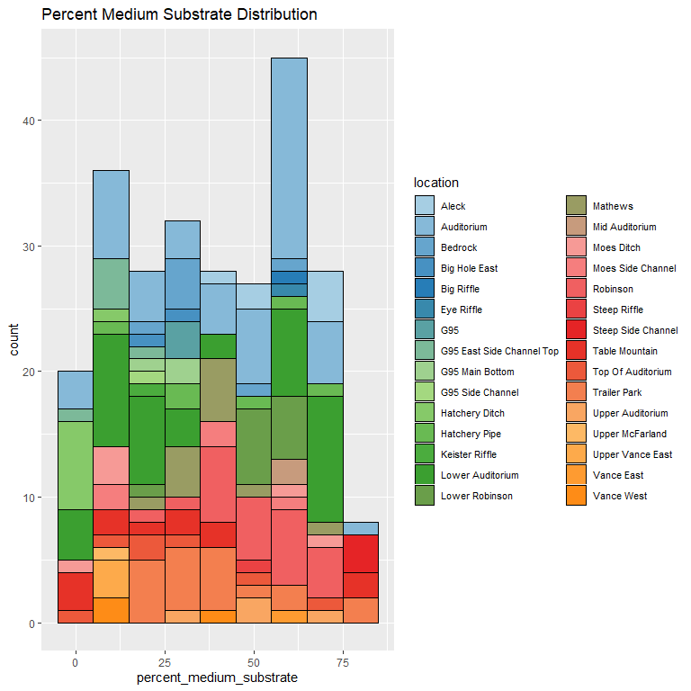
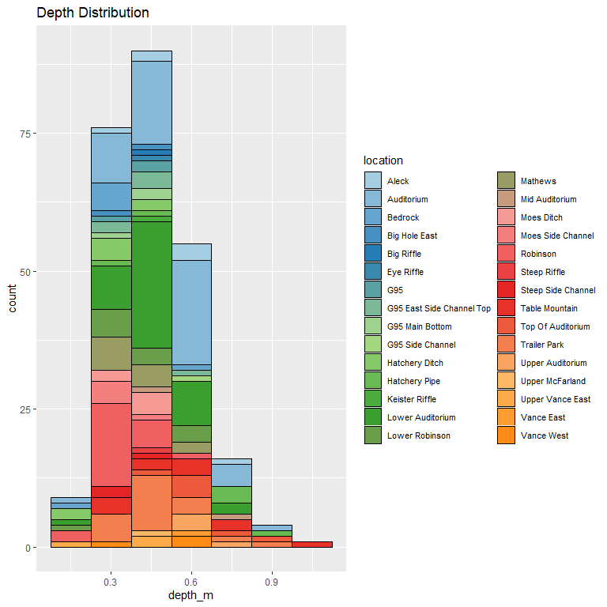
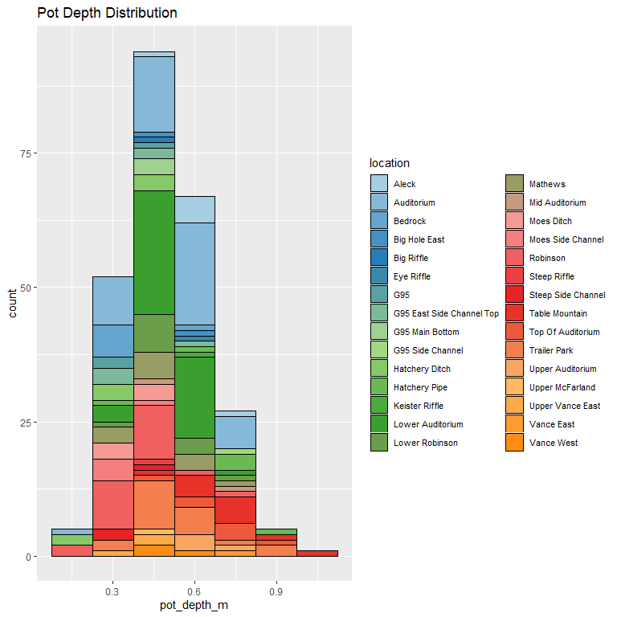
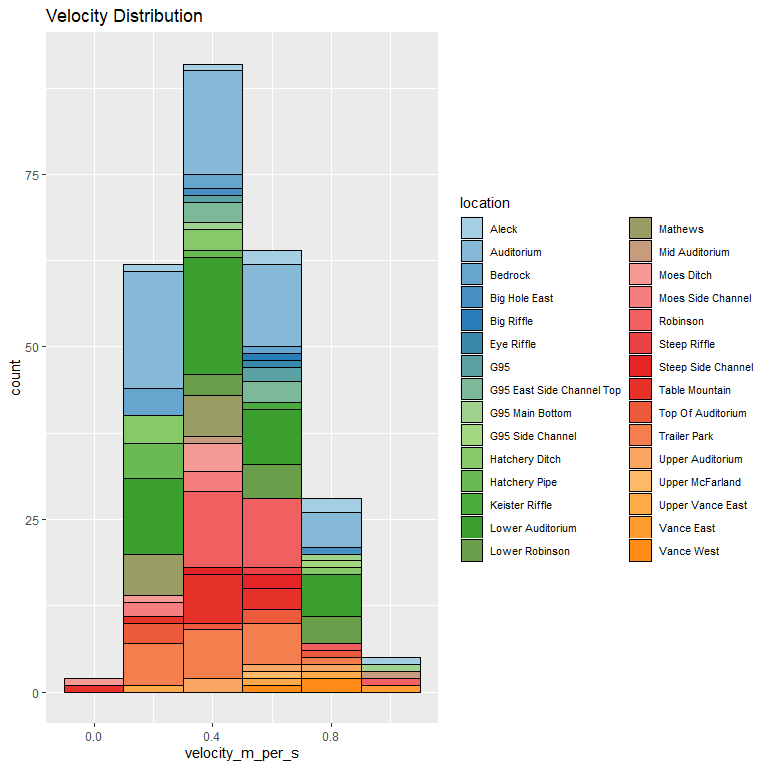

feather-river-adult-holding-redd-survey-qc-checklist-2010
================
Inigo Peng
10/6/2021

``` r
knitr::opts_chunk$set(echo = TRUE, warning = FALSE)
library(tidyverse)
```

    ## -- Attaching packages --------------------------------------- tidyverse 1.3.1 --

    ## v ggplot2 3.3.5     v purrr   0.3.4
    ## v tibble  3.1.4     v dplyr   1.0.7
    ## v tidyr   1.1.3     v stringr 1.4.0
    ## v readr   2.0.1     v forcats 0.5.1

    ## -- Conflicts ------------------------------------------ tidyverse_conflicts() --
    ## x dplyr::filter() masks stats::filter()
    ## x dplyr::lag()    masks stats::lag()

``` r
library(lubridate)
```

    ## 
    ## Attaching package: 'lubridate'

    ## The following objects are masked from 'package:base':
    ## 
    ##     date, intersect, setdiff, union

``` r
library(googleCloudStorageR)
```

    ## v Setting scopes to https://www.googleapis.com/auth/devstorage.full_control and https://www.googleapis.com/auth/cloud-platform

    ## v Successfully auto-authenticated via ../../config.json

    ## v Set default bucket name to 'jpe-dev-bucket'

``` r
library(ggplot2)
library(scales)
```

    ## 
    ## Attaching package: 'scales'

    ## The following object is masked from 'package:purrr':
    ## 
    ##     discard

    ## The following object is masked from 'package:readr':
    ## 
    ##     col_factor

``` r
library(leaflet)
library (RColorBrewer)
```

# Feather River Redd Survey Data

## Description of Monitoring Data

**Timeframe:** 2010

**Completeness of Record throughout timeframe:**

-   Longitude and latitude data are not available for 2009, 2010, 2011,
    2012, 2019, 2020. NA values will be filled in for these data sets in
    final cleaned data set.

**Sampling Location:** Various sampling locations on Feather River.

**Data Contact:** [Chris Cook](mailto::Chris.Cook@water.ca.gov)

Additional Info:  
1. Latitude and longitude are in NAD 1983 UTM Zone 10N  
2. The substrate is observed visually and an estimate of the percentage
of 5 size classes:

-   fines &lt;1cm  
-   small 1-5cm  
-   medium 6-15cm  
-   large 16-30cm  
-   boulder &gt;30cm

## Access Cloud Data

``` r
# Run Sys.setenv() to specify GCS_AUTH_FILE and GCS_DEFAULT_BUCKET before running
# Open object from google cloud storage
# Set your authentication using gcs_auth
gcs_auth(json_file = Sys.getenv("GCS_AUTH_FILE"))
# Set global bucket 
gcs_global_bucket(bucket = Sys.getenv("GCS_DEFAULT_BUCKET"))
gcs_list_objects()
# git data and save as xlsx
gcs_get_object(object_name = "adult-holding-redd-and-carcass-surveys/feather-river/data-raw/redd_survey/2010_Chinook_Redd_Survey_Data.xlsx",
               bucket = gcs_get_global_bucket(),
               saveToDisk = "2010_Chinook_Redd_Survey_Data_raw.xlsx",
               Overwrite = TRUE)
```

Read in data from google cloud, glimpse raw data:

``` r
raw_data_2010 = readxl::read_excel("2010_Chinook_Redd_Survey_Data_raw.xlsx")
glimpse(raw_data_2010)
```

    ## Rows: 901
    ## Columns: 19
    ## $ Date                 <dttm> 2010-09-17, 2010-09-17, 2010-09-17, 2010-09-17, ~
    ## $ `Survey Wk`          <dbl> 1, 1, 1, 1, 1, 1, 1, 1, 1, 1, 1, 1, 1, 1, 1, 1, 1~
    ## $ Location             <chr> "Table Mountain", "Table Mountain", "Table Mounta~
    ## $ `File #`             <dbl> 1, 2, 3, 4, 5, 6, 7, 8, 9, 10, 11, 12, 13, 14, 15~
    ## $ type                 <chr> "A", "Q", "Q", "Q", "A", "A", "Q", "A", "A", "A",~
    ## $ `# of redds`         <dbl> 1, 0, 0, 0, 1, 1, 0, 1, 1, 1, 1, 1, 1, 1, 1, 1, 1~
    ## $ `# salmon`           <dbl> 0, 0, 0, 0, 0, 0, 1, 1, 0, 0, 0, 0, 0, 0, 0, 0, 0~
    ## $ Latitude             <lgl> NA, NA, NA, NA, NA, NA, NA, NA, NA, NA, NA, NA, N~
    ## $ Longitude            <lgl> NA, NA, NA, NA, NA, NA, NA, NA, NA, NA, NA, NA, N~
    ## $ `Depth (m)`          <dbl> NA, NA, NA, NA, 0.70, 0.66, NA, 0.56, 0.64, 0.66,~
    ## $ `Pot Depth (m)`      <dbl> 0.90, NA, NA, NA, 0.76, 0.70, NA, 0.52, 0.66, 0.6~
    ## $ `Velocity (m/s)`     <dbl> 0.38, NA, NA, NA, 0.55, 0.80, NA, 0.33, 0.35, 0.5~
    ## $ `% fines(<1 cm)`     <dbl> 10, NA, NA, NA, 20, 10, NA, 10, 10, 10, 30, 20, 1~
    ## $ `% small (1-5 cm)`   <dbl> 60, NA, NA, NA, 70, 10, NA, 90, 20, 20, 40, 30, 3~
    ## $ `% med (5-15 cm)`    <dbl> 30, NA, NA, NA, 10, 70, NA, 0, 70, 50, 30, 50, 60~
    ## $ `% large (15-30 cm)` <dbl> 0, NA, NA, NA, 0, 10, NA, 0, 0, 20, 0, 0, 0, 0, 0~
    ## $ `% boulder (>30 cm)` <dbl> 0, NA, NA, NA, 0, 0, NA, 0, 0, 0, 0, 0, 0, 0, 0, ~
    ## $ `redd width (ft)`    <dbl> NA, 3, 4, 10, NA, NA, 4, NA, NA, NA, NA, NA, NA, ~
    ## $ `redd length (ft)`   <dbl> NA, 2, 3, 15, NA, NA, 4, NA, NA, NA, NA, NA, NA, ~

## Data Transformations

``` r
#Convert feet to m
raw_data_2010$'redd_width_m' <- round(raw_data_2010$'redd width (ft)'*0.3048, 2)
raw_data_2010$'redd_length_m' <- round(raw_data_2010$'redd length (ft)'*0.3048, 2)

cleaner_data_2010 <- raw_data_2010 %>% 
  select(-c('Survey Wk', 'File #','redd width (ft)', 'redd length (ft)')) %>% 
  rename('salmon_count'= '# salmon',
         'redd_count' = '# of redds',
         'latitude' = 'Latitude',
         'longitude' = 'Longitude',
         'depth_m' = 'Depth (m)',
         'velocity_m_per_s' = 'Velocity (m/s)',
         'pot_depth_m' = 'Pot Depth (m)',
         'percent_fine_substrate' = '% fines(<1 cm)',
         'percent_small_substrate' = '% small (1-5 cm)',
         'percent_medium_substrate'= '% med (5-15 cm)',
         'percent_large_substrate' = '% large (15-30 cm)',
         'percent_boulder' = '% boulder (>30 cm)'
         ) %>% 
  mutate(latitude = as.numeric(latitude),
         longitude = as.numeric(longitude),
         Date = as.Date(Date))

#Change to snakecase
cleaner_data_2010 <- cleaner_data_2010 %>%
  set_names(tolower(colnames(cleaner_data_2010))) %>%
  glimpse()
```

    ## Rows: 901
    ## Columns: 17
    ## $ date                     <date> 2010-09-17, 2010-09-17, 2010-09-17, 2010-09-~
    ## $ location                 <chr> "Table Mountain", "Table Mountain", "Table Mo~
    ## $ type                     <chr> "A", "Q", "Q", "Q", "A", "A", "Q", "A", "A", ~
    ## $ redd_count               <dbl> 1, 0, 0, 0, 1, 1, 0, 1, 1, 1, 1, 1, 1, 1, 1, ~
    ## $ salmon_count             <dbl> 0, 0, 0, 0, 0, 0, 1, 1, 0, 0, 0, 0, 0, 0, 0, ~
    ## $ latitude                 <dbl> NA, NA, NA, NA, NA, NA, NA, NA, NA, NA, NA, N~
    ## $ longitude                <dbl> NA, NA, NA, NA, NA, NA, NA, NA, NA, NA, NA, N~
    ## $ depth_m                  <dbl> NA, NA, NA, NA, 0.70, 0.66, NA, 0.56, 0.64, 0~
    ## $ pot_depth_m              <dbl> 0.90, NA, NA, NA, 0.76, 0.70, NA, 0.52, 0.66,~
    ## $ velocity_m_per_s         <dbl> 0.38, NA, NA, NA, 0.55, 0.80, NA, 0.33, 0.35,~
    ## $ percent_fine_substrate   <dbl> 10, NA, NA, NA, 20, 10, NA, 10, 10, 10, 30, 2~
    ## $ percent_small_substrate  <dbl> 60, NA, NA, NA, 70, 10, NA, 90, 20, 20, 40, 3~
    ## $ percent_medium_substrate <dbl> 30, NA, NA, NA, 10, 70, NA, 0, 70, 50, 30, 50~
    ## $ percent_large_substrate  <dbl> 0, NA, NA, NA, 0, 10, NA, 0, 0, 20, 0, 0, 0, ~
    ## $ percent_boulder          <dbl> 0, NA, NA, NA, 0, 0, NA, 0, 0, 0, 0, 0, 0, 0,~
    ## $ redd_width_m             <dbl> NA, 0.91, 1.22, 3.05, NA, NA, 1.22, NA, NA, N~
    ## $ redd_length_m            <dbl> NA, 0.61, 0.91, 4.57, NA, NA, 1.22, NA, NA, N~

## Explore `date`

``` r
cleaner_data_2010 %>%
  ggplot(aes(x = date)) +
  geom_histogram(binwidth = 7, position = 'stack', color = "black") +
  labs(title = "Value Counts For Survey Season Dates")+
  theme(legend.text = element_text(size = 8))
```

<!-- -->

``` r
summary(cleaner_data_2010$date)
```

    ##         Min.      1st Qu.       Median         Mean      3rd Qu.         Max. 
    ## "2010-09-17" "2010-10-03" "2010-10-07" "2010-10-09" "2010-10-16" "2010-10-30"

**NA and Unknown Values**

-   0 % of values in the `date` column are NA.

## Explore Categorical Variables

``` r
cleaner_data_2010 %>% 
  select_if(is.character) %>% colnames()
```

    ## [1] "location" "type"

### Variable:`location`

``` r
table(cleaner_data_2010$location)
```

    ## 
    ##                  Aleck             Auditorium                Bedrock 
    ##                     14                    162                     22 
    ##       Below Auditorium Below Lower Auditorium                Big Bar 
    ##                      2                      1                      2 
    ##          Big Hole East             Big Riffle             Cottonwood 
    ##                      7                      2                      4 
    ##                    Eye             Eye Riffle                    G95 
    ##                      7                      1                      5 
    ##             G95 Bottom           G95 East Top       G95 Side Channel 
    ##                      7                      8                      1 
    ##                Gateway           Goose Riffle         Hatchery Ditch 
    ##                      5                      2                     22 
    ##          Hatchery Pipe        Hatchery Riffle         Keister Riffle 
    ##                     19                      1                      2 
    ##       Lower Auditorium          Lower Bedrock             Lower Hour 
    ##                     95                      2                      2 
    ##         Lower Robinson                Mathews      Middle Auditorium 
    ##                     36                     80                      3 
    ##        Middle Robinson     Moe's Side Channel             Moes Ditch 
    ##                     14                      5                     18 
    ##               Robinson           Steep Riffle     Steep Side Channel 
    ##                     35                      4                      4 
    ##         Table Mountain      Top of Auditorium           Top of Steep 
    ##                     46                     21                      8 
    ##           Trailer Park            Upper Aleck       Upper Auditorium 
    ##                    147                      3                      4 
    ##          Upper Bedrock             Upper Hour          Upper Mathews 
    ##                      1                      7                      1 
    ##         Upper McFarlin         Upper Robinson             Vance East 
    ##                      2                     38                      2 
    ##         Vance East Top             Vance West            Weir Riffle 
    ##                     10                      6                     11

Locations names are changed to be consistent with the rest of the
Feather River redd survey files:

``` r
cleaner_data_2010 <- cleaner_data_2010 %>% 
  mutate(location = str_to_title(location),
         location = if_else(location == "G95 East Top", "G95 East Side Channel Top", location),
         location = if_else(location == "Middle Auditorium", "Mid Auditorium", location),
         location = if_else(location == "Moe's Side Channel", "Moes Side Channel", location),
         location = if_else(location == "Upper Mcfarlin", "Upper McFarland", location),
         location = if_else(location == "Vance East Top", "Upper Vance East", location),
         location = if_else(location == "G95 Bottom", "G95 Main Bottom", location)
         )
table(cleaner_data_2010$location)
```

    ## 
    ##                     Aleck                Auditorium                   Bedrock 
    ##                        14                       162                        22 
    ##          Below Auditorium    Below Lower Auditorium                   Big Bar 
    ##                         2                         1                         2 
    ##             Big Hole East                Big Riffle                Cottonwood 
    ##                         7                         2                         4 
    ##                       Eye                Eye Riffle                       G95 
    ##                         7                         1                         5 
    ## G95 East Side Channel Top           G95 Main Bottom          G95 Side Channel 
    ##                         8                         7                         1 
    ##                   Gateway              Goose Riffle            Hatchery Ditch 
    ##                         5                         2                        22 
    ##             Hatchery Pipe           Hatchery Riffle            Keister Riffle 
    ##                        19                         1                         2 
    ##          Lower Auditorium             Lower Bedrock                Lower Hour 
    ##                        95                         2                         2 
    ##            Lower Robinson                   Mathews            Mid Auditorium 
    ##                        36                        80                         3 
    ##           Middle Robinson                Moes Ditch         Moes Side Channel 
    ##                        14                        18                         5 
    ##                  Robinson              Steep Riffle        Steep Side Channel 
    ##                        35                         4                         4 
    ##            Table Mountain         Top Of Auditorium              Top Of Steep 
    ##                        46                        21                         8 
    ##              Trailer Park               Upper Aleck          Upper Auditorium 
    ##                       147                         3                         4 
    ##             Upper Bedrock                Upper Hour             Upper Mathews 
    ##                         1                         7                         1 
    ##           Upper McFarland            Upper Robinson          Upper Vance East 
    ##                         2                        38                        10 
    ##                Vance East                Vance West               Weir Riffle 
    ##                         2                         6                        11

**NA and Unknown Values**

-   0 % of values in the `location` column are NA.

## Variable:`type`

Description:

-   Area - polygon mapped with Trimble GPS unit

-   Point - points mapped with Trimble GPS unit

-   Questionable redds - polygon mapped with Trimble GPS unit where the
    substrate was disturbed but did not have the proper characteristics
    to be called a redd - it was no longer recorded after 2011

``` r
table(cleaner_data_2010$type)
```

    ## 
    ##   A   p   P   Q 
    ## 493   1 176 231

``` r
cleaner_data_2010 <- cleaner_data_2010 %>% 
  mutate(type = tolower(type),
         type = if_else(type == 'a', 'Area', type),
         type = if_else(type == 'p', 'Point', type),
         type = if_else(type == 'q', 'Questionable Redds', type))
table(cleaner_data_2010$type)
```

    ## 
    ##               Area              Point Questionable Redds 
    ##                493                177                231

## Expore Numeric Variables

``` r
cleaner_data_2010 %>% 
  select_if(is.numeric) %>% colnames()
```

    ##  [1] "redd_count"               "salmon_count"            
    ##  [3] "latitude"                 "longitude"               
    ##  [5] "depth_m"                  "pot_depth_m"             
    ##  [7] "velocity_m_per_s"         "percent_fine_substrate"  
    ##  [9] "percent_small_substrate"  "percent_medium_substrate"
    ## [11] "percent_large_substrate"  "percent_boulder"         
    ## [13] "redd_width_m"             "redd_length_m"

### Variable:`salmon_count`

``` r
cleaner_data_2010 %>% 
  ggplot(aes(x = date, y = salmon_count)) + 
  geom_col() +
  facet_wrap(~year(date), scales = "free") +
  scale_x_date(labels = date_format("%b"), date_breaks = "1 month")+
  theme_minimal() +
  theme(axis.text.x = element_text(size = 10,angle = 90, vjust = 0.5, hjust=0.1)) +
  theme(axis.text.y = element_text(size = 8))+
  labs(title = "Daily Count of Salmon in 2010")
```

<!-- -->

**Numeric Daily Summary of salmon\_count Over 2010**

``` r
cleaner_data_2010 %>%
  group_by(date) %>%
  summarise(count = sum(salmon_count, na.rm = T)) %>%
  pull(count) %>%
  summary()
```

    ##    Min. 1st Qu.  Median    Mean 3rd Qu.    Max. 
    ##    2.00   32.00   52.00   77.92  100.00  217.00

``` r
colourCount = length(unique(cleaner_data_2010$location))
getPalette = colorRampPalette(brewer.pal(12, "Paired"))

cleaner_data_2010  %>%
  ggplot(aes(x = salmon_count, fill = location))+
  scale_fill_manual(values = getPalette(colourCount))+
  geom_histogram() +
  theme_minimal() +
  theme(text = element_text(size = 8))+
  theme(axis.text.x = element_text(size = 8,vjust = 0.5, hjust=0.1))+
  labs(title = "Daily Salmon Count Distribution",
       x = 'Daily Salmon Count')+
  theme(legend.text = element_text(size=5))+
  guides(fill = guide_legend(nrow = 20))
```

    ## `stat_bin()` using `bins = 30`. Pick better value with `binwidth`.

<!-- -->

**Numeric Daily Summary of total salmon\_count in 2010**

``` r
cleaner_data_2010 %>%
  group_by(date) %>% 
  summarise(count = sum(salmon_count, na.rm = T)) %>% 
  pull(count) %>%
  summary()
```

    ##    Min. 1st Qu.  Median    Mean 3rd Qu.    Max. 
    ##    2.00   32.00   52.00   77.92  100.00  217.00

**NA and Unknown Values**

-   0.111 % of values in the `salmon_count` column are NA.

### Variable:`redd_count`

``` r
cleaner_data_2010 %>% 
  ggplot(aes(x = date, y = redd_count)) + 
  geom_col() +
  facet_wrap(~year(date), scales = "free") +
  scale_x_date(labels = date_format("%b"), date_breaks = "1 month")+
  theme_minimal() +
  theme(axis.text.x = element_text(size = 10,angle = 90, vjust = 0.5, hjust=0.1)) +
  theme(axis.text.y = element_text(size = 8))+
  labs(title = "Daily Count of Redds in 2010")
```

<!-- -->

``` r
cleaner_data_2010  %>%
  ggplot(aes(x = redd_count, fill = location))+
  scale_fill_manual(values = getPalette(colourCount))+
  geom_histogram() +
  theme_minimal() +
  theme(text = element_text(size = 8))+
  theme(axis.text.x = element_text(size = 8,vjust = 0.5, hjust=0.1))+
  labs(title = "Daily Redd Count Distribution",
       x = 'Daily Redd Count')+
  theme(legend.text = element_text(size=5))+
  guides(fill = guide_legend(nrow = 20))
```

    ## `stat_bin()` using `bins = 30`. Pick better value with `binwidth`.

<!-- -->

**Numeric Daily Summary of redd\_count Over 2010**

``` r
cleaner_data_2010 %>%
  group_by(date) %>%
  summarise(count = sum(redd_count, na.rm = T)) %>%
  pull(count) %>%
  summary()
```

    ##    Min. 1st Qu.  Median    Mean 3rd Qu.    Max. 
    ##       4      51      70      86     122     185

**NA and Unknown Values**

-   0 % of values in the `redd_count` column are NA.

### Variable:`redd_width_m`

``` r
cleaner_data_2010 %>%
  ggplot(aes(x = redd_width_m)) +
  geom_histogram(binwidth = 0.5, color = "black", fill = "white") +
  scale_x_continuous(breaks = round(seq(min(cleaner_data_2010$redd_width_m, na.rm = TRUE), max(cleaner_data_2010$redd_width_m, na.rm = TRUE), by = 1),0))+
  labs(title = "Redd Width Distribution")
```

<!-- -->

**Numeric Summary of redd\_width\_m Over 2010**

``` r
summary(cleaner_data_2010$redd_width_m)
```

    ##    Min. 1st Qu.  Median    Mean 3rd Qu.    Max.    NA's 
    ##    0.61    1.22    1.52    1.96    2.44   12.19     343

**NA and Unknown Values**

-   38.1 % of values in the `redd_width_m` column are NA.

### Variable: `redd_length_m`

``` r
cleaner_data_2010 %>%
  ggplot(aes(x = redd_length_m)) +
  geom_histogram(binwidth = 0.5, color = "black", fill = "white") +
  scale_x_continuous(breaks = round(seq(min(cleaner_data_2010$redd_length_m, na.rm = TRUE), max(cleaner_data_2010$redd_length_m, na.rm = TRUE), by = 1),0))+
  labs(title = "Redd Length Distribution")
```

<!-- -->

**Numeric Summary of redd\_length\_m Over 2010**

``` r
summary(cleaner_data_2010$redd_length_m)
```

    ##    Min. 1st Qu.  Median    Mean 3rd Qu.    Max.    NA's 
    ##   0.000   1.520   2.440   2.759   3.050  12.190     343

**NA and Unknown Values**

-   38.1 % of values in the `redd_length_m` column are NA.

### Physical Attributes

### Variable:`percent_fine_substrate`

``` r
cleaner_data_2010 %>%
  ggplot(aes(x = percent_fine_substrate, fill = location)) +
  scale_fill_manual(values = getPalette(colourCount))+
  geom_histogram(binwidth = 5, position = 'stack', color = "black") +
  labs(title = "Percent Fine Substrate Distribution")+
  theme(legend.text = element_text(size = 8)) +
  guides(fill = guide_legend(nrow = 15))
```

<!-- -->

**Numeric Summary of percent\_fine\_substrate Over 2010**

``` r
summary(cleaner_data_2010$percent_fine_substrate)
```

    ##    Min. 1st Qu.  Median    Mean 3rd Qu.    Max.    NA's 
    ##   0.000   0.000  10.000   9.452  10.000  90.000     649

**NA and Unknown Values**

-   72 % of values in the `percent_fine_substrate` column are NA.

### Variable:`percent_small_substrate`

``` r
cleaner_data_2010 %>%
  ggplot(aes(x = percent_small_substrate, fill = location)) +
  scale_fill_manual(values = getPalette(colourCount))+
  geom_histogram(binwidth = 10, position = 'stack', color = "black") +
  labs(title = "Percent Small Substrate Distribution")+
  theme(legend.text = element_text(size = 8)) +
  guides(fill = guide_legend(nrow = 15))
```

<!-- -->

**Numeric Summary of percent\_small\_substrate Over 2010**

``` r
summary(cleaner_data_2010$percent_small_substrate)
```

    ##    Min. 1st Qu.  Median    Mean 3rd Qu.    Max.    NA's 
    ##    0.00   20.00   30.00   37.51   60.00   90.00     649

**NA and Unknown Values**

-   72 % of values in the `percent_small_substrate` column are NA.

### Variable:`percent_medium_substrate`

``` r
cleaner_data_2010 %>%
  ggplot(aes(x = percent_medium_substrate, fill = location)) +
  scale_fill_manual(values = getPalette(colourCount))+
  geom_histogram(binwidth = 10, position = 'stack', color = "black") +
  labs(title = "Percent Medium Substrate Distribution")+
  theme(legend.text = element_text(size = 8)) +
  guides(fill = guide_legend(nrow = 15))
```

<!-- -->

**Numeric Summary of percent\_medium\_substrate Over 2010**

``` r
summary(cleaner_data_2010$percent_medium_substrate)
```

    ##    Min. 1st Qu.  Median    Mean 3rd Qu.    Max.    NA's 
    ##    0.00   20.00   40.00   38.48   60.00   80.00     649

**NA and Unknown Values**

-   72 % of values in the `percent_medium_substrate` column are NA.

### Variable:`percent_large_substrate`

``` r
cleaner_data_2010 %>%
  ggplot(aes(x = percent_large_substrate, fill = location)) +
  scale_fill_manual(values = getPalette(colourCount))+
  geom_histogram(binwidth = 10, position = 'stack', color = "black") +
  labs(title = "Percent Large Substrate Distribution")+
  theme(legend.text = element_text(size = 8)) +
  guides(fill = guide_legend(nrow = 15))
```

<!-- -->

**Numeric Summary of percent\_large\_substrate Over 2010**

``` r
summary(cleaner_data_2010$percent_large_substrate)
```

    ##    Min. 1st Qu.  Median    Mean 3rd Qu.    Max.    NA's 
    ##    0.00    0.00    0.00   14.22   25.00   80.00     649

**NA and Unknown Values**

-   72 % of values in the `percent_large_substrate` column are NA.

### Variable:`percent_boulder`

``` r
cleaner_data_2010 %>%
  ggplot(aes(x = percent_boulder, fill = location)) +
  scale_fill_manual(values = getPalette(colourCount))+
  geom_histogram(binwidth = 2, position = 'stack', color = "black") +
  labs(title = "Percent Boulder Distribution")+
  theme(legend.text = element_text(size = 8)) +
  guides(fill = guide_legend(nrow = 15))
```

<!-- -->

**Numeric Summary of percent\_boulder Over 2010**

``` r
summary(cleaner_data_2010$percent_boulder)
```

    ##    Min. 1st Qu.  Median    Mean 3rd Qu.    Max.    NA's 
    ##  0.0000  0.0000  0.0000  0.3373  0.0000 15.0000     649

**NA and Unknown Values** NA and Unknown Values\*\*

-   72 % of values in the `percent_large_substrate` column are NA.

### Summary of Mean Percent Substrate In Each Location

``` r
cleaner_data_2010 %>% 
  group_by(location) %>% 
  summarise(mean_percent_fine_substrate = mean(percent_fine_substrate, na.rm = TRUE),
            mean_percent_small_substrate = mean(percent_small_substrate, na.rm = TRUE),
            mean_percent_medium_substrate = mean(percent_medium_substrate, na.rm = TRUE),
            mean_percent_large_substrate = mean(percent_large_substrate, na.rm = TRUE),
            mean_percent_boulder = mean(percent_boulder, na.rm = TRUE),
            ) %>% 
  pivot_longer(
    cols = starts_with("mean"),
    names_to = "substrate_type",
    values_to = "percent",
    values_drop_na = TRUE
  ) %>%
  ggplot(aes(fill = substrate_type,
             y = location,
             x = percent))+
  geom_bar(position = 'stack', stat = 'identity', color = 'black')+
  labs(title = "Mean Percent Substrate by Location")
```

<!-- -->

### Variable: `depth_m`

``` r
cleaner_data_2010 %>%
  ggplot(aes(x = depth_m, fill = location, )) +
  scale_fill_manual(values = getPalette(colourCount))+
  geom_histogram(binwidth = 0.15, position = 'stack', color = "black") +
  labs(title = "Depth Distribution")+
  theme(legend.text = element_text(size = 8)) +
  guides(fill = guide_legend(nrow = 15))
```

<!-- -->
**Numeric Summary of depth\_m Over 2010**

``` r
summary(cleaner_data_2010$depth_m)
```

    ##    Min. 1st Qu.  Median    Mean 3rd Qu.    Max.    NA's 
    ##  0.1300  0.3400  0.4400  0.4593  0.5700  0.9800     650

**NA and Unknown Values**

-   72.1 % of values in the `depth_m` column are NA.

### Variable: `pot_depth_m`

``` r
cleaner_data_2010 %>%
  ggplot(aes(x = pot_depth_m, fill = location, )) +
  scale_fill_manual(values = getPalette(colourCount))+
  geom_histogram(binwidth = 0.15, position = 'stack', color = "black") +
  labs(title = "Pot Depth Distribution")+
  theme(legend.text = element_text(size = 8)) +
  guides(fill = guide_legend(nrow = 15))
```

<!-- -->
**Numeric Summary of pot\_depth\_m Over 2010**

``` r
summary(cleaner_data_2010$pot_depth_m)
```

    ##    Min. 1st Qu.  Median    Mean 3rd Qu.    Max.    NA's 
    ##  0.1500  0.3850  0.4800  0.4994  0.6000  1.0000     650

**NA and Unknown Values**

-   72.1 % of values in the `pot_depth_m` column are NA.

### Variable: `velocity_m_per_s`

``` r
cleaner_data_2010 %>%
  ggplot(aes(x = velocity_m_per_s, fill = location, )) +
  scale_fill_manual(values = getPalette(colourCount))+
  geom_histogram(binwidth = 0.2, position = 'stack', color = "black") +
  labs(title = "Velocity Distribution")+
  theme(legend.text = element_text(size = 8)) +
  guides(fill = guide_legend(nrow = 15))
```

<!-- -->
**Numeric Summary of velocity\_m\_per\_s Over 2010**

``` r
summary(cleaner_data_2010$`velocity_m_per_s`)
```

    ##    Min. 1st Qu.  Median    Mean 3rd Qu.    Max.    NA's 
    ##  0.0000  0.3000  0.4450  0.4606  0.6200  1.0500     649

**NA and Unknown Values**

-   72 % of values in the `velocity_m_per_s` column are NA.

### Add cleaned data back onto google cloud

``` r
feather_redd_survey_2010 <- cleaner_data_2010 %>% glimpse()
```

    ## Rows: 901
    ## Columns: 17
    ## $ date                     <date> 2010-09-17, 2010-09-17, 2010-09-17, 2010-09-~
    ## $ location                 <chr> "Table Mountain", "Table Mountain", "Table Mo~
    ## $ type                     <chr> "Area", "Questionable Redds", "Questionable R~
    ## $ redd_count               <dbl> 1, 0, 0, 0, 1, 1, 0, 1, 1, 1, 1, 1, 1, 1, 1, ~
    ## $ salmon_count             <dbl> 0, 0, 0, 0, 0, 0, 1, 1, 0, 0, 0, 0, 0, 0, 0, ~
    ## $ latitude                 <dbl> NA, NA, NA, NA, NA, NA, NA, NA, NA, NA, NA, N~
    ## $ longitude                <dbl> NA, NA, NA, NA, NA, NA, NA, NA, NA, NA, NA, N~
    ## $ depth_m                  <dbl> NA, NA, NA, NA, 0.70, 0.66, NA, 0.56, 0.64, 0~
    ## $ pot_depth_m              <dbl> 0.90, NA, NA, NA, 0.76, 0.70, NA, 0.52, 0.66,~
    ## $ velocity_m_per_s         <dbl> 0.38, NA, NA, NA, 0.55, 0.80, NA, 0.33, 0.35,~
    ## $ percent_fine_substrate   <dbl> 10, NA, NA, NA, 20, 10, NA, 10, 10, 10, 30, 2~
    ## $ percent_small_substrate  <dbl> 60, NA, NA, NA, 70, 10, NA, 90, 20, 20, 40, 3~
    ## $ percent_medium_substrate <dbl> 30, NA, NA, NA, 10, 70, NA, 0, 70, 50, 30, 50~
    ## $ percent_large_substrate  <dbl> 0, NA, NA, NA, 0, 10, NA, 0, 0, 20, 0, 0, 0, ~
    ## $ percent_boulder          <dbl> 0, NA, NA, NA, 0, 0, NA, 0, 0, 0, 0, 0, 0, 0,~
    ## $ redd_width_m             <dbl> NA, 0.91, 1.22, 3.05, NA, NA, 1.22, NA, NA, N~
    ## $ redd_length_m            <dbl> NA, 0.61, 0.91, 4.57, NA, NA, 1.22, NA, NA, N~

``` r
f <- function(input, output) write_csv(input, file = output)

gcs_upload(feather_redd_survey_2010,
           object_function = f,
           type = "csv",
           name = "adult-holding-redd-and-carcass-surveys/feather-river/data/feather_redd_2010.csv")
```

    ## i 2021-10-27 10:29:40 > File size detected as  67.1 Kb

    ## i 2021-10-27 10:29:40 > Request Status Code:  400

    ## ! API returned: Cannot insert legacy ACL for an object when uniform bucket-level access is enabled. Read more at https://cloud.google.com/storage/docs/uniform-bucket-level-access - Retrying with predefinedAcl='bucketLevel'

    ## i 2021-10-27 10:29:40 > File size detected as  67.1 Kb

    ## ==Google Cloud Storage Object==
    ## Name:                adult-holding-redd-and-carcass-surveys/feather-river/data/feather_redd_2010.csv 
    ## Type:                csv 
    ## Size:                67.1 Kb 
    ## Media URL:           https://www.googleapis.com/download/storage/v1/b/jpe-dev-bucket/o/adult-holding-redd-and-carcass-surveys%2Ffeather-river%2Fdata%2Ffeather_redd_2010.csv?generation=1635355779912322&alt=media 
    ## Download URL:        https://storage.cloud.google.com/jpe-dev-bucket/adult-holding-redd-and-carcass-surveys%2Ffeather-river%2Fdata%2Ffeather_redd_2010.csv 
    ## Public Download URL: https://storage.googleapis.com/jpe-dev-bucket/adult-holding-redd-and-carcass-surveys%2Ffeather-river%2Fdata%2Ffeather_redd_2010.csv 
    ## Bucket:              jpe-dev-bucket 
    ## ID:                  jpe-dev-bucket/adult-holding-redd-and-carcass-surveys/feather-river/data/feather_redd_2010.csv/1635355779912322 
    ## MD5 Hash:            TESIWIivcZNseLDpElAqYw== 
    ## Class:               STANDARD 
    ## Created:             2021-10-27 17:29:39 
    ## Updated:             2021-10-27 17:29:39 
    ## Generation:          1635355779912322 
    ## Meta Generation:     1 
    ## eTag:                CIKl34KP6/MCEAE= 
    ## crc32c:              fwDScA==
