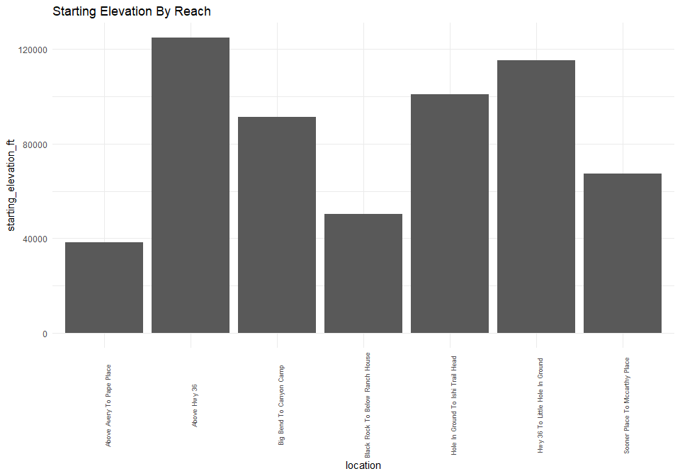

mill-creek-redd-survey-qc-checklist
================
Inigo Peng
10/19/2021

# Mill Creek Redd Survey Data

**Description of Monitoring Data**

-   Redd surveys Buckhorn Gulch to Upper Dam are conducted by air
    (helicopter). All other survey sections completed on foot

**Timeframe:**

1997 to 2020

**Completeness of Record throughout timeframe:**

-   Missing some elevation data
-   Buckhorn Gulch To Upper Dam missing significant count data
-   Canyon Camp to Sooner Place missing redd count data from 1997 - 2006
-   McCarthy Place to Savercool Place and Savercool Place to Black Rock
    reaches combined 1997 to 2006

**Sampling Location:**

-   Above Hwy 36
-   Hwy 36 to Little Hole-in-Ground
-   Litte Hole-in-Ground to Hole-in-Ground
-   Hole-in-Ground to Ishi Trail Head  
-   Ishi Trail Head to Big Bend  
-   Big Bend to Canyon Camp  
-   Canyon Camp to Sooner Place
-   Sooner Place to McCarthy Place
-   McCarthy Place to Savercool Place
-   Savercool Place to Black Rock
-   Black Rock to below Ranch House
-   Below Ranch House to above Avery  
-   Above Avery to Pape Place
-   Pape Place to Buckhorn Gulch
-   Buckhorn Gulch to Upper Dam (aerial survey)

**Data Contact:** [Matt Johnson](mailto:Matt.Johnson@wildlife.ca.gov)

## Access Cloud Data

``` r
# Run Sys.setenv() to specify GCS_AUTH_FILE and GCS_DEFAULT_BUCKET before running
# Open object from google cloud storage
# Set your authentication using gcs_auth
gcs_auth(json_file = Sys.getenv("GCS_AUTH_FILE"))
# Set global bucket 
gcs_global_bucket(bucket = Sys.getenv("GCS_DEFAULT_BUCKET"))
gcs_list_objects()
# git data and save as xlsx
gcs_get_object(object_name = "adult-holding-redd-and-carcass-surveys/mill-creek/data-raw/Mill Creek SRCS Redd Counts by Section 1997-2020 Reformatted.xlsx",
               bucket = gcs_get_global_bucket(),
               saveToDisk = "mill_creek_redd_raw.xlsx")
               # Overwrite = TRUE)
```

``` r
raw_data = readxl::read_excel('mill_creek_redd_raw.xlsx',
                              sheet = '2007-2020 SR redds') %>% 
  glimpse()
```

    ## Rows: 17
    ## Columns: 50
    ## $ Section                <chr> "Above Hwy 36", "Hwy 36 to Little Hole-in-Groun…
    ## $ `Starting Elevevation` <chr> "5200'", "4800'", NA, "4200'", NA, "3800'", NA,…
    ## $ `1997 redd count`      <chr> "0", "1", "7", "1", "7", "53", "n/s", "19", "1"…
    ## $ `1997 % by reach`      <chr> "0", "0.99009900990099009", "6.9306930693069315…
    ## $ `1998 redd count`      <chr> "n/s", "1", "2", "1", "1", "11", "n/s", "21", "…
    ## $ `1998 % by reach`      <chr> "*", "0.47169811320754718", "0.9433962264150943…
    ## $ `1999 redd count`      <chr> "n/s", "0", "1", "3", "11", "6", "n/s", "22", "…
    ## $ `1999 % by reach`      <chr> "*", "0", "0.35714285714285715", "1.07142857142…
    ## $ `2000 redd count`      <chr> "n/s", "0", "0", "4", "6", "12", "n/s", "59", "…
    ## $ `2000 % by reach`      <chr> "*", "0", "0", "1.4705882352941175", "2.2058823…
    ## $ `2001 redd count`      <chr> "n/s", "3", "19", "13", "14", "92", "n/s", "129…
    ## $ `2001 % by reach`      <chr> "*", "0.54545454545454553", "3.4545454545454546…
    ## $ `2002 redd count`      <chr> "12", "13", "23", "38", "8", "103", "n/s", "172…
    ## $ `2002 % by reach`      <chr> "1.5056461731493098", "1.6311166875784191", "2.…
    ## $ `2003 redd count`      <chr> "0", "6", "14", "44", "24", "121", "n/s", "133"…
    ## $ `2003 % by reach`      <chr> "0", "0.84151472650771386", "1.9635343618513323…
    ## $ `2004 redd count`      <chr> "0", "1", "23", "5", "9", "49", "n/s", "97", "9…
    ## $ `2004 % by reach`      <chr> "0", "0.20040080160320639", "4.6092184368737472…
    ## $ `2005 redd count`      <chr> "7", "10", "49", "47", "19", "51", "n/s", "70",…
    ## $ `2005 % by reach`      <chr> "1.2173913043478262", "1.7391304347826086", "8.…
    ## $ `2006 redd count`      <chr> "19", "28", "18", "28", "21", "21", "n/s", "72"…
    ## $ `2006 % by reach`      <chr> "3.7924151696606789", "5.5888223552894214", "3.…
    ## $ `2007 redd count`      <chr> "3", "17", "14", "18", "11", "29", "70", "78", …
    ## $ `2007 % by reach`      <chr> "0.65217391304347827", "3.6956521739130435", "3…
    ## $ `2008 redd count`      <chr> "1", "0", "5", "4", "3", "18", "32", "46", "15"…
    ## $ `2008 % by reach`      <chr> "0.55248618784530379", "0", "2.7624309392265194…
    ## $ `2009 redd count`      <chr> "0", "0", "5", "5", "2", "12", "12", "13", "6",…
    ## $ `2009 % by reach`      <chr> "0", "0", "4.5454545454545459", "4.545454545454…
    ## $ `2010 redd count`      <dbl> 17, 6, 4, 17, 10, 27, 26, 24, 17, 4, 28, 33, 19…
    ## $ `2010 % by reach`      <dbl> 7.053942, 2.489627, 1.659751, 7.053942, 4.14937…
    ## $ `2011 redd count`      <chr> "3", "3", "10", "17", "11", "19", "17", "31", "…
    ## $ `2011 % by reach`      <chr> "1.639344262295082", "1.639344262295082", "5.46…
    ## $ `2012 redd count`      <chr> "0", "8", "10", "16", "16", "33", "47", "34", "…
    ## $ `2012 % by reach`      <chr> "0", "2.9520295202952029", "3.6900369003690034"…
    ## $ `2013 redd count`      <chr> "0", "3", "16", "27", "13", "59", "109", "78", …
    ## $ `2013 % by reach`      <chr> "0", "0.5", "2.666666666666667", "4.5", "2.1666…
    ## $ `2014 redd count`      <chr> "n/s", "0", "2", "3", "0", "16", "40", "41", "2…
    ## $ `2014 % by reach`      <chr> "*", "0", "0.90909090909090906", "1.36363636363…
    ## $ `2015 redd count`      <chr> "0", "0", "0", "3", "2", "16", "11", "11", "7",…
    ## $ `2015 % by reach`      <chr> "0", "0", "0", "5.1724137931034484", "3.4482758…
    ## $ `2016 redd count`      <chr> "n/s", "0", "1", "2", "0", "4", "5", "24", "2",…
    ## $ `2016 % by reach`      <chr> "*", "0", "2.1276595744680851", "4.255319148936…
    ## $ `2017 redd count`      <chr> "0", "3", "3", "12", "0", "28", "35", "18", "12…
    ## $ `2017 % by reach`      <chr> "0", "0", "6.3829787234042552", "25.53191489361…
    ## $ `2018 redd count`      <dbl> 0, 1, 15, 12, 1, 0, 13, 11, 8, 1, 9, 4, 0, 0, 1…
    ## $ `2018 % by reach`      <dbl> 0.000000, 2.127660, 31.914894, 25.531915, 2.127…
    ## $ `2019 redd count`      <chr> "n/s", "0", "6", "5", "2", "3", "15", "9", "1",…
    ## $ `2019 % by reach`      <chr> "*", "0", "12.76595744680851", "10.638297872340…
    ## $ `2020 redd count`      <chr> "n/s", "0", "0", "1", "0", "0", "10", "7", "0",…
    ## $ `2020 % by reach`      <chr> "*", "0", "0", "2.1276595744680851", "0", "0", …

## Data Transformations

``` r
cleaner_data <- raw_data %>% 
  rename('starting_elevation_ft' = 'Starting Elevevation',
          'location' = 'Section') %>%
  select(-c(4,6,8,10,12,14,16,18,20,22,24,26,28,30,32,34,36,38,40,42,44,46,48,50)) %>%
  mutate_at(c(3:26), suppressWarnings(as.numeric)) %>% 
  filter(row_number() <= n()-2) %>% 
  pivot_longer(3:26,
  names_to = "year",
  values_to = "redd_count") %>%
  mutate(year = as.numeric(substr(year, 1,4)),
         starting_elevation_ft = as.numeric(str_replace(starting_elevation_ft, "'$", ""))) %>% 
  glimpse()
```

    ## Rows: 360
    ## Columns: 4
    ## $ location              <chr> "Above Hwy 36", "Above Hwy 36", "Above Hwy 36", …
    ## $ starting_elevation_ft <dbl> 5200, 5200, 5200, 5200, 5200, 5200, 5200, 5200, …
    ## $ year                  <dbl> 1997, 1998, 1999, 2000, 2001, 2002, 2003, 2004, …
    ## $ redd_count            <dbl> 0, NA, NA, NA, NA, 12, 0, 0, 7, 19, 3, 1, 0, 17,…

## Data Dictionary

The following table describes the variables included in this dataset and
the percent that do not include data.

``` r
percent_na <- cleaner_data %>%
  summarise_all(list(name = ~sum(is.na(.))/length(.))) %>%
  pivot_longer(cols = everything())
  
data_dictionary <- tibble(variables = colnames(cleaner_data),
                          description = c("Nominal description of sampling location",
                                          "Elevation at sample start point",
                                          "Survey year",
                                          "Number of redds observed"),
                          percent_na = round(percent_na$value*100)
                          
)
kable(data_dictionary)
```

| variables               | description                              | percent\_na |
|:------------------------|:-----------------------------------------|------------:|
| location                | Nominal description of sampling location |           0 |
| starting\_elevation\_ft | Elevation at sample start point          |          53 |
| year                    | Survey year                              |           0 |
| redd\_count             | Number of redds observed                 |          11 |

## Explore Categorical Variables

``` r
cleaner_data$location = str_to_title(cleaner_data$location)
cleaner_data <- cleaner_data %>%
  mutate(location = gsub("-", " ", location),
         location = if_else(location == "Buckhorn Gulch To Upper Dam (Aerial Survey)", "Buckhorn Gulch To Upper Dam", location ))
table(cleaner_data$location)
```

    ## 
    ##              Above Avery To Pape Place                           Above Hwy 36 
    ##                                     24                                     24 
    ##       Below Ranch House To Above Avery                Big Bend To Canyon Camp 
    ##                                     24                                     24 
    ##        Black Rock To Below Ranch House            Buckhorn Gulch To Upper Dam 
    ##                                     24                                     24 
    ##            Canyon Camp To Sooner Place      Hole In Ground To Ishi Trail Head 
    ##                                     24                                     24 
    ##        Hwy 36 To Little Hole In Ground            Ishi Trail Head To Big Bend 
    ##                                     24                                     24 
    ## Litte Hole In Ground To Hole In Ground      Mccarthy Place To Savercool Place 
    ##                                     24                                     24 
    ##           Pape Place To Buckhorn Gulch         Savercool Place  To Black Rock 
    ##                                     24                                     24 
    ##         Sooner Place To Mccarthy Place 
    ##                                     24

**NA and Unknown Values**

-   0 % of values in the `location` column are NA.

## Explore Numeric Variables

### Variable `redd_count`

``` r
#Find the most distinctive colours for visual
colourCount = length(unique(cleaner_data$location))
getPalette = colorRampPalette(brewer.pal(12, "Paired"))
cleaner_data %>%
  mutate(date =lubridate::ymd(year, truncated = 2L), .keep = "unused") %>% 
  mutate(year = as.factor(year(date))) %>% 
  ggplot(aes(x = year, y = redd_count, fill = location))+
  scale_fill_manual(values = getPalette(colourCount))+
  geom_col()+
  theme_minimal()+
  labs(title = "Adult Redd Count By Year")+
  ylim(0, 800)+
  theme(axis.text.x = element_text(angle = 90, hjust = 0.5))
```

<!-- -->

``` r
cleaner_data %>% 
  ggplot(aes(x = redd_count, y = location))+
  geom_boxplot() +
  theme_minimal()+
  labs(title = "Redd Count By Reach")
```

<!-- -->

**Numeric Annual Summary of redd\_count From 1997 to 2020**

``` r
cleaner_data %>%
  group_by(year) %>%
  summarise(count = sum(redd_count, na.rm = T)) %>%
  pull(count) %>%
  summary()
```

    ##    Min. 1st Qu.  Median    Mean 3rd Qu.    Max. 
    ##    40.0   107.8   230.5   300.2   499.5   797.0

**NA and Unknown Values**

-   11.4 % of values in the `redd_count` column are NA.

### Variable `starting_elevation_ft`

``` r
cleaner_data %>%
  filter(!is.na(starting_elevation_ft)) %>% 
  ggplot(aes(y = starting_elevation_ft, x = location))+
  geom_col() +
  theme_minimal()+
  theme(axis.text.x = element_text(angle = 90, size = 7))+
  labs(title = "Starting Elevation By Reach")
```

<!-- -->

**Numeric Summary of starting\_elevation\_ft From 1997 to 2020**

``` r
cleaner_data %>%
  summarise(starting_elevation_ft) %>%
  pull(starting_elevation_ft) %>%
  summary()
```

    ##    Min. 1st Qu.  Median    Mean 3rd Qu.    Max.    NA's 
    ##    1600    2100    3800    3500    4800    5200     192

**NA and Unknown Values**

-   53.3 % of values in the `starting_elevation_ft` column are NA.

## Next steps

-   Suggest transforming the nominal location variable into `latitude`
    and `longitude`

### Add cleaned data back onto google cloud

``` r
mill_redd_survey <- cleaner_data %>% glimpse()
```

    ## Rows: 360
    ## Columns: 4
    ## $ location              <chr> "Above Hwy 36", "Above Hwy 36", "Above Hwy 36", …
    ## $ starting_elevation_ft <dbl> 5200, 5200, 5200, 5200, 5200, 5200, 5200, 5200, …
    ## $ year                  <dbl> 1997, 1998, 1999, 2000, 2001, 2002, 2003, 2004, …
    ## $ redd_count            <dbl> 0, NA, NA, NA, NA, 12, 0, 0, 7, 19, 3, 1, 0, 17,…
