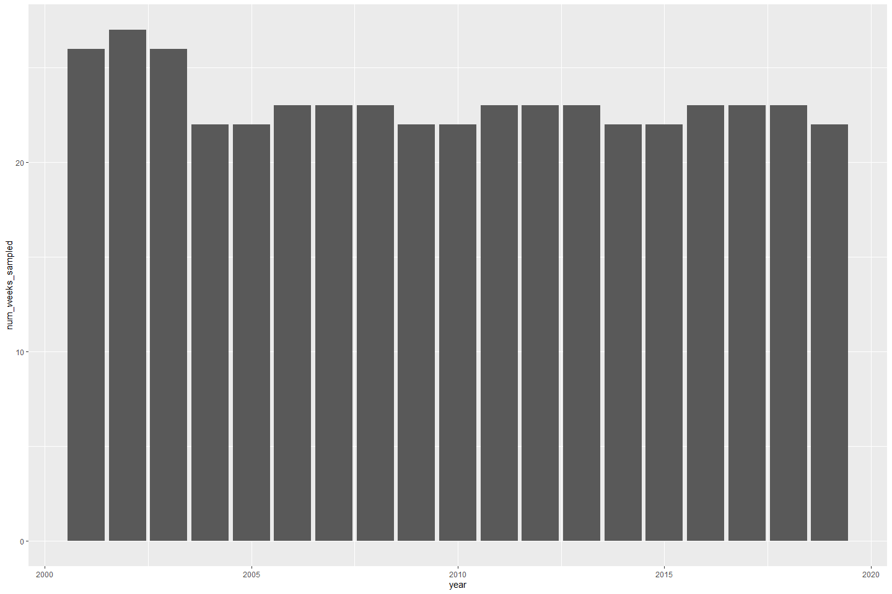
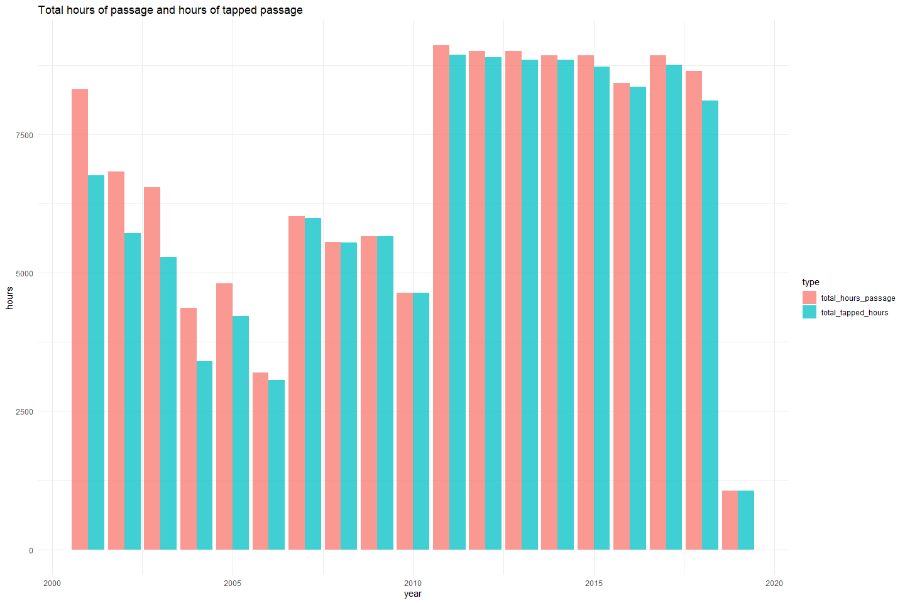
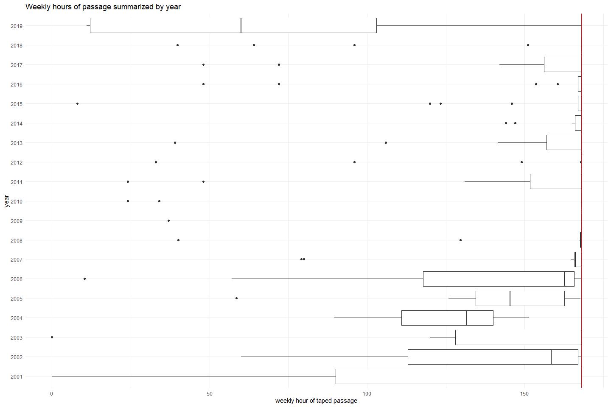
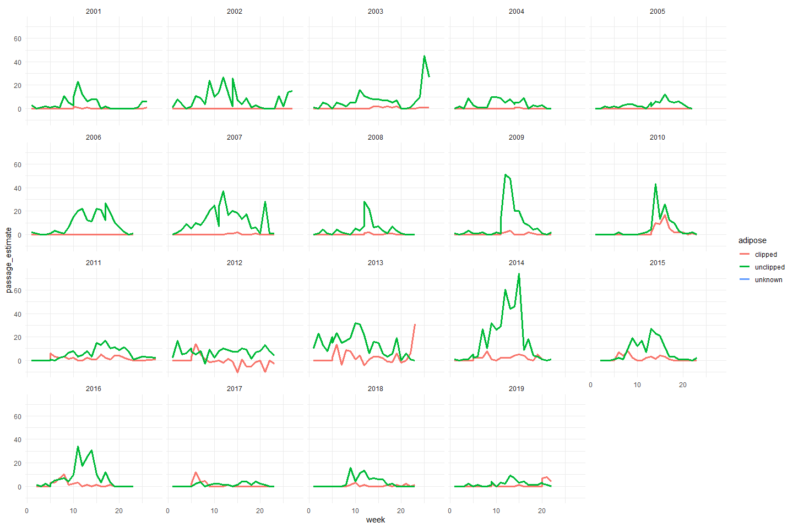
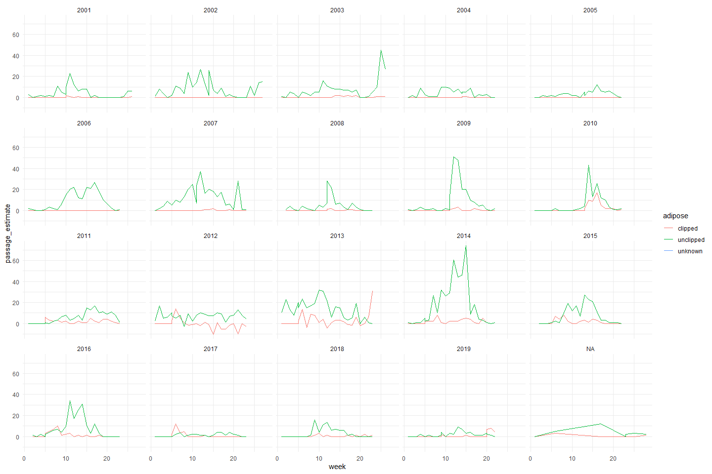
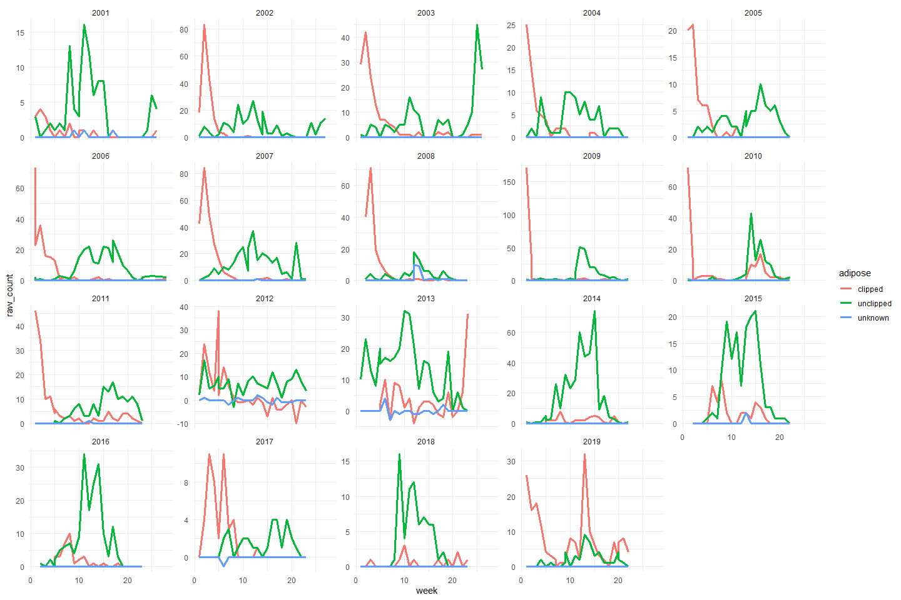
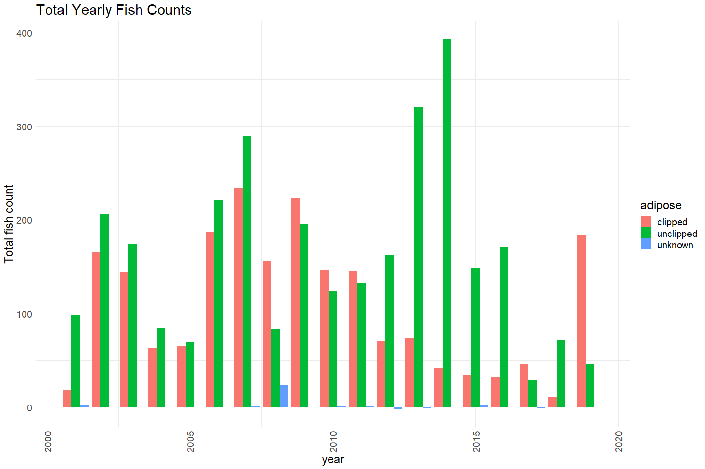

Battle Creek Adult Upstream Passage Estimates QC
================
Erin Cain
9/29/2021

# Battle Creek Adult Upstream Passage Estimates

## Description of Monitoring Data

This dataset contains video outage information and extrapolated passage
estimates for Chinook Salmon using count data from the Video and Trap
and Spawning Building worksheets from 2001 to 2019. Estimates include
all runs of Chinook Salmon.

**Timeframe:** 2001 - 2019

**Completeness of Record throughout timeframe:** Passage estimates
calculated for every year in timeframe.

**Sampling Location:** Battle Creek

**Data Contact:** [Natasha Wingerter](mailto:natasha_wingerter@fws.gov)

Any additional info?

## Access Cloud Data

``` r
# Run Sys.setenv() to specify GCS_AUTH_FILE and GCS_DEFAULT_BUCKET before running 
# getwd() to see how to specify paths 
# Open object from google cloud storage
# Set your authentication using gcs_auth
gcs_auth(json_file = Sys.getenv("GCS_AUTH_FILE"))
# Set global bucket 
gcs_global_bucket(bucket = Sys.getenv("GCS_DEFAULT_BUCKET"))

# git data and save as xlsx
gcs_get_object(object_name = 
                 "adult-upstream-passage-monitoring/battle-creek/data-raw/battle_creek_upstream_passage_datas.xlsx",
               bucket = gcs_get_global_bucket(),
               saveToDisk = "raw_battle_creek_passage_data.xlsx",
               overwrite = TRUE)
```

Read in data from google cloud, glimpse raw data and domain description
sheet:

``` r
# read in data to clean 
sheets <- readxl::excel_sheets("raw_battle_creek_passage_data.xlsx")
sheets
```

    ## [1] "Notes and Metadata"         "Video"                     
    ## [3] "Trap and Spawning Building" "Upstream Passage Estimates"

``` r
raw_passage_estimates <- read_excel("raw_battle_creek_passage_data.xlsx", 
                                    sheet = "Upstream Passage Estimates") %>% glimpse()
```

    ## Rows: 466
    ## Columns: 11
    ## $ Year                          <dbl> 2001, 2001, 2001, 2001, 2001, 2001, 2001~
    ## $ Dates                         <chr> "3-10 March", "11-17 March", "18-24 Marc~
    ## $ Week                          <dbl> 1, 2, 3, 4, 5, 6, 7, 8, 9, 10, 10, 11, 1~
    ## $ Method                        <chr> "Trap", "Trap", "Trap", "Trap", "Trap", ~
    ## $ `Hours of passage`            <dbl> NA, NA, NA, NA, NA, NA, NA, NA, NA, NA, ~
    ## $ `Hours of taped passage`      <dbl> NA, NA, NA, NA, NA, NA, NA, NA, NA, NA, ~
    ## $ `Actual number  clipped`      <chr> "3", "4", "3", "1", "0", "1", "0", "2", ~
    ## $ `Actual number unclipped`     <chr> "3", "0", "1", "2", "1", "2", "1", "13",~
    ## $ `Actual number unknown`       <chr> "0", "0", "0", "0", "0", "0", "0", "0", ~
    ## $ `Passage estimate: clipped`   <chr> "0", "0", "0", "0", "0", "0", "0", "0", ~
    ## $ `Passage estimate: unclipped` <chr> "3", "0", "1", "2", "1", "2", "1", "11",~

## Data transformations

``` r
raw_passage_estimates <- raw_passage_estimates %>% 
  janitor::clean_names() %>% 
  mutate(actual_number_clipped = as.numeric(actual_number_clipped),
         actual_number_unclipped = as.numeric(actual_number_unclipped),
         actual_number_unknown = as.numeric(actual_number_unknown),
         passage_estimate_clipped = as.numeric(passage_estimate_clipped),
         passage_estimate_unclipped = as.numeric(passage_estimate_unclipped)) %>%
  glimpse()
```

    ## Rows: 466
    ## Columns: 11
    ## $ year                       <dbl> 2001, 2001, 2001, 2001, 2001, 2001, 2001, 2~
    ## $ dates                      <chr> "3-10 March", "11-17 March", "18-24 March",~
    ## $ week                       <dbl> 1, 2, 3, 4, 5, 6, 7, 8, 9, 10, 10, 11, 12, ~
    ## $ method                     <chr> "Trap", "Trap", "Trap", "Trap", "Trap", "Tr~
    ## $ hours_of_passage           <dbl> NA, NA, NA, NA, NA, NA, NA, NA, NA, NA, 120~
    ## $ hours_of_taped_passage     <dbl> NA, NA, NA, NA, NA, NA, NA, NA, NA, NA, 70.~
    ## $ actual_number_clipped      <dbl> 3, 4, 3, 1, 0, 1, 0, 2, 0, 0, 1, 1, 0, 1, 0~
    ## $ actual_number_unclipped    <dbl> 3, 0, 1, 2, 1, 2, 1, 13, 4, 3, 6, 16, 12, 6~
    ## $ actual_number_unknown      <dbl> 0, 0, 0, 0, 0, 0, 0, 0, 1, 0, 0, 1, 0, 0, 0~
    ## $ passage_estimate_clipped   <dbl> 0, 0, 0, 0, 0, 0, 0, 0, 0, 0, 2, 1, 0, 1, 0~
    ## $ passage_estimate_unclipped <dbl> 3, 0, 1, 2, 1, 2, 1, 11, 5, 3, 10, 23, 12, ~

``` r
# Create actual dates (not 3 - 10 March)
days <-  str_extract_all(raw_passage_estimates$dates, '\\d+', simplify = TRUE)
months <- str_extract_all(raw_passage_estimates$dates, '[a-zA-z]+', simplify = TRUE) %>%
  as.data.frame() %>%
  mutate(start_month = V1,
         end_month = ifelse(V2=='', V1, V2))

month_lookup <- 1:12
names(month_lookup) <- month.name

raw_passage_estimates$start_month <- month_lookup[months$start_month]
raw_passage_estimates$end_month <- month_lookup[months$end_month]
raw_passage_estimates$start_day <- days[, 1]
raw_passage_estimates$end_day <- days[, 2]

cleaner_passage_estimates <- raw_passage_estimates %>% 
  mutate(start_date = as.Date(paste0(year, "-", start_month, "-", start_day)),
         end_date = as.Date(paste0(year, "-", end_month, "-", end_day))) %>%
  select(-year, -dates, -start_day, -end_day, -start_month, -end_month) %>%
  glimpse()
```

    ## Rows: 466
    ## Columns: 11
    ## $ week                       <dbl> 1, 2, 3, 4, 5, 6, 7, 8, 9, 10, 10, 11, 12, ~
    ## $ method                     <chr> "Trap", "Trap", "Trap", "Trap", "Trap", "Tr~
    ## $ hours_of_passage           <dbl> NA, NA, NA, NA, NA, NA, NA, NA, NA, NA, 120~
    ## $ hours_of_taped_passage     <dbl> NA, NA, NA, NA, NA, NA, NA, NA, NA, NA, 70.~
    ## $ actual_number_clipped      <dbl> 3, 4, 3, 1, 0, 1, 0, 2, 0, 0, 1, 1, 0, 1, 0~
    ## $ actual_number_unclipped    <dbl> 3, 0, 1, 2, 1, 2, 1, 13, 4, 3, 6, 16, 12, 6~
    ## $ actual_number_unknown      <dbl> 0, 0, 0, 0, 0, 0, 0, 0, 1, 0, 0, 1, 0, 0, 0~
    ## $ passage_estimate_clipped   <dbl> 0, 0, 0, 0, 0, 0, 0, 0, 0, 0, 2, 1, 0, 1, 0~
    ## $ passage_estimate_unclipped <dbl> 3, 0, 1, 2, 1, 2, 1, 11, 5, 3, 10, 23, 12, ~
    ## $ start_date                 <date> 2001-03-03, 2001-03-11, 2001-03-18, 2001-0~
    ## $ end_date                   <date> 2001-03-10, 2001-03-17, 2001-03-24, 2001-0~

``` r
# Gather columns to have adipose, passage_estimates, raw_counts
cleaner_passage_estimates <- cleaner_passage_estimates %>% 
  pivot_longer(!c(week:hours_of_taped_passage, start_date, end_date), 
               names_to = c("type", "type2", "adipose"), 
               names_sep = "_",
               values_to = "count") %>%
  mutate(count_type = paste(type, type2, sep = "_")) %>%
  select(-type, -type2) %>%
  pivot_wider(names_from = c("count_type"), values_from = "count") %>% 
  rename("raw_count" = actual_number) %>%
  glimpse()
```

    ## Rows: 1,398
    ## Columns: 9
    ## $ week                   <dbl> 1, 1, 1, 2, 2, 2, 3, 3, 3, 4, 4, 4, 5, 5, 5, 6,~
    ## $ method                 <chr> "Trap", "Trap", "Trap", "Trap", "Trap", "Trap",~
    ## $ hours_of_passage       <dbl> NA, NA, NA, NA, NA, NA, NA, NA, NA, NA, NA, NA,~
    ## $ hours_of_taped_passage <dbl> NA, NA, NA, NA, NA, NA, NA, NA, NA, NA, NA, NA,~
    ## $ start_date             <date> 2001-03-03, 2001-03-03, 2001-03-03, 2001-03-11~
    ## $ end_date               <date> 2001-03-10, 2001-03-10, 2001-03-10, 2001-03-17~
    ## $ adipose                <chr> "clipped", "unclipped", "unknown", "clipped", "~
    ## $ raw_count              <dbl> 3, 3, 0, 4, 0, 0, 3, 1, 0, 1, 2, 0, 0, 1, 0, 1,~
    ## $ passage_estimate       <dbl> 0, 3, NA, 0, 0, NA, 0, 1, NA, 0, 2, NA, 0, 1, N~

## Explore Numeric Variables:

``` r
cleaner_passage_estimates %>% select_if(is.numeric) %>% colnames()
```

    ## [1] "week"                   "hours_of_passage"       "hours_of_taped_passage"
    ## [4] "raw_count"              "passage_estimate"

### Variable: `week`

**Plotting weeks per year over Period of Record**

``` r
cleaner_passage_estimates %>% 
  group_by(year = year(start_date)) %>% 
  summarise(num_weeks_sampled = max(week)) %>% 
  ggplot() + 
  geom_col(aes(x = year, y = num_weeks_sampled))
```

<!-- -->

Every year there were between 22 and 28 weeks sampled.

**Numeric Summary of week over Period of Record**

``` r
summary(cleaner_passage_estimates$week)
```

    ##    Min. 1st Qu.  Median    Mean 3rd Qu.    Max. 
    ##    1.00    6.00   12.00   12.08   18.00   28.00

**NA and Unknown Values**

-   0 % of values in the `week` column are NA.

### Variable: `hours_of_passage`, `hours_of_taped_passage`

**Plotting hours of passage and hours of taped passage over Period of
Record**

``` r
cleaner_passage_estimates %>% 
  group_by(year = year(start_date)) %>%
  summarise(total_hours_passage = sum(hours_of_passage, na.rm = T), 
            total_tapped_hours = sum(hours_of_taped_passage, na.rm = T)) %>%
  pivot_longer(!year, names_to = "type", values_to = "hours") %>%
  ggplot(aes(x = year, y = hours, fill = type)) + 
  geom_col(position = "dodge", alpha = .75) + 
  # geom_vline(xintercept = 168, color = "red") + 
  labs(title = "Total hours of passage and hours of tapped passage") +
  theme_minimal()
```

<!-- -->

``` r
  # scale_fill_manual(values = c("blue", "orange"))
```

Pre 2010 less hours of passage tapped and total hours of passage than
post 2010.

``` r
cleaner_passage_estimates %>% 
  mutate(year = as.factor(year(start_date))) %>%
  ggplot() + 
  geom_boxplot(aes(x = hours_of_taped_passage, y = year)) + 
  geom_vline(xintercept = 168, color = "red") + 
  labs(title = "Weekly hours of passage summarized by year", 
       x = "weekly hour of taped passage") + 
  theme_minimal()
```

<!-- -->

The red line is at 168, the total number of hours in a year. It appears
that from 2001 - 2006 they did not have tapped passage for the full week
very often. The recent years are better with some variation. 2019 must
not be complete data.

**Numeric Summary of passage hours over Period of Record**

``` r
summary(cleaner_passage_estimates$hours_of_passage)
```

    ##    Min. 1st Qu.  Median    Mean 3rd Qu.    Max.    NA's 
    ##     8.0   168.0   168.0   155.5   168.0   205.0     570

``` r
summary(cleaner_passage_estimates$hours_of_taped_passage)
```

    ##    Min. 1st Qu.  Median    Mean 3rd Qu.    Max.    NA's 
    ##     0.0   148.2   168.0   146.8   168.0   168.0     570

The numeric summary shows us that not all the time periods are exactly
one week.

-   Min is 8 hours - less than a day.
-   Max is 205 hours - over a full week.

**NA and Unknown Values**

-   40.8 % of values in the `hours_of_passage` column are NA.

-   40.8 % of values in the `hours_of_taped_passage` column are NA.

-   Many of the NAs correspond with traping data.
    `hours_of_taped_passage` and `hours_of_passage` are only relevant to
    video data.

### Variable: `passage_estimate`

**Plotting passage estimate over Period of Record**

``` r
cleaner_passage_estimates %>% 
  ggplot(aes(x = week, y = passage_estimate, color = adipose)) +
  geom_line(size = 1.4) + 
  facet_wrap(~year(start_date)) + 
  theme_minimal()
```

<!-- -->

``` r
  # scale_fill_manual(values = c("blue", "orange"))
```

``` r
cleaner_passage_estimates  %>%
  group_by(year = year(start_date), adipose) %>%
  summarise(yearly_total_pasage_estimate = sum(passage_estimate, na.rm = T)) %>%
  ggplot(aes(x = year, y = yearly_total_pasage_estimate, fill = adipose)) + 
  geom_col(position = "dodge") + 
  theme_minimal() +
  labs(title = "Total Yearly Passage Estimates",
       y = "Total fish count") + 
  theme(text = element_text(size = 18),
        axis.text.x = element_text(angle = 90, vjust = 0.5, hjust=1)) 
```

    ## `summarise()` has grouped output by 'year'. You can override using the `.groups` argument.

<!-- -->

Looks like there is one negative value for passage estimates which seems
like an error.

**Numeric Summary of passage estimate over Period of Record**

``` r
summary(cleaner_passage_estimates$passage_estimate)
```

    ##    Min. 1st Qu.  Median    Mean 3rd Qu.    Max.    NA's 
    ## -10.500   0.000   1.000   3.764   4.000  74.000     470

We see that the negative passage estimate value is -10.5.

**NA and Unknown Values**

-   33.6 % of values in the `passage_estimate` column are NA.

The negative values appear to mostly correspond to when adipose =
unknown. There were no passage estimates generated for these values,
just the actual passage number.

### Variable: `raw_count`

**Plotting raw count of fish over Period of Record**

``` r
cleaner_passage_estimates %>% 
  ggplot(aes(x = week, y = raw_count, color = adipose)) +
  geom_line(size = 1.4) + 
  facet_wrap(~year(start_date), scales = "free_y") + 
  theme_minimal()
```

<!-- -->

``` r
  # scale_fill_manual(values = c("blue", "orange"))
```

``` r
cleaner_passage_estimates  %>%
  group_by(year = year(start_date), adipose) %>%
  summarise(yearly_total_fish_count = sum(raw_count, na.rm = T)) %>%
  ggplot(aes(x = year, y = yearly_total_fish_count, fill = adipose)) + 
  geom_col(position = "dodge") + 
  theme_minimal() +
  labs(title = "Total Yearly Fish Counts",
       y = "Total fish count") + 
  theme(text = element_text(size = 18),
        axis.text.x = element_text(angle = 90, vjust = 0.5, hjust=1)) 
```

    ## `summarise()` has grouped output by 'year'. You can override using the `.groups` argument.

<!-- -->

**Numeric Summary of raw count over Period of Record**

``` r
summary(cleaner_passage_estimates$raw_count)
```

    ##    Min. 1st Qu.  Median    Mean 3rd Qu.    Max.    NA's 
    ## -10.000   0.000   0.000   3.652   3.000 171.000       6

**NA and Unknown Values**

-   0.4 % of values in the `raw_count` column are NA.

## Explore Categorical variables:

``` r
cleaner_passage_estimates %>% select_if(is.character) %>% colnames()
```

    ## [1] "method"  "adipose"

### Variable: `method`

method of observation (trap-barrier weir trap, spawning building, video)

``` r
table(cleaner_passage_estimates$method) 
```

    ## 
    ##      Spawning Building Spawning Building/Trap                   Trap 
    ##                    180                     15                    375 
    ##                  Video 
    ##                    828

Fix inconsistencies with spelling, capitalization, and abbreviations.

``` r
cleaner_passage_estimates$method <- case_when(
  cleaner_passage_estimates$method == "Spawning Building" ~ "spwaning building",
  cleaner_passage_estimates$method == "Spawning Building/Trap" ~ "spawning building or trap", 
  cleaner_passage_estimates$method == "Trap" ~ "trap",
  cleaner_passage_estimates$method == "Video" ~ "video")

table(cleaner_passage_estimates$method) 
```

    ## 
    ## spawning building or trap         spwaning building                      trap 
    ##                        15                       180                       375 
    ##                     video 
    ##                       828

**NA and Unknown Values**

-   0 % of values in the `method` column are NA.

### Variable: `adipose`

Adipose clipped, unclipped or unknown,

``` r
table(cleaner_passage_estimates$adipose) 
```

    ## 
    ##   clipped unclipped   unknown 
    ##       466       466       466

**NA and Unknown Values**

-   0 % of values in the `adipose` column are NA.

## Summary of identified issues

-   Negative value for passage count with clipped adipose in 2012
-   Total hours of passage varies quite a but over the years,
    different/shorter sampling seasons pre 2010 contribute to this
-   There are a few values that do not have a date (start\_date 21,
    end\_date 24).

## Save cleaned data back to google cloud

``` r
battle_passage_estimates <- cleaner_passage_estimates %>% glimpse()
```

    ## Rows: 1,398
    ## Columns: 9
    ## $ week                   <dbl> 1, 1, 1, 2, 2, 2, 3, 3, 3, 4, 4, 4, 5, 5, 5, 6,~
    ## $ method                 <chr> "trap", "trap", "trap", "trap", "trap", "trap",~
    ## $ hours_of_passage       <dbl> NA, NA, NA, NA, NA, NA, NA, NA, NA, NA, NA, NA,~
    ## $ hours_of_taped_passage <dbl> NA, NA, NA, NA, NA, NA, NA, NA, NA, NA, NA, NA,~
    ## $ start_date             <date> 2001-03-03, 2001-03-03, 2001-03-03, 2001-03-11~
    ## $ end_date               <date> 2001-03-10, 2001-03-10, 2001-03-10, 2001-03-17~
    ## $ adipose                <chr> "clipped", "unclipped", "unknown", "clipped", "~
    ## $ raw_count              <dbl> 3, 3, 0, 4, 0, 0, 3, 1, 0, 1, 2, 0, 0, 1, 0, 1,~
    ## $ passage_estimate       <dbl> 0, 3, NA, 0, 0, NA, 0, 1, NA, 0, 2, NA, 0, 1, N~

``` r
f <- function(input, output) write_csv(input, file = output)

gcs_upload(battle_passage_estimates,
           object_function = f,
           type = "csv",
           name = "adult-upstream-passage-monitoring/battle-creek/data/battle_passage_estimates.csv")
```

    ## i 2021-10-21 08:38:05 > File size detected as  71.9 Kb

    ## i 2021-10-21 08:38:05 > Request Status Code:  400

    ## ! API returned: Cannot insert legacy ACL for an object when uniform bucket-level access is enabled. Read more at https://cloud.google.com/storage/docs/uniform-bucket-level-access - Retrying with predefinedAcl='bucketLevel'

    ## i 2021-10-21 08:38:05 > File size detected as  71.9 Kb

    ## ==Google Cloud Storage Object==
    ## Name:                adult-upstream-passage-monitoring/battle-creek/data/battle_passage_estimates.csv 
    ## Type:                csv 
    ## Size:                71.9 Kb 
    ## Media URL:           https://www.googleapis.com/download/storage/v1/b/jpe-dev-bucket/o/adult-upstream-passage-monitoring%2Fbattle-creek%2Fdata%2Fbattle_passage_estimates.csv?generation=1634830686133529&alt=media 
    ## Download URL:        https://storage.cloud.google.com/jpe-dev-bucket/adult-upstream-passage-monitoring%2Fbattle-creek%2Fdata%2Fbattle_passage_estimates.csv 
    ## Public Download URL: https://storage.googleapis.com/jpe-dev-bucket/adult-upstream-passage-monitoring%2Fbattle-creek%2Fdata%2Fbattle_passage_estimates.csv 
    ## Bucket:              jpe-dev-bucket 
    ## ID:                  jpe-dev-bucket/adult-upstream-passage-monitoring/battle-creek/data/battle_passage_estimates.csv/1634830686133529 
    ## MD5 Hash:            asQ8ifIDFC2w2222qoKv9w== 
    ## Class:               STANDARD 
    ## Created:             2021-10-21 15:38:06 
    ## Updated:             2021-10-21 15:38:06 
    ## Generation:          1634830686133529 
    ## Meta Generation:     1 
    ## eTag:                CJm6wvLq2/MCEAE= 
    ## crc32c:              226jSQ==
