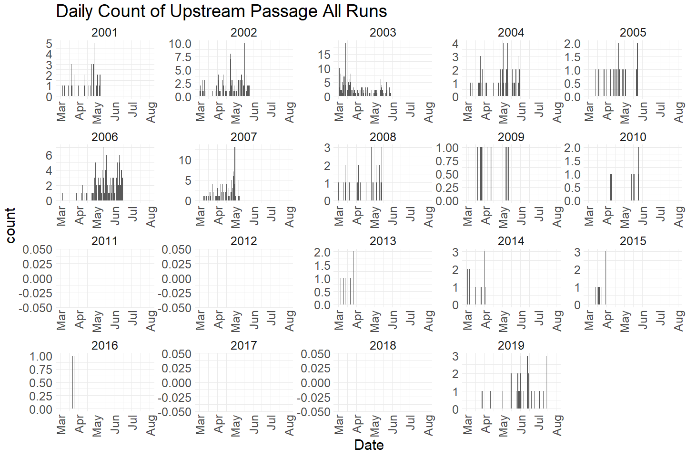
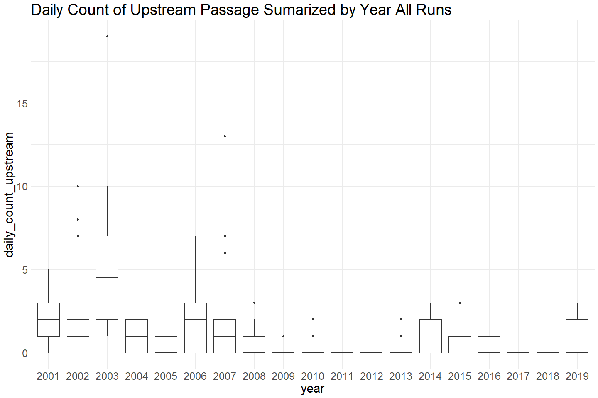
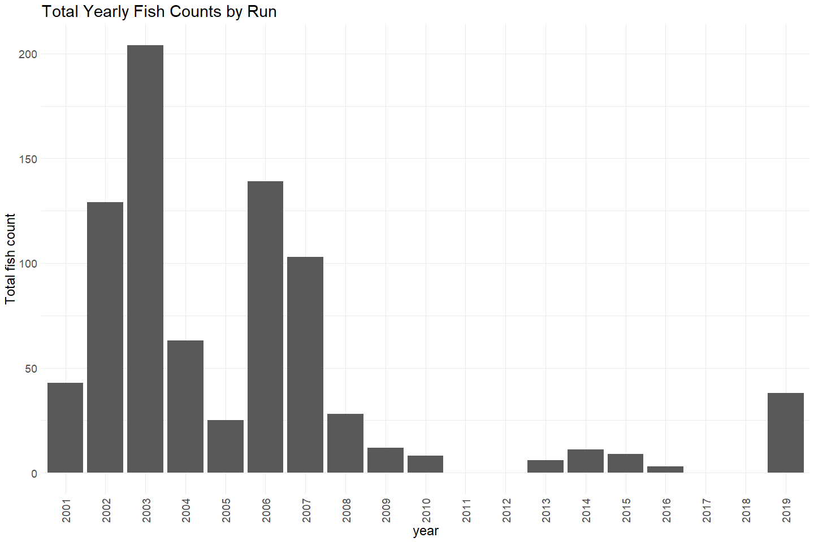

Battle Creek Upstream Passasge - Trap and Spawning Building QC
================
Erin Cain
9/29/2021

# Battle Creek Upstream Passasge - Trap and Spawning Building

## Description of Monitoring Data

These data were collected to capture the number of fish that pass the
barrier weir at Coleman National Fish Hatchery from 2001 to 2019. Data
come from two sampling methods- a barrier weir trap and spawning
building operations. In 2008, a new fish ladder was built and from
2009-2012 the trap was moved to the middle of the newly constructed fish
ladder. For spawning building operations, fish were diverted to holding
ponds and processed daily, rather than in 30 minute increments through
an \~8 hour period during barrier weir trapping.

**Timeframe:** 2001 - 2019

**Sampling Season:** March - July

**Completeness of Record throughout timeframe:** Some years with no
data.

**Sampling Location:** Battle Creek

**Data Contact:** [Natasha Wingerter](mailto:natasha_wingerter@fws.gov)

Any additional info?

## Access Cloud Data

``` r
# Run Sys.setenv() to specify GCS_AUTH_FILE and GCS_DEFAULT_BUCKET before running 
# getwd() to see how to specify paths 
# Open object from google cloud storage
# Set your authentication using gcs_auth
gcs_auth(json_file = Sys.getenv("GCS_AUTH_FILE"))
# Set global bucket 
gcs_global_bucket(bucket = Sys.getenv("GCS_DEFAULT_BUCKET"))

# git data and save as xlsx
gcs_get_object(object_name = 
                 "adult-upstream-passage-monitoring/battle-creek/data-raw/battle_creek_upstream_passage_datas.xlsx",
               bucket = gcs_get_global_bucket(),
               saveToDisk = "raw_battle_creek_passage_data.xlsx",
               overwrite = TRUE)
```

Read in data from google cloud, glimpse raw data sheet:

``` r
sheets <- readxl::excel_sheets("raw_battle_creek_passage_data.xlsx")
sheets
```

    ## [1] "Notes and Metadata"         "Video"                     
    ## [3] "Trap and Spawning Building" "Upstream Passage Estimates"

``` r
raw_passage_data <- read_excel("raw_battle_creek_passage_data.xlsx", 
                               sheet = "Trap and Spawning Building", 
                               col_types = c("text", "date", "date", 
                                             "date", "date", "text", 
                                             "numeric", "text", "text",
                                             "numeric", "text", "text", 
                                             "text", "text", "text", 
                                             "text", "text", "text")) %>% glimpse()
```

    ## Rows: 2,699
    ## Columns: 18
    ## $ Project      <chr> "Trap", "Trap", "Trap", "Trap", "Trap", "Trap", "Trap", "~
    ## $ Sample_Date  <dttm> 2001-03-05, 2001-03-05, 2001-03-05, 2001-03-08, 2001-03-~
    ## $ Trap_Beg     <dttm> 1899-12-31 07:30:00, 1899-12-31 07:30:00, 1899-12-31 07:~
    ## $ Trap_End     <dttm> 1899-12-31 15:15:00, 1899-12-31 15:15:00, 1899-12-31 15:~
    ## $ Time         <dttm> 1899-12-31 07:30:00, 1899-12-31 07:30:00, 1899-12-31 12:~
    ## $ Species      <chr> "CHN", "CHN", "CHN", "CHN", "CHN", "CHN", "CHN", "CHN", "~
    ## $ No_Passed_Up <dbl> 0, 0, 1, 1, 1, 1, 1, 1, 1, 1, 1, 1, 1, 1, 0, 1, 1, 1, 1, ~
    ## $ Sex          <chr> "F", "F", "Unk", "Unk", "F", "Unk", "M", "F", "M", "M", "~
    ## $ Confidence   <chr> "C", "C", NA, NA, "C", NA, "C", "C", "C", "C", "C", "C", ~
    ## $ FL_mm        <dbl> 806, 910, 725, 755, 611, 810, 525, 668, 771, 870, 770, 60~
    ## $ Adipose      <chr> "A", "A", "P", "P", "A", "P", "A", "A", "A", "A", "A", "A~
    ## $ Condition    <chr> "D", "D", "D", "B", "B", "B", "D", "D", "D", "D", "D", "D~
    ## $ Mature       <chr> "R", "R", "R", "G", "G", "G", "R", "R", "R", "R", "R", "R~
    ## $ Status       <chr> "Sac", "Sac", "Pass", "Pass", "Pass", "Pass", "Sac", "Sac~
    ## $ Recapture    <chr> "N", "N", "N", "N", "N", "N", "N", "N", "N", "N", "N", "N~
    ## $ Recap_Type   <chr> NA, NA, NA, NA, NA, NA, NA, NA, NA, NA, NA, NA, NA, NA, N~
    ## $ Tag_no       <chr> NA, NA, NA, NA, NA, NA, NA, NA, NA, NA, NA, NA, NA, NA, N~
    ## $ Comments     <chr> NA, NA, "LE changed gender to unknown 2/2015", "LE change~

## Data transformations

``` r
cleaner_passage_data <- raw_passage_data %>% 
  janitor::clean_names() %>% 
  filter(species == "CHN") %>%
  rename("date" = sample_date,
         "count" = no_passed_up,
         "fork_length" = fl_mm,
         "recapture_type" = recap_type,
         "confidence_in_sex" = confidence,
         "tag_number" = tag_no) %>%
  mutate(date = as.Date(date),
         time = hms::as_hms(time)) %>%
  select(-project, -species) %>% # all species = chn, all project = video 
  glimpse()
```

    ## Rows: 2,698
    ## Columns: 16
    ## $ date              <date> 2001-03-05, 2001-03-05, 2001-03-05, 2001-03-08, 200~
    ## $ trap_beg          <dttm> 1899-12-31 07:30:00, 1899-12-31 07:30:00, 1899-12-3~
    ## $ trap_end          <dttm> 1899-12-31 15:15:00, 1899-12-31 15:15:00, 1899-12-3~
    ## $ time              <time> 07:30:00, 07:30:00, 12:30:00, 15:15:00, 07:30:00, 0~
    ## $ count             <dbl> 0, 0, 1, 1, 1, 1, 1, 1, 1, 1, 1, 1, 1, 1, 0, 1, 1, 1~
    ## $ sex               <chr> "F", "F", "Unk", "Unk", "F", "Unk", "M", "F", "M", "~
    ## $ confidence_in_sex <chr> "C", "C", NA, NA, "C", NA, "C", "C", "C", "C", "C", ~
    ## $ fork_length       <dbl> 806, 910, 725, 755, 611, 810, 525, 668, 771, 870, 77~
    ## $ adipose           <chr> "A", "A", "P", "P", "A", "P", "A", "A", "A", "A", "A~
    ## $ condition         <chr> "D", "D", "D", "B", "B", "B", "D", "D", "D", "D", "D~
    ## $ mature            <chr> "R", "R", "R", "G", "G", "G", "R", "R", "R", "R", "R~
    ## $ status            <chr> "Sac", "Sac", "Pass", "Pass", "Pass", "Pass", "Sac",~
    ## $ recapture         <chr> "N", "N", "N", "N", "N", "N", "N", "N", "N", "N", "N~
    ## $ recapture_type    <chr> NA, NA, NA, NA, NA, NA, NA, NA, NA, NA, NA, NA, NA, ~
    ## $ tag_number        <chr> NA, NA, NA, NA, NA, NA, NA, NA, NA, NA, NA, NA, NA, ~
    ## $ comments          <chr> NA, NA, "LE changed gender to unknown 2/2015", "LE c~

## Explore Numeric Variables:

``` r
cleaner_passage_data %>% select_if(is.numeric) %>% colnames()
```

    ## [1] "count"       "fork_length"

### Variable: `count`

**Plotting Passage Counts Moving Up over Period of Record**

``` r
cleaner_passage_data %>% 
  mutate(year = as.factor(year(date)),
         fake_year = if_else(month(date) %in% 10:12, 1900, 1901),
         fake_date = as.Date(paste0(fake_year,"-", month(date), "-", day(date)))) %>%
  ggplot(aes(x = fake_date, y = count)) + 
  geom_col() + 
  facet_wrap(~year(date), scales = "free") + 
  scale_x_date(labels = date_format("%b"), 
               limits = c(as.Date("1901-03-01"), as.Date("1901-08-01")), 
               date_breaks = "1 month") + 
  theme_minimal() + 
  theme(text = element_text(size = 23),
        axis.text.x = element_text(angle = 90, vjust = 0.5, hjust=1)) + 
  labs(title = "Daily Count of Upstream Passage", 
       x = "Date")  
```

<!-- -->

Data gaps 2011, 2012, 2017, 2018

``` r
# Boxplots of daily counts by year
cleaner_passage_data %>% group_by(date) %>%
  mutate(daily_count_upstream = sum(count)) %>%
  mutate(year = as.factor(year(date))) %>% 
  ungroup() %>%
  ggplot(aes(x = year, y = daily_count_upstream)) + 
  geom_boxplot() + 
  theme_minimal() +
  theme(text = element_text(size = 23)) + 
  labs(title = "Daily Count of Upstream Passage Summarized by Year") 
```

<!-- -->

``` r
cleaner_passage_data  %>%
  mutate(year = as.factor(year(date))) %>%
  ggplot(aes(x = year, y = count)) + 
  geom_col() + 
  theme_minimal() +
  labs(title = "Total Yearly Fish Counts",
       y = "Total fish count") + 
  theme(text = element_text(size = 18),
        axis.text.x = element_text(angle = 90, vjust = 0.5, hjust=1)) 
```

<!-- -->

-   Data gaps 2011, 2012, 2017, 2018
-   Small total counts 2008 - 2018
-   Overall not looking at that many fish counted each year

**Numeric Summary of Passage Counts Moving Up over Period of Record**

``` r
# Table with summary statistics
summary(cleaner_passage_data$count)
```

    ##    Min. 1st Qu.  Median    Mean 3rd Qu.    Max. 
    ##  0.0000  0.0000  0.0000  0.3043  1.0000  1.0000

``` r
# daily numeric summary 
cleaner_passage_data %>% group_by(date) %>%
  summarise(count = sum(count, na.rm = T)) %>%
  pull(count) %>%
  summary()
```

    ##    Min. 1st Qu.  Median    Mean 3rd Qu.    Max. 
    ##   0.000   0.000   1.000   1.244   2.000  19.000

**NA and Unknown Values**

-   0 % of values in the `count` column are NA. However, there are
    clearly gaps in data. More investigation needs to be done to see if
    0 is a real 0 or if it can be explained by other factors (outages).

### Variable: `fork_length`

**Plotting fork\_length**

``` r
cleaner_passage_data %>% 
  ggplot(aes(x = fork_length)) + 
  geom_histogram() + 
  theme_minimal() +
  labs(title = "Fork length distribution (mm)") + 
  theme(text = element_text(size = 18),
        axis.text.x = element_text(angle = 90, vjust = 0.5, hjust=1)) 
```

    ## `stat_bin()` using `bins = 30`. Pick better value with `binwidth`.

<!-- -->

``` r
cleaner_passage_data %>% 
  mutate(year = as.factor(year(date))) %>%
  ggplot(aes(x = fork_length, y = year)) + 
  geom_boxplot() + 
  theme_minimal() +
  labs(title = "Fork length summarized by year") + 
  theme(text = element_text(size = 18),
        axis.text.x = element_text(angle = 90, vjust = 0.5, hjust=1)) 
```

<!-- -->

**Numeric Summary of fork\_length over Period of Record**

``` r
# Table with summary statistics
summary(cleaner_passage_data$fork_length)
```

    ##    Min. 1st Qu.  Median    Mean 3rd Qu.    Max.    NA's 
    ##    55.0   700.0   770.0   766.4   852.0  1110.0      14

**NA and Unknown Values**

-   0.5 % of values in the `fork_length` column are NA.

## Explore Categorical variables:

``` r
cleaner_passage_data %>% select_if(is.character) %>% colnames()
```

    ##  [1] "sex"               "confidence_in_sex" "adipose"          
    ##  [4] "condition"         "mature"            "status"           
    ##  [7] "recapture"         "recapture_type"    "tag_number"       
    ## [10] "comments"

### Variable: `sex`

``` r
table(cleaner_passage_data$sex) 
```

    ## 
    ##    F    M  Unk  UNK 
    ## 1363  724  566   45

Fix inconsistencies with spelling, capitalization, and abbreviations.

``` r
# Fix yes/no/unknown
cleaner_passage_data$sex = if_else(cleaner_passage_data$sex == "UNK" | cleaner_passage_data$sex == "Unk" , "unknown", cleaner_passage_data$sex)
table(cleaner_passage_data$sex) 
```

    ## 
    ##       F       M unknown 
    ##    1363     724     611

**NA or Unknown Values**

-   0 % of values in the `sex` column are NA.
-   22.6 % of values in the `sex` column are`unknown`.

### Variable: `confidence_in_sex`

`confidence_in_sex` describes confidence in sex call:

-   C - confident in sex call
-   NC - not confident in sex call

``` r
table(cleaner_passage_data$confidence_in_sex) 
```

    ## 
    ##    C   NC 
    ## 1232   40

Fix inconsistencies with spelling, capitalization, and abbreviations.

``` r
# Fix yes/no/unknown
cleaner_passage_data$confidence_in_sex = case_when(
  cleaner_passage_data$confidence_in_sex == "C" ~ "confident", 
  cleaner_passage_data$confidence_in_sex == "NC" ~ "not confident"
)
table(cleaner_passage_data$confidence_in_sex) 
```

    ## 
    ##     confident not confident 
    ##          1232            40

**NA or Unknown Values**

-   52.9 % of values in the `confidence_in_sex` column are NA.

### Variable: `adipose`

``` r
table(cleaner_passage_data$adipose) 
```

    ## 
    ##    A    P  Unk 
    ## 2008  684    6

There are no NA so safe to turn Unknown into NA and then can simplify
A/P to F/T. A = Absent - changes to FALSE P = present - changes to TRUE
(there are 6 unknown values that turn to NA)

``` r
# Fix yes/no/unknown
cleaner_passage_data$adipose = case_when(
  cleaner_passage_data$adipose == "A" ~ FALSE,
  cleaner_passage_data$adipose == "P" ~ TRUE,
)
table(cleaner_passage_data$adipose) 
```

    ## 
    ## FALSE  TRUE 
    ##  2008   684

**NA or Unknown Values**

-   0.2 % of values in the `adipose` column are NA.

### Variable: `condition`

Describes fish coloration, B=Bright, D=Dark, F=Fungus

``` r
table(cleaner_passage_data$condition)
```

    ## 
    ##    B    D    F 
    ##  780 1837   48

``` r
cleaner_passage_data$condition = case_when(
  cleaner_passage_data$condition == "B" ~ "bright",
  cleaner_passage_data$condition == "D" ~ "dark",
  cleaner_passage_data$condition == "F" ~ "fungus",
)
table(cleaner_passage_data$condition)
```

    ## 
    ## bright   dark fungus 
    ##    780   1837     48

**NA or Unknown Values**

-   1.2 % of values in the `condition` column are NA.

### Variable: `mature`

fish sexual maturity, N/A=not applicable, R=Ripe, G=Green (or unripe)  
Changes to TRUE for R (sexually mature), and FALSE for G (sexually
unripe)

``` r
table(cleaner_passage_data$mature)
```

    ## 
    ##    G    R 
    ##  935 1713

``` r
cleaner_passage_data$mature = case_when(
  cleaner_passage_data$mature == "G" ~ FALSE,
  cleaner_passage_data$mature == "R" ~ TRUE
)
table(cleaner_passage_data$mature)
```

    ## 
    ## FALSE  TRUE 
    ##   935  1713

**NA or Unknown Values**

-   1.9 % of values in the `mature` column are NA.

### Variable: `status`

location of fish, DIP=Dead in pond, downstream=released downstream,
ESC=escaped, Hatch=given to the hatchery, Lost=Lost the fish,
Mort=Mortality, P=Pass (upstream), Recap=Recaptured fish, Sac=Sacraficed

``` r
table(cleaner_passage_data$status)
```

    ## 
    ##        Dip        DIP Downstream        Esc      Hatch       LOST       Mort 
    ##          8         68          2          3         85          1          5 
    ##       Pass      RECAP   Rel Down        Sac 
    ##        673          1          4       1848

``` r
cleaner_passage_data$status = case_when(
  cleaner_passage_data$status == "DIP" | cleaner_passage_data$status == "Dip" ~ "dead in pond",
  cleaner_passage_data$status == "Downstream" | cleaner_passage_data$status == "Rel Down" ~ "released downstream",
  cleaner_passage_data$status == "Esc" ~ "escaped",
  cleaner_passage_data$status == "Hatch" ~ "given to the hatchery",
  cleaner_passage_data$status == "LOST" ~ "lost the fish",
  cleaner_passage_data$status == "Mort" ~ "mortality",
  cleaner_passage_data$status == "RECAP" ~ "recaptured fish",
  cleaner_passage_data$status == "Sac" ~ "sacraficed",
)
table(cleaner_passage_data$status)
```

    ## 
    ##          dead in pond               escaped given to the hatchery 
    ##                    76                     3                    85 
    ##         lost the fish             mortality       recaptured fish 
    ##                     1                     5                     1 
    ##   released downstream            sacraficed 
    ##                     6                  1848

**NA or Unknown Values**

-   24.9 % of values in the `status` column are NA.

### Variable: `recapture`

was the fish a recapture Y=Yes, N=No - (change to booleen)

``` r
table(cleaner_passage_data$recapture)
```

    ## 
    ##    n    N    Y 
    ##    1 2639   58

**NA or Unknown Values**

-   0 % of values in the `recapture` column are NA.

There are no Na so I can go ahead and change all Y = TRUE, all n, N =
FALSE

``` r
cleaner_passage_data$recapture = ifelse(cleaner_passage_data$recapture == "Y", TRUE, FALSE)
table(cleaner_passage_data$recapture)
```

    ## 
    ## FALSE  TRUE 
    ##  2640    58

**NA or Unknown Values**

-   0 % of values in the `recapture` column are NA.

### Variable: `recapture_type`

what type of recap U=Upper caudal punch, L=Lower caudal punch, VIE=VIE
marked, Floy=Floy tag attached, Radio=Radio tag

``` r
table(cleaner_passage_data$recapture_type)
```

    ## 
    ## Floy Tag    Lower     None    Radio    Upper 
    ##       10        7     2298       39        3

``` r
cleaner_passage_data$recapture_type = case_when(
  cleaner_passage_data$recapture_type == "Floy Tag" ~ "floy tag",
  cleaner_passage_data$recapture_type == "Radio" ~ "radio tag",
  cleaner_passage_data$recapture_type == "Lower" ~ "lower caudal punch",
  cleaner_passage_data$recapture_type == "Upper" ~ "upper caudal punch",
  cleaner_passage_data$recapture_type == "None" ~ "none",
)
table(cleaner_passage_data$recapture_type)
```

    ## 
    ##           floy tag lower caudal punch               none          radio tag 
    ##                 10                  7               2298                 39 
    ## upper caudal punch 
    ##                  3

**NA or Unknown Values**

-   12.6 % of values in the `mature` column are NA.

### Variable: \`tag\_number\`\`

Floy tag number

``` r
length(unique(cleaner_passage_data$tag_number))
```

    ## [1] 138

``` r
unique(cleaner_passage_data$tag_number)[1:5]
```

    ## [1] NA      "12328" "12331" "12333" "12335"

There are 138 unique tag numbers. 138 is greater than the total number
of recaptures according to `recapture` and `recapture_type` columns

**NA or Unknown Values**

-   91.5 % of values in the `tag_number` column are NA.

### Variable: `comments`

10 unique comments are shown bellow. Comments are only present on 12% of
the data.

``` r
unique(cleaner_passage_data$comments)[1:10]
```

    ##  [1] NA                                                                                            
    ##  [2] "LE changed gender to unknown 2/2015"                                                         
    ##  [3] "Found on screen to settling pond"                                                            
    ##  [4] "Trap not fished and fish released by hatchery personnel; LE changed gender to unknown 2/2015"
    ##  [5] "Stressed and died after removing from trap; LE changed gender to unknown 2/2015"             
    ##  [6] "Net tore and fish escaped; LE changed gender to unknown 2/2015"                              
    ##  [7] "No eggs"                                                                                     
    ##  [8] "No milt"                                                                                     
    ##  [9] "Some fungus"                                                                                 
    ## [10] "Camera #2 started on 3/9/03"

**NA and Unknown Values**

-   69.7 % of values in the `comments` column are NA.

## Summary of identified issues

-   No data on Run
-   No or very little data 2009 - 2018
-   they have information on recaptures but there are more unique floy
    tag numbers than total fish recaptured.

## Save cleaned data back to google cloud

``` r
battle_passage_trap <- cleaner_passage_data %>% 
  glimpse()
```

    ## Rows: 2,698
    ## Columns: 16
    ## $ date              <date> 2001-03-05, 2001-03-05, 2001-03-05, 2001-03-08, 200~
    ## $ trap_beg          <dttm> 1899-12-31 07:30:00, 1899-12-31 07:30:00, 1899-12-3~
    ## $ trap_end          <dttm> 1899-12-31 15:15:00, 1899-12-31 15:15:00, 1899-12-3~
    ## $ time              <time> 07:30:00, 07:30:00, 12:30:00, 15:15:00, 07:30:00, 0~
    ## $ count             <dbl> 0, 0, 1, 1, 1, 1, 1, 1, 1, 1, 1, 1, 1, 1, 0, 1, 1, 1~
    ## $ sex               <chr> "F", "F", "unknown", "unknown", "F", "unknown", "M",~
    ## $ confidence_in_sex <chr> "confident", "confident", NA, NA, "confident", NA, "~
    ## $ fork_length       <dbl> 806, 910, 725, 755, 611, 810, 525, 668, 771, 870, 77~
    ## $ adipose           <lgl> FALSE, FALSE, TRUE, TRUE, FALSE, TRUE, FALSE, FALSE,~
    ## $ condition         <chr> "dark", "dark", "dark", "bright", "bright", "bright"~
    ## $ mature            <lgl> TRUE, TRUE, TRUE, FALSE, FALSE, FALSE, TRUE, TRUE, T~
    ## $ status            <chr> "sacraficed", "sacraficed", NA, NA, NA, NA, "sacrafi~
    ## $ recapture         <lgl> FALSE, FALSE, FALSE, FALSE, FALSE, FALSE, FALSE, FAL~
    ## $ recapture_type    <chr> NA, NA, NA, NA, NA, NA, NA, NA, NA, NA, NA, NA, NA, ~
    ## $ tag_number        <chr> NA, NA, NA, NA, NA, NA, NA, NA, NA, NA, NA, NA, NA, ~
    ## $ comments          <chr> NA, NA, "LE changed gender to unknown 2/2015", "LE c~

``` r
f <- function(input, output) write_csv(input, file = output)

gcs_upload(battle_passage_trap,
           object_function = f,
           type = "csv",
           name = "adult-upstream-passage-monitoring/battle-creek/data/battle_passage_trap.csv")
```
