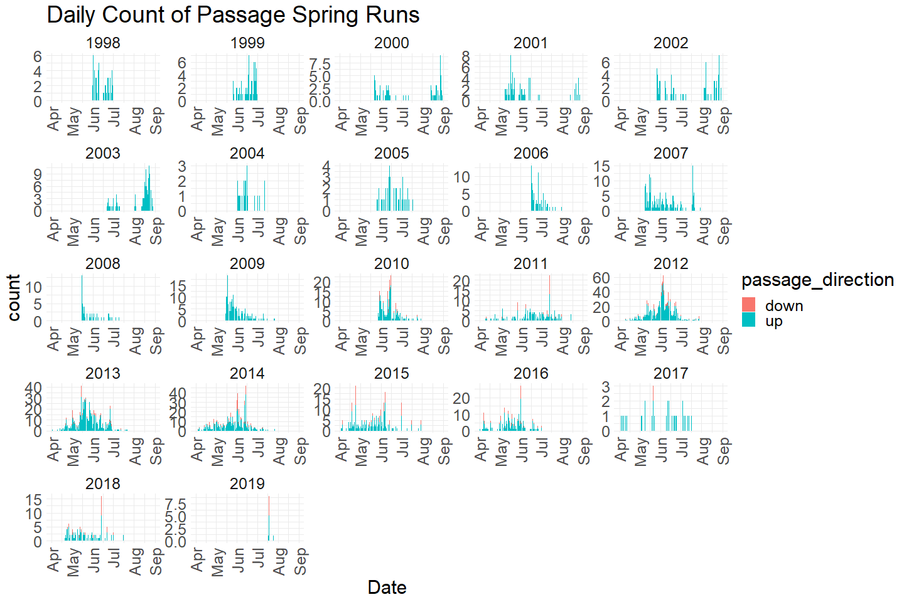
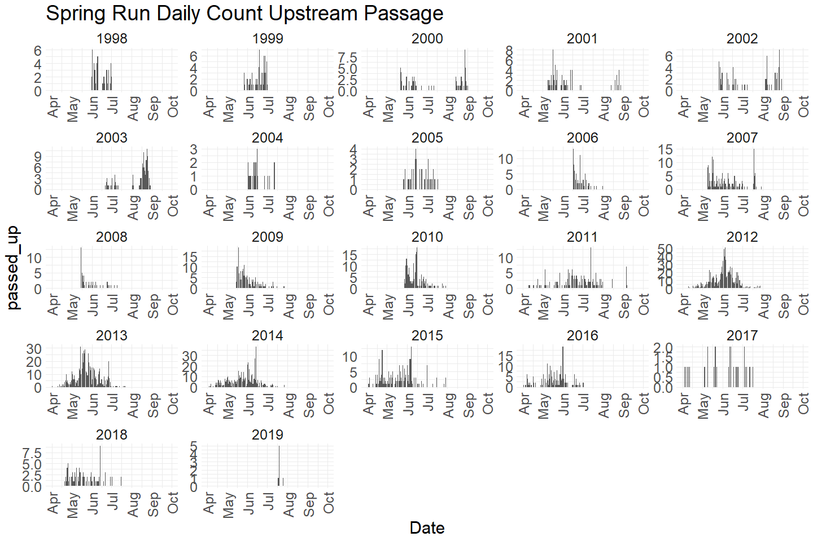
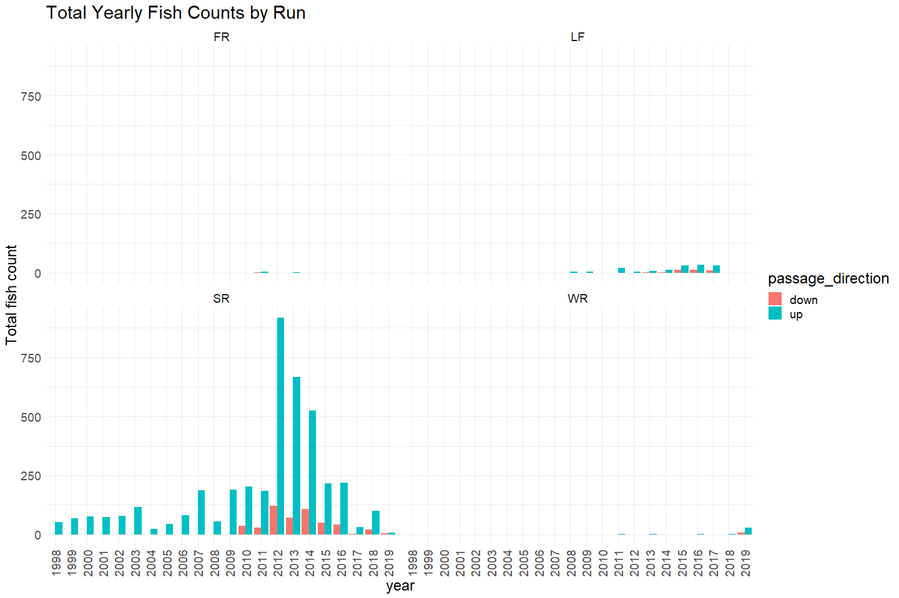
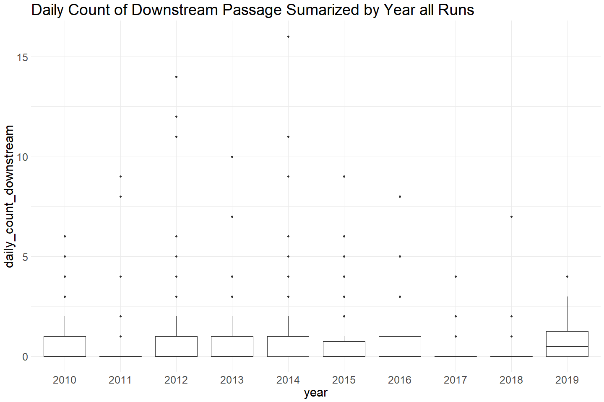
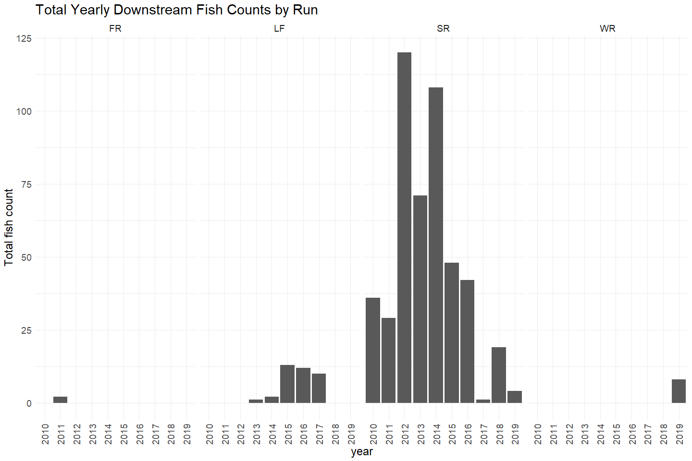
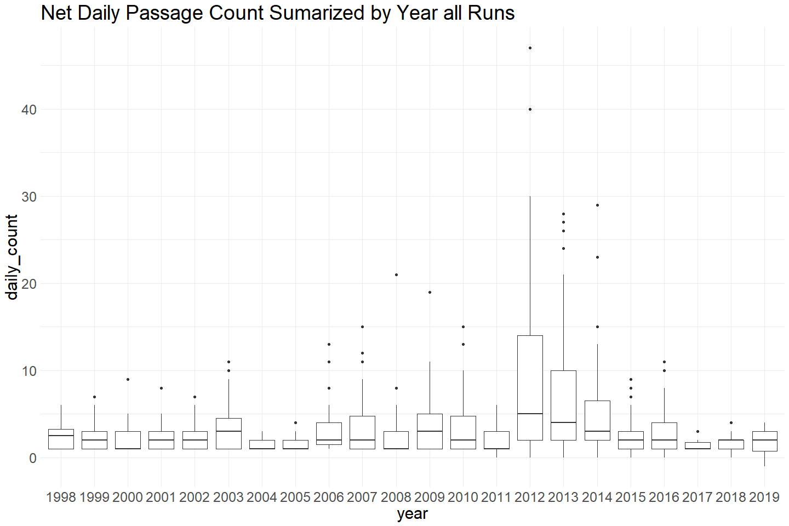
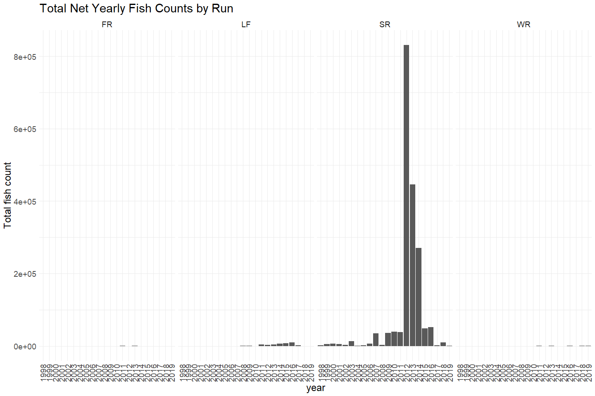

Battle Creek Upstream Passage Monitoring Video Data QC
================
Erin Cain
9/29/2021

# Battle Creek Upstream Passage Monitoring Video Data

## Description of Monitoring Data

These data were collected to capture the number of fish that pass the
barrier weir at Coleman National Fish Hatchery from 1998 to 2019.
Observations were captured via video footage of passing fish. For video
data, prior to 2008, fish were viewed via a funnel video setup on the
fish ladder. In 2008 the video system was an instream system with
viewing via an open section of stream. Beginning in 2009 to the present,
fish are viewed via a crowder video setup as they pass through the fish
ladder.

**Timeframe:** 1998 - 2012

**Video Season:** Video is run all year.

**Completeness of Record throughout timeframe:** Data for every year in
timeframe.

**Sampling Location:** Battle Creek fish ladder.

**Data Contact:** [Natasha Wingerter](mailto:natasha_wingerter@fws.gov)

Any additional info?

## Access Cloud Data

``` r
# Run Sys.setenv() to specify GCS_AUTH_FILE and GCS_DEFAULT_BUCKET before running 
getwd() #to see how to specify paths 
# Open object from google cloud storage
# Set your authentication using gcs_auth
gcs_auth(json_file = Sys.getenv("GCS_AUTH_FILE"))
# Set global bucket 
gcs_global_bucket(bucket = Sys.getenv("GCS_DEFAULT_BUCKET"))

gcs_list_objects()
# git data and save as xlsx
gcs_get_object(object_name = 
                 "adult-upstream-passage-monitoring/battle-creek/data-raw/battle_creek_upstream_passage_datas.xlsx",
               bucket = gcs_get_global_bucket(),
               saveToDisk = "raw_battle_creek_passage_data.xlsx",
               overwrite = TRUE)
```

Read in data from google cloud, glimpse raw data and domain description
sheet:

``` r
# read in data to clean 
sheets <- readxl::excel_sheets("raw_battle_creek_passage_data.xlsx")
sheets
```

    ## [1] "Notes and Metadata"         "Video"                     
    ## [3] "Trap and Spawning Building" "Upstream Passage Estimates"

``` r
raw_video_data <- read_excel("raw_battle_creek_passage_data.xlsx", sheet = "Video")
```

## Data transformations

``` r
cleaner_video_data <- raw_video_data %>% 
  janitor::clean_names() %>% 
  filter(species == "Chinook Salmon (CHN)") %>%
  rename("run" = run_call,
         "adipose" = adipose_fin, 
         "date" = sample_date,
         "time" = time_passed) %>%
  mutate(date = as.Date(date),
         time = hms::as_hms(time)) %>%
  select(-project, -species, # all species = chn, all project = video 
         -notes) %>% # all notes = NA
  glimpse()
```

    ## Rows: 4,775
    ## Columns: 8
    ## $ date        <date> 1998-06-01, 1998-06-01, 1998-06-02, 1998-06-02, 1998-06-0~
    ## $ time        <time> NA, NA, NA, NA, NA, NA, NA, NA, NA, NA, NA, NA, NA, NA, N~
    ## $ passed_up   <dbl> 1, 1, 5, 1, 2, 2, 2, 1, 2, 1, 1, 0, 2, 2, 2, 3, 1, 1, 1, 1~
    ## $ passed_down <dbl> 0, 0, 0, 0, 0, 0, 0, 0, 0, 0, 0, 0, 0, 0, 0, 0, 0, 0, 0, 0~
    ## $ net_total   <dbl> 1, 1, 5, 1, 2, 2, 2, 1, 2, 1, 1, 0, 2, 2, 2, 3, 1, 1, 1, 1~
    ## $ adipose     <chr> "Present", "Unknown", "Present", "Absent", "Present", "Unk~
    ## $ comments    <chr> NA, NA, NA, NA, NA, NA, NA, NA, NA, NA, NA, NA, NA, NA, NA~
    ## $ run         <chr> "SR", "SR", "SR", "SR", "SR", "SR", "SR", "SR", "SR", "SR"~

``` r
unique(cleaner_video_data$notes)
```

    ## NULL

## Explore Numeric Variables:

``` r
cleaner_video_data %>% select_if(is.numeric) %>% colnames()
```

    ## [1] "passed_up"   "passed_down" "net_total"

### Variable: `passed_up`

**Plotting Passage Counts Moving Up over Period of Record**

``` r
cleaner_video_data %>% 
  mutate(year = as.factor(year(date)),
         fake_year = if_else(month(date) %in% 10:12, 1900, 1901),
         fake_date = as.Date(paste0(fake_year,"-", month(date), "-", day(date)))) %>%
  ggplot(aes(x = fake_date, y = passed_up)) + 
  geom_col() + 
  facet_wrap(~year(date), scales = "free") + 
  scale_x_date(labels = date_format("%b"), limits = c(as.Date("1901-04-01"), as.Date("1901-09-01")), date_breaks = "1 month") + 
  theme_minimal() + 
  theme(text = element_text(size = 23),
        axis.text.x = element_text(angle = 90, vjust = 0.5, hjust=1)) + 
  labs(title = "Daily Count of Upstream Passage All Runs", 
       x = "Date")  
```

<!-- -->

``` r
cleaner_video_data %>% 
  filter(run == "SR") %>%
  mutate(year = as.factor(year(date)),
         fake_year = if_else(month(date) %in% 10:12, 1900, 1901),
         fake_date = as.Date(paste0(fake_year,"-", month(date), "-", day(date)))) %>%
  ggplot(aes(x = fake_date, y = passed_up)) + 
  geom_col() + 
  facet_wrap(~year(date), scales = "free") + 
  scale_x_date(labels = date_format("%b"), limits = c(as.Date("1901-04-01"), as.Date("1901-10-01")), date_breaks = "1 month") + 
  theme_minimal() + 
  theme(text = element_text(size = 23),
        axis.text.x = element_text(angle = 90, vjust = 0.5, hjust=1)) + 
  labs(title = "Spring Run Daily Count Upstream Passage", 
       x = "Date")  
```

<!-- -->

Spring Run Chinook appear to be seen moving upstream April through
September.

``` r
# Boxplots of daily counts by year
cleaner_video_data %>% group_by(date) %>%
  mutate(daily_count_upstream = sum(passed_up)) %>%
  mutate(year = as.factor(year(date))) %>% 
  ungroup() %>%
  ggplot(aes(x = year, y = daily_count_upstream)) + 
  geom_boxplot() + 
  theme_minimal() +
  theme(text = element_text(size = 23)) + 
  labs(title = "Daily Count of Upstream Passage Sumarized by Year All Runs") 
```

<!-- -->

``` r
cleaner_video_data  %>%
  mutate(year = as.factor(year(date))) %>%
  filter(run %in% c("FR", "LF", "SR", "WR")) %>% # Filter to only show runs that have more than one data point and are not NA/Unknown
  ggplot(aes(x = year, y = passed_up)) + 
  geom_col() + 
  theme_minimal() +
  labs(title = "Total Yearly Fish Counts by Run",
       y = "Total fish count") + 
  theme(text = element_text(size = 18),
        axis.text.x = element_text(angle = 90, vjust = 0.5, hjust=1)) + 
  facet_grid(~run)
```

<!-- -->

**Numeric Summary of Passage Counts Moving Up over Period of Record**

``` r
# Table with summary statistics
summary(cleaner_video_data$passed_up)
```

    ##    Min. 1st Qu.  Median    Mean 3rd Qu.    Max. 
    ##  0.0000  1.0000  1.0000  0.9037  1.0000  7.0000

``` r
# daily numeric summary 
cleaner_video_data %>% group_by(date) %>%
  summarise(count = sum(passed_up, na.rm = T)) %>%
  pull(count) %>%
  summary()
```

    ##    Min. 1st Qu.  Median    Mean 3rd Qu.    Max. 
    ##   0.000   1.000   2.000   4.141   5.000  51.000

**NA and Unknown Values**

-   0 % of values in the `passed_up` column are NA. However, there are
    clearly gaps in data. More investigation needs to be done to see if
    0 is a real 0 or if it can be explained by other factors (outages).

### Variable: `down`

Downstream count data begins in 2010.

**Plotting Passage Counts Moving Down over Period of Record**

``` r
cleaner_video_data %>% 
  filter(year(date) > 2009) %>% # filter to years greater than 2009 because no downstream passage counted pre 2009 
  mutate(year = as.factor(year(date)),
         fake_year = if_else(month(date) %in% 10:12, 1900, 1901),
         fake_date = as.Date(paste0(fake_year,"-", month(date), "-", day(date)))) %>%
  ggplot(aes(x = fake_date, y = passed_down)) + 
  geom_col() + 
  facet_wrap(~year(date), scales = "free") + 
  scale_x_date(labels = date_format("%b"), limits = c(as.Date("1901-04-01"), as.Date("1901-09-01")), date_breaks = "1 month") +  
  theme_minimal() + 
  theme(text = element_text(size = 23),
        axis.text.x = element_text(angle = 90, vjust = 0.5, hjust=1)) + 
  labs(title = "Daily Count of Downstream Passage all Runs", 
       x = "Date")  
```

<!-- -->

``` r
cleaner_video_data %>% 
  filter(run == "SR", year(date) > 2009) %>% # filter to years greater than 2009 because no downstream passage counted pre 2009 
  mutate(year = as.factor(year(date)),
         fake_year = if_else(month(date) %in% 10:12, 1900, 1901),
         fake_date = as.Date(paste0(fake_year,"-", month(date), "-", day(date)))) %>%
  ggplot(aes(x = fake_date, y = passed_down)) +  
  geom_col() + 
  facet_wrap(~year(date), scales = "free") + 
  scale_x_date(labels = date_format("%b"), limits = c(as.Date("1901-04-01"), as.Date("1901-09-01")), date_breaks = "1 month") + 
  theme_minimal() + 
  theme(text = element_text(size = 23),
        axis.text.x = element_text(angle = 90, vjust = 0.5, hjust=1)) + 
  labs(title = "Spring Run Daily Count Downstream Passage", 
       x = "Date")  
```

<!-- -->

Spring Run Chinook appear to be seen moving downstream April through
august.

``` r
cleaner_video_data %>% 
  filter(year(date) > 2009) %>%
  group_by(date) %>%
  summarise(daily_count_downstream = sum(passed_down)) %>%
  mutate(year = as.factor(year(date))) %>% 
  ggplot(aes(x = year, y = daily_count_downstream)) + 
  geom_boxplot() + 
  theme_minimal() +
  labs(title = "Daily Count of Downstream Passage Sumarized by Year all Runs") + 
  theme(text = element_text(size = 23)) 
```

<!-- -->

``` r
cleaner_video_data  %>%
  filter(year(date) > 2009) %>%
  mutate(year = as.factor(year(date))) %>%
  filter(run %in% c("FR", "LF", "SR", "WR")) %>%
  ggplot(aes(x = year, y = passed_down)) + 
  geom_col() + 
  theme_minimal() +
  labs(title = "Total Yearly Fish Counts by Run",
       y = "Total fish count") + 
  theme(text = element_text(size = 18),
        axis.text.x = element_text(angle = 90, vjust = 0.5, hjust=1)) + 
  facet_grid(~run)
```

<!-- -->

**Numeric Summary of Passage Counts Moving Down over Period of Record**

``` r
# Table with summary statistics 
summary(cleaner_video_data$passed_down)
```

    ##    Min. 1st Qu.  Median    Mean 3rd Qu.    Max. 
    ##  0.0000  0.0000  0.0000  0.1102  0.0000  1.0000

``` r
# Daily numeric summary of passage data
cleaner_video_data %>% group_by(date) %>%
  summarise(count = sum(passed_down, na.rm = T)) %>%
  pull(count) %>%
  summary()
```

    ##    Min. 1st Qu.  Median    Mean 3rd Qu.    Max. 
    ##  0.0000  0.0000  0.0000  0.5048  0.0000 16.0000

**NA and Unknown Values**

-   0 % of values in the `passed_down` column are NA.

### Variable: `net_total`

**Plotting Net Total Passage Counts over Period of Record**

``` r
cleaner_video_data %>% 
  filter(run == "SR") %>%
  mutate(year = as.factor(year(date)),
         fake_year = if_else(month(date) %in% 10:12, 1900, 1901),
         fake_date = as.Date(paste0(fake_year,"-", month(date), "-", day(date)))) %>%
  ggplot(aes(x = fake_date, y = net_total)) + 
  geom_col() + 
  facet_wrap(~year(date), scales = "free") + 
  scale_x_date(labels = date_format("%b"), limits = c(as.Date("1901-04-01"), as.Date("1901-09-01")), date_breaks = "1 month") + 
  theme_minimal() + 
  theme(text = element_text(size = 23),
        axis.text.x = element_text(angle = 90, vjust = 0.5, hjust=1)) + 
  labs(title = "Daily Net Total Passage count all Runs", 
       x = "Date")  
```

<!-- -->

``` r
cleaner_video_data %>% group_by(date) %>%
  summarise(daily_count = sum(net_total)) %>%
  mutate(year = as.factor(year(date))) %>% 
  ggplot(aes(x = year, y = daily_count)) + 
  geom_boxplot() + 
  theme_minimal() +
  labs(title = "Net Daily Passage Count Sumarized by Year all Runs") + 
  theme(text = element_text(size = 23)) 
```

<!-- -->

``` r
cleaner_video_data  %>%
  mutate(year = as.factor(year(date))) %>%
  filter(run %in% c("LF", "SR", "WR", "FR")) %>%
  group_by(year(date)) %>%
  mutate(total_catch = sum(net_total)) %>%
  ungroup() %>%
  ggplot(aes(x = year, y = total_catch)) + 
  geom_col() + 
  theme_minimal() +
  labs(title = "Total Net Yearly Fish Counts by Run",
       y = "Total fish count") + 
  theme(text = element_text(size = 18),
        axis.text.x = element_text(angle = 90, vjust = 0.5, hjust=1)) + 
  facet_grid(~run)
```

<!-- -->
Most of the data is on Spring Run chinook.

**Numeric Summary of Total Counts over Period of Record**

``` r
# Table with summary statistics 
summary(cleaner_video_data$net_total)
```

    ##    Min. 1st Qu.  Median    Mean 3rd Qu.    Max. 
    ## -1.0000  1.0000  1.0000  0.7935  1.0000  7.0000

``` r
# Daily numeric summary of passage data
cleaner_video_data %>% group_by(date) %>%
  summarise(count = sum(net_total, na.rm = T)) %>%
  pull(count) %>%
  summary()
```

    ##    Min. 1st Qu.  Median    Mean 3rd Qu.    Max. 
    ##  -1.000   1.000   2.000   3.636   4.000  47.000

**NA and Unknown Values**

-   0 % of values in the `net_total` column are NA.

## Explore Categorical variables:

``` r
cleaner_video_data %>% select_if(is.character) %>% colnames()
```

    ## [1] "adipose"  "comments" "run"

### Variable: `adipose`

``` r
table(cleaner_video_data$adipose) 
```

    ## 
    ##  Absent present Present Unknown 
    ##     812       1    3904      58

Fix inconsistencies with spelling, capitalization, and abbreviations.

``` r
# Fix yes/no/unknown
cleaner_video_data$adipose = tolower(cleaner_video_data$adipose)
table(cleaner_video_data$adipose) 
```

    ## 
    ##  absent present unknown 
    ##     812    3905      58

**NA or Unknown Values**

-   0 % of values in the `adipose` column are NA.
-   1.2 % of values in the `adipose` column are`unknown`.

### Variable: `run`

``` r
table(cleaner_video_data$run) 
```

    ## 
    ##   FR   LF   SR  UNK   WR 
    ##    6  181 4520   29   39

``` r
# description <- domain_description[which(domain_description$Domain == "Run"), ]$Description
```

Fix inconsistencies with spelling, capitalization, and abbreviations.

``` r
# Fix yes/no/unknown
cleaner_video_data$run = if_else(cleaner_video_data$run == "UNK", "unknown", cleaner_video_data$run)
```

**NA or Unknown Values**

-   0 % of values in the `run` column are NA.
-   0.6 % of values in the `run` column are`unknown`.

### Variable: `comments`

10 unique comments are shown bellow. Comments are only present on 12% of
the data.

``` r
unique(cleaner_video_data$comments)[1:10]
```

    ##  [1] NA                                                                                                                 
    ##  [2] "VERY FUNGUSED"                                                                                                    
    ##  [3] "Made this one UNK couldn’t find record of which was which"                                                        
    ##  [4] "Archived on end of tape"                                                                                          
    ##  [5] "Out of order on tape"                                                                                             
    ##  [6] "Labeled as a RBT on Datasheet"                                                                                    
    ##  [7] "Enters trap on 6/29, but passes on 6/30"                                                                          
    ##  [8] "Not on archive tape"                                                                                              
    ##  [9] "RJ Bottaro found this during 2007 training."                                                                      
    ## [10] "Jess Newton added this CHN to data base on 1/8/07.  It was on the origianl Archive DVD but not in this data base."

**NA and Unknown Values**

-   88 % of values in the `comments` column are NA.

## Summary of identified issues

-   No info on viewing condition/outages/gaps in sampling

## Save cleaned data back to google cloud

``` r
battle_passage_video <- cleaner_video_data %>% 
  glimpse()
```

    ## Rows: 4,775
    ## Columns: 8
    ## $ date        <date> 1998-06-01, 1998-06-01, 1998-06-02, 1998-06-02, 1998-06-0~
    ## $ time        <time> NA, NA, NA, NA, NA, NA, NA, NA, NA, NA, NA, NA, NA, NA, N~
    ## $ passed_up   <dbl> 1, 1, 5, 1, 2, 2, 2, 1, 2, 1, 1, 0, 2, 2, 2, 3, 1, 1, 1, 1~
    ## $ passed_down <dbl> 0, 0, 0, 0, 0, 0, 0, 0, 0, 0, 0, 0, 0, 0, 0, 0, 0, 0, 0, 0~
    ## $ net_total   <dbl> 1, 1, 5, 1, 2, 2, 2, 1, 2, 1, 1, 0, 2, 2, 2, 3, 1, 1, 1, 1~
    ## $ adipose     <chr> "present", "unknown", "present", "absent", "present", "unk~
    ## $ comments    <chr> NA, NA, NA, NA, NA, NA, NA, NA, NA, NA, NA, NA, NA, NA, NA~
    ## $ run         <chr> "SR", "SR", "SR", "SR", "SR", "SR", "SR", "SR", "SR", "SR"~

``` r
f <- function(input, output) write_csv(input, file = output)

gcs_upload(battle_passage_video,
           object_function = f,
           type = "csv",
           name = "adult-upstream-passage-monitoring/battle-creek/data/battle_passage_video.csv")
```
