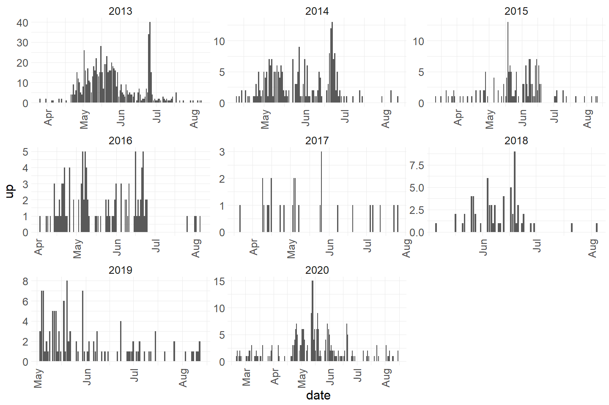
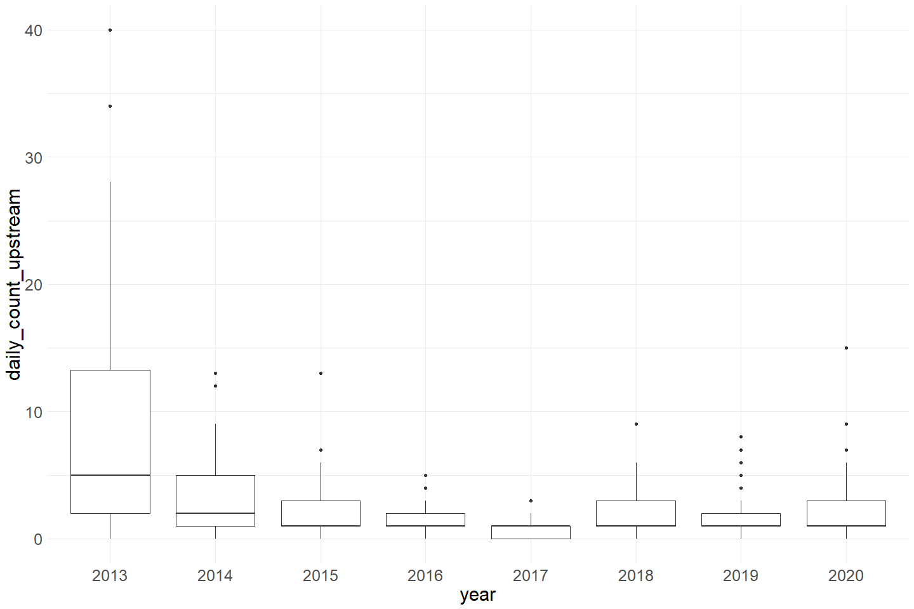

Clear Creek Adult Upstream Video Data QC Checklist
================
Erin Cain
9/29/2021

## Clear Creek Adult Upstream Video Data

Read in data from google cloud, glimpse raw data and domain description
sheet:

``` r
# read in data to clean 
sheets <- readxl::excel_sheets("test-data.xlsx")
domain_description <- readxl::read_excel("test-data.xlsx", sheet = "Domain Description") 
domain_description %>% head(10)
```

    ## # A tibble: 10 x 2
    ##    Domain            Description                                                
    ##    <chr>             <chr>                                                      
    ##  1 DATE              "XX/XX/XXXX Date of the day watched, (neccessary for when ~
    ##  2 TIME BLOCK START  "Use military time-Top of the hour or half hour through 29~
    ##  3 VIEWING CONDITION "Viewing Conditions: 0=Normal (good visibility, clear wate~
    ##  4 SPECIES           "Choose from drop down list. If nothing passed in the half~
    ##  5 UP                "Total passing up and down of the white plate. Use individ~
    ##  6 DOWN               <NA>                                                      
    ##  7 TIME              "HH:MM:SS. Use specific time for all Salmon, Steelhead/tro~
    ##  8 ADIPOSE           "Salmon and trout only. Partial clipped adipose fins are c~
    ##  9 SEX               "Salmon and trout only."                                   
    ## 10 JACKSIZE          "Salmon only (Fork Length less than 22\"). Total width of ~

``` r
raw_video_data <- readxl::read_excel("test-data.xlsx", sheet = "ClearCreekVideoWeir_AdultRecrui") %>% glimpse()
```

    ## Rows: 99,996
    ## Columns: 14
    ## $ Video_Year         <dbl> 13, 13, 13, 13, 13, 13, 13, 13, 13, 13, 13, 13, 13,~
    ## $ Date               <dttm> 2012-12-17, 2012-12-17, 2012-12-17, 2012-12-17, 20~
    ## $ Time_Block         <dttm> 1899-12-31 10:30:00, 1899-12-31 11:00:00, 1899-12-~
    ## $ Viewing_Condition  <dbl> 1, 1, 1, 1, 1, 1, 1, 1, 1, 1, 1, 1, 1, 1, 1, 1, 1, ~
    ## $ Species            <chr> "NONE", "NONE", "NONE", "NONE", "NONE", "NONE", "CH~
    ## $ Up                 <dbl> 0, 0, 0, 0, 0, 0, 1, 1, 0, 1, 0, 1, 1, 0, 0, 0, 1, ~
    ## $ Down               <dbl> 0, 0, 0, 0, 0, 0, 0, 0, 0, 0, 0, 0, 0, 0, 1, 0, 0, ~
    ## $ Time_Passed        <chr> NA, NA, NA, NA, NA, NA, "0.57361111111111118", "0.6~
    ## $ Adipose            <chr> NA, NA, NA, NA, NA, NA, "PRESENT", "PRESENT", NA, "~
    ## $ Sex                <chr> NA, NA, NA, NA, NA, NA, "MALE", "UNK", NA, "UNK", N~
    ## $ Spawning_Condition <dbl> NA, NA, NA, NA, NA, NA, 3, 3, NA, 3, NA, 3, 3, NA, ~
    ## $ Jack_Size          <chr> NA, NA, NA, NA, NA, NA, "NO", "NO", NA, "UNK", NA, ~
    ## $ Run                <chr> NA, NA, NA, NA, NA, NA, "LF", "LF", NA, NA, NA, NA,~
    ## $ STT_Size           <chr> NA, NA, NA, NA, NA, NA, NA, NA, NA, ">16", NA, ">16~

## Checklist

-   Update column names to snake case/remove any funky spacing
-   Check column types to ensure all data is stored as desired:
    -   Numerical data - `<dbl>` or `<int>`
    -   Character data - `<str>` or `<chr>`
    -   Date - <datetime> or `<date>` or `<time>`
-   remove any redundant columns

``` r
cleaner_video_data <- raw_video_data %>% 
  set_names(tolower(colnames(raw_video_data))) %>%
  mutate(date = as.Date(date),
         time_block = hms::as_hms(time_block)) %>% # TODO fix time_passed 
  filter(species == "CHN", run == "SR") %>%
  select(-stt_size) %>% 
  glimpse() 
```

    ## Rows: 2,279
    ## Columns: 13
    ## $ video_year         <dbl> 13, 13, 13, 13, 13, 13, 13, 13, 13, 13, 13, 13, 13,~
    ## $ date               <date> 2013-03-26, 2013-03-26, 2013-03-31, 2013-03-31, 20~
    ## $ time_block         <time> 04:30:00, 22:30:00, 16:00:00, 21:30:00, 11:30:00, ~
    ## $ viewing_condition  <dbl> 0, 0, 0, 0, 0, 1, 1, 1, 1, 0, 0, 0, 0, 0, 0, 0, 0, ~
    ## $ species            <chr> "CHN", "CHN", "CHN", "CHN", "CHN", "CHN", "CHN", "C~
    ## $ up                 <dbl> 1, 1, 1, 1, 1, 1, 0, 1, 1, 1, 1, 1, 1, 1, 1, 1, 1, ~
    ## $ down               <dbl> 0, 0, 0, 0, 0, 0, 1, 0, 0, 0, 0, 0, 0, 0, 0, 0, 0, ~
    ## $ time_passed        <chr> "0.19930555555555554", "0.95000000000000007", "0.67~
    ## $ adipose            <chr> "UNK", "UNK", "UNK", "UNK", "UNK", "UNK", "ABSENT",~
    ## $ sex                <chr> "UNK", "UNK", "UNK", "UNK", "UNK", "UNK", "UNK", "U~
    ## $ spawning_condition <dbl> 1, 1, 1, 1, 1, 1, 1, 1, 1, 1, 1, 1, 1, 1, 1, 1, 1, ~
    ## $ jack_size          <chr> "YES", "NO", "NO", "NO", "NO", "NO", "NO", "YES", "~
    ## $ run                <chr> "SR", "SR", "SR", "SR", "SR", "SR", "SR", "SR", "SR~

-   Transform into tidy format, check that:
    -   Each variable has its own column
    -   Each observation has its own row
    -   Each value has its own cell

``` r
# Each variable has its own column, each observation has its own row (an observation is count in time period), and each value has its own cell 
```

Visualize Data to quickly determine if it looks reasonable:

-   Plot numerical values
-   table on categorical columns

### Plots visualizing numeric variables:

#### `up`

``` r
cleaner_video_data %>% ggplot(aes(x = date, y = up)) + 
  geom_col() + 
  facet_wrap(~year(date), scales = "free_x") + 
  scale_x_date(labels = date_format("%b"), date_breaks = "1 month") + 
  theme_minimal() + 
  theme(axis.text.x = element_text(angle = 90, vjust = 0.5, hjust=1))
```

<!-- -->

-   check for missing values, convert -9999 or other placeholders to NA
    -   summarize quantity of missing values to determine quality and
        completeness of data

We know from the plot above that there are no -9999 values

0 % of values in the `up` column are NA.

#### `down`

``` r
cleaner_video_data %>% ggplot(aes(x = date, y = down)) + 
  geom_col() + 
  facet_wrap(~year(date), scales = "free_x") + 
  scale_x_date(labels = date_format("%b"), date_breaks = "1 month") + 
  theme_minimal() + 
  theme(axis.text.x = element_text(angle = 90, vjust = 0.5, hjust=1))
```

<!-- -->

-   check for missing values, convert -9999 or other placeholders to NA
    -   summarize quantity of missing values to determine quality and
        completeness of data

We know from the plot above that there are no -9999 values

0 % of values in the `up` column are NA.

### Tables describing categorical variables:

#### `viewing_condition`

``` r
table(cleaner_video_data$viewing_condition)
```

    ## 
    ##    0    1    2 
    ## 1596  661   22

``` r
domain_description[which(domain_description$Domain == "VIEWING CONDITION"), ]$Description
```

    ## [1] "Viewing Conditions: 0=Normal (good visibility, clear water, all equipment working, no obstructions); 1= Readable but confidence lower due to turbidity or partial loss of video equipment, obstructions (note specifics in comments); 2=Not readable due to turbidity or equipment failure; 3= Weir is flooded (note if footage is readable or note in comments)"

-   check for missing values, convert -9999 or other placeholders to NA
    -   summarize quantity of missing values to determine quality and
        completeness of data

0 % of values in the `viewing_condition` column are NA.

-   Within a categorical column check that capitalization is consistent
-   Within a categorical column check that values are consistent, no
    typos

``` r
# Looks fine
```

#### `adipose`

``` r
table(cleaner_video_data$adipose)
```

    ## 
    ##  Absent  ABSENT PRESENT     UNK UNKNOWN 
    ##       1     195    1018     845     219

``` r
domain_description[which(domain_description$Domain == "ADIPOSE"), ]$Description
```

    ## [1] "Salmon and trout only. Partial clipped adipose fins are considered absent."

-   check for missing values, convert -9999 or other placeholders to NA
    -   summarize quantity of missing values to determine quality and
        completeness of data

0 % of values in the `viewing_condition` column are NA.

-   Within a categorical column check that capitalization is consistent
-   Within a categorical column check that values are consistent, no
    typos

``` r
cleaner_video_data <- cleaner_video_data %>% 
  mutate(adipose = tolower(adipose)) 
```

#### `sex`

``` r
table(cleaner_video_data$sex)
```

    ## 
    ##  FEMALE    Male    MALE     UNK UNKNOWN 
    ##      59       1     104    1648     464

``` r
domain_description[which(domain_description$Domain == "SEX"), ]$Description
```

    ## [1] "Salmon and trout only."

-   check for missing values, convert -9999 or other placeholders to NA
    -   summarize quantity of missing values to determine quality and
        completeness of data

0.001 % of values in the `viewing_condition` column are NA.

-   Within a categorical column check that capitalization is consistent
-   Within a categorical column check that values are consistent, no
    typos

``` r
cleaner_video_data <- cleaner_video_data %>% 
  mutate(sex = tolower(if_else(sex == "UNK", "UNKNOWN", sex))) 
```

#### `spawning_condition`

``` r
table(cleaner_video_data$spawning_condition)
```

    ## 
    ##    1    2    3    4    5 
    ## 1879   73   95   29  144

``` r
domain_description[which(domain_description$Domain == "SPAWNING CONDITION"), ]$Description
```

    ## [1] "1: Energetic; bright or silvery; no spawning coloration or developed secondary sex characteristics. 2: Energetic, can tell sex from secondary characteristics (kype) silvery or bright coloration but may have some hint of spawning colors. 3: Spawning colors, defined kype, some tail wear or small amounts of fungus. 4: Fungus, lethargic, wandering; “ Zombie fish”. Significant tail wear in females to indicate the spawning process has already occurred. Unknown:  Unable to make distinction; please leave comments if selecting unknown."

-   check for missing values, convert -9999 or other placeholders to NA
    -   summarize quantity of missing values to determine quality and
        completeness of data

0.026 % of values in the `viewing_condition` column are NA.

-   Within a categorical column check that capitalization is consistent
-   Within a categorical column check that values are consistent, no
    typos

``` r
# Looks good
```

#### `jack_size`

``` r
table(cleaner_video_data$jack_size)
```

    ## 
    ##   NO  UNK  Yes  YES 
    ## 1958   21    1  283

``` r
domain_description[which(domain_description$Domain == "JACKSIZE"), ]$Description
```

    ## [1] "Salmon only (Fork Length less than 22\"). Total width of Jack plate is 22\"."

-   check for missing values, convert -9999 or other placeholders to NA
    -   summarize quantity of missing values to determine quality and
        completeness of data

0.007 % of values in the `viewing_condition` column are NA.

-   Within a categorical column check that capitalization is consistent
    (ex: if a column describes methodology and has “Snorkel” and
    “snorkel” listed as options fix to make all into snake case
    “snorkel”)
-   Within a categorical column check that values are consistent, no
    typos

``` r
cleaner_video_data <- cleaner_video_data %>% 
  mutate(jack_size = tolower(if_else(jack_size == "UNK", "UNKNOWN", jack_size))) 
```

### Checklist cont.

-   Check for location information for every station (latitude and
    longitude for every sampling location

*TODO* Need to inquire for location of video monitoring station

### Save cleaned data back to google cloud

TODO
