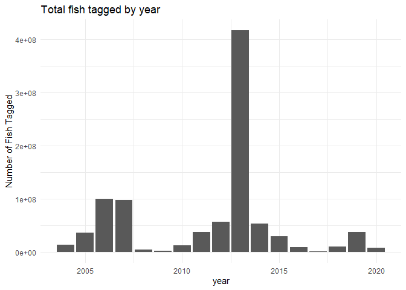
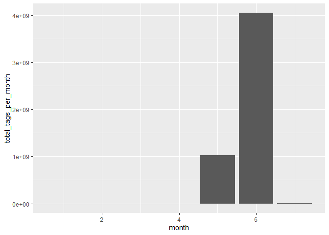

Feather River Hallprint Data QC
================
Erin Cain
9/29/2021

# Feather River hallprint adult broodstock selection and enumeration data

## Description of Monitoring Data

Hallprint tagging data only describes fish marked, giving hallprint tag
numbers and dates tagged for each fish. It does not include any other
sampling of fish like size or genetics. The data that we have does not
contain any additional information about fish returns. We currently have
one file describing fish returns. We can likely acquire more but there
are issues with the return data.

**Timeframe:** 2004 - 2020

**Season:** Tagging typically begins in April and goes through June

**Provisional or QC data** Data is QC

**Sampling Location:** Some tags have a acoustic location attribute. All
fish are tagged on the Feather River.

**Data Contact:** [Byron Mache](mailto:Byron.Mache@water.ca.gov)

Note fron Byron: Each fish is given two tags. The `second_tag_number` is
NA if the first tag and the second tag have the same number.

## Access Cloud Data

``` r
# Run Sys.setenv() to specify GCS_AUTH_FILE and GCS_DEFAULT_BUCKET before running 
# getwd() to see how to specify paths 
# Open object from google cloud storage
# Set your authentication using gcs_auth
gcs_auth(json_file = Sys.getenv("GCS_AUTH_FILE"))
# Set global bucket 
gcs_global_bucket(bucket = Sys.getenv("GCS_DEFAULT_BUCKET"))

# git data and save as xlsx
gcs_get_object(object_name = 
                 "adult-upstream-passage-monitoring/feather-river/hallprint/data-raw/all_hallprints_all_years.xlsx",
               bucket = gcs_get_global_bucket(),
               saveToDisk = "raw_feather_hallprint_data.xlsx",
               overwrite = TRUE)
```

Read in data from google cloud, glimpse raw data and domain description
sheet:

``` r
# read in data to clean 
raw_hallprint_data <- read_excel("raw_feather_hallprint_data.xlsx", 
                                 col_types = c("text", "date", "text",
                                               "text", "text", "text",
                                               "text")) %>% glimpse()
```

    ## Rows: 98,935
    ## Columns: 7
    ## $ ID                  <chr> "98802", "98803", "98804", "98805", "98806", "9880~
    ## $ Date                <dttm> 2020-05-06, 2020-05-06, 2020-05-06, 2020-05-06, 2~
    ## $ `Tag#`              <chr> "25703", "25704", "25705", "25707", "25708", "2570~
    ## $ `2ndTag#`           <chr> NA, NA, NA, NA, NA, NA, NA, NA, NA, NA, NA, NA, NA~
    ## $ Color               <chr> "G", "G", "G", "G", "G", "G", "G", "G", "G", "G", ~
    ## $ Acoustic            <chr> NA, NA, NA, NA, NA, NA, NA, NA, NA, NA, NA, NA, NA~
    ## $ `Acoustic Location` <chr> NA, NA, NA, NA, NA, NA, NA, NA, NA, NA, NA, NA, NA~

## Data transformations

``` r
cleaner_hallprint_data <- raw_hallprint_data %>% 
  rename("date" = Date, "tag_number" = `Tag#`, "second_tag_number" = `2ndTag#`, 
         "color" = Color, "acoustic" = Acoustic, 
         "acoustic_location" = `Acoustic Location`) %>%
  mutate(date = as.Date(date)) %>%
  glimpse() 
```

    ## Rows: 98,935
    ## Columns: 7
    ## $ ID                <chr> "98802", "98803", "98804", "98805", "98806", "98807"~
    ## $ date              <date> 2020-05-06, 2020-05-06, 2020-05-06, 2020-05-06, 202~
    ## $ tag_number        <chr> "25703", "25704", "25705", "25707", "25708", "25709"~
    ## $ second_tag_number <chr> NA, NA, NA, NA, NA, NA, NA, NA, NA, NA, NA, NA, NA, ~
    ## $ color             <chr> "G", "G", "G", "G", "G", "G", "G", "G", "G", "G", "G~
    ## $ acoustic          <chr> NA, NA, NA, NA, NA, NA, NA, NA, NA, NA, NA, NA, NA, ~
    ## $ acoustic_location <chr> NA, NA, NA, NA, NA, NA, NA, NA, NA, NA, NA, NA, NA, ~

## Explore Numeric Variables:

No numeric variables.

``` r
# Filter clean data to show only numeric variables 
cleaner_hallprint_data %>% select_if(is.numeric) %>% colnames()
```

    ## character(0)

## Explore Categorical variables:

``` r
# Filter clean data to show only categorical variables
cleaner_hallprint_data %>% select_if(is.character) %>% colnames()
```

    ## [1] "ID"                "tag_number"        "second_tag_number"
    ## [4] "color"             "acoustic"          "acoustic_location"

### Variable: `ID`

All IDs are unique as anticipated:

``` r
length(unique(cleaner_hallprint_data$ID)) == nrow(cleaner_hallprint_data)
```

    ## [1] TRUE

**NA and Unknown Values**

``` r
cleaner_hallprint_data %>% filter(is.na(ID))
```

    ## # A tibble: 0 x 7
    ## # ... with 7 variables: ID <chr>, date <date>, tag_number <chr>,
    ## #   second_tag_number <chr>, color <chr>, acoustic <chr>,
    ## #   acoustic_location <chr>

There are no NA values in `ID`.

### Variable: `tag_number`

Are all the tags unique? No. In more recent years tag numbera start to
be unique and we have less NA values but there are 8 years where tags
are not unique.

``` r
cleaner_hallprint_data %>% 
  group_by(year = year(date)) %>%
  summarize(count_unique_tags = length(unique(tag_number)), 
            number_tags = n(), 
            na_tags = sum(is.na(tag_number)),
            all_tags_na_or_unique = ifelse(count_unique_tags == number_tags + na_tags, TRUE, FALSE))
```

    ## # A tibble: 17 x 5
    ##     year count_unique_tags number_tags na_tags all_tags_na_or_unique
    ##    <dbl>             <int>       <int>   <int> <lgl>                
    ##  1  2004              3183        3650       0 FALSE                
    ##  2  2005              5961        5963       0 FALSE                
    ##  3  2006              9967        9967       0 TRUE                 
    ##  4  2007              9811        9939     129 FALSE                
    ##  5  2008              1913        1929      15 FALSE                
    ##  6  2009              1508        1508       0 TRUE                 
    ##  7  2010              3538        3538       1 FALSE                
    ##  8  2011              6087        6087       0 TRUE                 
    ##  9  2012              7465        7494       0 FALSE                
    ## 10  2013             14976       20419       2 FALSE                
    ## 11  2014              7293        7310       0 FALSE                
    ## 12  2015              5364        5364       0 TRUE                 
    ## 13  2016              3039        3039       0 TRUE                 
    ## 14  2017               752         752       0 TRUE                 
    ## 15  2018              3176        3176       0 TRUE                 
    ## 16  2019              6052        6052       0 TRUE                 
    ## 17  2020              2748        2748       0 TRUE

``` r
cleaner_hallprint_data %>% 
  group_by(year = year(date)) %>%
  mutate(total_tags_per_year = sum(!is.na(tag_number))) %>% 
  ungroup() %>% 
  ggplot(aes(x = year, y = total_tags_per_year)) +
  geom_col() + 
  theme_minimal() + 
  labs(title = "Total fish tagged by year",
       y = "Number of Fish Tagged")  
```

<!-- -->

More fish were tagged in 2013 than any other year. Numbers of fish
tagged are not even over the period of record.

``` r
cleaner_hallprint_data %>% 
  group_by(month = month(date)) %>%
  mutate(total_tags_per_month = sum(!is.na(tag_number))) %>% 
  ungroup() %>% 
  ggplot(aes(x = month, y = total_tags_per_month)) +
  geom_col() + 
  facet_wrap(~year(date)) +  
  theme_minimal() + 
  labs(title = "Tags by month",
       y = "Number of Fish Tagged")  
```

<!-- -->

Generally tagging occurs in May and June.

**NA and Unknown Values**

``` r
nrow(subset(cleaner_hallprint_data, is.na(cleaner_hallprint_data$tag_number)))
```

    ## [1] 147

-   0.1 % of values in the `tag_number` column are NA.

### Variable: `second_tag_number`

Similarly not all unique. Only one year where count of unique tags
equals total number of unique tags.

``` r
cleaner_hallprint_data %>% 
  group_by(year = year(date)) %>%
  summarize(count_unique_second_tags = length(unique(second_tag_number)), 
            number_second_tags = n(), 
            na_tags = sum(is.na(second_tag_number)),
            all_tags_na_or_unique = ifelse(count_unique_second_tags == number_second_tags + na_tags, TRUE, FALSE))
```

    ## # A tibble: 17 x 5
    ##     year count_unique_second_tags number_second_tags na_tags all_tags_na_or_uni~
    ##    <dbl>                    <int>              <int>   <int> <lgl>              
    ##  1  2004                     3183               3650       0 FALSE              
    ##  2  2005                     5952               5963       5 FALSE              
    ##  3  2006                     9910               9967      56 FALSE              
    ##  4  2007                     9810               9939     130 FALSE              
    ##  5  2008                     1917               1929      11 FALSE              
    ##  6  2009                     1508               1508       0 TRUE               
    ##  7  2010                     3536               3538       3 FALSE              
    ##  8  2011                     6087               6087       1 FALSE              
    ##  9  2012                       30               7494    7465 FALSE              
    ## 10  2013                     2505              20419   14964 FALSE              
    ## 11  2014                       18               7310    7293 FALSE              
    ## 12  2015                       11               5364    5354 FALSE              
    ## 13  2016                        6               3039    3034 FALSE              
    ## 14  2017                        1                752     752 FALSE              
    ## 15  2018                       14               3176    3163 FALSE              
    ## 16  2019                        1               6052    6052 FALSE              
    ## 17  2020                        3               2748    2746 FALSE

**NA and Unknown Values** \* 51.6 % of values in the `second_tag_number`
column are NA. Byron shared that if the `tag_number` equals the
`second_tag_number` they leave `second_tag_number` as NA.

``` r
# Replace 2nd tag number with first tag number if second tag number is NA
cleaner_hallprint_data$second_tag_number <- if_else(is.na(cleaner_hallprint_data$second_tag_number), 
                                                    cleaner_hallprint_data$tag_number, 
                                                    cleaner_hallprint_data$second_tag_number)
```

### Variable: `color`

Color refers to the color of the tag. Most are actual colors, Hole
Punches are used in the place of tags when they run out. (Hole Punch fin
as form of tagging)

``` r
table(cleaner_hallprint_data$color) 
```

    ## 
    ##          ?          G Hole Punch          P          R         R?          Y 
    ##         32      86631        764       1373       2473          2       5801 
    ##         YD         YH 
    ##        421       1438

Fix inconsistencies with spelling, capitalization, and abbreviations.

``` r
unique(cleaner_hallprint_data$color)
```

    ## [1] "G"          "R?"         "R"          "P"          "Y"         
    ## [6] "Hole Punch" "?"          "YD"         "YH"

``` r
# Fix any inconsistencies with categorical variables (changes made based on correspondence with Byron)
cleaner_hallprint_data$color <- case_when(
  cleaner_hallprint_data$color == "G" ~ "green",
  cleaner_hallprint_data$color %in% c("R?", "R") ~ "red",
  cleaner_hallprint_data$color %in% c("Y", "YD", "YH") ~ "yellow",
  cleaner_hallprint_data$color == "Hole Punch" ~ "hole punch",
  cleaner_hallprint_data$color == "P" ~ "pink",
  cleaner_hallprint_data$color == "?" ~ "unknown",
  TRUE ~ 'uhoh'
)
table(cleaner_hallprint_data$color)
```

    ## 
    ##      green hole punch       pink        red    unknown     yellow 
    ##      86631        764       1373       2475         32       7660

**NA and Unknown Values**

-   0.032 % of values in the `color` column are Unknown.

### Variable: `acoustic`

``` r
table(cleaner_hallprint_data$acoustic) 
```

    ## 
    ##   N   Y 
    ##   6 244

``` r
# Make into a booleen 
cleaner_hallprint_data$acoustic <- case_when(
  is.na(cleaner_hallprint_data$acoustic) ~ NA,
  cleaner_hallprint_data$acoustic == "Y" ~ TRUE,
  cleaner_hallprint_data$acoustic == "N" ~ FALSE,
)

table(cleaner_hallprint_data$acoustic) 
```

    ## 
    ## FALSE  TRUE 
    ##     6   244

**NA and Unknown Values**

-   99.7 % of values in the `acoustic` column are NA.

### Variable: `acoustic_location`

This fish were marked with Hallprint tags and acoustic tags in the lower
river. These fish would be spawned as spring-run broodstock in the
hatchery if they were to return in late September.

``` r
table(cleaner_hallprint_data$acoustic_location) 
```

    ## 
    ## FRFH  SRA 
    ##  120  174

**Create lookup rda for acoustic\_location encoding:**

``` r
feather_hallprint_acoustic_location <- c("SRA", "FRFH")
names(feather_hallprint_acoustic_location) <- c("Spring Run Angling Project", "Feather River Fish Hatchery")

write_rds(feather_hallprint_acoustic_location, "../../../data/feather_hallprint_acoustic_location.rds")
```

**NA and Unknown Values**

-   99.7 % of values in the `acoustic_location` column are NA.

**Summary of identified issues:**

-   One identified issue is that not all `tags_numbers` or
    `second_tag_numbers` are unique.
-   Each tag is a unique fish, this data may be more helpful as some
    estimate of fish count, add in a count colum?

### Save cleaned data back to google cloud

``` r
feather_hallprint <- cleaner_hallprint_data %>% glimpse()
```

    ## Rows: 98,935
    ## Columns: 7
    ## $ ID                <chr> "98802", "98803", "98804", "98805", "98806", "98807"~
    ## $ date              <date> 2020-05-06, 2020-05-06, 2020-05-06, 2020-05-06, 202~
    ## $ tag_number        <chr> "25703", "25704", "25705", "25707", "25708", "25709"~
    ## $ second_tag_number <chr> "25703", "25704", "25705", "25707", "25708", "25709"~
    ## $ color             <chr> "green", "green", "green", "green", "green", "green"~
    ## $ acoustic          <lgl> NA, NA, NA, NA, NA, NA, NA, NA, NA, NA, NA, NA, NA, ~
    ## $ acoustic_location <chr> NA, NA, NA, NA, NA, NA, NA, NA, NA, NA, NA, NA, NA, ~

``` r
f <- function(input, output) write_csv(input, file = output)

gcs_upload(feather_hallprint,
           object_function = f,
           type = "csv",
           name = "adult-upstream-passage-monitoring/feather-river/data/feather_hallprint.csv")
```
