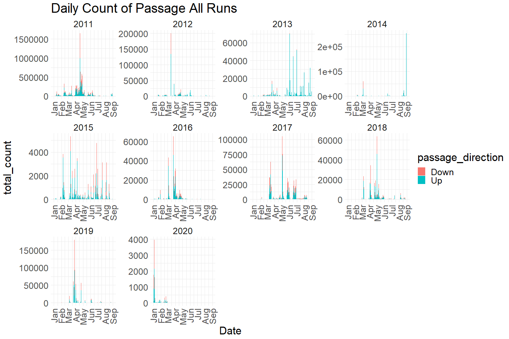
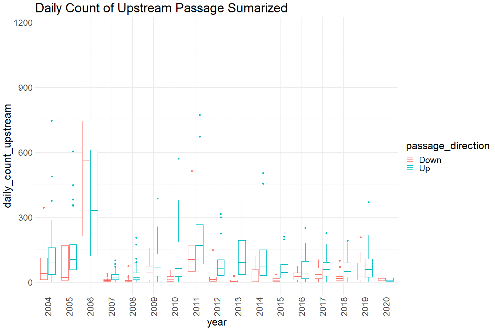
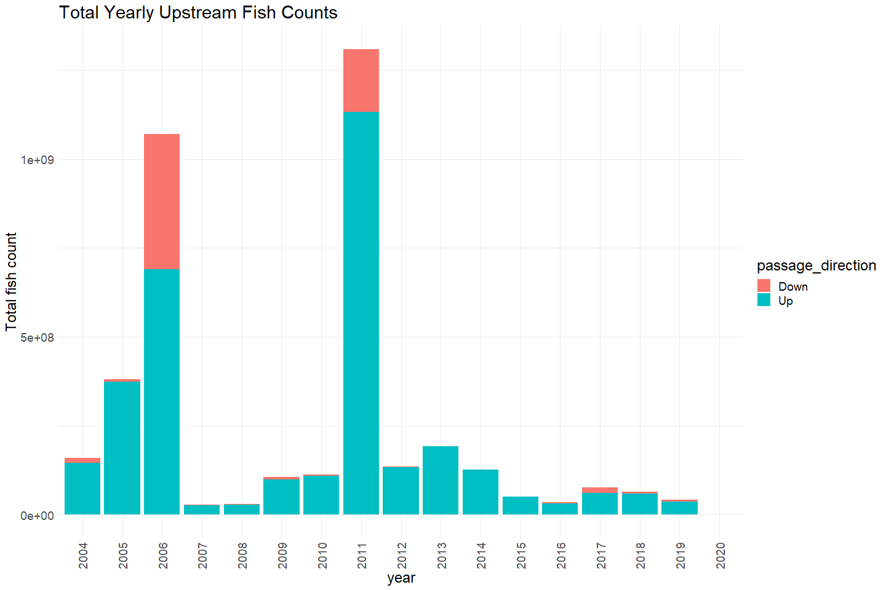
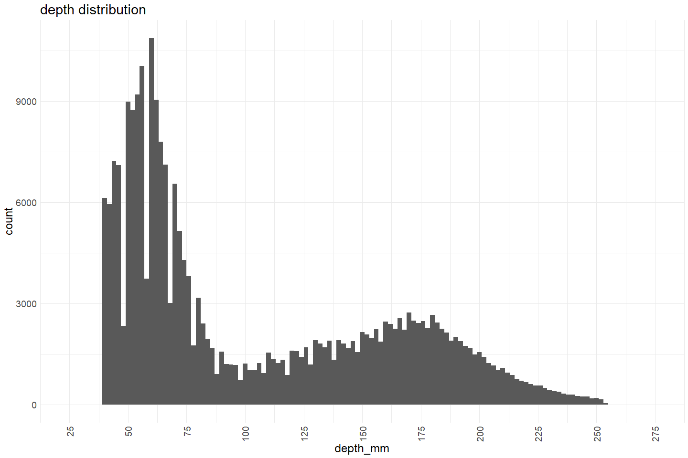
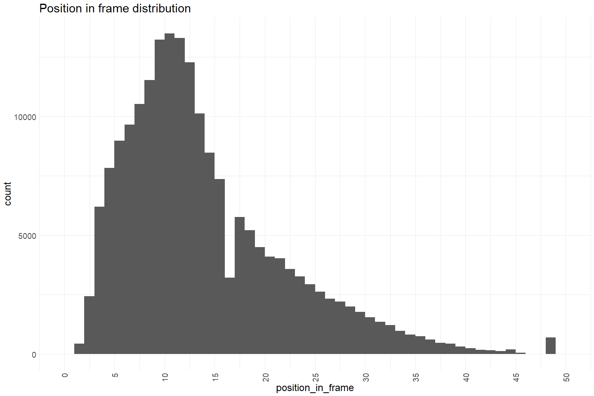
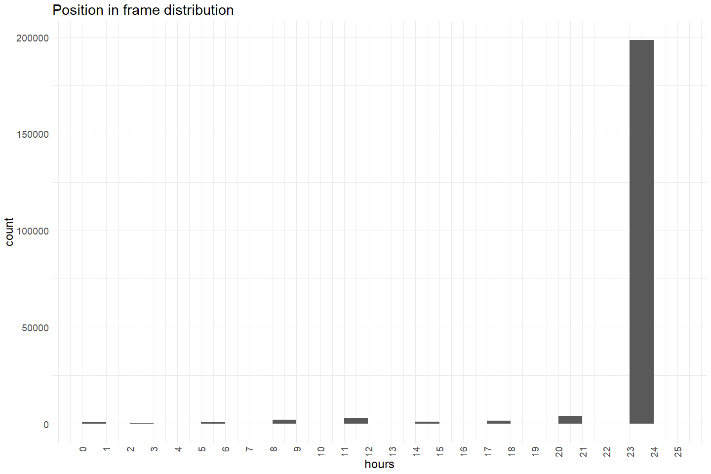

Yuba River Upstream Passage QC
================
Erin Cain
11/8/2021

# Yuba River Upstream Passage Monitoring Video Data

## Description of Monitoring Data

Yuba river upstream passage data provided by Mike Healey in a xlsx doc.
No associated description or metadata. We were warned by yuba river
experts that this data has a lot of inconsistencies and they do not
think the raw data here accuratly reflects the system. They recomend
using values calculated in [this
report.](https://storage.cloud.google.com/jpe-dev-bucket/adult-upstream-passage-monitoring/yuba-river/data-raw/2020%20Update%20LYR%20Chinook%20Salmon%20Run%20Differentiation_December%202020.pdf)

**Timeframe:** 2004 - 2019

**Video Season:** Appears to be January through October

**Completeness of Record throughout timeframe:** Data from each year,
records on hours sampled each date, seems like non sample hours are due
to outages in vaki equiptment (based on report)

**Sampling Location:** Yuba River North and Sourth Fish Ladder

**Data Contact:** [Mike Healey](mailto:Mike.Healey@wildlife.ca.gov)

Any additional info?

## Access Cloud Data

``` r
# Run Sys.setenv() to specify GCS_AUTH_FILE and GCS_DEFAULT_BUCKET before running 
getwd() #to see how to specify paths 
# Open object from google cloud storage
# Set your authentication using gcs_auth
gcs_auth(json_file = Sys.getenv("GCS_AUTH_FILE"))
# Set global bucket 
gcs_global_bucket(bucket = Sys.getenv("GCS_DEFAULT_BUCKET"))

gcs_list_objects()
# git data and save as xlsx
gcs_get_object(object_name = 
                 "adult-upstream-passage-monitoring/yuba-river/data-raw/MASTER_Vaki_ALL PASSAGE and OPS_BY2004-BY2019.xlsx",
               bucket = gcs_get_global_bucket(),
               saveToDisk = "raw_yuba_river_passage_data.xlsx",
               overwrite = TRUE)
```

Read in data from google cloud, glimpse raw data:

``` r
# read in data to clean 
sheets <- readxl::excel_sheets("raw_yuba_river_passage_data.xlsx")
sheets
```

    ## [1] "All Passage" "All Ops"

``` r
raw_passage_data <- read_excel("raw_yuba_river_passage_data.xlsx", sheet = "All Passage") %>% glimpse()
```

    ## Rows: 253,584
    ## Columns: 9
    ## $ Date                   <dttm> 2004-01-01, 2004-01-01, 2004-01-01, 2004-01-01~
    ## $ Time                   <dttm> 1899-12-31 05:34:00, 1899-12-31 10:20:00, 1899~
    ## $ `Depth [mm]`           <dbl> 146, 131, 75, 130, 163, 92, 140, 143, 62, 153, ~
    ## $ `Length [cm]`          <dbl> 87, 78, 45, 57, 71, 40, 61, 62, 37, 67, 50, 71,~
    ## $ Categorie              <chr> "Other / unidentifiab", "Other / unidentifiab",~
    ## $ `Direction of Passage` <chr> "Up", "Down", "Up", "Up", "Up", "Up", "Up", "Up~
    ## $ Ladder                 <chr> "South", "South", "South", "South", "South", "S~
    ## $ `Speed [m/s]`          <dbl> 0.34, 1.83, 0.79, 0.59, 0.69, 1.04, 0.88, 0.45,~
    ## $ `Position in frame`    <dbl> 12, 15, 14, 13, 14, 14, 17, 14, 10, 10, 6, 7, 1~

``` r
raw_passage_operations <- read_excel("raw_yuba_river_passage_data.xlsx", sheet = "All Ops") %>% glimpse()
```

    ## Rows: 11,804
    ## Columns: 4
    ## $ Date    <dttm> 2004-03-01, 2004-03-01, 2004-03-02, 2004-03-02, 2004-03-03, 2~
    ## $ Hours   <dbl> 12, 24, 24, 12, 24, 12, 24, 12, 9, 9, 0, 12, 12, 0, 12, 18, 24~
    ## $ Percent <dbl> 0.500, 1.000, 1.000, 0.500, 1.000, 0.500, 1.000, 0.500, 0.375,~
    ## $ Ladder  <chr> "South", "North", "North", "South", "North", "South", "North",~

## Data transformations

``` r
cleaner_passage_data <- raw_passage_data %>% 
  left_join(raw_passage_operations, c("Date", "Ladder")) %>% # Join passage data, no data on hours monitored in first 2 months
  janitor::clean_names() %>% 
  rename(speed_m_per_s = speed_m_s,
         catagory = categorie,
         passage_direction = direction_of_passage) %>%
  mutate(count = 1, 
         date = as.Date(date), 
         time = hms::as_hms(time)) %>%
  select(-percent) %>% # remove because just hours/24
  glimpse()
```

    ## Rows: 253,584
    ## Columns: 11
    ## $ date              <date> 2004-01-01, 2004-01-01, 2004-01-01, 2004-01-01, 200~
    ## $ time              <time> 05:34:00, 10:20:00, 10:53:00, 11:20:00, 11:33:00, 1~
    ## $ depth_mm          <dbl> 146, 131, 75, 130, 163, 92, 140, 143, 62, 153, 115, ~
    ## $ length_cm         <dbl> 87, 78, 45, 57, 71, 40, 61, 62, 37, 67, 50, 71, 104,~
    ## $ catagory          <chr> "Other / unidentifiab", "Other / unidentifiab", "Oth~
    ## $ passage_direction <chr> "Up", "Down", "Up", "Up", "Up", "Up", "Up", "Up", "U~
    ## $ ladder            <chr> "South", "South", "South", "South", "South", "South"~
    ## $ speed_m_per_s     <dbl> 0.34, 1.83, 0.79, 0.59, 0.69, 1.04, 0.88, 0.45, 1.19~
    ## $ position_in_frame <dbl> 12, 15, 14, 13, 14, 14, 17, 14, 10, 10, 6, 7, 12, 10~
    ## $ hours             <dbl> NA, NA, NA, NA, NA, NA, NA, NA, NA, NA, NA, NA, NA, ~
    ## $ count             <dbl> 1, 1, 1, 1, 1, 1, 1, 1, 1, 1, 1, 1, 1, 1, 1, 1, 1, 1~

## Explore Numeric Variables:

``` r
cleaner_passage_data %>% select_if(is.numeric) %>% colnames()
```

    ## [1] "depth_mm"          "length_cm"         "speed_m_per_s"    
    ## [4] "position_in_frame" "hours"             "count"

### Variable: `count`

**Plotting Passage Counts Moving Up over Period of Record**

``` r
cleaner_passage_data %>% filter(year(date) > 2010) %>% # show only last 10 years to make graphs more legible 
  group_by(date) %>%
  mutate(total_count = sum(count)) %>%
  ungroup() %>%
  mutate(year = as.factor(year(date)),
         fake_year = if_else(month(date) %in% 10:12, 1900, 1901),
         fake_date = as.Date(paste0(fake_year,"-", month(date), "-", day(date)))) %>%
  ggplot(aes(x = fake_date, y = total_count, fill = passage_direction)) + 
  geom_col() + 
  facet_wrap(~year(date), scales = "free") + 
  scale_x_date(labels = date_format("%b"), limits = c(as.Date("1901-01-01"), as.Date("1901-10-01")), date_breaks = "1 month") + 
  theme_minimal() + 
  theme(text = element_text(size = 23),
        axis.text.x = element_text(angle = 90, vjust = 0.5, hjust=1)) + 
  labs(title = "Daily Count of Passage All Runs", 
       x = "Date")  
```

<!-- -->

Spring Run Chinook appear to be seen moving upstream April through
September.

``` r
# Boxplots of daily counts by year
cleaner_passage_data %>% group_by(date, passage_direction) %>%
  mutate(daily_count_upstream = sum(count)) %>%
  mutate(year = as.factor(year(date))) %>% 
  ungroup() %>%
  ggplot(aes(x = year, y = daily_count_upstream, color = passage_direction)) + 
  geom_boxplot() + 
  theme_minimal() +
  theme(text = element_text(size = 23),
        axis.text.x = element_text(angle = 90, vjust = 0.5, hjust=1)) + 
  labs(title = "Daily Count of Upstream Passage Sumarized") 
```

<!-- -->

``` r
cleaner_passage_data  %>%
  mutate(year = as.factor(year(date))) %>%
  group_by(year, passage_direction) %>%
  mutate(total_count = sum(count)) %>%
  ggplot(aes(x = year, y = total_count, fill = passage_direction)) + 
  geom_col() + 
  theme_minimal() +
  labs(title = "Total Yearly Upstream Fish Counts",
       y = "Total fish count") + 
  theme(text = element_text(size = 18),
        axis.text.x = element_text(angle = 90, vjust = 0.5, hjust=1)) 
```

<!-- -->

**Numeric Summary of Passage Counts Moving Up over Period of Record**

``` r
# daily numeric summary 
cleaner_passage_data %>% group_by(date) %>%
  summarise(count = sum(count, na.rm = T)) %>%
  pull(count) %>%
  summary()
```

    ##    Min. 1st Qu.  Median    Mean 3rd Qu.    Max. 
    ##     1.0     7.0    18.0    47.2    47.0  2181.0

**NA and Unknown Values**

-   0 % of values in the `count` column are NA. Expected given I created
    the column assuming each row is one fish.

### Variable: `depth_mm`

**Plotting depth\_mm over Period of Record**

``` r
cleaner_passage_data %>%
  ggplot(aes(x = depth_mm)) + 
  geom_histogram(breaks=seq(25, 275, by=2)) + 
  scale_x_continuous(breaks=seq(25, 275, by=25)) +
  theme_minimal() +
  labs(title = "depth distribution") + 
  theme(text = element_text(size = 18),
        axis.text.x = element_text(angle = 90, vjust = 0.5, hjust=1)) 
```

<!-- -->

**Numeric Summary of depth\_mm over Period of Record**

``` r
summary(cleaner_passage_data$depth_mm)
```

    ##    Min. 1st Qu.  Median    Mean 3rd Qu.    Max.    NA's 
    ##     1.0    57.0    77.0   105.4   157.0   255.0     747

**NA and Unknown Values**

-   0.3 % of values in the `depth_mm` column are NA.

### Variable: `length_cm`

Length of fish in cm

**Plotting length\_cm**

``` r
cleaner_passage_data %>%
  ggplot(aes(x = length_cm)) + 
  geom_histogram(breaks=seq(0, 175, by=2)) + 
  scale_x_continuous(breaks=seq(0, 175, by=25)) +
  theme_minimal() +
  labs(title = "length distribution") + 
  theme(text = element_text(size = 18),
        axis.text.x = element_text(angle = 90, vjust = 0.5, hjust=1)) 
```

<!-- -->

**Numeric Summary of length\_cm over Period of Record**

``` r
# Table with summary statistics
summary(cleaner_passage_data$length_cm)
```

    ##    Min. 1st Qu.  Median    Mean 3rd Qu.    Max.    NA's 
    ##    0.00   24.51   33.00   45.60   70.00  151.00     747

**NA and Unknown Values**

-   0.3 % of values in the `length_cm` column are NA.

Quite a few 0 values and NA values. Need to figure out if 0 values can
also be considered NA.

### Variable: `speed_m_per_s`

Speed of fish in meter per second

**Plotting speed\_m\_per\_s over Period of Record**

``` r
cleaner_passage_data %>%
  ggplot(aes(x = speed_m_per_s)) + 
  geom_histogram(breaks=seq(-3, 4, by=.25)) + 
  scale_x_continuous(breaks=seq(-3, 5, by=1)) +
  theme_minimal() +
  labs(title = "speed distribution") + 
  theme(text = element_text(size = 18),
        axis.text.x = element_text(angle = 90, vjust = 0.5, hjust=1)) 
```

<!-- -->

**Numeric Summary of speed\_m\_per\_s over Period of Record**

``` r
summary(cleaner_passage_data$speed_m_per_s)
```

    ##    Min. 1st Qu.  Median    Mean 3rd Qu.    Max.    NA's 
    ##   -2.84    0.22    0.34    0.40    0.49    5.71   60098

**NA and Unknown Values**

-   23.7 % of values in the `speed_m_per_s` column are NA.

### Variable: `position_in_frame`

Fish position in video frame. Not sure how to map numbers to positions.

**Plotting position\_in\_frame over Period of Record**

``` r
cleaner_passage_data %>%
  ggplot(aes(x = position_in_frame)) + 
  geom_histogram(breaks=seq(0, 50, by=1)) + 
  scale_x_continuous(breaks=seq(0, 50, by=5)) +
  theme_minimal() +
  labs(title = "Position in frame distribution") + 
  theme(text = element_text(size = 18),
        axis.text.x = element_text(angle = 90, vjust = 0.5, hjust=1)) 
```

<!-- -->

**Numeric Summary of position\_in\_frame over Period of Record**

``` r
summary(cleaner_passage_data$position_in_frame)
```

    ##    Min. 1st Qu.  Median    Mean 3rd Qu.    Max.    NA's 
    ##    1.00    9.00   12.00   14.44   19.00   49.00   60098

**NA and Unknown Values**

-   23.7 % of values in the `position_in_frame` column are NA.

### Variable: `hours`

Number of hours in day that were monitored

**Plotting hours over Period of Record**

``` r
cleaner_passage_data %>%
  ggplot(aes(x = hours)) + 
  geom_histogram(breaks=seq(0, 25, by=1)) + 
  scale_x_continuous(breaks=seq(0, 25, by=1)) +
  theme_minimal() +
  labs(title = "Hours monitored distribution") + 
  theme(text = element_text(size = 18),
        axis.text.x = element_text(angle = 90, vjust = 0.5, hjust=1)) 
```

<!-- -->

**Numeric Summary of hours over Period of Record**

``` r
summary(cleaner_passage_data$hours)
```

    ##    Min. 1st Qu.  Median    Mean 3rd Qu.    Max.    NA's 
    ##    0.00   24.00   24.00   23.39   24.00   24.00   42147

Often monitored all 24 hours. Some days where hours are 0.

**NA and Unknown Values**

-   16.6 % of values in the `hours` column are NA.

## Explore Categorical variables:

``` r
cleaner_passage_data %>% select_if(is.character) %>% colnames()
```

    ## [1] "catagory"          "passage_direction" "ladder"

### Variable: `catagory`

``` r
table(cleaner_passage_data$catagory)
```

    ## 
    ##                   A. shad                   A. Shad             American shad 
    ##                       361                         3                        61 
    ##             American Shad                      bass                  Bass spp 
    ##                       174                         5                         8 
    ##                    Beaver               Brown trout               Brown Trout 
    ##                         2                        18                         1 
    ##                      carp                   chinook                   Chinook 
    ##                         5                     12631                     36659 
    ##           chinook ad-clip           Chinook ad-clip           Chinook Ad-clip 
    ##                      5505                      1879                      1314 
    ##           Chinook Ad-Clip      Chinook ad-undetermi      Chinook Ad-undetermi 
    ##                      3750                        90                        32 
    ##      Chinook Ad-Undetermi   chinook ad-undetermined   Chinook Ad-Undetermined 
    ##                         8                       201                       227 
    ##      Chinook Ad-Unidentif   Chinook Ad-Unidentified           Chinook Ad Clip 
    ##                       152                       210                      1959 
    ##      Chinook Ad Clip Unde      Chinook Ad Underterm      Chinook Ad Undetermi 
    ##                       482                         9                       902 
    ##   Chinook Ad Undetermined            Chinook Salmon       Chinook Salmon Ad C 
    ##                       159                     25867                         5 
    ##      Chinook Salmon Ad Cl      Chinook Salomon Ad C      chinook undetermined 
    ##                      1553                        68                       446 
    ##      Chinook unidentified                 CHN -P/+S                 CHN +P/-S 
    ##                       583                       280                         1 
    ##                 CHN +P/+S              CHN AC -P/+S              CHN AC +P/+S 
    ##                        11                        19                         3 
    ##               Chum salmon               Chum Salmon               Common Carp 
    ##                         2                         3                        12 
    ##          Common Merganser          common merganzer          Common Merganzer 
    ##                        14                        22                        39 
    ##                    debris                    Debris                  false-up 
    ##                      1225                      2301                        19 
    ##                  false up                   Garbage                 Hardehead 
    ##                      1531                       314                        17 
    ##                  hardhead                  Hardhead                  HARDHEAD 
    ##                        70                       626                        20 
    ##                   lamprey          large mouth bass          Large mouth bass 
    ##                       760                       147                         2 
    ##          Large Mouth Bass           Largemouth Bass                 Merganzer 
    ##                        27                         1                         1 
    ##                  Musk Rat              Needs Review             Needs review! 
    ##                         2                         3                         6 
    ##             Needs Review!                 O. mykiss                 O. Mykiss 
    ##                      1208                      3767                      1603 
    ##    O. mykiss <55 cm depth         O. mykiss ad-clip         O. mykiss Ad-Clip 
    ##                      4500                      2723                         9 
    ##         O. Mykiss Ad-Clip O. mykiss ad-undetermined O. Mykiss Ad-Undetermined 
    ##                       137                      1221                       327 
    ##      O. Mykiss Ad-Unident O. mykiss Ad-Unidentified    O. mykiss unidentified 
    ##                         1                        62                        28 
    ##                  o.mykiss                  O.mykiss                  O.Mykiss 
    ##                        12                      1421                      3528 
    ##          o.mykiss ad-clip          O.mykiss ad-clip          O.Mykiss Ad-Clip 
    ##                         3                       915                       517 
    ##      O.mykiss ad-undeterm      O.Mykiss Ad-Undeterm  O.Mykiss Ad-Undetermined 
    ##                        24                        45                       498 
    ##          O.mykiss Ad Clip  O.mykiss Ad Undetermined         O.mykiss false up 
    ##                       405                       170                        15 
    ##            O.mykiss undet      O.mykiss unidentifie     O.mykiss unidentified 
    ##                       681                        34                       169 
    ##          O.mykiss<55 down      Other / unidentifiab                     Otter 
    ##                         1                      2530                       344 
    ##                pikeminnow                Pikeminnow               Pink salmon 
    ##                      3389                       191                        11 
    ##                  R. Otter               river otter               River otter 
    ##                       304                         2                      2602 
    ##               River Otter             S. Pikeminnow                 S. sucker 
    ##                      2624                       193                      9027 
    ##           sac. pikeminnow           Sac. Pikeminnow               sac. sucker 
    ##                      1265                      2040                      1266 
    ##               Sac. Sucker                sac.sucker      Sacramento pikeminno 
    ##                     11178                      3511                         9 
    ##      Sacramento Pikeminno     Sacramento pikeminnow     Sacramento Pikeminnow 
    ##                       387                       928                      1645 
    ##         Sacramento sucker         Sacramento Sucker       scanner malfunction 
    ##                      3948                      7840                        10 
    ##                  SH -P/+S                  SH +P/-S                  SH +P/+S 
    ##                        19                        10                        33 
    ##          small mouth bass                   Sockeye            Sockeye salmon 
    ##                         1                         4                        16 
    ##                 steelhead         steelhead ad-clip         steelhead ad clip 
    ##                      1284                      1155                        78 
    ##           Steelhead trout           Steelhead Trout           steelhead undet 
    ##                       228                      3001                      1052 
    ##      steelhead undetermin              Striped bass              Striped Bass 
    ##                       267                         1                         1 
    ##                    sucker                    Sucker                   Sunfish 
    ##                      1879                       716                         1 
    ##                    Turtle              unidentified              Unidentified 
    ##                         1                     16194                     44967 
    ##           Unknown Catfish           Unknown Lamprey          unknown salmonid 
    ##                         1                         1                       134 
    ##          Unknown salmonid          Unknown Salmonid 
    ##                       174                       291

Fix inconsistencies with spelling, capitalization, and abbreviations.

``` r
catagories_to_keep <- str_detect(cleaner_passage_data$catagory, c("chinook", "chn")) 
cleaner_passage_data <- filter(cleaner_passage_data, str_detect(tolower(cleaner_passage_data$catagory), c("chinook", "chn")))
cleaner_passage_data$catagory <- tolower(cleaner_passage_data$catagory)

# Create a column for adipose 
cleaner_passage_data$adipose <- case_when(cleaner_passage_data$catagory %in% 
                                            c("chinook ad-unidentified", "chinook ad undetermined", "chinook ad-undetermi", 
                                               "chinook ad-undetermined", "chinook ad clip unde", "chinook ad underterm", 
                                               "chinook ad undetermi") ~ "unknown", 
                                          cleaner_passage_data$catagory %in% 
                                            c("chinook ad-clip", "chinook ad clip", "chinook salmon ad cl", 
                                               "chinook salmon ad c", "chinook salomon ad c") ~ "clipped")
table(cleaner_passage_data$catagory)
```

    ## 
    ##                 chinook         chinook ad-clip    chinook ad-undetermi 
    ##                   24635                    6248                      61 
    ## chinook ad-undetermined    chinook ad-unidentif chinook ad-unidentified 
    ##                     222                      82                     107 
    ##         chinook ad clip    chinook ad clip unde    chinook ad underterm 
    ##                     981                     238                       4 
    ##    chinook ad undetermi chinook ad undetermined          chinook salmon 
    ##                     455                      82                   13047 
    ##     chinook salmon ad c    chinook salmon ad cl    chinook salomon ad c 
    ##                       3                     767                      35 
    ##    chinook undetermined    chinook unidentified               chn -p/+s 
    ##                     224                     291                     145 
    ##               chn +p/+s            chn ac -p/+s            chn ac +p/+s 
    ##                       3                      10                       3

``` r
# TODO figure out what the whole -p/+s and +p/+s means 
```

**NA and Unknown Values**

-   0 % of values in the `category` column are NA.

### Variable: `passage_direction`

States if the fish is moving upstream (Up) or downstream (Down)

``` r
table(cleaner_passage_data$passage_direction) 
```

    ## 
    ##  Down    Up 
    ##  2848 44795

``` r
cleaner_passage_data$passage_direction <- tolower(cleaner_passage_data$passage_direction)
```

Fix inconsistencies with spelling, capitalization, and abbreviations.

**NA and Unknown Values**

-   0 % of values in the `passage_direction` column are NA.

### Variable: `ladder`

Refers to which fish ladder observation occured on.

``` r
table(cleaner_passage_data$ladder) 
```

    ## 
    ## North South 
    ## 38871  8772

``` r
cleaner_passage_data$ladder <- tolower(cleaner_passage_data$ladder)
```

**NA and Unknown Values**

-   0 % of values in the `category` column are NA.

## Summary of identified issues

-   The categories are very confusing, need to get definitions for the
    different category types - when asking Yuba exerts about this they
    stated that the data is very complex and we would need multi-hour
    meeting to talk through it all.
-   not sure if length is fork length or a different measure of length -
    when asking Yuba exerts about this they stated that the data is very
    complex and we would need multi-hour meeting to talk through it all.
-   Not sure what position in frame values map to

## Save cleaned data back to google cloud

``` r
yuba_upstream_passage <- cleaner_passage_data %>% glimpse()
```

    ## Rows: 47,643
    ## Columns: 12
    ## $ date              <date> 2004-01-01, 2004-01-01, 2004-01-01, 2004-01-01, 200~
    ## $ time              <time> 11:20:00, 11:35:00, 12:20:00, 12:38:00, 14:14:00, 1~
    ## $ depth_mm          <dbl> 130, 92, 143, 153, 190, 186, 167, 123, 135, 120, 101~
    ## $ length_cm         <dbl> 57, 40, 62, 67, 83, 81, 73, 53, 59, 52, 44, 76, 55, ~
    ## $ catagory          <chr> "chn ac -p/+s", "chn -p/+s", "chn -p/+s", "chn -p/+s~
    ## $ passage_direction <chr> "up", "up", "up", "up", "up", "up", "up", "up", "up"~
    ## $ ladder            <chr> "south", "south", "south", "south", "south", "south"~
    ## $ speed_m_per_s     <dbl> 0.59, 1.04, 0.45, 0.52, 0.97, 0.71, 0.64, 0.52, 0.66~
    ## $ position_in_frame <dbl> 13, 14, 14, 10, 10, 11, 11, 13, 11, 8, 16, 12, 19, 1~
    ## $ hours             <dbl> NA, NA, NA, NA, NA, NA, NA, NA, NA, NA, NA, NA, NA, ~
    ## $ count             <dbl> 1, 1, 1, 1, 1, 1, 1, 1, 1, 1, 1, 1, 1, 1, 1, 1, 1, 1~
    ## $ adipose           <chr> NA, NA, NA, NA, NA, NA, NA, NA, NA, NA, NA, NA, NA, ~

``` r
# Write to google cloud 
# Name file [watershed]_[data type].csv
f <- function(input, output) write_csv(input, file = output)

gcs_upload(yuba_upstream_passage,
           object_function = f,
           type = "csv",
           name = "adult-upstream-passage-monitoring/yuba-river/data/yuba_upstream_passage")
```
