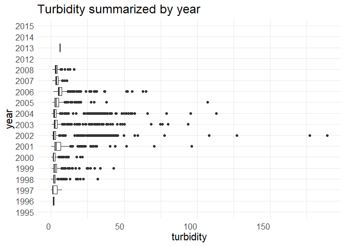
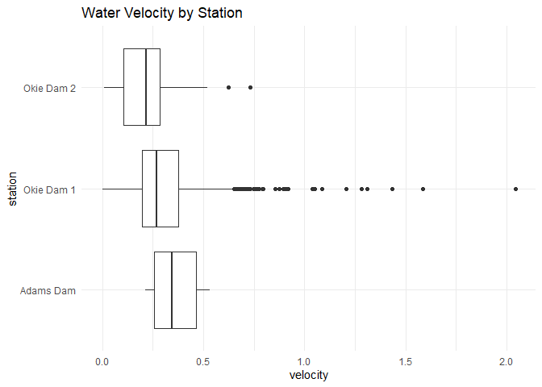
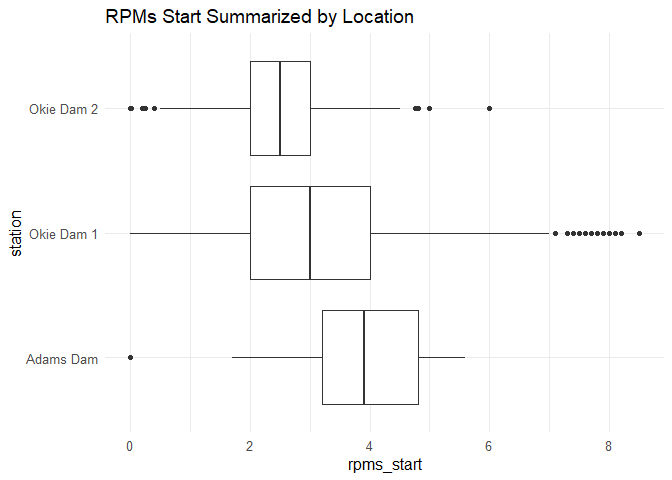

butte-creek-rst-qc-checklist
================
Inigo Peng
10/19/2021

``` r
knitr::opts_chunk$set(echo = FALSE, warning = FALSE)
library(tidyverse)
```

    ## -- Attaching packages --------------------------------------- tidyverse 1.3.1 --

    ## v ggplot2 3.3.5     v purrr   0.3.4
    ## v tibble  3.1.4     v dplyr   1.0.7
    ## v tidyr   1.1.3     v stringr 1.4.0
    ## v readr   2.0.1     v forcats 0.5.1

    ## -- Conflicts ------------------------------------------ tidyverse_conflicts() --
    ## x dplyr::filter() masks stats::filter()
    ## x dplyr::lag()    masks stats::lag()

``` r
library(lubridate)
```

    ## 
    ## Attaching package: 'lubridate'

    ## The following objects are masked from 'package:base':
    ## 
    ##     date, intersect, setdiff, union

``` r
library(googleCloudStorageR)
```

    ## v Setting scopes to https://www.googleapis.com/auth/devstorage.full_control and https://www.googleapis.com/auth/cloud-platform

    ## v Successfully auto-authenticated via ../../config.json

    ## v Set default bucket name to 'jpe-dev-bucket'

``` r
library(ggplot2)
library(scales)
```

    ## 
    ## Attaching package: 'scales'

    ## The following object is masked from 'package:purrr':
    ## 
    ##     discard

    ## The following object is masked from 'package:readr':
    ## 
    ##     col_factor

``` r
library (RColorBrewer)
```

# Butte Creek RST Data

**Description of Monitoring Data**

This dataset contains data for all Chinook salmon that were captured in
the Butte Creek rotary screw trap (RSTR) or diversion fyke trap (DSTR)
between the 1995-96 and 2014-15 trapping seasons.

**Timeframe:**

1995 - 2015

**Completeness of Record throughout timeframe:**

-   Life stage information lacks after 2005
-   Inconsistent completeness of physical data after 2008

**Sampling Location:**

3 locations on Butte Creek

**Data Contact:** [Jessica
Nichols](mailto:Jessica.Nichols@Wildlife.ca.gov)

## Access Cloud Data

    ## Rows: 63,418
    ## Columns: 26
    ## $ SampleDate       <dttm> 1995-11-29, 1995-11-29, 1995-11-29, 1995-11-29, 1995~
    ## $ StationCode      <chr> "BCOKIE-1", "BCOKIE-1", "BCOKIE-1", "BCOKIE-1", "BCOK~
    ## $ MethodCode       <chr> "DSTR", "DSTR", "DSTR", "DSTR", "DSTR", "DSTR", "DSTR~
    ## $ TrapStatus       <chr> "Check", "Check", "Check", "Check", "Check", "Check",~
    ## $ OrganismCode     <chr> "CHN", "CHN", "CHN", "CHN", "CHN", "CHN", "CHN", "CHN~
    ## $ Dead             <chr> "No", "No", "No", "Yes", "Yes", "Yes", "Yes", "Yes", ~
    ## $ Count            <dbl> 1, 2, 1, 8, 1, 5, 4, 1, 1, 1, 3, 3, 5, 3, 4, 1, 2, 1,~
    ## $ ForkLength       <dbl> 38, 37, 39, 35, 33, 34, 36, 37, 36, 34, 33, 34, 35, 3~
    ## $ Weight           <dbl> 0.00, 0.00, 0.00, 0.00, 0.00, 0.00, 0.00, 0.00, 0.00,~
    ## $ MarkCode         <chr> "n/p", "n/p", "n/p", "n/p", "n/p", "n/p", "n/p", "n/p~
    ## $ StageCode        <chr> "n/p", "n/p", "n/p", "n/p", "n/p", "n/p", "n/p", "n/p~
    ## $ SampleTime       <dttm> 1899-12-31 09:30:00, 1899-12-31 09:30:00, 1899-12-31~
    ## $ GearID           <chr> "DSTR1", "DSTR1", "DSTR1", "DSTR1", "DSTR1", "DSTR1",~
    ## $ WeatherCode      <chr> NA, NA, NA, NA, NA, NA, NA, NA, NA, NA, "CLD", "CLD",~
    ## $ WaterTemperature <dbl> 8.333333, 8.333333, 8.333333, 8.333333, 8.333333, 8.3~
    ## $ Turbidity        <dbl> NA, NA, NA, NA, NA, NA, NA, NA, NA, NA, NA, NA, NA, N~
    ## $ Secchi           <dbl> NA, NA, NA, NA, NA, NA, NA, NA, NA, NA, NA, NA, NA, N~
    ## $ WaterVelocity    <dbl> NA, NA, NA, NA, NA, NA, NA, NA, NA, NA, NA, NA, NA, N~
    ## $ NorthBrush       <chr> "FALSE", "FALSE", "FALSE", "FALSE", "FALSE", "FALSE",~
    ## $ SouthBrush       <chr> "FALSE", "FALSE", "FALSE", "FALSE", "FALSE", "FALSE",~
    ## $ StaffGauge       <dbl> 80, 80, 80, 80, 80, 80, 80, 80, 80, 80, NA, NA, NA, N~
    ## $ TrapRevolutions  <dbl> NA, NA, NA, NA, NA, NA, NA, NA, NA, NA, NA, NA, NA, N~
    ## $ Debris           <chr> "Medium", "Medium", "Medium", "Medium", "Medium", "Me~
    ## $ RPMsStart        <dbl> NA, NA, NA, NA, NA, NA, NA, NA, NA, NA, NA, NA, NA, N~
    ## $ RPMsEnd          <dbl> NA, NA, NA, NA, NA, NA, NA, NA, NA, NA, NA, NA, NA, N~
    ## $ Comments         <chr> NA, NA, NA, NA, NA, NA, NA, NA, NA, NA, NA, NA, NA, N~

## Data Transformations

    ## Rows: 63,418
    ## Columns: 19
    ## $ date             <dttm> 1995-11-29, 1995-11-29, 1995-11-29, 1995-11-29, 1995~
    ## $ station          <chr> "BCOKIE-1", "BCOKIE-1", "BCOKIE-1", "BCOKIE-1", "BCOK~
    ## $ method           <chr> "DSTR", "DSTR", "DSTR", "DSTR", "DSTR", "DSTR", "DSTR~
    ## $ trap_status      <chr> "Check", "Check", "Check", "Check", "Check", "Check",~
    ## $ species          <chr> "CHN", "CHN", "CHN", "CHN", "CHN", "CHN", "CHN", "CHN~
    ## $ count            <dbl> 1, 2, 1, 8, 1, 5, 4, 1, 1, 1, 3, 3, 5, 3, 4, 1, 2, 1,~
    ## $ fork_length      <dbl> 38, 37, 39, 35, 33, 34, 36, 37, 36, 34, 33, 34, 35, 3~
    ## $ weight           <dbl> 0.00, 0.00, 0.00, 0.00, 0.00, 0.00, 0.00, 0.00, 0.00,~
    ## $ lifestage        <chr> "n/p", "n/p", "n/p", "n/p", "n/p", "n/p", "n/p", "n/p~
    ## $ time             <time> 09:30:00, 09:30:00, 09:30:00, 09:30:00, 09:30:00, 09~
    ## $ gear_id          <chr> "DSTR1", "DSTR1", "DSTR1", "DSTR1", "DSTR1", "DSTR1",~
    ## $ temperature      <dbl> 8.333333, 8.333333, 8.333333, 8.333333, 8.333333, 8.3~
    ## $ turbidity        <dbl> NA, NA, NA, NA, NA, NA, NA, NA, NA, NA, NA, NA, NA, N~
    ## $ velocity         <dbl> NA, NA, NA, NA, NA, NA, NA, NA, NA, NA, NA, NA, NA, N~
    ## $ staff_gauge      <dbl> 80, 80, 80, 80, 80, 80, 80, 80, 80, 80, NA, NA, NA, N~
    ## $ trap_revolutions <dbl> NA, NA, NA, NA, NA, NA, NA, NA, NA, NA, NA, NA, NA, N~
    ## $ debris           <chr> "Medium", "Medium", "Medium", "Medium", "Medium", "Me~
    ## $ rpms_start       <dbl> NA, NA, NA, NA, NA, NA, NA, NA, NA, NA, NA, NA, NA, N~
    ## $ rpms_end         <dbl> NA, NA, NA, NA, NA, NA, NA, NA, NA, NA, NA, NA, NA, N~

## Explore `date`

    ## `stat_bin()` using `bins = 30`. Pick better value with `binwidth`.

<!-- -->

    ##                  Min.               1st Qu.                Median 
    ## "1995-11-29 00:00:00" "2000-05-11 00:00:00" "2003-05-08 00:00:00" 
    ##                  Mean               3rd Qu.                  Max. 
    ## "2004-06-15 02:18:49" "2007-02-05 00:00:00" "2015-06-03 00:00:00"

**NA and Unknown Values**

-   0 % of values in the `date` column are NA.

## Explore Categorical Variables

    ## [1] "station"     "method"      "trap_status" "species"     "lifestage"  
    ## [6] "gear_id"     "debris"

### Variable `station`

**Description: trap location**

-   BCADAMS - Adams Dam

-   BCOKIE-1 - Okie Dam 1

-   BCOKIE-2 - Okie Dam 2

<!-- -->

    ## 
    ##  Adams Dam Okie Dam 1 Okie Dam 2 
    ##        701      61991        726

**NA and Unknown Values**

-   0 % of values in the `station` column are NA.

### Variable `method`

**Description: method of capture**

-   DSTR - Diversion fyke trap

-   RSTR - Rotary screw trap

<!-- -->

    ## 
    ## diversion fyke trap   rotary screw trap 
    ##               32066               31352

**NA and Unknown Values**

-   0 % of values in the `method` column are NA.

### Variable `trap_status`

**Description:**

-   Check - trap was checked normally , continued fishing

-   Pull - trap was pulled after trap check

-   Set - trap was set upon arrival

<!-- -->

    ## 
    ## check  pull   set 
    ## 63130   130    15

**NA and Unknown Values**

-   0.2 % of values in the `trap_status` column are NA.

### Variable `species`

**Description: we are interested in Chinooks only**

**NA and Unknown Values**

-   0 % of values in the `species` column are NA.

### Variable `lifestage`

**Description: Renaming to `lifestage`**

-   1 - Fry with visible yolk sac
-   2 - Fry with no visible yolk sac
-   3 - Parr
-   4 - Fingerling
-   5 - Smolt
-   AD - Adult
-   n/p - not provided
-   UNK - unknown

<!-- -->

    ## 
    ##     1     2     3     4     5    AD   n/p   UNK 
    ##    51  5364  3558  1067    26    96 53255     1

    ## 
    ##        adult   fingerling          fry         parr        smolt      unknown 
    ##           96         1067         5364         3558           26            1 
    ## yolk sac fry 
    ##           51

**NA and Unknown Values**

-   84 % of values in the `lifestage` column are NA.

### Variable `gear_id`

**Description:**

-   DSTR1 - Diversion Fyke Trap 1

-   RSTR1 - Rotary Screw Trap 1

-   RSTR2 - Rotary Screw Trap 2

<!-- -->

    ## 
    ## diversion fyke trap 1   rotary screw trap 1   rotary screw trap 2 
    ##                 28882                    35                 29270

**NA and Unknown Values**

-   8.2 % of values in the `gear_id` column are NA.

### Variable `debris`

**Description: visual assessment of debris in trap**

    ## 
    ##      heavy      light     medium       none very heavy 
    ##       7321      38342      16532         31        341

**NA and Unknown Values**

-   1.3 % of values in the `debris` column are NA.

## Explore Numerical Variables

    ##  [1] "count"            "fork_length"      "weight"           "temperature"     
    ##  [5] "turbidity"        "velocity"         "staff_gauge"      "trap_revolutions"
    ##  [9] "rpms_start"       "rpms_end"

### Variable `count`

\*\*Description: fish \*count\*\*

<!-- -->
<!-- -->

    ##      Min.   1st Qu.    Median      Mean   3rd Qu.      Max. 
    ##      0.00      1.00      1.00     75.02      4.00 220000.00

**NA and Unknown Values**

-   0 % of values in the `count` column are NA.

### Variable `fork_length`

**Description: fork length in millimeters (mm)**

<!-- -->
<!-- -->

    ##    Min. 1st Qu.  Median    Mean 3rd Qu.    Max.    NA's 
    ##    0.00   35.00   44.00   50.75   65.00 1035.00    3272

**NA and Unknown Values**

-   5.2 % of values in the `fork_length` column are NA.

### Variable `weight`

**Description: wet weight in grams(g)**

<!-- -->
<!-- -->

    ##     Min.  1st Qu.   Median     Mean  3rd Qu.     Max.     NA's 
    ##    0.000    0.000    0.290    1.617    2.275 3046.000    25299

**NA and Unknown Values**

-   39.9 % of values in the `weight` column are NA.

### Variable `temperature`

**Description: temperature of water in degrees Celsius**

<!-- -->
<!-- -->
<!-- -->

    ##    Min. 1st Qu.  Median    Mean 3rd Qu.    Max.    NA's 
    ##   -1.00    7.00    9.00    9.96   12.00  805.00    3917

**NA and Unknown Values**

-   6.2 % of values in the `temperature` column are NA.

### Variable `turbidity`

**Description: Turbidity of water in NTU**
<!-- -->
<!-- -->

    ##    Min. 1st Qu.  Median    Mean 3rd Qu.    Max.    NA's 
    ##   0.200   1.870   2.770   5.359   4.700 189.000   21066

**NA and Unknown Values**

-   33.2 % of values in the `turbidity` column are NA.

### Variable `velocity`

**Description: water velocity measured in ft/s**

Data Transformation

<!-- -->
<!-- -->
<!-- -->

# Numeric summary of `velocity` from 1995-2015

    ##    Min. 1st Qu.  Median    Mean 3rd Qu.    Max.    NA's 
    ##    0.00    0.20    0.27    0.34    0.37  104.24   38937

**NA and Unknown Values**

-   61.4 % of values in the `velocity` column are NA.

### Variable `trap_revolutions`

**Description: Number of revolutions the RST cone had made since last
being checked**
<!-- -->
<!-- -->

# Numeric summary of `trap_revolutions` from 1995-2015

    ##    Min. 1st Qu.  Median    Mean 3rd Qu.    Max.    NA's 
    ##       0    2741    4000    4118    5439   11795   41363

**NA and Unknown Values**

-   65.2 % of values in the `trap_revolutions` column are NA.

### Variable `rpms_start`

**Description: rotations per minute of RST cone at start of trapping
window**
<!-- -->
<!-- -->

# Numeric summary of `rpms_start` from 1995-2015

    ##    Min. 1st Qu.  Median    Mean 3rd Qu.    Max.    NA's 
    ##    0.00    2.10    3.00    4.92    4.00 3698.00   34932

**NA and Unknown Values**

-   55.1 % of values in the \`rpms\_start\`\` column are NA.

### Variable `rpms_end`

**Description: rotations per minute of RST cone at end of trapping
window**
<!-- -->

<!-- -->

**NA and Unknown Values**

-   58.9 % of values in the `rpms_end` column are NA.

### Issues Identified

-   50 points in water temperature reaches over 50 degrees celsius

-   Turbidity data lacks in some years

### Add cleaned data back into google cloud

    ## Rows: 63,418
    ## Columns: 19
    ## $ date             <dttm> 1995-11-29, 1995-11-29, 1995-11-29, 1995-11-29, 1995~
    ## $ station          <chr> "Okie Dam 1", "Okie Dam 1", "Okie Dam 1", "Okie Dam 1~
    ## $ method           <chr> NA, NA, NA, NA, NA, NA, NA, NA, NA, NA, NA, NA, NA, N~
    ## $ trap_status      <chr> "check", "check", "check", "check", "check", "check",~
    ## $ species          <chr> "CHN", "CHN", "CHN", "CHN", "CHN", "CHN", "CHN", "CHN~
    ## $ count            <dbl> 1, 2, 1, 8, 1, 5, 4, 1, 1, 1, 3, 3, 5, 3, 4, 1, 2, 1,~
    ## $ fork_length      <dbl> 38, 37, 39, 35, 33, 34, 36, 37, 36, 34, 33, 34, 35, 3~
    ## $ weight           <dbl> 0.00, 0.00, 0.00, 0.00, 0.00, 0.00, 0.00, 0.00, 0.00,~
    ## $ lifestage        <chr> NA, NA, NA, NA, NA, NA, NA, NA, NA, NA, NA, NA, NA, N~
    ## $ time             <time> 09:30:00, 09:30:00, 09:30:00, 09:30:00, 09:30:00, 09~
    ## $ gear_id          <chr> "diversion fyke trap 1", "diversion fyke trap 1", "di~
    ## $ temperature      <dbl> 8.333333, 8.333333, 8.333333, 8.333333, 8.333333, 8.3~
    ## $ turbidity        <dbl> NA, NA, NA, NA, NA, NA, NA, NA, NA, NA, NA, NA, NA, N~
    ## $ velocity         <dbl> NA, NA, NA, NA, NA, NA, NA, NA, NA, NA, NA, NA, NA, N~
    ## $ staff_gauge      <dbl> 80, 80, 80, 80, 80, 80, 80, 80, 80, 80, NA, NA, NA, N~
    ## $ trap_revolutions <dbl> NA, NA, NA, NA, NA, NA, NA, NA, NA, NA, NA, NA, NA, N~
    ## $ debris           <chr> "medium", "medium", "medium", "medium", "medium", "me~
    ## $ rpms_start       <dbl> NA, NA, NA, NA, NA, NA, NA, NA, NA, NA, NA, NA, NA, N~
    ## $ rpms_end         <dbl> NA, NA, NA, NA, NA, NA, NA, NA, NA, NA, NA, NA, NA, N~
