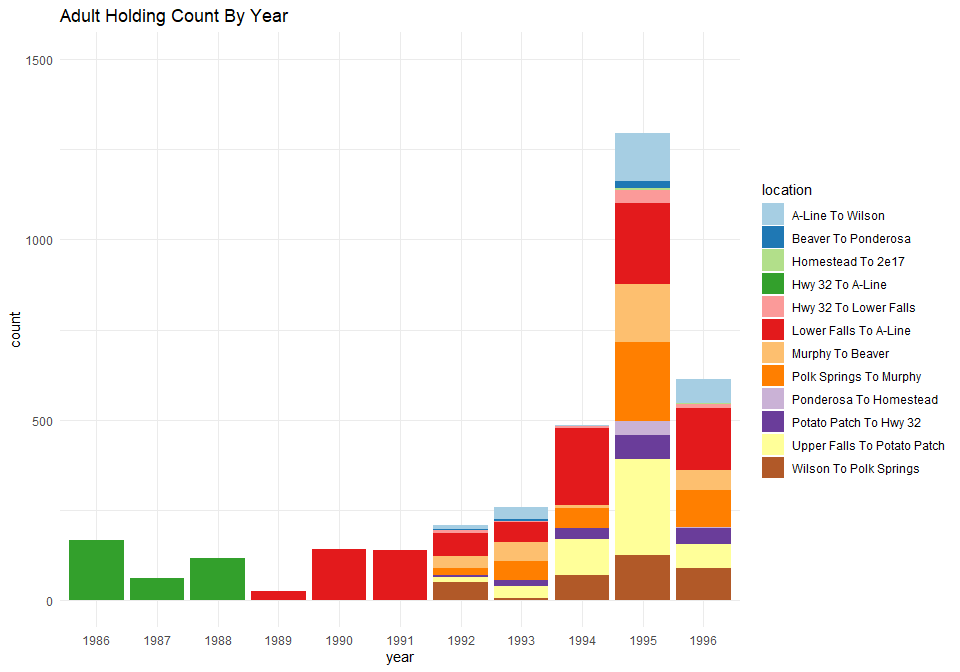

deer-creek-adult-holding-survey-1986-to-1996-qc-checklist
================
Inigo Peng
10/19/2021

# Deer Creek Adult Holding Survey Data 1986 to 1996

**Description of Monitoring Data**

The adult holding survey data is in two separate files: first one is
from 1986 to 1996, second one is 1997 to 2020. The data is collected via
snorkel counts.The data has been qced and summed up.

The data from 1986 to 1996 has been reformatted for better access. Both
original file and reformatted file could be found on google cloud.

**Timeframe:**

1986 to 1996

**Completeness of Record throughout timeframe:**

-   From 1986 to 1988 sampling reach was Hwy 32 to A-Line.
-   From 1989 to 1991 sampling reach was Lower Falls to A-Line.
-   From 1992 to 1996 sampling reach increased to 11 locations.

**Sampling Location:**

-   Hwy 32 to A-Line
-   Lower Falls to A-Line
-   Upper Falls to Potato Patch
-   Potato Patch to Hwy 32
-   Hwy 32 to Lower Falls
-   Lower Falls to A-Line
-   A-Line to Wilson
-   Wilson to Polk Springs
-   Polk Springs to Murphy
-   Murphy to Beaver
-   Beaver to Ponderosa
-   Ponderosa to Homestead
-   Homestead to 2E17

**Other Notes:**

1/ In 1989 the section from Hwy 32 to Lower Falls was omitted from the
indicator reach. Fro 1992 through 1996, an average of 2% of the total
salmon observed were in the omitted section: hwy 32 to lower falls. This
leaves 29% of the salmon holding in the reduced indicator reach.

**Data Contact:** [Matt Johnson](mailto:Matt.Johnson@wildlife.ca.gov)

## Access Cloud Data

``` r
# Run Sys.setenv() to specify GCS_AUTH_FILE and GCS_DEFAULT_BUCKET before running
# Open object from google cloud storage
# Set your authentication using gcs_auth
gcs_auth(json_file = Sys.getenv("GCS_AUTH_FILE"))
# Set global bucket 
gcs_global_bucket(bucket = Sys.getenv("GCS_DEFAULT_BUCKET"))
gcs_list_objects()
# git data and save as xlsx
gcs_get_object(object_name = "adult-holding-redd-and-carcass-surveys/deer-creek/data-raw/reformatted_deer_creek_snorkel_counts_by_reach_1986_1996.xlsx",
               bucket = gcs_get_global_bucket(),
               saveToDisk = "deer_creek_holding_raw.xlsx")
               # Overwrite = TRUE)
```

``` r
raw_data = readxl::read_excel('deer_creek_holding_raw.xlsx')
glimpse(raw_data)
```

    ## Rows: 55
    ## Columns: 3
    ## $ Year     <dbl> 1986, 1987, 1988, 1989, 1990, 1991, 1992, 1992, 1992, 1992, 1~
    ## $ Location <chr> "Hwy 32 to A-Line", "Hwy 32 to A-Line", "Hwy 32 to A-Line", "~
    ## $ Count    <dbl> 166, 62, 115, 24, 142, 139, 12, 5, 7, 65, 13, 51, 21, 33, 2, ~

## Data Transformations

``` r
cleaner_data <- raw_data %>% 
  set_names(tolower(colnames(raw_data))) %>% 
  glimpse()
```

    ## Rows: 55
    ## Columns: 3
    ## $ year     <dbl> 1986, 1987, 1988, 1989, 1990, 1991, 1992, 1992, 1992, 1992, 1~
    ## $ location <chr> "Hwy 32 to A-Line", "Hwy 32 to A-Line", "Hwy 32 to A-Line", "~
    ## $ count    <dbl> 166, 62, 115, 24, 142, 139, 12, 5, 7, 65, 13, 51, 21, 33, 2, ~

## Explore Categorical Variables

### Variable `location`

``` r
cleaner_data$location = str_to_title(cleaner_data$location)
table(cleaner_data$location)
```

    ## 
    ##            A-Line To Wilson         Beaver To Ponderosa 
    ##                           5                           5 
    ##           Homestead To 2e17            Hwy 32 To A-Line 
    ##                           2                           3 
    ##       Hwy 32 To Lower Falls       Lower Falls To A-Line 
    ##                           5                           8 
    ##            Murphy To Beaver      Polk Springs To Murphy 
    ##                           5                           5 
    ##      Ponderosa To Homestead      Potato Patch To Hwy 32 
    ##                           2                           5 
    ## Upper Falls To Potato Patch      Wilson To Polk Springs 
    ##                           5                           5

**NA and Unknown Values**

-   0 % of values in the `location` column are NA.

## Explore Numeric Variables

### Variable `count`

``` r
#Find the most distinctive colours for visual
colourCount = length(unique(cleaner_data$location))
getPalette = colorRampPalette(brewer.pal(12, "Paired"))

cleaner_data %>%
  mutate(date =lubridate::ymd(year, truncated = 2L), .keep = "unused") %>% 
  mutate(year = as.factor(year(date))) %>% 
  ggplot(aes(x = year, y = count, fill = location))+
  scale_fill_manual(values = getPalette(colourCount))+
  geom_col()+
  theme_minimal()+
  labs(title = "Adult Holding Count By Year")+
  ylim(0, 1500)
```

<!-- -->

``` r
cleaner_data %>% 
  ggplot(aes(x = count, y = location))+
  geom_boxplot() +
  theme_minimal()+
  labs(title = "Adult Holding Count By Reach")
```

<!-- -->

**NA and Unknown Values**

-   0 % of values in the `count` column are NA.

**Numeric Annual Summary of count From 1986 to 1996**

``` r
cleaner_data %>%
  group_by(year) %>%
  summarise(count = sum(count, na.rm = T)) %>%
  pull(count) %>%
  summary()
```

    ##    Min. 1st Qu.  Median    Mean 3rd Qu.    Max. 
    ##    24.0   127.0   166.0   319.1   372.0  1295.0

### Add cleaned data back onto google cloud

``` r
deer_adult_holding_survey_1986_to_1996 <- cleaner_data %>% glimpse()
```

    ## Rows: 55
    ## Columns: 3
    ## $ year     <dbl> 1986, 1987, 1988, 1989, 1990, 1991, 1992, 1992, 1992, 1992, 1~
    ## $ location <chr> "Hwy 32 To A-Line", "Hwy 32 To A-Line", "Hwy 32 To A-Line", "~
    ## $ count    <dbl> 166, 62, 115, 24, 142, 139, 12, 5, 7, 65, 13, 51, 21, 33, 2, ~

``` r
f <- function(input, output) write_csv(input, file = output)
gcs_upload(deer_adult_holding_survey_1986_to_1996,
           object_function = f,
           type = "csv",
           name = "adult-holding-redd-and-carcass-surveys/deer-creek/data/deer_adult_holding_1986_to_1996.csv")
```

    ## i 2021-10-29 14:54:19 > File size detected as  1.6 Kb

    ## i 2021-10-29 14:54:20 > Request Status Code:  400

    ## ! API returned: Cannot insert legacy ACL for an object when uniform bucket-level access is enabled. Read more at https://cloud.google.com/storage/docs/uniform-bucket-level-access - Retrying with predefinedAcl='bucketLevel'

    ## i 2021-10-29 14:54:20 > File size detected as  1.6 Kb

    ## ==Google Cloud Storage Object==
    ## Name:                adult-holding-redd-and-carcass-surveys/deer-creek/data/deer_adult_holding_1986_to_1996.csv 
    ## Type:                csv 
    ## Size:                1.6 Kb 
    ## Media URL:           https://www.googleapis.com/download/storage/v1/b/jpe-dev-bucket/o/adult-holding-redd-and-carcass-surveys%2Fdeer-creek%2Fdata%2Fdeer_adult_holding_1986_to_1996.csv?generation=1635544458958271&alt=media 
    ## Download URL:        https://storage.cloud.google.com/jpe-dev-bucket/adult-holding-redd-and-carcass-surveys%2Fdeer-creek%2Fdata%2Fdeer_adult_holding_1986_to_1996.csv 
    ## Public Download URL: https://storage.googleapis.com/jpe-dev-bucket/adult-holding-redd-and-carcass-surveys%2Fdeer-creek%2Fdata%2Fdeer_adult_holding_1986_to_1996.csv 
    ## Bucket:              jpe-dev-bucket 
    ## ID:                  jpe-dev-bucket/adult-holding-redd-and-carcass-surveys/deer-creek/data/deer_adult_holding_1986_to_1996.csv/1635544458958271 
    ## MD5 Hash:            9OnNRd61ubjplHVbJIniiA== 
    ## Class:               STANDARD 
    ## Created:             2021-10-29 21:54:18 
    ## Updated:             2021-10-29 21:54:18 
    ## Generation:          1635544458958271 
    ## Meta Generation:     1 
    ## eTag:                CL+r9vPN8PMCEAE= 
    ## crc32c:              d2sACw==
