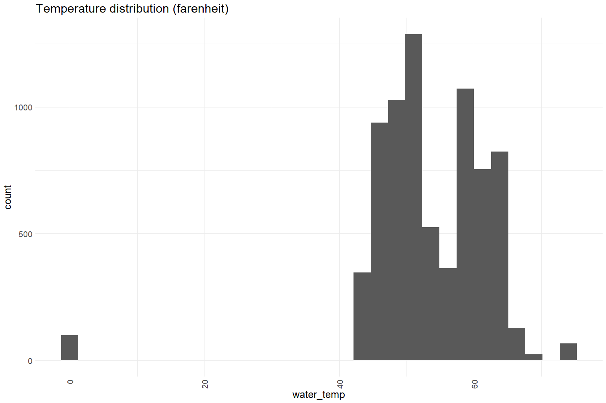
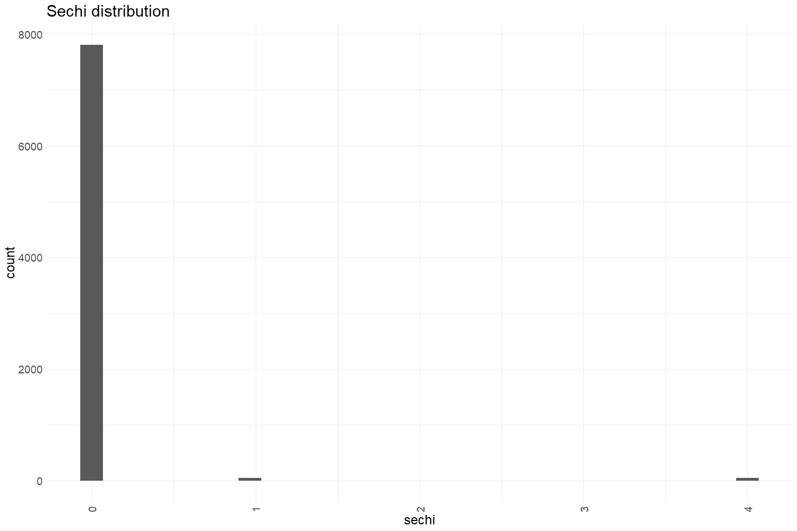
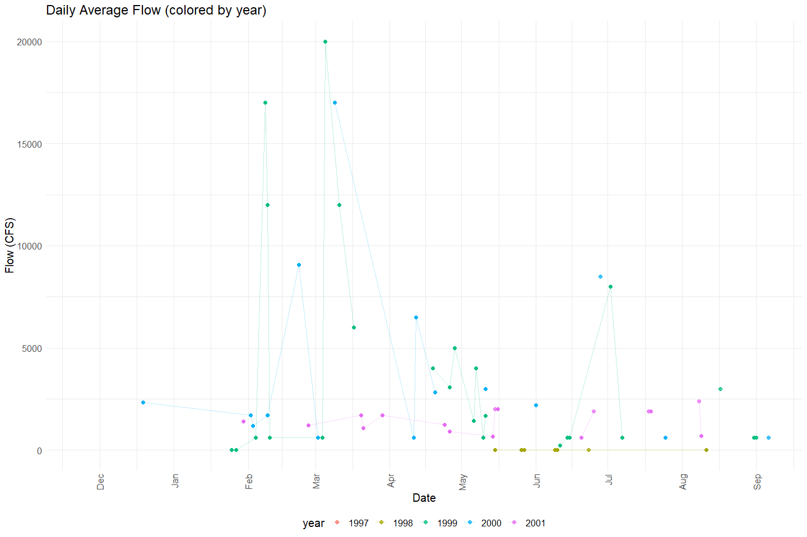
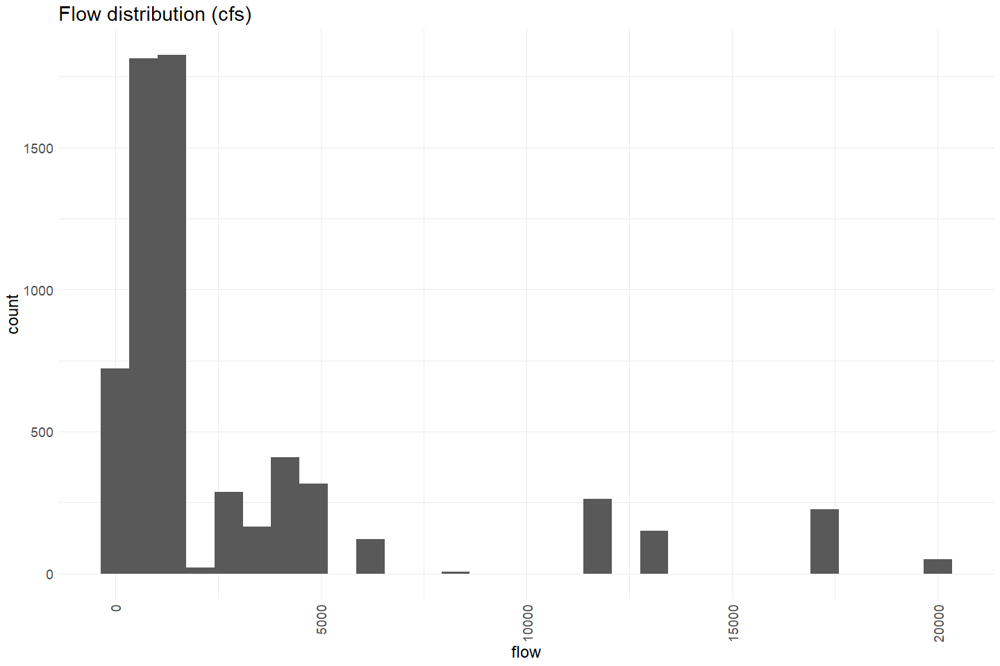
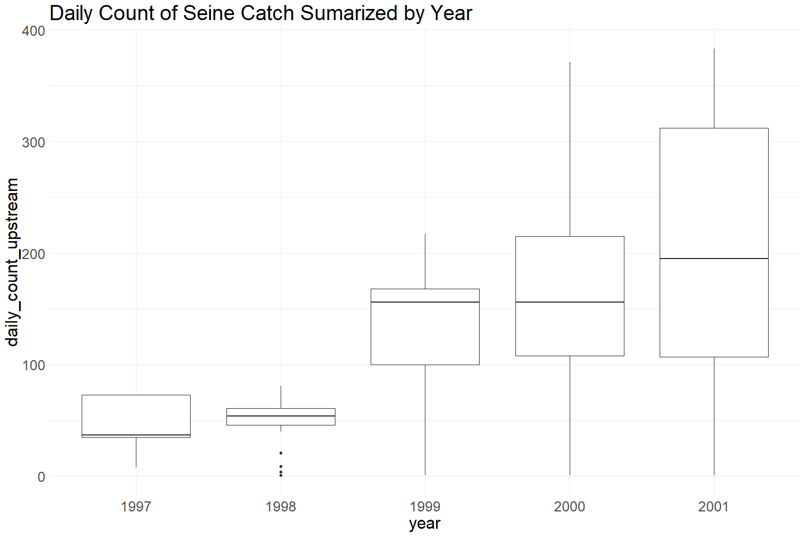
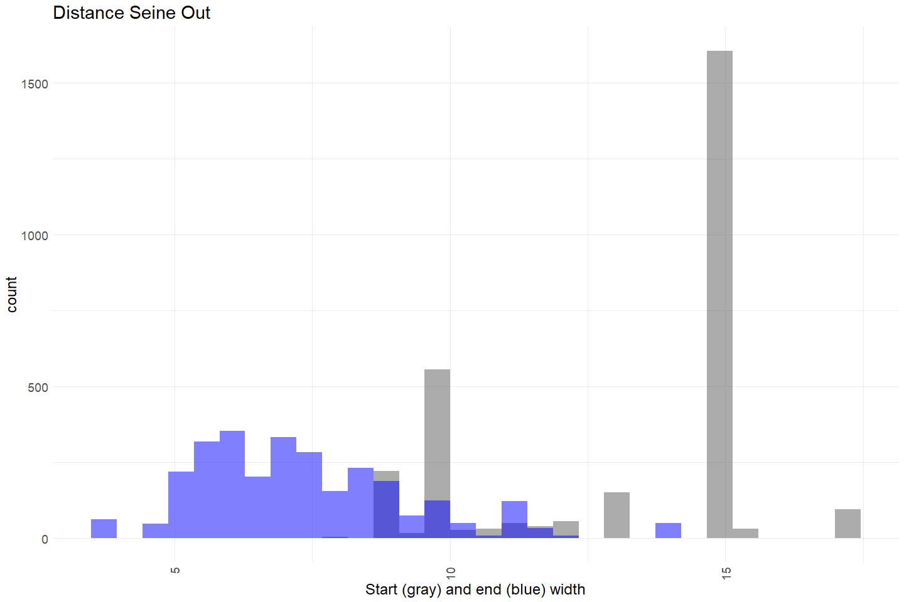
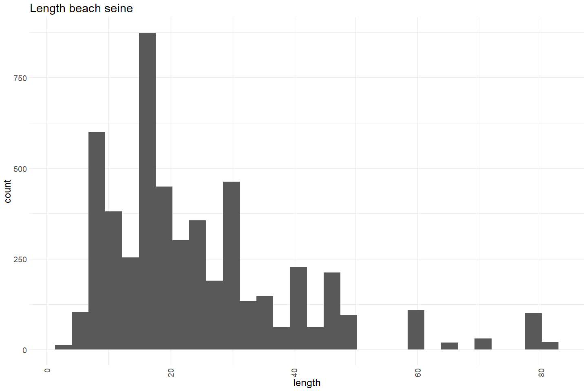

Feather River Seine Data 1997 - 2001 QC
================
Erin Cain
9/29/2021

# Feather River Seine and Snorkel Data

## Description of Monitoring Data

Feather River Seine data 1997 - 2021. This dataset contains less
attributes than the more recent data and sampling occurs relatively
infrequently.

**Timeframe:** 1997 - 2001

**Seine Season:** First survey can be done as early as mid December and
then sampling can continue until late August.

**Completeness of Record throughout timeframe:** Sampled all 5 years in
date range. Sampling does not occur at regular time intervals throughout
the years sampled.

**Sampling Location:** Feather River

**Data Contact:** [Casey Campos](mailto:Casey.Campos@water.ca.gov)

Any additional info?

## Access Cloud Data

``` r
# Run Sys.setenv() to specify GCS_AUTH_FILE and GCS_DEFAULT_BUCKET before running 
# getwd() to see how to specify paths 
# Open object from google cloud storage
# Set your authentication using gcs_auth
gcs_auth(json_file = Sys.getenv("GCS_AUTH_FILE"))
# Set global bucket 
gcs_global_bucket(bucket = Sys.getenv("GCS_DEFAULT_BUCKET"))
gcs_list_objects()
# git data and save as xlsx
gcs_get_object(object_name = 
                 "juvenile-rearing-monitoring/seine-and-snorkel-data/feather-river/data-raw/JPE_SR_all_seine_individuals1997-2001.xlsx",
               bucket = gcs_get_global_bucket(),
               saveToDisk = "raw_seine_1997-2001.xlsx",
               overwrite = TRUE)
```

Read in data from google cloud, glimpse raw data and domain description
sheet:

``` r
# read in data to clean 
raw_seine_1997 <- read_xlsx("raw_seine_1997-2001.xlsx") %>% 
  glimpse()
```

    ## Rows: 21,060
    ## Columns: 37
    ## $ SeineID             <dbl> 2, 2, 2, 2, 2, 2, 2, 2, 2, 2, 2, 2, 2, 2, 2, 2, 2,~
    ## $ SpeciesCode         <chr> "SASU", "SASU", "SASU", "SASU", "SASU", "SASU", "S~
    ## $ ForkLength          <dbl> 35, 31, 28, 25, 27, 26, 39, 32, 36, 39, 25, 25, 29~
    ## $ Weight              <lgl> NA, NA, NA, NA, NA, NA, NA, NA, NA, NA, NA, NA, NA~
    ## $ SalmonLifeStageCode <chr> NA, NA, NA, NA, NA, NA, NA, NA, NA, NA, NA, NA, NA~
    ## $ Race                <chr> NA, NA, NA, NA, NA, NA, NA, NA, NA, NA, NA, NA, NA~
    ## $ Mark                <chr> "None", "None", "None", "None", "None", "None", "N~
    ## $ Dead                <lgl> FALSE, FALSE, FALSE, FALSE, FALSE, FALSE, FALSE, F~
    ## $ IndividAutoID       <dbl> 3, 4, 5, 6, 7, 8, 9, 10, 11, 12, 13, 14, 15, 16, 1~
    ## $ StationCode         <chr> "FR053.85", "FR053.85", "FR053.85", "FR053.85", "F~
    ## $ Date                <dttm> 1999-06-17, 1999-06-17, 1999-06-17, 1999-06-17, 1~
    ## $ Location            <chr> "Big Riffle", "Big Riffle", "Big Riffle", "Big Rif~
    ## $ Time                <dttm> 1899-12-31 14:20:00, 1899-12-31 14:20:00, 1899-12~
    ## $ GearType            <chr> "SEIN", "SEIN", "SEIN", "SEIN", "SEIN", "SEIN", "S~
    ## $ GearSizeCode        <chr> "2", "2", "2", "2", "2", "2", "2", "2", "2", "2", ~
    ## $ ConditionCode       <chr> "1", "1", "1", "1", "1", "1", "1", "1", "1", "1", ~
    ## $ Crew                <chr> "ph, tv, ee", "ph, tv, ee", "ph, tv, ee", "ph, tv,~
    ## $ Recorder            <chr> "ph", "ph", "ph", "ph", "ph", "ph", "ph", "ph", "p~
    ## $ WaterTemp           <dbl> 74, 74, 74, 74, 74, 74, 74, 74, 74, 74, 74, 74, 74~
    ## $ WeatherCode         <chr> "CLR", "CLR", "CLR", "CLR", "CLR", "CLR", "CLR", "~
    ## $ Sechi               <dbl> 0, 0, 0, 0, 0, 0, 0, 0, 0, 0, 0, 0, 0, 0, 0, 0, 0,~
    ## $ Flow                <dbl> 2000, 2000, 2000, 2000, 2000, 2000, 2000, 2000, 20~
    ## $ DistanceOut         <dbl> NA, NA, NA, NA, NA, NA, NA, NA, NA, NA, NA, NA, NA~
    ## $ StartWidth          <dbl> NA, NA, NA, NA, NA, NA, NA, NA, NA, NA, NA, NA, NA~
    ## $ EndWidth            <dbl> NA, NA, NA, NA, NA, NA, NA, NA, NA, NA, NA, NA, NA~
    ## $ Length              <dbl> 35, 35, 35, 35, 35, 35, 35, 35, 35, 35, 35, 35, 35~
    ## $ Width               <dbl> 15, 15, 15, 15, 15, 15, 15, 15, 15, 15, 15, 15, 15~
    ## $ Depth1              <dbl> 1, 1, 1, 1, 1, 1, 1, 1, 1, 1, 1, 1, 1, 1, 1, 1, 1,~
    ## $ Depth2              <dbl> 0.6, 0.6, 0.6, 0.6, 0.6, 0.6, 0.6, 0.6, 0.6, 0.6, ~
    ## $ Depth1Dist          <dbl> 15, 15, 15, 15, 15, 15, 15, 15, 15, 15, 15, 15, 15~
    ## $ Depth2Dist          <dbl> 7.5, 7.5, 7.5, 7.5, 7.5, 7.5, 7.5, 7.5, 7.5, 7.5, ~
    ## $ HUCsubstrate        <dbl> 2, 2, 2, 2, 2, 2, 2, 2, 2, 2, 2, 2, 2, 2, 2, 2, 2,~
    ## $ HUCcover            <chr> "A", "A", "A", "A", "A", "A", "A", "A", "A", "A", ~
    ## $ HUCunit             <chr> "G", "G", "G", "G", "G", "G", "G", "G", "G", "G", ~
    ## $ Comments            <chr> NA, NA, NA, NA, NA, NA, NA, NA, NA, NA, NA, NA, NA~
    ## $ SampleArea          <dbl> 525, 525, 525, 525, 525, 525, 525, 525, 525, 525, ~
    ## $ SampleShape         <dbl> 2, 2, 2, 2, 2, 2, 2, 2, 2, 2, 2, 2, 2, 2, 2, 2, 2,~

## Data transformations

``` r
cleaner_seine_data <- raw_seine_1997 %>%
  janitor::clean_names() %>% 
  filter(species_code %in% c("CHN", "CHNF", "CHNFT", "CHNI",
                        "CHNL", "CHNS", "CHNST", "CHNT","CHNW")) %>%
  rename("cover" = hu_ccover, 
         "substrate" = hu_csubstrate, 
         "HUC_stream_feature" = hu_cunit,
         "lifestage" = salmon_life_stage_code,
         "run" = race,
         "depth_1" = depth1,
         "depth_2" = depth2,
         "depth_1_dist" = depth1dist,
         "depth_2_dist" = depth2dist,
         "gear" = gear_size_code,
         "condition" = condition_code, 
         "weather" = weather_code) %>% 
  mutate(time = hms::as_hms(time),
         seine_id = as.character(seine_id), 
         substrate = as.character(substrate),
         count = 1) %>% # each row is a individual fish catch
  select(-species_code, -individ_auto_id, -mark, -recorder, -gear_type, -crew) %>% 
  glimpse()
```

    ## Rows: 7,899
    ## Columns: 32
    ## $ seine_id           <chr> "10", "10", "10", "10", "10", "10", "10", "10", "10~
    ## $ fork_length        <dbl> 45, 63, 43, 47, 45, 44, 47, 53, 47, 52, 44, 51, 58,~
    ## $ weight             <lgl> NA, NA, NA, NA, NA, NA, NA, NA, NA, NA, NA, NA, NA,~
    ## $ lifestage          <chr> NA, NA, NA, NA, NA, NA, NA, NA, NA, NA, NA, NA, NA,~
    ## $ run                <chr> "F", "F", "F", "F", "F", "F", "F", "F", "F", "F", "~
    ## $ dead               <lgl> FALSE, FALSE, FALSE, FALSE, FALSE, FALSE, FALSE, FA~
    ## $ station_code       <chr> "FR042R", "FR042R", "FR042R", "FR042R", "FR042R", "~
    ## $ date               <dttm> 1997-04-10, 1997-04-10, 1997-04-10, 1997-04-10, 19~
    ## $ location           <chr> "Live Oak Boat Ramp", "Live Oak Boat Ramp", "Live O~
    ## $ time               <time> 16:45:00, 16:45:00, 16:45:00, 16:45:00, 16:45:00, ~
    ## $ gear               <chr> "2", "2", "2", "2", "2", "2", "2", "2", "2", "2", "~
    ## $ condition          <chr> "1", "1", "1", "1", "1", "1", "1", "1", "1", "1", "~
    ## $ water_temp         <dbl> 62, 62, 62, 62, 62, 62, 62, 62, 62, 62, 62, 62, 62,~
    ## $ weather            <chr> "CLR", "CLR", "CLR", "CLR", "CLR", "CLR", "CLR", "C~
    ## $ sechi              <dbl> 0, 0, 0, 0, 0, 0, 0, 0, 0, 0, 0, 0, 0, 0, 0, 0, 0, ~
    ## $ flow               <dbl> NA, NA, NA, NA, NA, NA, NA, NA, NA, NA, NA, NA, NA,~
    ## $ distance_out       <dbl> NA, NA, NA, NA, NA, NA, NA, NA, NA, NA, NA, NA, NA,~
    ## $ start_width        <dbl> NA, NA, NA, NA, NA, NA, NA, NA, NA, NA, NA, NA, NA,~
    ## $ end_width          <dbl> NA, NA, NA, NA, NA, NA, NA, NA, NA, NA, NA, NA, NA,~
    ## $ length             <dbl> 15, 15, 15, 15, 15, 15, 15, 15, 15, 15, 15, 15, 15,~
    ## $ width              <dbl> NA, NA, NA, NA, NA, NA, NA, NA, NA, NA, NA, NA, NA,~
    ## $ depth_1            <dbl> NA, NA, NA, NA, NA, NA, NA, NA, NA, NA, NA, NA, NA,~
    ## $ depth_2            <dbl> NA, NA, NA, NA, NA, NA, NA, NA, NA, NA, NA, NA, NA,~
    ## $ depth_1_dist       <dbl> NA, NA, NA, NA, NA, NA, NA, NA, NA, NA, NA, NA, NA,~
    ## $ depth_2_dist       <dbl> NA, NA, NA, NA, NA, NA, NA, NA, NA, NA, NA, NA, NA,~
    ## $ substrate          <chr> NA, NA, NA, NA, NA, NA, NA, NA, NA, NA, NA, NA, NA,~
    ## $ cover              <chr> NA, NA, NA, NA, NA, NA, NA, NA, NA, NA, NA, NA, NA,~
    ## $ HUC_stream_feature <chr> NA, NA, NA, NA, NA, NA, NA, NA, NA, NA, NA, NA, NA,~
    ## $ comments           <chr> "Seined next to boat ramp", "Seined next to boat ra~
    ## $ sample_area        <dbl> NA, NA, NA, NA, NA, NA, NA, NA, NA, NA, NA, NA, NA,~
    ## $ sample_shape       <dbl> 2, 2, 2, 2, 2, 2, 2, 2, 2, 2, 2, 2, 2, 2, 2, 2, 2, ~
    ## $ count              <dbl> 1, 1, 1, 1, 1, 1, 1, 1, 1, 1, 1, 1, 1, 1, 1, 1, 1, ~

## Explore Numeric Variables:

``` r
cleaner_seine_data %>% select_if(is.numeric) %>% colnames()
```

    ##  [1] "fork_length"  "water_temp"   "sechi"        "flow"         "distance_out"
    ##  [6] "start_width"  "end_width"    "length"       "width"        "depth_1"     
    ## [11] "depth_2"      "depth_1_dist" "depth_2_dist" "sample_area"  "sample_shape"
    ## [16] "count"

### Variable: `water_temp`

**Plotting water\_temp over Period of Record**

Daily average water temperature measures appear to be lower in Dec -
March and tehn increase April - September. They appear to typically
range from 44 - 72.

``` r
cleaner_seine_data %>% 
  group_by(date = as.Date(date)) %>%
  mutate(avg_temp = mean(water_temp)) %>%
  ungroup() %>%
  mutate(year = as.factor(year(date)),
         fake_year = if_else(month(date) %in% 10:12, 1900, 1901),
         fake_date = as.Date(paste0(fake_year,"-", month(date), "-", day(date)))) %>%
  ggplot(aes(x = fake_date, y = avg_temp, color = year)) + 
  geom_point(alpha = .25, size = 2) + 
  # facet_wrap(~year(date), scales = "free") + 
  scale_x_date(labels = date_format("%b"), date_breaks = "1 month") + 
  theme_minimal() + 
  theme(text = element_text(size = 15),
        axis.text.x = element_text(angle = 90, vjust = 0.5, hjust=1),
        legend.position = "bottom") + 
  labs(title = "Daily Water Temperature (colored by year)",
       y = "Average daily temp", 
       x = "Date")  
```

<!-- -->

``` r
cleaner_seine_data %>%  
  ggplot(aes(x = water_temp)) + 
  geom_histogram() + 
  scale_x_continuous() +
  theme_minimal() +
  labs(title = "Temperature distribution (farenheit)") +  
  theme(text = element_text(size = 18),
        axis.text.x = element_text(angle = 90, vjust = 0.5, hjust=1)) 
```

    ## `stat_bin()` using `bins = 30`. Pick better value with `binwidth`.

<!-- -->

**Numeric Summary of water\_temp over Period of Record**

``` r
summary(cleaner_seine_data$water_temp)
```

    ##    Min. 1st Qu.  Median    Mean 3rd Qu.    Max.    NA's 
    ##    0.00   48.00   53.00   53.51   59.00   74.00     439

### Variable: `sechi`

**Plotting sechi over Period of Record**

``` r
cleaner_seine_data %>% 
  group_by(date = as.Date(date)) %>%
  mutate(avg_sechi = mean(sechi)) %>%
  ungroup() %>%
  mutate(year = as.factor(year(date)),
         fake_year = if_else(month(date) %in% 10:12, 1900, 1901),
         fake_date = as.Date(paste0(fake_year,"-", month(date), "-", day(date)))) %>%
  ggplot(aes(x = fake_date, y = avg_sechi, color = year)) + 
  geom_point(alpha = .75, size = 2) + 
  geom_line(alpha = .25) + 
  # facet_wrap(~year(date), scales = "free") + 
  scale_x_date(labels = date_format("%b"), date_breaks = "1 month") + 
  theme_minimal() + 
  theme(text = element_text(size = 15),
        axis.text.x = element_text(angle = 90, vjust = 0.5, hjust=1),
        legend.position = "bottom") + 
  labs(title = "Daily Average Sechi (colored by year)",
       y = "Sechi", 
       x = "Date")  
```

<!-- -->

Most secchi measurments are 0.

``` r
cleaner_seine_data %>%  
  ggplot(aes(x = sechi)) + 
  geom_histogram() + 
  scale_x_continuous() +
  theme_minimal() +
  labs(title = "Sechi distribution") +  
  theme(text = element_text(size = 18),
        axis.text.x = element_text(angle = 90, vjust = 0.5, hjust=1)) 
```

    ## `stat_bin()` using `bins = 30`. Pick better value with `binwidth`.

<!-- -->

**Numeric Summary of sechi over Period of Record**

``` r
summary(cleaner_seine_data$sechi)
```

    ##    Min. 1st Qu.  Median    Mean 3rd Qu.    Max. 
    ## 0.00000 0.00000 0.00000 0.03165 0.00000 4.00000

**NA and Unknown Values**

-   0 % of values in the `sechi` column are NA.

### Variable: `flow`

**Plotting flow over Period of Record**

``` r
cleaner_seine_data %>% 
  group_by(date = as.Date(date)) %>%
  mutate(avg_flow = mean(flow)) %>%
  ungroup() %>%
  mutate(year = as.factor(year(date)),
         fake_year = if_else(month(date) %in% 10:12, 1900, 1901),
         fake_date = as.Date(paste0(fake_year,"-", month(date), "-", day(date)))) %>%
  ggplot(aes(x = fake_date, y = avg_flow, color = year)) + 
  geom_point(alpha = .75, size = 2) + 
  geom_line(alpha = .25) + 
  # facet_wrap(~year(date), scales = "free") + 
  scale_x_date(labels = date_format("%b"), date_breaks = "1 month") + 
  theme_minimal() + 
  theme(text = element_text(size = 15),
        axis.text.x = element_text(angle = 90, vjust = 0.5, hjust=1),
        legend.position = "bottom") + 
  labs(title = "Daily Average Flow (colored by year)",
       y = "Flow (CFS)", 
       x = "Date")  
```

<!-- -->

Flow measurements are not taken frequently. It looks like about \~ 15 -
30 days out of the year.

``` r
cleaner_seine_data %>%  
  ggplot(aes(x = flow)) + 
  geom_histogram() + 
  scale_x_continuous() +
  theme_minimal() +
  labs(title = "Flow distribution (cfs)") +  
  theme(text = element_text(size = 18),
        axis.text.x = element_text(angle = 90, vjust = 0.5, hjust=1)) 
```

    ## `stat_bin()` using `bins = 30`. Pick better value with `binwidth`.

<!-- -->

**Numeric Summary of flow over Period of Record**

``` r
summary(cleaner_seine_data$flow)
```

    ##    Min. 1st Qu.  Median    Mean 3rd Qu.    Max.    NA's 
    ##       0     600    1700    3052    3500   20000    1522

**NA and Unknown Values**

-   19.3 % of values in the `flow` column are NA.

### Variable: `distance_out`

**Plotting distribution of `distance_out`**

``` r
cleaner_seine_data %>%  
  ggplot(aes(x = distance_out)) + 
  geom_histogram() + 
  scale_x_continuous() +
  theme_minimal() +
  labs(title = "Distance Seine Out") +  
  theme(text = element_text(size = 18),
        axis.text.x = element_text(angle = 90, vjust = 0.5, hjust=1)) 
```

    ## `stat_bin()` using `bins = 30`. Pick better value with `binwidth`.

<!-- -->

**Numeric Summary of seine distance out over Period of Record**

``` r
summary(cleaner_seine_data$distance_out)
```

    ##    Min. 1st Qu.  Median    Mean 3rd Qu.    Max.    NA's 
    ##   2.300   7.000   8.000   9.378   9.500  30.000    5013

**NA and Unknown Values**

-   63.5 % of values in the `distance_out` column are NA.

### Variable: `count`

**Plotting Count over Period of Record**

``` r
cleaner_seine_data %>% 
  group_by(date) %>%
  summarize(count = sum(count)) %>%
  mutate(year = as.factor(year(date)),
         fake_year = if_else(month(date) %in% 10:12, 1900, 1901),
         fake_date = as.Date(paste0(fake_year,"-", month(date), "-", day(date)))) %>%
  ggplot(aes(x = fake_date, y = count)) + 
  geom_col() + 
  facet_wrap(~year(date), scales = "free_y") + 
  scale_x_date(labels = date_format("%b"), date_breaks = "1 month") + 
  theme_minimal() + 
  theme(text = element_text(size = 20),
        axis.text.x = element_text(angle = 90, vjust = 0.5, hjust=1)) + 
  labs(title = "Daily Seine Count", 
       x = "Date")  
```

<!-- -->

``` r
cleaner_seine_data %>% group_by(date) %>%
  mutate(daily_count_upstream = sum(count)) %>%
  mutate(year = as.factor(year(date))) %>% 
  ungroup() %>%
  ggplot(aes(x = year, y = daily_count_upstream)) + 
  geom_boxplot() + 
  theme_minimal() +
  theme(text = element_text(size = 23)) + 
  labs(title = "Daily Count of Seine Catch Sumarized by Year") 
```

<!-- -->

There is no data on runs (or fork length) so we cannot differentiate
spring from other runs.

**Numeric Summary of Count over Period of Record**

``` r
# daily numeric summary 
cleaner_seine_data %>% group_by(date) %>%
  summarise(daily_count = sum(count, na.rm = T)) %>%
  pull(daily_count) %>%
  summary()
```

    ##    Min. 1st Qu.  Median    Mean 3rd Qu.    Max. 
    ##    1.00   11.75   55.00   82.28  129.00  383.00

**NA and Unknown Values**

-   0 % of values in the `count` column are NA. However, there are
    clearly gaps in data.

### Variable: `start_width`, `end_width`

**Plotting distribution of start and end width**

``` r
cleaner_seine_data %>%  
  ggplot() + 
  geom_histogram(aes(x = start_width), alpha = .5) +
  geom_histogram(aes(x = end_width), fill = "blue", alpha = .5) +
  scale_x_continuous() +
  theme_minimal() +
  labs(title = "Distance Seine Out",
       x = "Start (gray) and end (blue) width") +  
  theme(text = element_text(size = 18),
        axis.text.x = element_text(angle = 90, vjust = 0.5, hjust=1)) 
```

    ## `stat_bin()` using `bins = 30`. Pick better value with `binwidth`.
    ## `stat_bin()` using `bins = 30`. Pick better value with `binwidth`.

<!-- -->
Start width has a much more spread out distribution. End width is mostly
clustered between 4 and 10

**Numeric Summary of seine start and end width out over Period of
Record**

``` r
summary(cleaner_seine_data$start_width)
```

    ##    Min. 1st Qu.  Median    Mean 3rd Qu.    Max.    NA's 
    ##    8.00   10.00   15.00   13.22   15.00   17.00    5011

``` r
summary(cleaner_seine_data$end_width)
```

    ##    Min. 1st Qu.  Median    Mean 3rd Qu.    Max.    NA's 
    ##   3.500   5.900   7.100   7.366   8.500  14.000    5034

**NA and Unknown Values**

-   63.4 % of values in the `start_width` column are NA.
-   63.7 % of values in the `end_width` column are NA.

### Variable: `length`

**Plotting distribution of `length`**

``` r
cleaner_seine_data %>%  
  ggplot(aes(x = length)) + 
  geom_histogram() + 
  scale_x_continuous() +
  theme_minimal() +
  labs(title = "Length beach seine") +  
  theme(text = element_text(size = 18),
        axis.text.x = element_text(angle = 90, vjust = 0.5, hjust=1)) 
```

    ## `stat_bin()` using `bins = 30`. Pick better value with `binwidth`.

<!-- -->

**Numeric Summary of length over Period of Record**

``` r
summary(cleaner_seine_data$length)
```

    ##    Min. 1st Qu.  Median    Mean 3rd Qu.    Max.    NA's 
    ##     3.0    14.0    20.0    24.5    30.5    81.8    2697

**NA and Unknown Values**

-   34.1 % of values in the `length` column are NA.

### Variable: `width`

**Plotting distribution of `width`**

``` r
cleaner_seine_data %>%  
  ggplot(aes(x = width)) + 
  geom_histogram() + 
  scale_x_continuous() +
  theme_minimal() +
  theme(text = element_text(size = 18),
        axis.text.x = element_text(angle = 90, vjust = 0.5, hjust=1)) 
```

    ## `stat_bin()` using `bins = 30`. Pick better value with `binwidth`.

<!-- -->

**Numeric Summary of width over Period of Record**

``` r
summary(cleaner_seine_data$width)
```

    ##    Min. 1st Qu.  Median    Mean 3rd Qu.    Max.    NA's 
    ##   0.000   7.000   8.500   9.427  12.200  30.000    2844

**NA and Unknown Values**

-   36 % of values in the `width` column are NA.

### Variable: `depth_1`, `depth_2`

**Plotting distribution of `depth_1`, `depth_2`**

``` r
cleaner_seine_data %>%  
  ggplot() + 
  geom_histogram(aes(x = depth_1), alpha = .5) + 
  geom_histogram(aes(x = depth_2), fill = "blue", alpha = .5) +
  scale_x_continuous() +
  theme_minimal() +
  labs(title = "Distance Seine Out") +  
  theme(text = element_text(size = 18),
        axis.text.x = element_text(angle = 90, vjust = 0.5, hjust=1)) 
```

    ## `stat_bin()` using `bins = 30`. Pick better value with `binwidth`.
    ## `stat_bin()` using `bins = 30`. Pick better value with `binwidth`.

<!-- -->
Depth 1 goes up to about 1.7, depth 2 goes all the way up to 7 Most
values still fall before 2.

**Numeric Summary of depth over Period of Record**

``` r
summary(cleaner_seine_data$depth_1)
```

    ##    Min. 1st Qu.  Median    Mean 3rd Qu.    Max.    NA's 
    ##  0.0000  0.6000  0.8000  0.7809  1.0000  1.7000     280

``` r
summary(cleaner_seine_data$depth_2)
```

    ##    Min. 1st Qu.  Median    Mean 3rd Qu.    Max.    NA's 
    ##  0.0000  0.4000  0.5000  0.5649  0.6000  7.0000     296

**NA and Unknown Values**

-   3.5 % of values in the `depth_1` column are NA.

-   3.7 % of values in the `depth_2` column are NA.

### Variable: `depth_1_dist`, `depth_2_dist`

TODO figure out what these mean

**Plotting distribution of depth 1 and 2 dist**

``` r
cleaner_seine_data %>%  
  ggplot() + 
  geom_histogram(aes(x = depth_1_dist), alpha = .5) + 
  geom_histogram(aes(x = depth_2_dist), fill = "blue", alpha = .5) +
  scale_x_continuous() +
  theme_minimal() +
  labs(x = "Depth 1 dist (gray) and Depth 2 dist (blue)") +  
  theme(text = element_text(size = 18),
        axis.text.x = element_text(angle = 90, vjust = 0.5, hjust=1)) 
```

    ## `stat_bin()` using `bins = 30`. Pick better value with `binwidth`.
    ## `stat_bin()` using `bins = 30`. Pick better value with `binwidth`.

<!-- -->

**Numeric Summary of depth dist over Period of Record**

``` r
summary(cleaner_seine_data$depth_1_dist)
```

    ##    Min. 1st Qu.  Median    Mean 3rd Qu.    Max.    NA's 
    ##   0.000   6.000   7.800   8.491  10.400  21.000     318

``` r
summary(cleaner_seine_data$depth_2_dist)
```

    ##    Min. 1st Qu.  Median    Mean 3rd Qu.    Max.    NA's 
    ##   0.000   3.500   4.000   4.899   6.500  15.500     318

**NA and Unknown Values**

-   4 % of values in the `depth_1_dist` column are NA.
-   4 % of values in the `depth_2_dist` column are NA.

### Variable: `sample_area`

**Plotting distribution of `sample_area`**

``` r
cleaner_seine_data %>%  
  ggplot(aes(x = sample_area)) + 
  geom_histogram() + 
  scale_x_continuous() +
  theme_minimal() +
  theme(text = element_text(size = 18),
        axis.text.x = element_text(angle = 90, vjust = 0.5, hjust=1)) 
```

    ## `stat_bin()` using `bins = 30`. Pick better value with `binwidth`.

<!-- -->

**Numeric Summary of sample area over Period of Record**

``` r
summary(cleaner_seine_data$sample_area)
```

    ##    Min. 1st Qu.  Median    Mean 3rd Qu.    Max.    NA's 
    ##     0.0    72.0   124.9   190.5   240.0  1030.7     147

**NA and Unknown Values**

-   1.9 % of values in the `sample_area` column are NA.

### Variable: `sample_shape`

**Plotting distribution of `sample_shape`**

``` r
cleaner_seine_data %>%  
  ggplot(aes(x = sample_shape)) + 
  geom_histogram() + 
  scale_x_continuous() +
  theme_minimal() +
  theme(text = element_text(size = 18),
        axis.text.x = element_text(angle = 90, vjust = 0.5, hjust=1)) 
```

    ## `stat_bin()` using `bins = 30`. Pick better value with `binwidth`.

<!-- -->

Sample shape values appear to be either 0, 1, or 2. No info in access
database describing what these mean. TODO ask Casey.

**Numeric Summary of seine distance out over Period of Record**

``` r
summary(cleaner_seine_data$sample_shape)
```

    ##    Min. 1st Qu.  Median    Mean 3rd Qu.    Max. 
    ##   0.000   1.000   2.000   1.631   2.000   2.000

**NA and Unknown Values**

-   0 % of values in the `sample_shape` column are NA.

## Explore Categorical variables:

``` r
cleaner_seine_data %>% select_if(is.character) %>% colnames()
```

    ##  [1] "seine_id"           "lifestage"          "run"               
    ##  [4] "station_code"       "location"           "gear"              
    ##  [7] "condition"          "weather"            "substrate"         
    ## [10] "cover"              "HUC_stream_feature" "comments"

### Variable: `seine_id`

**NA and Unknown Values**

-   0 % of values in the `seine_id` column are NA.

### Variable: `lifestage`

``` r
table(cleaner_seine_data$lifestage)
```

    ## 
    ##    1    2    3    4    5    P    S    X 
    ##    2   70 3429  890   84 1608    3  385

``` r
cleaner_seine_data$lifestage <- case_when(
  cleaner_seine_data$lifestage == 1 ~ "yolk-sac fry",
  cleaner_seine_data$lifestage == 2 ~ "fry",
  cleaner_seine_data$lifestage == 4 ~ "silvery parr",
  cleaner_seine_data$lifestage == "P" | 
    cleaner_seine_data$lifestage == 3 ~ "parr",
  cleaner_seine_data$lifestage == "S" | 
    cleaner_seine_data$lifestage == 5 ~ "smolt",
  cleaner_seine_data$lifestage == "X" ~ "between parr and smolt",)

table(cleaner_seine_data$lifestage)
```

    ## 
    ## between parr and smolt                    fry                   parr 
    ##                    385                     70                   5037 
    ##           silvery parr                  smolt           yolk-sac fry 
    ##                    890                     87                      2

**NA and Unknown Values**

-   18.1 % of values in the `lifestage` column are NA.

### Variable: `run`

``` r
table(cleaner_seine_data$run)
```

    ## 
    ##   F  LF   S   W 
    ## 426  84  70   1

``` r
cleaner_seine_data$run <- case_when(cleaner_seine_data$run == "F" ~ "fall",
                                    cleaner_seine_data$run == "LF" ~ "late fall",
                                    cleaner_seine_data$run == "S" ~ "spring", 
                                    cleaner_seine_data$run == "W" ~ "winter")
table(cleaner_seine_data$run)
```

    ## 
    ##      fall late fall    spring    winter 
    ##       426        84        70         1

**NA and Unknown Values**

-   0 % of values in the `run` column are NA.

### Variable: `location`

``` r
table(cleaner_seine_data$location)
```

    ## 
    ##         1/4 Mile Downstream of Yuba City Boat Ramp 
    ##                                                394 
    ##               1/4 Mile Upstream of Big Hole Island 
    ##                                                 50 
    ##           1/4 Mile Upstream of Boyd Pump Boat Ramp 
    ##                                                 57 
    ##            1/4 Mile Upstream of Live Oak Boat Ramp 
    ##                                                217 
    ##                  250 yards below Honcut Confluence 
    ##                                                 50 
    ##                                  Auditorium Riffle 
    ##                                                 50 
    ##                                       Bedrock Park 
    ##                                                666 
    ##                                     Below Big Hole 
    ##                                                  9 
    ##                            Below Gridley Boat Ramp 
    ##                                                162 
    ##                             Below Herringer Riffle 
    ##                                                 33 
    ##                              Below Junkyard Riffle 
    ##                                                 50 
    ##                                   Below Long Glide 
    ##                                                 50 
    ##                              Below Upper Herringer 
    ##                                                 50 
    ##                               bend backwater (562) 
    ##                                                  6 
    ## between bend backwater and honcutt confluence(566) 
    ##                                                  1 
    ##                                            Big Bar 
    ##                                                  3 
    ##                          Big Hole Island Boat Ramp 
    ##                                                 25 
    ##                                         Big Riffle 
    ##                                                222 
    ##                                Boyd Pump Boat Ramp 
    ##                                                532 
    ##                        d/s end of big hole islands 
    ##                                                  6 
    ##                    Eye Riffle - Upper Side Channel 
    ##                                                 17 
    ##                                               G-95 
    ##                                                  2 
    ##    G95 (Bar Complex btwn Big Hole Isl/Hour Riffle) 
    ##                                                379 
    ##                                       Goose Riffle 
    ##                                                153 
    ##                                  Gridley Boat Ramp 
    ##                                                306 
    ##                                       Gridley Pool 
    ##                                                 54 
    ##                                     Gridley Riffle 
    ##                                                  2 
    ##                                     HATCHERY DITCH 
    ##                                                523 
    ##                            HATCHERY DITCH - bottom 
    ##                                                100 
    ##                            Hatchery Ditch (Bottom) 
    ##                                                 83 
    ##                              Hatchery Ditch(upper) 
    ##                                                 12 
    ##                                    Hatchery Riffle 
    ##                                                223 
    ##                             Herringer Side Channel 
    ##                                                 29 
    ##                                  Honcut Confluence 
    ##                                                  1 
    ##                                     Hour Backwater 
    ##                                                 54 
    ##                  Hour Bar Side Channel (alternate) 
    ##                                                116 
    ##                                         Hour Glide 
    ##                                                 64 
    ##                                    Junkyard Riffle 
    ##                                                  1 
    ##                                 Live Oak Boat Ramp 
    ##                                                780 
    ##                               Lower Hatchery ditch 
    ##                                                 60 
    ##                                   Lower MacFarland 
    ##                                                 15 
    ##                                         MacFarland 
    ##                                                 65 
    ##                                     Mathews Riffle 
    ##                                                 50 
    ##                                        Moe's Ditch 
    ##                                                 35 
    ##                                        MOE'S DITCH 
    ##                                                145 
    ##                Montgomery Street (River Bend Park) 
    ##                                                454 
    ##                                 Palm avenue access 
    ##                                                  4 
    ##                                  Robinson's Riffle 
    ##                                                 18 
    ##                                     Shallow Riffle 
    ##                                                 28 
    ##                              Shallow Riffle  (523) 
    ##                                                  8 
    ##                                       Steep Riffle 
    ##                                                153 
    ##                               Thermalito Boat Ramp 
    ##                                                379 
    ##                                Trailer Park Riffle 
    ##                                                 17 
    ##    u/s end of bar complex, d/s of big hole islands 
    ##                                                 19 
    ##                                       Vance Avenue 
    ##                                                 11 
    ##                             Vance Avenue Boat Ramp 
    ##                                                203 
    ##                                Yuba City Boat Ramp 
    ##                                                703

Fix inconsistencies with spelling, capitalization, and abbreviations.

``` r
format_site_name <- function(string) {
  clean <- str_replace_all(string, "1/2", "half") %>%
    str_replace_all("1/4", "quarter") %>%
    str_replace_all("d/s", "downstream") %>%
    str_replace_all("u/s", "upstream") %>%
    str_replace_all("S.C.", "SC") %>%
    str_replace_all("'", "") %>%
    str_replace_all("G-95", "G95") %>% 
    str_replace_all("Isl", "Island") %>%
    str_replace_all("[^[:alnum:]]", " ") %>% 
    trimws() %>% 
    stringr::str_squish() %>%
    stringr::str_to_title()
}

cleaner_seine_data$location <- format_site_name(cleaner_seine_data$location)
table(cleaner_seine_data$location)
```

    ## 
    ##                          250 Yards Below Honcut Confluence 
    ##                                                         50 
    ##                                          Auditorium Riffle 
    ##                                                         50 
    ##                                               Bedrock Park 
    ##                                                        666 
    ##                                             Below Big Hole 
    ##                                                          9 
    ##                                    Below Gridley Boat Ramp 
    ##                                                        162 
    ##                                     Below Herringer Riffle 
    ##                                                         33 
    ##                                      Below Junkyard Riffle 
    ##                                                         50 
    ##                                           Below Long Glide 
    ##                                                         50 
    ##                                      Below Upper Herringer 
    ##                                                         50 
    ##                                         Bend Backwater 562 
    ##                                                          6 
    ##          Between Bend Backwater And Honcutt Confluence 566 
    ##                                                          1 
    ##                                                    Big Bar 
    ##                                                          3 
    ##                               Big Hole Islandand Boat Ramp 
    ##                                                         25 
    ##                                                 Big Riffle 
    ##                                                        222 
    ##                                        Boyd Pump Boat Ramp 
    ##                                                        532 
    ##                         Downstream End Of Big Hole Islands 
    ##                                                          6 
    ##                              Eye Riffle Upper Side Channel 
    ##                                                         17 
    ##                                                        G95 
    ##                                                          2 
    ##           G95 Bar Complex Btwn Big Hole Island Hour Riffle 
    ##                                                        379 
    ##                                               Goose Riffle 
    ##                                                        153 
    ##                                          Gridley Boat Ramp 
    ##                                                        306 
    ##                                               Gridley Pool 
    ##                                                         54 
    ##                                             Gridley Riffle 
    ##                                                          2 
    ##                                             Hatchery Ditch 
    ##                                                        523 
    ##                                      Hatchery Ditch Bottom 
    ##                                                        183 
    ##                                       Hatchery Ditch Upper 
    ##                                                         12 
    ##                                            Hatchery Riffle 
    ##                                                        223 
    ##                                     Herringer Side Channel 
    ##                                                         29 
    ##                                          Honcut Confluence 
    ##                                                          1 
    ##                                             Hour Backwater 
    ##                                                         54 
    ##                            Hour Bar Side Channel Alternate 
    ##                                                        116 
    ##                                                 Hour Glide 
    ##                                                         64 
    ##                                            Junkyard Riffle 
    ##                                                          1 
    ##                                         Live Oak Boat Ramp 
    ##                                                        780 
    ##                                       Lower Hatchery Ditch 
    ##                                                         60 
    ##                                           Lower Macfarland 
    ##                                                         15 
    ##                                                 Macfarland 
    ##                                                         65 
    ##                                             Mathews Riffle 
    ##                                                         50 
    ##                                                 Moes Ditch 
    ##                                                        180 
    ##                          Montgomery Street River Bend Park 
    ##                                                        454 
    ##                                         Palm Avenue Access 
    ##                                                          4 
    ##             Quarter Mile Downstream Of Yuba City Boat Ramp 
    ##                                                        394 
    ##                Quarter Mile Upstream Of Big Hole Islandand 
    ##                                                         50 
    ##               Quarter Mile Upstream Of Boyd Pump Boat Ramp 
    ##                                                         57 
    ##                Quarter Mile Upstream Of Live Oak Boat Ramp 
    ##                                                        217 
    ##                                           Robinsons Riffle 
    ##                                                         18 
    ##                                             Shallow Riffle 
    ##                                                         28 
    ##                                         Shallow Riffle 523 
    ##                                                          8 
    ##                                               Steep Riffle 
    ##                                                        153 
    ##                                       Thermalito Boat Ramp 
    ##                                                        379 
    ##                                        Trailer Park Riffle 
    ##                                                         17 
    ## Upstream End Of Bar Complex Downstream Of Big Hole Islands 
    ##                                                         19 
    ##                                               Vance Avenue 
    ##                                                         11 
    ##                                     Vance Avenue Boat Ramp 
    ##                                                        203 
    ##                                        Yuba City Boat Ramp 
    ##                                                        703

**NA and Unknown Values**

-   0 % of values in the `location` column are NA.

### Variable: `station_code`

``` r
table(cleaner_seine_data$station_code)
```

    ## 
    ##   FR0231   FR023R   FR028R   FR028W   FR042R   FR042W  FR043.9   FR044. 
    ##       57      532      703      394      780      217       50        1 
    ##  FR044.3  FR045.4  FR045.7    FR046    FR047  FR048.5    FR049  FR049.3 
    ##       57       33       50       29       36       51      162       55 
    ##  FR049.4   FR050R  FR051.9 FR052.75  FR053.5 FR053.85 FR054.65  FR055.2 
    ##        1      306       15       65        3      222      153        4 
    ##  FR055.7  FR056.3  FR056.6 FR057.2W  FR057.4 FR057.85   FR057W  FR058.4 
    ##      116       54       64        7       28       31      374       50 
    ##  FR058.7    FR059   FR059R  FR060.3    FR061    FR062  FR064.1  FR064.3 
    ##       35      179      379       17      153       18       50        3 
    ## FR064.3E  FR064.4  FR065.8   FR065E FR066.5S FR066.6N  FR066.7   FR066S 
    ##       14       50      124      454       35       14      223      542 
    ## FRO66.4N   FRO66N 
    ##      228      681

**NA and Unknown Values**

-   0 % of values in the `station_code` column are NA.

### Variable: `gear`

| GearNum | GearCode | Gear description              |
|---------|----------|-------------------------------|
| 1       | SEIN25   | 25 foot beach seine with bag  |
| 2       | SEIN39   | 39 foot beach seine with bag  |
| 3       | SEIN50   | 50 foot beach seine with bag  |
| 4       | SEIN100  | 100 foot beach seine with bag |
| 5       | EFSEIN   | backpack shock into any seine |

``` r
table(cleaner_seine_data$gear)
```

    ## 
    ##    1    2 
    ##  362 7537

``` r
cleaner_seine_data$gear <- case_when(
  cleaner_seine_data$gear == "1" ~ "SEIN25", 
  cleaner_seine_data$gear == "2" ~ "SEIN39"
)

table(cleaner_seine_data$gear)
```

    ## 
    ## SEIN25 SEIN39 
    ##    362   7537

**NA and Unknown Values**

-   0 % of values in the `gear` column are NA.

### Variable: `condition`

``` r
table(cleaner_seine_data$condition)
```

    ## 
    ##    1    2    3 
    ## 7068  691   19

-   Good - The haul went smoothly without getting hung up on anything or
    net rolling.
-   Fair - The haul went relatively smoothly, but you had to stop once
    or twice to get it unsnagged or take big rocks out of the net.
-   Poor - The haul didn’t go well; you had to stop numerous times while
    the poles were still a good distance from the shore to free the
    seine from snags or big rocks.

All other values (0, 4) corresond to NA

``` r
cleaner_seine_data$condition <- case_when(cleaner_seine_data$condition == "1" ~ "good",
                                               cleaner_seine_data$condition == "2" ~ "fair",
                                               cleaner_seine_data$condition == "3" ~ "poor")


table(cleaner_seine_data$condition)
```

    ## 
    ## fair good poor 
    ##  691 7068   19

**NA and Unknown Values**

-   1.5 % of values in the `condition` column are NA.

### Variable: `weather`

``` r
table(cleaner_seine_data$weather)
```

    ## 
    ##  CLD  CLR  RAN 
    ## 1621 5635  643

``` r
cleaner_seine_data$weather <- case_when(
  cleaner_seine_data$weather == "CLD" ~ "overcast",
  cleaner_seine_data$weather == "CLR" ~ "sunny",
  cleaner_seine_data$weather == "RAN" ~ "precipitation")


table(cleaner_seine_data$weather)
```

    ## 
    ##      overcast precipitation         sunny 
    ##          1621           643          5635

**NA and Unknown Values**

-   0 % of values in the `weather` column are NA.

### Variable: `substrate`

| SubstrateCode | Substrate                                   |
|---------------|---------------------------------------------|
| 1             | Fine - small gravel (0-50mm) (0-2in.)       |
| 2             | Small - medium gravel (50-150mm) (2-6in.)   |
| 3             | Medium - large cobble (150-300mm) (6-12in.) |
| 4             | Boulder (&gt;300mm) (&gt;12in.)             |
| 5             | Pavement (Boat Ramp)                        |

``` r
table(cleaner_seine_data$substrate)
```

    ## 
    ##    1    2    3    4    5 
    ## 3197 1786  964   84 1520

``` r
cleaner_seine_data$substrate <- case_when(
  cleaner_seine_data$substrate == "1" ~ "fine",
  cleaner_seine_data$substrate == "2" ~ "small",
  cleaner_seine_data$substrate == "3" ~ "medium",
  cleaner_seine_data$substrate == "4" ~ "boulder",
  cleaner_seine_data$substrate == "5" ~ "pavement")

table(cleaner_seine_data$substrate)
```

    ## 
    ##  boulder     fine   medium pavement    small 
    ##       84     3197      964     1520     1786

**NA and Unknown Values**

-   4.4 % of values in the `substrate` column are NA.

### Variable: `cover`

``` r
table(cleaner_seine_data$cover)
```

    ## 
    ##    A    B   BD    C    D   DE    E 
    ## 4595  187  183    1  166   31  295

**Create lookup rda for cover encoding:**

``` r
feather_seine_cover <- c("A", "B", "C", "D", "E", "BD", "DE" )
names(feather_seine_cover) <- c("no apparent cover",
"small instream objects",
"large instream objects",
"overhead objects",
"submerged aquatic vegetation",
"small instream objects and overhead objects",
"overhead objects and submerged aquatic vegetation")

tibble(code = feather_seine_cover, 
       definitions = names(feather_seine_cover))
```

    ## # A tibble: 7 x 2
    ##   code  definitions                                      
    ##   <chr> <chr>                                            
    ## 1 A     no apparent cover                                
    ## 2 B     small instream objects                           
    ## 3 C     large instream objects                           
    ## 4 D     overhead objects                                 
    ## 5 E     submerged aquatic vegetation                     
    ## 6 BD    small instream objects and overhead objects      
    ## 7 DE    overhead objects and submerged aquatic vegetation

``` r
# write_rds(feather_seine_cover, "../../../data/feather_seine_cover.rds")
```

**NA and Unknown Values**

-   30.9 % of values in the `cover` column are NA.

### Variable: `HUC_strean_feature`

| UnitCode | Unit               |
|----------|--------------------|
| G        | Glide              |
| GM       | Glide Edgewater    |
| M        | Riffle Margin Eddy |
| P        | Pool               |
| R        | Riffle             |
| RM       | Riffle Edgewater   |
| W        | Backwater          |

``` r
table(cleaner_seine_data$HUC_stream_feature)
```

    ## 
    ##    G   GM    M    P    R   RM    W 
    ## 1545  871  128 1876  434  333  525

``` r
cleaner_seine_data$HUC_stream_feature <- case_when(
  cleaner_seine_data$HUC_stream_feature == "G" ~ "glide",
  cleaner_seine_data$HUC_stream_feature == "GM" ~ "glide edgewater",
  cleaner_seine_data$HUC_stream_feature == "M" ~ "riffle margin eddy",
  cleaner_seine_data$HUC_stream_feature == "P" ~ "pool",
  cleaner_seine_data$HUC_stream_feature == "R" ~ "riffle",
  cleaner_seine_data$HUC_stream_feature == "RM" ~ "riffle edgewater",
  cleaner_seine_data$HUC_stream_feature == "W" ~ "backwater")

table(cleaner_seine_data$HUC_stream_feature)
```

    ## 
    ##          backwater              glide    glide edgewater               pool 
    ##                525               1545                871               1876 
    ##             riffle   riffle edgewater riffle margin eddy 
    ##                434                333                128

**NA and Unknown Values**

-   27.7 % of values in the `HUC_stream_feature` column are NA.

### Variable: `comments`

``` r
unique(cleaner_seine_data$comments)[1:5]
```

    ## [1] "Seined next to boat ramp"                         
    ## [2] "Secchi is actually 0.33m"                         
    ## [3] "no secchi done"                                   
    ## [4] "no secchi taken"                                  
    ## [5] "Cobble made seine difficult, lost fish under lead"

**NA and Unknown Values**

-   59.6 % of values in the `comments` column are NA.

## Summary of identified issues

-   Sampling does not occur that frequently each year
-   Figure out depth measures and sample shape values (TODO contact
    Casey)

## Save cleaned data back to google cloud

``` r
# Write to google cloud 
# Name file [watershed]_[data type].csv
```
