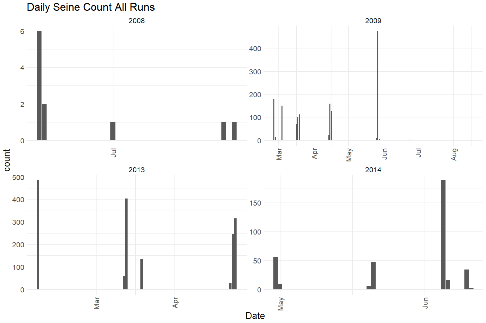
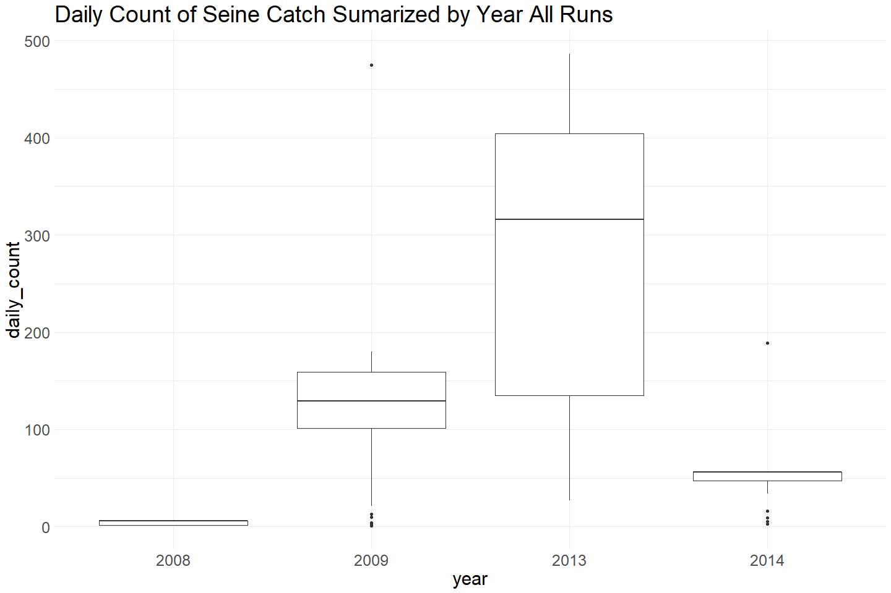
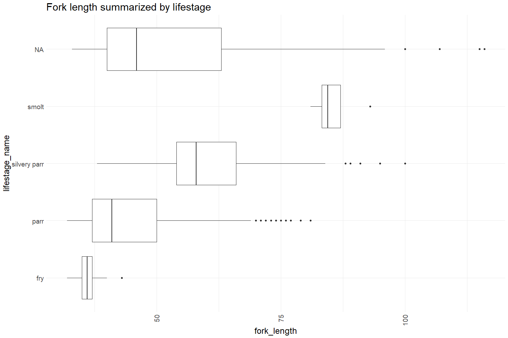
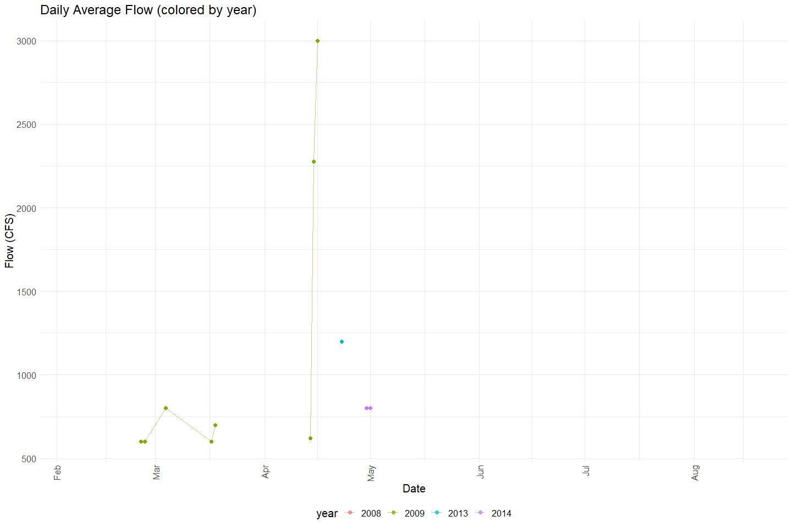
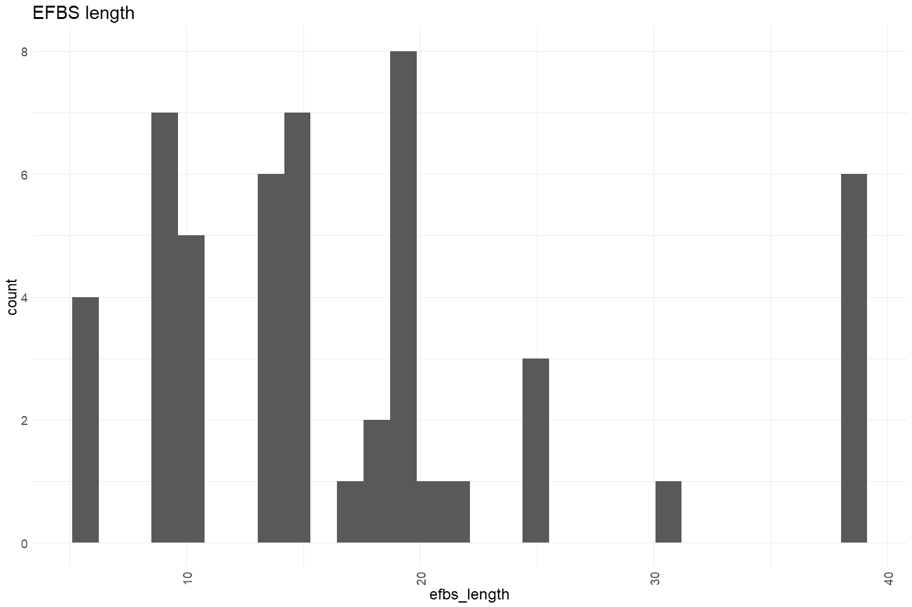
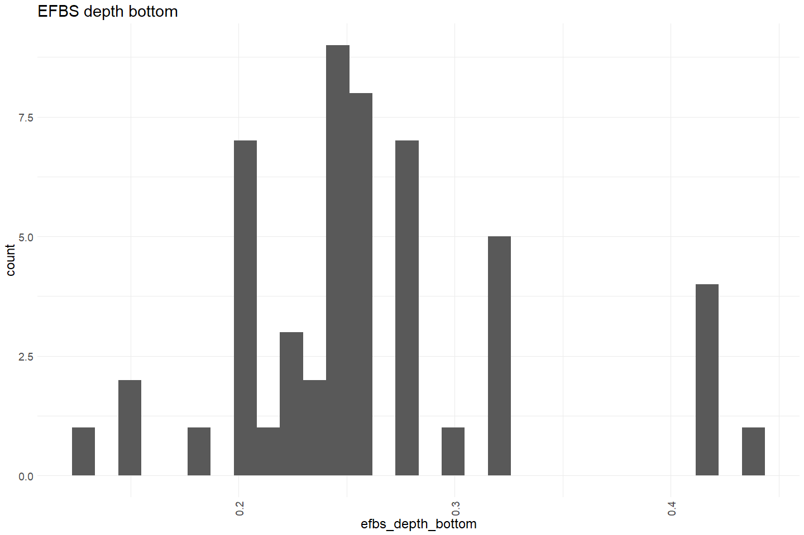

Feather River Seine Data 2008 - 2014 QC
================
Erin Cain
9/29/2021

# Feather River Seine and Snorkel Data

## Description of Monitoring Data

Feather River Seine data 2008 - 2014.

**Timeframe:** 2008 - 2014

**Seine Season:** Appears to be Feb - August (but not consistant across
years sampled)

**Completeness of Record throughout timeframe:**

No sampling occurred in the following years:

-   2010
-   2011
-   2012

**Sampling Location:** Feather River

**Data Contact:** [Casey Campos](mailto:Casey.Campos@water.ca.gov)

Any additional info?

## Access Cloud Data

``` r
# Run Sys.setenv() to specify GCS_AUTH_FILE and GCS_DEFAULT_BUCKET before running 
# getwd() to see how to specify paths 
# Open object from google cloud storage
# Set your authentication using gcs_auth
gcs_auth(json_file = Sys.getenv("GCS_AUTH_FILE"))
# Set global bucket 
gcs_global_bucket(bucket = Sys.getenv("GCS_DEFAULT_BUCKET"))
gcs_list_objects()
# git data and save as xlsx
gcs_get_object(object_name = 
                 "juvenile-rearing-monitoring/seine-and-snorkel-data/feather-river/data-raw/all_fields_seine_2008-2014.xlsx",
               bucket = gcs_get_global_bucket(),
               saveToDisk = "raw_seine_2008-2014.xlsx",
               overwrite = TRUE)
```

Read in data from google cloud, glimpse raw data and domain description
sheet:

``` r
# read in data to clean 
raw_seine_2008 <- read_xlsx("raw_seine_2008-2014.xlsx") %>% glimpse
```

    ## Rows: 5,552
    ## Columns: 46
    ## $ `SAMPLE ID`              <dbl> 50, 50, 52, 53, 53, 53, 53, 53, 53, 53, 53, 5~
    ## $ Species                  <chr> "SCP", "SCP", "None", "CHNF", "SASU", "SASU",~
    ## $ Count                    <dbl> 1, 1, 1, 1, 1, 1, 1, 1, 1, 1, 1, 1, 1, 1, 1, ~
    ## $ `Fork Length`            <dbl> NA, NA, NA, 88, 45, 47, 30, 35, 31, 28, 32, 4~
    ## $ `Total Length`           <dbl> 45, 38, NA, NA, NA, NA, NA, NA, NA, NA, NA, N~
    ## $ `Salmonid Life Stage`    <dbl> NA, NA, NA, 4, NA, NA, NA, NA, NA, NA, NA, NA~
    ## $ id                       <dbl> 71, 72, 73, 74, 75, 76, 77, 78, 79, 80, 81, 8~
    ## $ Dead                     <lgl> FALSE, FALSE, FALSE, FALSE, FALSE, FALSE, FAL~
    ## $ `Weight (g)`             <lgl> NA, NA, NA, NA, NA, NA, NA, NA, NA, NA, NA, N~
    ## $ `Site ID`                <dbl> 23, 23, 25, 24, 24, 24, 24, 24, 24, 24, 24, 2~
    ## $ Date                     <dttm> 2008-07-01, 2008-07-01, 2008-07-01, 2008-07-~
    ## $ Time                     <dttm> 1899-12-31 13:45:00, 1899-12-31 13:45:00, 18~
    ## $ GearCode                 <dbl> 5, 5, 5, 2, 2, 2, 2, 2, 2, 2, 2, 2, 2, 2, 2, ~
    ## $ ConditionCode            <dbl> 1, 1, 1, 1, 1, 1, 1, 1, 1, 1, 1, 1, 1, 1, 1, ~
    ## $ Temperature              <dbl> 21.50, 21.50, 21.89, 21.28, 21.28, 21.28, 21.~
    ## $ WeatherCode              <chr> "CLR", "CLR", "CLR", "CLR", "CLR", "CLR", "CL~
    ## $ Flow                     <dbl> NA, NA, NA, NA, NA, NA, NA, NA, NA, NA, NA, N~
    ## $ `EFBS Length`            <dbl> 5.79, 5.79, 6.10, NA, NA, NA, NA, NA, NA, NA,~
    ## $ `EFBS Width`             <dbl> 2.44, 2.44, 4.57, NA, NA, NA, NA, NA, NA, NA,~
    ## $ `EFBS Depth (Top)`       <dbl> 0.08, 0.08, 0.38, NA, NA, NA, NA, NA, NA, NA,~
    ## $ `EFBS Depth (Bottom)`    <dbl> 0.45, 0.45, 0.18, NA, NA, NA, NA, NA, NA, NA,~
    ## $ `EFBS Velocity (Top)`    <lgl> NA, NA, NA, NA, NA, NA, NA, NA, NA, NA, NA, N~
    ## $ `EFBS Velocity (Bottom)` <lgl> NA, NA, NA, NA, NA, NA, NA, NA, NA, NA, NA, N~
    ## $ `BS Start Length`        <dbl> NA, NA, NA, 11.9, 11.9, 11.9, 11.9, 11.9, 11.~
    ## $ `BS Close Width`         <dbl> NA, NA, NA, 2, 2, 2, 2, 2, 2, 2, 2, 2, 2, 2, ~
    ## $ `BS Distance Out`        <dbl> NA, NA, NA, 10.06, 10.06, 10.06, 10.06, 10.06~
    ## $ `BS Depth (1/2)`         <dbl> NA, NA, NA, 0.31, 0.31, 0.31, 0.31, 0.31, 0.3~
    ## $ `BS Depth (Full)`        <dbl> NA, NA, NA, 0.91, 0.91, 0.91, 0.91, 0.91, 0.9~
    ## $ `BS Velocity (1/2)`      <lgl> NA, NA, NA, NA, NA, NA, NA, NA, NA, NA, NA, N~
    ## $ `BS Velocity (Full)`     <lgl> NA, NA, NA, NA, NA, NA, NA, NA, NA, NA, NA, N~
    ## $ `Substrate 1`            <dbl> 2, 2, 3, 2, 2, 2, 2, 2, 2, 2, 2, 2, 2, 2, 2, ~
    ## $ `Substrate 2`            <dbl> 3, 3, NA, NA, NA, NA, NA, NA, NA, NA, NA, NA,~
    ## $ `Substrate 3`            <dbl> NA, NA, NA, NA, NA, NA, NA, NA, NA, NA, NA, N~
    ## $ `Cover 1`                <chr> "A", "A", "A", "A", "A", "A", "A", "A", "A", ~
    ## $ `Cover 2`                <chr> NA, NA, NA, NA, NA, NA, NA, NA, NA, NA, NA, N~
    ## $ `Cover 3`                <chr> NA, NA, NA, NA, NA, NA, NA, NA, NA, NA, NA, N~
    ## $ RPGRu                    <chr> "R", "R", "R", "run", "run", "run", "run", "r~
    ## $ GearHeight               <lgl> NA, NA, NA, NA, NA, NA, NA, NA, NA, NA, NA, N~
    ## $ `Dissolved Oxygen`       <lgl> NA, NA, NA, NA, NA, NA, NA, NA, NA, NA, NA, N~
    ## $ EC                       <lgl> NA, NA, NA, NA, NA, NA, NA, NA, NA, NA, NA, N~
    ## $ OBJECTID                 <dbl> 23, 23, 25, 24, 24, 24, 24, 24, 24, 24, 24, 2~
    ## $ LId                      <dbl> 0, 0, 0, 0, 0, 0, 0, 0, 0, 0, 0, 0, 0, 0, 0, ~
    ## $ site_name                <chr> "Hour side channel RL - Upstream", "Hour side~
    ## $ gear_type                <chr> "EF_SE", "EF_SE", "EF_SE", "SEIN", "SEIN", "S~
    ## $ x_coord                  <dbl> 618394.2, 618394.2, 618135.5, 618139.4, 61813~
    ## $ y_coord                  <dbl> 4364434, 4364434, 4363777, 4363967, 4363967, ~

## Data transformations

``` r
cleaner_seine_data <- raw_seine_2008 %>% 
  janitor::clean_names() %>% 
  rename("bs_depth_half" = bs_depth_1_2, 
         "lifestage" = salmonid_life_stage,
         "stream_features" = rpg_ru,
         "condition" = condition_code,
         "weather" = weather_code,
         "gear" = gear_code) %>%
  filter(species %in% c("CHN", "CHNF", "CHNFT", "CHNI",
                        "CHNL", "CHNS", "CHNST", "CHNT","CHNW")) %>%
  mutate(date = as.Date(date),
         time = hms::as_hms(time),
         weight_g = as.numeric(weight_g),
         sample_id = as.character(sample_id),
         id = as.character(id),
         condition = as.character(condition),
         gear = as.character(gear),
         lifestage = as.character(lifestage),
         substrate_1 = as.character(substrate_1), # Should I change these to the actual cover type ex: fine_substrate T/F values?
         substrate_2 = as.character(substrate_2),
         substrate_3 = as.character(substrate_3),
         run = case_when(species %in% c("CHNF", "CHNFT") ~ "fall",
                         species %in% c("CHNS", "CHNST") ~ "spring",
                         species == "CHNW" ~ "winter",
                         species == "CHNI" ~ "inland", 
                         species %in% c("CHN", "CHNT") ~ "unknown"),
         tagged = if_else(grepl('T$', species), TRUE, FALSE)) %>% 
  select(-dissolved_oxygen, -gear_height, -weight_g, # Remove because all values are NA
         -bs_velocity_full, -bs_velocity_1_2, - efbs_velocity_top, -efbs_velocity_bottom, 
         -species, # Remove species because we filtered for chinook so it is redundant
         -total_length, # Remove total length because only one value, and fork_length already measures size
         -site_id, -l_id, -objectid) %>% # Remove site_id/l_id/objectid because already joined with attributes relevant to these id (have site_name, lat/long)
  glimpse()
```

    ## Rows: 1,773
    ## Columns: 36
    ## $ sample_id         <chr> "53", "66", "67", "69", "69", "69", "70", "73", "75"~
    ## $ count             <dbl> 1, 1, 1, 1, 1, 1, 1, 1, 1, 1, 1, 1, 1, 1, 1, 1, 1, 1~
    ## $ fork_length       <dbl> 88, NA, NA, 59, 95, 89, 71, 54, 70, 80, 73, 37, 39, ~
    ## $ lifestage         <chr> "4", "4", "3", "3", "4", "4", "4", "3", "4", "4", NA~
    ## $ id                <chr> "74", "350", "379", "385", "386", "387", "421", "464~
    ## $ dead              <lgl> FALSE, FALSE, FALSE, FALSE, FALSE, FALSE, FALSE, FAL~
    ## $ date              <date> 2008-07-01, 2008-06-18, 2008-06-18, 2008-06-17, 200~
    ## $ time              <time> 13:30:00, 10:00:00, 09:30:00, 13:45:00, 13:45:00, 1~
    ## $ gear              <chr> "2", "5", "5", "5", "5", "5", "1", "1", "5", "1", "5~
    ## $ condition         <chr> "1", "1", "1", "1", "1", "1", "1", "1", "1", "2", "1~
    ## $ temperature       <dbl> 21.28, 17.00, 16.00, 17.83, 17.83, 17.83, NA, 18.00,~
    ## $ weather           <chr> "CLR", "CLR", "CLR", "CLR", "CLR", "CLR", "CLR", "CL~
    ## $ flow              <dbl> NA, NA, NA, NA, NA, NA, NA, NA, NA, NA, NA, 600, 600~
    ## $ efbs_length       <dbl> NA, 38.72, 18.29, 25.00, 25.00, 25.00, NA, NA, 17.00~
    ## $ efbs_width        <dbl> NA, 3.36, 3.11, 4.57, 4.57, 4.57, NA, NA, 3.30, NA, ~
    ## $ efbs_depth_top    <dbl> NA, 0.20, 0.19, 0.20, 0.20, 0.20, NA, NA, 0.20, NA, ~
    ## $ efbs_depth_bottom <dbl> NA, 0.21, 0.25, 0.26, 0.26, 0.26, NA, NA, 0.44, NA, ~
    ## $ bs_start_length   <dbl> 11.90, NA, NA, NA, NA, NA, 7.62, 7.50, NA, 7.62, NA,~
    ## $ bs_close_width    <dbl> 2, NA, NA, NA, NA, NA, 0, 1, NA, 1, NA, NA, NA, NA, ~
    ## $ bs_distance_out   <dbl> 10.06, NA, NA, NA, NA, NA, 8.23, 7.00, NA, 3.05, NA,~
    ## $ bs_depth_half     <dbl> 0.31, NA, NA, NA, NA, NA, 0.67, 0.42, NA, 0.60, NA, ~
    ## $ bs_depth_full     <dbl> 0.91, NA, NA, NA, NA, NA, 0.96, 0.62, NA, 0.60, NA, ~
    ## $ substrate_1       <chr> "2", "2", "2", "3", "3", "3", "1", "3", "2", "2", "2~
    ## $ substrate_2       <chr> NA, "3", "3", NA, NA, NA, NA, NA, NA, "1", "3", "2",~
    ## $ substrate_3       <chr> NA, NA, NA, NA, NA, NA, NA, NA, NA, NA, "4", NA, NA,~
    ## $ cover_1           <chr> "A", "B", "B", "B", "B", "B", "B", "A", "A", "B", "B~
    ## $ cover_2           <chr> NA, NA, NA, NA, NA, NA, NA, NA, NA, NA, "D", "F", "F~
    ## $ cover_3           <chr> NA, NA, "D", "D", "D", "D", NA, NA, NA, NA, "C", "D"~
    ## $ stream_features   <chr> "run", "R", "R", "R", "R", "R", "G", "R", "R", "G", ~
    ## $ ec                <lgl> NA, NA, NA, NA, NA, NA, NA, NA, NA, NA, NA, NA, NA, ~
    ## $ site_name         <chr> "Hour Main RL", "Steep Main RR - Upstream", "Steep M~
    ## $ gear_type         <chr> "SEIN", "EF_SE", "EF_SE", "EF_SE", "EF_SE", "EF_SE",~
    ## $ x_coord           <dbl> 618139.4, 620068.6, 620035.2, 620147.2, 620147.2, 62~
    ## $ y_coord           <dbl> 4363967, 4369081, 4369003, 4369087, 4369087, 4369087~
    ## $ run               <chr> "fall", "fall", "fall", "fall", "fall", "fall", "fal~
    ## $ tagged            <lgl> FALSE, FALSE, FALSE, FALSE, FALSE, FALSE, FALSE, FAL~

## Explore Numeric Variables:

``` r
cleaner_seine_data %>% select_if(is.numeric) %>% colnames()
```

    ##  [1] "count"             "fork_length"       "temperature"      
    ##  [4] "flow"              "efbs_length"       "efbs_width"       
    ##  [7] "efbs_depth_top"    "efbs_depth_bottom" "bs_start_length"  
    ## [10] "bs_close_width"    "bs_distance_out"   "bs_depth_half"    
    ## [13] "bs_depth_full"     "x_coord"           "y_coord"

### Variable: `count`

**Plotting Count over Period of Record**

``` r
cleaner_seine_data %>% 
  mutate(year = as.factor(year(date)),
         fake_year = if_else(month(date) %in% 10:12, 1900, 1901),
         fake_date = as.Date(paste0(fake_year,"-", month(date), "-", day(date)))) %>%
  ggplot(aes(x = fake_date, y = count)) + 
  geom_col() + 
  facet_wrap(~year(date), scales = "free") + 
  scale_x_date(labels = date_format("%b"), date_breaks = "1 month") + 
  theme_minimal() + 
  theme(text = element_text(size = 20),
        axis.text.x = element_text(angle = 90, vjust = 0.5, hjust=1)) + 
  labs(title = "Daily Seine Count All Runs", 
       x = "Date")  
```

<!-- -->

``` r
cleaner_seine_data %>% group_by(date) %>%
  mutate(daily_count_upstream = sum(count)) %>%
  mutate(year = as.factor(year(date))) %>% 
  ungroup() %>%
  ggplot(aes(x = year, y = daily_count_upstream)) + 
  geom_boxplot() + 
  theme_minimal() +
  theme(text = element_text(size = 23)) + 
  labs(title = "Daily Count of Seine Catch Sumarized by Year All Runs") 
```

<!-- -->

``` r
cleaner_seine_data  %>%
  mutate(year = as.factor(year(date))) %>%
  filter(run %in% c("fall", "spring", "winter")) %>% # Filter to only show runs that have more than one data point and are not NA/Unknown
  ggplot(aes(x = year, y = count)) + 
  geom_col() + 
  theme_minimal() +
  labs(title = "Total Yearly Fish Counts by Run",
       y = "Total fish count") + 
  theme(text = element_text(size = 18),
        axis.text.x = element_text(angle = 90, vjust = 0.5, hjust=1)) + 
  facet_grid(~run)
```

<!-- -->

Not a lot of spring run fish caught in comparison to fall run fish
caught.

**Numeric Summary of Count over Period of Record**

``` r
# daily numeric summary 
cleaner_seine_data %>% group_by(date) %>%
  summarise(daily_count = sum(count, na.rm = T)) %>%
  pull(daily_count) %>%
  summary()
```

    ##    Min. 1st Qu.  Median    Mean 3rd Qu.    Max. 
    ##    1.00    3.75   30.50   96.56  139.00  486.00

``` r
# daily numeric summary SR
cleaner_seine_data %>% 
  filter(run == "spring") %>%
  group_by(date) %>%
  summarise(daily_count = sum(count, na.rm = T)) %>%
  pull(daily_count) %>%
  summary()
```

    ##    Min. 1st Qu.  Median    Mean 3rd Qu.    Max. 
    ##    1.00    1.25    2.00   20.33    2.75  113.00

**NA and Unknown Values**

-   0 % of values in the `count` column are NA. However, there are
    clearly gaps in data.

### Variable: `fork_length`

**Plotting fork\_length over Period of Record**

``` r
cleaner_seine_data %>%  
  ggplot(aes(x = fork_length)) + 
  geom_histogram(breaks=seq(0, 200, by=2)) + 
  scale_x_continuous(breaks=seq(0, 200, by=25)) +
  theme_minimal() +
  labs(title = "Fork length distribution") + 
  theme(text = element_text(size = 18),
        axis.text.x = element_text(angle = 90, vjust = 0.5, hjust=1)) 
```

<!-- -->

``` r
lifestage_code <- c(1, 2, 3, 4, 5, 6, 7, 8)
names(lifestage_code)  <- c("yolk-sac fry", "fry", "parr", "silvery parr", "smolt", "adult", "not provided", NA)

cleaner_seine_data %>% 
  mutate(year = as.factor(year(date)),
         lifestage_name = names(lifestage_code[as.numeric(lifestage)])) %>%
  ggplot(aes(x = fork_length, y = lifestage_name)) + 
  geom_boxplot() + 
  theme_minimal() +
  labs(title = "Fork length summarized by lifestage") + 
  theme(text = element_text(size = 18),
        axis.text.x = element_text(angle = 90, vjust = 0.5, hjust=1)) 
```

<!-- -->

**Numeric Summary of fork\_length over Period of Record**

``` r
summary(cleaner_seine_data$fork_length)
```

    ##    Min. 1st Qu.  Median    Mean 3rd Qu.    Max.    NA's 
    ##   32.00   39.00   45.00   49.66   58.00  116.00      33

**NA and Unknown Values**

-   1.9 % of values in the `fork_length` column are NA.

### Variable: `temperature`

**Plotting temperature over Period of Record**

Daily average water temperature measures appear to be lower in Feb -
April and then increase May - August. They appear to typically range
from 9 - 23 degrees C.

``` r
cleaner_seine_data %>% 
  group_by(date = as.Date(date)) %>%
  mutate(avg_temp = mean(temperature)) %>%
  ungroup() %>%
  mutate(year = as.factor(year(date)),
         fake_year = if_else(month(date) %in% 10:12, 1900, 1901),
         fake_date = as.Date(paste0(fake_year,"-", month(date), "-", day(date)))) %>%
  ggplot(aes(x = fake_date, y = avg_temp, color = year)) + 
  geom_point(alpha = .25) + 
  # facet_wrap(~year(date), scales = "free") + 
  scale_x_date(labels = date_format("%b"), date_breaks = "1 month") + 
  theme_minimal() + 
  theme(text = element_text(size = 15),
        axis.text.x = element_text(angle = 90, vjust = 0.5, hjust=1),
        legend.position = "bottom") + 
  labs(title = "Daily Water Temperature (colored by year)",
       y = "Average daily temp", 
       x = "Date")  
```

<!-- -->

**Plotting Distribution of temperature measures**

``` r
cleaner_seine_data %>%  
  ggplot(aes(x = temperature)) + 
  geom_histogram() + 
  scale_x_continuous() +
  theme_minimal() +
  labs(title = "Temperature distribution (celcius)") + 
  theme(text = element_text(size = 18),
        axis.text.x = element_text(angle = 90, vjust = 0.5, hjust=1)) 
```

    ## `stat_bin()` using `bins = 30`. Pick better value with `binwidth`.

<!-- -->

**Numeric Summary of flow over Period of Record**

``` r
# Table with summary statistics
summary(cleaner_seine_data$temperature)
```

    ##    Min. 1st Qu.  Median    Mean 3rd Qu.    Max.    NA's 
    ##    9.00   11.00   13.00   12.92   14.50   21.50     370

**NA and Unknown Values**

-   20.9 % of values in the `temperature` column are NA.

### Variable: `flow`

**Plotting flow over Period of Record**

``` r
cleaner_seine_data %>% 
  group_by(date = as.Date(date)) %>%
  mutate(avg_flow = mean(flow)) %>%
  ungroup() %>%
  mutate(year = as.factor(year(date)),
         fake_year = if_else(month(date) %in% 10:12, 1900, 1901),
         fake_date = as.Date(paste0(fake_year,"-", month(date), "-", day(date)))) %>%
  ggplot(aes(x = fake_date, y = avg_flow, color = year)) + 
  geom_point(alpha = .75) + 
  geom_line(alpha = .25) + 
  # facet_wrap(~year(date), scales = "free") + 
  scale_x_date(labels = date_format("%b"), date_breaks = "1 month") + 
  theme_minimal() + 
  theme(text = element_text(size = 15),
        axis.text.x = element_text(angle = 90, vjust = 0.5, hjust=1),
        legend.position = "bottom") + 
  labs(title = "Daily Average Flow (colored by year)",
       y = "Flow (CFS)", 
       x = "Date")  
```

<!-- -->

Flow measurements are not taken frequently. It looks like about \~ 1 - 8
days out of the year.

``` r
cleaner_seine_data %>%  
  ggplot(aes(x = flow)) + 
  geom_histogram() + 
  scale_x_continuous() +
  theme_minimal() +
  labs(title = "Flow distribution (cfs)") +  
  theme(text = element_text(size = 18),
        axis.text.x = element_text(angle = 90, vjust = 0.5, hjust=1)) 
```

    ## `stat_bin()` using `bins = 30`. Pick better value with `binwidth`.

<!-- -->

**Numeric Summary of temperature over Period of Record**

``` r
summary(cleaner_seine_data$flow)
```

    ##    Min. 1st Qu.  Median    Mean 3rd Qu.    Max.    NA's 
    ##     600     600     800    1387    2500    3000     873

**NA and Unknown Values**

-   49.2 % of values in the `flow` column are NA.

### Variable: `temperature`

**Plotting temperature over Period of Record**

Daily average water temperature measures appear to be lower in Feb -
April and then increase May - August. They appear to typically range
from 9 - 23 degrees C.

``` r
cleaner_seine_data %>% 
  group_by(date = as.Date(date)) %>%
  mutate(avg_temp = mean(temperature)) %>%
  ungroup() %>%
  mutate(year = as.factor(year(date)),
         fake_year = if_else(month(date) %in% 10:12, 1900, 1901),
         fake_date = as.Date(paste0(fake_year,"-", month(date), "-", day(date)))) %>%
  ggplot(aes(x = fake_date, y = avg_temp, color = year)) + 
  geom_point(alpha = .25) + 
  # facet_wrap(~year(date), scales = "free") + 
  scale_x_date(labels = date_format("%b"), date_breaks = "1 month") + 
  theme_minimal() + 
  theme(text = element_text(size = 15),
        axis.text.x = element_text(angle = 90, vjust = 0.5, hjust=1),
        legend.position = "bottom") + 
  labs(title = "Daily Water Temperature (colored by year)",
       y = "Average daily temp", 
       x = "Date")  
```

<!-- -->

**Plotting Distribution of temperature measures**

``` r
cleaner_seine_data %>%  
  ggplot(aes(x = temperature)) + 
  geom_histogram() + 
  scale_x_continuous() +
  theme_minimal() +
  labs(title = "Temperature distribution (celcius)") + 
  theme(text = element_text(size = 18),
        axis.text.x = element_text(angle = 90, vjust = 0.5, hjust=1)) 
```

    ## `stat_bin()` using `bins = 30`. Pick better value with `binwidth`.

<!-- -->

**Numeric Summary of temperature over Period of Record**

``` r
# Table with summary statistics
summary(cleaner_seine_data$temperature)
```

    ##    Min. 1st Qu.  Median    Mean 3rd Qu.    Max.    NA's 
    ##    9.00   11.00   13.00   12.92   14.50   21.50     370

**NA and Unknown Values**

-   20.9 % of values in the `temperature` column are NA.

### Variable: `efbs_length`

**Plotting efbs\_length distribution**

``` r
cleaner_seine_data %>%  
  ggplot(aes(x = efbs_length)) + 
  geom_histogram() + 
  scale_x_continuous() +
  theme_minimal() +
  labs(title = "EFBS length") +  
  theme(text = element_text(size = 18),
        axis.text.x = element_text(angle = 90, vjust = 0.5, hjust=1)) 
```

    ## `stat_bin()` using `bins = 30`. Pick better value with `binwidth`.

<!-- -->

**Numeric Summary of efbs\_length over Period of Record**

``` r
summary(cleaner_seine_data$efbs_length)
```

    ##    Min. 1st Qu.  Median    Mean 3rd Qu.    Max.    NA's 
    ##    6.10   10.06   14.63   17.56   19.21   39.00    1721

**NA and Unknown Values**

-   97.1 % of values in the `efbs_length` column are NA.

### Variable: `efbs_width`

**Plotting efbs\_width distribution**

``` r
cleaner_seine_data %>%  
  ggplot(aes(x = efbs_width)) + 
  geom_histogram() + 
  scale_x_continuous() +
  theme_minimal() +
  labs(title = "EFBS width") +  
  theme(text = element_text(size = 18),
        axis.text.x = element_text(angle = 90, vjust = 0.5, hjust=1)) 
```

    ## `stat_bin()` using `bins = 30`. Pick better value with `binwidth`.

<!-- -->

**Numeric Summary of efbs\_width over Period of Record**

``` r
summary(cleaner_seine_data$efbs_width)
```

    ##    Min. 1st Qu.  Median    Mean 3rd Qu.    Max.    NA's 
    ##   1.830   2.665   3.350   3.199   3.660   6.400    1721

**NA and Unknown Values**

-   97.1 % of values in the `efbs_width` column are NA.

### Variable: `efbs_depth_top`

**Plotting efbs\_depth\_top distribution**

``` r
cleaner_seine_data %>%  
  ggplot(aes(x = efbs_depth_top)) + 
  geom_histogram() + 
  scale_x_continuous() +
  theme_minimal() +
  labs(title = "EFBS Depth Top") +  
  theme(text = element_text(size = 18),
        axis.text.x = element_text(angle = 90, vjust = 0.5, hjust=1)) 
```

    ## `stat_bin()` using `bins = 30`. Pick better value with `binwidth`.

<!-- -->

**Numeric Summary of efbs\_depth\_top over Period of Record**

``` r
summary(cleaner_seine_data$flow)
```

    ##    Min. 1st Qu.  Median    Mean 3rd Qu.    Max.    NA's 
    ##     600     600     800    1387    2500    3000     873

**NA and Unknown Values**

-   97.1 % of values in the `efbs_depth_top` column are NA.

### Variable: `efbs_depth_bottom`

**Plotting efbs\_depth\_bottom distribution**

``` r
cleaner_seine_data %>%  
  ggplot(aes(x = efbs_depth_bottom)) + 
  geom_histogram() + 
  scale_x_continuous() +
  theme_minimal() +
  labs(title = "EFBS depth bottom") +  
  theme(text = element_text(size = 18),
        axis.text.x = element_text(angle = 90, vjust = 0.5, hjust=1)) 
```

    ## `stat_bin()` using `bins = 30`. Pick better value with `binwidth`.

<!-- -->

**Numeric Summary of efbs\_depth\_bottom over Period of Record**

``` r
summary(cleaner_seine_data$efbs_depth_bottom)
```

    ##    Min. 1st Qu.  Median    Mean 3rd Qu.    Max.    NA's 
    ##  0.1300  0.2200  0.2550  0.2629  0.2800  0.4400    1721

**NA and Unknown Values**

-   97.1 % of values in the `efbs_depth_bottom` column are NA.

### Variable: `bs_start_length`

**Plotting bs\_start\_length distribution**

``` r
cleaner_seine_data %>%  
  ggplot(aes(x = bs_start_length)) + 
  geom_histogram() + 
  scale_x_continuous() +
  theme_minimal() +
  labs(title = "Beach Seine Start length") +  
  theme(text = element_text(size = 18),
        axis.text.x = element_text(angle = 90, vjust = 0.5, hjust=1)) 
```

    ## `stat_bin()` using `bins = 30`. Pick better value with `binwidth`.

<!-- -->

**Numeric Summary of bs\_start\_length over Period of Record**

``` r
summary(cleaner_seine_data$bs_start_length)
```

    ##    Min. 1st Qu.  Median    Mean 3rd Qu.    Max.    NA's 
    ##    4.57   11.89   15.00   19.19   24.39   83.23     210

**NA and Unknown Values**

-   11.8 % of values in the `bs_start_length` column are NA.

### Variable: `bs_close_width`

**Plotting bs\_close\_width distribution**

``` r
cleaner_seine_data %>%  
  ggplot(aes(x = bs_close_width)) + 
  geom_histogram() + 
  scale_x_continuous() +
  theme_minimal() +
  labs(title = "Beach Seine Close Width") +  
  theme(text = element_text(size = 18),
        axis.text.x = element_text(angle = 90, vjust = 0.5, hjust=1)) 
```

    ## `stat_bin()` using `bins = 30`. Pick better value with `binwidth`.

<!-- -->

**Numeric Summary of bs\_close\_width over Period of Record**

``` r
summary(cleaner_seine_data$bs_close_width)
```

    ##    Min. 1st Qu.  Median    Mean 3rd Qu.    Max.    NA's 
    ##   0.000   1.000   1.000   1.605   2.000  10.000    1004

**NA and Unknown Values**

-   56.6 % of values in the `bs_close_width` column are NA.

### Variable: `bs_distance_out`

**Plotting bs\_distance\_out distribution**

``` r
cleaner_seine_data %>%  
  ggplot(aes(x = bs_distance_out)) + 
  geom_histogram() + 
  scale_x_continuous() +
  theme_minimal() +
  labs(title = "Beach Seine distance out") +  
  theme(text = element_text(size = 18),
        axis.text.x = element_text(angle = 90, vjust = 0.5, hjust=1)) 
```

    ## `stat_bin()` using `bins = 30`. Pick better value with `binwidth`.

<!-- -->

**Numeric Summary of bs\_distance\_out over Period of Record**

``` r
summary(cleaner_seine_data$bs_distance_out)
```

    ##    Min. 1st Qu.  Median    Mean 3rd Qu.    Max.    NA's 
    ##   1.830   6.710   9.760   8.743  10.500  18.290     261

**NA and Unknown Values**

-   14.7 % of values in the `bs_distance_out` column are NA.

### Variable: `bs_depth_half`

**Plotting bs\_depth\_half distribution**

``` r
cleaner_seine_data %>%  
  ggplot(aes(x = bs_depth_half)) + 
  geom_histogram() + 
  scale_x_continuous() +
  theme_minimal() +
  labs(title = "Beach Seine half depth") +  
  theme(text = element_text(size = 18),
        axis.text.x = element_text(angle = 90, vjust = 0.5, hjust=1)) 
```

    ## `stat_bin()` using `bins = 30`. Pick better value with `binwidth`.

<!-- -->

**Numeric Summary of bs\_depth\_half over Period of Record**

``` r
summary(cleaner_seine_data$bs_depth_half)
```

    ##    Min. 1st Qu.  Median    Mean 3rd Qu.    Max.    NA's 
    ##  0.2300  0.4800  0.6200  0.6016  0.7000  0.8800     361

**NA and Unknown Values**

-   20.4 % of values in the `bs_depth_half` column are NA.

### Variable: `bs_depth_full`

**Plotting bs\_depth\_full distribution**

``` r
cleaner_seine_data %>%  
  ggplot(aes(x = bs_depth_full)) + 
  geom_histogram() + 
  scale_x_continuous() +
  theme_minimal() +
  labs(title = "Beach Seine full depth") +  
  theme(text = element_text(size = 18),
        axis.text.x = element_text(angle = 90, vjust = 0.5, hjust=1)) 
```

    ## `stat_bin()` using `bins = 30`. Pick better value with `binwidth`.

<!-- -->

**Numeric Summary of bs\_depth\_full over Period of Record**

``` r
summary(cleaner_seine_data$bs_depth_full)
```

    ##    Min. 1st Qu.  Median    Mean 3rd Qu.    Max.    NA's 
    ##  0.4200  0.6800  0.7800  0.7957  0.9000  1.6000     307

**NA and Unknown Values**

-   17.3 % of values in the `bs_depth_full` column are NA.

### Variable: `x_coord`, `y_coord`

These are the location columns. TODO

``` r
# Check that they are in consistent format
# Map
```

**NA and Unknown Values**

-   58.9 % of values in the `x_coord` column are NA.
-   58.9 % of values in the `y_coord` column are NA.

## Explore Categorical variables:

General notes: If there is an opportunity to turn yes no into boolean do
so, but not if you loose value

``` r
cleaner_seine_data %>% select_if(is.character) %>% colnames()
```

    ##  [1] "sample_id"       "lifestage"       "id"              "gear"           
    ##  [5] "condition"       "weather"         "substrate_1"     "substrate_2"    
    ##  [9] "substrate_3"     "cover_1"         "cover_2"         "cover_3"        
    ## [13] "stream_features" "site_name"       "gear_type"       "run"

### Variable: `sample_id`, `id`

``` r
length(unique(cleaner_seine_data$id)) == nrow(cleaner_seine_data)
```

    ## [1] TRUE

Each id is unique as anticipated.

Each `sample_id` is not unique because multiple catches can occur in the
same beach seine sample.

``` r
length(unique(cleaner_seine_data$sample_id)) == nrow(cleaner_seine_data)
```

    ## [1] FALSE

**NA and Unknown Values**

No na values \* 0 % of values in the `sample_id` column are NA. \* 0 %
of values in the `id` column are NA.

### Variable: `lifestage`

``` r
table(cleaner_seine_data$lifestage)
```

    ## 
    ##   2   3   4   5 
    ##  31 673 155   4

Fix inconsistencies with spelling, capitalization, and abbreviations.

``` r
lifestage_code <- c(1, 2, 3, 4, 5, 6, 7)
names(lifestage_code)  <- c("yolk-sac fry", "fry", "parr", "silvery parr", "smolt", "adult", "not provided")

cleaner_seine_data$lifestage <- names(lifestage_code[as.numeric(cleaner_seine_data$lifestage)])
cleaner_seine_data$lifestage <- ifelse(cleaner_seine_data$lifestage == "not provided", NA, cleaner_seine_data$lifestage) # Change not provided to NA

table(cleaner_seine_data$lifestage)
```

    ## 
    ##          fry         parr silvery parr        smolt 
    ##           31          673          155            4

**Create lookup rda for \[variable\] encoding:**

**NA and Unknown Values**

-   51.3 % of values in the `lifestage` column are NA.

### Variable: `gear`

``` r
table(cleaner_seine_data$gear)
```

    ## 
    ##   1   2   3   5 
    ## 382 478 861  52

Fix inconsistencies with spelling, capitalization, and abbreviations.
Update gear codes with gear names:

-   SEIN25 - Gear description 25 foot beach seine with bag
-   SEIN50 - Gear description 25 foot beach seine with bag

``` r
cleaner_seine_data$gear <- case_when(cleaner_seine_data$gear == "1" ~ "SEIN25",
                                          cleaner_seine_data$gear == "3" ~ "SEIN50")

table(cleaner_seine_data$gear)
```

    ## 
    ## SEIN25 SEIN50 
    ##    382    861

**NA and Unknown Values**

-   29.9 % of values in the `gear` column are NA.

### Variable: `condition`

``` r
table(cleaner_seine_data$condition)
```

    ## 
    ##    1    2    3 
    ## 1741    9   23

Fix inconsistencies with spelling, capitalization, and abbreviations.

Descriptions:

-   Good - The haul went smoothly without getting hung up on anything or
    net rolling.
-   Fair - The haul went relatively smoothly, but you had to stop once
    or twice to get it unsnagged or take big rocks out of the net.
-   Poor - The haul didn’t go well; you had to stop numerous times while
    the poles were still a good distance from the shore to free the
    seine from snags or big rocks.

All other values (0, 4) corresond to NA

``` r
cleaner_seine_data$condition <- case_when(cleaner_seine_data$condition == "1" ~ "good",
                                               cleaner_seine_data$condition == "2" ~ "fair",
                                               cleaner_seine_data$condition == "3" ~ "poor")


table(cleaner_seine_data$condition)
```

    ## 
    ## fair good poor 
    ##    9 1741   23

**NA and Unknown Values**

-   0 % of values in the `condition` column are NA.

### Variable: `weather`

``` r
table(cleaner_seine_data$weather)
```

    ## 
    ##  CLD  CLR 
    ##  199 1574

Fix inconsistencies with spelling, capitalization, and abbreviations.

``` r
cleaner_seine_data$weather <- case_when(cleaner_seine_data$weather == "CLD" ~ "overcast",
                                             cleaner_seine_data$weather == "CLR" ~ "sunny",
                                             cleaner_seine_data$weather == "FOG" ~ "foggy",
                                             cleaner_seine_data$weather == "RAN" ~ "precipitation")


table(cleaner_seine_data$weather)
```

    ## 
    ## overcast    sunny 
    ##      199     1574

**NA and Unknown Values**

-   0 % of values in the `weather_code` column are NA.

### Variable: `substrate_1`, `substrate_2`, `substrate_3`

TODO fix substrate stuff

| SubstrateCode | Substrate                                   |
|---------------|---------------------------------------------|
| 1             | Fine - small gravel (0-50mm) (0-2in.)       |
| 2             | Small - medium gravel (50-150mm) (2-6in.)   |
| 3             | Medium - large cobble (150-300mm) (6-12in.) |
| 4             | Boulder (&gt;300mm) (&gt;12in.)             |
| 5             | Pavement (Boat Ramp)                        |

``` r
table(cleaner_seine_data$substrate_1)
```

    ## 
    ##   1   2   3 
    ## 788 765 220

``` r
table(cleaner_seine_data$substrate_2)
```

    ## 
    ##   1   2   3   4   5 
    ##   1 358 486  94   8

``` r
table(cleaner_seine_data$substrate_3)
```

    ## 
    ##  3  4 
    ## 27 61

Fix inconsistencies with spelling, capitalization, and abbreviations.

**NA and Unknown Values**

-   0 % of values in the `substrate_1` column are NA.
-   46.6 % of values in the `substrate_2` column are NA.
-   95 % of values in the `substrate_3` column are NA.

### Variable: `cover_1`, `cover_2`, `cover_3`

TODO fix cover stuff

``` r
table(cleaner_seine_data$cover_1)
```

    ## 
    ##   A   B   C   D   E   F 
    ## 782 573   7  29 377   5

``` r
table(cleaner_seine_data$cover_2)
```

    ## 
    ##  D  E  F 
    ##  1 71  5

``` r
table(cleaner_seine_data$cover_3)
```

    ## 
    ##   B   C   D   E   F 
    ##  53  20  31 468 117

**Create lookup rda for cover encoding:**

``` r
feather_seine_cover <- c("A", "B", "C", "D", "E", "BD", "DE" )
names(feather_seine_cover) <- c("no apparent cover",
"small instream objects",
"large instream objects",
"overhead objects",
"submerged aquatic vegetation",
"small instream objects and overhead objects",
"overhead objects and submerged aquatic vegetation")

tibble(code = feather_seine_cover, 
       definitions = names(feather_seine_cover))
```

    ## # A tibble: 7 x 2
    ##   code  definitions                                      
    ##   <chr> <chr>                                            
    ## 1 A     no apparent cover                                
    ## 2 B     small instream objects                           
    ## 3 C     large instream objects                           
    ## 4 D     overhead objects                                 
    ## 5 E     submerged aquatic vegetation                     
    ## 6 BD    small instream objects and overhead objects      
    ## 7 DE    overhead objects and submerged aquatic vegetation

``` r
# write_rds(feather_seine_cover, "../../../data/feather_seine_cover.rds")
```

**NA and Unknown Values**

-   0 % of values in the `cover_1` column are NA.
-   95.7 % of values in the `cover_2` column are NA.
-   61.1 % of values in the `cover_3` column are NA.

### Variable: `stream_features`

``` r
table(cleaner_seine_data$stream_features)
```

    ## 
    ##   G   P   R  RU run 
    ## 437 588 417 330   1

**Create lookup rda for stream\_features encoding:**

``` r
cleaner_seine_data$stream_features <- ifelse(cleaner_seine_data$stream_features == "run", "RU", cleaner_seine_data$stream_features)
feather_seine_stream_features <- c("G", "GP", "GR", "GRRU", "GRU", "P", "PRU", "R", "RRU", "RU")
names(feather_seine_stream_features) <- c( "Glide", "Glide & Pool", "Glide & Riffle", "Glide & Riffle & Run", "Glide & Run", "Pool",
                                           "Pool & Run", "Riffle", "Riffle & Run", "Run")

tibble(code = feather_seine_stream_features, 
       definitions = names(feather_seine_stream_features))
```

    ## # A tibble: 10 x 2
    ##    code  definitions         
    ##    <chr> <chr>               
    ##  1 G     Glide               
    ##  2 GP    Glide & Pool        
    ##  3 GR    Glide & Riffle      
    ##  4 GRRU  Glide & Riffle & Run
    ##  5 GRU   Glide & Run         
    ##  6 P     Pool                
    ##  7 PRU   Pool & Run          
    ##  8 R     Riffle              
    ##  9 RRU   Riffle & Run        
    ## 10 RU    Run

``` r
# write_rds(feather_seine_stream_features, "../../../data/feather_seine_stream_features.rds")
```

**NA and Unknown Values**

-   0 % of values in the `stream_features` column are NA.

### Variable: `site_name`

``` r
table(cleaner_seine_data$site_name)
```

    ## 
    ##                 Above G95 SC - RR                  Aleck-lunch spot 
    ##                                 1                                26 
    ##         Auditorium RL -Downstream        Auditorium RR - Downstream 
    ##                                75                                 1 
    ##        Auditoruim RR - Downstream            Bedrock Park Backwater 
    ##                                19                               256 
    ##                   Bedrock Park RL Between Steep and Eye (Wier Site) 
    ##                                 6                               105 
    ##                        Big Riffle    Boyds Bump Boat Launch- Across 
    ##                                 6                                45 
    ## Boyds Pump-  1 mile Downstream RL                               Cox 
    ##                                66                                40 
    ##                       Eye Main RL          Eye Main RR - Downstream 
    ##                                 1                                 1 
    ##            Eye Main RR - Upstream                  Eye side channel 
    ##                                 1                                 6 
    ##         Eye side channel - Bottom                 G95 Downstream RL 
    ##                                28                                 7 
    ##                        G95 SC  RR                         G95 SC RL 
    ##                                26                               136 
    ##                 G95 Upper Main RR                           Gateway 
    ##                                52                                18 
    ##                      Gridley-Side      Gridley Riffle RR Downstream 
    ##                                 2                                 1 
    ##                    Hatchery Ditch                      Hour Main RL 
    ##                                41                                 1 
    ##         Hour Main RL - Downstream       Hour side channel Backwater 
    ##                                20                                 8 
    ##   Hour side channel RL - Upstream                 Junkyard Above RR 
    ##                                33                                 2 
    ##                    Junkyard SC RR      Junkyard side channel 1 - RR 
    ##                                46                                15 
    ##      Junkyard side channel 2 - RL                           Kiester 
    ##                                42                                 3 
    ## Live Oak - Downstream Boat Launch              Live Oak Boat Launch 
    ##                                71                                 8 
    ##     Live Oak Upstream Boat Launch            McFarland Backwater RL 
    ##                                51                                 2 
    ##            McFarland Backwater RR               McFarland Main - RR 
    ##                               231                                 8 
    ##      McFarland Main RR - Upstream                   Steep Backwater 
    ##                                 1                                39 
    ##        Steep Main RR - Downstream          Steep Main RR - Upstream 
    ##                                 4                                 9 
    ##                Steep side channel   Steep side channel - Downstream 
    ##                                 2                                 8 
    ##     Steep side channel - Upstream                Vance East Main RR 
    ##                               160                                43

Fix inconsistencies with spelling, capitalization, and abbreviations.

``` r
format_site_name <- function(string) {
  clean <- str_replace_all(string, "1/2", "half") %>%
    str_replace_all("1/4", "quarter") %>%
    str_replace_all("S.C.", "SC") %>%
    str_replace_all("'", "") %>%
    str_replace_all("G-95", "G95") %>% 
    str_replace_all("Isl", "Island") %>%
    str_replace_all("[^[:alnum:]]", " ") %>% 
    trimws() %>% 
    stringr::str_squish() %>%
    stringr::str_to_title()
}

cleaner_seine_data$site_name <- format_site_name(cleaner_seine_data$site_name)
table(cleaner_seine_data$site_name)
```

    ## 
    ##                 Above G95 Sc Rr                Aleck Lunch Spot 
    ##                               1                              26 
    ##        Auditorium Rl Downstream        Auditorium Rr Downstream 
    ##                              75                               1 
    ##        Auditoruim Rr Downstream          Bedrock Park Backwater 
    ##                              19                             256 
    ##                 Bedrock Park Rl Between Steep And Eye Wier Site 
    ##                               6                             105 
    ##                      Big Riffle   Boyds Bump Boat Launch Across 
    ##                               6                              45 
    ## Boyds Pump 1 Mile Downstream Rl                             Cox 
    ##                              66                              40 
    ##                     Eye Main Rl          Eye Main Rr Downstream 
    ##                               1                               1 
    ##            Eye Main Rr Upstream                Eye Side Channel 
    ##                               1                               6 
    ##         Eye Side Channel Bottom               G95 Downstream Rl 
    ##                              28                               7 
    ##                       G95 Sc Rl                       G95 Sc Rr 
    ##                             136                              26 
    ##               G95 Upper Main Rr                         Gateway 
    ##                              52                              18 
    ##    Gridley Riffle Rr Downstream                    Gridley Side 
    ##                               1                               2 
    ##                  Hatchery Ditch                    Hour Main Rl 
    ##                              41                               1 
    ##         Hour Main Rl Downstream     Hour Side Channel Backwater 
    ##                              20                               8 
    ##   Hour Side Channel Rl Upstream               Junkyard Above Rr 
    ##                              33                               2 
    ##                  Junkyard Sc Rr      Junkyard Side Channel 1 Rr 
    ##                              46                              15 
    ##      Junkyard Side Channel 2 Rl                         Kiester 
    ##                              42                               3 
    ##            Live Oak Boat Launch Live Oak Downstream Boat Launch 
    ##                               8                              71 
    ##   Live Oak Upstream Boat Launch          Mcfarland Backwater Rl 
    ##                              51                               2 
    ##          Mcfarland Backwater Rr               Mcfarland Main Rr 
    ##                             231                               8 
    ##      Mcfarland Main Rr Upstream                 Steep Backwater 
    ##                               1                              39 
    ##        Steep Main Rr Downstream          Steep Main Rr Upstream 
    ##                               4                               9 
    ##              Steep Side Channel   Steep Side Channel Downstream 
    ##                               2                               8 
    ##     Steep Side Channel Upstream              Vance East Main Rr 
    ##                             160                              43

**NA and Unknown Values**

-   0 % of values in the `site_name` column are NA.

### Variable: `gear_type`

There are two distinct gear types:

-   SEIN: standard seine
-   EF\_SE: backpack shock into any seine

``` r
table(cleaner_seine_data$gear_type)
```

    ## 
    ## EF_SE  SEIN 
    ##    74  1699

**NA and Unknown Values**

-   0 % of values in the `seine` column are NA.

### Variable: `run`

``` r
table(cleaner_seine_data$run)
```

    ## 
    ##    fall  spring unknown 
    ##    1034      10     719

Fix inconsistencies with spelling, capitalization, and abbreviations.

``` r
cleaner_seine_data$run <- ifelse(cleaner_seine_data$run  == "unknown", NA, cleaner_seine_data$run)
table(cleaner_seine_data$run)
```

    ## 
    ##   fall spring 
    ##   1034     10

**NA and Unknown Values**

-   41.1 % of values in the `run` column are NA.

## Summary of identified issues

-   Not a lot of days sampled per year
-   Only 10 rows that include spring data.

## Save cleaned data back to google cloud

``` r
# Write to google cloud 
# Name file [watershed]_[data type].csv
```
