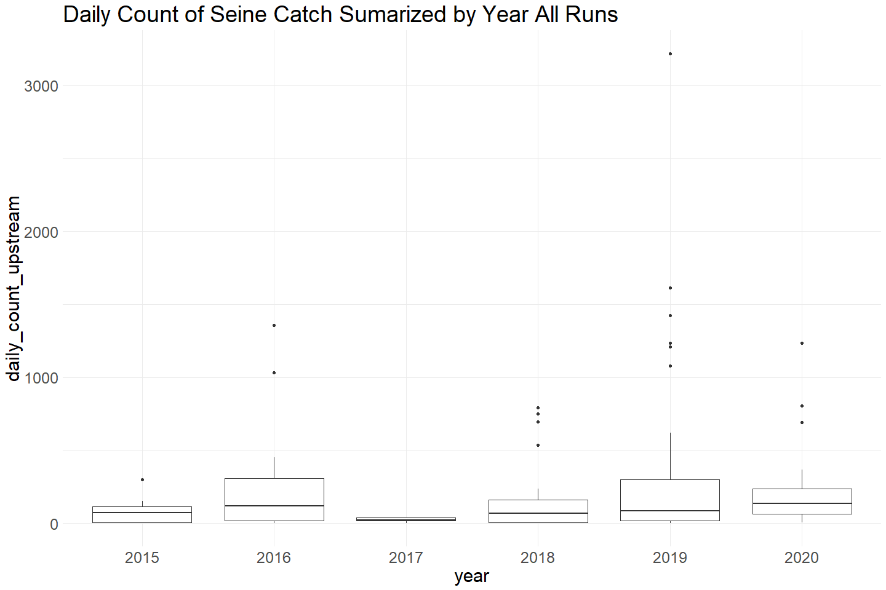
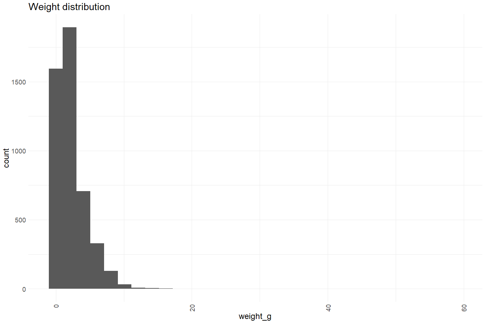
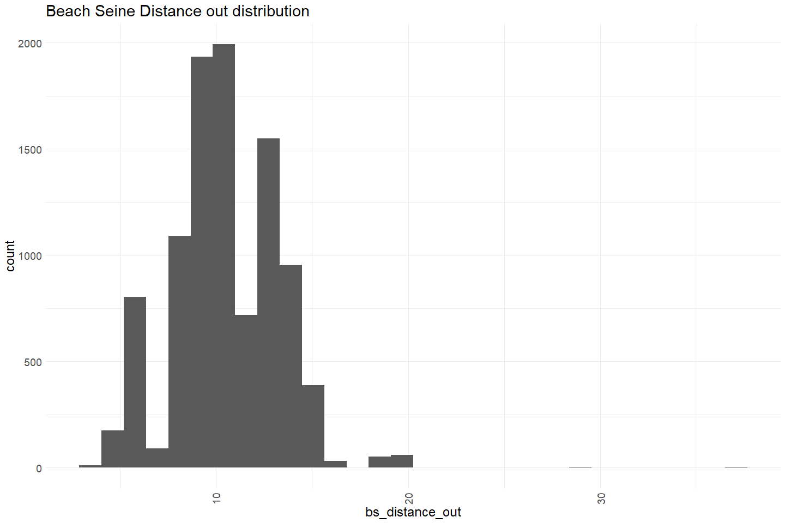

Feather River Seine Data 2015 - 2021 QC
================
Erin Cain
9/29/2021

# Feather River Seine and Snorkel Data

## Description of Monitoring Data

Feather River Seine data 2015 - 2021. All new data will be stored in
this format in the current access database.

**Timeframe:** 2015 - 2021

**Seine Season:** Appears to be Feb - August (but not consistent across
years sampled)

**Completeness of Record throughout timeframe:**

Sampling occurred every year between 2015 - 2021

**Sampling Location:** Feather River

**Data Contact:** [Casey Campos](mailto:Casey.Campos@water.ca.gov)

Any additional info?

## Access Cloud Data

``` r
# Run Sys.setenv() to specify GCS_AUTH_FILE and GCS_DEFAULT_BUCKET before running 
# getwd() to see how to specify paths 
# Open object from google cloud storage
# Set your authentication using gcs_auth
gcs_auth(json_file = Sys.getenv("GCS_AUTH_FILE"))
# Set global bucket 
gcs_global_bucket(bucket = Sys.getenv("GCS_DEFAULT_BUCKET"))
gcs_list_objects()
# git data and save as xlsx
gcs_get_object(object_name = 
                 "juvenile-rearing-monitoring/seine-and-snorkel-data/feather-river/data-raw/all_fields_seine_2008-2014.xlsx",
               bucket = gcs_get_global_bucket(),
               saveToDisk = "raw_seine_2008-2014.xlsx",
               overwrite = TRUE)

gcs_get_object(object_name = 
                 "juvenile-rearing-monitoring/seine-and-snorkel-data/feather-river/data-raw/all_fields_seine_2014-2021.xlsx",
               bucket = gcs_get_global_bucket(),
               saveToDisk = "raw_seine_2015-2021.xlsx",
               overwrite = TRUE)
```

Read in data from google cloud, glimpse raw data:

``` r
# read in data to clean 
raw_seine_2015 <- read_xlsx("raw_seine_2015-2021.xlsx", col_types = c("numeric", "text", "numeric", "numeric", "numeric",
                                                                      "numeric", "numeric", "logical", "text", "text", 
                                                                      "numeric", "date", "date", "numeric", "numeric", "numeric",
                                                                      "text", "numeric", "numeric", "numeric", "numeric",
                                                                      "numeric", "numeric", "numeric", "numeric", "numeric",
                                                                      "numeric", "numeric", "numeric", "numeric", "numeric",
                                                                      "numeric", "numeric", "numeric", "numeric",
                                                                      "numeric","text", "text", "text", "text", "text", "text",
                                                                      "text", "numeric", "numeric", "numeric", "numeric", "text",
                                                                      "text", "numeric", "numeric", "text")) %>% glimpse()
```

    ## Rows: 19,403
    ## Columns: 52
    ## $ `SAMPLE ID`              <dbl> 372, 372, 372, 372, 372, 372, 372, 372, 372, ~
    ## $ Species                  <chr> "CHNF", "CHNF", "CHNF", "CHNF", "CHNF", "CHNF~
    ## $ Count                    <dbl> 1, 1, 1, 1, 1, 1, 1, 1, 1, 1, 1, 1, 1, 1, 1, ~
    ## $ `Fork Length`            <dbl> 47, 58, 62, 50, 65, 60, 59, 60, 67, 59, 54, 8~
    ## $ `Total Length`           <dbl> NA, NA, NA, NA, NA, NA, NA, NA, NA, NA, NA, N~
    ## $ `Salmonid Life Stage`    <dbl> 7, 7, 7, 7, 7, 7, 7, 7, 7, 7, 7, 7, 7, 7, 7, ~
    ## $ id                       <dbl> 6225, 6226, 6227, 6228, 6229, 6230, 6231, 623~
    ## $ Dead                     <lgl> FALSE, FALSE, FALSE, FALSE, FALSE, FALSE, FAL~
    ## $ `Weight (g)`             <chr> "1.1", "2", "2.3", "1.3", "2.9", "2.4", "2", ~
    ## $ `Catch TBL_Comments`     <chr> NA, NA, NA, NA, NA, NA, NA, NA, NA, NA, NA, N~
    ## $ `Site ID`                <dbl> 59, 59, 59, 59, 59, 59, 59, 59, 59, 59, 59, 5~
    ## $ Date                     <dttm> 2015-05-19, 2015-05-19, 2015-05-19, 2015-05-~
    ## $ Time                     <dttm> 1899-12-31 10:30:00, 1899-12-31 10:30:00, 18~
    ## $ GearCode                 <dbl> 3, 3, 3, 3, 3, 3, 3, 3, 3, 3, 3, 3, 3, 3, 3, ~
    ## $ ConditionCode            <dbl> 4, 4, 4, 4, 4, 4, 4, 4, 4, 4, 4, 4, 4, 4, 4, ~
    ## $ Temperature              <dbl> NA, NA, NA, NA, NA, NA, NA, NA, NA, NA, NA, N~
    ## $ WeatherCode              <chr> "CLR", "CLR", "CLR", "CLR", "CLR", "CLR", "CL~
    ## $ Flow                     <dbl> NA, NA, NA, NA, NA, NA, NA, NA, NA, NA, NA, N~
    ## $ `EFBS Length`            <dbl> NA, NA, NA, NA, NA, NA, NA, NA, NA, NA, NA, N~
    ## $ `EFBS Width`             <dbl> NA, NA, NA, NA, NA, NA, NA, NA, NA, NA, NA, N~
    ## $ `EFBS Depth (Top)`       <dbl> NA, NA, NA, NA, NA, NA, NA, NA, NA, NA, NA, N~
    ## $ `EFBS Depth (Bottom)`    <dbl> NA, NA, NA, NA, NA, NA, NA, NA, NA, NA, NA, N~
    ## $ `EFBS Velocity (Top)`    <dbl> NA, NA, NA, NA, NA, NA, NA, NA, NA, NA, NA, N~
    ## $ `EFBS Velocity (Bottom)` <dbl> NA, NA, NA, NA, NA, NA, NA, NA, NA, NA, NA, N~
    ## $ `BS Start Length`        <dbl> NA, NA, NA, NA, NA, NA, NA, NA, NA, NA, NA, N~
    ## $ `BS Close Width`         <dbl> NA, NA, NA, NA, NA, NA, NA, NA, NA, NA, NA, N~
    ## $ `BS Distance Out`        <dbl> NA, NA, NA, NA, NA, NA, NA, NA, NA, NA, NA, N~
    ## $ `BS Depth (1/2)`         <dbl> NA, NA, NA, NA, NA, NA, NA, NA, NA, NA, NA, N~
    ## $ `BS Depth (Full)`        <dbl> NA, NA, NA, NA, NA, NA, NA, NA, NA, NA, NA, N~
    ## $ `BS Velocity (1/2)`      <dbl> NA, NA, NA, NA, NA, NA, NA, NA, NA, NA, NA, N~
    ## $ `BS Velocity (Full)`     <dbl> NA, NA, NA, NA, NA, NA, NA, NA, NA, NA, NA, N~
    ## $ `Substrate 1`            <dbl> 1, 1, 1, 1, 1, 1, 1, 1, 1, 1, 1, 1, 1, 1, 1, ~
    ## $ `Substrate 2`            <dbl> 2, 2, 2, 2, 2, 2, 2, 2, 2, 2, 2, 2, 2, 2, 2, ~
    ## $ `Substrate 3`            <dbl> 3, 3, 3, 3, 3, 3, 3, 3, 3, 3, 3, 3, 3, 3, 3, ~
    ## $ `Substrate 4`            <dbl> NA, NA, NA, NA, NA, NA, NA, NA, NA, NA, NA, N~
    ## $ `Substrate 5`            <dbl> NA, NA, NA, NA, NA, NA, NA, NA, NA, NA, NA, N~
    ## $ `Cover 1`                <chr> "B", "B", "B", "B", "B", "B", "B", "B", "B", ~
    ## $ `Cover 2`                <chr> "D", "D", "D", "D", "D", "D", "D", "D", "D", ~
    ## $ `Cover 3`                <chr> "C", "C", "C", "C", "C", "C", "C", "C", "C", ~
    ## $ `Cover 4`                <chr> "E", "E", "E", "E", "E", "E", "E", "E", "E", ~
    ## $ `Cover 5`                <chr> "F", "F", "F", "F", "F", "F", "F", "F", "F", ~
    ## $ `Cover 6`                <chr> NA, NA, NA, NA, NA, NA, NA, NA, NA, NA, NA, N~
    ## $ RPGRu                    <chr> "GRRU", "GRRU", "GRRU", "GRRU", "GRRU", "GRRU~
    ## $ GearHeight               <dbl> NA, NA, NA, NA, NA, NA, NA, NA, NA, NA, NA, N~
    ## $ `Dissolved Oxygen`       <dbl> NA, NA, NA, NA, NA, NA, NA, NA, NA, NA, NA, N~
    ## $ EC                       <dbl> NA, NA, NA, NA, NA, NA, NA, NA, NA, NA, NA, N~
    ## $ OBJECTID                 <dbl> 59, 59, 59, 59, 59, 59, 59, 59, 59, 59, 59, 5~
    ## $ site_name                <chr> "Hatchery Ditch", "Hatchery Ditch", "Hatchery~
    ## $ gear_type                <chr> "SEIN", "SEIN", "SEIN", "SEIN", "SEIN", "SEIN~
    ## $ `UTM Easting`            <dbl> -121.5588, -121.5588, -121.5588, -121.5588, -~
    ## $ `UTM Northing`           <dbl> 39.51619, 39.51619, 39.51619, 39.51619, 39.51~
    ## $ Location_LU_Channel      <chr> "LFC", "LFC", "LFC", "LFC", "LFC", "LFC", "LF~

## Data transformations

``` r
# Snake case, 
# Columns are appropriate types
# Remove redundant columns
cleaner_seine_data <- raw_seine_2015 %>% 
  janitor::clean_names() %>% 
  rename("bs_depth_half" = bs_depth_1_2, 
         "lifestage" = salmonid_life_stage,
         "stream_features" = rpg_ru, 
         "condition" = condition_code,
         "weather" = weather_code,
         "gear" = gear_code) %>%
  filter(species %in% c("CHN", "CHNF", "CHNFT", "CHNI",
                        "CHNL", "CHNS", "CHNST", "CHNT","CHNW")) %>%
  mutate(date = as.Date(date),
         time = hms::as_hms(time),
         weight_g = as.numeric(weight_g),
         sample_id = as.character(sample_id),
         id = as.character(id),
         condition = as.character(condition),
         lifestage = as.character(lifestage),
         substrate_1 = as.character(substrate_1), # Should I change these to the actual cover type ex: fine_substrate T/F values?
         substrate_2 = as.character(substrate_2),
         substrate_3 = as.character(substrate_3),
         substrate_4 = as.character(substrate_4),
         substrate_5 = as.character(substrate_5),
         run = case_when(species %in% c("CHNF", "CHNFT") ~ "fall",
                         species %in% c("CHNS", "CHNST") ~ "spring",
                         species == "CHNW" ~ "winter",
                         species == "CHNI" ~ "inland", 
                         species %in% c("CHN", "CHNT") ~ "unknown"),
         tagged = if_else(grepl('T$', species), TRUE, FALSE)) %>% 
  select(-catch_tbl_comments, -dissolved_oxygen, -ec, -gear_height, # Remove because all values are NA
         -bs_velocity_full, -bs_velocity_1_2, -bs_depth_full, 
         -species, # Remove species because we filtered for chinook so it is redundant
         -total_length, # Remove total length because only one value, and fork_length already measures size 
         -gear_type, # All are sein
         -site_id, -objectid) %>% # Remove site_id/objectid because already joined with attributes relevent to these id (have site_name, lat/long) 
  glimpse()
```

    ## Rows: 10,100
    ## Columns: 42
    ## $ sample_id            <chr> "372", "372", "372", "372", "372", "372", "372", ~
    ## $ count                <dbl> 1, 1, 1, 1, 1, 1, 1, 1, 1, 1, 1, 1, 1, 1, 1, 1, 1~
    ## $ fork_length          <dbl> 47, 58, 62, 50, 65, 60, 59, 60, 67, 59, 54, 82, 6~
    ## $ lifestage            <chr> "7", "7", "7", "7", "7", "7", "7", "7", "7", "7",~
    ## $ id                   <chr> "6225", "6226", "6227", "6228", "6229", "6230", "~
    ## $ dead                 <lgl> FALSE, FALSE, FALSE, FALSE, FALSE, FALSE, FALSE, ~
    ## $ weight_g             <dbl> 1.1, 2.0, 2.3, 1.3, 2.9, 2.4, 2.0, 2.5, 3.4, 2.3,~
    ## $ date                 <date> 2015-05-19, 2015-05-19, 2015-05-19, 2015-05-19, ~
    ## $ time                 <time> 10:30:00, 10:30:00, 10:30:00, 10:30:00, 10:30:00~
    ## $ gear                 <dbl> 3, 3, 3, 3, 3, 3, 3, 3, 3, 3, 3, 3, 3, 3, 3, 3, 3~
    ## $ condition            <chr> "4", "4", "4", "4", "4", "4", "4", "4", "4", "4",~
    ## $ temperature          <dbl> NA, NA, NA, NA, NA, NA, NA, NA, NA, NA, NA, NA, N~
    ## $ weather              <chr> "CLR", "CLR", "CLR", "CLR", "CLR", "CLR", "CLR", ~
    ## $ flow                 <dbl> NA, NA, NA, NA, NA, NA, NA, NA, NA, NA, NA, NA, N~
    ## $ efbs_length          <dbl> NA, NA, NA, NA, NA, NA, NA, NA, NA, NA, NA, NA, N~
    ## $ efbs_width           <dbl> NA, NA, NA, NA, NA, NA, NA, NA, NA, NA, NA, NA, N~
    ## $ efbs_depth_top       <dbl> NA, NA, NA, NA, NA, NA, NA, NA, NA, NA, NA, NA, N~
    ## $ efbs_depth_bottom    <dbl> NA, NA, NA, NA, NA, NA, NA, NA, NA, NA, NA, NA, N~
    ## $ efbs_velocity_top    <dbl> NA, NA, NA, NA, NA, NA, NA, NA, NA, NA, NA, NA, N~
    ## $ efbs_velocity_bottom <dbl> NA, NA, NA, NA, NA, NA, NA, NA, NA, NA, NA, NA, N~
    ## $ bs_start_length      <dbl> NA, NA, NA, NA, NA, NA, NA, NA, NA, NA, NA, NA, N~
    ## $ bs_close_width       <dbl> NA, NA, NA, NA, NA, NA, NA, NA, NA, NA, NA, NA, N~
    ## $ bs_distance_out      <dbl> NA, NA, NA, NA, NA, NA, NA, NA, NA, NA, NA, NA, N~
    ## $ bs_depth_half        <dbl> NA, NA, NA, NA, NA, NA, NA, NA, NA, NA, NA, NA, N~
    ## $ substrate_1          <chr> "1", "1", "1", "1", "1", "1", "1", "1", "1", "1",~
    ## $ substrate_2          <chr> "2", "2", "2", "2", "2", "2", "2", "2", "2", "2",~
    ## $ substrate_3          <chr> "3", "3", "3", "3", "3", "3", "3", "3", "3", "3",~
    ## $ substrate_4          <chr> NA, NA, NA, NA, NA, NA, NA, NA, NA, NA, NA, NA, N~
    ## $ substrate_5          <chr> NA, NA, NA, NA, NA, NA, NA, NA, NA, NA, NA, NA, N~
    ## $ cover_1              <chr> "B", "B", "B", "B", "B", "B", "B", "B", "B", "B",~
    ## $ cover_2              <chr> "D", "D", "D", "D", "D", "D", "D", "D", "D", "D",~
    ## $ cover_3              <chr> "C", "C", "C", "C", "C", "C", "C", "C", "C", "C",~
    ## $ cover_4              <chr> "E", "E", "E", "E", "E", "E", "E", "E", "E", "E",~
    ## $ cover_5              <chr> "F", "F", "F", "F", "F", "F", "F", "F", "F", "F",~
    ## $ cover_6              <chr> NA, NA, NA, NA, NA, NA, NA, NA, NA, NA, NA, NA, N~
    ## $ stream_features      <chr> "GRRU", "GRRU", "GRRU", "GRRU", "GRRU", "GRRU", "~
    ## $ site_name            <chr> "Hatchery Ditch", "Hatchery Ditch", "Hatchery Dit~
    ## $ utm_easting          <dbl> -121.5588, -121.5588, -121.5588, -121.5588, -121.~
    ## $ utm_northing         <dbl> 39.51619, 39.51619, 39.51619, 39.51619, 39.51619,~
    ## $ location_lu_channel  <chr> "LFC", "LFC", "LFC", "LFC", "LFC", "LFC", "LFC", ~
    ## $ run                  <chr> "fall", "fall", "fall", "fall", "fall", "fall", "~
    ## $ tagged               <lgl> FALSE, FALSE, FALSE, FALSE, FALSE, FALSE, FALSE, ~

## Explore Numeric Variables:

``` r
# Filter clean data to show only numeric variables
cleaner_seine_data %>% select_if(is.numeric) %>% colnames()
```

    ##  [1] "count"                "fork_length"          "weight_g"            
    ##  [4] "gear"                 "temperature"          "flow"                
    ##  [7] "efbs_length"          "efbs_width"           "efbs_depth_top"      
    ## [10] "efbs_depth_bottom"    "efbs_velocity_top"    "efbs_velocity_bottom"
    ## [13] "bs_start_length"      "bs_close_width"       "bs_distance_out"     
    ## [16] "bs_depth_half"        "utm_easting"          "utm_northing"

### Variable: `count`

**Plotting Count over Period of Record**

``` r
cleaner_seine_data %>% 
  mutate(year = as.factor(year(date)),
         fake_year = if_else(month(date) %in% 10:12, 1900, 1901),
         fake_date = as.Date(paste0(fake_year,"-", month(date), "-", day(date)))) %>%
  ggplot(aes(x = fake_date, y = count)) + 
  geom_col() + 
  facet_wrap(~year(date), scales = "free") + 
  scale_x_date(labels = date_format("%b"), date_breaks = "1 month") + 
  theme_minimal() + 
  theme(text = element_text(size = 20),
        axis.text.x = element_text(angle = 90, vjust = 0.5, hjust=1)) + 
  labs(title = "Daily Seine Count All Runs", 
       x = "Date")  
```

<!-- -->

``` r
cleaner_seine_data %>% 
  group_by(date) %>%
  summarise(daily_count_upstream = sum(count)) %>%
  mutate(year = as.factor(year(date))) %>% 
  ggplot(aes(x = year, y = daily_count_upstream)) + 
  geom_boxplot() + 
  theme_minimal() +
  theme(text = element_text(size = 23)) + 
  labs(title = "Daily Count of Seine Catch Sumarized by Year All Runs") 
```

<!-- -->

``` r
cleaner_seine_data  %>%
  mutate(year = as.factor(year(date))) %>%
  filter(run %in% c("fall", "spring", "winter")) %>% # Filter to only show runs that have more than one data point and are not NA/Unknown
  ggplot(aes(x = year, y = count)) + 
  geom_col() + 
  theme_minimal() +
  labs(title = "Total Yearly Fish Counts by Run",
       y = "Total fish count") + 
  theme(text = element_text(size = 18),
        axis.text.x = element_text(angle = 90, vjust = 0.5, hjust=1)) + 
  facet_grid(~run)
```

<!-- -->
Not a lot of spring run fish caught in comparison to fall run fish
caught. **Numeric Summary of Count over Period of Record**

``` r
# daily numeric summary 
cleaner_seine_data %>% group_by(date) %>%
  summarise(daily_count = sum(count, na.rm = T)) %>%
  pull(daily_count) %>%
  summary()
```

    ##    Min. 1st Qu.  Median    Mean 3rd Qu.    Max. 
    ##     1.0    17.5    96.0   244.1   230.0  3216.0

``` r
# daily numeric summary SR
cleaner_seine_data %>% 
  filter(run == "spring") %>%
  group_by(date) %>%
  summarise(daily_count = sum(count, na.rm = T)) %>%
  pull(daily_count) %>%
  summary()
```

    ##    Min. 1st Qu.  Median    Mean 3rd Qu.    Max. 
    ##    1.00    2.25    7.00   21.13   24.00  173.00

**NA and Unknown Values**

-   0 % of values in the `count` column are NA. However, there are
    clearly gaps in data.

### Variable: `fork_length`

**Plotting fork\_length over Period of Record**

``` r
cleaner_seine_data %>%  
  ggplot(aes(x = fork_length)) + 
  geom_histogram(breaks=seq(0, 200, by=2)) + 
  scale_x_continuous(breaks=seq(0, 200, by=25)) +
  theme_minimal() +
  labs(title = "Fork length distribution") + 
  theme(text = element_text(size = 18),
        axis.text.x = element_text(angle = 90, vjust = 0.5, hjust=1)) 
```

<!-- -->

``` r
lifestage_code <- c(1, 2, 3, 4, 5, 6, 7, 8)
names(lifestage_code)  <- c("yolk-sac fry", "fry", "parr", "silvery parr", "smolt", "adult", "not provided", NA)

cleaner_seine_data %>% 
  mutate(year = as.factor(year(date)),
         lifestage_name = names(lifestage_code[as.numeric(lifestage)])) %>%
  ggplot(aes(x = fork_length, y = lifestage_name)) + 
  geom_boxplot() + 
  theme_minimal() +
  labs(title = "Fork length summarized by lifestage") + 
  theme(text = element_text(size = 18),
        axis.text.x = element_text(angle = 90, vjust = 0.5, hjust=1)) 
```

<!-- -->

**Numeric Summary of fork\_length over Period of Record**

``` r
summary(cleaner_seine_data$fork_length)
```

    ##    Min. 1st Qu.  Median    Mean 3rd Qu.    Max.    NA's 
    ##   26.00   37.00   41.00   47.46   55.00  210.00     166

**NA and Unknown Values**

-   1.6 % of values in the `fork_length` column are NA.

### Variable: `weight_g`

**Plotting weight\_g over Period of Record**

``` r
cleaner_seine_data %>%  
  ggplot(aes(x = weight_g)) + 
  geom_histogram() + 
  scale_x_continuous() +
  theme_minimal() +
  labs(title = "Weight distribution") + 
  theme(text = element_text(size = 18),
        axis.text.x = element_text(angle = 90, vjust = 0.5, hjust=1)) 
```

    ## `stat_bin()` using `bins = 30`. Pick better value with `binwidth`.

<!-- -->

``` r
# Make whatever plot is appropriate 
# maybe 2+ plots are appropriate
```

``` r
lifestage_code <- c(1, 2, 3, 4, 5, 6, 7, 8)
names(lifestage_code)  <- c("yolk-sac fry", "fry", "parr", "silvery parr", "smolt", "adult", "not provided", NA)

cleaner_seine_data %>% 
  mutate(year = as.factor(year(date)),
         lifestage_name = names(lifestage_code[as.numeric(lifestage)])) %>%
  ggplot(aes(x = weight_g, y = lifestage_name)) + 
  geom_boxplot() + 
  theme_minimal() +
  labs(title = "Weight summarized by lifestage") + 
  theme(text = element_text(size = 18),
        axis.text.x = element_text(angle = 90, vjust = 0.5, hjust=1)) 
```

<!-- -->

**Numeric Summary of weight\_g over Period of Record**

``` r
# Table with summary statistics
summary(cleaner_seine_data$weight_g)
```

    ##    Min. 1st Qu.  Median    Mean 3rd Qu.    Max.    NA's 
    ##   0.300   0.900   1.500   2.332   3.100  59.000    5399

**NA and Unknown Values**

-   53.5 % of values in the `weight_g` column are NA.

### Variable: `temperature`

**Plotting Distribution of temperature measures**

``` r
cleaner_seine_data %>%  
  ggplot(aes(x = temperature)) + 
  geom_histogram() + 
  scale_x_continuous() +
  theme_minimal() +
  labs(title = "Temperature distribution (celcius)") + 
  theme(text = element_text(size = 18),
        axis.text.x = element_text(angle = 90, vjust = 0.5, hjust=1)) 
```

    ## `stat_bin()` using `bins = 30`. Pick better value with `binwidth`.

<!-- -->

**Numeric Summary of temperature over Period of Record**

``` r
# Table with summary statistics
summary(cleaner_seine_data$temperature)
```

    ##    Min. 1st Qu.  Median    Mean 3rd Qu.    Max.    NA's 
    ##    7.50   10.00   11.00   11.45   13.00   20.00     722

**NA and Unknown Values**

-   7.1 % of values in the `temperature` column are NA.

### Variable: `bs_start_length`

**Plotting bs\_start\_length over Period of Record**

``` r
cleaner_seine_data %>%  
  ggplot(aes(x = bs_start_length)) + 
  geom_histogram() + 
  scale_x_continuous() +
  theme_minimal() +
  labs(title = "Beach Seine start length distribution") + 
  theme(text = element_text(size = 18),
        axis.text.x = element_text(angle = 90, vjust = 0.5, hjust=1)) 
```

    ## `stat_bin()` using `bins = 30`. Pick better value with `binwidth`.

<!-- -->

**Numeric Summary of bs\_start\_length over Period of Record**

``` r
# Table with summary statistics
summary(cleaner_seine_data$bs_start_length)
```

    ##     Min.  1st Qu.   Median     Mean  3rd Qu.     Max.     NA's 
    ##   0.7622  18.2923  28.5000  31.0344  39.6340 332.3171      299

**NA and Unknown Values**

-   3 % of values in the `bs_start_length` column are NA.

### Variable: `bs_distance_out`

**Plotting bs\_distance\_out over Period of Record**

``` r
cleaner_seine_data %>%  
  ggplot(aes(x = bs_distance_out)) + 
  geom_histogram() + 
  scale_x_continuous() +
  theme_minimal() +
  labs(title = "Beach Seine Distance out distribution") + 
  theme(text = element_text(size = 18),
        axis.text.x = element_text(angle = 90, vjust = 0.5, hjust=1)) 
```

    ## `stat_bin()` using `bins = 30`. Pick better value with `binwidth`.

<!-- -->

**Numeric Summary of bs\_distance\_out over Period of Record**

``` r
# Table with summary statistics
summary(cleaner_seine_data$bs_distance_out)
```

    ##    Min. 1st Qu.  Median    Mean 3rd Qu.    Max.    NA's 
    ##    3.00    9.10   10.67   10.42   12.20   36.59     248

**NA and Unknown Values**

-   2.5 % of values in the `bs_distance_out` column are NA.

### Variable: `bs_depth_half`

**Plotting bs\_depth\_half over Period of Record**

``` r
cleaner_seine_data %>%  
  ggplot(aes(x = bs_depth_half)) + 
  geom_histogram(breaks=seq(0, 3, by=.1)) + # filters out three values greater than 3 (63 likely outliers)
  # scale_x_continuous(breaks=seq(0, 200, by=25)) +
  theme_minimal() +
  labs(title = "Beach seine half depth distribution") + 
  theme(text = element_text(size = 18),
        axis.text.x = element_text(angle = 90, vjust = 0.5, hjust=1)) 
```

<!-- -->

**Numeric Summary of bs\_depth\_half over Period of Record**

``` r
# Table with summary statistics
summary(cleaner_seine_data$bs_depth_half)
```

    ##    Min. 1st Qu.  Median    Mean 3rd Qu.    Max.    NA's 
    ##  0.0300  0.5000  0.6098  0.6514  0.7622 63.0000     272

63 seems like it must be an outlier, occurs 3 times (same sample).

**NA and Unknown Values**

-   2.7 % of values in the `bs_depth_half` column are NA.

### Variables: `utm_northing`, `utm_easting`

These are the location columns. It looks like most values area actually
latitude and longitude but there are a few crazy values in there that
are out of the realm of possibilities for the feather river. I changed
the names to lat and long and then updated then changed unreasonable
values to NA.

``` r
summary(cleaner_seine_data$utm_easting)
```

    ##     Min.  1st Qu.   Median     Mean  3rd Qu.     Max.     NA's 
    ##  -1221.6   -121.6   -121.6  60671.7   -121.6 620138.0      823

``` r
summary(cleaner_seine_data$utm_northing)
```

    ##    Min. 1st Qu.  Median    Mean 3rd Qu.    Max.    NA's 
    ##    -122      39      39  428829      40 4369037     823

``` r
cleaner_seine_data <- rename(cleaner_seine_data, longitude = utm_easting)
cleaner_seine_data$longitude <- ifelse(cleaner_seine_data$longitude < -130 | 
                                         cleaner_seine_data$longitude > -110, NA, 
                                       cleaner_seine_data$longitude)
summary(cleaner_seine_data$longitude)
```

    ##    Min. 1st Qu.  Median    Mean 3rd Qu.    Max.    NA's 
    ##  -121.6  -121.6  -121.6  -121.6  -121.6  -121.6    2957

``` r
cleaner_seine_data <- rename(cleaner_seine_data, latitude = utm_northing)
cleaner_seine_data$latitude <- ifelse(cleaner_seine_data$latitude < 30 |
                                        cleaner_seine_data$latitude > 50, NA, 
                                      cleaner_seine_data$latitude)
summary(cleaner_seine_data$latitude)
```

    ##    Min. 1st Qu.  Median    Mean 3rd Qu.    Max.    NA's 
    ##   39.01   39.11   39.35   39.31   39.48   39.52    2418

**NA and Unknown Values**

-   29.3 % of values in the `longitude` column \# Check that they are in
    consistent format \# Mapare NA.
-   23.9 % of values in the `latitude` column are NA.

## Explore Categorical variables:

``` r
cleaner_seine_data %>% select_if(is.character) %>% colnames()
```

    ##  [1] "sample_id"           "lifestage"           "id"                 
    ##  [4] "condition"           "weather"             "substrate_1"        
    ##  [7] "substrate_2"         "substrate_3"         "substrate_4"        
    ## [10] "substrate_5"         "cover_1"             "cover_2"            
    ## [13] "cover_3"             "cover_4"             "cover_5"            
    ## [16] "cover_6"             "stream_features"     "site_name"          
    ## [19] "location_lu_channel" "run"

### Variable: `sample_id`, `id`

``` r
length(unique(cleaner_seine_data$id)) == nrow(cleaner_seine_data)
```

    ## [1] TRUE

Each id is unique as anticipated.

Each `sample_id` is not unique because multiple catches can occur in the
same beach seine sample.

``` r
length(unique(cleaner_seine_data$sample_id)) == nrow(cleaner_seine_data)
```

    ## [1] FALSE

**NA and Unknown Values**

-   0 % of values in the `sample_id` column are NA.
-   0 % of values in the `id` column are NA.

### Variable: `lifestage`

``` r
table(cleaner_seine_data$lifestage)
```

    ## 
    ##    1    2    3    4    5    7 
    ##    3  284 7095 1614  103  102

Fix inconsistencies with spelling, capitalization, and abbreviations.

``` r
lifestage_code <- c(1, 2, 3, 4, 5, 6, 7)
names(lifestage_code)  <- c("yolk-sac fry", "fry", "parr", "silvery parr", "smolt", "adult", "not provided")

cleaner_seine_data$lifestage <- names(lifestage_code[as.numeric(cleaner_seine_data$lifestage)])
cleaner_seine_data$lifestage <- ifelse(cleaner_seine_data$lifestage == "not provided", NA, cleaner_seine_data$lifestage) # Change not provided to NA

table(cleaner_seine_data$lifestage)
```

    ## 
    ##          fry         parr silvery parr        smolt yolk-sac fry 
    ##          284         7095         1614          103            3

**Create lookup rda for \[variable\] encoding:**

**NA and Unknown Values**

-   9.9 % of values in the `lifestage` column are NA.

### Variable: `gear`

``` r
table(cleaner_seine_data$gear)
```

    ## 
    ##    1    3 
    ##  403 9697

Fix inconsistencies with spelling, capitalization, and abbreviations.
Update gear codes with gear names:

-   SEIN25 - Gear description 25 foot beach seine with bag
-   SEIN50 - Gear description 25 foot beach seine with bag

``` r
cleaner_seine_data$gear <- case_when(cleaner_seine_data$gear == "1" ~ "SEIN25",
                                          cleaner_seine_data$gear == "3" ~ "SEIN50")

table(cleaner_seine_data$gear)
```

    ## 
    ## SEIN25 SEIN50 
    ##    403   9697

**NA and Unknown Values**

-   0 % of values in the `gear` column are NA.

### Variable: `condition`

``` r
table(cleaner_seine_data$condition)
```

    ## 
    ##    0    1    2    3    4 
    ##   34 8465 1391  121   89

Fix inconsistencies with spelling, capitalization, and abbreviations.

Descriptions:

-   Good - The haul went smoothly without getting hung up on anything or
    net rolling.
-   Fair - The haul went relatively smoothly, but you had to stop once
    or twice to get it unsnagged or take big rocks out of the net.
-   Poor - The haul didn’t go well; you had to stop numerous times while
    the poles were still a good distance from the shore to free the
    seine from snags or big rocks.

All other values (0, 4) corresond to NA

``` r
cleaner_seine_data$condition <- case_when(cleaner_seine_data$condition == "1" ~ "good",
                                               cleaner_seine_data$condition == "2" ~ "fair",
                                               cleaner_seine_data$condition == "3" ~ "poor")


table(cleaner_seine_data$condition)
```

    ## 
    ## fair good poor 
    ## 1391 8465  121

**NA and Unknown Values**

-   1.2 % of values in the `condition` column are NA.

### Variable: `weather`

``` r
table(cleaner_seine_data$weather)
```

    ## 
    ##   0.  CLD  CLR  FOG  RAN 
    ##   52 2546 6876   74  552

Fix inconsistencies with spelling, capitalization, and abbreviations.

``` r
cleaner_seine_data$weather <- case_when(cleaner_seine_data$weather == "CLD" ~ "overcast",
                                             cleaner_seine_data$weather == "CLR" ~ "sunny",
                                             cleaner_seine_data$weather == "FOG" ~ "foggy",
                                             cleaner_seine_data$weather == "RAN" ~ "precipitation")


table(cleaner_seine_data$weather)
```

    ## 
    ##         foggy      overcast precipitation         sunny 
    ##            74          2546           552          6876

**NA and Unknown Values**

-   0.5 % of values in the `weather` column are NA.

### Variable: `substrate_1`, `substrate_2`, `substrate_3`, `substrate_4`, `substrate_5`

| SubstrateCode | Substrate                                   |
|---------------|---------------------------------------------|
| 1             | Fine - small gravel (0-50mm) (0-2in.)       |
| 2             | Small - medium gravel (50-150mm) (2-6in.)   |
| 3             | Medium - large cobble (150-300mm) (6-12in.) |
| 4             | Boulder (&gt;300mm) (&gt;12in.)             |
| 5             | Pavement (Boat Ramp)                        |

Substrate lookup list for feather seine can be found
“data/feather\_seine\_substrate.rds”

``` r
table(cleaner_seine_data$substrate_1)
```

    ## 
    ##    0    1    2    3    5 
    ##   86 5586 4009  315  104

``` r
table(cleaner_seine_data$substrate_2)
```

    ## 
    ##    1    2    3    4 
    ##   32 2682 2333  166

``` r
table(cleaner_seine_data$substrate_3)
```

    ## 
    ##   1   3   4 
    ##  21 958 461

``` r
table(cleaner_seine_data$substrate_4)
```

    ## 
    ##   4 
    ## 290

``` r
table(cleaner_seine_data$substrate_5) #all na values
```

    ## < table of extent 0 >

**Create lookup rda for substrate encoding:**

``` r
feather_seine_substrate <- 1:5
names(feather_seine_substrate) <- c(
  "Fine - small gravel (0-50mm) (0-2in.)", 
  "Small - medium gravel (50-150mm) (2-6in.)", 
  "Medium - large cobble (150-300mm) (6-12in.)",
  "Boulder (>300mm) (>12in.)",
  "Pavement (Boat Ramp)")

#write_rds(feather_seine_substrate, "../../../data/feather_seine_substrate.rds")
```

**NA and Unknown Values**

No NA values:

-   0 % of values in the `substrate_1` column are NA.
-   48.4 % of values in the `substrate_2` column are NA.
-   85.7 % of values in the `substrate_3` column are NA.
-   97.1 % of values in the `substrate_4` column are NA.
-   100 % of values in the `substrate_5` column are NA.

### Variable: `cover_1`, `cover_2`, `cover_3`, `cover_4`, `cover_5`

``` r
table(cleaner_seine_data$cover_1)
```

    ## 
    ##    A    B    C    D    E 
    ## 3626 4431  391   70 1500

``` r
table(cleaner_seine_data$cover_2)
```

    ## 
    ##   D   E   F 
    ## 157 469   1

``` r
table(cleaner_seine_data$cover_3)
```

    ## 
    ##    B    C    D    E    F 
    ##   29  736  443 1462   51

``` r
table(cleaner_seine_data$cover_4)
```

    ## 
    ##  E 
    ## 92

``` r
table(cleaner_seine_data$cover_5)
```

    ## 
    ##  F 
    ## 16

``` r
unique(cleaner_seine_data$cover_6)
```

    ## [1] NA

**Create lookup rda for cover encoding:**

``` r
feather_seine_cover <- c("A", "B", "C", "D", "E", "BD", "DE" )
names(feather_seine_cover) <- c("no apparent cover",
"small instream objects",
"large instream objects",
"overhead objects",
"submerged aquatic vegetation",
"small instream objects and overhead objects",
"overhead objects and submerged aquatic vegetation")

tibble(code = feather_seine_cover, 
       definitions = names(feather_seine_cover))
```

    ## # A tibble: 7 x 2
    ##   code  definitions                                      
    ##   <chr> <chr>                                            
    ## 1 A     no apparent cover                                
    ## 2 B     small instream objects                           
    ## 3 C     large instream objects                           
    ## 4 D     overhead objects                                 
    ## 5 E     submerged aquatic vegetation                     
    ## 6 BD    small instream objects and overhead objects      
    ## 7 DE    overhead objects and submerged aquatic vegetation

``` r
# write_rds(feather_seine_cover, "../../../data/feather_seine_cover.rds")
```

**NA and Unknown Values**

-   0.8 % of values in the `cover_1` column are NA.
-   93.8 % of values in the `cover_2` column are NA.
-   73.1 % of values in the `cover_3` column are NA.
-   99.1 % of values in the `cover_4` column are NA.
-   99.8 % of values in the `cover_5` column are NA.

### Variable: `stream_features`

``` r
table(cleaner_seine_data$stream_features)
```

    ## 
    ##    G   GP   GR GRRU  GRU    P  PRU    R  RRU   RU 
    ## 5268   86   10   16  100 1433  100 1528   51 1350

**Create stream features encoding:**

``` r
feather_seine_stream_features <- c("G", "GP", "GR", "GRRU", "GRU", "P", "PRU", "R", "RRU", "RU")
names(feather_seine_stream_features) <- c( "Glide", "Glide & Pool", "Glide & Riffle", "Glide & Riffle & Run", "Glide & Run", "Pool",
                                           "Pool & Run", "Riffle", "Riffle & Run", "Run")

tibble(code = feather_seine_stream_features, 
       definitions = names(feather_seine_stream_features))
```

    ## # A tibble: 10 x 2
    ##    code  definitions         
    ##    <chr> <chr>               
    ##  1 G     Glide               
    ##  2 GP    Glide & Pool        
    ##  3 GR    Glide & Riffle      
    ##  4 GRRU  Glide & Riffle & Run
    ##  5 GRU   Glide & Run         
    ##  6 P     Pool                
    ##  7 PRU   Pool & Run          
    ##  8 R     Riffle              
    ##  9 RRU   Riffle & Run        
    ## 10 RU    Run

``` r
# write_rds(feather_seine_stream_features, "../../../data/feather_seine_stream_features.rds")
```

**NA and Unknown Values**

-   1.6 % of values in the `stream_features` column are NA.

### Variable: `site_name`

``` r
table(cleaner_seine_data$site_name)
```

    ## 
    ##                      24th St. Levee OWA                        Aleck-lunch spot 
    ##                                       7                                      51 
    ##                      Aleck Backwater RL                     Aleck RL - Upstream 
    ##                                      77                                      10 
    ##                                Aleck RR              Auditoruim RR - Downstream 
    ##                                     212                                      33 
    ##                Bear River 1 mi Upstream                Bear River Downstream RL 
    ##                                      29                                      66 
    ##                  Bedrock Park Backwater                         Bedrock Park RL 
    ##                                     156                                     758 
    ##          Bend Upstream Live Oak Ramp RR          Between Big Riffle and Big Bar 
    ##                                       9                                      31 
    ##                              Big Bar RL                 Big Hole Boat Launch RL 
    ##                                      81                                       8 
    ##                             Big Hole RR                              Big Riffle 
    ##                                       7                                     202 
    ##                    Boyd's Downstream RL              Boyds 1/2 mile upstream RL 
    ##                                     201                                      15 
    ##    Boyds 1mi downstream Side Channel RL          Boyds Bump Boat Launch- Across 
    ##                                     207                                     312 
    ##        Clay Banks upstream backwater RL                                     Cox 
    ##                                       3                                      95 
    ##                               Cox SC RR                     Cox Side Channel RL 
    ##                                      88                                       5 
    ##                    Developing Riffle RL                    Developing Riffle RR 
    ##                                      63                                      29 
    ##                    Downstream Outlet RL              Downstream Sunset Pumps RL 
    ##                                      89                                       9 
    ##                        Ellis Road Beach                Eye Main RR - Downstream 
    ##                                      25                                      54 
    ##                        Eye side channel               Eye side channel - Bottom 
    ##                                     103                                     252 
    ##                            G-95 East RL                       G95 Downstream RL 
    ##                                      51                                     112 
    ##                   G95 E Side Channel RL                              G95 SC  RR 
    ##                                       6                                      40 
    ##                       G95 Upper Main RR                              Gateway RL 
    ##                                     107                                     206 
    ##                              Gateway RR                         Goose Riffle RL 
    ##                                     202                                      56 
    ##                           Great Western                            Gridley-Side 
    ##                                      16                                     165 
    ##                 Gridley Riffle Lower RR                          Hatchery Ditch 
    ##                                     113                                     352 
    ##   Hatchery Fence (Island above Bedrock)               herringer 1/4 mi below RR 
    ##                                      11                                       4 
    ##                 Herringer Downstream RL                       Herringer Main RL 
    ##                                     133                                     361 
    ##            Herringer Upstream Riffle RR                    honcut Downstream RR 
    ##                                     132                                       2 
    ##                Hour Main Backwater - RL                            Hour Main RL 
    ##                                       5                                     251 
    ##               Hour Main RL - Downstream               Hour Main RR - Downstream 
    ##                                      88                                       3 
    ##         Hour side channel RL - Upstream        Island Upstream Yuba City Launch 
    ##                                     100                                      12 
    ##                         Jeff's Basshole                                Junkyard 
    ##                                       7                                       1 
    ##            Junkyard side channel 2 - RL                                 Kiester 
    ##                                      13                                     100 
    ##                    Live Oak Boat Launch                   Live Oak Boat Ramp RL 
    ##                                      51                                       1 
    ##           Live Oak Upstream Boat Launch                  LiveOak Local's Launch 
    ##                                      12                                      23 
    ##                  Lower McFarlan Main RL         Lower Trailer Park Backwater RL 
    ##                                      46                                      58 
    ##                   Matthews Main Channel                  McFarland Backwater RL 
    ##                                     129                                       6 
    ##                     McFarland Main - RR            McFarland Main RR - Upstream 
    ##                                     197                                      88 
    ##                      McFarland Upper RL                             Moe's Ditch 
    ##                                      50                                      46 
    ##                     Morse Road Beach RL          Mulberry Beach RR - Downstream 
    ##                                      68                                      51 
    ##                           Outlet Launch            River Reflections RV Park RL 
    ##                                      17                                     296 
    ##                 Riverbend Park Beach RL                        Robinson Main RR 
    ##                                     335                                       6 
    ##                      Robinson pond S.C.                      Robinson Riffle RL 
    ##                                      25                                     109 
    ##                        Robinson Side RR                       Sanders Road Bend 
    ##                                       1                                      19 
    ##                     Sean's Beach 2mi DS                         Sean's Beach RR 
    ##                                      51                                     155 
    ##             Shallow Riffle Backwater RR                       Shanghai Above RR 
    ##                                     318                                      91 
    ##            Star Bend 2 mi Downstream RL           Star Bend Across from Ramp RR 
    ##                                      62                                     598 
    ##                       Star Bend Pump RL    Star Bend Pumps 1/2 mile upstream RR 
    ##                                     127                                     148 
    ##                           Steep Main RR                      Steep side channel 
    ##                                      83                                      52 
    ##          Sunset Pumps Downstream Island                             Swampy bend 
    ##                                      13                                      52 
    ##                       Trailer Park Main                         Upstream G95 RL 
    ##                                       4                                       4 
    ## Upstream Gridley Riffle Side Channel RL                      Upstream Hwy 20 RR 
    ##                                       9                                     183 
    ##                      Vance East Main RR                                 Weir RL 
    ##                                      59                                      58 
    ##                        West Kiester OWA                 Yuba City park beach RR 
    ##                                       3                                     106 
    ##      Yuba City Train Bridge Upstream RL            Yuba River 1mi Downstream RL 
    ##                                      82                                     266 
    ##           Yuba Train Bridge Upstream RR 
    ##                                       6

Fix inconsistencies with spelling, capitalization, and abbreviations.

``` r
format_site_name <- function(string) {
  clean <- str_replace_all(string, "1/2", "half") %>%
    str_replace_all("1/4", "quarter") %>%
    str_replace_all("S.C.", "SC") %>%
    str_replace_all("'", "") %>%
    str_replace_all("G-95", "G95") %>% 
    str_replace_all("Isl", "Island") %>%
    str_replace_all("[^[:alnum:]]", " ") %>% 
    trimws() %>% 
    stringr::str_squish() %>%
    stringr::str_to_title()
}

cleaner_seine_data$site_name <- format_site_name(cleaner_seine_data$site_name)
table(cleaner_seine_data$site_name)
```

    ## 
    ##                       24th St Levee Owa                      Aleck Backwater Rl 
    ##                                       7                                      77 
    ##                        Aleck Lunch Spot                       Aleck Rl Upstream 
    ##                                      51                                      10 
    ##                                Aleck Rr                Auditoruim Rr Downstream 
    ##                                     212                                      33 
    ##                Bear River 1 Mi Upstream                Bear River Downstream Rl 
    ##                                      29                                      66 
    ##                  Bedrock Park Backwater                         Bedrock Park Rl 
    ##                                     156                                     758 
    ##          Bend Upstream Live Oak Ramp Rr          Between Big Riffle And Big Bar 
    ##                                       9                                      31 
    ##                              Big Bar Rl                 Big Hole Boat Launch Rl 
    ##                                      81                                       8 
    ##                             Big Hole Rr                              Big Riffle 
    ##                                       7                                     202 
    ##    Boyds 1mi Downstream Side Channel Rl           Boyds Bump Boat Launch Across 
    ##                                     207                                     312 
    ##                     Boyds Downstream Rl             Boyds Half Mile Upstream Rl 
    ##                                     201                                      15 
    ##        Clay Banks Upstream Backwater Rl                                     Cox 
    ##                                       3                                      95 
    ##                               Cox Sc Rr                     Cox Side Channel Rl 
    ##                                      88                                       5 
    ##                    Developing Riffle Rl                    Developing Riffle Rr 
    ##                                      63                                      29 
    ##                    Downstream Outlet Rl              Downstream Sunset Pumps Rl 
    ##                                      89                                       9 
    ##                        Ellis Road Beach                  Eye Main Rr Downstream 
    ##                                      25                                      54 
    ##                        Eye Side Channel                 Eye Side Channel Bottom 
    ##                                     103                                     252 
    ##                       G95 Downstream Rl                   G95 E Side Channel Rl 
    ##                                     112                                       6 
    ##                             G95 East Rl                               G95 Sc Rr 
    ##                                      51                                      40 
    ##                       G95 Upper Main Rr                              Gateway Rl 
    ##                                     107                                     206 
    ##                              Gateway Rr                         Goose Riffle Rl 
    ##                                     202                                      56 
    ##                           Great Western                 Gridley Riffle Lower Rr 
    ##                                      16                                     113 
    ##                            Gridley Side                          Hatchery Ditch 
    ##                                     165                                     352 
    ##  Hatchery Fence Islandand Above Bedrock                 Herringer Downstream Rl 
    ##                                      11                                     133 
    ##                       Herringer Main Rl           Herringer Quarter Mi Below Rr 
    ##                                     361                                       4 
    ##            Herringer Upstream Riffle Rr                    Honcut Downstream Rr 
    ##                                     132                                       2 
    ##                  Hour Main Backwater Rl                            Hour Main Rl 
    ##                                       5                                     251 
    ##                 Hour Main Rl Downstream                 Hour Main Rr Downstream 
    ##                                      88                                       3 
    ##           Hour Side Channel Rl Upstream     Islandand Upstream Yuba City Launch 
    ##                                     100                                      12 
    ##                          Jeffs Basshole                                Junkyard 
    ##                                       7                                       1 
    ##              Junkyard Side Channel 2 Rl                                 Kiester 
    ##                                      13                                     100 
    ##                    Live Oak Boat Launch                   Live Oak Boat Ramp Rl 
    ##                                      51                                       1 
    ##           Live Oak Upstream Boat Launch                   Liveoak Locals Launch 
    ##                                      12                                      23 
    ##                  Lower Mcfarlan Main Rl         Lower Trailer Park Backwater Rl 
    ##                                      46                                      58 
    ##                   Matthews Main Channel                  Mcfarland Backwater Rl 
    ##                                     129                                       6 
    ##                       Mcfarland Main Rr              Mcfarland Main Rr Upstream 
    ##                                     197                                      88 
    ##                      Mcfarland Upper Rl                              Moes Ditch 
    ##                                      50                                      46 
    ##                     Morse Road Beach Rl            Mulberry Beach Rr Downstream 
    ##                                      68                                      51 
    ##                           Outlet Launch            River Reflections Rv Park Rl 
    ##                                      17                                     296 
    ##                 Riverbend Park Beach Rl                        Robinson Main Rr 
    ##                                     335                                       6 
    ##                        Robinson Pond Sc                      Robinson Riffle Rl 
    ##                                      25                                     109 
    ##                        Robinson Side Rr                       Sanders Road Bend 
    ##                                       1                                      19 
    ##                      Seans Beach 2mi Ds                          Seans Beach Rr 
    ##                                      51                                     155 
    ##             Shallow Riffle Backwater Rr                       Shanghai Above Rr 
    ##                                     318                                      91 
    ##            Star Bend 2 Mi Downstream Rl           Star Bend Across From Ramp Rr 
    ##                                      62                                     598 
    ##                       Star Bend Pump Rl   Star Bend Pumps Half Mile Upstream Rr 
    ##                                     127                                     148 
    ##                           Steep Main Rr                      Steep Side Channel 
    ##                                      83                                      52 
    ##       Sunset Pumps Downstream Islandand                             Swampy Bend 
    ##                                      13                                      52 
    ##                       Trailer Park Main                         Upstream G95 Rl 
    ##                                       4                                       4 
    ## Upstream Gridley Riffle Side Channel Rl                      Upstream Hwy 20 Rr 
    ##                                       9                                     183 
    ##                      Vance East Main Rr                                 Weir Rl 
    ##                                      59                                      58 
    ##                        West Kiester Owa                 Yuba City Park Beach Rr 
    ##                                       3                                     106 
    ##      Yuba City Train Bridge Upstream Rl            Yuba River 1mi Downstream Rl 
    ##                                      82                                     266 
    ##           Yuba Train Bridge Upstream Rr 
    ##                                       6

**NA and Unknown Values**

-   0 % of values in the `site_name` column are NA.

### Variable: `location_lu_channel`

Describes where in feather river based on channel type:

-   LFC - Low Flow Channel
-   HFC - High Flow Channel (After thermilito afterbay)
-   HFC DS LYR - High Flow Channel…TODO?

``` r
table(cleaner_seine_data$location_lu_channel)
```

    ## 
    ##        HFC HFC DS LYR        LFC 
    ##       3949       2131       3678

Fix inconsistencies with spelling, capitalization, and abbreviations.

**NA and Unknown Values**

-   3.4 % of values in the `location_lu_channel` column are NA.

### Variable: `run`

``` r
table(cleaner_seine_data$run)
```

    ## 
    ##    fall  spring unknown  winter 
    ##    8690     988      42      60

Fix inconsistencies with spelling, capitalization, and abbreviations.

``` r
cleaner_seine_data$run <- ifelse(cleaner_seine_data$run  == "unknown", NA, cleaner_seine_data$run)
table(cleaner_seine_data$run)
```

    ## 
    ##   fall spring winter 
    ##   8690    988     60

**NA and Unknown Values**

-   3.6 % of values in the `run` column are NA.

## Summary of identified issues

-   There are not a lot of SR catches, mainly FR. Data may not be that
    useful.
-   Figure out the best way to clean up the substrate and cover columns

## Save cleaned data back to google cloud

``` r
feather_seine_2015_2021 <- cleaner_seine_data %>% glimpse()
```

    ## Rows: 10,100
    ## Columns: 42
    ## $ sample_id            <chr> "372", "372", "372", "372", "372", "372", "372", ~
    ## $ count                <dbl> 1, 1, 1, 1, 1, 1, 1, 1, 1, 1, 1, 1, 1, 1, 1, 1, 1~
    ## $ fork_length          <dbl> 47, 58, 62, 50, 65, 60, 59, 60, 67, 59, 54, 82, 6~
    ## $ lifestage            <chr> NA, NA, NA, NA, NA, NA, NA, NA, NA, NA, NA, NA, N~
    ## $ id                   <chr> "6225", "6226", "6227", "6228", "6229", "6230", "~
    ## $ dead                 <lgl> FALSE, FALSE, FALSE, FALSE, FALSE, FALSE, FALSE, ~
    ## $ weight_g             <dbl> 1.1, 2.0, 2.3, 1.3, 2.9, 2.4, 2.0, 2.5, 3.4, 2.3,~
    ## $ date                 <date> 2015-05-19, 2015-05-19, 2015-05-19, 2015-05-19, ~
    ## $ time                 <time> 10:30:00, 10:30:00, 10:30:00, 10:30:00, 10:30:00~
    ## $ gear                 <chr> "SEIN50", "SEIN50", "SEIN50", "SEIN50", "SEIN50",~
    ## $ condition            <chr> NA, NA, NA, NA, NA, NA, NA, NA, NA, NA, NA, NA, N~
    ## $ temperature          <dbl> NA, NA, NA, NA, NA, NA, NA, NA, NA, NA, NA, NA, N~
    ## $ weather              <chr> "sunny", "sunny", "sunny", "sunny", "sunny", "sun~
    ## $ flow                 <dbl> NA, NA, NA, NA, NA, NA, NA, NA, NA, NA, NA, NA, N~
    ## $ efbs_length          <dbl> NA, NA, NA, NA, NA, NA, NA, NA, NA, NA, NA, NA, N~
    ## $ efbs_width           <dbl> NA, NA, NA, NA, NA, NA, NA, NA, NA, NA, NA, NA, N~
    ## $ efbs_depth_top       <dbl> NA, NA, NA, NA, NA, NA, NA, NA, NA, NA, NA, NA, N~
    ## $ efbs_depth_bottom    <dbl> NA, NA, NA, NA, NA, NA, NA, NA, NA, NA, NA, NA, N~
    ## $ efbs_velocity_top    <dbl> NA, NA, NA, NA, NA, NA, NA, NA, NA, NA, NA, NA, N~
    ## $ efbs_velocity_bottom <dbl> NA, NA, NA, NA, NA, NA, NA, NA, NA, NA, NA, NA, N~
    ## $ bs_start_length      <dbl> NA, NA, NA, NA, NA, NA, NA, NA, NA, NA, NA, NA, N~
    ## $ bs_close_width       <dbl> NA, NA, NA, NA, NA, NA, NA, NA, NA, NA, NA, NA, N~
    ## $ bs_distance_out      <dbl> NA, NA, NA, NA, NA, NA, NA, NA, NA, NA, NA, NA, N~
    ## $ bs_depth_half        <dbl> NA, NA, NA, NA, NA, NA, NA, NA, NA, NA, NA, NA, N~
    ## $ substrate_1          <chr> "1", "1", "1", "1", "1", "1", "1", "1", "1", "1",~
    ## $ substrate_2          <chr> "2", "2", "2", "2", "2", "2", "2", "2", "2", "2",~
    ## $ substrate_3          <chr> "3", "3", "3", "3", "3", "3", "3", "3", "3", "3",~
    ## $ substrate_4          <chr> NA, NA, NA, NA, NA, NA, NA, NA, NA, NA, NA, NA, N~
    ## $ substrate_5          <chr> NA, NA, NA, NA, NA, NA, NA, NA, NA, NA, NA, NA, N~
    ## $ cover_1              <chr> "B", "B", "B", "B", "B", "B", "B", "B", "B", "B",~
    ## $ cover_2              <chr> "D", "D", "D", "D", "D", "D", "D", "D", "D", "D",~
    ## $ cover_3              <chr> "C", "C", "C", "C", "C", "C", "C", "C", "C", "C",~
    ## $ cover_4              <chr> "E", "E", "E", "E", "E", "E", "E", "E", "E", "E",~
    ## $ cover_5              <chr> "F", "F", "F", "F", "F", "F", "F", "F", "F", "F",~
    ## $ cover_6              <chr> NA, NA, NA, NA, NA, NA, NA, NA, NA, NA, NA, NA, N~
    ## $ stream_features      <chr> "GRRU", "GRRU", "GRRU", "GRRU", "GRRU", "GRRU", "~
    ## $ site_name            <chr> "Hatchery Ditch", "Hatchery Ditch", "Hatchery Dit~
    ## $ longitude            <dbl> -121.5588, -121.5588, -121.5588, -121.5588, -121.~
    ## $ latitude             <dbl> 39.51619, 39.51619, 39.51619, 39.51619, 39.51619,~
    ## $ location_lu_channel  <chr> "LFC", "LFC", "LFC", "LFC", "LFC", "LFC", "LFC", ~
    ## $ run                  <chr> "fall", "fall", "fall", "fall", "fall", "fall", "~
    ## $ tagged               <lgl> FALSE, FALSE, FALSE, FALSE, FALSE, FALSE, FALSE, ~

``` r
f <- function(input, output) write_csv(input, file = output)

gcs_list_objects()
gcs_upload(feather_seine_2015_2021,
           object_function = f,
           type = "csv",
           name = " juvenile-rearing-monitoring/seine-and-snorkel-data/feather-river/data/feather_seine_2015_2021.csv")
```
