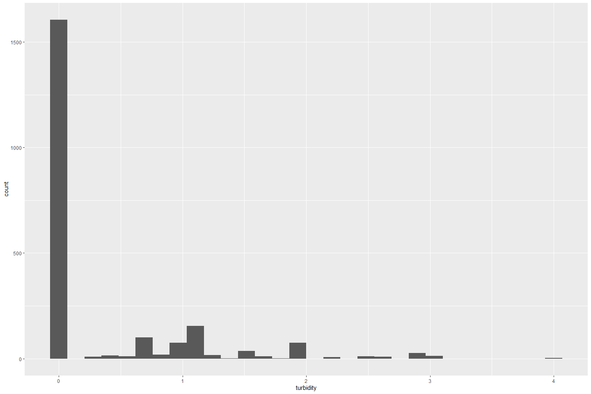
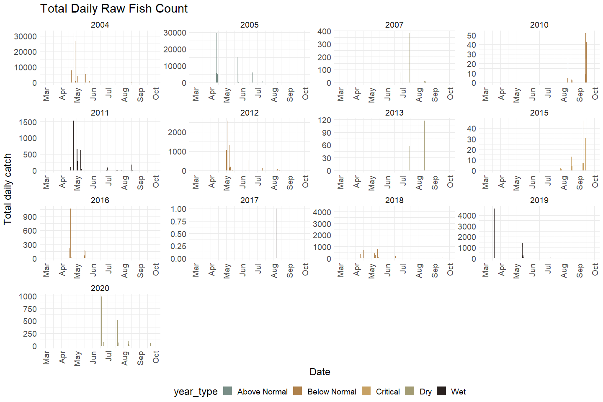
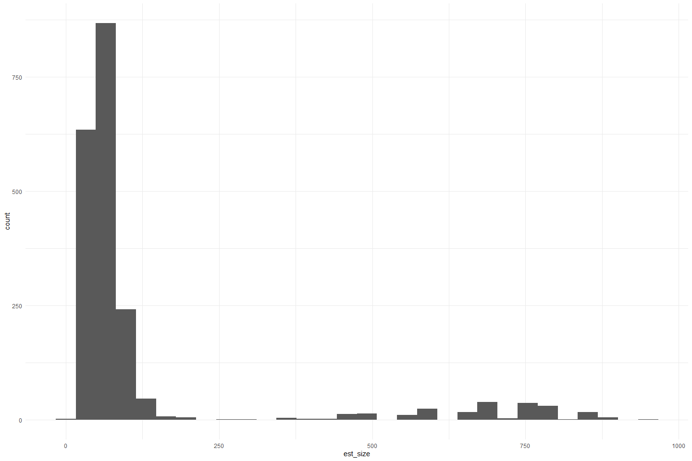
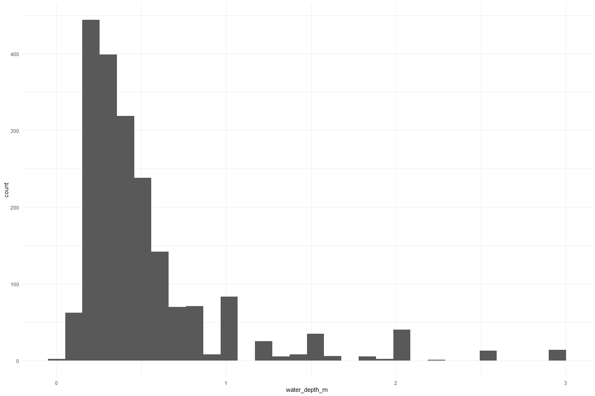

Feather River Snorkel QC
================
Erin Cain
9/29/2021

# Feather River Snorkel Data

## Description of Monitoring Data

Feather River Snorkel Data from 2004 - 2020. This data was provided to
flowwest in an access database "Snorkel\_Revided.mdb. We queried it to
have all year and important variables.

**Timeframe:** 2004 - 2020

**Seine Season:**

**Completeness of Record throughout timeframe:**

No environmental data collected pre 2010.

No data for:

-   2006
-   2008
-   2009
-   2014

**Sampling Location:** Feather River

**Data Contact:** [Casey Campos](mailto:Casey.Campos@water.ca.gov)

Any additional info?

## Access Cloud Data

``` r
# Run Sys.setenv() to specify GCS_AUTH_FILE and GCS_DEFAULT_BUCKET before running 
# getwd() to see how to specify paths 
# Open object from google cloud storage
# Set your authentication using gcs_auth
gcs_auth(json_file = Sys.getenv("GCS_AUTH_FILE"))
# Set global bucket 
gcs_global_bucket(bucket = Sys.getenv("GCS_DEFAULT_BUCKET"))
gcs_list_objects()
# git data and save as xlsx
gcs_get_object(object_name = 
                 "juvenile-rearing-monitoring/seine-and-snorkel-data/feather-river/data-raw/feather_snorkel_and_catch.xlsx",
               bucket = gcs_get_global_bucket(),
               saveToDisk = "raw_snorkel.xlsx",
               overwrite = TRUE)
```

Read in data from google cloud, glimpse raw data:

``` r
# read in data to clean 
raw_snorkel <- read_xlsx("raw_snorkel.xlsx") %>% glimpse
```

    ## Rows: 12,460
    ## Columns: 27
    ## $ SurveyID              <dbl> 1, 1, 1, 1, 1, 1, 1, 1, 1, 1, 1, 1, 1, 1, 1, 1, ~
    ## $ Date                  <dttm> NA, NA, NA, NA, NA, NA, NA, NA, NA, NA, NA, NA,~
    ## $ Flow                  <dbl> NA, NA, NA, NA, NA, NA, NA, NA, NA, NA, NA, NA, ~
    ## $ `Weather Code`        <chr> NA, NA, NA, NA, NA, NA, NA, NA, NA, NA, NA, NA, ~
    ## $ Turbidity             <dbl> NA, NA, NA, NA, NA, NA, NA, NA, NA, NA, NA, NA, ~
    ## $ Temperature           <dbl> NA, NA, NA, NA, NA, NA, NA, NA, NA, NA, NA, NA, ~
    ## $ `Time of Temperature` <dttm> NA, NA, NA, NA, NA, NA, NA, NA, NA, NA, NA, NA,~
    ## $ `Snorkel StartTtime`  <dttm> NA, NA, NA, NA, NA, NA, NA, NA, NA, NA, NA, NA,~
    ## $ `Snorkel End Time`    <dttm> NA, NA, NA, NA, NA, NA, NA, NA, NA, NA, NA, NA,~
    ## $ `Section Name`        <chr> NA, NA, NA, NA, NA, NA, NA, NA, NA, NA, NA, NA, ~
    ## $ `Units Covered`       <chr> NA, NA, NA, NA, NA, NA, NA, NA, NA, NA, NA, NA, ~
    ## $ Survey_Comments       <chr> NA, NA, NA, NA, NA, NA, NA, NA, NA, NA, NA, NA, ~
    ## $ ObsID                 <dbl> 21, 22, 23, 24, 25, 26, 27, 28, 29, 30, 31, 32, ~
    ## $ SID                   <dbl> 1, 1, 1, 1, 1, 1, 1, 1, 1, 1, 1, 1, 1, 1, 1, 1, ~
    ## $ Observer              <chr> NA, "RK,BW,KW", NA, NA, NA, NA, NA, "RK,BW,KW", ~
    ## $ Unit                  <chr> "29A", "31", "31", "31", "31A", "31A", "31A", "3~
    ## $ Species               <chr> "CHN", "RBTS", "RBTS", "RBTC", "RBTC", "RBTC", "~
    ## $ Count                 <dbl> 100, 1, 1, 7, 7, 1, 1, 25, 75, 2, 300, 12, 30, 2~
    ## $ `Size Class`          <chr> "III", "VI", "VI", "V", "V", "VI", "VI", "I", "I~
    ## $ `Est Size`            <dbl> NA, 600, 500, 350, 350, 550, 600, NA, NA, NA, NA~
    ## $ Substrate             <dbl> NA, NA, NA, NA, NA, NA, NA, NA, NA, NA, NA, NA, ~
    ## $ `Instream Cover`      <chr> NA, NA, NA, NA, NA, NA, NA, NA, NA, NA, NA, NA, ~
    ## $ `Overhead Cover`      <dbl> NA, NA, NA, NA, NA, NA, NA, NA, NA, NA, NA, NA, ~
    ## $ `Hydrology Code`      <chr> NA, NA, NA, NA, NA, NA, NA, NA, NA, NA, NA, NA, ~
    ## $ `Water Depth (m)`     <dbl> NA, NA, NA, NA, NA, NA, NA, NA, NA, NA, NA, NA, ~
    ## $ `LWD .`               <dbl> NA, NA, NA, NA, NA, NA, NA, NA, NA, NA, NA, NA, ~
    ## $ Observation_Comments  <chr> NA, NA, NA, NA, NA, NA, NA, NA, NA, NA, NA, NA, ~

## Data transformations

``` r
cleaner_snorkel_data <- raw_snorkel %>% 
  janitor::clean_names() %>%
  rename(start_time = snorkel_start_ttime, 
         end_time = snorkel_end_time, 
         lwd_number = lwd
        ) %>%
  mutate(date = as.Date(date), 
         start_time = hms::as_hms(start_time), 
         end_time = hms::as_hms(end_time),
         time_of_temperature = hms::as_hms(time_of_temperature),
         survey_id = as.character(survey_id), 
         obs_id = as.character(obs_id),
         substrate = as.character(substrate), 
         overhead_cover = as.character(overhead_cover),
         lwd_number = as.character(lwd_number)) %>% # I think this is some sort of tag number so I am changing to character
  select(-observer, -sid) %>% # remove sid because it is the same as survey_id 
  filter(!is.na(date), # survey ID 1 and 106 do not specify date 
         species %in% c("CHN", "NONE", "CHNU", "CHNT", "CHNC", "CHNF", "CHNS")) %>% # filter species to relevant values (none is helpful to show they snorkeled and did not see anything)
  glimpse()
```

    ## Rows: 2,753
    ## Columns: 25
    ## $ survey_id            <chr> "2", "2", "2", "2", "3", "3", "3", "3", "3", "3",~
    ## $ date                 <date> 2007-06-27, 2007-06-27, 2007-06-27, 2007-06-27, ~
    ## $ flow                 <dbl> NA, NA, NA, NA, NA, NA, NA, NA, NA, NA, NA, NA, N~
    ## $ weather_code         <chr> NA, NA, NA, NA, "CLR", "CLR", "CLR", "CLR", "CLR"~
    ## $ turbidity            <dbl> NA, NA, NA, NA, NA, NA, NA, NA, NA, NA, NA, NA, N~
    ## $ temperature          <dbl> NA, NA, NA, NA, NA, NA, NA, NA, NA, NA, NA, NA, N~
    ## $ time_of_temperature  <time> NA, NA, NA, NA, NA, NA, NA, NA, NA, NA, NA, NA, ~
    ## $ start_time           <time>       NA,       NA,       NA,       NA, 10:00:00~
    ## $ end_time             <time>       NA,       NA,       NA,       NA, 14:00:00~
    ## $ section_name         <chr> NA, NA, NA, NA, NA, NA, NA, NA, NA, NA, NA, NA, N~
    ## $ units_covered        <chr> NA, NA, NA, NA, "26,33,30,31,31a,32,32a", "26,33,~
    ## $ survey_comments      <chr> NA, NA, NA, NA, NA, NA, NA, NA, NA, NA, NA, NA, N~
    ## $ obs_id               <chr> "79", "81", "84", "86", "96", "98", "99", "100", ~
    ## $ unit                 <chr> "169", "173", "185", "215B", "26", "33", "33", "3~
    ## $ species              <chr> "CHN", "CHN", "CHN", "CHN", "NONE", "CHN", "CHN",~
    ## $ count                <dbl> 50, 4, 15, 7, 0, 3, 30, 1, NA, 15, NA, 70, 14, 24~
    ## $ size_class           <chr> "III", "I", "III", "III", NA, "II", "III", NA, NA~
    ## $ est_size             <dbl> NA, NA, NA, NA, NA, 50, 75, 100, NA, 100, NA, 75,~
    ## $ substrate            <chr> NA, NA, NA, NA, NA, NA, NA, NA, NA, NA, NA, NA, N~
    ## $ instream_cover       <chr> NA, NA, NA, NA, NA, NA, NA, NA, NA, NA, NA, NA, N~
    ## $ overhead_cover       <chr> NA, NA, NA, NA, NA, NA, NA, NA, NA, NA, NA, NA, N~
    ## $ hydrology_code       <chr> NA, NA, NA, NA, NA, NA, NA, NA, NA, NA, NA, NA, N~
    ## $ water_depth_m        <dbl> NA, NA, NA, NA, NA, NA, NA, NA, NA, NA, NA, NA, N~
    ## $ lwd_number           <chr> NA, NA, NA, NA, NA, NA, NA, NA, NA, NA, NA, NA, N~
    ## $ observation_comments <chr> NA, NA, NA, NA, NA, NA, NA, NA, NA, NA, NA, NA, N~

## Explore Numeric Variables:

``` r
cleaner_snorkel_data %>% select_if(is.numeric) %>% colnames()
```

    ## [1] "flow"          "turbidity"     "temperature"   "count"        
    ## [5] "est_size"      "water_depth_m"

### Variable: `flow`

**Plotting flow over Period of Record**

``` r
cleaner_snorkel_data %>% 
  ggplot(aes(x = date, y = flow)) + 
  geom_line(linetype = "dashed") + 
  geom_point() +
  facet_wrap(~year(date), scales = "free_x") + 
  theme_minimal()
```

<!-- -->

Very inconsistent and sparse flow measures.

``` r
cleaner_snorkel_data %>% 
  ggplot(aes(x = flow)) +
  geom_histogram() + 
  theme_minimal()
```

    ## `stat_bin()` using `bins = 30`. Pick better value with `binwidth`.

<!-- -->

Flow is between 0 - 8000. 0 values must be errors or NA.

**Numeric Summary of flow over Period of Record**

``` r
summary(cleaner_snorkel_data$flow)
```

    ##    Min. 1st Qu.  Median    Mean 3rd Qu.    Max.    NA's 
    ##       0     620     800    1068    1245    8000     530

**NA and Unknown Values**

-   19.3 % of values in the `flow` column are NA.

### Variable: `turbidity`

**Plotting turbidity over Period of Record**

``` r
cleaner_snorkel_data %>% 
  ggplot(aes(x = date, y = turbidity)) + 
  geom_line(linetype = "dashed") + 
  geom_point() +
  facet_wrap(~year(date), scales = "free") + 
  theme_minimal()
```

<!-- -->

We only have non zero turbidity values for 2011, 2012, 2017, 2018, and
2019

``` r
cleaner_snorkel_data %>%
  ggplot(aes(x = turbidity)) + 
  geom_histogram()
```

    ## `stat_bin()` using `bins = 30`. Pick better value with `binwidth`.

<!-- -->

Most turbidity measures are 0. All fall between 0 and 4.5.

**Numeric Summary of turbidity over Period of Record**

``` r
summary(cleaner_snorkel_data$turbidity)
```

    ##    Min. 1st Qu.  Median    Mean 3rd Qu.    Max.    NA's 
    ##  0.0000  0.0000  0.0000  0.3582  0.6700  4.0000     549

**NA and Unknown Values**

-   19.9 % of values in the `turbidity` column are NA.

### Variable: `temperature`

**Plotting temperature over Period of Record**

``` r
cleaner_snorkel_data %>% 
  ggplot(aes(x = date, y = temperature)) + 
  geom_line(linetype = "dashed") + 
  geom_point() +
  facet_wrap(~year(date), scales = "free") + 
  theme_minimal()
```

<!-- -->

No temp measures before 2010, consistency of temperature measures varies
throughout the years.

``` r
cleaner_snorkel_data %>% 
  ggplot(aes(x = temperature)) +
  geom_histogram() +
  theme_minimal()
```

    ## `stat_bin()` using `bins = 30`. Pick better value with `binwidth`.

<!-- -->

Interesting temperature distribution. I wonder if some measures are in C
and some in F? 0 values are likely also a mistake or NA.

**Numeric Summary of temperature over Period of Record**

``` r
summary(cleaner_snorkel_data$temperature)
```

    ##    Min. 1st Qu.  Median    Mean 3rd Qu.    Max.    NA's 
    ##    0.00   12.00   47.30   34.89   55.40   68.00     530

**NA and Unknown Values**

-   19.3 % of values in the `temperature` column are NA.

### Variable: `count`

**Plotting count over Period of Record**

``` r
cleaner_snorkel_data %>% 
  group_by(date) %>%
  summarise(total_daily_catch = sum(count, na.rm = T)) %>%
  # filter(year(date) > 2014, year(date) < 2021) %>%
  mutate(water_year = ifelse(month(date) %in% 10:12, year(date) + 1, year(date))) %>% 
  left_join(sac_indices) %>%
  mutate(year = as.factor(year(date)),
         fake_year = if_else(month(date) %in% 10:12, 1900, 1901),
         fake_date = as.Date(paste0(fake_year,"-", month(date), "-", day(date)))) %>%
  ggplot(aes(x = fake_date, y = total_daily_catch, fill = year_type)) + 
  geom_col() + 
  scale_x_date(labels = date_format("%b"), limits = c(as.Date("1901-03-01"), as.Date("1901-10-01")), date_breaks = "1 month") + 
  theme_minimal() + 
  theme(text = element_text(size = 18),
        axis.text.x = element_text(angle = 90, vjust = 0.5, hjust=1),
        legend.position = "bottom") + 
  labs(title = "Total Daily Raw Fish Count",
       y = "Total daily catch",
       x = "Date")+ 
  facet_wrap(~water_year, scales = "free") + 
  scale_fill_manual(values = wesanderson::wes_palette("Moonrise2", 5, type = "continuous"))
```

    ## Joining, by = "water_year"

<!-- -->

It looks like snorkel surveys do not happen very often but when they do
happen a lot of fish can be caught in a day.

``` r
cleaner_snorkel_data  %>%
  mutate(year = as.factor(year(date))) %>%
  ggplot(aes(x = year, y = count)) + 
  geom_col() + 
  theme_minimal() +
  labs(title = "Total Fish Counted each Year",
       y = "Total fish count") + 
  theme(text = element_text(size = 18),
        axis.text.x = element_text(angle = 90, vjust = 0.5, hjust=1)) 
```

<!-- -->

**Numeric Summary of count over Period of Record**

``` r
summary(cleaner_snorkel_data$count)
```

    ##    Min. 1st Qu.  Median    Mean 3rd Qu.    Max.    NA's 
    ##     0.0     2.0    10.0   321.9    50.0 25000.0     309

**NA and Unknown Values**

-   11.2 % of values in the `count` column are NA.

### Variable: `est_size`

TODO figure out what size is describing. Is it length? or weight?

**Plotting est\_size over Period of Record**

``` r
cleaner_snorkel_data %>% 
  ggplot(aes(x = est_size)) + 
  geom_histogram() + 
  theme_minimal()
```

    ## `stat_bin()` using `bins = 30`. Pick better value with `binwidth`.

<!-- -->

Estimated sizes fall between 0 and 1000. Again we need to figure out
what type of size variable they are estimating

**Numeric Summary of est\_size over Period of Record**

``` r
summary(cleaner_snorkel_data$est_size)
```

    ##    Min. 1st Qu.  Median    Mean 3rd Qu.    Max.    NA's 
    ##     0.0    45.0    60.0   127.2    85.0   950.0     732

**NA and Unknown Values**

-   26.6 % of values in the `est_size` column are NA.

### Variable: `water_depth_m`

Depth of water, units: m

**Plotting water depth over Period of Record**

``` r
cleaner_snorkel_data %>% 
  ggplot(aes(x = water_depth_m)) + 
  geom_histogram() + 
  theme_minimal()
```

    ## `stat_bin()` using `bins = 30`. Pick better value with `binwidth`.

<!-- -->
Depth of water is between 0 and 3 meters.

**Numeric Summary of depth of water over Period of Record**

``` r
summary(cleaner_snorkel_data$water_depth_m)
```

    ##    Min. 1st Qu.  Median    Mean 3rd Qu.    Max.    NA's 
    ##  0.0500  0.2500  0.4000  0.5178  0.6000  3.0000     761

**NA and Unknown Values**

-   27.6 % of values in the `water_depth_m` column are NA.

## Explore Categorical variables:

``` r
cleaner_snorkel_data %>% select_if(is.character) %>% colnames()
```

    ##  [1] "survey_id"            "weather_code"         "section_name"        
    ##  [4] "units_covered"        "survey_comments"      "obs_id"              
    ##  [7] "unit"                 "species"              "size_class"          
    ## [10] "substrate"            "instream_cover"       "overhead_cover"      
    ## [13] "hydrology_code"       "lwd_number"           "observation_comments"

### Variable: `survey_id`

Each row does not correspond to a unique survey.

``` r
length(unique(cleaner_snorkel_data$survey_id)) == length(cleaner_snorkel_data)
```

    ## [1] FALSE

There are 350 unique survey ids

**NA and Unknown Values**

-   0 % of values in the `survey_id` column are NA.

### Variable: `weather_code`

No lookup table for weather codes provided. However, they are fairly
easy to interperate. Would be best if we could get weather codes
standardized throughout and condense these down.

``` r
table(cleaner_snorkel_data$weather_code) 
```

    ## 
    ##                        CLD CLD, Wind, Light Sprinkles 
    ##                        217                          1 
    ##                   CLD/RAIN                       CLDY 
    ##                         89                         16 
    ##                        CLR                  CLR (Hot) 
    ##                       1431                         12 
    ##                     CLR 95                    CLR Hot 
    ##                          1                          3 
    ##                  CLR WINDY                    CLR/CLD 
    ##                         22                          5 
    ##                    CLR/Hot                Hot and CLR 
    ##                          1                          8 
    ##                LT CLD/HAZE                    LT RAIN 
    ##                          7                          6 
    ##                   PT. CLDY                       RAIN 
    ##                         19                          4 
    ##                        RAN                        sun 
    ##                         20                          7 
    ##                        SUN                        WND 
    ##                        334                         18

Fix inconsistencies with spelling, capitalization, and abbreviations.

``` r
cleaner_snorkel_data$weather_code <- case_when(cleaner_snorkel_data$weather_code %in% c("CLD", "CLDY") ~ "cloudy", 
                                               cleaner_snorkel_data$weather_code %in% c("CLR (Hot)", "CLR/Hot", "Hot and CLR", "CLR Hot") ~ "clear and hot",
                                               cleaner_snorkel_data$weather_code %in% c("RAIN", "RAN", "CLD/RAIN", "LT RAIN", "CLD, Wind, Light Sprinkles") ~
                                                 "precipitation",
                                               cleaner_snorkel_data$weather_code %in% c("CLR 95", "CLR") ~ "clear",
                                               cleaner_snorkel_data$weather_code %in% c("PT. CLDY", "CLR/CLD") ~ "partly cloudy",
                                               cleaner_snorkel_data$weather_code %in% c("sun", "SUN") ~ "sunny",
                                               cleaner_snorkel_data$weather_code == c("CLR WINDY") ~ "clear and windy",
                                               cleaner_snorkel_data$weather_code == c("WND") ~ "windy",
                                               cleaner_snorkel_data$weather_code == c("LT CLD/HAZE") ~ "hazy")

table(cleaner_snorkel_data$weather_code) 
```

    ## 
    ##           clear   clear and hot clear and windy          cloudy            hazy 
    ##            1432              24              22             233               7 
    ##   partly cloudy   precipitation           sunny           windy 
    ##              24             120             341              18

I would still like to simplify these down more but this is better for
now.

**NA and Unknown Values**

-   19.3 % of values in the `weather_code` column are NA.

### Variable: `section_name`

A lot of differnt section names. TODO clean these up

``` r
table(cleaner_snorkel_data$section_name) 
```

    ## 
    ##                                       Aleck 
    ##                                          38 
    ##                                       ALECK 
    ##                                           6 
    ##                                Aleck Riffle 
    ##                                          16 
    ##                                  Auditorium 
    ##                                          16 
    ##                                  AUDITORIUM 
    ##                                           4 
    ##                           Auditorium Riffle 
    ##                                          39 
    ##                             Bed Rock Riffle 
    ##                                           3 
    ##                                     Bedrock 
    ##                                          22 
    ##                                     BEDROCK 
    ##                                          15 
    ##                                Bedrock Park 
    ##                                          21 
    ##                              Bedrock Riffle 
    ##                                          38 
    ##                                  Big Riffle 
    ##                                          17 
    ##                                  BIG RIFFLE 
    ##                                           5 
    ##                                         Eye 
    ##                                          35 
    ##                                         EYE 
    ##                                          38 
    ##                                  Eye Riffle 
    ##                                          63 
    ##                                  EYE RIFFLE 
    ##                                           1 
    ##                           G-95 Side Channel 
    ##                                           1 
    ##                              G-95 Side West 
    ##                                          11 
    ##                                         G95 
    ##                                          17 
    ##                                    G95 SIDE 
    ##                                           5 
    ##                            G95 Side Channel 
    ##                                           5 
    ##                       G95 West side channel 
    ##                                           7 
    ##                                     Gateway 
    ##                                          77 
    ##                                     GATEWAY 
    ##                                           2 
    ##                              Gateway Riffle 
    ##                                          28 
    ##                                       GOOSE 
    ##                                           1 
    ##                                Goose Riffle 
    ##                                          15 
    ##                              Gridley Riffle 
    ##                                          14 
    ##                        GRIDLEY SIDE CHANNEL 
    ##                                           5 
    ##            Hatchery and Moe's Side Channels 
    ##                                          26 
    ##                              Hatchery Ditch 
    ##                                         106 
    ##                              HATCHERY DITCH 
    ##                                          20 
    ## Hatchery Ditch (lower), Moe's Ditch (upper) 
    ##                                           1 
    ##                    Hatchery Ditch and Moe's 
    ##                                          37 
    ##              Hatchery Ditch and Moe's Ditch 
    ##                                           9 
    ##                  Hatchery Ditch Moe's Ditch 
    ##                                           8 
    ##                        Hatchery Ditch, Moes 
    ##                                           1 
    ##                        Hatchery Ditch/Moe's 
    ##                                          29 
    ##                         Hatchery Ditch/Moes 
    ##                                           1 
    ##                             Hatchery Riffle 
    ##                                          77 
    ##                             HATCHERY RIFFLE 
    ##                                           7 
    ##           HATCHERY SIDE CH. / MOES SIDE CH. 
    ##                                          26 
    ##                       Hatchery Side Channel 
    ##                                          80 
    ##             Hatchery Side Channel and Moe's 
    ##                                           3 
    ##        Hatchery Side Channel and Moes Ditch 
    ##                                          12 
    ##           Hatchery Side Channel/Moe's Ditch 
    ##                                           3 
    ##                         Hatchery side/ditch 
    ##                                          45 
    ##                                    Junkyard 
    ##                                          14 
    ##                             Junkyard Riffle 
    ##                                           6 
    ##                                     Keister 
    ##                                           7 
    ##                                     KEISTER 
    ##                                           2 
    ##                              Keister Riffle 
    ##                                           5 
    ##                             Lower Mcfarland 
    ##                                           2 
    ##                             Lower McFarland 
    ##                                           6 
    ##                             LOWER MCFARLAND 
    ##                                           3 
    ##                              Lower Robinson 
    ##                                           4 
    ##                                     Mathews 
    ##                                           4 
    ##                                     MATHEWS 
    ##                                           2 
    ##                              Mathews Riffle 
    ##                                           1 
    ##                                    Matthews 
    ##                                          20 
    ##                             Matthews Riffle 
    ##                                          37 
    ##                                 Moe's Ditch 
    ##                                           1 
    ##                                        MOES 
    ##                                           9 
    ##                                    Robinson 
    ##                                          37 
    ##                                    ROBINSON 
    ##                                          22 
    ##                             Robinson Riffle 
    ##                                          74 
    ##                                       Steep 
    ##                                          39 
    ##                                       STEEP 
    ##                                          21 
    ##                                Steep Riffle 
    ##                                          98 
    ##                                STEEP RIFFLE 
    ##                                          15 
    ##                                Trailer Park 
    ##                                          53 
    ##                                TRAILER PARK 
    ##                                           4 
    ##                         Trailer Park Riffle 
    ##                                          11 
    ##                             Upper McFarland 
    ##                                           1 
    ##                                  Vance East 
    ##                                          11 
    ##                             Vance W. Riffle 
    ##                                           4 
    ##                                  Vance West 
    ##                                          24 
    ##                           Vance West Riffle 
    ##                                           2

Fix inconsistencies with spelling, capitalization, and abbreviations.

``` r
# Fix any inconsistencies with categorical variables
```

**Create lookup rda for \[variable\] encoding:**

``` r
# Create named lookup vector
# Name rda [watershed]_[data type]_[variable_name].rda
# save rda to data/ 
```

**NA and Unknown Values**

-   42.1 % of values in the `section_name` column are NA.

### Variable: `units_covered`

A lot of units described here. TODO clean up

``` r
table(cleaner_snorkel_data$units_covered) 
```

    ## 
    ##                      103-105                    103 - 105 
    ##                            2                            9 
    ##                  103 104 105                103, 104, 105 
    ##                           44                            2 
    ##                  103,104,105                  105 104 103 
    ##                            6                            1 
    ##                          119                      119 120 
    ##                           14                           25 
    ##                     119, 120                      119,120 
    ##                            8                            9 
    ##                      120 119                      169-175 
    ##                            4                           25 
    ##      169 170 171 173 174 175      169 170 171 173 175 175 
    ##                           37                            3 
    ##          169 170 173 174 175 169, 170, 171, 173, 174, 175 
    ##                            1                            2 
    ##      169,170,171,173,174,175      171 170 169 174 175 173 
    ##                           20                           14 
    ##              171,173,174,175              173 169 170 175 
    ##                            1                            4 
    ##      173 174 175 170 169 171       173 174 175 171 170169 
    ##                           16                            5 
    ##              175 171 170 174                      185 189 
    ##                            5                           43 
    ##                     185, 189                      185,189 
    ##                            2                            4 
    ##                          189                      189 185 
    ##                            3                          118 
    ##                     189, 185                      189,185 
    ##                            2                            1 
    ##                     19 23-25                  19 23 24 25 
    ##                            3                           57 
    ##                    19, 23-25                     19,23-25 
    ##                           10                            1 
    ##                  19,23,24,25        210 215A 215B 216 217 
    ##                            6                           21 
    ##               210 215A/B 216               210 216 215A/B 
    ##                           28                            7 
    ##          210, 217, 215A, 216           210,215,217,215A/B 
    ##                            6                            1 
    ##        210,215A,215B,216,217        210,217,216,215A,215B 
    ##                            3                            1 
    ##        215 215A 215B 210 217          215 A,B 216 210 217 
    ##                            3                            1 
    ##            215A 215B 216 210        215A 215B 216 210 217 
    ##                            2                            8 
    ##        215A 215B 216 217 210        215A 215B 217 216 210 
    ##                           28                           14 
    ##               215A/B 216 210                  216 217 210 
    ##                            4                           10 
    ##          221 225 226 228 229          221 225 229 226 228 
    ##                           33                            2 
    ##          221 226 225 228 229              221 226 228 229 
    ##                            2                           10 
    ##              221 226 229 228      221, 225, 225, 228, 229 
    ##                           31                            6 
    ##      221, 225, 226, 228, 229          221,225,226,228,229 
    ##                            1                            4 
    ##              225 228 221 229             225,2228,229,221 
    ##                            2                            1 
    ##              226 228 229 221      226, 228, 229, 221, 225 
    ##                            1                           14 
    ##                        23 24                     23 24 25 
    ##                            1                            1 
    ##                        23,24                     23,24,25 
    ##                            1                            1 
    ##                     26 28 33                        26 33 
    ##                            6                          117 
    ##                     26 33 28                     26,33,28 
    ##                            9                            3 
    ##       26,33,30,31,31a,32,32a                      266 268 
    ##                           13                           25 
    ##                     266, 268                          268 
    ##                            1                           14 
    ##                           28                        29-31 
    ##                           10                           10 
    ##                        29-32                  29 30 31 32 
    ##                            7                           21 
    ##                  29,30,31,32                     29,31,32 
    ##                            5                            7 
    ##                  29,31,32,30                  30 31 32 29 
    ##                            2                            6 
    ##                     30,31,29                    323A 323B 
    ##                            1                           21 
    ##                   323A, 323B                       323A/B 
    ##                            1                           13 
    ##                         323B                    323B 323A 
    ##                            4                            7 
    ##                           33                        33 26 
    ##                            4                          125 
    ##                     33 26 28                        33 28 
    ##                           81                            1 
    ##                   33, 26, 28                     33,26,28 
    ##                           26                           35 
    ##                  402 397 403                  402 403 397 
    ##                            2                            6 
    ##                          403                  403 397 402 
    ##                            1                            5 
    ##                          408                          424 
    ##                           16                            6 
    ##                      424 426                      426 424 
    ##                           11                            5 
    ##                      441 445                          450 
    ##                            1                           11 
    ##                      486 487                      487 486 
    ##                            7                           12 
    ##                          499                      499 502 
    ##                            2                            7 
    ##                      499,502                      502 499 
    ##                            1                           10 
    ##                        55 56                       55, 56 
    ##                           67                           12 
    ##                        55,56                        96-98 
    ##                           20                            2 
    ##                     96 97 98                     96,97,98 
    ##                           47                           11 
    ##                        97 98                     97 98 96 
    ##                            1                            6 
    ##                        98,97 
    ##                            1

Fix inconsistencies with spelling, capitalization, and abbreviations.

``` r
# Fix any inconsistencies with categorical variables
```

**Create lookup rda for \[variable\] encoding:**

``` r
# Create named lookup vector
# Name rda [watershed]_[data type]_[variable_name].rda
# save rda to data/ 
```

**NA and Unknown Values**

-   41.9 % of values in the `units_covered` column are NA.

### Variable: `survey_comments` `observation_comments`

``` r
unique(cleaner_snorkel_data$survey_comments)[1:5]
```

    ## [1] NA                                                                                                                                              
    ## [2] "turbid/muddy"                                                                                                                                  
    ## [3] "No fish observed in unit 216"                                                                                                                  
    ## [4] "One Lonely Salmon, No fish observed in unit 424"                                                                                               
    ## [5] "Observations highly affected by poor Visibility. Walking on the shore, several hundred salmon observed were not observed by snorkeling methods"

``` r
unique(cleaner_snorkel_data$observation_comments)[1:5]
```

    ## [1] NA                                               
    ## [2] "Just upstream of culvert-used as instream cover"
    ## [3] "ROOT BALL"                                      
    ## [4] "ALL IN MARGIN"                                  
    ## [5] "MARGIN"

**NA and Unknown Values**

-   84.8 % of values in the `survey_comments` column are NA.

-   96.5 % of values in the `observation_comments` column are NA.

### Variable: `obs_id`

Each row does not correspond to a unique observation.

``` r
length(unique(cleaner_snorkel_data$obs_id)) == length(cleaner_snorkel_data)
```

    ## [1] FALSE

There are 2753 unique observation ids

-   0 % of values in the `obs_id` column are NA.

### Variable: `unit`

TODO figure out what unit is refering to

``` r
table(cleaner_snorkel_data$unit) 
```

    ## 
    ##    1   10  100  102  103  104  105  107  108  119   12  120  121 121A  122  123 
    ##    1    1    2    1   23   34   31    2    1   95    1   26    1    6    6    3 
    ##  124  125  126  127  161  162  163  164  165  166  167  169  170  171  172  173 
    ##    7    2    1    3    1    1    1    1    1    1    1   37   15   60   10   43 
    ##  174  175  176  177  178  179  180  183  185  189   19  191  192  193  197  198 
    ##   13   43    7    3    4    2    2    5   62  186   41    1    1    1    1    1 
    ##  199   20  200  205  207  208   21  210  213  215 215A 215B  216  217   22  221 
    ##    1    1    3    3    1    1    2  108    1    7   43   25   23   36    4   22 
    ##  224  225  226  228  229   23  233  236  237   24  241   25   26  266  267  268 
    ##    1   15   31   28   36   58    1    1    1   34    1   33  276   15    2   31 
    ##  269   27  270  271 272B 273B 274B  275  276  278   28  282  283  284  288  289 
    ##    1   49    1    1    1    1    1    1    1    1   49    1    1    1    1    1 
    ##   29  290  294  295  296  297  299  29A   30  303  304  305  306  308   31  310 
    ##   41    1    1    1    1    1    1   11   23    1    1    1    1    1   24    1 
    ##  311  31A   32 323A 323B  328 329B  32A   33  330  331  334  335  336  337  352 
    ##    1    7   73   38   21    2    1   11  277    1    1    1    2    1    1    1 
    ##  355  356  358  359   36  361  362  364  365  367  368   37  370   38  387  388 
    ##    1    1    1    1    1    1    1    1    1    1    1    1    1    2    1    1 
    ##   39  397  402  403  405  406  407  408  409  410  411  412  413   42  424  426 
    ##    2    3    6    6    1    1    1   23    3    4    4    2    3    2   13    9 
    ##  441  445  446  448  449  450  451  452  453  454   46  483  484  485  486  487 
    ##    1    5    1    1    5   15    5    4    4    1    1    1    2    2   18    6 
    ##  499    5   50  502   52   54   55   56   59    6    7    8    9   96   97   98 
    ##    6    1    1   14    2   15   40   89    1    1    1    1    1   66   13   30

Fix inconsistencies with spelling, capitalization, and abbreviations.

``` r
# Fix any inconsistencies with categorical variables
```

**Create lookup rda for \[variable\] encoding:**

``` r
# Create named lookup vector
# Name rda [watershed]_[data type]_[variable_name].rda
# save rda to data/ 
```

**NA and Unknown Values**

-   0 % of values in the `unit` column are NA.

### Variable: `species`

Species lookup table:

| SpeciesCode | Species                  |
|-------------|--------------------------|
| CHN         | Chinook salmon           |
| CHNC        | Chinook Salmon - Clipped |
| CHNT        | Chinook salmon - Tagged  |
| CHNU        | Chinook salmon - Unknown |
| NONE        | Z. nada                  |

Species lookup table does not give a definition for CHNF, CHNS. My guess
is that these refer to Chinook salmon Spring and Chinook salmon fall but
I would want to confirm this.

``` r
table(cleaner_snorkel_data$species) 
```

    ## 
    ##  CHN CHNC CHNF CHNS CHNT CHNU NONE 
    ## 2186   22    2   13    6   60  464

TODO create clipped/adipose column from this column

TODO create a run column from this column

``` r
# Fix any inconsistencies with categorical variables
```

**NA and Unknown Values**

-   0 % of values in the `species` column are NA.

### Variable: `size_class`

| Size Class | Size Range |
|------------|------------|
| I          | 0-50       |
| II         | 51-75      |
| III        | 76-100     |
| IV         | 101-150    |
| V          | 151-300    |
| VI         | 301-499    |
| VII        | 500+       |

``` r
table(cleaner_snorkel_data$size_class) 
```

    ## 
    ##   I  II III  IV   V  VI VII 
    ## 272 326 167  48  11  49  55

**NA and Unknown Values**

-   66.3 % of values in the `size_class` column are NA.

### Variable: `substrate`

| SubstrateCode | Substrate                    |
|---------------|------------------------------|
| 1             | Organic Fines, Mud (0.05 mm) |
| 2             | Sand (0.05 to 2 mm)          |
| 3             | Small Gravel (2 to 50 mm)    |
| 4             | Large Gravel (50 to 150 mm)  |
| 5             | Cobble (150 to 300 mm)       |
| 6             | Boulder (&gt; 300 mm)        |
| 0             | ?                            |

It appears that if more than one substrate is present they list all by
creating multi-didget numbers. Not sure what 0 stands for? TODO

``` r
table(cleaner_snorkel_data$substrate) 
```

    ## 
    ##     0     1    12   123  1234   124  1245    13   134   135    14   145  1456 
    ##     1    30    98    93    20     9     1    68    27     1     4     4     2 
    ##    15     2    23   234  2344  2345 23456   235    24   245    25   256     3 
    ##     2   107   259   150     1     5     1     1     5     2     6     2   324 
    ##    34   345  3456     4    45   456     5    56     6 
    ##   269    66    13   267    35    39    84     4     1

What is the best way to show multiple substrates at different sites? In
the seine data they have many substrate columns but I do not think I
like that better.

**NA and Unknown Values**

-   27.3 % of values in the `substrate` column are NA.

### Variable: `instream_cover`

| ICoverCode | ICover                                           |
|------------|--------------------------------------------------|
| A          | No apparent cover                                |
| B          | Small instream objects/small-medium woody debris |
| C          | Large instream objects/large woody debris        |
| D          | Overhead objects                                 |
| E          | Submerged aquatic veg/filamentous algae          |
| F          | Undercut bank                                    |

Instream cover appears to use a similar method as substrate where they
add letters on if multiple covers are present.

``` r
table(cleaner_snorkel_data$instream_cover) 
```

    ## 
    ##     A    AE     B    BC   BCD  BCDE BCDEF  BCDF   BCE  BCEF   BCF    BD   BDE 
    ##   534     2   360    22    32   102    42     3    62    11     3    26   130 
    ##  BDEF   BDF    BE   BEC   BED   BEF  BEFD    BF     C    CD   CDE  CDEF   CDF 
    ##    39    24   214     1    12    15     1     5    72     7    12     1     2 
    ##    CE   CED   CEF    CF     D    DE     E    EB    EC   ECF    EF   EFD     F 
    ##    42     2     6     2    15     5   137    13     4     1    23     2    12 
    ##    FE 
    ##     1

What is the best way to display/simplify these?

**NA and Unknown Values**

-   27.4 % of values in the `instream_cover` column are NA.

### Variable: `overhead_cover`

| OCoverCode | OCover                                         |
|------------|------------------------------------------------|
| 0          | No Apparent Cover                              |
| 1          | Overhanging veg/obj (&lt; 0.5 m above surface) |
| 2          | Overhanging veg/obj (0.5 to 2 m above surface  |
| 3          | Surface turbulence, bubble curtain             |

Overhead cover appears to use a similar method as substrate and instream
cover where they add letters on if multiple covers are present.

``` r
table(cleaner_snorkel_data$overhead_cover) 
```

    ## 
    ##   0   1  12  13   2   3   4 
    ## 708 974  28  10 237  33   1

**NA and Unknown Values**

-   27.7 % of values in the `overhead_cover` column are NA.

### Variable: `hydrology_code`

Looks like these are already defined for the most part, GM = Glide
Edgewater so we can change that.

``` r
table(cleaner_snorkel_data$hydrology_code) 
```

    ## 
    ##        Backwater            Glide  Glide Edgewater               GM 
    ##              122              416              685                1 
    ##             Pool           Riffle Riffle Edgewater 
    ##               88              337              352

Fix inconsistencies with spelling, capitalization, and abbreviations.

``` r
cleaner_snorkel_data$hydrology_code <- ifelse(cleaner_snorkel_data$hydrology_code == "GM", "Glide Edgewater", cleaner_snorkel_data$hydrology_code)

table(cleaner_snorkel_data$hydrology_code) 
```

    ## 
    ##        Backwater            Glide  Glide Edgewater             Pool 
    ##              122              416              686               88 
    ##           Riffle Riffle Edgewater 
    ##              337              352

-   27.3 % of values in the `hydrology_code` column are NA.

### Variable: `lwd_number`

I am not sure what this number is refering to, TODO

``` r
table(cleaner_snorkel_data$lwd_number) 
```

    ## 
    ##    0 3001 3002 3003 3004 3005 3006 3007 3008 3010 3013 3018 3020 
    ## 2111    2    1    7    1    1   16    6    2    4    1    1    1

**NA and Unknown Values**

-   21.8 % of values in the `lwd_number` column are NA.

## Summary of identified issues

-   Snorkel surveys are not done every year in the timeframe
-   Environmental data very sparse, especially in early years
-   Still a few unknown columns that we need to define and understand
-   Figure out the best way to display and standardize substrate and
    cover information

## Save cleaned data back to google cloud

``` r
# Write to google cloud 
# Name file [watershed]_[data type].csv
```
