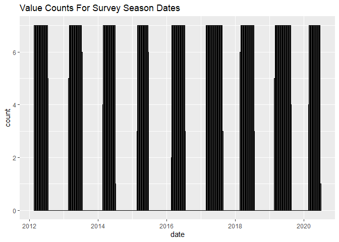
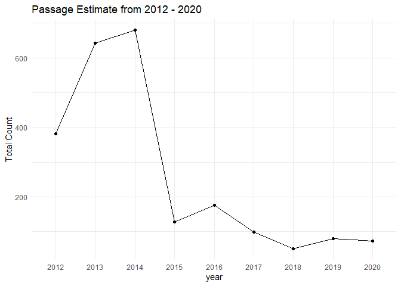
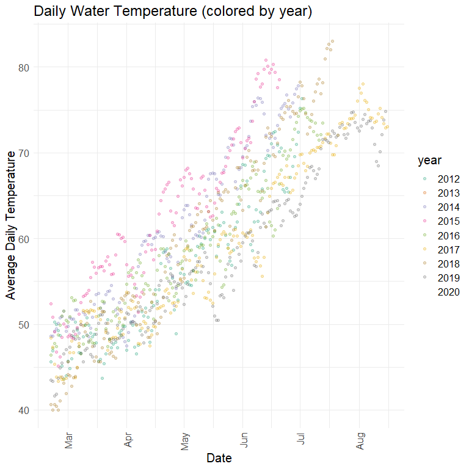

mill-creek-adult-upstream-passage-monitoring-qc-checklist
================
Inigo Peng
10/19/2021

# Mill Creek Adult Holding Survey Data 2012 to 2020

**Description of Monitoring Data**

**Timeframe:**

2012 to 2020

**Completeness of Record throughout timeframe:**

-   Few missing value count for count
-   10 - 15 % missing values for physical variables

**Sampling Location:**

-   Ward Dam

**Data Contact:** [Matt Johnson](mailto:Matt.Johnson@wildlife.ca.gov)

## Access Cloud Data

``` r
# Run Sys.setenv() to specify GCS_AUTH_FILE and GCS_DEFAULT_BUCKET before running
# Open object from google cloud storage
# Set your authentication using gcs_auth
gcs_auth(json_file = Sys.getenv("GCS_AUTH_FILE"))
# Set global bucket 
gcs_global_bucket(bucket = Sys.getenv("GCS_DEFAULT_BUCKET"))
gcs_list_objects()
# git data and save as xlsx
gcs_get_object(object_name = "adult-upstream-passage-monitoring/mill-creek/data-raw/Mill Creek SRCS Daily Video Passage Estimates 2012-2020.xlsx",
               bucket = gcs_get_global_bucket(),
               saveToDisk = "mill_creek_passage_estimate_raw.xlsx")
```

``` r
sheets <- readxl::excel_sheets('mill_creek_passage_estimate_raw.xlsx')
list_all <- lapply(sheets, function(x) readxl::read_excel(path = "mill_creek_passage_estimate_raw.xlsx", sheet = x, col_types = c("text", "numeric", "numeric", "numeric", "text")))
```

    ## New names:
    ## * `` -> ...5
    ## New names:
    ## * `` -> ...5
    ## New names:
    ## * `` -> ...5
    ## New names:
    ## * `` -> ...5
    ## New names:
    ## * `` -> ...5
    ## New names:
    ## * `` -> ...5
    ## New names:
    ## * `` -> ...5
    ## New names:
    ## * `` -> ...5
    ## New names:
    ## * `` -> ...5

``` r
raw_data <- dplyr::bind_rows(list_all) %>% 
  glimpse()
```

    ## Rows: 1,320
    ## Columns: 5
    ## $ Date                                <chr> "40959", "40960", "40961", "40962"~
    ## $ `Adult Spring-Run Passing Ward Dam` <dbl> 0, 0, 0, 0, 0, 0, 0, 0, 0, 0, 0, 0~
    ## $ `AVG Daily Flow Below Ward Dam`     <dbl> 112.0938, 110.0208, 109.9479, 113.~
    ## $ `AVG Daily H2O Temp Below Ward Dam` <dbl> 45.60833, 46.89688, 50.28125, 49.9~
    ## $ ...5                                <chr> "Spring Run video monitoring thru ~

## Data Transformations

``` r
cleaner_data <- raw_data %>% 
  set_names(tolower(colnames(raw_data))) %>% 
  select(-"...5") %>% #comments describe dates
  rename("count" =  'adult spring-run passing ward dam',
         "flow" = "avg daily flow below ward dam",
         "temperature"= "avg daily h2o temp below ward dam") %>% 
  filter(date != "Totals:", date != "Total:") %>%
  mutate(date = case_when(
    str_length(date) == 5 ~ as.Date(as.numeric(date), origin="1899-12-30"),
    str_detect(date, '[/]') ~ as.Date(date, "%m/%d/%Y"))
    # TRUE ~ as.Date(date))
  ) %>% 
  glimpse()
```

    ## Rows: 1,316
    ## Columns: 4
    ## $ date        <date> 2012-02-20, 2012-02-21, 2012-02-22, 2012-02-23, 2012-02-2~
    ## $ count       <dbl> 0, 0, 0, 0, 0, 0, 0, 0, 0, 0, 0, 0, 0, 1, 1, 0, 0, 0, 0, 0~
    ## $ flow        <dbl> 112.0938, 110.0208, 109.9479, 113.1042, 112.8021, 114.6979~
    ## $ temperature <dbl> 45.60833, 46.89688, 50.28125, 49.93229, 49.24583, 48.69375~

## Explore `date`

``` r
cleaner_data%>%
  ggplot(aes(x = date)) +
  geom_histogram(binwidth = 7, position = 'stack', color = "black") +
  labs(title = "Value Counts For Survey Season Dates")+
  theme(legend.text = element_text(size = 8))
```

<!-- -->

``` r
summary(cleaner_data$date)
```

    ##         Min.      1st Qu.       Median         Mean      3rd Qu.         Max. 
    ## "2012-02-20" "2014-03-31" "2016-06-14" "2016-06-03" "2018-06-20" "2020-06-22" 
    ##         NA's 
    ##          "2"

**NA and Unknown Values**

-   0.2 % of values in the `date` column are NA.

## Explore Numerical Values

### Variable:`count`

``` r
cleaner_data %>%
  filter(date != is.na(date)) %>%
  mutate(year = as.factor(year(date))) %>% 
  # glimpse()
  ggplot(aes(x=date, y = count))+
  geom_line()+
  facet_wrap(~year, scales = "free")+
  theme_minimal()+
  labs(title = "Daily Passage Estimate From 2012 - 2020")
```

<!-- -->

``` r
cleaner_data %>% 
  filter(date != is.na(date)) %>%
  mutate(year = as.factor(year(date))) %>%
  # glimpse()
  group_by(year) %>% 
  summarise(total = sum(count, na.rm  = TRUE)) %>%
  # glimpse()
  ggplot(aes(x = year, y = total, group = 1))+
  geom_line()+
  geom_point(aes(x=year, y = total))+
  theme_minimal()+
  labs(title = "Passage Estimate from 2012 - 2020",
       y = "Total Count")
```

<!-- -->

**Numeric Monthly Summary of count From 2012 to 2020**

``` r
cleaner_data %>%
  group_by(month(date)) %>%
  summarise(count = sum(count, na.rm = T)) %>%
  pull(count) %>%
  summary()
```

    ##    Min. 1st Qu.  Median    Mean 3rd Qu.    Max. 
    ##    0.00    0.75   68.01  288.55  390.97 1069.22

**NA and Unknown Values**

-   2.9 % of values in the `count` column are NA.

### Variable:`flow`

``` r
cleaner_data %>% 
  filter(date != is.na(date)) %>%
  group_by(date) %>%
  mutate(avg_flow = mean(flow, na.rm = T)) %>%
  ungroup() %>% 
  mutate(year = as.factor(year(date)),
         fake_year = 1900,
         fake_date = as.Date(paste0(fake_year,"-", month(date), "-", day(date)))) %>% 
  ggplot(aes(x = fake_date, y = avg_flow, color = year)) + 
  scale_color_brewer(palette = "Dark2")+
  geom_point(alpha = .25) + 
  scale_x_date(labels = date_format("%b"), date_breaks = "1 month") + 
  theme_minimal() + 
  theme(text = element_text(size = 15),
        axis.text.x = element_text(angle = 90, vjust = 0.5, hjust=1)) + 
  labs(title = "Daily Water Flow (colored by year)",
       y = "Average Daily Flow", 
       x = "Date")  
```

<!-- -->

``` r
cleaner_data %>% 
  mutate(year = as.factor(year(date))) %>% 
  ggplot(aes(x=flow, fill = year))+
  scale_fill_brewer(palette = "Dark2")+
  geom_histogram()+
  theme_minimal()+
  labs(title = "Distribution of Flow")
```

    ## `stat_bin()` using `bins = 30`. Pick better value with `binwidth`.

<!-- -->

**Numeric Annual Summary of flow From 2012 to 2020**

``` r
cleaner_data %>%
  group_by(year(date)) %>%
  summarise(flow = mean(flow, na.rm = T)) %>%
  pull(flow) %>%
  summary()
```

    ##    Min. 1st Qu.  Median    Mean 3rd Qu.    Max.    NA's 
    ##   84.76  177.50  231.13  227.14  276.05  326.35       1

**NA and Unknown Values**

-   16.6 % of values in the `flow` column are NA.

### Variable:`temperature`

``` r
cleaner_data %>% 
  filter(date != is.na(date)) %>%
  group_by(date) %>%
  mutate(avg_temp = mean(temperature, na.rm = T)) %>%
  ungroup() %>% 
  mutate(year = as.factor(year(date)),
         fake_year = 1900,
         fake_date = as.Date(paste0(fake_year,"-", month(date), "-", day(date)))) %>% 
  ggplot(aes(x = fake_date, y = avg_temp, color = year)) + 
  scale_color_brewer(palette = "Dark2")+
  geom_point(alpha = .25) + 
  scale_x_date(labels = date_format("%b"), date_breaks = "1 month") + 
  theme_minimal() + 
  theme(text = element_text(size = 15),
        axis.text.x = element_text(angle = 90, vjust = 0.5, hjust=1)) + 
  labs(title = "Daily Water Temperature (colored by year)",
       y = "Average Daily Temperature", 
       x = "Date")  
```

<!-- -->

``` r
cleaner_data %>% 
  filter(date != is.na(date)) %>%
  mutate(year = as.factor(year(date))) %>% 
  ggplot(aes(x=temperature, fill = year))+
  scale_fill_brewer(palette = "Dark2")+
  geom_histogram(bins = 10)+
  theme_minimal()+
  labs(title = "Distribution of Temperature")
```

<!-- -->

**Numeric Annual Summary of temperature From 2012 to 2020**

``` r
cleaner_data %>%
  group_by(year(date)) %>%
  summarise(temperature = mean(temperature, na.rm = T)) %>%
  pull(temperature) %>%
  summary()
```

    ##    Min. 1st Qu.  Median    Mean 3rd Qu.    Max.    NA's 
    ##   44.27   57.59   58.76   57.57   60.05   62.49       1

**NA and Unknown Values**

-   11.9 % of values in the `temperature` column are NA.

### Notes and Issues:

-   Count drops significantly after 2014
-   Water temperature in F? Need to double check
-   Also need to check the units for flow

### Add cleaned data back onto google cloud

``` r
mill_upstream_estimate <- cleaner_data %>% glimpse()
```

    ## Rows: 1,316
    ## Columns: 4
    ## $ date        <date> 2012-02-20, 2012-02-21, 2012-02-22, 2012-02-23, 2012-02-2~
    ## $ count       <dbl> 0, 0, 0, 0, 0, 0, 0, 0, 0, 0, 0, 0, 0, 1, 1, 0, 0, 0, 0, 0~
    ## $ flow        <dbl> 112.0938, 110.0208, 109.9479, 113.1042, 112.8021, 114.6979~
    ## $ temperature <dbl> 45.60833, 46.89688, 50.28125, 49.93229, 49.24583, 48.69375~

``` r
f <- function(input, output) write_csv(input, file = output)
gcs_upload(mill_upstream_estimate,
           object_function = f,
           type = "csv",
           name = "adult-upstream-passage-monitoring/mill-creek/data/mill_upstream_estimate.csv")
```

    ## i 2021-11-02 10:41:00 > File size detected as  48.6 Kb

    ## i 2021-11-02 10:41:01 > Request Status Code:  400

    ## ! API returned: Cannot insert legacy ACL for an object when uniform bucket-level access is enabled. Read more at https://cloud.google.com/storage/docs/uniform-bucket-level-access - Retrying with predefinedAcl='bucketLevel'

    ## i 2021-11-02 10:41:01 > File size detected as  48.6 Kb

    ## ==Google Cloud Storage Object==
    ## Name:                adult-upstream-passage-monitoring/mill-creek/data/mill_upstream_estimate.csv 
    ## Type:                csv 
    ## Size:                48.6 Kb 
    ## Media URL:           https://www.googleapis.com/download/storage/v1/b/jpe-dev-bucket/o/adult-upstream-passage-monitoring%2Fmill-creek%2Fdata%2Fmill_upstream_estimate.csv?generation=1635874860213627&alt=media 
    ## Download URL:        https://storage.cloud.google.com/jpe-dev-bucket/adult-upstream-passage-monitoring%2Fmill-creek%2Fdata%2Fmill_upstream_estimate.csv 
    ## Public Download URL: https://storage.googleapis.com/jpe-dev-bucket/adult-upstream-passage-monitoring%2Fmill-creek%2Fdata%2Fmill_upstream_estimate.csv 
    ## Bucket:              jpe-dev-bucket 
    ## ID:                  jpe-dev-bucket/adult-upstream-passage-monitoring/mill-creek/data/mill_upstream_estimate.csv/1635874860213627 
    ## MD5 Hash:            3NUfhMFRD9TCkOInm3D7OA== 
    ## Class:               STANDARD 
    ## Created:             2021-11-02 17:41:00 
    ## Updated:             2021-11-02 17:41:00 
    ## Generation:          1635874860213627 
    ## Meta Generation:     1 
    ## eTag:                CPvKwt+c+vMCEAE= 
    ## crc32c:              4WbcBQ==
