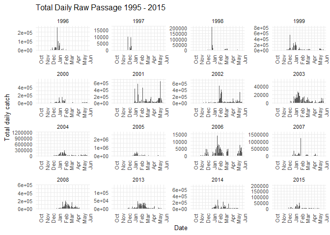
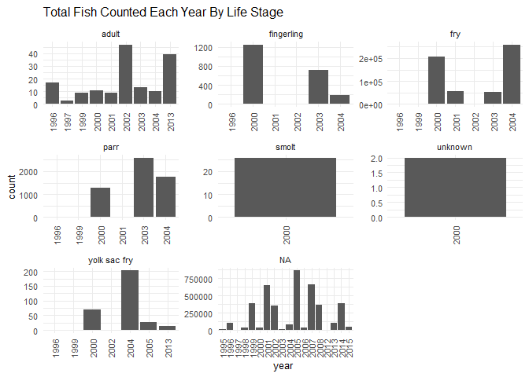
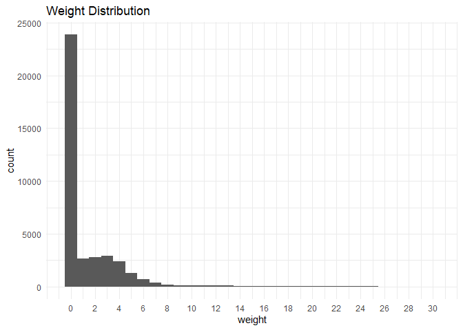
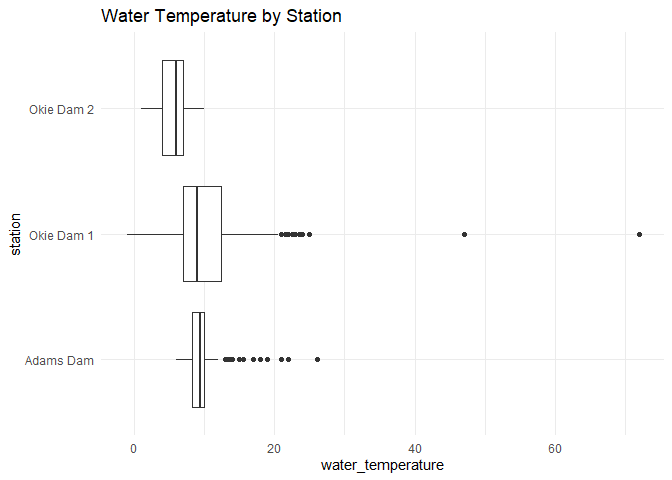
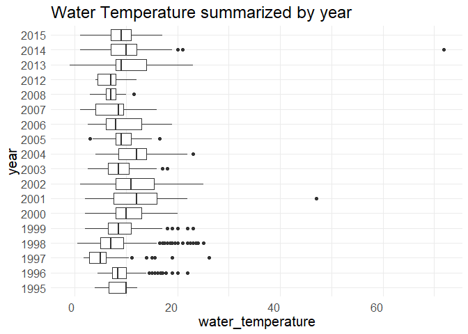
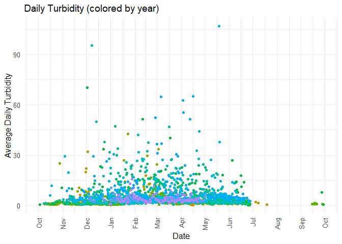
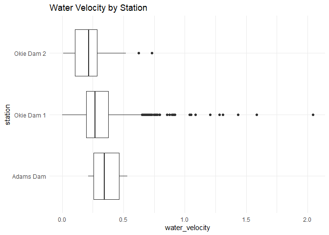
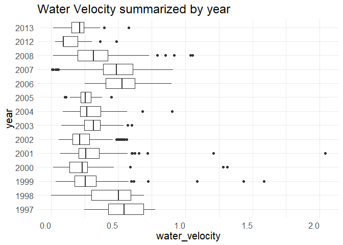

butte-creek-rst-qc-checklist
================
Inigo Peng
10/19/2021

``` r
knitr::opts_chunk$set(echo = TRUE, warning = FALSE)
library(tidyverse)
```

    ## -- Attaching packages --------------------------------------- tidyverse 1.3.1 --

    ## v ggplot2 3.3.5     v purrr   0.3.4
    ## v tibble  3.1.4     v dplyr   1.0.7
    ## v tidyr   1.1.3     v stringr 1.4.0
    ## v readr   2.0.1     v forcats 0.5.1

    ## -- Conflicts ------------------------------------------ tidyverse_conflicts() --
    ## x dplyr::filter() masks stats::filter()
    ## x dplyr::lag()    masks stats::lag()

``` r
library(lubridate)
```

    ## 
    ## Attaching package: 'lubridate'

    ## The following objects are masked from 'package:base':
    ## 
    ##     date, intersect, setdiff, union

``` r
library(googleCloudStorageR)
```

    ## v Setting scopes to https://www.googleapis.com/auth/devstorage.full_control and https://www.googleapis.com/auth/cloud-platform

    ## v Successfully auto-authenticated via ../../config.json

    ## v Set default bucket name to 'jpe-dev-bucket'

``` r
library(ggplot2)
library(scales)
```

    ## 
    ## Attaching package: 'scales'

    ## The following object is masked from 'package:purrr':
    ## 
    ##     discard

    ## The following object is masked from 'package:readr':
    ## 
    ##     col_factor

``` r
library (RColorBrewer)
```

# Butte Creek RST Data

## Description of Monitoring Data

This dataset contains data for all Chinook salmon that were captured in
the Butte Creek rotary screw trap (RSTR) or diversion fyke trap (DSTR)
between the 1995-96 and 2014-15 trapping seasons.

**Timeframe:**

1995 - 2015

**Completeness of Record throughout timeframe:**

-   Life stage information lacks after 2005
-   Inconsistent completeness of physical data after 2008

**Sampling Location:**

3 locations on Butte Creek

**Data Contact:** [Jessica
Nichols](mailto:Jessica.Nichols@Wildlife.ca.gov)

## Access Cloud Data

``` r
# Run Sys.setenv() to specify GCS_AUTH_FILE and GCS_DEFAULT_BUCKET before running
# Open object from google cloud storage
# Set your authentication using gcs_auth
gcs_auth(json_file = Sys.getenv("GCS_AUTH_FILE"))
# Set global bucket 
gcs_global_bucket(bucket = Sys.getenv("GCS_DEFAULT_BUCKET"))
gcs_list_objects()
# git data and save as xlsx
gcs_get_object(object_name = "rst/butte-creek/data-raw/CDFW_Butte_Creek_RST_Captures.xlsx",
               bucket = gcs_get_global_bucket(),
               saveToDisk = "butte_creek_rst_raw.xlsx",
               Overwrite = TRUE)
```

``` r
raw_data = readxl::read_excel('butte_creek_rst_raw.xlsx',
                              col_types = c("date","text","text","text","text","text","numeric","numeric","numeric","text",
                                            "text","date","text","text","numeric","numeric","numeric","numeric","text","text",
                                            "numeric","numeric","text","numeric","numeric","text"
                                            ))
glimpse(raw_data)
```

    ## Rows: 63,418
    ## Columns: 26
    ## $ SampleDate       <dttm> 1995-11-29, 1995-11-29, 1995-11-29, 1995-11-29, 1995~
    ## $ StationCode      <chr> "BCOKIE-1", "BCOKIE-1", "BCOKIE-1", "BCOKIE-1", "BCOK~
    ## $ MethodCode       <chr> "DSTR", "DSTR", "DSTR", "DSTR", "DSTR", "DSTR", "DSTR~
    ## $ TrapStatus       <chr> "Check", "Check", "Check", "Check", "Check", "Check",~
    ## $ OrganismCode     <chr> "CHN", "CHN", "CHN", "CHN", "CHN", "CHN", "CHN", "CHN~
    ## $ Dead             <chr> "No", "No", "No", "Yes", "Yes", "Yes", "Yes", "Yes", ~
    ## $ Count            <dbl> 1, 2, 1, 8, 1, 5, 4, 1, 1, 1, 3, 3, 5, 3, 4, 1, 2, 1,~
    ## $ ForkLength       <dbl> 38, 37, 39, 35, 33, 34, 36, 37, 36, 34, 33, 34, 35, 3~
    ## $ Weight           <dbl> 0.00, 0.00, 0.00, 0.00, 0.00, 0.00, 0.00, 0.00, 0.00,~
    ## $ MarkCode         <chr> "n/p", "n/p", "n/p", "n/p", "n/p", "n/p", "n/p", "n/p~
    ## $ StageCode        <chr> "n/p", "n/p", "n/p", "n/p", "n/p", "n/p", "n/p", "n/p~
    ## $ SampleTime       <dttm> 1899-12-31 09:30:00, 1899-12-31 09:30:00, 1899-12-31~
    ## $ GearID           <chr> "DSTR1", "DSTR1", "DSTR1", "DSTR1", "DSTR1", "DSTR1",~
    ## $ WeatherCode      <chr> NA, NA, NA, NA, NA, NA, NA, NA, NA, NA, "CLD", "CLD",~
    ## $ WaterTemperature <dbl> 8.333333, 8.333333, 8.333333, 8.333333, 8.333333, 8.3~
    ## $ Turbidity        <dbl> NA, NA, NA, NA, NA, NA, NA, NA, NA, NA, NA, NA, NA, N~
    ## $ Secchi           <dbl> NA, NA, NA, NA, NA, NA, NA, NA, NA, NA, NA, NA, NA, N~
    ## $ WaterVelocity    <dbl> NA, NA, NA, NA, NA, NA, NA, NA, NA, NA, NA, NA, NA, N~
    ## $ NorthBrush       <chr> "FALSE", "FALSE", "FALSE", "FALSE", "FALSE", "FALSE",~
    ## $ SouthBrush       <chr> "FALSE", "FALSE", "FALSE", "FALSE", "FALSE", "FALSE",~
    ## $ StaffGauge       <dbl> 80, 80, 80, 80, 80, 80, 80, 80, 80, 80, NA, NA, NA, N~
    ## $ TrapRevolutions  <dbl> NA, NA, NA, NA, NA, NA, NA, NA, NA, NA, NA, NA, NA, N~
    ## $ Debris           <chr> "Medium", "Medium", "Medium", "Medium", "Medium", "Me~
    ## $ RPMsStart        <dbl> NA, NA, NA, NA, NA, NA, NA, NA, NA, NA, NA, NA, NA, N~
    ## $ RPMsEnd          <dbl> NA, NA, NA, NA, NA, NA, NA, NA, NA, NA, NA, NA, NA, N~
    ## $ Comments         <chr> NA, NA, NA, NA, NA, NA, NA, NA, NA, NA, NA, NA, NA, N~

## Data Transformations

``` r
cleaner_data <- raw_data %>% 
  set_names(tolower(colnames(raw_data))) %>%
  select(-c('dead','weathercode','markcode', 'southbrush', 'northbrush', 'secchi','comments')) %>% 
  rename('date'= sampledate,
         'station' = stationcode,
         'method'= methodcode,
         'trap_status' = trapstatus,
         'organism_code'= organismcode,
         'fork_length' = forklength,
         'stage_code' = stagecode,
         'time' = sampletime,
         'gear_id' = gearid,
         'water_temperature' = watertemperature,
         'water_velocity' = watervelocity,
         'staff_gauge' = staffgauge,
         'trap_revolutions' = traprevolutions,
         'rpms_start' = rpmsstart,
         'rpms_end'= rpmsend) %>% 
  mutate(time = hms::as_hms(time)) %>%
  filter(organism_code =='CHN', rm.na = TRUE) %>%
  glimpse()
```

    ## Rows: 63,418
    ## Columns: 19
    ## $ date              <dttm> 1995-11-29, 1995-11-29, 1995-11-29, 1995-11-29, 199~
    ## $ station           <chr> "BCOKIE-1", "BCOKIE-1", "BCOKIE-1", "BCOKIE-1", "BCO~
    ## $ method            <chr> "DSTR", "DSTR", "DSTR", "DSTR", "DSTR", "DSTR", "DST~
    ## $ trap_status       <chr> "Check", "Check", "Check", "Check", "Check", "Check"~
    ## $ organism_code     <chr> "CHN", "CHN", "CHN", "CHN", "CHN", "CHN", "CHN", "CH~
    ## $ count             <dbl> 1, 2, 1, 8, 1, 5, 4, 1, 1, 1, 3, 3, 5, 3, 4, 1, 2, 1~
    ## $ fork_length       <dbl> 38, 37, 39, 35, 33, 34, 36, 37, 36, 34, 33, 34, 35, ~
    ## $ weight            <dbl> 0.00, 0.00, 0.00, 0.00, 0.00, 0.00, 0.00, 0.00, 0.00~
    ## $ stage_code        <chr> "n/p", "n/p", "n/p", "n/p", "n/p", "n/p", "n/p", "n/~
    ## $ time              <time> 09:30:00, 09:30:00, 09:30:00, 09:30:00, 09:30:00, 0~
    ## $ gear_id           <chr> "DSTR1", "DSTR1", "DSTR1", "DSTR1", "DSTR1", "DSTR1"~
    ## $ water_temperature <dbl> 8.333333, 8.333333, 8.333333, 8.333333, 8.333333, 8.~
    ## $ turbidity         <dbl> NA, NA, NA, NA, NA, NA, NA, NA, NA, NA, NA, NA, NA, ~
    ## $ water_velocity    <dbl> NA, NA, NA, NA, NA, NA, NA, NA, NA, NA, NA, NA, NA, ~
    ## $ staff_gauge       <dbl> 80, 80, 80, 80, 80, 80, 80, 80, 80, 80, NA, NA, NA, ~
    ## $ trap_revolutions  <dbl> NA, NA, NA, NA, NA, NA, NA, NA, NA, NA, NA, NA, NA, ~
    ## $ debris            <chr> "Medium", "Medium", "Medium", "Medium", "Medium", "M~
    ## $ rpms_start        <dbl> NA, NA, NA, NA, NA, NA, NA, NA, NA, NA, NA, NA, NA, ~
    ## $ rpms_end          <dbl> NA, NA, NA, NA, NA, NA, NA, NA, NA, NA, NA, NA, NA, ~

## Explore `date`

``` r
cleaner_data %>%
  ggplot(aes(x = date)) +
  geom_histogram(position = 'stack', color = "black") +
  labs(title = "Value Counts For Survey Season Dates")+
  theme(legend.text = element_text(size = 8))
```

    ## `stat_bin()` using `bins = 30`. Pick better value with `binwidth`.

<!-- -->

``` r
summary(cleaner_data$date)
```

    ##                  Min.               1st Qu.                Median 
    ## "1995-11-29 00:00:00" "2000-05-11 00:00:00" "2003-05-08 00:00:00" 
    ##                  Mean               3rd Qu.                  Max. 
    ## "2004-06-15 02:18:49" "2007-02-05 00:00:00" "2015-06-03 00:00:00"

**NA and Unknown Values**

-   0 % of values in the `date` column are NA.

## Explore Categorical Variables

``` r
cleaner_data %>% select_if(is.character) %>% colnames()
```

    ## [1] "station"       "method"        "trap_status"   "organism_code"
    ## [5] "stage_code"    "gear_id"       "debris"

### Variable `station`

# Description: trap location

-   BCADAMS - Adams Dam

-   BCOKIE-1 - Okie Dam 1

-   BCOKIE-2 - Okie Dam 2

``` r
table(cleaner_data$station)
```

    ## 
    ##  BCADAMS BCOKIE-1 BCOKIE-2 
    ##      701    61991      726

``` r
cleaner_data <- cleaner_data %>% 
  mutate(station = if_else(station == 'BCADAMS', 'Adams Dam', station),
         station = if_else(station == 'BCOKIE-1', 'Okie Dam 1', station),
         station = if_else(station == 'BCOKIE-2', 'Okie Dam 2', station))
table(cleaner_data$station)
```

    ## 
    ##  Adams Dam Okie Dam 1 Okie Dam 2 
    ##        701      61991        726

**NA and Unknown Values**

-   0 % of values in the `station` column are NA.

### Variable `method`

# Description: method of capture

-   DSTR - Diversion fyke trap

-   RSTR - Rotary screw trap

``` r
table(cleaner_data$method)
```

    ## 
    ##  DSTR  RSTR 
    ## 32066 31352

``` r
cleaner_data <- cleaner_data %>% 
  mutate(method = if_else(method == 'DSTR', 'Diversion Fyke Trap', method),
         method = if_else(method == 'RSTR', 'Rotary Screw Trap', method))
table(cleaner_data$method)
```

    ## 
    ## Diversion Fyke Trap   Rotary Screw Trap 
    ##               32066               31352

**NA and Unknown Values**

-   0 % of values in the `method` column are NA.

### Variable `trap_status`

# Description:

-   Check - trap was checked normally , continued fishing

-   Pull - trap was pulled after trap check

-   Set - trap was set upon arrival

``` r
table(cleaner_data$trap_status)
```

    ## 
    ## Check  Pull   Set 
    ## 63130   130    15

**NA and Unknown Values**

-   0.2 % of values in the `trap_status` column are NA.

### Variable `organism_code`

# Description: we are interested in Chinooks only

``` r
table(cleaner_data$organism_code)
```

    ## 
    ##   CHN 
    ## 63418

``` r
cleaner_data <- cleaner_data %>% 
  mutate(organism_code = if_else(organism_code == 'CHN', 'Chinook Salmon', organism_code))
table(cleaner_data$organism_code)
```

    ## 
    ## Chinook Salmon 
    ##          63418

**NA and Unknown Values**

-   0 % of values in the `organism_code` column are NA.

### Variable `stage_code`

# Description: Renaming to `lifestage`

-   1 - Fry with visible yolk sac
-   2 - Fry with no visible yolk sac
-   3 - Parr
-   4 - Fingerling
-   5 - Smolt
-   AD - Adult
-   n/p - not provided
-   UNK - unknown

``` r
table(cleaner_data$stage_code)
```

    ## 
    ##     1     2     3     4     5    AD   n/p   UNK 
    ##    51  5364  3558  1067    26    96 53255     1

``` r
cleaner_data$stage_code <- ifelse(cleaner_data$stage_code == 'n/p', NA, cleaner_data$stage_code)
cleaner_data <- cleaner_data %>% 
  mutate(stage_code = if_else(stage_code == 1, 'yolk sac fry', stage_code),
         stage_code = if_else(stage_code == 2, 'fry', stage_code),
         stage_code = if_else(stage_code == 3, 'parr', stage_code),
         stage_code = if_else(stage_code == 4, 'fingerling', stage_code),
         stage_code = if_else(stage_code == 5, 'smolt', stage_code),
         stage_code = if_else(stage_code == 'AD', 'adult', stage_code),
         stage_code = if_else(stage_code == 'UNK', 'unknown', stage_code)) %>% 
  rename('lifestage' = stage_code)
table(cleaner_data$lifestage)
```

    ## 
    ##        adult   fingerling          fry         parr        smolt      unknown 
    ##           96         1067         5364         3558           26            1 
    ## yolk sac fry 
    ##           51

**NA and Unknown Values**

-   84 % of values in the `lifestage` column are NA.

### Variable `gear_id`

# Description:

-   DSTR1 - Diversion Fyke Trap 1

-   RSTR1 - Rotary Screw Trap 1

-   RSTR2 - Rotary Screw Trap 2

``` r
table(cleaner_data$gear_id)
```

    ## 
    ## DSTR1 RSTR1 RSTR2 
    ## 28882    35 29270

``` r
cleaner_data <- cleaner_data %>% 
  mutate(gear_id = if_else(gear_id == 'DSTR1', 'Diversion Fyke Trap 1', gear_id),
         gear_id = if_else(gear_id == 'RSTR1', 'Rotary Screw Trap 1', gear_id),
         gear_id = if_else(gear_id == 'RSTR2', 'ROtary Screw Trap 2', gear_id))
table(cleaner_data$gear_id)
```

    ## 
    ## Diversion Fyke Trap 1   Rotary Screw Trap 1   ROtary Screw Trap 2 
    ##                 28882                    35                 29270

**NA and Unknown Values**

-   8.2 % of values in the `gear_id` column are NA.

### Variable `debris`

# Description: visual assessment of debris in trap

``` r
table(cleaner_data$debris)
```

    ## 
    ##      Heavy      Light     Medium       None Very Heavy 
    ##       7321      38342      16532         31        341

**NA and Unknown Values**

-   1.3 % of values in the `debris` column are NA.

## Explore Numerical Variables

``` r
cleaner_data %>% select_if(is.numeric) %>% colnames()
```

    ##  [1] "count"             "fork_length"       "weight"           
    ##  [4] "water_temperature" "turbidity"         "water_velocity"   
    ##  [7] "staff_gauge"       "trap_revolutions"  "rpms_start"       
    ## [10] "rpms_end"

### Variable `count`

# Description: fish count

``` r
cleaner_data %>% 
  mutate(water_year = ifelse(month(date) %in% 10:12, year(date) + 1, year(date))) %>% 
  mutate(year = as.factor(year(date)),
         fake_year = if_else(month(date) %in% 10:12, 1900, 1901),
         fake_date = as.Date(paste0(fake_year,"-", month(date), "-", day(date)))) %>%
  group_by(date) %>% 
  mutate(total_daily_catch = sum(count)) %>% 
  ungroup() %>% 
  ggplot(aes(x = fake_date, y = total_daily_catch)) +
  geom_col()+
  # scale_x_date(labels = date_format("%b"), limits = c(as.Date("1995-10-01"), as.Date("2016-06-01")), date_breaks = "1 month")+
  scale_x_date(labels = date_format("%b"), limits = c(as.Date("1900-10-01"), as.Date("1901-06-01")), date_breaks = "1 month") + 
  theme_minimal()+
  theme(text = element_text(size = 10),
        axis.text.x = element_text(angle = 90))+
  labs(title = "Total Daily Raw Passage 1995 - 2015",
       y = "Total daily catch",
       x = "Date")+ 
  facet_wrap(~water_year, scales = "free")
```

<!-- -->

``` r
cleaner_data %>% 
  mutate(year = as.factor(year(date))) %>% 
  ggplot(aes(x = year, y = count))+
  geom_col()+
  theme_minimal()+
  labs(title = "Total Fish Counted Each Year By Life Stage")+
  theme(text = element_text(size = 10),
        axis.text.x = element_text(angle = 90,  vjust = 0.5, hjust=1))+
  facet_wrap(~lifestage, scales = 'free')
```

<!-- -->

``` r
summary(cleaner_data$count)
```

    ##      Min.   1st Qu.    Median      Mean   3rd Qu.      Max. 
    ##      0.00      1.00      1.00     75.02      4.00 220000.00

**NA and Unknown Values**

-   0 % of values in the `count` column are NA.

### Variable `fork_length`

# Description: fork length in millimeters (mm)

``` r
cleaner_data %>% 
  filter(fork_length < 250) %>% #filtered out 52 points to see more clear distribution
  ggplot(aes(x = fork_length))+
  geom_histogram(binwidth = 2)+
  theme_minimal()+
  scale_x_continuous(breaks = seq(0, 250, by=25))+
  labs(title = "Fork Length Distribution")+
  theme(text = element_text(size=15),
        axis.text.x = element_text(vjust =0.5, hjust = 1))
```

<!-- -->

``` r
cleaner_data %>% 
  ggplot(aes(x = fork_length, y = lifestage))+
  geom_boxplot()+
  theme_minimal()+
  labs(title = 'Fork length summarized by life stage')+
  theme(text = element_text(size = 12))
```

<!-- -->

``` r
summary(cleaner_data$fork_length)
```

    ##    Min. 1st Qu.  Median    Mean 3rd Qu.    Max.    NA's 
    ##    0.00   35.00   44.00   50.75   65.00 1035.00    3272

**NA and Unknown Values**

-   5.2 % of values in the `fork_length` column are NA.

### Variable `weight`

# Description: wet weight in grams(g)

``` r
cleaner_data %>% 
  filter(weight< 30) %>%  #filtered out 26 data points to see more clear distribution
  ggplot(aes(x = weight))+
  geom_histogram(binwidth = 1)+
  scale_x_continuous(breaks = seq(0, 30, by=2))+
  theme_minimal()+
  labs(title = "Weight Distribution")
```

<!-- -->

``` r
cleaner_data %>% 
  filter(weight < 50) %>% 
  ggplot(aes(x = weight, y= lifestage))+
  geom_boxplot()+
  labs(title = 'Weight summarized by life stage')+
  theme(text = element_text(size = 12))+
  theme_minimal()
```

<!-- -->

``` r
summary(cleaner_data$weight)
```

    ##     Min.  1st Qu.   Median     Mean  3rd Qu.     Max.     NA's 
    ##    0.000    0.000    0.290    1.617    2.275 3046.000    25299

**NA and Unknown Values**

-   39.9 % of values in the `weight` column are NA.

### Variable `water_temperature`

# Description: temperature of water in degrees Celsius

``` r
cleaner_data %>%
  filter(water_temperature < 100) %>% #filter out 36 points with water temperature > 100 degrees
  ggplot(aes(x= water_temperature, y = station))+
  geom_boxplot()+
  theme_minimal()+
  labs(title = "Water Temperature by Station")
```

<!-- -->

``` r
cleaner_data %>% 
  filter(water_temperature < 100) %>%  #filter out 36 points with water temperature > 100 degrees (entry error?)
  group_by(date) %>% 
  mutate(daily_avg_temp = mean(water_temperature)) %>% 
  ungroup() %>% 
  mutate(year = as.factor(year(date)),
         fake_year = if_else(month(date) %in% 10:12, 1900,1901),
         fake_date = as.Date(paste0(fake_year, "-", month(date), "-", day(date)))) %>% 
  ggplot(aes(x = fake_date, y = daily_avg_temp, color = year))+
  geom_point()+
  scale_x_date(labels = date_format("%b"), date_breaks = "1 month")+
  theme_minimal()+
  theme(text = element_text(size = 12),
        axis.text.x = element_text(angle = 90, vjust = 0.5, hjust = 1),
        legend.position = "none")+
  labs(title = "Daily Water Temperature (colored by year)",
       x = 'Date',
       y = 'Average Daily Temp')
```

<!-- -->

``` r
cleaner_data %>% 
  filter(water_temperature < 100) %>% 
  mutate(year = as.factor(year(date))) %>% 
  ggplot(aes(x = water_temperature, y = year))+
  geom_boxplot()+
  theme_minimal()+
  labs(title = "Water Temperature summarized by year")+
  theme(text = element_text(size = 15),
        axis.text.x = element_text(vjust =0.5, hjust = 1))
```

<!-- -->

``` r
summary(cleaner_data$water_temperature)
```

    ##    Min. 1st Qu.  Median    Mean 3rd Qu.    Max.    NA's 
    ##   -1.00    7.00    9.00    9.96   12.00  805.00    3917

**NA and Unknown Values**

-   6.2 % of values in the `water_temperature` column are NA.

### Variable `turbidity`

# Description: Turbidity of water in NTU

``` r
cleaner_data %>% 
  group_by(date) %>% 
  mutate(daily_avg_turb = mean(turbidity)) %>% 
  ungroup() %>% 
  mutate(year = as.factor(year(date)),
         fake_year = if_else(month(date) %in% 10:12, 1900,1901),
         fake_date = as.Date(paste0(fake_year, "-", month(date), "-", day(date)))) %>% 
  ggplot(aes(x = fake_date, y = daily_avg_turb, color = year))+
  geom_point()+
  scale_x_date(labels = date_format("%b"), date_breaks = "1 month")+
  theme_minimal()+
  theme(text = element_text(size = 12),
        axis.text.x = element_text(angle = 90, vjust = 0.5, hjust = 1),
        legend.position = "none")+
  labs(title = "Daily Turbidity (colored by year)",
       x = 'Date',
       y = 'Average Daily Turbidity')
```

<!-- -->

``` r
cleaner_data %>% 
  mutate(year = as.factor(year(date))) %>% 
  ggplot(aes(x = turbidity, y = year))+
  geom_boxplot()+
  theme_minimal()+
  labs(title = "Turbidity summarized by year")+
  theme(text = element_text(size = 15),
        axis.text.x = element_text(vjust =0.5, hjust = 1))
```

<!-- -->

``` r
summary(cleaner_data$turbidity)
```

    ##    Min. 1st Qu.  Median    Mean 3rd Qu.    Max.    NA's 
    ##   0.200   1.870   2.770   5.359   4.700 189.000   21066

**NA and Unknown Values**

-   33.2 % of values in the `turbidity` column are NA.

### Variable `water_velocity`

# Description: water velocity measured in ft/s

# Data transformation

``` r
#Convert water velocity from ft/s to m/s
cleaner_data <- cleaner_data %>% 
  mutate(water_velocity = water_velocity/3.281)
```

``` r
cleaner_data %>%
  filter(water_velocity < 8) %>% #filtered out 8 data points to show a more clear graph
  ggplot(aes(x= water_velocity, y = station))+
  geom_boxplot()+
  theme_minimal()+
  labs(title = "Water Velocity by Station")
```

<!-- -->

``` r
cleaner_data %>% 
  filter(water_velocity < 5) %>% #filtered out one point to show a more clear graph
  group_by(date) %>% 
  mutate(daily_avg_velocity = mean(water_velocity)) %>% 
  ungroup() %>% 
  mutate(year = as.factor(year(date)),
         fake_year = if_else(month(date) %in% 10:12, 1900,1901),
         fake_date = as.Date(paste0(fake_year, "-", month(date), "-", day(date)))) %>% 
  ggplot(aes(x = fake_date, y = daily_avg_velocity, color = year))+
  geom_point()+
  scale_x_date(labels = date_format("%b"), date_breaks = "1 month")+
  theme_minimal()+
  theme(text = element_text(size = 12),
        axis.text.x = element_text(angle = 90, vjust = 0.5, hjust = 1),
        legend.position = "none")+
  labs(title = "Daily Water Velocity (colored by year)",
       x = 'Date',
       y = 'Average Daily Velocity')
```

<!-- -->

``` r
cleaner_data %>% 
  filter(water_velocity<6) %>% 
  mutate(year = as.factor(year(date))) %>% 
  ggplot(aes(x = water_velocity, y = year))+
  geom_boxplot()+
  theme_minimal()+
  labs(title = "Water Velocity summarized by year")+
  theme(text = element_text(size = 15),
        axis.text.x = element_text(vjust =0.5, hjust = 1))
```

<!-- -->

# Numeric summary of `water_velocity` from 1995-2015

``` r
summary(cleaner_data$water_velocity)
```

    ##    Min. 1st Qu.  Median    Mean 3rd Qu.    Max.    NA's 
    ##    0.00    0.20    0.27    0.34    0.37  104.24   38937

**NA and Unknown Values**

-   61.4 % of values in the `water_velocity` column are NA.

### Variable `trap_revolutions`

# Description: Number of revolutions the RST cone had made since last being checked

``` r
cleaner_data %>% 
  ggplot(aes(x = trap_revolutions))+
  geom_histogram(binwidth = 500)+
  labs(title = "Distribution of Trap Revolutions")+
  theme_minimal()+
  theme(text = element_text(size = 12))
```

<!-- -->

``` r
cleaner_data %>% 
  filter(station != "Adams Dam") %>% 
  ggplot(aes(y= station, x = trap_revolutions))+
  geom_boxplot()+
  labs(title = "Trap Revolutions Summarized by Location")+
  theme_minimal()+
  theme(text = element_text(size = 12))
```

<!-- -->

# Numeric summary of `trap_revolutions` from 1995-2015

``` r
summary(cleaner_data$trap_revolutions)
```

    ##    Min. 1st Qu.  Median    Mean 3rd Qu.    Max.    NA's 
    ##       0    2741    4000    4118    5439   11795   41363

**NA and Unknown Values**

-   65.2 % of values in the `trap_revolutions` column are NA.

### Variable \`rpms\_start\`\`

# Description: rotations per minute of RST cone at start of trapping window

``` r
cleaner_data %>% 
  filter(rpms_start < 10) %>% #filtered out 28 data points to show more clear distribution
  ggplot(aes(x = rpms_start))+
  geom_histogram(binwidth = 1)+
  labs(title = "Distribution of RPMs Start")+
  theme_minimal()+
  theme(text = element_text(size = 12))
```

<!-- -->

``` r
cleaner_data %>% 
  filter(rpms_start < 10) %>% 
  ggplot(aes(y= station, x = rpms_start))+
  geom_boxplot()+
  labs(title = "RPMs Start Summarized by Location")+
  theme_minimal()+
  theme(text = element_text(size = 12))
```

<!-- -->

# Numeric summary of \`rpms\_start\`\` from 1995-2015

``` r
summary(cleaner_data$rpms_start)
```

    ##    Min. 1st Qu.  Median    Mean 3rd Qu.    Max.    NA's 
    ##    0.00    2.10    3.00    4.92    4.00 3698.00   34932

**NA and Unknown Values**

-   55.1 % of values in the \`rpms\_start\`\` column are NA.

### Variable `rpms_end`

# Description: rotations per minute of RST cone at end of trapping window

``` r
cleaner_data %>% 
  filter(rpms_end < 10) %>% #filtered out 28 data points to show more clear distribution
  ggplot(aes(x = rpms_end))+
  geom_histogram(binwidth = 1)+
  labs(title = "Distribution of RPMs End")+
  theme_minimal()+
  theme(text = element_text(size = 12))
```

<!-- -->

``` r
cleaner_data %>% 
  filter(rpms_end < 10) %>% 
  ggplot(aes(y= station, x = rpms_end))+
  geom_boxplot()+
  labs(title = "RPMs End Summarized by Location")+
  theme_minimal()+
  theme(text = element_text(size = 12))
```

<!-- -->

**NA and Unknown Values**

-   58.9 % of values in the `rpms_end` column are NA.

### Issues Identified

-   50 points in water temperature reaches over 50 degrees celsius

-   Turbidity data lacks in some years

### Add cleaned data back into google cloud

``` r
butte_creek_rst <- cleaner_data %>% glimpse()
```

    ## Rows: 63,418
    ## Columns: 19
    ## $ date              <dttm> 1995-11-29, 1995-11-29, 1995-11-29, 1995-11-29, 199~
    ## $ station           <chr> "Okie Dam 1", "Okie Dam 1", "Okie Dam 1", "Okie Dam ~
    ## $ method            <chr> "Diversion Fyke Trap", "Diversion Fyke Trap", "Diver~
    ## $ trap_status       <chr> "Check", "Check", "Check", "Check", "Check", "Check"~
    ## $ organism_code     <chr> "Chinook Salmon", "Chinook Salmon", "Chinook Salmon"~
    ## $ count             <dbl> 1, 2, 1, 8, 1, 5, 4, 1, 1, 1, 3, 3, 5, 3, 4, 1, 2, 1~
    ## $ fork_length       <dbl> 38, 37, 39, 35, 33, 34, 36, 37, 36, 34, 33, 34, 35, ~
    ## $ weight            <dbl> 0.00, 0.00, 0.00, 0.00, 0.00, 0.00, 0.00, 0.00, 0.00~
    ## $ lifestage         <chr> NA, NA, NA, NA, NA, NA, NA, NA, NA, NA, NA, NA, NA, ~
    ## $ time              <time> 09:30:00, 09:30:00, 09:30:00, 09:30:00, 09:30:00, 0~
    ## $ gear_id           <chr> "Diversion Fyke Trap 1", "Diversion Fyke Trap 1", "D~
    ## $ water_temperature <dbl> 8.333333, 8.333333, 8.333333, 8.333333, 8.333333, 8.~
    ## $ turbidity         <dbl> NA, NA, NA, NA, NA, NA, NA, NA, NA, NA, NA, NA, NA, ~
    ## $ water_velocity    <dbl> NA, NA, NA, NA, NA, NA, NA, NA, NA, NA, NA, NA, NA, ~
    ## $ staff_gauge       <dbl> 80, 80, 80, 80, 80, 80, 80, 80, 80, 80, NA, NA, NA, ~
    ## $ trap_revolutions  <dbl> NA, NA, NA, NA, NA, NA, NA, NA, NA, NA, NA, NA, NA, ~
    ## $ debris            <chr> "Medium", "Medium", "Medium", "Medium", "Medium", "M~
    ## $ rpms_start        <dbl> NA, NA, NA, NA, NA, NA, NA, NA, NA, NA, NA, NA, NA, ~
    ## $ rpms_end          <dbl> NA, NA, NA, NA, NA, NA, NA, NA, NA, NA, NA, NA, NA, ~

``` r
write_csv(butte_creek_rst, "butte_rst.csv")
```

``` r
f <- function(input, output) write_csv(input, file = output)

gcs_upload(butte_creek_rst,
           object_function = f,
           type = "csv",
           name = "rst/butte-creek/data/butte-creek-rst.csv")
```
