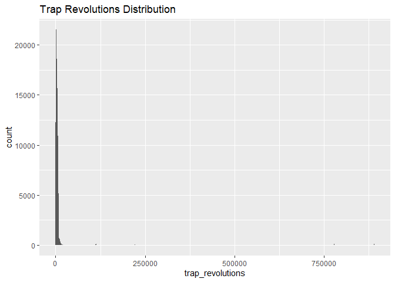
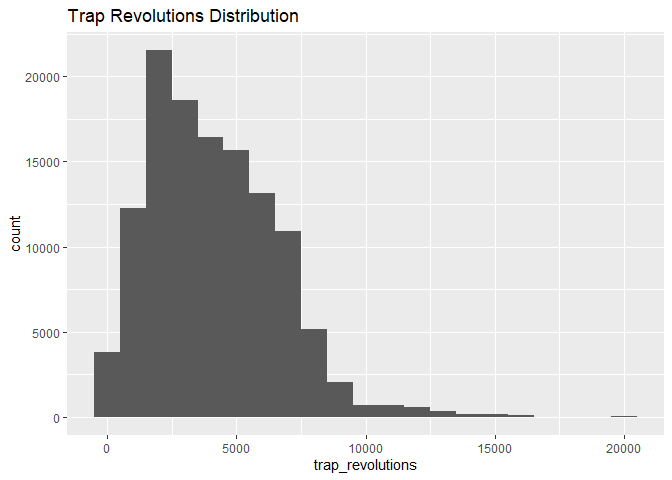
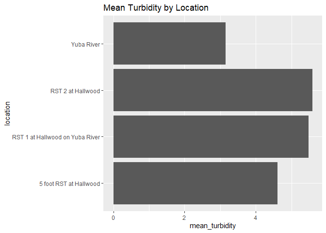
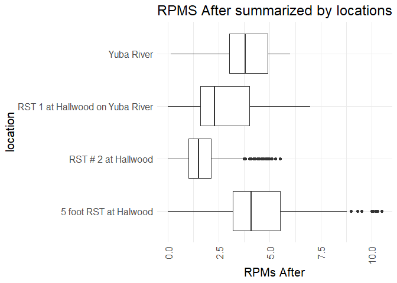
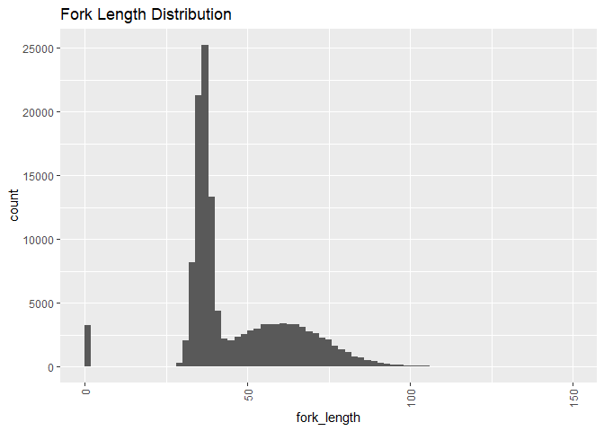
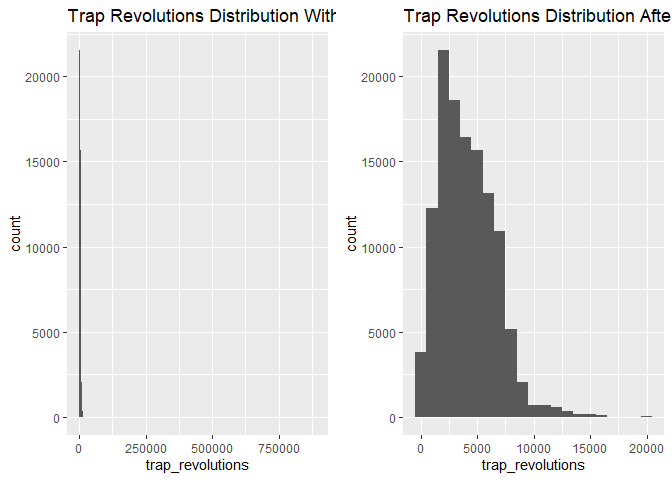
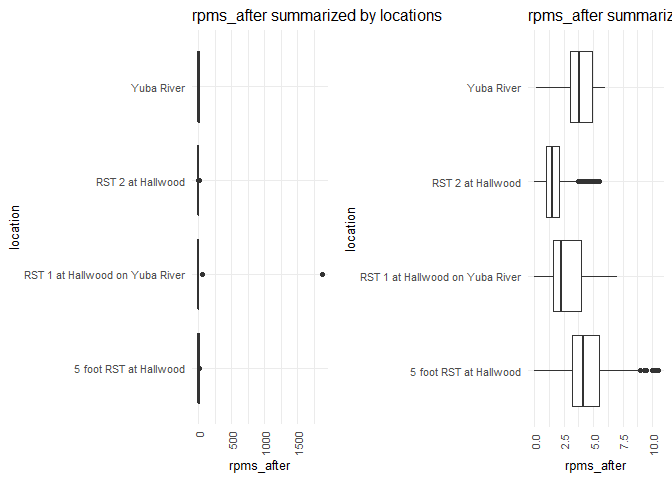
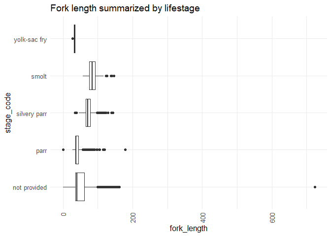
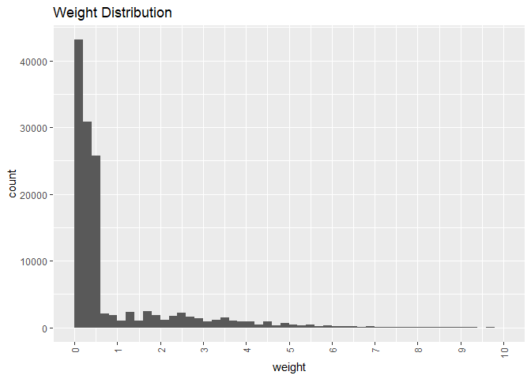
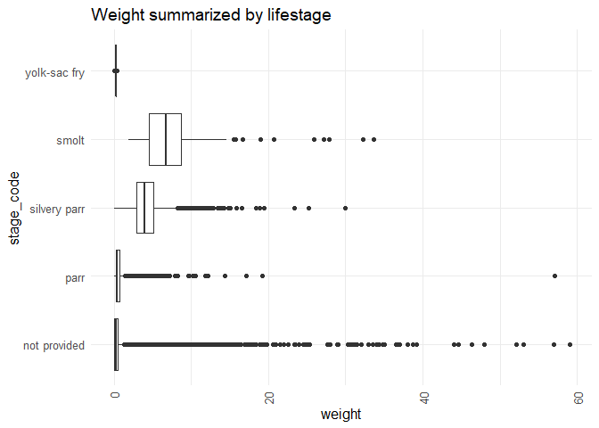

yuba-river-rst-qc-checklist
================
Inigo Peng
10/11/2021

# Yuba River RST Data

## Description of Monitoring Data

**Timeframe:** 2000-2008

**Completeness of Record throughout timeframe: **  

TODO

**Sampling Location:** Yuba River

**Data Contact:** [Robyn Bilski](Robyn.Bilski@Wildlife.ca.gov)

## Access Cloud Data

``` r
# Run Sys.setenv() to specify GCS_AUTH_FILE and GCS_DEFAULT_BUCKET before running
# Open object from google cloud storage
# Set your authentication using gcs_auth
gcs_auth(json_file = Sys.getenv("GCS_AUTH_FILE"))
# Set global bucket 
gcs_global_bucket(bucket = Sys.getenv("GCS_DEFAULT_BUCKET"))
gcs_list_objects()
# git data and save as xlsx
gcs_get_object(object_name = "rst/yuba-river/data-raw/yuba-river-rst-data.xlsx",
               bucket = gcs_get_global_bucket(),
               saveToDisk = "yuba-rst.xlsx",
               overwrite = TRUE)
```

Read in data from google cloud, glimpse raw data:

``` r
raw_data = readxl::read_excel('yuba-rst.xlsx', col_types = c("text",
                                                             "date",
                                                             "date",
                                                             "text",
                                                             "numeric",
                                                             "numeric",
                                                             "numeric",
                                                             "text",
                                                             "numeric",
                                                             "numeric",
                                                             "text",
                                                             "numeric",
                                                             "numeric",
                                                             "text",
                                                             "text",
                                                             "text",
                                                             "text",
                                                             "numeric",
                                                             "numeric",
                                                             "text",
                                                             "numeric",
                                                             'text',
                                                             'numeric',
                                                             'numeric'))
glimpse(raw_data)
```

    ## Rows: 168,869
    ## Columns: 24
    ## $ Sample_Entry_SampleRowID <chr> "{29A956AB-0CE1-4B87-90B5-7FB70785A215}", "{2~
    ## $ SampleDate               <dttm> 2000-05-07, 2000-05-07, 2000-05-07, 2000-05-~
    ## $ SampleTime               <dttm> 1899-12-31 10:00:00, 1899-12-31 10:00:00, 18~
    ## $ MethodCode               <chr> "FSR", "FSR", "FSR", "FSR", "FSR", "FSR", "FS~
    ## $ WaterTemperature         <dbl> 11.5, 11.5, 11.5, 11.5, 11.5, 11.5, 11.5, 11.~
    ## $ Turbidity                <dbl> NA, NA, NA, NA, NA, NA, NA, NA, NA, NA, NA, N~
    ## $ WaterVelocity            <dbl> NA, NA, NA, NA, NA, NA, NA, NA, NA, NA, NA, N~
    ## $ TrapStatus               <chr> "Check", "Check", "Check", "Check", "Check", ~
    ## $ TrapRevolutions          <dbl> NA, NA, NA, NA, NA, NA, NA, NA, NA, NA, NA, N~
    ## $ TrapRevolutions2         <dbl> NA, NA, NA, NA, NA, NA, NA, NA, NA, NA, NA, N~
    ## $ Debris                   <chr> NA, NA, NA, NA, NA, NA, NA, NA, NA, NA, NA, N~
    ## $ RPMsBefore               <dbl> NA, NA, NA, NA, NA, NA, NA, NA, NA, NA, NA, N~
    ## $ RPMsAfter                <dbl> NA, NA, NA, NA, NA, NA, NA, NA, NA, NA, NA, N~
    ## $ Comments                 <chr> NA, NA, NA, NA, NA, NA, NA, NA, NA, NA, NA, N~
    ## $ Catch_Entry_SampleRowID  <chr> "{29A956AB-0CE1-4B87-90B5-7FB70785A215}", "{2~
    ## $ CatchRowID               <chr> "{6571EC2C-9845-4959-AB9C-F8F602237451}", "{6~
    ## $ OrganismCode             <chr> "CHN", "CHN", "CHN", "CHN", "CHN", "CHN", "CH~
    ## $ ForkLength               <dbl> 79, 80, 73, 70, 56, 92, 53, 74, 56, 69, 77, 7~
    ## $ Weight                   <dbl> 5.29, 5.14, 4.14, 0.00, 0.00, 0.00, 0.00, 4.8~
    ## $ StageCode                <chr> "n/p", "n/p", "n/p", "n/p", "n/p", "n/p", "n/~
    ## $ Count                    <dbl> 1, 1, 1, 3, 2, 2, 2, 1, 1, 2, 2, 1, 1, 1, 1, ~
    ## $ Location                 <chr> "RST 1 at Hallwood on Yuba River", "RST 1 at ~
    ## $ Northing                 <dbl> NA, NA, NA, NA, NA, NA, NA, NA, NA, NA, NA, N~
    ## $ Easting                  <dbl> NA, NA, NA, NA, NA, NA, NA, NA, NA, NA, NA, N~

## Data Transformation

``` r
cleaner_data <- raw_data %>% 
  select(-c('Catch_Entry_SampleRowID', 'CatchRowID', 'Comments')) %>% 
  rename('id' = Sample_Entry_SampleRowID,
         'date'= SampleDate,
         'time' = SampleTime,
         'method' = MethodCode,
         'water_temp' = WaterTemperature,
         'turbidity' = Turbidity,
         'water_velocity' = WaterVelocity,
         'trap_status' = TrapStatus,
         'trap_revolutions' = TrapRevolutions,
         'trap_revolutions2' = TrapRevolutions2,
         'rpms_before' = RPMsBefore,
         'rpms_after' = RPMsAfter,
         'organism_code' = OrganismCode,
         'fork_length' = ForkLength,
         'stage_code' = StageCode,
         'latitude' = Northing,
         'longitude' = Easting
         ) %>%
  mutate(time = hms::as_hms(time)) %>%
  filter(organism_code == 'CHN', rm.na = TRUE) %>%
  glimpse()
```

    ## Rows: 133,217
    ## Columns: 21
    ## $ id                <chr> "{29A956AB-0CE1-4B87-90B5-7FB70785A215}", "{29A956AB~
    ## $ date              <dttm> 2000-05-07, 2000-05-07, 2000-05-07, 2000-05-07, 200~
    ## $ time              <time> 10:00:00, 10:00:00, 10:00:00, 10:00:00, 10:00:00, 1~
    ## $ method            <chr> "FSR", "FSR", "FSR", "FSR", "FSR", "FSR", "FSR", "FS~
    ## $ water_temp        <dbl> 11.5, 11.5, 11.5, 11.5, 11.5, 11.5, 11.5, 11.5, 11.5~
    ## $ turbidity         <dbl> NA, NA, NA, NA, NA, NA, NA, NA, NA, NA, NA, NA, NA, ~
    ## $ water_velocity    <dbl> NA, NA, NA, NA, NA, NA, NA, NA, NA, NA, NA, NA, NA, ~
    ## $ trap_status       <chr> "Check", "Check", "Check", "Check", "Check", "Check"~
    ## $ trap_revolutions  <dbl> NA, NA, NA, NA, NA, NA, NA, NA, NA, NA, NA, NA, NA, ~
    ## $ trap_revolutions2 <dbl> NA, NA, NA, NA, NA, NA, NA, NA, NA, NA, NA, NA, NA, ~
    ## $ Debris            <chr> NA, NA, NA, NA, NA, NA, NA, NA, NA, NA, NA, NA, NA, ~
    ## $ rpms_before       <dbl> NA, NA, NA, NA, NA, NA, NA, NA, NA, NA, NA, NA, NA, ~
    ## $ rpms_after        <dbl> NA, NA, NA, NA, NA, NA, NA, NA, NA, NA, NA, NA, NA, ~
    ## $ organism_code     <chr> "CHN", "CHN", "CHN", "CHN", "CHN", "CHN", "CHN", "CH~
    ## $ fork_length       <dbl> 79, 80, 73, 70, 56, 92, 53, 74, 56, 69, 77, 77, 76, ~
    ## $ Weight            <dbl> 5.29, 5.14, 4.14, 0.00, 0.00, 0.00, 0.00, 4.81, 1.87~
    ## $ stage_code        <chr> "n/p", "n/p", "n/p", "n/p", "n/p", "n/p", "n/p", "n/~
    ## $ Count             <dbl> 1, 1, 1, 3, 2, 2, 2, 1, 1, 2, 2, 1, 1, 2, 3, 1, 1, 2~
    ## $ Location          <chr> "RST 1 at Hallwood on Yuba River", "RST 1 at Hallwoo~
    ## $ latitude          <dbl> NA, NA, NA, NA, NA, NA, NA, NA, NA, NA, NA, NA, NA, ~
    ## $ longitude         <dbl> NA, NA, NA, NA, NA, NA, NA, NA, NA, NA, NA, NA, NA, ~

``` r
cleaner_data <- cleaner_data %>% 
  set_names(tolower(colnames(cleaner_data))) %>% 
  glimpse()
```

    ## Rows: 133,217
    ## Columns: 21
    ## $ id                <chr> "{29A956AB-0CE1-4B87-90B5-7FB70785A215}", "{29A956AB~
    ## $ date              <dttm> 2000-05-07, 2000-05-07, 2000-05-07, 2000-05-07, 200~
    ## $ time              <time> 10:00:00, 10:00:00, 10:00:00, 10:00:00, 10:00:00, 1~
    ## $ method            <chr> "FSR", "FSR", "FSR", "FSR", "FSR", "FSR", "FSR", "FS~
    ## $ water_temp        <dbl> 11.5, 11.5, 11.5, 11.5, 11.5, 11.5, 11.5, 11.5, 11.5~
    ## $ turbidity         <dbl> NA, NA, NA, NA, NA, NA, NA, NA, NA, NA, NA, NA, NA, ~
    ## $ water_velocity    <dbl> NA, NA, NA, NA, NA, NA, NA, NA, NA, NA, NA, NA, NA, ~
    ## $ trap_status       <chr> "Check", "Check", "Check", "Check", "Check", "Check"~
    ## $ trap_revolutions  <dbl> NA, NA, NA, NA, NA, NA, NA, NA, NA, NA, NA, NA, NA, ~
    ## $ trap_revolutions2 <dbl> NA, NA, NA, NA, NA, NA, NA, NA, NA, NA, NA, NA, NA, ~
    ## $ debris            <chr> NA, NA, NA, NA, NA, NA, NA, NA, NA, NA, NA, NA, NA, ~
    ## $ rpms_before       <dbl> NA, NA, NA, NA, NA, NA, NA, NA, NA, NA, NA, NA, NA, ~
    ## $ rpms_after        <dbl> NA, NA, NA, NA, NA, NA, NA, NA, NA, NA, NA, NA, NA, ~
    ## $ organism_code     <chr> "CHN", "CHN", "CHN", "CHN", "CHN", "CHN", "CHN", "CH~
    ## $ fork_length       <dbl> 79, 80, 73, 70, 56, 92, 53, 74, 56, 69, 77, 77, 76, ~
    ## $ weight            <dbl> 5.29, 5.14, 4.14, 0.00, 0.00, 0.00, 0.00, 4.81, 1.87~
    ## $ stage_code        <chr> "n/p", "n/p", "n/p", "n/p", "n/p", "n/p", "n/p", "n/~
    ## $ count             <dbl> 1, 1, 1, 3, 2, 2, 2, 1, 1, 2, 2, 1, 1, 2, 3, 1, 1, 2~
    ## $ location          <chr> "RST 1 at Hallwood on Yuba River", "RST 1 at Hallwoo~
    ## $ latitude          <dbl> NA, NA, NA, NA, NA, NA, NA, NA, NA, NA, NA, NA, NA, ~
    ## $ longitude         <dbl> NA, NA, NA, NA, NA, NA, NA, NA, NA, NA, NA, NA, NA, ~

## Explore Categorical Variables

``` r
cleaner_data %>% select_if(is.character) %>% colnames()
```

    ## [1] "id"            "method"        "trap_status"   "debris"       
    ## [5] "organism_code" "stage_code"    "location"

### Variable: `method`

\#Description: ‘method’ is an alphanumeric code defining the type of
sampling action taken.

-   FSR - Fish Screen Diversion Trap

-   RSTR - Rotary Screen Trap

``` r
table(cleaner_data$method) 
```

    ## 
    ##    FSR   RSTR 
    ##   3683 129534

``` r
cleaner_data <- cleaner_data %>% 
  mutate(method = if_else(method == 'FSR', 'Fish Screen Diversion Trap', method),
         method = if_else(method == 'RSTR', 'Rotary Screen Trap', method))
table(cleaner_data$method)
```

    ## 
    ## Fish Screen Diversion Trap         Rotary Screen Trap 
    ##                       3683                     129534

**NA and Unknown Values**

-   0 % of values in the `method` column are NA.

### Variable: `trap_status`

\#Description: trap\_status indicate if trap was checked for fish or
just set or pulled.

``` r
table(cleaner_data$trap_status) 
```

    ## 
    ## Breached    Check     Pull      Set Set/Pull 
    ##       48   130279      308      571      392

**NA and Unknown Values**

-   1.2 % of values in the `trap_status` column are NA.

### Variable: `organism_code`

\#Description: organism\_code indicate the alphanumeric code for a
species of fish or other oragnism present in the catch. Note: previous
filtering data to Chinook salmon only.

``` r
table(cleaner_data$organism_code)
```

    ## 
    ##    CHN 
    ## 133217

``` r
cleaner_data <- cleaner_data %>% 
  mutate(organism_code = if_else(organism_code == 'CHN', 'Chinook Salmon', organism_code))
table(cleaner_data$organism_code)
```

    ## 
    ## Chinook Salmon 
    ##         133217

**NA and Unknown Values**

-   0 % of values in the `organism_code` column are NA.

### Variable: `stage_code`

\#Description: Code describing the life stage of an organism

-   FR - Fall Run salmon
-   FRY - Fry
-   lfr - Late Fall Run salmon
-   n/p - Not Provided
-   out - Outlier Salmon
-   PAR - Parr
-   SMT - Smolt
-   SPR - Silvery Parr
-   SR - Spring Run salmon
-   UNK - Unknown
-   YSF - Yolk-sac Fry

``` r
table(cleaner_data$stage_code) 
```

    ## 
    ##    fr    FR   FRY   lfr   LFR   n/p   N/P   out   OUT   PAR   SMT   SPR    sr 
    ##  5718 67777   434   934  5247 10056    16     3    27 30435   110  1824  1424 
    ##    SR   UNK   YSF 
    ##  8996   174    42

``` r
#Create a new column 'run' for 'fall run salmon', 'late fall run salmon', 'outlier salmon', 'spring run salmon' and 'unknown'

cleaner_data <- cleaner_data %>% 
  mutate(stage_code = set_names(tolower(stage_code)),
        run = ifelse(stage_code == 'fr','fall',
        if_else(stage_code == 'lfr','late fall',
        if_else(stage_code == 'unk','unknown',
        if_else(stage_code == 'out','outlier salmon',
        if_else(stage_code == 'sr','spring',
               "unknown"))))),
         stage_code = if_else(stage_code =='n/p', 'not provided',
         if_else(stage_code =='par', 'parr',
         if_else(stage_code == 'smt', 'smolt',
         if_else(stage_code == 'spr', 'silvery parr',
         if_else(stage_code == 'ysf', 'yolk-sac fry',
                 'not provided')))))) %>% 
  glimpse()
```

    ## Rows: 133,217
    ## Columns: 22
    ## $ id                <chr> "{29A956AB-0CE1-4B87-90B5-7FB70785A215}", "{29A956AB~
    ## $ date              <dttm> 2000-05-07, 2000-05-07, 2000-05-07, 2000-05-07, 200~
    ## $ time              <time> 10:00:00, 10:00:00, 10:00:00, 10:00:00, 10:00:00, 1~
    ## $ method            <chr> "Fish Screen Diversion Trap", "Fish Screen Diversion~
    ## $ water_temp        <dbl> 11.5, 11.5, 11.5, 11.5, 11.5, 11.5, 11.5, 11.5, 11.5~
    ## $ turbidity         <dbl> NA, NA, NA, NA, NA, NA, NA, NA, NA, NA, NA, NA, NA, ~
    ## $ water_velocity    <dbl> NA, NA, NA, NA, NA, NA, NA, NA, NA, NA, NA, NA, NA, ~
    ## $ trap_status       <chr> "Check", "Check", "Check", "Check", "Check", "Check"~
    ## $ trap_revolutions  <dbl> NA, NA, NA, NA, NA, NA, NA, NA, NA, NA, NA, NA, NA, ~
    ## $ trap_revolutions2 <dbl> NA, NA, NA, NA, NA, NA, NA, NA, NA, NA, NA, NA, NA, ~
    ## $ debris            <chr> NA, NA, NA, NA, NA, NA, NA, NA, NA, NA, NA, NA, NA, ~
    ## $ rpms_before       <dbl> NA, NA, NA, NA, NA, NA, NA, NA, NA, NA, NA, NA, NA, ~
    ## $ rpms_after        <dbl> NA, NA, NA, NA, NA, NA, NA, NA, NA, NA, NA, NA, NA, ~
    ## $ organism_code     <chr> "Chinook Salmon", "Chinook Salmon", "Chinook Salmon"~
    ## $ fork_length       <dbl> 79, 80, 73, 70, 56, 92, 53, 74, 56, 69, 77, 77, 76, ~
    ## $ weight            <dbl> 5.29, 5.14, 4.14, 0.00, 0.00, 0.00, 0.00, 4.81, 1.87~
    ## $ stage_code        <chr> "not provided", "not provided", "not provided", "not~
    ## $ count             <dbl> 1, 1, 1, 3, 2, 2, 2, 1, 1, 2, 2, 1, 1, 2, 3, 1, 1, 2~
    ## $ location          <chr> "RST 1 at Hallwood on Yuba River", "RST 1 at Hallwoo~
    ## $ latitude          <dbl> NA, NA, NA, NA, NA, NA, NA, NA, NA, NA, NA, NA, NA, ~
    ## $ longitude         <dbl> NA, NA, NA, NA, NA, NA, NA, NA, NA, NA, NA, NA, NA, ~
    ## $ run               <chr> "unknown", "unknown", "unknown", "unknown", "unknown~

**NA and Unknown Values**

-   0 % of values in the `stage_code` column are NA.
-   0 % of values in the `run` column are NA.

### Variable: `location`

``` r
table(cleaner_data$location)
```

    ## 
    ##           5 foot RST at Halwood             RST # 2 at Hallwood 
    ##                           21963                           23192 
    ## RST 1 at Hallwood on Yuba River                      Yuba River 
    ##                           47811                           40251

``` r
cleaner_data <- cleaner_data %>% 
  mutate(location = if_else(location == '5 foot RST at Halwood', '5 foot RST at Hallwood', location),
         location = if_else(location == 'RST # 2 at Hallwood', 'RST 2 at Hallwood', location),
         location = if_else(location == 'RST 1 at Hallwood on Yuba River', 'RST 1 at Hallwood on Yuba River', location))
table(cleaner_data$location)
```

    ## 
    ##          5 foot RST at Hallwood RST 1 at Hallwood on Yuba River 
    ##                           21963                           47811 
    ##               RST 2 at Hallwood                      Yuba River 
    ##                           23192                           40251

\#Description: location of Rotary Screw Traps \#\# Explore Numeric
Variables

``` r
cleaner_data %>% 
  select_if(is.numeric) %>% colnames()
```

    ##  [1] "water_temp"        "turbidity"         "water_velocity"   
    ##  [4] "trap_revolutions"  "trap_revolutions2" "rpms_before"      
    ##  [7] "rpms_after"        "fork_length"       "weight"           
    ## [10] "count"             "latitude"          "longitude"

### Variable:`water_temp`

TODO: figure out what’s happenign with the high temperature note: 2000 -
fst had lower temperature (15s) while rst had high temp (60s) on the
same day

``` r
cleaner_data %>% 
  group_by(date) %>%
  mutate(avg_temp = mean(water_temp, na.rm = T)) %>%
  ungroup() %>% 
  mutate(year = as.factor(year(date)),
         fake_year = if_else(month(date) %in% 10:12, 1900, 1901),
         fake_date = as.Date(paste0(fake_year,"-", month(date), "-", day(date)))) %>% 
  ggplot(aes(x = fake_date, y = avg_temp, color = year)) + 
  geom_point(alpha = .25) + 
  scale_x_date(labels = date_format("%b"), date_breaks = "1 month") + 
  theme_minimal() + 
  theme(text = element_text(size = 15),
        axis.text.x = element_text(angle = 90, vjust = 0.5, hjust=1),
        legend.position = "none") + 
  labs(title = "Daily Water Temperature (colored by year)",
       y = "Average daily temp", 
       x = "Date")  
```

<!-- -->

``` r
cleaner_data %>% 
  mutate(year = as.factor(year(date))) %>%
  ggplot(aes(x = water_temp, y = year)) + 
  geom_boxplot() + 
  theme_minimal() +
  labs(title = "Water Temperature summarized by year",
       x = "Water Temperature C") + 
  theme(text = element_text(size = 15),
        axis.text.x = element_text(angle = 90, vjust = 0.5, hjust=1)) 
```

<!-- -->

**Numeric Summary of water\_temp From 1999 to 2009**

``` r
summary(cleaner_data$water_temp)
```

    ##    Min. 1st Qu.  Median    Mean 3rd Qu.    Max.    NA's 
    ##    5.00    8.50   10.00   13.42   12.00   67.00    1486

**NA and Unknown Values**

-   1.1 % of values in the `water_temp` column are NA.

``` r
summary(cleaner_data$water_temp)
```

    ##    Min. 1st Qu.  Median    Mean 3rd Qu.    Max.    NA's 
    ##    5.00    8.50   10.00   13.42   12.00   67.00    1486

### Variable:`turbidity`

``` r
cleaner_data %>% 
  group_by(location) %>% 
  summarise(mean_turbidity = mean(turbidity, na.rm = TRUE)) %>% 
  ggplot(aes(y = location,
             x = mean_turbidity))+
  geom_bar(position = 'stack', stat = 'identity') +
  labs(title = "Mean Turbidity by Location")
```

<!-- -->

``` r
cleaner_data %>% 
  group_by(date) %>%
  mutate(avg_turb = mean(turbidity, na.rm = T)) %>%
  ungroup() %>% 
  mutate(year = as.factor(year(date)),
         fake_year = if_else(month(date) %in% 10:12, 1900, 1901),
         fake_date = as.Date(paste0(fake_year,"-", month(date), "-", day(date)))) %>% 
  ggplot(aes(x = fake_date, y = avg_turb, color = year)) + 
  geom_point(alpha = .25) + 
  scale_x_date(labels = date_format("%b"), date_breaks = "1 month") + 
  theme_minimal() + 
  theme(text = element_text(size = 15),
        axis.text.x = element_text(angle = 90, vjust = 0.5, hjust=1),
        legend.position = "none") + 
  labs(title = "Daily Water Turbidity (colored by year)",
       y = "Average daily turbdity", 
       x = "Date")  
```

<!-- -->

``` r
cleaner_data %>% 
  mutate(year = as.factor(year(date))) %>%
  ggplot(aes(x = turbidity, y = year)) + 
  geom_boxplot() + 
  theme_minimal() +
  labs(title = "Turbdity summarized by year",
       x = "Turbidity") + 
  theme(text = element_text(size = 15),
        axis.text.x = element_text(angle = 90, vjust = 0.5, hjust=1)) 
```

<!-- -->

**Numeric Summary of turbidity 1999 to 2009**

``` r
summary(cleaner_data$turbidity)
```

    ##    Min. 1st Qu.  Median    Mean 3rd Qu.    Max.    NA's 
    ##   0.133   1.660   2.850   4.646   5.140  72.100    6657

**NA and Unknown Values**

-   5 % of values in the `turbidity` column are NA.

### Variable:`water_velocity`

## TODO: 1999 has 1 value?

``` r
cleaner_data %>% 
  group_by(location) %>% 
  summarise(mean_water_velocity = mean(water_velocity, na.rm = TRUE)) %>% 
  ggplot(aes(y = location,
             x = mean_water_velocity))+
  geom_bar(position = 'stack', stat = 'identity') +
  labs(title = "Mean Water Velocity by Location",
       x = 'Water Velocity (m/s)')
```

<!-- -->

``` r
cleaner_data %>% 
  group_by(date) %>%
  mutate(avg_velocity = mean(water_velocity, na.rm = T)) %>%
  ungroup() %>% 
  mutate(year = as.factor(year(date)),
         fake_year = if_else(month(date) %in% 10:12, 1900, 1901),
         fake_date = as.Date(paste0(fake_year,"-", month(date), "-", day(date)))) %>% 
  ggplot(aes(x = fake_date, y = avg_velocity, color = year)) + 
  geom_point(alpha = .25) + 
  scale_x_date(labels = date_format("%b"), date_breaks = "1 month") + 
  theme_minimal() + 
  theme(text = element_text(size = 15),
        axis.text.x = element_text(angle = 90, vjust = 0.5, hjust=1),
        legend.position = "none") + 
  labs(title = "Daily Water Velocity (colored by year)",
       y = "Average daily velocity", 
       x = "Date")  
```

<!-- -->

``` r
cleaner_data %>% 
  mutate(year = as.factor(year(date))) %>%
  ggplot(aes(x = water_velocity, y = year)) + 
  geom_boxplot() + 
  theme_minimal() +
  labs(title = "Water velocity summarized by year",
       x = "Water Velocity") + 
  theme(text = element_text(size = 15),
        axis.text.x = element_text(angle = 90, vjust = 0.5, hjust=1)) 
```

<!-- -->

**Numeric Summary of water\_velocity 1999 to 2009**

``` r
summary(cleaner_data$water_velocity)
```

    ##    Min. 1st Qu.  Median    Mean 3rd Qu.    Max.    NA's 
    ##   0.000   2.220   2.780   2.907   3.470   8.720   14849

**NA and Unknown Values**

-   11.1 % of values in the `water_velocity` column are NA.

### Variable:`trap_revolutions`

\#Description: Number of trap revoltuions corresponding to a particular
catch.

``` r
#Filter out significant high outliers (revolution > 10,000 )
revolution_plot_1 <- cleaner_data %>% 
  ggplot(aes(x=trap_revolutions))+
  geom_histogram(binwidth = 1000)+
  labs(title = "Trap Revolutions Distribution Without Filtering")
```

``` r
#Filter out significant significant higher values (277 points at revolution between 112178 rpms and 890793 rpms )
revolution_plot_2 <- cleaner_data %>% 
  filter(trap_revolutions < 100000) %>% 
  ggplot(aes(x=trap_revolutions))+
  geom_histogram(binwidth = 1000)+
  labs(title = "Trap Revolutions Distribution After Filtering")
```

``` r
grid.arrange(revolution_plot_1, revolution_plot_2, ncol=2)
```

<!-- -->

**Numeric Summary of trap\_revolutions 1999 to 2009**

``` r
summary(cleaner_data$trap_revolutions)
```

    ##    Min. 1st Qu.  Median    Mean 3rd Qu.    Max.    NA's 
    ##       0    2209    3764    5244    5774  890793   10630

**NA and Unknown Values**

-   8 % of values in the `trap_revolutions` column are NA.

### Variable:`trap_revolutions2`

\#Description: Number of trap revolutions corresponding to a particular
catch, results from second counter.

``` r
revolution2_plot_1 <- cleaner_data %>% 
  ggplot(aes(x=trap_revolutions2))+
  geom_histogram(binwidth = 1000)+
  labs(title = "Trap Revolutions2 Distribution Before Filtering")
```

``` r
#Filter out significant significant higher values (220 points at revolution between 112178 rpms and 890793 rpms )
revolution2_plot_2 <- cleaner_data %>% 
  filter(trap_revolutions2 < 100000) %>%
  ggplot(aes(x=trap_revolutions2))+
  geom_histogram(binwidth = 1000)+
  labs(title = "Trap Revolutions2 Distribution After Filtering")
```

``` r
grid.arrange(revolution2_plot_1, revolution2_plot_2, ncol=2)
```

<!-- -->

**Numeric Summary of trap\_revolutions2 1999 to 2009**

``` r
summary(cleaner_data$trap_revolutions2)
```

    ##    Min. 1st Qu.  Median    Mean 3rd Qu.    Max.    NA's 
    ##       0    1130    2424    5933    4241  890793   88499

**NA and Unknown Values**

-   66.4 % of values in the `trap_revolutions2` column are NA.

### Variable:`rpms_before`

\#Description: Revolutions per minute before the trap was sampled.

``` r
cleaner_data %>% 
  ggplot(aes(x = rpms_before, y = location)) + 
  geom_boxplot() + 
  theme_minimal() +
  labs(title = "RPMS Before summarized by locations",
       x = "RPMs Before") + 
  theme(text = element_text(size = 15),
        axis.text.x = element_text(angle = 90, vjust = 0.5, hjust=1)) 
```

<!-- -->

**Numeric Summary of rpms\_before 1999 to 2009**

``` r
summary(cleaner_data$rpms_before)
```

    ##    Min. 1st Qu.  Median    Mean 3rd Qu.    Max.    NA's 
    ##   0.000   1.600   2.600   2.932   4.100  10.500    4121

**NA and Unknown Values**

-   3.1 % of values in the `rpms_before` column are NA.

### Variable:`rpms_after`

\#Description: Revolutions per minute after the trap was sampled

``` r
rpms_after_plot_1 <- cleaner_data %>% 
  ggplot(aes(x = rpms_after, y = location)) + 
  geom_boxplot() + 
  theme_minimal() +
  labs(title = "rpms_after summarized by locations",
       x = "rpms_after") + 
  theme(text = element_text(size = 10),
        axis.text.x = element_text(angle = 90, vjust = 0.5, hjust=1)) 
```

``` r
rpms_after_plot_2 <- cleaner_data %>% 
  filter(rpms_after < 50) %>% #filter out 149 points that had significantly higher value-66 points at 50 rpm, 83 points at 1877 rpm 
  ggplot(aes(x = rpms_after, y = location)) + 
  geom_boxplot() + 
  theme_minimal() +
  labs(title = "rpms_after summarized by locations after filtering",
       x = "rpms_after") + 
  theme(text = element_text(size = 10),
        axis.text.x = element_text(angle = 90, vjust = 0.5, hjust=1)) 
```

``` r
grid.arrange(rpms_after_plot_1, rpms_after_plot_2, ncol=2)
```

<!-- -->

**Numeric Summary of rpms\_after 1999 to 2009**

``` r
summary(cleaner_data$rpms_after)
```

    ##    Min. 1st Qu.  Median    Mean 3rd Qu.    Max.    NA's 
    ##     0.0     1.6     2.6     4.6     4.2  1877.0   34298

**NA and Unknown Values**

-   25.7 % of values in the `rpms_after` column are NA.

### Variable:`fork_length`

``` r
#TODO: decide on filter for outlier values > 110 (137 points)
#TODO: one point at 723 length
cleaner_data %>% 
  ggplot(aes(x=fork_length))+
  # geom_histogram()
  geom_histogram(breaks = seq(0,110, by =2))+
  # scale_x_continuous(breaks=seq(0, 110, by=10)) +
  labs(title = "Fork Length Distribution")+
  theme(axis.text.x = element_text(angle = 90, vjust = 0.5, hjust =1 ))
```

<!-- -->

``` r
# TODO: one outlier from 2001
cleaner_data %>% 
  mutate(year = as.factor(year(date))) %>%
  ggplot(aes(x = fork_length, y = year)) + 
  geom_boxplot() + 
  theme_minimal() +
  labs(title = "Fork length summarized by year",
       x = "Fork Length") + 
  theme(text = element_text(size = 15),
        axis.text.x = element_text(angle = 90, vjust = 0.5, hjust=1)) 
```

<!-- -->

``` r
cleaner_data %>% 
  ggplot(aes(x = fork_length, y = stage_code)) + 
  geom_boxplot() + 
  theme_minimal() +
  labs(title = "Fork length summarized by lifestage") + 
  theme(text = element_text(size = 12),
        axis.text.x = element_text(angle = 90, vjust = 0.5, hjust=1)) 
```

<!-- -->

**Numeric Summary of fork\_length from 1999 to 2009**

``` r
summary(cleaner_data$fork_length)
```

    ##    Min. 1st Qu.  Median    Mean 3rd Qu.    Max. 
    ##    0.00   36.00   39.00   46.93   59.00  723.00

**NA and Unknown Values**

-   0 % of values in the `fork_length` column are NA.

### Variable:`weight`

``` r
#Filter out 9 points that are 
cleaner_data %>% 
  filter(weight<10) %>% 
  ggplot(aes(x=weight))+
  geom_histogram(breaks = seq(0,10, by =0.2))+
  scale_x_continuous(breaks=seq(0, 10, by=1)) +
  labs(title = "Weight Distribution")+
  theme(axis.text.x = element_text(angle = 90, vjust = 0.5, hjust =1 ))
```

<!-- -->

``` r
cleaner_data %>% 
  filter(weight< 60) %>% 
  ggplot(aes(x = weight, y = stage_code)) + 
  geom_boxplot() + 
  theme_minimal() +
  labs(title = "Weight summarized by lifestage") + 
  theme(text = element_text(size = 12),
        axis.text.x = element_text(angle = 90, vjust = 0.5, hjust=1)) 
```

<!-- -->

**Numeric Summary of weight from 1999 to 2009**

``` r
summary(cleaner_data$weight)
```

    ##     Min.  1st Qu.   Median     Mean  3rd Qu.     Max. 
    ##    0.000    0.000    0.300    0.966    0.600 8310.000

**NA and Unknown Values**

-   0 % of values in the `weight` column are NA.

### Variable:`count`

``` r
cleaner_data %>% 
  mutate(water_year = ifelse(month(date) %in% 10:12, year(date) + 1, year(date))) %>% 
  mutate(year = as.factor(year(date)),
         fake_year = if_else(month(date) %in% 10:12, 1900, 1901),
         fake_date = as.Date(paste0(fake_year,"-", month(date), "-", day(date)))) %>%
  group_by(date) %>%
  mutate(total_daily_catch = sum(count)) %>%
  ungroup() %>%
  ggplot(aes(x = fake_date, y = total_daily_catch)) + 
  geom_col() + 
  scale_x_date(labels = date_format("%b"), limits = c(as.Date("1900-10-01"), as.Date("1901-06-01")), date_breaks = "1 month") + 
  theme_minimal() + 
  theme(text = element_text(size = 10),
        axis.text.x = element_text(angle = 90, vjust = 0.5, hjust=1),
        legend.position = "bottom") + 
  labs(title = "Total Daily Raw Passage 2000 - 2010",
       y = "Total daily catch",
       x = "Date")+ 
  facet_wrap(~water_year, scales = "free")
```

<!-- -->

``` r
cleaner_data  %>%
  mutate(year = as.factor(year(date))) %>%
  ggplot(aes(x = year, y = count)) + 
  geom_col() + 
  theme_minimal() +
  labs(title = "Total Fish Counted Each Year by Life Stage",
       y = "Total fish count") + 
  theme(text = element_text(size = 10),
        axis.text.x = element_text(angle = 90, vjust = 0.5, hjust=1)) + 
  facet_wrap(~run, scales = "free_y")
```

<!-- -->

**Numeric Summary of count from 1999 to 2009**

``` r
summary(cleaner_data$count)
```

    ##     Min.  1st Qu.   Median     Mean  3rd Qu.     Max. 
    ##     0.00     1.00     1.00    20.51     1.00 85000.00

**NA and Unknown Values**

-   0 % of values in the `count` column are NA.

### Variable:`longitude` and`latitude`

``` r
summary(cleaner_data$longitude)
```

    ##    Min. 1st Qu.  Median    Mean 3rd Qu.    Max.    NA's 
    ##      NA      NA      NA     NaN      NA      NA  133217

``` r
summary(cleaner_data$latitude)
```

    ##    Min. 1st Qu.  Median    Mean 3rd Qu.    Max.    NA's 
    ##      NA      NA      NA     NaN      NA      NA  133217
