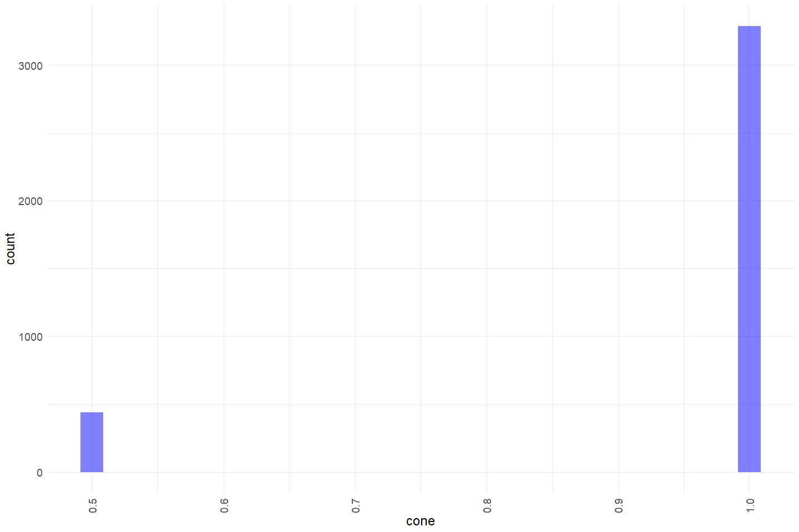

Battle Creek RST QC
================
Erin Cain
9/29/2021

# Battle Creek Rotary Screw Trap Data

## Description of Monitoring Data

These data were collected by the U.S. Fish and Wildlife Service’s, Red
Bluff Fish and Wildlife Office’s, Battle Creek Monitoring Program. These
data represent environmental conditions for Battle Creek RST.

**Timeframe:** 2003 - 2021

**Screw Trap Season:** September - June

**Completeness of Record throughout timeframe:**

**Sampling Location:** Upper Battle Creek (UBC)

**Data Contact:** [Mike Schraml](mailto:mike_schraml@fws.gov)

Any additional info?

## Access Cloud Data

``` r
# Run Sys.setenv() to specify GCS_AUTH_FILE and GCS_DEFAULT_BUCKET before running 
# getwd() to see how to specify paths 
# Open object from google cloud storage
# Set your authentication using gcs_auth
gcs_auth(json_file = Sys.getenv("GCS_AUTH_FILE"))
# Set global bucket 
gcs_global_bucket(bucket = Sys.getenv("GCS_DEFAULT_BUCKET"))

gcs_list_objects()
# git data and save as xlsx
gcs_get_object(object_name = "rst/battle-creek/data-raw/UBC Spring.xlsx",
               bucket = gcs_get_global_bucket(),
               saveToDisk = "raw_battle_rst_data.xlsx",
               overwrite = TRUE)
```

Read in data from google cloud, glimpse raw data and domain description
sheet:

``` r
sheets <- excel_sheets("raw_battle_rst_data.xlsx")
sheets
```

    ## [1] "Metadata"                "UBC Environmental 03-20"
    ## [3] "UBC Environmental 20-21" "UBC Catch Data"         
    ## [5] "Sample Year"

``` r
raw_environmental_1 <- read_excel("raw_battle_rst_data.xlsx", 
                                  sheet = "UBC Environmental 03-20") %>% glimpse()
```

    ## Rows: 3,387
    ## Columns: 32
    ## $ StationCode      <chr> "UBC", "UBC", "UBC", "UBC", "UBC", "UBC", "UBC", "UBC~
    ## $ SampleID         <chr> "274_03", "275_03", "276_03", "277_03", "278_03", "27~
    ## $ TrapStartDate    <dttm> 2003-09-30, 2003-10-01, 2003-10-02, 2003-10-03, 2003~
    ## $ TrapStartTime    <dttm> 1899-12-31 14:35:00, 1899-12-31 14:22:00, 1899-12-31~
    ## $ SampleDate       <dttm> 2003-10-01, 2003-10-02, 2003-10-03, 2003-10-04, 2003~
    ## $ SampleTime       <dttm> 1899-12-31 14:22:00, 1899-12-31 13:20:00, 1899-12-31~
    ## $ Counter          <dbl> 2417, 2260, 1954, 2943, 2649, 3087, 2208, 6750, 1962,~
    ## $ FlowStartMeter   <dbl> 939000, 13400, 23000, 91800, 118400, 187000, 262000, ~
    ## $ FlowEndMeter     <dbl> 953398, 23664, 31605, 97155, 123798, 200379, 27058, 3~
    ## $ FlowSetTime      <dbl> 900, 627, 556, 330, 323, 840, 503, 510, 780, 1320, 12~
    ## $ Velocity         <dbl> 1.40, 1.43, 1.35, 1.42, 1.46, 1.39, 133.09, 1.29, 1.3~
    ## $ Turbidity        <dbl> 1.7, 1.2, 1.3, 1.1, 1.8, 1.7, 1.5, 1.4, 1.7, 1.4, 1.1~
    ## $ SampleWeight     <dbl> 1, 1, 1, 1, 1, 1, 1, 1, 1, 1, 1, 1, 1, 1, 1, 1, 1, 1,~
    ## $ Cone             <dbl> 1, 1, 1, 1, 1, 1, 1, 1, 1, 1, 1, 1, 1, 1, 1, 1, 1, 1,~
    ## $ WeatherCode      <chr> "CLR", "CLR", "CLR", "CLR", "CLR", "CLR", "CLR", "CLR~
    ## $ LunarPhase       <chr> "H", "H", "H", "H", "H", "H", "F", "F", "F", "F", "F"~
    ## $ RiverLeftDepth   <lgl> NA, NA, NA, NA, NA, NA, NA, NA, NA, NA, NA, NA, NA, N~
    ## $ RiverCenterDepth <lgl> NA, NA, NA, NA, NA, NA, NA, NA, NA, NA, NA, NA, NA, N~
    ## $ RiverRightDepth  <lgl> NA, NA, NA, NA, NA, NA, NA, NA, NA, NA, NA, NA, NA, N~
    ## $ TrapSampleType   <chr> "N", "N", "N", "N", "N", "N", "N", "N", "N", "N", "N"~
    ## $ Habitat          <chr> "R", "R", "R", "R", "R", "R", "R", "R", "R", "R", "R"~
    ## $ Thalweg          <chr> "Y", "Y", "Y", "Y", "Y", "Y", "Y", "Y", "Y", "Y", "Y"~
    ## $ Diel             <chr> NA, NA, NA, NA, NA, NA, NA, NA, NA, NA, NA, NA, NA, N~
    ## $ DepthAdjust      <dbl> 29, 29, 29, 29, 28, 29, 29, 29, 28, 29, 28, 28, 28, 2~
    ## $ DebrisType       <chr> "ALS", "ALS", "ALS", "ALS", "ALS", "ALS", "ALS", "ALS~
    ## $ DebrisTubs       <dbl> 0.7, 0.4, 1.3, 0.8, 0.5, 0.5, 0.7, 1.0, 1.5, 4.2, 1.0~
    ## $ AvgTimePerRev    <dbl> 160, 164, 127, 89, 80, 90, 90, 115, 115, 126, 111, 23~
    ## $ FishProperly     <chr> "Y", "Y", "Y", "Y", "Y", "Y", "Y", "Y", "Y", "Y", "Y"~
    ## $ SubWeek          <chr> "A", "A", "A", "A", "A", "A", "A", "A", "A", "A", "A"~
    ## $ BaileysEff       <dbl> 0.0782, 0.0782, 0.0782, 0.0782, 0.0782, 0.0782, 0.078~
    ## $ NumReleased      <dbl> 490, 490, 490, 490, 490, 490, 490, 490, 490, 490, 490~
    ## $ TrapComments     <chr> NA, NA, NA, NA, NA, NA, "Flow end meter data incorrec~

``` r
raw_environmental_2 <- read_excel("raw_battle_rst_data.xlsx", 
                                  sheet = "UBC Environmental 20-21") %>% glimpse()
```

    ## Rows: 364
    ## Columns: 37
    ## $ StationCode       <chr> "UBC", "UBC", "UBC", "UBC", "UBC", "UBC", "UBC", "UB~
    ## $ SampleDate        <dttm> 2020-07-06, 2020-07-07, 2020-07-08, 2020-07-09, 202~
    ## $ SampleTime        <dttm> 1899-12-31 07:11:00, 1899-12-31 07:34:00, 1899-12-3~
    ## $ SampleID          <chr> "188_20", "189_20", "190_20", "191_20", "192_20", "1~
    ## $ UserName          <chr> "JK", "BF", "BF", "TU", "MES", "MES", "JK", "JK", "B~
    ## $ UserName2         <chr> "GB", "TU", "TU", "MES", "GB", "JK", "GB", "GB", "TU~
    ## $ DepthAdjust       <dbl> 27, 28, 28, 27, 27, 27, 27, 27, 28, 27, 27, 27, 27, ~
    ## $ AvgTimePerRev     <dbl> 32, 27, 28, 30, 32, 29, 30, 30, 29, 31, 35, 31, 33, ~
    ## $ FlowStartMeter    <dbl> 574000, 583000, 592000, 602000, 619000, 628000, 6420~
    ## $ FlowEndMeter      <dbl> 582961, 592392, 601502, 610685, 628265, 641432, 6518~
    ## $ FlowSetTime       <dbl> 300, 300, 300, 300, 305, 445, 330, 330, 300, 300, 30~
    ## $ RiverLeftDepth    <dbl> 3.4, 3.6, 3.6, 3.5, 3.5, 3.7, 3.7, 3.5, 3.7, 3.6, 3.~
    ## $ RiverCenterDepth  <dbl> 3.2, 3.4, 3.6, 3.4, 3.2, 3.6, 3.6, 3.5, 3.5, 3.5, 3.~
    ## $ RiverRightDepth   <dbl> 2.7, 3.4, 3.2, 3.2, 3.6, 3.2, 3.2, 3.4, 3.3, 3.1, 3.~
    ## $ WeatherCode       <chr> "CLR", "CLR", "CLR", "CLR", "CLR", "CLR", "CLR", "CL~
    ## $ GearConditionCode <chr> "N", "N", "N", "N", "N", "N", "N", "N", "N", "N", "N~
    ## $ Habitat           <chr> "R", "R", "R", "R", "R", "R", "R", "R", "R", "R", "R~
    ## $ Thalweg           <chr> "Y", "Y", "Y", "Y", "Y", "Y", "Y", "Y", "Y", "Y", "Y~
    ## $ Cone              <dbl> 1, 1, 1, 1, 1, 1, 1, 1, 1, 1, 1, 1, 1, 1, 1, 1, 1, 1~
    ## $ TrapSampleType    <chr> "N", "N", "N", "N", "N", "N", "N", "N", "N", "N", "N~
    ## $ Diel              <chr> "D", "D", "D", "D", "D", "D", "D", "D", "D", "D", "D~
    ## $ StartCounter      <dbl> 0, 0, 0, 0, 0, 0, 0, 0, 0, 0, 0, 0, 0, 0, 0, 0, 0, 0~
    ## $ Counter           <dbl> 7502, 9282, 8885, 8849, 8992, 8621, 8597, 8459, 8678~
    ## $ DebrisType        <chr> "ALS", "ALS", "ALS", "ALS", "ALS", "ALS", "ALS", "AL~
    ## $ DebrisTubs        <dbl> 0.3, 2.0, 0.5, 0.6, 0.8, 0.6, 0.5, 0.4, 0.7, 0.4, 0.~
    ## $ Velocity          <dbl> 2.61, 2.74, 2.77, 2.53, 2.66, 2.64, 2.61, 2.52, 2.60~
    ## $ Turbidity         <dbl> 2.65, 3.13, 2.28, 1.98, 1.62, 1.94, 4.49, 2.83, 1.54~
    ## $ LunarPhase        <chr> "F", "F", "H", "H", "H", "H", "H", "H", "H", "H", "H~
    ## $ TrapFishing       <chr> "Yes", "Yes", "Yes", "Yes", "Yes", "Yes", "Yes", "Ye~
    ## $ PartialSample     <chr> "No", "No", "No", "No", "No", "No", "No", "No", "No"~
    ## $ NumReleased       <dbl> 321, 321, 321, 321, 321, 321, 321, 321, 321, 321, 32~
    ## $ BaileysEff        <dbl> 0.1028, 0.1028, 0.1028, 0.1028, 0.1028, 0.1028, 0.10~
    ## $ ReportBaileysEff  <dbl> 0.1028, 0.1028, 0.1028, 0.1028, 0.1028, 0.1028, 0.10~
    ## $ SubWeek           <chr> "A", "A", "A", "A", "A", "A", "A", "A", "A", "A", "A~
    ## $ TrapStartDate     <dttm> 2020-07-05, 2020-07-06, 2020-07-07, 2020-07-08, 202~
    ## $ TrapStartTime     <dttm> 1899-12-31 11:06:00, 1899-12-31 07:11:00, 1899-12-3~
    ## $ TrapComments      <chr> NA, "Crowder was left in trap overnight. Unknown cyp~

## Data transformations

``` r
raw_rst_environmental <- bind_rows(raw_environmental_1, raw_environmental_2) %>% 
  glimpse()
```

    ## Rows: 3,751
    ## Columns: 39
    ## $ StationCode       <chr> "UBC", "UBC", "UBC", "UBC", "UBC", "UBC", "UBC", "UB~
    ## $ SampleID          <chr> "274_03", "275_03", "276_03", "277_03", "278_03", "2~
    ## $ TrapStartDate     <dttm> 2003-09-30, 2003-10-01, 2003-10-02, 2003-10-03, 200~
    ## $ TrapStartTime     <dttm> 1899-12-31 14:35:00, 1899-12-31 14:22:00, 1899-12-3~
    ## $ SampleDate        <dttm> 2003-10-01, 2003-10-02, 2003-10-03, 2003-10-04, 200~
    ## $ SampleTime        <dttm> 1899-12-31 14:22:00, 1899-12-31 13:20:00, 1899-12-3~
    ## $ Counter           <dbl> 2417, 2260, 1954, 2943, 2649, 3087, 2208, 6750, 1962~
    ## $ FlowStartMeter    <dbl> 939000, 13400, 23000, 91800, 118400, 187000, 262000,~
    ## $ FlowEndMeter      <dbl> 953398, 23664, 31605, 97155, 123798, 200379, 27058, ~
    ## $ FlowSetTime       <dbl> 900, 627, 556, 330, 323, 840, 503, 510, 780, 1320, 1~
    ## $ Velocity          <dbl> 1.40, 1.43, 1.35, 1.42, 1.46, 1.39, 133.09, 1.29, 1.~
    ## $ Turbidity         <dbl> 1.7, 1.2, 1.3, 1.1, 1.8, 1.7, 1.5, 1.4, 1.7, 1.4, 1.~
    ## $ SampleWeight      <dbl> 1, 1, 1, 1, 1, 1, 1, 1, 1, 1, 1, 1, 1, 1, 1, 1, 1, 1~
    ## $ Cone              <dbl> 1, 1, 1, 1, 1, 1, 1, 1, 1, 1, 1, 1, 1, 1, 1, 1, 1, 1~
    ## $ WeatherCode       <chr> "CLR", "CLR", "CLR", "CLR", "CLR", "CLR", "CLR", "CL~
    ## $ LunarPhase        <chr> "H", "H", "H", "H", "H", "H", "F", "F", "F", "F", "F~
    ## $ RiverLeftDepth    <dbl> NA, NA, NA, NA, NA, NA, NA, NA, NA, NA, NA, NA, NA, ~
    ## $ RiverCenterDepth  <dbl> NA, NA, NA, NA, NA, NA, NA, NA, NA, NA, NA, NA, NA, ~
    ## $ RiverRightDepth   <dbl> NA, NA, NA, NA, NA, NA, NA, NA, NA, NA, NA, NA, NA, ~
    ## $ TrapSampleType    <chr> "N", "N", "N", "N", "N", "N", "N", "N", "N", "N", "N~
    ## $ Habitat           <chr> "R", "R", "R", "R", "R", "R", "R", "R", "R", "R", "R~
    ## $ Thalweg           <chr> "Y", "Y", "Y", "Y", "Y", "Y", "Y", "Y", "Y", "Y", "Y~
    ## $ Diel              <chr> NA, NA, NA, NA, NA, NA, NA, NA, NA, NA, NA, NA, NA, ~
    ## $ DepthAdjust       <dbl> 29, 29, 29, 29, 28, 29, 29, 29, 28, 29, 28, 28, 28, ~
    ## $ DebrisType        <chr> "ALS", "ALS", "ALS", "ALS", "ALS", "ALS", "ALS", "AL~
    ## $ DebrisTubs        <dbl> 0.7, 0.4, 1.3, 0.8, 0.5, 0.5, 0.7, 1.0, 1.5, 4.2, 1.~
    ## $ AvgTimePerRev     <dbl> 160, 164, 127, 89, 80, 90, 90, 115, 115, 126, 111, 2~
    ## $ FishProperly      <chr> "Y", "Y", "Y", "Y", "Y", "Y", "Y", "Y", "Y", "Y", "Y~
    ## $ SubWeek           <chr> "A", "A", "A", "A", "A", "A", "A", "A", "A", "A", "A~
    ## $ BaileysEff        <dbl> 0.0782, 0.0782, 0.0782, 0.0782, 0.0782, 0.0782, 0.07~
    ## $ NumReleased       <dbl> 490, 490, 490, 490, 490, 490, 490, 490, 490, 490, 49~
    ## $ TrapComments      <chr> NA, NA, NA, NA, NA, NA, "Flow end meter data incorre~
    ## $ UserName          <chr> NA, NA, NA, NA, NA, NA, NA, NA, NA, NA, NA, NA, NA, ~
    ## $ UserName2         <chr> NA, NA, NA, NA, NA, NA, NA, NA, NA, NA, NA, NA, NA, ~
    ## $ GearConditionCode <chr> NA, NA, NA, NA, NA, NA, NA, NA, NA, NA, NA, NA, NA, ~
    ## $ StartCounter      <dbl> NA, NA, NA, NA, NA, NA, NA, NA, NA, NA, NA, NA, NA, ~
    ## $ TrapFishing       <chr> NA, NA, NA, NA, NA, NA, NA, NA, NA, NA, NA, NA, NA, ~
    ## $ PartialSample     <chr> NA, NA, NA, NA, NA, NA, NA, NA, NA, NA, NA, NA, NA, ~
    ## $ ReportBaileysEff  <dbl> NA, NA, NA, NA, NA, NA, NA, NA, NA, NA, NA, NA, NA, ~

``` r
cleaner_rst_environmental <- raw_rst_environmental %>%
  janitor::clean_names() %>%
  rename() %>%
  mutate(trap_start_date = as.Date(trap_start_date),
         trap_start_time = hms::as_hms(trap_start_time),
         sample_date = as.Date(sample_date),
         sample_time = hms::as_hms(sample_time)) %>%
  select(-station_code, -user_name, -user_name2) %>%
  glimpse
```

    ## Rows: 3,751
    ## Columns: 36
    ## $ sample_id           <chr> "274_03", "275_03", "276_03", "277_03", "278_03", ~
    ## $ trap_start_date     <date> 2003-09-30, 2003-10-01, 2003-10-02, 2003-10-03, 2~
    ## $ trap_start_time     <time> 14:35:00, 14:22:00, 13:20:00, 08:25:00, 11:57:00,~
    ## $ sample_date         <date> 2003-10-01, 2003-10-02, 2003-10-03, 2003-10-04, 2~
    ## $ sample_time         <time> 14:22:00, 13:20:00, 08:25:00, 11:57:00, 11:07:00,~
    ## $ counter             <dbl> 2417, 2260, 1954, 2943, 2649, 3087, 2208, 6750, 19~
    ## $ flow_start_meter    <dbl> 939000, 13400, 23000, 91800, 118400, 187000, 26200~
    ## $ flow_end_meter      <dbl> 953398, 23664, 31605, 97155, 123798, 200379, 27058~
    ## $ flow_set_time       <dbl> 900, 627, 556, 330, 323, 840, 503, 510, 780, 1320,~
    ## $ velocity            <dbl> 1.40, 1.43, 1.35, 1.42, 1.46, 1.39, 133.09, 1.29, ~
    ## $ turbidity           <dbl> 1.7, 1.2, 1.3, 1.1, 1.8, 1.7, 1.5, 1.4, 1.7, 1.4, ~
    ## $ sample_weight       <dbl> 1, 1, 1, 1, 1, 1, 1, 1, 1, 1, 1, 1, 1, 1, 1, 1, 1,~
    ## $ cone                <dbl> 1, 1, 1, 1, 1, 1, 1, 1, 1, 1, 1, 1, 1, 1, 1, 1, 1,~
    ## $ weather_code        <chr> "CLR", "CLR", "CLR", "CLR", "CLR", "CLR", "CLR", "~
    ## $ lunar_phase         <chr> "H", "H", "H", "H", "H", "H", "F", "F", "F", "F", ~
    ## $ river_left_depth    <dbl> NA, NA, NA, NA, NA, NA, NA, NA, NA, NA, NA, NA, NA~
    ## $ river_center_depth  <dbl> NA, NA, NA, NA, NA, NA, NA, NA, NA, NA, NA, NA, NA~
    ## $ river_right_depth   <dbl> NA, NA, NA, NA, NA, NA, NA, NA, NA, NA, NA, NA, NA~
    ## $ trap_sample_type    <chr> "N", "N", "N", "N", "N", "N", "N", "N", "N", "N", ~
    ## $ habitat             <chr> "R", "R", "R", "R", "R", "R", "R", "R", "R", "R", ~
    ## $ thalweg             <chr> "Y", "Y", "Y", "Y", "Y", "Y", "Y", "Y", "Y", "Y", ~
    ## $ diel                <chr> NA, NA, NA, NA, NA, NA, NA, NA, NA, NA, NA, NA, NA~
    ## $ depth_adjust        <dbl> 29, 29, 29, 29, 28, 29, 29, 29, 28, 29, 28, 28, 28~
    ## $ debris_type         <chr> "ALS", "ALS", "ALS", "ALS", "ALS", "ALS", "ALS", "~
    ## $ debris_tubs         <dbl> 0.7, 0.4, 1.3, 0.8, 0.5, 0.5, 0.7, 1.0, 1.5, 4.2, ~
    ## $ avg_time_per_rev    <dbl> 160, 164, 127, 89, 80, 90, 90, 115, 115, 126, 111,~
    ## $ fish_properly       <chr> "Y", "Y", "Y", "Y", "Y", "Y", "Y", "Y", "Y", "Y", ~
    ## $ sub_week            <chr> "A", "A", "A", "A", "A", "A", "A", "A", "A", "A", ~
    ## $ baileys_eff         <dbl> 0.0782, 0.0782, 0.0782, 0.0782, 0.0782, 0.0782, 0.~
    ## $ num_released        <dbl> 490, 490, 490, 490, 490, 490, 490, 490, 490, 490, ~
    ## $ trap_comments       <chr> NA, NA, NA, NA, NA, NA, "Flow end meter data incor~
    ## $ gear_condition_code <chr> NA, NA, NA, NA, NA, NA, NA, NA, NA, NA, NA, NA, NA~
    ## $ start_counter       <dbl> NA, NA, NA, NA, NA, NA, NA, NA, NA, NA, NA, NA, NA~
    ## $ trap_fishing        <chr> NA, NA, NA, NA, NA, NA, NA, NA, NA, NA, NA, NA, NA~
    ## $ partial_sample      <chr> NA, NA, NA, NA, NA, NA, NA, NA, NA, NA, NA, NA, NA~
    ## $ report_baileys_eff  <dbl> NA, NA, NA, NA, NA, NA, NA, NA, NA, NA, NA, NA, NA~

## Explore Numeric Variables:

``` r
cleaner_rst_environmental %>% select_if(is.numeric) %>% colnames 
```

    ##  [1] "counter"            "flow_start_meter"   "flow_end_meter"    
    ##  [4] "flow_set_time"      "velocity"           "turbidity"         
    ##  [7] "sample_weight"      "cone"               "river_left_depth"  
    ## [10] "river_center_depth" "river_right_depth"  "depth_adjust"      
    ## [13] "debris_tubs"        "avg_time_per_rev"   "baileys_eff"       
    ## [16] "num_released"       "start_counter"      "report_baileys_eff"

### Variable: `counter`

Number on the cone revolution counter at SampleDate and SampleTime

**Plotting distribution of counter**

``` r
cleaner_rst_environmental %>% 
  filter(counter < 25000) %>% # filter out 5 values > 25000
  ggplot() +
  geom_histogram(aes(x = counter), fill = "blue", alpha = .5) +
  theme_minimal() + 
  theme(text = element_text(size = 18),
        axis.text.x = element_text(angle = 90, vjust = 0.5, hjust=1)) 
```

    ## `stat_bin()` using `bins = 30`. Pick better value with `binwidth`.

<!-- -->

``` r
cleaner_rst_environmental %>% 
  ggplot() +
  geom_boxplot(aes(x = counter, y = as.factor(year(sample_date))), fill = "blue", alpha = .5) +
  theme_minimal() + 
  theme(text = element_text(size = 18),
        axis.text.x = element_text(angle = 90, vjust = 0.5, hjust=1)) 
```

<!-- -->

**Numeric Summary of counter over Period of Record**

``` r
summary(cleaner_rst_environmental$counter)
```

    ##    Min. 1st Qu.  Median    Mean 3rd Qu.    Max.    NA's 
    ##       0    4548    6782    6998    9104   90717      81

**NA and Unknown Values**

-   2.2 % of values in the `counter` column are NA.

### Variable: `flow_start_meter`, `flow_end_meter`

The read out number on the mechanical counter of the flow meter at the
start and end of the velocity test

**Plotting distribution of flow start meter and flow end meter**

``` r
cleaner_rst_environmental %>% 
  ggplot() +
  geom_histogram(aes(x = flow_start_meter), fill = "blue", alpha = .5) +
  geom_histogram(aes(x = flow_end_meter), fill = "blue", alpha = .5) +
  theme_minimal() + 
  theme(text = element_text(size = 18),
        axis.text.x = element_text(angle = 90, vjust = 0.5, hjust=1)) 
```

    ## `stat_bin()` using `bins = 30`. Pick better value with `binwidth`.
    ## `stat_bin()` using `bins = 30`. Pick better value with `binwidth`.

<!-- -->

Start times and end times appear to have a similar distribution.

**Numeric Summary**

``` r
summary(cleaner_rst_environmental$flow_start_meter)
```

    ##    Min. 1st Qu.  Median    Mean 3rd Qu.    Max.    NA's 
    ##       0  231000  479000  484270  736200 1099600     106

``` r
summary(cleaner_rst_environmental$flow_end_meter)
```

    ##    Min. 1st Qu.  Median    Mean 3rd Qu.    Max.    NA's 
    ##      73  235448  483138  488418  739486 1016758     106

**NA and Unknown Values**

-   2.8 % of values in the `flow_start_meter` column are NA.
-   2.8 % of values in the `flow_end_meter` column are NA.

### Variable: `flow_set_time`

How long the General Oceanics mechanical flow meter (Oceanic ® Model
2030) was in the water taking a reading, used to calculate water
velocity in front of the cone  
**Plotting distribution of flow set time**

``` r
cleaner_rst_environmental %>% 
  ggplot() +
  geom_histogram(aes(x = flow_set_time)) +
  theme_minimal() +
  theme(text = element_text(size = 18),
        axis.text.x = element_text(angle = 90, vjust = 0.5, hjust=1)) 
```

    ## `stat_bin()` using `bins = 30`. Pick better value with `binwidth`.

<!-- -->

Flow set times appear mainly between 100 and 1000 with a few values up
to almost 4000.

**Numeric Summary of flow set time over Period of Record**

``` r
summary(cleaner_rst_environmental$flow_set_time)
```

    ##    Min. 1st Qu.  Median    Mean 3rd Qu.    Max.    NA's 
    ##     5.0   300.0   302.0   365.5   360.0  3600.0     108

**NA and Unknown Values**

-   2.2 % of values in the `counter` column are NA.

### Variable: `velocity`

Calculated water velocity in front of the cone using a General Oceanics
mechanical flow meter (Oceanic ® Model 2030) = ( (Flowmeter end - flow
meter begin)/time in seconds)\*.0875

**Plotting distribution of velocity**

``` r
cleaner_rst_environmental %>% 
  filter(velocity < 25) %>% # filter out values greater than 25
  ggplot() +
  geom_histogram(aes(x = velocity), fill = "blue", alpha = .5) +
  theme_minimal() + 
  theme(text = element_text(size = 18),
        axis.text.x = element_text(angle = 90, vjust = 0.5, hjust=1)) 
```

    ## `stat_bin()` using `bins = 30`. Pick better value with `binwidth`.

<!-- -->

``` r
# TODO add another graph
```

**Numeric Summary of velocity**

``` r
summary(cleaner_rst_environmental$velocity)
```

    ##    Min. 1st Qu.  Median    Mean 3rd Qu.    Max.    NA's 
    ##   0.000   1.870   2.270   2.601   2.740 155.090     107

**NA and Unknown Values**

-   2.9 % of values in the `velocity` column are NA.

### Variable: `turbidity`

Turbidity result from a grab sample taken at the trap on the SampleDate
and SampleTime

**Plotting distribution of turbidity**

``` r
cleaner_rst_environmental %>% 
  filter(counter < 200) %>% # filter out values < 200
  ggplot() +
  geom_histogram(aes(x = turbidity), fill = "blue", alpha = .5) +
  theme_minimal() + 
  theme(text = element_text(size = 18),
        axis.text.x = element_text(angle = 90, vjust = 0.5, hjust=1)) 
```

    ## `stat_bin()` using `bins = 30`. Pick better value with `binwidth`.

<!-- -->

``` r
# TODO fix this 

# Make whatever plot is appropriate 
# maybe 2 plots is appropriate
cleaner_rst_environmental %>% 
  group_by(date = as.Date(sample_date)) %>%
  mutate(avg_turbidity_ntu = mean(turbidity)) %>%
  filter(avg_turbidity_ntu < 100) %>%
  ungroup() %>%
 mutate(year = as.factor(year(date)),
         fake_year = if_else(month(date) %in% 10:12, 1900, 1901),
         fake_date = as.Date(paste0(fake_year,"-", month(date), "-", day(date)))) %>%
  ggplot(aes(x = fake_date, y = avg_turbidity_ntu, color = year)) + 
  geom_point(alpha = .25) + 
  # facet_wrap(~year(date), scales = "free") + 
  scale_x_date(labels = date_format("%b"), date_breaks = "1 month") + 
  theme_minimal() + 
  theme(text = element_text(size = 15),
        axis.text.x = element_text(angle = 90, vjust = 0.5, hjust=1),
        legend.position = "none") + 
  labs(title = "Daily Turbidity Measures (colored by year)",
       x = "Date", 
       y = "Average Daily Turbidity NTUs")  
```

<!-- -->

``` r
# TODO fix plot
cleaner_rst_environmental %>% 
  filter(year(as.Date(sample_date)) > 1999) %>% # Filter because only a few measure before this date
  mutate(year = as.factor(year(as.Date(sample_date)))) %>%
  ggplot(aes(x = turbidity, y = year)) + 
  geom_boxplot() + 
  theme_minimal() +
  labs(title = "Water Turbidity measures summarized by year",
       x = "Turbidity NTUs") + 
  theme(text = element_text(size = 15),
        axis.text.x = element_text(angle = 90, vjust = 0.5, hjust=1)) 
```

<!-- -->

Most turbidity measures are low but a few outliers going up until 850

**Numeric Summary of turbidity over Period of Record**

``` r
summary(cleaner_rst_environmental$turbidity)
```

    ##    Min. 1st Qu.  Median    Mean 3rd Qu.    Max.    NA's 
    ##   0.630   1.895   2.600   4.157   3.900 832.000      96

**NA and Unknown Values**

-   2.6 % of values in the `turbidity` column are NA.

### Variable: `sample_weight`, `cone`

Was the trap fished at cone full-cone (1.0) or half-cone (0.5) setting

**Plotting distribution of sample\_weight**

``` r
cleaner_rst_environmental %>% 
  ggplot() +
  geom_histogram(aes(x = sample_weight), fill = "blue", alpha = .5) +
  theme_minimal() + 
  theme(text = element_text(size = 18),
        axis.text.x = element_text(angle = 90, vjust = 0.5, hjust=1)) 
```

    ## `stat_bin()` using `bins = 30`. Pick better value with `binwidth`.

<!-- -->

**Plotting distribution of cone**

``` r
cleaner_rst_environmental %>% 
  ggplot() +
  geom_histogram(aes(x = cone), fill = "blue", alpha = .5) +
  theme_minimal() + 
  theme(text = element_text(size = 18),
        axis.text.x = element_text(angle = 90, vjust = 0.5, hjust=1)) 
```

    ## `stat_bin()` using `bins = 30`. Pick better value with `binwidth`.

<!-- -->

All sample weights and cone measures are either .5 o 1.

**Numeric Summary of turbidity over Period of Record**

``` r
summary(cleaner_rst_environmental$sample_weight)
```

    ##    Min. 1st Qu.  Median    Mean 3rd Qu.    Max.    NA's 
    ##  0.5000  1.0000  1.0000  0.9359  1.0000  1.0000     364

**NA and Unknown Values**

-   9.7 % of values in the `sample_weight` column are NA.

### Variable: `turbidity`

Turbidity result from a grab sample taken at the trap on the SampleDate
and SampleTime

**Plotting distribution of turbidity**

``` r
cleaner_rst_environmental %>% 
  filter(counter < 200) %>% # filter out values < 200
  ggplot() +
  geom_histogram(aes(x = turbidity), fill = "blue", alpha = .5) +
  theme_minimal() + 
  theme(text = element_text(size = 18),
        axis.text.x = element_text(angle = 90, vjust = 0.5, hjust=1)) 
```

    ## `stat_bin()` using `bins = 30`. Pick better value with `binwidth`.

<!-- -->

``` r
# TODO fix this 

# Make whatever plot is appropriate 
# maybe 2 plots is appropriate
cleaner_rst_environmental %>% 
  group_by(date = as.Date(sample_date)) %>%
  mutate(avg_turbidity_ntu = mean(turbidity)) %>%
  filter(avg_turbidity_ntu < 100) %>%
  ungroup() %>%
 mutate(year = as.factor(year(date)),
         fake_year = if_else(month(date) %in% 10:12, 1900, 1901),
         fake_date = as.Date(paste0(fake_year,"-", month(date), "-", day(date)))) %>%
  ggplot(aes(x = fake_date, y = avg_turbidity_ntu, color = year)) + 
  geom_point(alpha = .25) + 
  # facet_wrap(~year(date), scales = "free") + 
  scale_x_date(labels = date_format("%b"), date_breaks = "1 month") + 
  theme_minimal() + 
  theme(text = element_text(size = 15),
        axis.text.x = element_text(angle = 90, vjust = 0.5, hjust=1),
        legend.position = "none") + 
  labs(title = "Daily Turbidity Measures (colored by year)",
       x = "Date", 
       y = "Average Daily Turbidity NTUs")  
```

<!-- -->

``` r
# TODO fix plot
cleaner_rst_environmental %>% 
  filter(year(as.Date(sample_date)) > 1999) %>% # Filter because only a few measure before this date
  mutate(year = as.factor(year(as.Date(sample_date)))) %>%
  ggplot(aes(x = turbidity, y = year)) + 
  geom_boxplot() + 
  theme_minimal() +
  labs(title = "Water Turbidity measures summarized by year",
       x = "Turbidity NTUs") + 
  theme(text = element_text(size = 15),
        axis.text.x = element_text(angle = 90, vjust = 0.5, hjust=1)) 
```

<!-- -->

Most turbidity measures are low but a few outliers going up until 850

**Numeric Summary of turbidity over Period of Record**

``` r
summary(cleaner_rst_environmental$turbidity)
```

    ##    Min. 1st Qu.  Median    Mean 3rd Qu.    Max.    NA's 
    ##   0.630   1.895   2.600   4.157   3.900 832.000      96

**NA and Unknown Values**

-   2.6 % of values in the `turbidity` column are NA.

## Explore Categorical variables:

``` r
cleaner_rst_environmental %>% select_if(is.character) %>% colnames
```

    ##  [1] "sample_id"           "weather_code"        "lunar_phase"        
    ##  [4] "trap_sample_type"    "habitat"             "thalweg"            
    ##  [7] "diel"                "debris_type"         "fish_properly"      
    ## [10] "sub_week"            "trap_comments"       "gear_condition_code"
    ## [13] "trap_fishing"        "partial_sample"

### Variable: `sample_id`

The calendar year Julian date and year code for that \~24-h sample
period (ddd\_yy)

``` r
#table() 
```

Fix inconsistencies with spelling, capitalization, and abbreviations.

``` r
# Fix any inconsistencies with categorical variables
```

**Create lookup rda for \[variable\] encoding:**

``` r
# Create named lookup vector
# Name rda [watershed]_[data type]_[variable_name].rda
# save rda to data/ 
```

**NA and Unknown Values**

-   0 % of values in the `sample_id` column are NA.

### Variable: `weather_code`

A code for the weather conditions on the SampleDate and SampleTime. See
VariableCodesLookUp table

``` r
table(cleaner_rst_environmental$weather_code) 
```

    ## 
    ##     cld     CLD  CLOUDY     CLR     FOG    PCLD     RAN WIN/CLR   WINDY 
    ##       2     685       1    2381      35     280     293       2      41

Fix inconsistencies with spelling, capitalization, and abbreviations.

``` r
# Fix any inconsistencies with categorical variables
```

**NA and Unknown Values**

-   0.8 % of values in the `weather_code` column are NA.

### Variable: `lunar_phase`

Stage of the Moon on the SampleDate and SampleTime, from:
<http://aa.usno.navy.mil/data/docs/MoonFraction.php>. See
VariableCodesLookUp table

``` r
table(cleaner_rst_environmental$lunar_phase) 
```

    ## 
    ##    F    H    N 
    ##  892 1897  929

Fix inconsistencies with spelling, capitalization, and abbreviations.

``` r
# Fix any inconsistencies with categorical variables
```

**NA and Unknown Values**

-   0.9 % of values in the `lunar_phase` column are NA.

### Variable: `trap_sample_type`

The type of sample regime, see VariableCodesLookUp table

``` r
table(cleaner_rst_environmental$trap_sample_type) 
```

    ## 
    ##    N    R 
    ## 3666   57

Fix inconsistencies with spelling, capitalization, and abbreviations.

``` r
# Fix any inconsistencies with categorical variables
```

**NA and Unknown Values**

-   0.7 % of values in the `trap_sample_type` column are NA.

### Variable: `habitat`

The type of flow habitat the trap fished in, see VariableCodesLookUp
table

``` r
table(cleaner_rst_environmental$habitat) 
```

    ## 
    ##    B    R 
    ##    1 3723

Fix inconsistencies with spelling, capitalization, and abbreviations.

``` r
# Fix any inconsistencies with categorical variables
```

**NA and Unknown Values**

-   0.7 % of values in the `habitat` column are NA.

### Variable: `thalweg`

Was trap fishing in the thalweg at SampleDate and SampleTime

``` r
table(cleaner_rst_environmental$thalweg) 
```

    ## 
    ##    N    Y 
    ##   21 3698

Fix inconsistencies with spelling, capitalization, and abbreviations.

``` r
# Fix any inconsistencies with categorical variables
```

**NA and Unknown Values**

-   0.9 % of values in the `thalweg` column are NA.

### Variable: `diel`

The time of day relative to the sun, see VariableCodesLookUp table

``` r
table(cleaner_rst_environmental$diel) 
```

    ## 
    ##   C1    D    N 
    ##    4 2578   16

Fix inconsistencies with spelling, capitalization, and abbreviations.

``` r
# Fix any inconsistencies with categorical variables
```

**NA and Unknown Values**

-   30.7 % of values in the `diel` column are NA.

### Variable: `debris_type`

The type of debris found in the live-box, see VariableCodesLookUp table

``` r
table(cleaner_rst_environmental$debris_type) 
```

    ## 
    ##    a    A   AL  als  ALS   as   AS    L   ls   LS 
    ##   40  303   20  115 3070  133    3    5    3   26

Fix inconsistencies with spelling, capitalization, and abbreviations.

``` r
# Fix any inconsistencies with categorical variables
```

**NA and Unknown Values**

-   0.9 % of values in the `debris_type` column are NA.

### Variable: `fish_properly`

Was there a problem with the trap at SampleDate and SampleTime

``` r
table(cleaner_rst_environmental$fish_properly) 
```

    ## 
    ##    N    Y 
    ##  109 3276

Fix inconsistencies with spelling, capitalization, and abbreviations.

``` r
# Fix any inconsistencies with categorical variables
```

**NA and Unknown Values**

-   9.8 % of values in the `fish_properly` column are NA.

### Variable: `sub_week`

If sample week has more than one efficiency, which part of week is
sample from

``` r
table(cleaner_rst_environmental$sub_week) 
```

    ## 
    ##    A    B    C 
    ## 3477  267    7

Fix inconsistencies with spelling, capitalization, and abbreviations.

``` r
# Fix any inconsistencies with categorical variables
```

**NA and Unknown Values**

-   0 % of values in the `sub_week` column are NA.

### Variable: `trap_comments`

``` r
table(cleaner_rst_environmental$trap_comments) 
```

    ## 
    ##                                                                                                                                                                                                   ~100 SASU released because they were too small to net 
    ##                                                                                                                                                                                                                                                       1 
    ##                                                                                                                                                                                                                   ~1000 SASU fry, 105 r3 weight correct 
    ##                                                                                                                                                                                                                                                       1 
    ##                                                                                                                                                                           ~150 SASU fry that are to small to net. The back screen was opened to release 
    ##                                                                                                                                                                                                                                                       1 
    ##                                                                                                                                                                                                                                     ~20 catostomous fry 
    ##                                                                                                                                                                                                                                                       1 
    ##                                                                                                                                                                                                                                    ~250 Catostomous fry 
    ##                                                                                                                                                                                                                                                       1 
    ##                                                                                                                                                                                                                           ~40 SASU fry left in live box 
    ##                                                                                                                                                                                                                                                       1 
    ##                                                                                                                                                                                                  ~450 SASU fry in trap too small to net, vaild wt on r4 
    ##                                                                                                                                                                                                                                                       1 
    ##                                                                                                                                                                                                                                     ~50 catostomous fry 
    ##                                                                                                                                                                                                                                                       1 
    ##                                                                                                                                                                                                                ~50 unidentified fry larger fry measured 
    ##                                                                                                                                                                                                                                                       1 
    ##                                                                                                                                                                                                                ~50 unidentified fry measured larger fry 
    ##                                                                                                                                                                                                                                                       1 
    ##                                                                                                                                                                                                                                    ~75 SASU fry in trap 
    ##                                                                                                                                                                                                                                                       1 
    ##                                                                                                                                                                                                         + or - 200 SASU fry released too small to count 
    ##                                                                                                                                                                                                                                                       1 
    ##                                                                                                                                                                                                                                           +150 SASU fry 
    ##                                                                                                                                                                                                                                                       1 
    ##                                                                                                                                                                                                                                           +400 SASU FRY 
    ##                                                                                                                                                                                                                                                       1 
    ##                                                                                                                                                                                   0 FL CHN = C3 jumped out of live box. Approx. 300 cat fry in live box 
    ##                                                                                                                                                                                                                                                       1 
    ##                                                                                                                                                                                                                                     1 C1 went overboard 
    ##                                                                                                                                                                                                                                                       1 
    ##                                                                                                                                                                                                                                 1 HH escaped ~100 mm FL 
    ##                                                                                                                                                                                                                                                       1 
    ##                                                                                                                                                                                                                                            1 R3 escaped 
    ##                                                                                                                                                                                                                                                       1 
    ##                                                                                                                                                                                                                                         1 R3 euthanized 
    ##                                                                                                                                                                                                                                                       1 
    ##                                                                                                                                                                           1 RBT @ 17 6mm sacrificed. If duplicate PLT @ 12 3mm, count only one of them. 
    ##                                                                                                                                                                                                                                                       1 
    ##                                                                                                                                                                                           1 RBT has injury. Did not measure or weigh. Cone not rotating 
    ##                                                                                                                                                                                                                                                       1 
    ##                                                                                                                                                                                                           1 unidentified fry due to being larval stage. 
    ##                                                                                                                                                                                                                                                       1 
    ##                                                                                                                                                                                                                                         1/2 eammo, cut. 
    ##                                                                                                                                                                                                                                                       1 
    ##                                                                                                                                                                                                               1/2 of cone Partially blocked with debris 
    ##                                                                                                                                                                                                                                                       1 
    ##                                                                                                                                                                                                                                               10 CATFRY 
    ##                                                                                                                                                                                                                                                       1 
    ##                                                                                                                                                                                                                                             100 cat fry 
    ##                                                                                                                                                                                                                                                       3 
    ##                                                                                                                                                                                                                                             100 CAT FRY 
    ##                                                                                                                                                                                                                                                       1 
    ##                                                                                                                                                                                                                                              100 catfry 
    ##                                                                                                                                                                                                                                                       2 
    ##                                                                                                                                                                                                                                              100 CATFRY 
    ##                                                                                                                                                                                                                                                       1 
    ##                                                                                                                                                                                                                                            100 SASU fry 
    ##                                                                                                                                                                                                                                                       1 
    ##                                                                                                                                                                                                                               100 mm CHN clipped, recap 
    ##                                                                                                                                                                                                                                                       1 
    ##                                                                                                                                                                                                     100+ degrees last 3 days and today through tomorrow 
    ##                                                                                                                                                                                                                                                       1 
    ##                                                                                                                                                                                                                                           100+ sasu fry 
    ##                                                                                                                                                                                                                                                       1 
    ##                                                                                                                                                                                                          100+degrees today and for 10 more days to come 
    ##                                                                                                                                                                                                                                                       1 
    ##                                                                                                                                                                                                                    118 RBT was correct length & weight. 
    ##                                                                                                                                                                                                                                                       1 
    ##                                                                                                                                                                                                        13 tubs from night clear. 38 mark recap chinook. 
    ##                                                                                                                                                                                                                                                       1 
    ##                                                                                                                                                                                                                                             1353 @ 1943 
    ##                                                                                                                                                                                                                                                       1 
    ##                                                                                                                                                                                                                              13965 counter number, 0938 
    ##                                                                                                                                                                                                                                                       1 
    ##                                                                                                                                                                                                                                    14-55193 no C sample 
    ##                                                                                                                                                                                                                                                       1 
    ##                                                                                                                                                                                                                                 141, weight was correct 
    ##                                                                                                                                                                                                                                                       1 
    ##                                                                                                                                                                                                                            150 cat fry, counter not set 
    ##                                                                                                                                                                                                                                                       1 
    ##                                                                                                                                                                                                                                   150 CATFRY, 50 COTFRY 
    ##                                                                                                                                                                                                                                                       2 
    ##                                                                                                                                                                                                                               150 SASU FRY; Cone raised 
    ##                                                                                                                                                                                                                                                       1 
    ##                                                                                                                                                                                                                                   1723 rotations @ 1730 
    ##                                                                                                                                                                                                                                                       1 
    ##                                                                                                                                                                                                         2 rotations, empty live box , flow start 000000 
    ##                                                                                                                                                                                                                                                       1 
    ##                                                                                                                                                                                                                                             20 sasu fry 
    ##                                                                                                                                                                                                                                                       1 
    ##                                                                                                                                                                                                                                     20 unidentified fry 
    ##                                                                                                                                                                                                                                                       1 
    ##                                                                                                                                                                                                                                             200 cat fry 
    ##                                                                                                                                                                                                                                                       2 
    ##                                                                                                                                                                                                                                200 cat fry; Cone raised 
    ##                                                                                                                                                                                                                                                       1 
    ##                                                                                                                                                                                                                                              200 catfry 
    ##                                                                                                                                                                                                                                                       1 
    ##                                                                                                                                                                                                                                              200 CATFRY 
    ##                                                                                                                                                                                                                                                       1 
    ##                                                                                                                                                                                                                         200 Catfry observed in live box 
    ##                                                                                                                                                                                                                                                       1 
    ##                                                                                                                                                                                                                                200 cot fry, 200 cat fry 
    ##                                                                                                                                                                                                                                                       1 
    ##                                                                                                                                                                                     200 plus smaller sized sasu released from trap too small to measure 
    ##                                                                                                                                                                                                                                                       1 
    ##                                                                                                                                                                                                                                            200 SASU fry 
    ##                                                                                                                                                                                                                                                       1 
    ##                                                                                                                                                                                                                                200 sasu fry, 50 cot fry 
    ##                                                                                                                                                                                                                                                       1 
    ##                                                                                                                                                                                                       200 sasu released from trap.. too small to sample 
    ##                                                                                                                                                                                                                                                       1 
    ##                                                                                                                                                               207 mm RBT with a 36 g weight did not make sense. The weight was deleted. DJC 07/28/2010. 
    ##                                                                                                                                                                                                                                                       1 
    ##                                                                                                                                                                                                                                     225 cat 115 cot fry 
    ##                                                                                                                                                                                                                                                       1 
    ##                                                                                                                                                                                                                   25 unidentified fry: visual estimate. 
    ##                                                                                                                                                                                                                                                       1 
    ##                                                                                                                                                                                                                                              250 CATFRY 
    ##                                                                                                                                                                                                                                                       1 
    ##                                                                                                                                                                                                               250 catfry, trap pulled for end of season 
    ##                                                                                                                                                                                                                                                       1 
    ##                                                                                                                                                                                                                                250 SASU FRY, 150 COTFRY 
    ##                                                                                                                                                                                                                                                       1 
    ##                                                                                                                                                                                                                                  250 SASUFRY, 25 COTFRY 
    ##                                                                                                                                                                                                                                                       1 
    ##                                                                                                                                                                                                                                        257 marked fish. 
    ##                                                                                                                                                                                                                                                       1 
    ##                                                                                                                                                                                                                                  28 hardhead unmeasured 
    ##                                                                                                                                                                                                                                                       1 
    ##                                                                                                                                                                                    2nd attempt. Closed on 1st. Need new flow pelican. No fish captured. 
    ##                                                                                                                                                                                                                                                       1 
    ##                                                                                                                                                                                                                    2nd small trout died after measured. 
    ##                                                                                                                                                                                                                                                       1 
    ##                                                                                                                                                                                                                                        3 snakes in trap 
    ##                                                                                                                                                                                                                                                       1 
    ##                                                                                                                                                                                                                                300 CAT FRY, 200 COT FRY 
    ##                                                                                                                                                                                                                                                       1 
    ##                                                                                                                                                                                                                                              300 catfry 
    ##                                                                                                                                                                                                                                                       1 
    ##                                                                                                                                                                                                                                  300 CATFRY, 150 COTFRY 
    ##                                                                                                                                                                                                                                                       1 
    ##                                                                                                                                                                                                                     300 catfry, original counter 13,656 
    ##                                                                                                                                                                                                                                                       1 
    ##                                                                                                                                                                                                                                            300 sasu fry 
    ##                                                                                                                                                                                                                                                       1 
    ##                                                                                                                                                                                                                            31 catfry live 3 mort catfry 
    ##                                                                                                                                                                                                                                                       1 
    ##                                                                                                                                                                                                                                  400 CATFRY, 250 COTFRY 
    ##                                                                                                                                                                                                                                                       1 
    ##                                                                                                                                                                                                                                        400 sasu in trap 
    ##                                                                                                                                                                                                                                                       1 
    ##                                                                                                                                                                                                                                   41 mark recap chinook 
    ##                                                                                                                                                                                                                                                       1 
    ##                                                                                                                                                                                                42 PLT plus count, night clear 14:46. No weight for RBT. 
    ##                                                                                                                                                                                                                                                       1 
    ##                                                                                                                                                                                                                               420 mm to heavy for scale 
    ##                                                                                                                                                                                                                                                       1 
    ##                                                                                                                                                                                                                                             444 4@ 2000 
    ##                                                                                                                                                                                                                                                       1 
    ##                                                                                                                                                                                                                                   450 CATFRY, 50 COTFRY 
    ##                                                                                                                                                                                                                                                       1 
    ##                                                                                                                                                                                                                                          5 CAT FRY 24mm 
    ##                                                                                                                                                                                                                                                       1 
    ##                                                                                                                                                                                                                                       50 catastomus fry 
    ##                                                                                                                                                                                                                                                       1 
    ##                                                                                                                                                                                                                                               50 catfry 
    ##                                                                                                                                                                                                                                                       1 
    ##                                                                                                                                                                                                                                       50 cyp fry in box 
    ##                                                                                                                                                                                                                                                       1 
    ##                                                                                                                                                                                                                                               50 cypfry 
    ##                                                                                                                                                                                                                                                       2 
    ##                                                                                                                                                                                                                                           50 SUCKER FRY 
    ##                                                                                                                                                                                                                                                       1 
    ##                                                                                                                                                                                                                  50 visually estimated unidentified fry 
    ##                                                                                                                                                                                                                                                       1 
    ##                                                                                                                                                                                                                                          50+ sucker fry 
    ##                                                                                                                                                                                                                                                       1 
    ##                                                                                                                                                                                                                                              500 catfry 
    ##                                                                                                                                                                                                                                                       1 
    ##                                                                                                                                                                                                                                  500 catfry, 100 cotfry 
    ##                                                                                                                                                                                                                                                       1 
    ##                                                                                                                                                                                                   500 CYPFRY,126 mm rbt reweighed, 188 mm rbt reweighed 
    ##                                                                                                                                                                                                                                                       1 
    ##                                                                                                                                                                                             53 mm fish had upper clip may have been captured day before 
    ##                                                                                                                                                                                                                                                       1 
    ##                                                                                                                                                                                                            55 mm CHN has small tumor on right operculum 
    ##                                                                                                                                                                                                                                                       1 
    ##                                                                                                                                                                                                                                             600 cat fry 
    ##                                                                                                                                                                                                                                                       1 
    ##                                                                                                                                                                                                                                  600 CATFRY, 300 COTFRY 
    ##                                                                                                                                                                                                                                                       1 
    ##                                                                                                                                                                                                                                            600 SASU FRY 
    ##                                                                                                                                                                                                                                                       1 
    ##                                                                                                                                                                                                                                        638 on rotations 
    ##                                                                                                                                                                                                                                                       1 
    ##                                                                                                                                                             65+ cyps, cats, cots fry could sim through net, estimated. the rest enumerated or measured. 
    ##                                                                                                                                                                                                                                                       1 
    ##                                                                                                                                                                                         66 mm RBT weight was changed from 29 g to 2.9 g. DJC 07/28/2010 
    ##                                                                                                                                                                                                                                                       1 
    ##                                                                                                                                                                                                                                              666 @ 1842 
    ##                                                                                                                                                                                                                                                       1 
    ##                                                                                                                                                                                                                         73 mm CHN may be entered twice. 
    ##                                                                                                                                                                                                                                                       1 
    ##                                                                                                                                                                                                                                             75 sasu fry 
    ##                                                                                                                                                                                                                                                       1 
    ##                                                                                                                                                                                                                      77 mm CHN with lower clip captured 
    ##                                                                                                                                                                                                                                                       1 
    ##                                                                                                                                                                                                                   77.2 gm trout accurate, 13.1 accurate 
    ##                                                                                                                                                                                                                                                       1 
    ##                                                                                                                                                                                                                 8 mm UAMMO Scoped at office took photos 
    ##                                                                                                                                                                                                                                                       1 
    ##                                                                                                                                                                                                                                               80 CATFRY 
    ##                                                                                                                                                                                                                                                       1 
    ##                                                                                                                                                                                                                                    80 CATFRY, 45 COTFRY 
    ##                                                                                                                                                                                                                                                       1 
    ##                                                                                                                           835 trap fishing 1000+. 2 trout escaped while transfering fish. CHN looked like a wild fish that was biosampled before recap? 
    ##                                                                                                                                                                                                                                                       1 
    ##                                                                                                                                     87 mm CHN had upperclip probable recap from genetic sampling, made repairs to trap next days sample start time 0904 
    ##                                                                                                                                                                                                                                                       1 
    ##                                                                                                                                                                                          90 mm hatchery, 78 mm hatchery, 8 2mm hatchery all lower clips 
    ##                                                                                                                                                                                                                                                       1 
    ##                                                                                                                                                                                                      92 cypfry, 107 cotfry, 122 catfry, 33 catfry morts 
    ##                                                                                                                                                                                                                                                       1 
    ##                                                                                                                                                                                                                                        about 100 catfry 
    ##                                                                                                                                                                                                                                                       1 
    ##                                                                                                                                                                                                                          about 200 of the tiny sasu fry 
    ##                                                                                                                                                                                                                                                       1 
    ##                                                                                                                                                                                                                                      about 250 SASU fry 
    ##                                                                                                                                                                                                                                                       1 
    ##                                                                                                                                                                                                                                        about 300 catfry 
    ##                                                                                                                                                                                                                                                       1 
    ##                                                                                                                                                                                                                           About 70 sasu fry in live box 
    ##                                                                                                                                                                                                                                                       1 
    ##                                                                                                                                                                                                Added 0.8 from the morning and 0.8 from the night sample 
    ##                                                                                                                                                                                                                                                       1 
    ##                                                                                                                                                                                        Added night clear data taken 10/15/20 at 1630 by JP, AG, CMS, CT 
    ##                                                                                                                                                                                                                                                       1 
    ##                                                                                                                                                                                                                                   adult pacific lamprey 
    ##                                                                                                                                                                                                                                                       1 
    ##                                                                                                                                                                                                           after leaves were cleared 3 revs took 75 sec. 
    ##                                                                                                                                                                                                                                                       1 
    ##                                                                                                                                                                                                             All CHNs lived no morts, # was an accident. 
    ##                                                                                                                                                                                                                                                       1 
    ##                                                                                                                                                                                                          all PLs were transformers. need to be switched 
    ##                                                                                                                                                                                                                                                       1 
    ##                                                                                                                                                                                                                           all sasus entered were catfry 
    ##                                                                                                                                                                                                                                                       1 
    ##                                                                                                                                                                                                                                                     als 
    ##                                                                                                                                                                                                                                                       1 
    ##                                                                                                   AM crew arrived to cone stopped due to logjam to clear jam cone was raised and moved out of thalweg. Jam cleared and cone began fishing again at 0731 
    ##                                                                                                                                                                                                                                                       1 
    ##                                                                                                                                                                                                                                     Approx 100 SASU fry 
    ##                                                                                                                                                                                                                                                       1 
    ##                                                                                                                                                                                                            Approx 100 SASU released from trap uncounted 
    ##                                                                                                                                                                                                                                                       1 
    ##                                                                                                                                                                                                                                    approx 1000 sasu fry 
    ##                                                                                                                                                                                                                                                       1 
    ##                                                                                                                                                                                                                                       approx 150 CATFRY 
    ##                                                                                                                                                                                                                                                       1 
    ##                                                                                                                                                                                                                           approx 150 CATFRY & 30 COTFRY 
    ##                                                                                                                                                                                                                                                       1 
    ##                                                                                                                                                                                                                          approx 200 CATFRY & 100 COTFRY 
    ##                                                                                                                                                                                                                                                       1 
    ##                                                                                                                                                                                                                                     approx 200 SASU fry 
    ##                                                                                                                                                                                                                                                       4 
    ##                                                                                                                                                                                                                         approx 29 catfry, 1 Mort catfry 
    ##                                                                                                                                                                                                                                                       1 
    ##                                                                                                                                                                                                                                       approx 300 catfry 
    ##                                                                                                                                                                                                                                                       1 
    ##                                                                                                                                                                                                   approx 300 sasu fry, 75 cotidae fry, 30 unk cyprinids 
    ##                                                                                                                                                                                                                                                       1 
    ##                                                                                                                                                                                                                 approx 350 cat fry. approx 150 cot fry. 
    ##                                                                                                                                                                                                                                                       1 
    ##                                                                                                                                                                                                                         approx 350 SASU fry & 60 COTFRY 
    ##                                                                                                                                                                                                                                                       1 
    ##                                                                                                                                                                                                 approx 350 SASU fry, approx 40 riffle sculpin fry ~30mm 
    ##                                                                                                                                                                                                                                                       1 
    ##                                                                                                                                                                                                                                APPROX 500 catfry (sasu) 
    ##                                                                                                                                                                                                                                                       1 
    ##                                                                                                                                                                                                                                     approx 500 SASU fry 
    ##                                                                                                                                                                                                                                                       1 
    ##                                                                                                                                                                                                                      Approx 500 SASU in trap no counted 
    ##                                                                                                                                                                                                                                                       1 
    ##                                                                                                                                                                                                                                     approx 600 SASU fry 
    ##                                                                                                                                                                                                                                                       2 
    ##                                                                                                                                                                                                                                      approx 75 sasu fry 
    ##                                                                                                                                                                                                                                                       1 
    ##                                                                                                                                                                                                                                      approx 75 SASU fry 
    ##                                                                                                                                                                                                                                                       1 
    ##                                                                                                                                                                                                                                      Approx 80 sasu fry 
    ##                                                                                                                                                                                                                                                       1 
    ##                                                                                                                                                                                                                            approx. 150 unidentified fry 
    ##                                                                                                                                                                                                                                                       1 
    ##                                                                                                                                                                                                                                    approx. 200 SASU fry 
    ##                                                                                                                                                                                                                                                       1 
    ##                                                                                                                                                                                                                                     Approx. 50 SASU fry 
    ##                                                                                                                                                                                                                                                       1 
    ##                                                                                                                                                                                  Approximately 150 SASU fry in trap. Back screen removed for these fish 
    ##                                                                                                                                                                                                                                                       1 
    ##                                                                                                                                                                                                  Aprox. 50 SASU not tallied because they were too small 
    ##                                                                                                                                                                                                                                                       1 
    ##                                                                                                                                                                                       aprx 100 SASU un-measureable released from trap. Too small to net 
    ##                                                                                                                                                                                                                                                       1 
    ##                                                                                                                                                                           aprx 50 sasu released through back screen. all less than 20mm fl (best guess) 
    ##                                                                                                                                                                                                                                                       1 
    ##                                                                                                                                                                                                                                      apx 300 total sasu 
    ##                                                                                                                                                                                                                                                       1 
    ##                                                                                                                                                                                                                                      Avg. Rot time n/p. 
    ##                                                                                                                                                                                                                                                       1 
    ##                                                                                                                                                                                                            backscreen not seated properly, ~800 suckers 
    ##                                                                                                                                                                                                                                                       1 
    ##                                                                                                                                                                                           BAT flows dropped to 89 cfs @ 1815 on 12/25/09 - PG&E outage. 
    ##                                                                                                                                                                                                                                                       1 
    ##                                                                                                                                                                                                           brook lamprey is an adult, not a transformer. 
    ##                                                                                                                                                                                                                                                       1 
    ##                                                                                                                                                                                             Brook lamprey were both sacrificed and preserved in ethanol 
    ##                                                                                                                                                                                                                                                       1 
    ##                                                                                                                                                                                                    C3 definitely caught before. R3 @ 121 mm sacrificed. 
    ##                                                                                                                                                                                                                                                       1 
    ##                                                                                                                                                                                                                              Calculated correct counter 
    ##                                                                                                                                                                                                                                                       1 
    ##                                                                                                                                                                                                                                    Carpet stuck in cone 
    ##                                                                                                                                                                                                                                                       1 
    ##                                                                                                                                                                                                                                             CAT Fry: 30 
    ##                                                                                                                                                                                                                                                       1 
    ##                                                                                                                                                                                                                                             catkin time 
    ##                                                                                                                                                                                                                                                       1 
    ##                                                                                                                                                                                                                                                 catkins 
    ##                                                                                                                                                                                                                                                       1 
    ##                                                                                                                                                                                                                                                 Catkins 
    ##                                                                                                                                                                                                                                                       1 
    ##                                                                                                                                                                                                                                   Caught one adclip WCS 
    ##                                                                                                                                                                                                                                                       1 
    ##                                                                                                                                                                                                                          Changed counter on 5/5 @ 1135. 
    ##                                                                                                                                                                                                                                                       1 
    ##                                                                                                                                                                                               CHN data entered at office after NOAA folks done tagging. 
    ##                                                                                                                                                                                                                                                       4 
    ##                                                                                                                                                                                                                     clear counter a couple minutes late 
    ##                                                                                                                                                                                                                                                       1 
    ##                                                                                                                                                                                                                           Cleared @ 1326, counter 5183. 
    ##                                                                                                                                                                                                                                                       1 
    ##                                                                                                                                                                                                                     cleared about 0730 forgot rotations 
    ##                                                                                                                                                                                                                                                       1 
    ##                                                                                                                                                              cleared and pulled trap due to high flows. Counter broken. Didn't take environmental data. 
    ##                                                                                                                                                                                                                                                       1 
    ##                                                                                                                                                                       cleared at 1507, counter 3804 accidently reset counter. add to tomorrows counter. 
    ##                                                                                                                                                                                                                                                       1 
    ##                                                                                                                                                                                                                       Cleared at 2000, counter at 1600. 
    ##                                                                                                                                                                                                                                                       1 
    ##                                                                                                                                                                                                       Cleared at: 1323, Counter #: 2630; Counter Broken 
    ##                                                                                                                                                                                                                                                       1 
    ##                                                                                                                                                           Cleared trap at 1230. Counter not reading. Fixed it. Reading okay now. 1 tub debris. No fish. 
    ##                                                                                                                                                                                                                                                       1 
    ##                                                                                                                                       Cleared trap at 1300. no fish. turb 8.05 (pm shift). counter is 11015 at end of sample. counter was reset at 0824 
    ##                                                                                                                                                                                                                                                       1 
    ##                                                                                                                                          cleared trap at approx. 1330, 1530. Counter at 1279. Set trap @ 0530 and set counter to 0. Cone raised @ 0900. 
    ##                                                                                                                                                                                                                                                       1 
    ##                                                                                                                                                                                                           cone at 50% - changed to 1/2 cone in database 
    ##                                                                                                                                                                                                                                                       2 
    ##                                                                                                                                                                                                           Cone at 50% - changed to 1/2 cone in database 
    ##                                                                                                                                                                                                                                                       1 
    ##                                                                                                                                                                                  cone at 50% - changed to 1/2 cone in database; trap pulled for weekend 
    ##                                                                                                                                                                                                                                                       1 
    ##                                                                                                                                                                                                      Cone barely spinning. Cone had leaves caked in it. 
    ##                                                                                                                                                                                                                                                       1 
    ##                                                                                                                                                                                         Cone blocked but still rotating. 3 rot after cleaning - 32 sec. 
    ##                                                                                                                                                                                                                                                       1 
    ##                                                                                                                                           cone clogged by leaves and sticks. Cone not spinning. High mortality and injury to living fishes, trap pulled 
    ##                                                                                                                                                                                                                                                       1 
    ##                                                                                                                                                                                                  cone clogged with leaves causing slow, uneven rotation 
    ##                                                                                                                                                                                                                                                       1 
    ##                                                                                                                                                                                                                                  cone converted to 100% 
    ##                                                                                                                                                                                                                                                       1 
    ##                                                                                                                                                                                                          Cone depth and avg rot time not taken by crew. 
    ##                                                                                                                                                                                                                                                       1 
    ##                                                                                                                                                                                                                                         Cone depth n/p. 
    ##                                                                                                                                                                                                                                                       1 
    ##                                                                                                                                                                                                                                 cone depth not recorded 
    ##                                                                                                                                                                                                                                                       1 
    ##                                                                                                                                                                                                                                    cone depth not valid 
    ##                                                                                                                                                                                                                                                       1 
    ##                                                                                                                                                                                                     Cone depth was forgotten by field crew for the day. 
    ##                                                                                                                                                                                                                                                       1 
    ##                                                                                                                                                                                                                       Cone depth was not taken by crew. 
    ##                                                                                                                                                                                                                                                       1 
    ##                                                                                                                                                                                                               Cone fishing on side of creek RR 1700 cfs 
    ##                                                                                                                                                                                                                                                       1 
    ##                                                                                                                                                                                                                           Cone intermittantly stopping. 
    ##                                                                                                                                                                                                                                                       2 
    ##                                                                                                                                                                                                             cone is almost stoppong. Covered with algae 
    ##                                                                                                                                                                                                                                                       1 
    ##                                                                                                                                                                                                                                     cone lowered @ 1400 
    ##                                                                                                                                                                                                                                                       1 
    ##                                                                                                                                                                                                                                cone not hitting counter 
    ##                                                                                                                                                                                                                                                       1 
    ##                                                                                                                                                                                                 cone not moving when arrived, so dirty it couldn’t turn 
    ##                                                                                                                                                                                                                                                       1 
    ##                                                                                                                                                                                                                         cone not rotating counter at 40 
    ##                                                                                                                                                                                                                                                       1 
    ##                                                                                                                                                                                                      Cone not rotating due to low flow and a few sticks 
    ##                                                                                                                                                                                                                                                       1 
    ##                                                                                                                                                                                     Cone not rotating due to low flow. Can't get rotations, not turning 
    ##                                                                                                                                                                                                                                                       1 
    ##                                                                                                                                                                                       cone not rotating upon arrival, no blockage just not enough flow. 
    ##                                                                                                                                                                                                                                                       1 
    ##                                                                                                                                                                                                                         cone not rotating well stopping 
    ##                                                                                                                                                                                                                                                       1 
    ##                                                                                                                                                                         Cone not rotating when we arrived. It was packed full of leaves. Approx 4 tubs. 
    ##                                                                                                                                                                                                                                                       1 
    ##                                                                                                                                                                       Cone not rotating. Not enough flow. Flow end meter data incorrect, so is velocity 
    ##                                                                                                                                                                                                                                                       1 
    ##                                                                                                                                                                                                                                       cone not spinning 
    ##                                                                                                                                                                                                                                                       1 
    ##                                                                                                                                                                                                                         Cone not spinning , many leaves 
    ##                                                                                                                                                                                                                                                       1 
    ##                                                  Cone not spinning at AM clear. PM clear at 1320; cone not spinning 2 fresh morts. 2nd PM clear at 1542 trap not spinning; no morts; put rocks on pontoons; still would not spin. Pulled trap as per JE 
    ##                                                                                                                                                                                                                                                       1 
    ##                                                                                                                                                                                                      Cone not spinning due to small stick and low flow. 
    ##                                                                                                                                                                                                                                                       1 
    ##                                         cone not spinning when we arrived. got it spinning again but cone is spinning really slow and we saw it pause a little every rotation. we moved it in a bit but it is still spinning slowly (over 359 seconds). 
    ##                                                                                                                                                                                                                                                       1 
    ##                                                                                                                                                                                                                                             cone raised 
    ##                                                                                                                                                                                                                                                       1 
    ##                                                                                                                                                                                                                                             Cone raised 
    ##                                                                                                                                                                                                                                                       3 
    ##                                                                                                                                                                                                                                      Cone raised @ 0800 
    ##                                                                                                                                                                                                                                                       1 
    ##                                                                                                                                                                                       Cone raised @ 0814 @ 0538. 1 tub of debris on 0814 "pm" clearing. 
    ##                                                                                                                                                                                                                                                       1 
    ##                                                                                                                                                                                                                              Cone raised @ 0822 2/15/07 
    ##                                                                                                                                                                                                                                                       1 
    ##                                                                                                                                                                           Cone raised @ 1330. Log had been stuck, not spinning on arrival. Trap pulled. 
    ##                                                                                                                                                                                                                                                       1 
    ##                                                                                                                                                                                                               cone raised @ 1440 due to increased flows 
    ##                                                                                                                                                                                                                                                       1 
    ##                                                                                                                                                                                                                                      Cone Raised @ 1500 
    ##                                                                                                                                                                                                                                                       1 
    ##                                                                                                                                                                                                                                      cone raised @ 1526 
    ##                                                                                                                                                                                                                                                       1 
    ##                                                                                                                                                                                                                      cone raised @ 1605, 3230 rotations 
    ##                                                                                                                                                                                                                                                       1 
    ##                                                                                                                                                                                                             Cone raised @ 1615 Environmental data false 
    ##                                                                                                                                                                                                                                                       1 
    ##                                                                                                                                                                                                              Cone raised @ 1622 because of rising flows 
    ##                                                                                                                                                                                                                                                       1 
    ##                                                                                                                                                                                                                         Cone raised after trap cleared. 
    ##                                                                                                                                                                                                                                                       1 
    ##                                                                                                                                                  Cone raised at 0747. Trap disamntled and parts tied down in flood plane in preparation to storm event. 
    ##                                                                                                                                                                                                                                                       1 
    ##                                                                                                                                                                                                                                     Cone raised at 1135 
    ##                                                                                                                                                                                                                                                       1 
    ##                                                                                                                                                                                                                                     Cone raised at 1229 
    ##                                                                                                                                                                                                                                                       1 
    ##                                                                                                                                                                                                                                    Cone raised at 1800. 
    ##                                                                                                                                                                                                                                                       1 
    ##                                                                                                                                                                                                                   Cone raised at 1900 due to high flows 
    ##                                                                                                                                                                                                                                                       1 
    ##                                                                                                                                                                     cone raised at 6434. checked twice, first time at 1345 2/32/08, second time at 2307 
    ##                                                                                                                                                                                                                                                       1 
    ##                                                                                                                                                                                        Cone raised Counter @ 1445, trap reset and sample closed at 0824 
    ##                                                                                                                                                                                                                                                       1 
    ##                                                                                                                                                                                           Cone raised counter 1409 reset @ 0830 on 5/5/09; Cone lowered 
    ##                                                                                                                                                                                                                                                       1 
    ##                                                                                                                                                                                                  cone raised for 30 minutes for bridal cable adjustment 
    ##                                                                                                                                                                                                                                                       1 
    ##                                                                                                                                                                                                                                 Cone raised for repairs 
    ##                                                                                                                                                                                                                                                       1 
    ##                                                                                                                                                                                                                                 Cone raised for weekend 
    ##                                                                                                                                                                                                                                                       1 
    ##                                                                                            Cone raised from 0827-0925. Full cone plate broken. Trap fishing at 100%. One 95 mm, 10.6 g, R3 RBT entered into complex but not showing up in daily totals. 
    ##                                                                                                                                                                                                                                                       1 
    ##                                                                                                                                                                                                   Cone raised from 0915-1025 for debris clear & repairs 
    ##                                                                                                                                                                                                                                                       1 
    ##                                                                                                                                                          Cone raised in anticipation of storm and projected high flows. Trap will be removed on 2/5/15. 
    ##                                                                                                                                                                                                                                                       1 
    ##                                                                                                                                                                                                                                 Cone raised, 100 catfry 
    ##                                                                                                                                                                                                                                                       1 
    ##                                                                                                                                                                                             Cone raised, no 3 revs or river depth, flow 1660 cfs @ 2145 
    ##                                                                                                                                                                                                                                                       1 
    ##                                                                                                                                                                                   Cone raised, trap pulled @ 1430 on 01/13/16, Reset at 2055 on 1/13/16 
    ##                                                                                                                                                                                                                                                       1 
    ##                                                                                                                                                                                                                 Cone raised, trap pulled for high flows 
    ##                                                                                                                                                                                                                                                       1 
    ##                                                                                                                                                                                                                    Cone raised; 241 cat fry; 49 cot fry 
    ##                                                                                                                                                                                                                                                       1 
    ##                                                                                                                                 Cone rotating slowly stalls once every few revs. Tied off to RL Bank and tightened safety cable added rocks to pontoons 
    ##                                                                                                                                                                                                                                                       1 
    ##                                                                                                                                                                Cone seems to be dragging a bit. Spinning ok after being cleaned. Debris mostly catkins. 
    ##                                                                                                                                                                                                                                                       1 
    ##                                                                                                                                                                                                                             Cone set at 0955 on 3-09-06 
    ##                                                                                                                                                                                                                                                       1 
    ##                                                                                                                                                           Cone still not turning. Cone raised at 1500. No fish or debris. Waiting for flows to come up. 
    ##                                                                                                                                                                                                                                                       1 
    ##                                                                                                                         cone stopped and out of position near boulders on river right - removed debris and reset trap in thalweg to take environmentals 
    ##                                                                                                                                                                                                                                                       1 
    ##                                                                                                                                                                                                                       cone stopped at 1210; Cone raised 
    ##                                                                                                                                                                                                                                                       1 
    ##                                                                                                                                                                                                                                    Cone stopped by log. 
    ##                                                                                                                                                                                                                                                       1 
    ##                                                                                                                                                               Cone stopped when Chad got on trap could not time rotations, cone stopping itermitentaly. 
    ##                                                                                                                                                                                                                                                       1 
    ##                                                                                                                                                                                                                           cone stopped; counter at 1553 
    ##                                                                                                                                                                                                                                                       1 
    ##                                                                                                                                                                                                                             Cone stopping intermitantly 
    ##                                                                                                                                                                                                                                                       2 
    ##                                                                                                                                                                                         Cone stopping intermittantly; counter arm needs to be replaced. 
    ##                                                                                                                                                                                                                                                       1 
    ##                                                                                                                                                                                                        cone stopping intermittently because of low flow 
    ##                                                                                                                                                                                                                                                       1 
    ##                                                                                                                                                                                                                              Cone stopping periodically 
    ##                                                                                                                                                                                                                                                       2 
    ##                                                                                                                                                                          Cone stops for about 5 seconds then trap pulls upstream and cone starts again. 
    ##                                                                                                                                                                                                                                                       2 
    ##                                                                                                                                                                                                                       Cone totally blocked with leaves. 
    ##                                                                                                                                                                                                                                                       1 
    ##                                                                                                                                                                                                  cone was blocked for the 1447 clear & on morning clear 
    ##                                                                                                                                                                                                                                                       1 
    ##                                                                                                                                                                                            cone was jammed with log and not rotating, counter tally low 
    ##                                                                                                                                                                                                                                                       1 
    ##                                                                                                                                                                                                                cone was not connecting wth counter arm. 
    ##                                                                                                                                                                                                                                                       1 
    ##                                                                                                                                                                                                                       Cone was not spinning on arrival, 
    ##                                                                                                                                                                                                                                                       1 
    ##                                                                                                                                                                                       Cone wasn't rotating due to a piece of log partially blocking it. 
    ##                                                                                                                                                                                                                                                       1 
    ##                                                                                                                                                                                          Could not open sampler. Data entered later. Trout not weighed. 
    ##                                                                                                                                                                                                                                                       1 
    ##                                                                                                                                                                                                     counter # 2186 approximate Environmental data Lost! 
    ##                                                                                                                                                                                                                                                       1 
    ##                                                                                                                                                                                                                                  counter @ 2808 @ 1454. 
    ##                                                                                                                                                                                                                                                       1 
    ##                                                                                                                                                                                                                                            Counter 1224 
    ##                                                                                                                                                                                                                                                       1 
    ##                                                                                                                                                                                                                                    counter 1597 at 0700 
    ##                                                                                                                                                                                                                                                       1 
    ##                                                                                                                       counter 2095 at 1440. river gauge at .8 at 784 cfs @ 1415, counter at 3440, at 1850, tubs 32.8, at 1000 river guage was .4 at 625 
    ##                                                                                                                                                                                                                                                       1 
    ##                                                                                                                                                                                                                                    counter 2448 at 2005 
    ##                                                                                                                                                                                                                                                       1 
    ##                                                                                                                                                                                                                                       counter 2992@1300 
    ##                                                                                                                                                                                                                                                       1 
    ##                                                                                                                                                                                                                                            Counter 3095 
    ##                                                                                                                                                                                                                                                       1 
    ##                                                                                                                                                                                                                 Counter 3350 @ 1330 Non-measured clear. 
    ##                                                                                                                                                                                                                                                       1 
    ##                                                                                                                                                                                                                                       counter 5061@1830 
    ##                                                                                                                                                                                                                                                       1 
    ##                                                                                                                                                                                                                                            Counter 7062 
    ##                                                                                                                                                                                                                                                       1 
    ##                                                                                                 counter 950, cleared at 1225. leaving at 0200 flows@1450: 0800 Live-box on rock. Raised cone and pushed forward. Fishing okay.+ 9.5 tubs for am sample. 
    ##                                                                                                                                                                                                                                                       1 
    ##                                                                                                                                             counter 9734, trap set 0745 on 3/4, cleared 1245, Cone raised at 2322 on 3/4, trap set again on 3/5 at 0830 
    ##                                                                                                                                                                                                                                                       1 
    ##                                                                                                                                                                                                                    counter appears to be malfunctioning 
    ##                                                                                                                                                                                                                                                       1 
    ##                                                                                                                                                                                                                                      Counter arm broken 
    ##                                                                                                                                                                                                                                                       1 
    ##                                                                                                                                                                                                                         Counter arm broken and replaced 
    ##                                                                                                                                                                                                                                                       1 
    ##                                                                                                                                                                                Counter arm down too far, not recording rotations. Raised and tightened. 
    ##                                                                                                                                                                                                                                                       1 
    ##                                                                                                                                                                                                                                   counter arm is broken 
    ##                                                                                                                                                                                                                                                       1 
    ##                                                                                                                                                                                                                                       Counter arm moved 
    ##                                                                                                                                                                                                                                                       1 
    ##                                                                                                                                                                                                                    Counter arm not hitting cone. Fixed. 
    ##                                                                                                                                                                                                                                                       1 
    ##                                                                                                                                                                                                                         counter arm not hitting counter 
    ##                                                                                                                                                                                                                                                       1 
    ##                                                                                                                                                                                                                            Counter arm not hitting flap 
    ##                                                                                                                                                                                                                                                       1 
    ##                                                                                                                                                                                                                  counter arm not returning. Cone raised 
    ##                                                                                                                                                                                                                                                       1 
    ##                                                                                                                                                                                                                                    Counter arm replaced 
    ##                                                                                                                                                                                                                                                       1 
    ##                                                                                                                                                                                                                    Counter arm set too low, readjusted. 
    ##                                                                                                                                                                                                                                                       1 
    ##                                                                                                                                                                      counter arm was up - was working when left night before - might bring out new one. 
    ##                                                                                                                                                                                                                                                       1 
    ##                                                                                                                                                                                                                                         counter at 1952 
    ##                                                                                                                                                                                                                                                       1 
    ##                                                                                                                                                                                                                                          counter broken 
    ##                                                                                                                                                                                                                                                       3 
    ##                                                                                                                                                                                                                                          Counter Broken 
    ##                                                                                                                                                                                                                                                      13 
    ##                                                                                                                                                                                             Counter Broken-It wasn't turning properly, but is fine now. 
    ##                                                                                                                                                                                                                                                       1 
    ##                                                                                                                                                                                                     Counter Broken-Looks to be counting but low number. 
    ##                                                                                                                                                                                                                                                       1 
    ##                                                                                                                                                                                                                          Counter Broken-Number too low. 
    ##                                                                                                                                                                                                                                                       1 
    ##                                                                                                                                                        Counter Broken by log then fixed. Pacific Lamprey entered as PL but all were (transformers) PLT. 
    ##                                                                                                                                                                                                                                                       1 
    ##                                                                                                                                                                                                                           Counter Broken from yesterday 
    ##                                                                                                                                                                                                                                                       1 
    ##                                                                                                                                                                                Counter broken while getting temps. Replaced and zeroed counter at 16:19 
    ##                                                                                                                                                                                                                                                       1 
    ##                                                                                                                                                                                                               Counter Broken, arm in wrong place. Fixed 
    ##                                                                                                                                                                                                                                                       1 
    ##                                                                                                                                                                                      Counter Broken, cone raised 15 minutes, trap out of thalwag 1 hour 
    ##                                                                                                                                                                                                                                                       1 
    ##                                                                                                                                                                                                                Counter Broken, fixed, no tb, no reweigh 
    ##                                                                                                                                                                                                                                                       1 
    ##                                                                                                                                                                                                     Counter Broken, new one put on today. snake in trap 
    ##                                                                                                                                                                                                                                                       1 
    ##                                                                                                                                                                                                                         counter broken, replaced @ 0922 
    ##                                                                                                                                                                                                                                                       1 
    ##                                                                                                                                                                                                           Counter Broken, replaced and set to 0 at 0830 
    ##                                                                                                                                                                                                                                                       1 
    ##                                                                                                                                                                                                             Counter Broken, same as yesterday, replaced 
    ##                                                                                                                                                                                                                                                       1 
    ##                                                                                                                                                                                                                    Counter Broken, screw on arm missing 
    ##                                                                                                                                                                                                                                                       1 
    ##                                                                                                                                                                                                                             Counter Broken, trap pulled 
    ##                                                                                                                                                                                                                                                       1 
    ##                                                                                                                                              Counter Broken. Arm in too low position and revolutions not counting. repositioned arm to fix. trap pulled 
    ##                                                                                                                                                                                                                                                       1 
    ##                                                                                                                                                                                                                       Counter Broken. Counter replaced. 
    ##                                                                                                                                                                                                                                                       1 
    ##                                                                                                                                                                                                               Counter Broken. Needs small screw. Fixed. 
    ##                                                                                                                                                                                                                                                       1 
    ##                                                                                                                                                                                                                            Counter Broken. Trap pulled. 
    ##                                                                                                                                                                                                                                                       1 
    ##                                                                                                                                                                                                                        Counter Broken. was not lined up 
    ##                                                                                                                                                                                                                                                       1 
    ##                                                                                                                                                                                                                       Counter Broken. was stuck at 8000 
    ##                                                                                                                                                                                                                                                       1 
    ##                                                                                                                                                                                                          Counter Broken; hinge snapped. replaced @ 0704 
    ##                                                                                                                                                                                                                                                       1 
    ##                                                                                                                                                                                                                         Counter does not appear correct 
    ##                                                                                                                                                                                                                                                       1 
    ##                                                                                                                                                                                                                                            Counter down 
    ##                                                                                                                                                                                                                                                       3 
    ##                                                                                                                                                                                                                             Counter down, fixed at 1235 
    ##                                                                                                                                                                                                                                                       1 
    ##                                                                                                                                                                                                                                     Counter End # 11473 
    ##                                                                                                                                                                                                                                                       1 
    ##                                                                                                                                                                                               Counter end and tubs of debris not entered by field crew. 
    ##                                                                                                                                                                                                                                                       1 
    ##                                                                                                                                                                                                     counter end is 5693. ~150 cyp fry too small to net. 
    ##                                                                                                                                                                                                                                                       1 
    ##                                                                                                                                                                                                                                        counter fell off 
    ##                                                                                                                                                                                                                                                       1 
    ##                                                                                                                                                                                                                counter fixed and started @ 1350 on 1/16 
    ##                                                                                                                                                                                                                                                       1 
    ##                                                                                                                                                                                                                                          counter frozen 
    ##                                                                                                                                                                                                                                                       1 
    ##                                                                                                                                                                                                                                          Counter frozen 
    ##                                                                                                                                                                                                                                                       1 
    ##                                                                                                                                                                                                                                          Counter Frozen 
    ##                                                                                                                                                                                                                                                       1 
    ##                                                                                                                                                                       Counter frozen and not working upon arrival. Fixed counter prior to leaving trap. 
    ##                                                                                                                                                                                                                                                       1 
    ##                                                                                                                                                                                                                        Counter frozen may be inaccurate 
    ##                                                                                                                                                                                                                                                       1 
    ##                                                                                                                                                                                                                                       counter incorrect 
    ##                                                                                                                                                                                                                                                       1 
    ##                                                                                                                                                                                                                  counter is not right but it is working 
    ##                                                                                                                                                                                                                                                       1 
    ##                                                                                                                                                                                                                                            Counter low? 
    ##                                                                                                                                                                                                                                                       1 
    ##                                                                                                                                                                                      counter lower than should be, arm not hitting every time, fixed it 
    ##                                                                                                                                                                                                                                                       1 
    ##                                                                                                                                                                                                                                     Counter malfunction 
    ##                                                                                                                                                                                                                                                       1 
    ##                                                                                                                                                                             Counter malfunction @ 1314. Cone may not have been close enough to counter. 
    ##                                                                                                                                                                                                                                                       1 
    ##                                                                                                                                        Counter malfunction, arm was loose may not be accurate. Trap bridle serviced from 1345-1420 and was not fishing. 
    ##                                                                                                                                                                                                                                                       1 
    ##                                                                                                                                                                                                                           Counter misaligned 200 cotfry 
    ##                                                                                                                                                                                                                                                       1 
    ##                                                                                                                                                                             Counter misscounting but close to what it should be, readujted and counting 
    ##                                                                                                                                                                                                                                                       1 
    ##                                                                                                                                                                                                                          Counter moved, plate not tight 
    ##                                                                                                                                                                                                                                                       1 
    ##                                                                                                                                                                                 Counter not accurate, trap pulled to the side when we arrived. Set trap 
    ##                                                                                                                                                                                                                                                       1 
    ##                                                                                                                                                        Counter not fully working, does not count every rotation. trap might not be hitting the counter. 
    ##                                                                                                                                                                                                                                                       1 
    ##                                                                                                                                                                                                 Counter not hitting right; cone intermittantly stopping 
    ##                                                                                                                                                                                                                                                       1 
    ##                                                                                                                                                                                        counter not lowered from Previous day. Sample end time was 13:01 
    ##                                                                                                                                                                                                                                                       1 
    ##                                                                                                                                                                                counter not reset it was frozen, set time data incorrect, so is velocity 
    ##                                                                                                                                                                                                                                                       1 
    ##                                                                                                                                                                                                                         Counter not reset night before. 
    ##                                                                                                                                                                                                                                                       1 
    ##                                                                                                                                                                                                                       counter not reset the day before. 
    ##                                                                                                                                                                                                                                                       1 
    ##                                                                                                                                                                                                                           counter not rotating properly 
    ##                                                                                                                                                                                                                                                       1 
    ##                                                                                                                                                                                                                                         counter not set 
    ##                                                                                                                                                                                                                                                       1 
    ##                                                                                                                                                                                                                                     counter not working 
    ##                                                                                                                                                                                                                                                       3 
    ##                                                                                                                                                                                                                                     Counter not working 
    ##                                                                                                                                                                                                                                                       5 
    ##                                                                                                                                                                                          counter not working-flap on cone broken; fixed @1030 by DC, EJ 
    ##                                                                                                                                                                                                                                                       1 
    ##                                                                                                                                                                                                                               counter not working fixed 
    ##                                                                                                                                                                                                                                                       1 
    ##                                                                                                                                                                                                                            Counter not working fixed it 
    ##                                                                                                                                                                                                                                                       1 
    ##                                                                                                                                      Counter not working on arrival. Working okay now. Frozen? 55024 genetics not entered? Entered without fork length. 
    ##                                                                                                                                                                                                                                                       1 
    ##                                                                                                                                                                                                                            counter not working properly 
    ##                                                                                                                                                                                                                                                       2 
    ##                                                                                                                                                                                                 Counter not working properly. Replaced counter at 1222. 
    ##                                                                                                                                                                                                                                                       1 
    ##                                                                                                                                                                      Counter not working well & depth not taken, trap pulled over between 0715 and 0800 
    ##                                                                                                                                                                                                                                                       1 
    ##                                                                                                                                                                                                                          counter not working, but fixed 
    ##                                                                                                                                                                                                                                                       1 
    ##                                                                                                                                                                                                              Counter not working, coverted to half cone 
    ##                                                                                                                                                                                                                                                       1 
    ##                                                                                                                                                                                                                   Counter not working, replaced @ 1504. 
    ##                                                                                                                                                                                                                                                       1 
    ##                                                                                                                                                                                                                                    Counter not working. 
    ##                                                                                                                                                                                                                                                       3 
    ##                                                                                                                                                                        Counter number seems high. Frozen? Or not properly cleared, left 1 in 10k place? 
    ##                                                                                                                                                                                                                                                       1 
    ##                                                                                                                                                                              counter number seems inaccurate although counting properly upon inspection 
    ##                                                                                                                                                                                                                                                       1 
    ##                                                                                                                                                                                     counter replaced @ 0815. old counter read 26 at time of replacement 
    ##                                                                                                                                                                                                                                                       1 
    ##                                                                                                                                                                                                          counter replaced and reset to zero at 1550 hrs 
    ##                                                                                                                                                                                                                                                       1 
    ##                                                                                                                                                                                                            counter reset to zero at 1550 hrs on 6-28-04 
    ##                                                                                                                                                                                                                                                       1 
    ##                                                                                                                                                                                                                                       counter seems low 
    ##                                                                                                                                                                                                                                                       1 
    ##                                                                                                                                                                                                  Counter started @ 0935 12/7/06, Start time approximate 
    ##                                                                                                                                                                                                                                                       1 
    ##                                                                                                                                                                                                             Counter stopped at 3. Arm loose. Tightened. 
    ##                                                                                                                                                                                                                                                       1 
    ##                                                                                                                                                                                                                                        counter stopped. 
    ##                                                                                                                                                                                                                                                       1 
    ##                                                                                                                                                                                                                                   counter stuck at 112, 
    ##                                                                                                                                                                                                                                                       1 
    ##                                                                                                                                                                                                                         Counter tab missing counter arm 
    ##                                                                                                                                                                                                                                                       1 
    ##                                                                                                                                                                          counter was between 5548 and 6548, closer to 5548 than 6548., about 200 cypfry 
    ##                                                                                                                                                                                                                                                       1 
    ##                                                                                                                                                                                                             counter was broken the night before 2/26/08 
    ##                                                                                                                                                                                                                                                       1 
    ##                                                                                                                                                                                                      Counter was double counting, needs to be replaced. 
    ##                                                                                                                                                                                                                                                       1 
    ##                                                                                                                                                               Counter was not set back into place after raising cone on 5/30/11. Counter was at 000000. 
    ##                                                                                                                                                                                                                                                       1 
    ##                                                                                                                                                                                                         counter was out of position and not functioning 
    ##                                                                                                                                                                                                                                                       1 
    ##                                                                                                                                                                                                    Counter was replaced, new counter installed at 1230. 
    ##                                                                                                                                                                                                                                                       1 
    ##                                                                                                                                                                                                                               counter was reset at 1230 
    ##                                                                                                                                                                                                                                                       1 
    ##                                                                                                                                                                                                                counter was stopped - possible low flows 
    ##                                                                                                                                                                                                                                                       1 
    ##                                                                                                                                                                                                                             Counter wasn't flipped down 
    ##                                                                                                                                                                                                                                                       1 
    ##                                                                                                                                                                                                                             counter wasn't hitting flap 
    ##                                                                                                                                                                                                                                                       2 
    ##                                                                                                                                                                                                                      counter wasn't hitting flap ok now 
    ##                                                                                                                                                                                                                                                       1 
    ##                                                                                                                                                                                      Counter wasn't working. Had ice on it yesterday. Working okay now. 
    ##                                                                                                                                                                                                                                                       1 
    ##                                                                                                                                                                                                                       counter went over. 8226 for flow. 
    ##                                                                                                                                                                                                                                                       1 
    ##                                                                                                             couter 4142 @ 1900 UBC Pulled 2245. counter 5215. minimal debris. Cone raised on 12/18 at 1620. counter at 2558 was reset. 2.5 tubs debris. 
    ##                                                                                                                                                                                                                                                       1 
    ##                                                                                                                                                                                                                                   coverted to half cone 
    ##                                                                                                                                                                                                                                                       1 
    ##                                                                                                                                                                                           Crew from office ran trap. Data entered later same day by JK. 
    ##                                                                                                                                                                                                                                                       1 
    ##                                                                                                                                                                        Crowder was left in trap overnight. Unknown cypfry and SASU fry between 15-20 mm 
    ##                                                                                                                                                                                                                                                       1 
    ##                                                                                                                                                                                                           cyp fry umeasured had no tail - black fungus? 
    ##                                                                                                                                                                                                                                                       1 
    ##                                                                                                                                                                                                                           Data entered at office later. 
    ##                                                                                                                                                                                                                                                       1 
    ##                                                                                                                                                                                                 Data entered the next day due to admin leave and no TB. 
    ##                                                                                                                                                                                                                                                       1 
    ##                                                                                                                                                                                                          Data lost. Environmentals entered from memory. 
    ##                                                                                                                                                                                                                                                       1 
    ##                                                                                                                                                                                                           data represents trap set in upstream position 
    ##                                                                                                                                                                                                                                                       1 
    ##                                                                                                                                                                                                          Data sheet lost due to wind and stream current 
    ##                                                                                                                                                                                                                                                       1 
    ##                                                                                                                                                                                                                                    Debris clogging cone 
    ##                                                                                                                                                                                                                                                       4 
    ##                                                                                                                                                                                                                Debris clogging cone at 0100, reset 0120 
    ##                                                                                                                                                                                                                                                       1 
    ##                                                                                                                                                                                              Debris clogging cone from lack of rotation is killing fish 
    ##                                                                                                                                                                                                                                                       1 
    ##                                                                                                                                                                                                  Debris clogging cone, 1758, cone spinning again @ 1835 
    ##                                                                                                                                                                                                                                                       1 
    ##                                                                                                                                                                                                    Debris clogging cone, big wad of aquatic vegetation. 
    ##                                                                                                                                                                                                                                                       1 
    ##                                                                                                                                                                                                                      Debris clogging cone, Cone raised. 
    ##                                                                                                                                                                                                                                                       1 
    ##                                                                                                                                                                                                               Debris clogging cone, cone still spinning 
    ##                                                                                                                                                                                                                                                       1 
    ##                                                                                                                                                                  Debris clogging cone, cone stopped; Cone raised @ 1530 due to high flows , counter 634 
    ##                                                                                                                                                                                                                                                       1 
    ##                                                                                                                                                                                     Debris clogging cone, counter found at 5806 before removing debris. 
    ##                                                                                                                                                                                                                                                       1 
    ##                                                                                                                                                                                                                    Debris clogging cone, full of leaves 
    ##                                                                                                                                                                                                                                                       1 
    ##                                                                                                                                                                                                                       Debris clogging cone, not fishing 
    ##                                                                                                                                                                                                                                                       1 
    ##                                                                                                                                                                                                                      Debris clogging cone, not spinning 
    ##                                                                                                                                                                                                                                                       1 
    ##                                                                                                                                                                                                   Debris clogging cone, not spinning till we cleared it 
    ##                                                                                                                                                                                                                                                       1 
    ##                                                                                                                                                                                                      Debris clogging cone, spinning slowly, trap pulled 
    ##                                                                                                                                                                                                                                                       1 
    ##                                                                                                                                                                                                   Debris clogging cone, trap pulled at 1705 on 12/18/16 
    ##                                                                                                                                                                                                                                                       1 
    ##                                                                                                                                          Debris clogging cone. We cleared the leaves from the cone to get it rotating prior to starting environmentals. 
    ##                                                                                                                                                                                                                                                       1 
    ##                                                                                                                                                     Debris clogging cone: Cone stoped: Trap not in thalwag: Moved out quite a bit: Cone turning slowly. 
    ##                                                                                                                                                                                                                                                       1 
    ##                                                                                                                                                         Debris clogging cone; Cone raised at 1440, set @1909, counter 1079, pulled @ 2300, counter 2494 
    ##                                                                                                                                                                                                                                                       1 
    ##                                                                                                                                                                                                 Debris from night shift/ day shift didn't write it down 
    ##                                                                                                                                                                                                                                                       1 
    ##                                                                                                                                                                                                                                Debris is mostly catkins 
    ##                                                                                                                                                                                                                                                       1 
    ##                                                                                                                                                                                                      Debris mostly catkins and sticks. Windy yesterday. 
    ##                                                                                                                                                                                                                                                       1 
    ##                                                                                                                                                                                                                                  Debris mostly catkins. 
    ##                                                                                                                                                                                                                                                       1 
    ##                                                                                                                                                                                                                                         Debris; Catkins 
    ##                                                                                                                                                                                                                                                       1 
    ##                                                                                                                                                                                                                           Depth stick onshore no depths 
    ##                                                                                                                                                                                                                                                       1 
    ##                                                                                                                                                                                                                           did not measure 37 small sasu 
    ##                                                                                                                                                                                                                                                       1 
    ##                                                                                                                                                                                                                    Did not weigh trout, too big to dope 
    ##                                                                                                                                                                                                                                                       1 
    ##                                                                                                                                                                                                                 Did the counter get cleared on 1/21/08? 
    ##                                                                                                                                                                                                                                                       1 
    ##                                                                                                                                                                                                              Didn't have extra turb bottle. Trap pulled 
    ##                                                                                                                                                                                                                                                       1 
    ##                                                                                                                                                   Didn't have TB. Didn't reweigh. Used data sheet and entered later. Uammos fell thru net when pouring. 
    ##                                                                                                                                                                                                                                                       1 
    ##                                                                                                                                                                                Didn't reweigh trout because data sheet was used and data entered later. 
    ##                                                                                                                                                                                                                                                       1 
    ##                                                                                                                                                                                                                                        Diel Code is Day 
    ##                                                                                                                                                                                                                                                       1 
    ##                                                                                                                                                                                                                                      Diel Code is Night 
    ##                                                                                                                                                                                                                                                       1 
    ##                                                                                                                                                                                                                            Edge of thalweg due to flow. 
    ##                                                                                                                                                                                                                                                       1 
    ##                                                                                                                                                                                                                                Electronic Counter: 4718 
    ##                                                                                                                                                                                                                                                       1 
    ##                                                                                                                                                                                Enivornmental data lost, computer was dropped and the hard drive crashed 
    ##                                                                                                                                                                                                                                                       1 
    ##                                                                                    Entered fish back at office. Trap cleared at 1910. Counter read 910. Morning sample: cone rotating intermittantly, or not at all. Also, counter not working properly 
    ##                                                                                                                                                                                                                                                       1 
    ##                                                                                                                                                                                                   Entered fish later in office. 130 + count of cat fry. 
    ##                                                                                                                                                                                                                                                       1 
    ##                                                                                                                                                                                                Environmental and life stage data lost, hard drive crash 
    ##                                                                                                                                                                                                                                                       1 
    ##                                                                                                                                                            Environmental data was collected while trap was still fishing on RR side, due to high flows. 
    ##                                                                                                                                                                                                                                                       1 
    ##                                                                                                                                                                                                                                Est. 20 unidentified Fry 
    ##                                                                                                                                                                                                                                                       1 
    ##                                                                                                                                                                 Est. 30 unidentified not measured. Only measured incidental catch catfry-- larger size. 
    ##                                                                                                                                                                                                                                                       1 
    ##                                                                                                                                                                                                                                Est. 85 unidentified Fry 
    ##                                                                                                                                                                                                                                                       1 
    ##                                                                                                                                                                                                                           estimate 400 SASU fry in trap 
    ##                                                                                                                                                                                                                                                       1 
    ##                                                                                                                                                                                                                          Estimated 500 unidentified fry 
    ##                                                                                                                                                                                                                                                       1 
    ##                                                                                                                                                                                                                          Euthanized 2 RBTs for otiliths 
    ##                                                                                                                                                                                                                                                       1 
    ##                                                                                                                                                                                                                       euthanized for otolith collection 
    ##                                                                                                                                                                                                                                                       1 
    ##                                                                                                                                                                                                          Extremely smoky and sky is almost totally dark 
    ##                                                                                                                                                                                                                                                       1 
    ##                                                                                                                                                                                                                  faulty flow bomb reading, deleted - ms 
    ##                                                                                                                                                                                                                                                       1 
    ##                                                                                                                                                                                                                   fish taken for otolith Microchemistry 
    ##                                                                                                                                                                                                                                                       1 
    ##                                                                                                                                                                                            flap not hitting properly. Counter adjusted to solve problem 
    ##                                                                                                                                                                                                                                                       1 
    ##                                                                                                                                                                                                                           flapper missing counter fixed 
    ##                                                                                                                                                                                                                                                       1 
    ##                                                                                                                                                                                                 Flapper not contacting counter. Readjusted counter arm. 
    ##                                                                                                                                                                                                                                                       1 
    ##                                                                                                                                                                                                                             Flapper not hitting counter 
    ##                                                                                                                                                                                                                                                       1 
    ##                                                                                                                                                                                                             Flapper not hitting counter (fixed 11-2-03) 
    ##                                                                                                                                                                                                                                                       1 
    ##                                                                                                                                                                                                                      flapper not reaching counter fixed 
    ##                                                                                                                                                                                                                                                       1 
    ##                                                                                                                                                                                                                               Flapper on counter broken 
    ##                                                                                                                                                                                                                                                       1 
    ##                                                                                                                                                                                                        Flow bomb broke during deployment, no flow data. 
    ##                                                                                                                                                                                                                                                       1 
    ##                                                                                                                                                                                             flow bomb frozen, will not work, counter frozen can't reset 
    ##                                                                                                                                                                                                                                                       1 
    ##                                                                                                                                                                                                                             flow bomb numbers incorrect 
    ##                                                                                                                                                                                                                                                       1 
    ##                                                                                                                                                                                                           Flow end meter data incorrect, so is velocity 
    ##                                                                                                                                                                                                                                                       5 
    ##                                                                                                                                                                                      Flow meter start, end and set time, turbidity. Trap pulled @ 0835. 
    ##                                                                                                                                                                                                                                                       1 
    ##                                                                                                                                                                                                         Flow start meter data incorrect, so is velocity 
    ##                                                                                                                                                                                                                                                       4 
    ##                                                                                                                                                                                                                     Flowbomb weight fell off mid cycle. 
    ##                                                                                                                                                                                                                                                       1 
    ##                                                                                                                                                                                             flows came up to 883 cfs over night trap checked at 630 cfs 
    ##                                                                                                                                                                                                                                                       1 
    ##                                                                                                                                                                                       Flows dropped 1 to 1.5 ft between 0910 and 1000; cone not turning 
    ##                                                                                                                                                                                                                                                       1 
    ##                                                                                                                                                             Forgot to enter genetics. Jacie entered later and deleted record that didn't have genetics. 
    ##                                                                                                                                                                                                                                                       1 
    ##                                                                                                                                                                                                       from shore and times looks like the flows dropped 
    ##                                                                                                                                                                                                                                                       1 
    ##                                                                                                              Gap in screen on bottom of live-box front screen on RR 8" long. Unlikely 30 + fish could get through. Fixed with foam until end of season. 
    ##                                                                                                                                                                                                                                                       1 
    ##                                                                                                                                                                                                               genetics sample 10-55062 was a C3 chinook 
    ##                                                                                                                                                                                                                                                       1 
    ##                                                                                                                                                                                                 genitic 55004 taken 0n 1/7/11? it was not in toughbook. 
    ##                                                                                                                                                                                                                                                       1 
    ##                                                                                                                                                                                                                      green Sunfish identified using key 
    ##                                                                                                                                                                                                                                                       1 
    ##                                                                                                              had to bring in to clear, not rotating, Log Stuck in cone; Debris clogging cone, trap pulled at 08:48. Genetics vial 15-55145 no C sample. 
    ##                                                                                                                                                                                                                                                       1 
    ##                                                                                                                                                                                                        Had to open night sample. Sample started at 2151 
    ##                                                                                                                                                                                                                                                       1 
    ##                                                                                                                                                                                                                       Half the cone blocked with leaves 
    ##                                                                                                                                                                                                                                                       1 
    ##                                                                                                                                                                                                                                    hatchery CHN = 92 mm 
    ##                                                                                                                                                                                                                                                       1 
    ##                                                                                                                                                                                                                                            hazy outside 
    ##                                                                                                                                                                                                                                                       1 
    ##                                                                                                                                                                                                                                    hazy weather and ash 
    ##                                                                                                                                                                                                                                                       1 
    ##                                                                                                                                                                                         HH entered on 1/8/16 at 1600. Environmentals also entered then. 
    ##                                                                                                                                                                                                                                                       1 
    ##                                                                                                                 If subsampling, New Data Entry policy: Fish fork length zero, enter same value as appears in the section "counted totals in subsample." 
    ##                                                                                                                                                                                                                                                       1 
    ##                                                                                                                                                                                                                                   intermittent rotation 
    ##                                                                                                                                                                                                                                                       1 
    ##                                                                                                                                                                                                                                 juv rattlesnake in trap 
    ##                                                                                                                                                                                                                                                       1 
    ##                                                                                                                                                                                                 Large amount of debris prevented the cone from rotating 
    ##                                                                                                                                                                                                                                                       1 
    ##                                                                                                                                                      Large branch stuck in live box side of cone (cod end). Cone not rotating. No scale to weigh RBT's. 
    ##                                                                                                                                                                                                                                                       1 
    ##                                                                                                                                                      last trapping day. Cone raised and pulled to shore at 0800, 250 sasu too small to measure released 
    ##                                                                                                                                                                                                                                                       1 
    ##                                                                                                                                                         Leaves clogging cone. Cone fully stopped. 25 tubs of debris. Trap pulled due to high leaf drop. 
    ##                                                                                                                                                                                                                                                       1 
    ##                                                                                                                                                         Leaves clogging cone. Cone turning so slowly leaves plugged up cone. Cone still turning slowly. 
    ##                                                                                                                                                                                                                                                       1 
    ##                                                                                                                                                                                                                     Leaves clogging cone. Not rotating. 
    ##                                                                                                                                                                                                                                                       1 
    ##                                                                                                                                                                                                                                  Log blocking rotation. 
    ##                                                                                                                                                                                                                                                       1 
    ##                                                                                                                                                                                                                                             log in cone 
    ##                                                                                                                                                                                                                                                       1 
    ##                                                                                                                                                                                                                                             Log in cone 
    ##                                                                                                                                                                                                                                                       1 
    ##                                                                                                                                                                                                                   Log jammed in cone, cone not rotating 
    ##                                                                                                                                                                                                                                                       1 
    ##                                                                                                                                                                                                                                       Log jamming cone. 
    ##                                                                                                                                                                                                                                                       1 
    ##                                                                                                                                                                                                                                       Log Stuck in cone 
    ##                                                                                                                                                                                                                                                       5 
    ##                                                                                                                                                                                               Log Stuck in cone @ 1000. Did not clear trap until later. 
    ##                                                                                                                                                                                                                                                       1 
    ##                                                                                                                                                                                                                          Log Stuck in cone, cfs is~700, 
    ##                                                                                                                                                                                                                                                       1 
    ##                                                                                                                                                                                     Log Stuck in cone, cone not rotating. Counter had about 1900 on it. 
    ##                                                                                                                                                                                                                                                       1 
    ##                                                                                                                                                                        Log Stuck in cone, lost CHN between trap and shore probably a regurgitated maort 
    ##                                                                                                                                                                                                                                                       1 
    ##                                                                                                                                                                                                               log stuck in cone, stopped cone to remove 
    ##                                                                                                                                                                                                                                                       1 
    ##                                                                                                                                                Log Stuck in cone; Debris clogging cone. 69 mm RBT with 36 g weight was changed to 3.6 g. DJC 07/28/2010 
    ##                                                                                                                                                                                                                                                       1 
    ##                                                                                                                                                                              Log Stuck in cone; Debris clogging cone; Cone raised then cleard and reset 
    ##                                                                                                                                                                                                                                                       1 
    ##                                                                                                                Log Stuck in cone; Debris clogging cone; Cone raised, high flow prevented environmentals from being taken safely, BC peaked at 2000 cfs. 
    ##                                                                                                                                                                                                                                                       1 
    ##                                                                                                                                                                                                                Log Stuck in front of cone, not spinning 
    ##                                                                                                                                                                                                                                                       1 
    ##                                                                                                                                                                                                     lost orginal access data, fish and rest from memory 
    ##                                                                                                                                                                                                                                                       1 
    ##                                                                                                                                                                                                                                          Lot of leaves. 
    ##                                                                                                                                                                                                                                                       1 
    ##                                                                                                                                                                                                                                         Lots of catkins 
    ##                                                                                                                                                                                                                                                       1 
    ##                                                                                                                                                                                                                              Lots of dead grasshoppers! 
    ##                                                                                                                                                                                                                                                       1 
    ##                                                                                                                                                                                                                           Lots of debris blocking cone. 
    ##                                                                                                                                                                                                                                                       1 
    ##                                                                                                                                                                                                                                 lower clip @ 75 mm dead 
    ##                                                                                                                                                                                                                                                       1 
    ##                                                                                                                                                                                                       lower clip large hatchery 86 mm, upper clip 66 mm 
    ##                                                                                                                                                                                                                                                       1 
    ##                                                                                                                                                                                                               Lowered LBC @ 08:30, Counter not working. 
    ##                                                                                                                                                                                                                                                       1 
    ##                                                                                                                                                                                                               magnetic 4443, mechanical counter working 
    ##                                                                                                                                                                                                                                                       1 
    ##                                                                                                                                                                                                                                     magnetic counter 83 
    ##                                                                                                                                                                                                                                                       1 
    ##                                                                                                                                                                                                                                   magnetic counter 9324 
    ##                                                                                                                                                                                                                                                       1 
    ##                                                                                                                                                                                                                   magnetic counter: 6491. no turb taken 
    ##                                                                                                                                                                                                                                                       1 
    ##                                                                                                                                                                                                                                          Magnetic: 5916 
    ##                                                                                                                                                                                                                                                       1 
    ##                                                                                                                                                                                                                                          max temp 61.49 
    ##                                                                                                                                                                                                                                                       1 
    ##                                                                                                                                                                                                                                          max temp 66.98 
    ##                                                                                                                                                                                                                                                       1 
    ##                                                                                                                                                                                                                                        max temp 69.14 f 
    ##                                                                                                                                                                                                                                                       1 
    ##                                                                                                                                                                                                    May have recaptured 42 lower clip genetics (no dye). 
    ##                                                                                                                                                                                                                                                       1 
    ##                                                                                                                                                                                                                       measured 4 wild chn on nightshift 
    ##                                                                                                                                                                                                                                                       1 
    ##                                                                                                                                                                                                      mechanical counter broken. Magnetic counter = 4146 
    ##                                                                                                                                                                                                                                                       1 
    ##                                                                                                                                                                                                        mechanical counter jumping by 2 on each rotation 
    ##                                                                                                                                                                                                                                                       1 
    ##                                                                                                                                                                                                                           mechanical counter not reset? 
    ##                                                                                                                                                                                                                                                       1 
    ##                                                                                                                                                                                                       MESA locked and had to shut down. Counter approx. 
    ##                                                                                                                                                                                                                                                       1 
    ##                                                                                                                                                                                                 Mike moved trap to RR 3 feet. Cone spinning faster (JK) 
    ##                                                                                                                                                                                                                                                       1 
    ##                                                                                                                                                                                                           Modified from 1/2 cone to full cone befor set 
    ##                                                                                                                                                                                                                                                       1 
    ##                                                                                                                                                                                                                                    mort jumpstart smolt 
    ##                                                                                                                                                                                                                                                       1 
    ##                                                                                                                                                                                                                            mortality taken for otiliths 
    ##                                                                                                                                                                                                                                                       1 
    ##                                                                                                                                                                                                                                           morts in cone 
    ##                                                                                                                                                                                                                                                       1 
    ##                                                                                                                                                                                                                         Mostly heavy wet rotting leaves 
    ##                                                                                                                                                                                                                                                       1 
    ##                                                                                                                                                                          MS estimated 1000 sucker fry in trap. back screen pulled to release these fish 
    ##                                                                                                                                                                                                                                                       1 
    ##                                                                                                                                                                                                        Must have been moved out of thalweg due to rain? 
    ##                                                                                                                                                                                                                                                       1 
    ##                                                                                                                                                                                                                    need new counter and forget to reset 
    ##                                                                                                                                                                                                                                                       1 
    ##                                                                                                                                                                                                                        new counter put on started at 20 
    ##                                                                                                                                                                                                                                                       1 
    ##                                                                                                                                                                                                                                       Night clear 1609. 
    ##                                                                                                                                                                                                                                                       1 
    ##                                                                                                                                                                                                   Night clear 2/3/21 at 1752 plus counted fish included 
    ##                                                                                                                                                                                                                                                       1 
    ##                                                                                                                                                                                     night clear at noon 8/4/21. 7 SASU fry and 2 cyp fry. Max temp 71.2 
    ##                                                                                                                                                                                                                                                       1 
    ##                                                                                                                                                                                          night clear, at 13:10 on 3/15/21 Forgot to take counter number 
    ##                                                                                                                                                                                                                                                       1 
    ##                                                                                                                                     night clear, no environmentals taken. Trapped pulled due to rapidly increasing discharge associated with rain event 
    ##                                                                                                                                                                                                                                                       1 
    ##                                                                                                                                                                                                            Night clear, trap pulled for possible storm. 
    ##                                                                                                                                                                                                                                                       1 
    ##                                                                                           night clear. Cone rotating slowly, one side of cone blocked. Second night clear 0530, cone plugged; did not remove fish from live box, left for sample clear. 
    ##                                                                                                                                                                                                                                                       1 
    ##                                                                                                                                         Night clear. Pulled trap due to high flow. Able to clear 2 tubs of debris before creek conditions deemed unsafe 
    ##                                                                                                                                                                                                                                                       1 
    ##                                                                                                                                                                                               Nighttime counter observed at 1,021 @ approximately 1540. 
    ##                                                                                                                                                                                                                                                       1 
    ##                                                                                                                                                                                                                               no end counter # recorded 
    ##                                                                                                                                                                                                                                                       2 
    ##                                                                                                                                                                                no enviromentals taken, WCS trap clear, trap pulled due to lack of crew. 
    ##                                                                                                                                                                                                                                                       1 
    ##                                                                                                                                                                 no environmentals taken except turbidity and debris; Cone raised @ 1905; counter = 1885 
    ##                                                                                                                                                                                                                                                       1 
    ##                                                                                                                                                                                                                                                 No fish 
    ##                                                                                                                                                                                                                                                       2 
    ##                                                                                                                                                                                                                                          No fish caught 
    ##                                                                                                                                                                                                                                                       1 
    ##                                                                                                                                                                                  No fish in live box, cone raised and back screen pulled. Tree on trap. 
    ##                                                                                                                                                                                                                                                       1 
    ##                                                                                                                                                                                                          No for thalwag, trap fishing RR of wave train. 
    ##                                                                                                                                                                                                                                                       1 
    ##                                                                                                                                                                                                                                     no sample 12-55179C 
    ##                                                                                                                                                                                                                                                       1 
    ##                                                                                                                                                                                                                            No scale for weighing CHN-CS 
    ##                                                                                                                                                                                                                                                       1 
    ##                                                                                                                                                                                                                             No scale for weight on RBT. 
    ##                                                                                                                                                                                                                                                       1 
    ##                                                                                                                                                                                                                             No scale. Waiting for part. 
    ##                                                                                                                                                                                                                                                       1 
    ##                                                                                                                                                                                             No set time available. Counter not set, no counter reading. 
    ##                                                                                                                                                                                                                                                       1 
    ##                                                                                                                                                                                                                                                 NO TAIL 
    ##                                                                                                                                                                                                                                                       1 
    ##                                                                                                                                                                                                                                            no wild fish 
    ##                                                                                                                                                                                                                                                       1 
    ##                                                                                                                                                                                                      Non-measured clear: counter 2234 @ 1446, turb=5.65 
    ##                                                                                                                                                                                                                                                       1 
    ##                                                                                                                                                                                                              normal trap clear, pulled due to high flow 
    ##                                                                                                                                                                                                                                                       1 
    ##                                                                                                                                                                                                    normal trap clear, pulled due to predicted high flow 
    ##                                                                                                                                                                                                                                                       1 
    ##                                                                                                                                                                                                       normal trap clear. High debris load 33 chn morts. 
    ##                                                                                                                                                                                                                                                       1 
    ##                                                                                                                                                                                                            normal trap clear; Est. 100 unidentified Fry 
    ##                                                                                                                                                                                                                                                       1 
    ##                                                                                                                                                                                                            normal trap clear; Est. 200 unidentified Fry 
    ##                                                                                                                                                                                                                                                       1 
    ##                                                                                                                                                                                                             normal trap clear; Est. 50 unidentified Fry 
    ##                                                                                                                                                                                                                                                       2 
    ##                                                                                                                                                                          normal trap clear; visual est. 200 unidentified fry, 30 unidentified fry morts 
    ##                                                                                                                                                                                                                                                       1 
    ##                                                                                                                                                                                                                               Not continously spinning. 
    ##                                                                                                                                                                                                                                                       1 
    ##                                                                                                                                                                                                                                       not fog but smoke 
    ##                                                                                                                                                                                                                                                       1 
    ##                                                                                                                                                                                                        not fog but smoke. Part of side door not latched 
    ##                                                                                                                                                                                                                                                       1 
    ##                                                                                                                                                                                                                            Not fog but smoky conditions 
    ##                                                                                                                                                                                                                                                       1 
    ##                                                                                                                                                                                                                           not foggy but Smokey overcast 
    ##                                                                                                                                                                                                                                                       1 
    ##                                                                                                                                                                                                                                          not in thalweg 
    ##                                                                                                                                                                                                                                                       1 
    ##                                                                                                                                                                                             not in thalweg due to threat of high water while unattened. 
    ##                                                                                                                                                                                                                                                       1 
    ##                                                                                                                                                                              Not in thalweg, pulled closer to shore (RR) due to anticipated high flows. 
    ##                                                                                                                                                                                                                                                       1 
    ##                                                                                                                                                                                               not rotating counter stopped at 27. no debris in live-box 
    ##                                                                                                                                                                                                                                                       1 
    ##                                                                                                                                                                                                      not rotating well. 1 sec entered for rotation time 
    ##                                                                                                                                                                                                                                                       1 
    ##                                                                                                                                                                                                   not set far enough in creek. about 6 ft from thalweg. 
    ##                                                                                                                                                                                                                                                       1 
    ##                                                                                                                                                                 Note cone depth vs. river depth 28 vs. 25.2 and condition shows the cone still rotating 
    ##                                                                                                                                                                                                                                                       1 
    ##                                                                                                                                                                                                                                              NP present 
    ##                                                                                                                                                                                                                                                       1 
    ##                                                                                                                                                                                                   NP too. Forgot to read counter number. Reset too soon 
    ##                                                                                                                                                                                                                                                       1 
    ##                                                                                                                                                                      One bismark brown with upper caudle clip 42mm recaptured release date was 02/24/04 
    ##                                                                                                                                                                                                                                                       1 
    ##                                                                                                                                                                   one hardhead was caught yesterday and recognized by the pattern of fungus on its tail 
    ##                                                                                                                                                                                                                                                       1 
    ##                                                                                                                                                                                                                one side of cone was blocked with leaves 
    ##                                                                                                                                                                                                                                                       1 
    ##                                                                                                                                                                                                                        Only two crosbys on winch cable. 
    ##                                                                                                                                                                                                                                                       1 
    ##                                                                                                                                                                                                                                 original counter 16,731 
    ##                                                                                                                                                                                                                                                       1 
    ##                                                                                                                                                                                                                                 original counter 20,091 
    ##                                                                                                                                                                                                                                                       1 
    ##                                                                                                                                                                                                                          Partial sample Set at 0320 am. 
    ##                                                                                                                                                                                                                                                       1 
    ##                                                                                                                                                                 Please cross check length and mass with field sample data-these values are from memory. 
    ##                                                                                                                                                                                                                                                       1 
    ##                                                                                                                                                                                                                   PLT not fully transformed see photos. 
    ##                                                                                                                                                                                                                                                       1 
    ##                                                                                                                                                                                                      Plus count R4 RBT jumped out of bucket into river. 
    ##                                                                                                                                                                                                                                                       1 
    ##                                                                                                                                                                                                              Popellor fell off flow bomb while in Water 
    ##                                                                                                                                                                                                                                                       1 
    ##                                                                                                                                                                                                                             Pulled @ 1128, counter 2128 
    ##                                                                                                                                                                                                                                                       1 
    ##                                                                                                                                                                                                               Pulled to shore, still fishing 1015-1115. 
    ##                                                                                                                                                                                                                                                       1 
    ##                                                                                                                                                                                                                                             Pulled Trap 
    ##                                                                                                                                                                                                                                                       1 
    ##                                                                                                                                                                                                                  Pulled trap at 1225 due to storm event 
    ##                                                                                                                                                                                                                                                       1 
    ##                                                                                                                                                                                                              pulled trap for high flow no enviromentals 
    ##                                                                                                                                                                                                                                                       1 
    ##                                                                                                                                                                                                                         pulled trap, winter-run release 
    ##                                                                                                                                                                                                                                                       1 
    ##                                                                                                                                                                                                                                    R2 Lost to predation 
    ##                                                                                                                                                                                                                                                       1 
    ##                                                                                                                                                                                                                   R3 edible size. Didn't dope or weigh. 
    ##                                                                                                                                                                                                                                                       1 
    ##                                                                                                                                                                                                                      R3 fat, may have eaten marked fish 
    ##                                                                                                                                                                                                                                                       1 
    ##                                                                                                                                                                                                                                 R4 too heavy for scale. 
    ##                                                                                                                                                                                                                                                       1 
    ##                                                                                                                                                                                                                                  R4 too large to weigh. 
    ##                                                                                                                                                                                                                                                       1 
    ##                                                                                                                                                                                                                                 R4 too large to weight. 
    ##                                                                                                                                                                                                                                                       1 
    ##                                                                                                                                                                 R5 was sloughing scales, adult coloration under silver scales. tail punched, ad present 
    ##                                                                                                                                                                                                                                                       1 
    ##                                                                                                                                                                                                       R6 hatchery RBT; R5 jumped out before measurement 
    ##                                                                                                                                                                                                                                                       1 
    ##                                                                                                                                                                                       Rain. Data entered later. Environmentals from trap at lower site. 
    ##                                                                                                                                                                                                                                                       1 
    ##                                                                                                                                                                   rainbow sacrificed for otolith collection, Trap was pulled for clearing 0730-0830 am. 
    ##                                                                                                                                                                                                                                                       1 
    ##                                                                                                                                                                                                       rainstorm brewing. forecasted for the next 48 hrs 
    ##                                                                                                                                                                                                                                                       1 
    ##                                                                                                                                                                                                      random tub found in cone, cone lifted for a minute 
    ##                                                                                                                                                                                                                                                       1 
    ##                                                                                                                                                                                                                           RBT's reweighed. Weight good. 
    ##                                                                                                                                                                                                                                                       1 
    ##                                                                                                                                                                                                                                       RBT 184 reweighed 
    ##                                                                                                                                                                                                                                                       1 
    ##                                                                                                                                                                                                         RBT 35 mm not recently emerged. Called it a R3. 
    ##                                                                                                                                                                                                                                                       1 
    ##                                                                                                                                                                                                                RBT 42 mm & 65 mm euthanized for otolith 
    ##                                                                                                                                                                                                                                                       1 
    ##                                                                                                                                                         RBT not weighed. Scale given to interval crew before processing fish accidentally , trap pulled 
    ##                                                                                                                                                                                                                                                       1 
    ##                                                                                                                                                                                                                                    RBT R1 had yolk sac. 
    ##                                                                                                                                                                                                                                                       1 
    ##                                                                                                                                                                                                                     rbt reweighed. 50 catfry, 50 cypfry 
    ##                                                                                                                                                                                                                                                       1 
    ##                                                                                                                                                                                                                             RBT reweighed. Weight good. 
    ##                                                                                                                                                                                                                                                       1 
    ##                                                                                                                                                                                                                                  RBT to large to weigh. 
    ##                                                                                                                                                                                                                                                       1 
    ##                                                                                                                                                                                                                                 RBT too large to weigh. 
    ##                                                                                                                                                                                                                                                       1 
    ##                                                                                                                                                                                                                                   RBT too long to weigh 
    ##                                                                                                                                                                                                                                                       1 
    ##                                                                                                                                                                                                       RBT trouble with scale and so weight is estimate. 
    ##                                                                                                                                                                                                                                                       1 
    ##                                                                                                                                                                                                                            RBT were predated on by RFS. 
    ##                                                                                                                                                                                                                                                       1 
    ##                                                                                                                                                                    recap upper clip 77mm C3 w/ no dye. recorded in comments of recap sheet for 3/30/09. 
    ##                                                                                                                                                                                                                                                       1 
    ##                                                                                                                                                                                                                                            Reweighed R4 
    ##                                                                                                                                                                                                                                                       1 
    ##                                                                                                                                                                                                                                          Reweighed RBT. 
    ##                                                                                                                                                                                                                                                       1 
    ##                                                                                                                                                                                                                             Reweighed RBT. Same weight. 
    ##                                                                                                                                                                                                                                                       1 
    ##                                                                                                                                                                                                             Reweighed several RBTs. Approx 300 cat fry. 
    ##                                                                                                                                                                                                                                                       1 
    ##                                                                                                                                                                                                                           Reweighed trout. Weight good. 
    ##                                                                                                                                                                                                                                                       1 
    ##                                                                                                                                                                                           RFS ate 1 CHN in bucket. Do we include in daily catch as mort 
    ##                                                                                                                                                                                                                                                       1 
    ##                                                                                                                                                                                                         river depth on river left was greater than 7 ft 
    ##                                                                                                                                                                                                                                                       1 
    ##                                                                                                                                                                   river depth on river left was greater than 7 ft. could not reach bottom of streambed. 
    ##                                                                                                                                                                                                                                                       1 
    ##                                                                                                                                                                                                     rivets on crowder need replaced, 82 mm hatchery CHN 
    ##                                                                                                                                                                                                                                                       1 
    ##                                                                                                                                                                                                                                            RL depth 2.0 
    ##                                                                                                                                                                                                                                                       1 
    ##                                                                                                                                                                    RL, RC depths too deep to take.; Counter Broken, takes 1 count per 2 to 3 rotations. 
    ##                                                                                                                                                                                                                                                       1 
    ##                                                                                                                                                                                                                     RS estimated 600 sucker fry in trap 
    ##                                                                                                                                                                                                                                                       1 
    ##                                                                                                                                                                                          Sample was partially flushed out the back, fish added to tally 
    ##                                                                                                                                                                                                                                                       1 
    ##                                                                                                                                                                                                       scale batteries ran out partway through measuring 
    ##                                                                                                                                                                                                                                                       1 
    ##                                                                                                                                                                                screw trap stuck on rock, night crew did not check to see if was fishing 
    ##                                                                                                                                                                                                                                                       1 
    ##                                                                                                                                                                                                                                         set @ 0808 4/12 
    ##                                                                                                                                                                                                                                                       1 
    ##                                                                                                                                                                                   set trap 1352, RL depth greater than 7 ft. over the top of depth bar. 
    ##                                                                                                                                                                                                                                                       1 
    ##                                                                                                                                                                                                                       Set trap to see if it would fish. 
    ##                                                                                                                                                                                                                                                       1 
    ##                                                                                                                                                                                                                Several CYPFRY have black fungus on tail 
    ##                                                                                                                                                                                                                                                       1 
    ##                                                                                                                                                                                                                                      small log in cone. 
    ##                                                                                                                                                                                                                                                       1 
    ##                                                                                                                                                                                                                                        smoke not clouds 
    ##                                                                                                                                                                                                                                                       1 
    ##                                                                                                                                                                                                                                                  Smokey 
    ##                                                                                                                                                                                                                                                       1 
    ##                                                                                                                                                                                                                                         Smoky not foggy 
    ##                                                                                                                                                                                                                                                       1 
    ##                                                                                                                                                                                                             smoky not foggy, 2 cypfry with diease taken 
    ##                                                                                                                                                                                                                                                       1 
    ##                                                                                                                                                                                            Smolt's length estimated as it exceeded the measuring board. 
    ##                                                                                                                                                                                                                                                       1 
    ##                                                                                                                                                                                                                Something hit counter, it was flipped up 
    ##                                                                                                                                                                                                                                                       1 
    ##                                                                                                                                                                                                         SPM escaped before measurement. approx 6 inches 
    ##                                                                                                                                                                                                                                                       1 
    ##                                                                                                                                                                                                       Start time was blank. Velocity did not calculate. 
    ##                                                                                                                                                                                                                                                       1 
    ##                                                                                                                                                                                                                     Started trap @ 1115 after 1st clear 
    ##                                                                                                                                                                                                                                                       1 
    ##                                                                                                                                                                                                                         Stick in cone, Was not rotating 
    ##                                                                                                                                                                                                                                                       1 
    ##                                                                                                                                                                                   stick was causing a double count on the counter, stick removed @ 0820 
    ##                                                                                                                                                                                                                                                       1 
    ##                                                                                                                                                                                                                               sticks and leaves in cone 
    ##                                                                                                                                                                                                                                                       1 
    ##                                                                                                                                             Sticks jammed against the side of the cone prevented rotation Flow end meter data incorrect, so is velocity 
    ##                                                                                                                                                                                                                                                       1 
    ##                                                                                                                                                                                                                         storm event-partial of the day. 
    ##                                                                                                                                                                                                                                                       1 
    ##                                                                                                                                                                         subtract from previous days counter reading. new counter installed. Cone raised 
    ##                                                                                                                                                                                                                                                       1 
    ##                                                                                                                                                                                                                    switched to 1/2 cone. time is in log 
    ##                                                                                                                                                                                                                                                       1 
    ##                                                                                                                                                                                                                                 temp 69 F slow rotation 
    ##                                                                                                                                                                                                                                                       1 
    ##                                                                                                                                                                                                                         temp max 70.9 current temp 60.4 
    ##                                                                                                                                                                                                                                                       1 
    ##                                                                                                                                                                                                                      The counter was broke and replaced 
    ##                                                                                                                                                                                                                                                       1 
    ##                                                                                                                                                                            the counter was not tallying because the flap was not hitting the lever arm. 
    ##                                                                                                                                                                                                                                                       1 
    ##                                                                                                                                                                                 There is a problem with either Flow start or end, velocity is incorrect 
    ##                                                                                                                                                                                                                                                       1 
    ##                   There was a mix up with the RBT sacrifaced for otholiths today. The fish sacrifaced are correct on the datasheet and as follows: 11-55825, 69mm, 3.9g, R3 11-55826, 73mm, 4.3g, R3, 11-55827, 70mm, 3.7g, R3,11-55828, 62mm, 2.4g, R3 
    ##                                                                                                                                                                                                                                                       1 
    ##                                                                                                                                                                                                                               tiny SASU, didn't measure 
    ##                                                                                                                                                                                                                                                       1 
    ##                                                                                                                                                                                                                                        Too big to weigh 
    ##                                                                                                                                                                                                                                                       1 
    ##                                                                                                                                                                                                                                      Too large to weigh 
    ##                                                                                                                                                                                                                                                       1 
    ##                                                                                                                                                                               Top of debris door was unhinged. Cone was stopped and door was tightened. 
    ##                                                                                                                                                                                                                                                       1 
    ##                                                                                                                                                                                                                            TP no length because no head 
    ##                                                                                                                                                                                                                                                       1 
    ##                                                                                                                                                                                                              Trap barely turning. Stops intermittently. 
    ##                                                                                                                                                                                                                                                       1 
    ##                                                                                                                                                                                         Trap broke free of highline on 2/6 @ 3200 ish cfs at 0600 or so 
    ##                                                                                                                                                                                                                                                       1 
    ##                                                                                                                                                                                                                   Trap changed to full cone after clear 
    ##                                                                                                                                                                                                                                                       1 
    ##                                                                                                                                                trap clearded and pulled at 0650 counter @ 1106. the 44 mm fish biosampled was from previous days sample 
    ##                                                                                                                                                                                                                                                       1 
    ##                                                                                                                                                                                                                       trap cleared @ 1935, counter 3522 
    ##                                                                                                                                                                                                                                                       1 
    ##                                                                                                                         Trap cleared @1415 on 5/18, 2900 rotations, set after morning clear @ 1000. Both cenfry missing caudal. Biosampled RBT, 205 mm. 
    ##                                                                                                                                                                                                                                                       1 
    ##                                                                                                                           trap cleared @1440, 89 rotations; cone was stopped 4 tubs debris. Next day cone partially blocked by leaves. + 3 tubs debris. 
    ##                                                                                                                                                                                                                                                       1 
    ##                                                                                                                                           Trap cleared at 1520, scale jumping around, one SASU adult in trap (did not measure), large RBT was R5 not R3 
    ##                                                                                                                                                                                                                                                       1 
    ##                                                                                                               trap cleared at 1630 counter= 2466. Trap pulled at 0523, counter number 4513. Channel catfish at 30 mm should be changed to cypfry 30 mm. 
    ##                                                                                                                                                                                                                                                       1 
    ##                                                                                                                                                                                                                   Trap cleared at 1915, counter at 2144 
    ##                                                                                                                                                                                                                                                       1 
    ##                                                                                                                                                                                                    Trap moved to lower fishing position after the clear 
    ##                                                                                                                                                                                                                                                       1 
    ##                                                                                                                                                                            Trap not fully in thalweg overnight. Counter number lower than it should be. 
    ##                                                                                                                                                                                                                                                       1 
    ##                                                                                                                                                                                                                  Trap not in thalwag in AM, pulled over 
    ##                                                                                                                                                                                                                                                       1 
    ##                                                                                                                                         trap on RR side of thalweg because of concern of high debris load during overnight hours. RBTs to lrg to weigh. 
    ##                                                                                                                                                                                                                                                       1 
    ##                                                                                                                                                                                                                                             trap pulled 
    ##                                                                                                                                                                                                                                                       1 
    ##                                                                                                                                                                                                                                             Trap pulled 
    ##                                                                                                                                                                                                                                                       1 
    ##                                                                                                                                                                                                                                             Trap Pulled 
    ##                                                                                                                                                                                                                                                       2 
    ##                                                                                                                                           Trap pulled & cone raised at 0418, 5/18/11 due to high flows (2200 cfs), counter was not set at sample start. 
    ##                                                                                                                                                                                                                                                       1 
    ##                                                                                                                                                                                                                  Trap pulled @ 1331 for expected storm. 
    ##                                                                                                                                                                                                                                                       1 
    ##                                                                                                                                                                                     trap pulled @ 2125 on 3/22/11, high flows anticipated, counter 7478 
    ##                                                                                                                                                                                                                                                       1 
    ##                                                                                                                                                                                                                         trap pulled 0738-1630 on 1/5/16 
    ##                                                                                                                                                                                                                                                       1 
    ##                                                                                                                                                                                                               trap pulled 0741-1000 to fix safety cable 
    ##                                                                                                                                                                                                                                                       1 
    ##                                                                                                                                                   trap pulled 11/8/05 due to high water. Cone lowered at 1110 on 11/9/05 and checked at 1530 on 11/9/05 
    ##                                                                                                                                                                                                                                                       1 
    ##                                                                                                                                                                                                                      trap pulled 1519-0357, high debris 
    ##                                                                                                                                                                                                                                                       1 
    ##                                                                                                                                                                               Trap pulled at 0109 AM TURB = 32.5; Added 2 C1s next day into tough book. 
    ##                                                                                                                                                                                                                                                       1 
    ##                                                                                                                                                                                                                Trap pulled at 034, counter number 10176 
    ##                                                                                                                                                                                                                                                       1 
    ##                                                                                                                                                                                                 trap pulled at 0906 counter was 8181. Sample was closed 
    ##                                                                                                                                                                                                                                                       1 
    ##                                                                                                                                                                                                                          Trap pulled at 1101 on 1/29/16 
    ##                                                                                                                                                                                                                                                       1 
    ##                                                                                                                                                                                                                       trap Pulled at 1430, counter 3026 
    ##                                                                                                                                                                                                                                                       1 
    ##                                                                                                                                                                                                     Trap Pulled at 1455 no fish, counter @ 2966 no fish 
    ##                                                                                                                                                                                                                                                       1 
    ##                                                                                                                                                                                                                trap pulled at 1525 bogus environmentals 
    ##                                                                                                                                                                                                                                                       1 
    ##                                                                                                                                                                                                                  Trap pulled at 1545 due to high flows. 
    ##                                                                                                                                                                                                                                                       1 
    ##                                                                                                                                                           Trap pulled at 2217. Biosample 12-55197 has only in vial A/ rain washed other 2 samples away. 
    ##                                                                                                                                                                                                                                                       1 
    ##                                                                                                                                                                                                                 Trap pulled at end of interval sampling 
    ##                                                                                                                                                                                                                                                       1 
    ##                                                                                                                                                                                                                    Trap pulled because of lack of staff 
    ##                                                                                                                                                                                                                                                       5 
    ##                                                                                                                                                                                                                          Trap pulled due to flows in AM 
    ##                                                                                                                                                                                                                                                       1 
    ##                                                                                                                                                                                                                             trap pulled due to furlough 
    ##                                                                                                                                                                                                                                                       1 
    ##                                                                                                                                                                                                                      Trap pulled due to high flow event 
    ##                                                                                                                                                                                                                                                       1 
    ##                                                                                                                                                                                                                Trap pulled due to high predicted flows. 
    ##                                                                                                                                                                                                                                                       1 
    ##                                                                                                                                                                                                                    Trap pulled due to high temperatures 
    ##                                                                                                                                                                                                                                                       1 
    ##                                                                                                                                                                                                                           Trap pulled due to high winds 
    ##                                                                                                                                                                                                                                                       1 
    ##                                                                                                                                                                                                                        Trap pulled due to lack of staff 
    ##                                                                                                                                                                                                                                                       5 
    ##                                                                                                                                                                                                            Trap pulled due to lack of staff & high flow 
    ##                                                                                                                                                                                                                                                       1 
    ##                                                                                                                                                                                                               trap pulled due to possible thunderstorms 
    ##                                                                                                                                                                                                                                                       1 
    ##                                                                                                                                                                                                        Trap pulled due to projected flows and no staff. 
    ##                                                                                                                                                                                                                                                       1 
    ##                                                                                                                                                                          Trap pulled due to projected high flows. Bogus environmentals to close sample. 
    ##                                                                                                                                                                                                                                                       1 
    ##                                                                                                                                                                                                                                Trap pulled due to storm 
    ##                                                                                                                                                                                                                                                       1 
    ##                                                                                                                                                                                                                               trap pulled due to storm. 
    ##                                                                                                                                                                                                                                                       1 
    ##                                                                                                                                                                                                  Trap pulled due to uncertain flows and concern for WCS 
    ##                                                                                                                                                                                                                                                       1 
    ##                                                                                                                                                                                                                 Trap pulled due to water temp above 70F 
    ##                                                                                                                                                                                                                                                       1 
    ##                                                                                                                                                                                                               Trap pulled for Clear Creek Phase C3 tour 
    ##                                                                                                                                                                                                                                                       1 
    ##                                                                                                                                                                                                                                   Trap pulled for storm 
    ##                                                                                                                                                                                                                                                       1 
    ##                                                                                                                                                                                                                            Trap pulled for Thanksgiving 
    ##                                                                                                                                                                                                                                                       1 
    ##                                                                                                                                                                                                                             Trap pulled for the season. 
    ##                                                                                                                                                                                                                                                       1 
    ##                                                                                                                                                                                                                             trap pulled for the weekend 
    ##                                                                                                                                                                                                                                                       1 
    ##                                                                                                                                                                                                                             Trap pulled for the weekend 
    ##                                                                                                                                                                                                                                                       2 
    ##                                                                                                                                                                                                                            Trap pulled for the weekend. 
    ##                                                                                                                                                                                                                                                       1 
    ##                                                                                                                                                                                                                                trap pulled for training 
    ##                                                                                                                                                                                                                                                       1 
    ##                                                                                                                                                                                                                                 trap pulled for weekend 
    ##                                                                                                                                                                                                                                                       1 
    ##                                                                                                                                                                                                                                 Trap pulled for weekend 
    ##                                                                                                                                                                                                                                                       5 
    ##                                                                                                                                                                                                                      Trap pulled for winter-run release 
    ##                                                                                                                                                                                                                                                       1 
    ##                                                                                                                                                                                                        Trap pulled from 0815-0840 to move trap upstream 
    ##                                                                                                                                                                                                                                                       1 
    ##                                                                                                                                                                                                                                   Trap pulled high flow 
    ##                                                                                                                                                                                                                                                       1 
    ##                                                                                                                                                                                                                                  trap pulled high flows 
    ##                                                                                                                                                                                                                                                       2 
    ##                                                                                                                                                                                                     Trap Pulled high flows, Counter frozen, due to ice. 
    ##                                                                                                                                                                                                                                                       1 
    ##                                                                                                                                                                                                                               trap pulled lack of staff 
    ##                                                                                                                                                                                                                                                       1 
    ##                                                                                                                                                                      trap pulled over for night clear 2035-21:02, 6/6/11, ; Counter Broken but repaired 
    ##                                                                                                                                                                                                                                                       1 
    ## Trap pulled to clear 1300-1400. Cone not spinning properly due to debris load (8 tubs, ms). Next clearing 1.4 tubs; counter @ 1768; Cleared @ 1630. Next clearing 2 tubs; counter @ 3230. Cleared @ 2030. Pulled trap. Counter 4032 @2230 due to storm. 
    ##                                                                                                                                                                                                                                                       1 
    ##                                                                                                                                                                                                                                  Trap pulled, high flow 
    ##                                                                                                                                                                                                                                                       1 
    ##                                                                                                                                                                                                                    Trap pulled, high flow & trap damage 
    ##                                                                                                                                                                                                                                                       1 
    ##                                                                                                                                                                                                     Trap pulled, unable to resume during sample period. 
    ##                                                                                                                                                                                                                                                       1 
    ##                                                                                                                                                                                                                                            Trap pulled. 
    ##                                                                                                                                                                                                                                                       1 
    ##                                                                                                                                                                                                                         Trap pulled. No environmentals. 
    ##                                                                                                                                                                                                                                                       1 
    ##                                                                                                                                                                                                                       trap raised 1220-1300 for repairs 
    ##                                                                                                                                                                                                                                                       1 
    ##                                                                                                                         Trap reset @ 1049, flows @ 949 cfs. Cleared trap at 1600, counter was not hitting cone, 3rd rbt sacrificed for otolith (152 mm) 
    ##                                                                                                                                                                                                                                                       1 
    ##                                                                                                      Trap safety cable caught on rock upon arrival. Trap bow facing slightly towards river right, not facing directly in thalwag. One 59 mm upper clip. 
    ##                                                                                                                                                                                                                                                       1 
    ##                                                                                                              Trap sank @ some point after 1830 when flows went from 391 to 1980 cfs in 15 min. Trap was cleared @ approx. 2030pm & monitored until 0400 
    ##                                                                                                                                                                                                                                                       1 
    ##                                                                                                                                                           trap set-cleared twice and then pulled again due to storm- not 24hr sample- no environs taken 
    ##                                                                                                                                                                                                                                                       1 
    ##                                                                                                                                                     Trap set @ 0505. cleared @ 1100, counter 3163, tubs 1.2. trap pulled @ 1200, counter 3552, 0.5 tubs 
    ##                                                                                                                                                                                                                                                       1 
    ##                                                                                                                                                                                                  trap set @ 1:45 on 12/18/10 pulled @ 2245 counter 2356 
    ##                                                                                                                                                                                                                                                       1 
    ##                                                                                                                                                                                           Trap set at 0720 1/27/08 but pulled again at 0120 on 1/28/08. 
    ##                                                                                                                                                                                                                                                       1 
    ##                                                                                                                                                                                                                             Trap set at 0840 on 3/18/12 
    ##                                                                                                                                                                                                                                                       1 
    ##                                                                                                                                                  trap set at 0900; checked at 1130am = 1.5 tubs debris and 1 CYPFRY , trap checked at 0230 counter 3313 
    ##                                                                                                                                                                                                                                                       1 
    ##                                                                                                                                                                                           Trap set at 1626. counter observed @ 1850 - 1437 revolutions. 
    ##                                                                                                                                                                                                                                                       1 
    ##                                                                                                                                                                                                                           Trap start time not provided. 
    ##                                                                                                                                                                                                                                                       1 
    ##                                                                                                                                               Trap stuck on RR rock with 3496 rots? Don't know what happened. Pushed trap off rock and is fishing fine! 
    ##                                                                                                                                                                                                                                                       1 
    ##                                                                                                                                                                                                                                Trap sunk approx. 8-9 AM 
    ##                                                                                                                                                                                                                                                       1 
    ##                                                                                                                                                                                 Trap turning intermittently, left trap turning at 75 sec / 3 rotations. 
    ##                                                                                                                                                                                                                                                       1 
    ##                                                                                                                                                                                            trap was cleared @ 1450, but counter was not reset unti 1536 
    ##                                                                                                                                                                                                                                                       1 
    ##                                                                                                                                                                                                              Trap was diving when checked on day shift. 
    ##                                                                                                                                                                                                                                                       1 
    ##                                                                                                                                                                                                                   trap was not fishing from 0900 - 1030 
    ##                                                                                                                                                                                                                                                       1 
    ##                                                                                                                                                                                                                        Trap was not pulled for weekend. 
    ##                                                                                                                                                                                                                                                       1 
    ##                                                                                                                                                                                                  Trap was not pulled on 04/09. treated like night clear 
    ##                                                                                                                                                                                                                                                       1 
    ##                                                                                                                                                                              Trap was pulled 0445, Trap started @ 0814 on 4/29 counter still read 4232. 
    ##                                                                                                                                                                                                                                                       1 
    ##                                                                                                                                                                 trap was pulled at 0650 on 2/27/06 due to high flows; not all environmentals were taken 
    ##                                                                                                                                                                                                                                                       1 
    ##                                                                                                                               Trap was sampled and raised due to high flows. Did not have time to do most environmental data. No scale for RBT weights. 
    ##                                                                                                                                                                                                                                                       1 
    ##                                                                                                                                                                                                                               Trap was set at 0752 a.m. 
    ##                                                                                                                                                                                                                                                       1 
    ##                                                                                                                                                                                                    Trap was stopped for approx 35 min for modifications 
    ##                                                                                                                                                                                                                                                       1 
    ##                                                                                                                                                                                     Trap wear sleave on front has slipped forward fix before resetting. 
    ##                                                                                                                                                                                                                                                       1 
    ##                                                                                                                                                                                                                                       tree debris large 
    ##                                                                                                                                                                                                                                                       1 
    ##                                                                                                                                                                                                                Trout edible size. Didn't dope or weigh. 
    ##                                                                                                                                                                                                                                                       1 
    ##                                                                                                                                                                                                                           trout euthanized for otoliths 
    ##                                                                                                                                                                                                                                                       1 
    ##                                                                                                                                                                                                                          trout killed or otolith sample 
    ##                                                                                                                                                                                                                                                       1 
    ##                                                                                                                                                                          Trout over 500 grams could not weigh on scale. Gender unknown.See photo/video. 
    ##                                                                                                                                                                                                                                                       1 
    ##                                                                                                                                                                                               trout was rewieghed and confirmed, cone blocked by leaves 
    ##                                                                                                                                                                                                                                                       1 
    ##                                                                                                                                                                                                                                          trubidity lost 
    ##                                                                                                                                                                                                                                                       1 
    ##                                                                                                                                                                                                               Tubs of debris not entered by field crew. 
    ##                                                                                                                                                                                                                                                       1 
    ##                                                                                                                                                                                                     Tubs of debris not entered onto data sheet by crew. 
    ##                                                                                                                                                                                                                                                       1 
    ##                                                                                                                                                                                                      Tubs of debris not provided for on the data sheet. 
    ##                                                                                                                                                                                                                                                       1 
    ##                                                                                                                                                                                                           Turb taken @ Coleman Weir @ 1530 was 7.1 ntu. 
    ##                                                                                                                                                                                                                                                       1 
    ##                                                                                                                                                                                                                           Turbidity was 56.1 ntu @ 2230 
    ##                                                                                                                                                                                                                                                       1 
    ##                                                                                                                                                                                                                    Turbidity was taken but not recorded 
    ##                                                                                                                                                                                                                                                       1 
    ##                                                                                                                                                                                                                                two EAAMO morts at 50 mm 
    ##                                                                                                                                                                                                                                                       1 
    ##                                                                                                                                                                                                                                           uammo is real 
    ##                                                                                                                                                                                                                                                       1 
    ##                                                                                                                                                                                                                              Uammo to small to identify 
    ##                                                                                                                                                                                                                                                       1 
    ##                                                                                                                                                                                                                      unknown cyprinidae, possibly hitch 
    ##                                                                                                                                                                                                                                                       1 
    ##                                                                                                                                                                                                             unmeasured trout escaped on bucket transfer 
    ##                                                                                                                                                                                                                                                       1 
    ##                                                                                                                                 Upper Site. After sample moved to lower site. Data was entered later so RBT not reweighed. Data entered back at office. 
    ##                                                                                                                                                                                                                                                       1 
    ##                                                                                                                                                                                                                 Used flow mate for flows : 1.22 ft/ sec 
    ##                                                                                                                                                                                                                                                       1 
    ##                                                                                                     used MESA tablet to double collect data. noticed previous days start times were different between computers. clocks are different between computers 
    ##                                                                                                                                                                                                                                                       1 
    ##                                                                                                                                                                                                                                  Velocity is in correct 
    ##                                                                                                                                                                                                                                                       1 
    ##                                                                                                                                                                                                                                   Velocity is incorrect 
    ##                                                                                                                                                                                                                                                       3 
    ##                                                                                                                                                                       Velocity looks incorrect, flow bomb numbers align well, perhaps it is the seconds 
    ##                                                                                                                                                                                                                                                       1 
    ##                                                                                                                                                                                                                                 Velocity not calculated 
    ##                                                                                                                                                                                                                                                       1 
    ##                                                                                                                                                                                          very turbid, cannot see bottom of livebox. approx 150 sasu fry 
    ##                                                                                                                                                                                                                                                       1 
    ##                                                                                                                                                                                                                        VIS estimate 50 unidentified fry 
    ##                                                                                                                                                                                                                                                       1 
    ##                                                                                                                                                                                             visual est. 150 unidentified fry, 30 unidentified fry morts 
    ##                                                                                                                                                                                                                                                       1 
    ##                                                                                                                                                                                                                    visual estimate 200 unidentified fry 
    ##                                                                                                                                                                                                                                                       1 
    ##                                                                                                                                                                                                                        visual estimate 25 unidentified. 
    ##                                                                                                                                                                                                                                                       1 
    ##                                                                                                                                                                                              Visual estimate 50 unidentified fry measured larger CATFRY 
    ##                                                                                                                                                                                                                                                       1 
    ##                                                                                                                                                                                                                visually estimated 1000 unidentified fry 
    ##                                                                                                                                                                                                                                                       1 
    ##                                                                                                                                                        Water temp 72 degrees. Environmentals only, did not handle fish, visual estimate, low confidence 
    ##                                                                                                                                                                                                                                                       1 
    ##                                                                                                                                                                                                             Water to low, trap moved upstream a little. 
    ##                                                                                                                                                                                                                                                       1 
    ##                                                                                                                                                                             WCSs eye injury -7, On of the 70 mm wcs had pelvic clip but adipose present 
    ##                                                                                                                                                                                                                                                       1 
    ##                                                                                                                                                       we caught a brown trout that was entered as a brown bullhead as there is no entry for brown trout 
    ##                                                                                                                                                                                                                                                       1 
    ##                                                                                                                                                                                  weights of fish are probably incorrect, scale not functioning properly 
    ##                                                                                                                                                                                                                                                       1 
    ##                                                                                                                                                                                                                                   Yes, it was an uammo. 
    ##                                                                                                                                                                                                                                                       1

Fix inconsistencies with spelling, capitalization, and abbreviations.

``` r
# Fix any inconsistencies with categorical variables
```

**NA and Unknown Values**

-   76.5 % of values in the `trap_comments` column are NA.

### Variable: `gear_condition_code`

``` r
table(cleaner_rst_environmental$gear_condition_code) 
```

    ## 
    ##  BP   N  NR  TB 
    ##   1 332   4   1

Fix inconsistencies with spelling, capitalization, and abbreviations.

``` r
# Fix any inconsistencies with categorical variables
```

**NA and Unknown Values**

-   91 % of values in the `gear_condition_code` column are NA.

### Variable: `trap_fishing`

``` r
table(cleaner_rst_environmental$trap_fishing) 
```

    ## 
    ##  No Yes 
    ##  27 337

Fix inconsistencies with spelling, capitalization, and abbreviations.

``` r
# Fix any inconsistencies with categorical variables
```

**NA and Unknown Values**

-   90.3 % of values in the `trap_fishing` column are NA.

### Variable: `partial_sample`

``` r
table(cleaner_rst_environmental$partial_sample) 
```

    ## 
    ##  No Yes 
    ## 354  10

Fix inconsistencies with spelling, capitalization, and abbreviations.

``` r
# Fix any inconsistencies with categorical variables
```

**NA and Unknown Values**

-   90.3 % of values in the `partial_sample` column are NA.

## Summary of identified issues

-   List things that are funcky/bothering us but that we don’t feel like
    should be changed without more investigation

## Save cleaned data back to google cloud

``` r
# Write to google cloud 
# Name file [watershed]_[data type].csv
```
