Battle Creek RST QC
================
Erin Cain
9/29/2021

# Battle Creek Rotary Screw Trap Data

## Description of Monitoring Data

These data were collected by the U.S. Fish and Wildlife Service, Red
Bluff Fish and Wildlife Office, Battle Creek Monitoring Program. These
data represent environmental conditions for Battle Creek RST.

**Timeframe:** 2003 - 2021

**Screw Trap Season:** September - June

**Completeness of Record throughout timeframe:** Sample Year tab on
excel sheet describes start and end date for trap each year. Sampled
every year from 1998 - 2019, some years not fished on weekends or during
high flow events. Proxy dates are used when environmental conditions
were not measured (see WeekSub column).

**Sampling Location:** Upper Battle Creek (UBC)

**Data Contact:** [Mike Schraml](mailto:mike_schraml@fws.gov)

Any additional info?

## Access Cloud Data

``` r
# Run Sys.setenv() to specify GCS_AUTH_FILE and GCS_DEFAULT_BUCKET before running 
# getwd() to see how to specify paths 
# Open object from google cloud storage
# Set your authentication using gcs_auth
gcs_auth(json_file = Sys.getenv("GCS_AUTH_FILE"))
# Set global bucket 
gcs_global_bucket(bucket = Sys.getenv("GCS_DEFAULT_BUCKET"))

gcs_list_objects()
# git data and save as xlsx
gcs_get_object(object_name = "rst/battle-creek/data-raw/UBC Spring.xlsx",
               bucket = gcs_get_global_bucket(),
               saveToDisk = "raw_battle_rst_data.xlsx",
               overwrite = TRUE)
```

Read in data from google cloud, glimpse raw data and domain description
sheet:

``` r
sheets <- excel_sheets("raw_battle_rst_data.xlsx")
sheets
```

    ## [1] "Metadata"                "UBC Environmental 03-20"
    ## [3] "UBC Environmental 20-21" "UBC Catch Data"         
    ## [5] "Sample Year"

``` r
raw_environmental_1 <- read_excel("raw_battle_rst_data.xlsx", 
                                  sheet = "UBC Environmental 03-20") %>% glimpse()
```

    ## Rows: 3,387
    ## Columns: 32
    ## $ StationCode      <chr> "UBC", "UBC", "UBC", "UBC", "UBC", "UBC", "UBC", "UBC~
    ## $ SampleID         <chr> "274_03", "275_03", "276_03", "277_03", "278_03", "27~
    ## $ TrapStartDate    <dttm> 2003-09-30, 2003-10-01, 2003-10-02, 2003-10-03, 2003~
    ## $ TrapStartTime    <dttm> 1899-12-31 14:35:00, 1899-12-31 14:22:00, 1899-12-31~
    ## $ SampleDate       <dttm> 2003-10-01, 2003-10-02, 2003-10-03, 2003-10-04, 2003~
    ## $ SampleTime       <dttm> 1899-12-31 14:22:00, 1899-12-31 13:20:00, 1899-12-31~
    ## $ Counter          <dbl> 2417, 2260, 1954, 2943, 2649, 3087, 2208, 6750, 1962,~
    ## $ FlowStartMeter   <dbl> 939000, 13400, 23000, 91800, 118400, 187000, 262000, ~
    ## $ FlowEndMeter     <dbl> 953398, 23664, 31605, 97155, 123798, 200379, 27058, 3~
    ## $ FlowSetTime      <dbl> 900, 627, 556, 330, 323, 840, 503, 510, 780, 1320, 12~
    ## $ Velocity         <dbl> 1.40, 1.43, 1.35, 1.42, 1.46, 1.39, 133.09, 1.29, 1.3~
    ## $ Turbidity        <dbl> 1.7, 1.2, 1.3, 1.1, 1.8, 1.7, 1.5, 1.4, 1.7, 1.4, 1.1~
    ## $ SampleWeight     <dbl> 1, 1, 1, 1, 1, 1, 1, 1, 1, 1, 1, 1, 1, 1, 1, 1, 1, 1,~
    ## $ Cone             <dbl> 1, 1, 1, 1, 1, 1, 1, 1, 1, 1, 1, 1, 1, 1, 1, 1, 1, 1,~
    ## $ WeatherCode      <chr> "CLR", "CLR", "CLR", "CLR", "CLR", "CLR", "CLR", "CLR~
    ## $ LunarPhase       <chr> "H", "H", "H", "H", "H", "H", "F", "F", "F", "F", "F"~
    ## $ RiverLeftDepth   <lgl> NA, NA, NA, NA, NA, NA, NA, NA, NA, NA, NA, NA, NA, N~
    ## $ RiverCenterDepth <lgl> NA, NA, NA, NA, NA, NA, NA, NA, NA, NA, NA, NA, NA, N~
    ## $ RiverRightDepth  <lgl> NA, NA, NA, NA, NA, NA, NA, NA, NA, NA, NA, NA, NA, N~
    ## $ TrapSampleType   <chr> "N", "N", "N", "N", "N", "N", "N", "N", "N", "N", "N"~
    ## $ Habitat          <chr> "R", "R", "R", "R", "R", "R", "R", "R", "R", "R", "R"~
    ## $ Thalweg          <chr> "Y", "Y", "Y", "Y", "Y", "Y", "Y", "Y", "Y", "Y", "Y"~
    ## $ Diel             <chr> NA, NA, NA, NA, NA, NA, NA, NA, NA, NA, NA, NA, NA, N~
    ## $ DepthAdjust      <dbl> 29, 29, 29, 29, 28, 29, 29, 29, 28, 29, 28, 28, 28, 2~
    ## $ DebrisType       <chr> "ALS", "ALS", "ALS", "ALS", "ALS", "ALS", "ALS", "ALS~
    ## $ DebrisTubs       <dbl> 0.7, 0.4, 1.3, 0.8, 0.5, 0.5, 0.7, 1.0, 1.5, 4.2, 1.0~
    ## $ AvgTimePerRev    <dbl> 160, 164, 127, 89, 80, 90, 90, 115, 115, 126, 111, 23~
    ## $ FishProperly     <chr> "Y", "Y", "Y", "Y", "Y", "Y", "Y", "Y", "Y", "Y", "Y"~
    ## $ SubWeek          <chr> "A", "A", "A", "A", "A", "A", "A", "A", "A", "A", "A"~
    ## $ BaileysEff       <dbl> 0.0782, 0.0782, 0.0782, 0.0782, 0.0782, 0.0782, 0.078~
    ## $ NumReleased      <dbl> 490, 490, 490, 490, 490, 490, 490, 490, 490, 490, 490~
    ## $ TrapComments     <chr> NA, NA, NA, NA, NA, NA, "Flow end meter data incorrec~

``` r
raw_environmental_2 <- read_excel("raw_battle_rst_data.xlsx", 
                                  sheet = "UBC Environmental 20-21") %>% glimpse()
```

    ## Rows: 364
    ## Columns: 37
    ## $ StationCode       <chr> "UBC", "UBC", "UBC", "UBC", "UBC", "UBC", "UBC", "UB~
    ## $ SampleDate        <dttm> 2020-07-06, 2020-07-07, 2020-07-08, 2020-07-09, 202~
    ## $ SampleTime        <dttm> 1899-12-31 07:11:00, 1899-12-31 07:34:00, 1899-12-3~
    ## $ SampleID          <chr> "188_20", "189_20", "190_20", "191_20", "192_20", "1~
    ## $ UserName          <chr> "JK", "BF", "BF", "TU", "MES", "MES", "JK", "JK", "B~
    ## $ UserName2         <chr> "GB", "TU", "TU", "MES", "GB", "JK", "GB", "GB", "TU~
    ## $ DepthAdjust       <dbl> 27, 28, 28, 27, 27, 27, 27, 27, 28, 27, 27, 27, 27, ~
    ## $ AvgTimePerRev     <dbl> 32, 27, 28, 30, 32, 29, 30, 30, 29, 31, 35, 31, 33, ~
    ## $ FlowStartMeter    <dbl> 574000, 583000, 592000, 602000, 619000, 628000, 6420~
    ## $ FlowEndMeter      <dbl> 582961, 592392, 601502, 610685, 628265, 641432, 6518~
    ## $ FlowSetTime       <dbl> 300, 300, 300, 300, 305, 445, 330, 330, 300, 300, 30~
    ## $ RiverLeftDepth    <dbl> 3.4, 3.6, 3.6, 3.5, 3.5, 3.7, 3.7, 3.5, 3.7, 3.6, 3.~
    ## $ RiverCenterDepth  <dbl> 3.2, 3.4, 3.6, 3.4, 3.2, 3.6, 3.6, 3.5, 3.5, 3.5, 3.~
    ## $ RiverRightDepth   <dbl> 2.7, 3.4, 3.2, 3.2, 3.6, 3.2, 3.2, 3.4, 3.3, 3.1, 3.~
    ## $ WeatherCode       <chr> "CLR", "CLR", "CLR", "CLR", "CLR", "CLR", "CLR", "CL~
    ## $ GearConditionCode <chr> "N", "N", "N", "N", "N", "N", "N", "N", "N", "N", "N~
    ## $ Habitat           <chr> "R", "R", "R", "R", "R", "R", "R", "R", "R", "R", "R~
    ## $ Thalweg           <chr> "Y", "Y", "Y", "Y", "Y", "Y", "Y", "Y", "Y", "Y", "Y~
    ## $ Cone              <dbl> 1, 1, 1, 1, 1, 1, 1, 1, 1, 1, 1, 1, 1, 1, 1, 1, 1, 1~
    ## $ TrapSampleType    <chr> "N", "N", "N", "N", "N", "N", "N", "N", "N", "N", "N~
    ## $ Diel              <chr> "D", "D", "D", "D", "D", "D", "D", "D", "D", "D", "D~
    ## $ StartCounter      <dbl> 0, 0, 0, 0, 0, 0, 0, 0, 0, 0, 0, 0, 0, 0, 0, 0, 0, 0~
    ## $ Counter           <dbl> 7502, 9282, 8885, 8849, 8992, 8621, 8597, 8459, 8678~
    ## $ DebrisType        <chr> "ALS", "ALS", "ALS", "ALS", "ALS", "ALS", "ALS", "AL~
    ## $ DebrisTubs        <dbl> 0.3, 2.0, 0.5, 0.6, 0.8, 0.6, 0.5, 0.4, 0.7, 0.4, 0.~
    ## $ Velocity          <dbl> 2.61, 2.74, 2.77, 2.53, 2.66, 2.64, 2.61, 2.52, 2.60~
    ## $ Turbidity         <dbl> 2.65, 3.13, 2.28, 1.98, 1.62, 1.94, 4.49, 2.83, 1.54~
    ## $ LunarPhase        <chr> "F", "F", "H", "H", "H", "H", "H", "H", "H", "H", "H~
    ## $ TrapFishing       <chr> "Yes", "Yes", "Yes", "Yes", "Yes", "Yes", "Yes", "Ye~
    ## $ PartialSample     <chr> "No", "No", "No", "No", "No", "No", "No", "No", "No"~
    ## $ NumReleased       <dbl> 321, 321, 321, 321, 321, 321, 321, 321, 321, 321, 32~
    ## $ BaileysEff        <dbl> 0.1028, 0.1028, 0.1028, 0.1028, 0.1028, 0.1028, 0.10~
    ## $ ReportBaileysEff  <dbl> 0.1028, 0.1028, 0.1028, 0.1028, 0.1028, 0.1028, 0.10~
    ## $ SubWeek           <chr> "A", "A", "A", "A", "A", "A", "A", "A", "A", "A", "A~
    ## $ TrapStartDate     <dttm> 2020-07-05, 2020-07-06, 2020-07-07, 2020-07-08, 202~
    ## $ TrapStartTime     <dttm> 1899-12-31 11:06:00, 1899-12-31 07:11:00, 1899-12-3~
    ## $ TrapComments      <chr> NA, "Crowder was left in trap overnight. Unknown cyp~

## Data transformations

``` r
raw_rst_environmental <- bind_rows(raw_environmental_1, raw_environmental_2) %>% 
  glimpse()
```

    ## Rows: 3,751
    ## Columns: 39
    ## $ StationCode       <chr> "UBC", "UBC", "UBC", "UBC", "UBC", "UBC", "UBC", "UB~
    ## $ SampleID          <chr> "274_03", "275_03", "276_03", "277_03", "278_03", "2~
    ## $ TrapStartDate     <dttm> 2003-09-30, 2003-10-01, 2003-10-02, 2003-10-03, 200~
    ## $ TrapStartTime     <dttm> 1899-12-31 14:35:00, 1899-12-31 14:22:00, 1899-12-3~
    ## $ SampleDate        <dttm> 2003-10-01, 2003-10-02, 2003-10-03, 2003-10-04, 200~
    ## $ SampleTime        <dttm> 1899-12-31 14:22:00, 1899-12-31 13:20:00, 1899-12-3~
    ## $ Counter           <dbl> 2417, 2260, 1954, 2943, 2649, 3087, 2208, 6750, 1962~
    ## $ FlowStartMeter    <dbl> 939000, 13400, 23000, 91800, 118400, 187000, 262000,~
    ## $ FlowEndMeter      <dbl> 953398, 23664, 31605, 97155, 123798, 200379, 27058, ~
    ## $ FlowSetTime       <dbl> 900, 627, 556, 330, 323, 840, 503, 510, 780, 1320, 1~
    ## $ Velocity          <dbl> 1.40, 1.43, 1.35, 1.42, 1.46, 1.39, 133.09, 1.29, 1.~
    ## $ Turbidity         <dbl> 1.7, 1.2, 1.3, 1.1, 1.8, 1.7, 1.5, 1.4, 1.7, 1.4, 1.~
    ## $ SampleWeight      <dbl> 1, 1, 1, 1, 1, 1, 1, 1, 1, 1, 1, 1, 1, 1, 1, 1, 1, 1~
    ## $ Cone              <dbl> 1, 1, 1, 1, 1, 1, 1, 1, 1, 1, 1, 1, 1, 1, 1, 1, 1, 1~
    ## $ WeatherCode       <chr> "CLR", "CLR", "CLR", "CLR", "CLR", "CLR", "CLR", "CL~
    ## $ LunarPhase        <chr> "H", "H", "H", "H", "H", "H", "F", "F", "F", "F", "F~
    ## $ RiverLeftDepth    <dbl> NA, NA, NA, NA, NA, NA, NA, NA, NA, NA, NA, NA, NA, ~
    ## $ RiverCenterDepth  <dbl> NA, NA, NA, NA, NA, NA, NA, NA, NA, NA, NA, NA, NA, ~
    ## $ RiverRightDepth   <dbl> NA, NA, NA, NA, NA, NA, NA, NA, NA, NA, NA, NA, NA, ~
    ## $ TrapSampleType    <chr> "N", "N", "N", "N", "N", "N", "N", "N", "N", "N", "N~
    ## $ Habitat           <chr> "R", "R", "R", "R", "R", "R", "R", "R", "R", "R", "R~
    ## $ Thalweg           <chr> "Y", "Y", "Y", "Y", "Y", "Y", "Y", "Y", "Y", "Y", "Y~
    ## $ Diel              <chr> NA, NA, NA, NA, NA, NA, NA, NA, NA, NA, NA, NA, NA, ~
    ## $ DepthAdjust       <dbl> 29, 29, 29, 29, 28, 29, 29, 29, 28, 29, 28, 28, 28, ~
    ## $ DebrisType        <chr> "ALS", "ALS", "ALS", "ALS", "ALS", "ALS", "ALS", "AL~
    ## $ DebrisTubs        <dbl> 0.7, 0.4, 1.3, 0.8, 0.5, 0.5, 0.7, 1.0, 1.5, 4.2, 1.~
    ## $ AvgTimePerRev     <dbl> 160, 164, 127, 89, 80, 90, 90, 115, 115, 126, 111, 2~
    ## $ FishProperly      <chr> "Y", "Y", "Y", "Y", "Y", "Y", "Y", "Y", "Y", "Y", "Y~
    ## $ SubWeek           <chr> "A", "A", "A", "A", "A", "A", "A", "A", "A", "A", "A~
    ## $ BaileysEff        <dbl> 0.0782, 0.0782, 0.0782, 0.0782, 0.0782, 0.0782, 0.07~
    ## $ NumReleased       <dbl> 490, 490, 490, 490, 490, 490, 490, 490, 490, 490, 49~
    ## $ TrapComments      <chr> NA, NA, NA, NA, NA, NA, "Flow end meter data incorre~
    ## $ UserName          <chr> NA, NA, NA, NA, NA, NA, NA, NA, NA, NA, NA, NA, NA, ~
    ## $ UserName2         <chr> NA, NA, NA, NA, NA, NA, NA, NA, NA, NA, NA, NA, NA, ~
    ## $ GearConditionCode <chr> NA, NA, NA, NA, NA, NA, NA, NA, NA, NA, NA, NA, NA, ~
    ## $ StartCounter      <dbl> NA, NA, NA, NA, NA, NA, NA, NA, NA, NA, NA, NA, NA, ~
    ## $ TrapFishing       <chr> NA, NA, NA, NA, NA, NA, NA, NA, NA, NA, NA, NA, NA, ~
    ## $ PartialSample     <chr> NA, NA, NA, NA, NA, NA, NA, NA, NA, NA, NA, NA, NA, ~
    ## $ ReportBaileysEff  <dbl> NA, NA, NA, NA, NA, NA, NA, NA, NA, NA, NA, NA, NA, ~

``` r
cleaner_rst_environmental <- raw_rst_environmental %>%
  janitor::clean_names() %>%
  rename() %>%
  mutate(trap_start_date = as.Date(trap_start_date),
         trap_start_time = hms::as_hms(trap_start_time),
         sample_date = as.Date(sample_date),
         sample_time = hms::as_hms(sample_time)) %>%
  select(-station_code, -user_name, -user_name2, 
         -sample_weight) %>% # remove sample weight because it is defined to be the same as cone
  glimpse
```

    ## Rows: 3,751
    ## Columns: 35
    ## $ sample_id           <chr> "274_03", "275_03", "276_03", "277_03", "278_03", ~
    ## $ trap_start_date     <date> 2003-09-30, 2003-10-01, 2003-10-02, 2003-10-03, 2~
    ## $ trap_start_time     <time> 14:35:00, 14:22:00, 13:20:00, 08:25:00, 11:57:00,~
    ## $ sample_date         <date> 2003-10-01, 2003-10-02, 2003-10-03, 2003-10-04, 2~
    ## $ sample_time         <time> 14:22:00, 13:20:00, 08:25:00, 11:57:00, 11:07:00,~
    ## $ counter             <dbl> 2417, 2260, 1954, 2943, 2649, 3087, 2208, 6750, 19~
    ## $ flow_start_meter    <dbl> 939000, 13400, 23000, 91800, 118400, 187000, 26200~
    ## $ flow_end_meter      <dbl> 953398, 23664, 31605, 97155, 123798, 200379, 27058~
    ## $ flow_set_time       <dbl> 900, 627, 556, 330, 323, 840, 503, 510, 780, 1320,~
    ## $ velocity            <dbl> 1.40, 1.43, 1.35, 1.42, 1.46, 1.39, 133.09, 1.29, ~
    ## $ turbidity           <dbl> 1.7, 1.2, 1.3, 1.1, 1.8, 1.7, 1.5, 1.4, 1.7, 1.4, ~
    ## $ cone                <dbl> 1, 1, 1, 1, 1, 1, 1, 1, 1, 1, 1, 1, 1, 1, 1, 1, 1,~
    ## $ weather_code        <chr> "CLR", "CLR", "CLR", "CLR", "CLR", "CLR", "CLR", "~
    ## $ lunar_phase         <chr> "H", "H", "H", "H", "H", "H", "F", "F", "F", "F", ~
    ## $ river_left_depth    <dbl> NA, NA, NA, NA, NA, NA, NA, NA, NA, NA, NA, NA, NA~
    ## $ river_center_depth  <dbl> NA, NA, NA, NA, NA, NA, NA, NA, NA, NA, NA, NA, NA~
    ## $ river_right_depth   <dbl> NA, NA, NA, NA, NA, NA, NA, NA, NA, NA, NA, NA, NA~
    ## $ trap_sample_type    <chr> "N", "N", "N", "N", "N", "N", "N", "N", "N", "N", ~
    ## $ habitat             <chr> "R", "R", "R", "R", "R", "R", "R", "R", "R", "R", ~
    ## $ thalweg             <chr> "Y", "Y", "Y", "Y", "Y", "Y", "Y", "Y", "Y", "Y", ~
    ## $ diel                <chr> NA, NA, NA, NA, NA, NA, NA, NA, NA, NA, NA, NA, NA~
    ## $ depth_adjust        <dbl> 29, 29, 29, 29, 28, 29, 29, 29, 28, 29, 28, 28, 28~
    ## $ debris_type         <chr> "ALS", "ALS", "ALS", "ALS", "ALS", "ALS", "ALS", "~
    ## $ debris_tubs         <dbl> 0.7, 0.4, 1.3, 0.8, 0.5, 0.5, 0.7, 1.0, 1.5, 4.2, ~
    ## $ avg_time_per_rev    <dbl> 160, 164, 127, 89, 80, 90, 90, 115, 115, 126, 111,~
    ## $ fish_properly       <chr> "Y", "Y", "Y", "Y", "Y", "Y", "Y", "Y", "Y", "Y", ~
    ## $ sub_week            <chr> "A", "A", "A", "A", "A", "A", "A", "A", "A", "A", ~
    ## $ baileys_eff         <dbl> 0.0782, 0.0782, 0.0782, 0.0782, 0.0782, 0.0782, 0.~
    ## $ num_released        <dbl> 490, 490, 490, 490, 490, 490, 490, 490, 490, 490, ~
    ## $ trap_comments       <chr> NA, NA, NA, NA, NA, NA, "Flow end meter data incor~
    ## $ gear_condition_code <chr> NA, NA, NA, NA, NA, NA, NA, NA, NA, NA, NA, NA, NA~
    ## $ start_counter       <dbl> NA, NA, NA, NA, NA, NA, NA, NA, NA, NA, NA, NA, NA~
    ## $ trap_fishing        <chr> NA, NA, NA, NA, NA, NA, NA, NA, NA, NA, NA, NA, NA~
    ## $ partial_sample      <chr> NA, NA, NA, NA, NA, NA, NA, NA, NA, NA, NA, NA, NA~
    ## $ report_baileys_eff  <dbl> NA, NA, NA, NA, NA, NA, NA, NA, NA, NA, NA, NA, NA~

## Explore Numeric Variables:

``` r
cleaner_rst_environmental %>% select_if(is.numeric) %>% colnames 
```

    ##  [1] "counter"            "flow_start_meter"   "flow_end_meter"    
    ##  [4] "flow_set_time"      "velocity"           "turbidity"         
    ##  [7] "cone"               "river_left_depth"   "river_center_depth"
    ## [10] "river_right_depth"  "depth_adjust"       "debris_tubs"       
    ## [13] "avg_time_per_rev"   "baileys_eff"        "num_released"      
    ## [16] "start_counter"      "report_baileys_eff"

### Variable: `counter`

Number on the cone revolution counter at SampleDate and SampleTime

**Plotting distribution of counter**

``` r
cleaner_rst_environmental %>% 
  filter(counter < 25000) %>% # filter out 5 values > 25000
  ggplot() +
  geom_histogram(aes(x = counter), fill = "blue", alpha = .5) +
  theme_minimal() + 
  theme(text = element_text(size = 18),
        axis.text.x = element_text(angle = 90, vjust = 0.5, hjust=1)) 
```

    ## `stat_bin()` using `bins = 30`. Pick better value with `binwidth`.

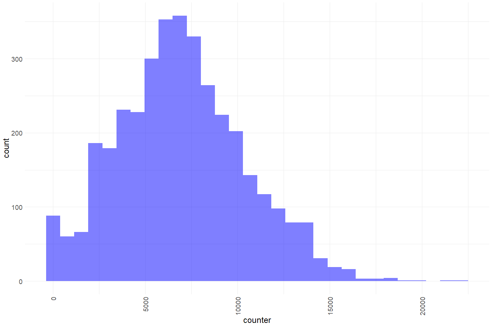<!-- -->

``` r
cleaner_rst_environmental %>% 
  ggplot() +
  geom_boxplot(aes(x = counter, y = as.factor(year(sample_date))), fill = "blue", alpha = .5) +
  theme_minimal() + 
  theme(text = element_text(size = 18),
        axis.text.x = element_text(angle = 90, vjust = 0.5, hjust=1)) +
  labs(y = "Year")
```

<!-- -->

**Numeric Summary of counter over Period of Record**

``` r
summary(cleaner_rst_environmental$counter)
```

    ##    Min. 1st Qu.  Median    Mean 3rd Qu.    Max.    NA's 
    ##       0    4548    6782    6998    9104   90717      81

**NA and Unknown Values**

-   2.2 % of values in the `counter` column are NA.

### Variables: `flow_start_meter`, `flow_end_meter`

The read out number on the mechanical counter of the flow meter at the
start and end of the velocity test

**Plotting distribution of flow start meter and flow end meter**

``` r
cleaner_rst_environmental %>% 
  ggplot() +
  geom_histogram(aes(x = flow_start_meter), fill = "blue", alpha = .5) +
  geom_histogram(aes(x = flow_end_meter), fill = "blue", alpha = .5) +
  theme_minimal() + 
  theme(text = element_text(size = 18),
        axis.text.x = element_text(angle = 90, vjust = 0.5, hjust=1)) 
```

    ## `stat_bin()` using `bins = 30`. Pick better value with `binwidth`.
    ## `stat_bin()` using `bins = 30`. Pick better value with `binwidth`.

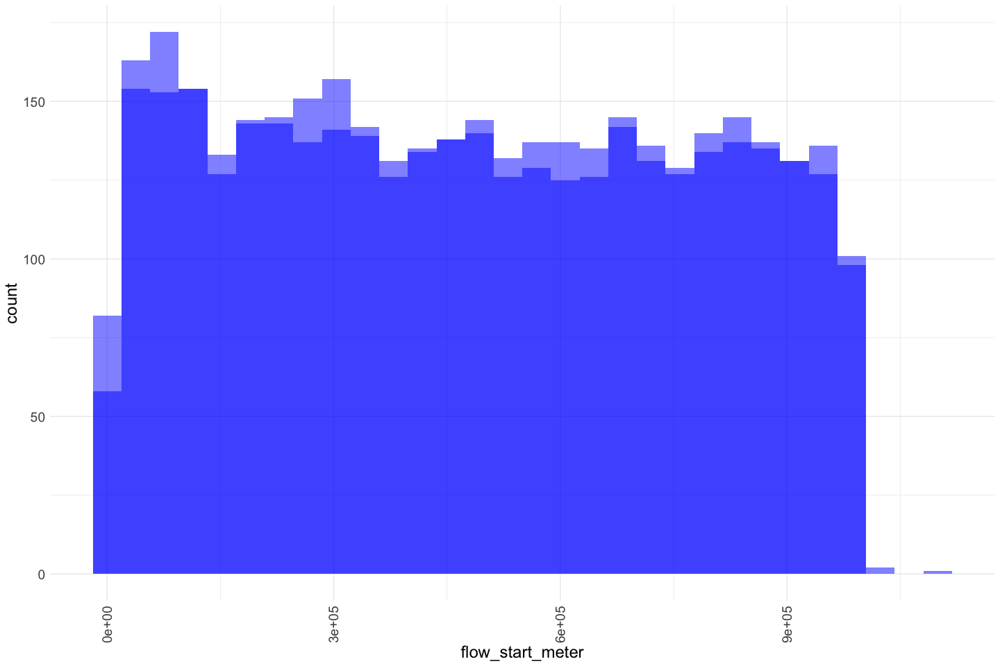<!-- -->

Start times and end times appear to have a similar distribution.

**Numeric Summary**

``` r
summary(cleaner_rst_environmental$flow_start_meter)
```

    ##    Min. 1st Qu.  Median    Mean 3rd Qu.    Max.    NA's 
    ##       0  231000  479000  484270  736200 1099600     106

``` r
summary(cleaner_rst_environmental$flow_end_meter)
```

    ##    Min. 1st Qu.  Median    Mean 3rd Qu.    Max.    NA's 
    ##      73  235448  483138  488418  739486 1016758     106

**NA and Unknown Values**

-   2.8 % of values in the `flow_start_meter` column are NA.
-   2.8 % of values in the `flow_end_meter` column are NA.

### Variable: `flow_set_time`

How long the General Oceanics mechanical flow meter (Oceanic ® Model
2030) was in the water taking a reading, used to calculate water
velocity in front of the cone

Time is in seconds

**Plotting distribution of flow set time**

``` r
cleaner_rst_environmental %>% 
  ggplot() +
  geom_histogram(aes(x = flow_set_time)) +
  theme_minimal() +
  theme(text = element_text(size = 18),
        axis.text.x = element_text(angle = 90, vjust = 0.5, hjust=1)) 
```

    ## `stat_bin()` using `bins = 30`. Pick better value with `binwidth`.

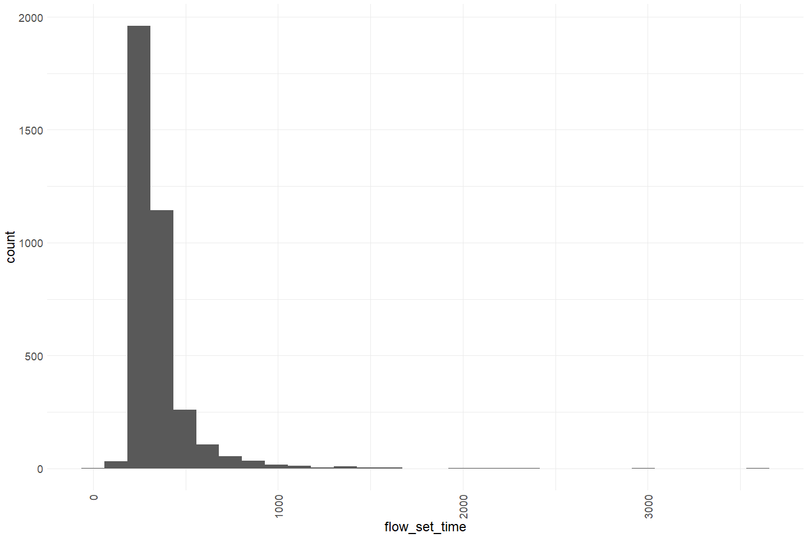<!-- -->

Flow set times appear mainly between 100 and 1000 with a few values up
to almost 4000.

**Numeric Summary of flow set time over Period of Record**

``` r
summary(cleaner_rst_environmental$flow_set_time)
```

    ##    Min. 1st Qu.  Median    Mean 3rd Qu.    Max.    NA's 
    ##     5.0   300.0   302.0   365.5   360.0  3600.0     108

**NA and Unknown Values**

-   2.2 % of values in the `counter` column are NA.

### Variable: `velocity`

Calculated water velocity in front of the cone using a General Oceanics
mechanical flow meter (Oceanic ® Model 2030) = ( (Flowmeter end - flow
meter begin)/time in seconds)\*.0875

**Plotting distribution of velocity**

``` r
cleaner_rst_environmental %>% 
  filter(velocity < 25) %>% # filter out values greater than 25
  ggplot() +
  geom_histogram(aes(x = velocity), fill = "blue", alpha = .5) +
  theme_minimal() + 
  theme(text = element_text(size = 18),
        axis.text.x = element_text(angle = 90, vjust = 0.5, hjust=1)) 
```

    ## `stat_bin()` using `bins = 30`. Pick better value with `binwidth`.

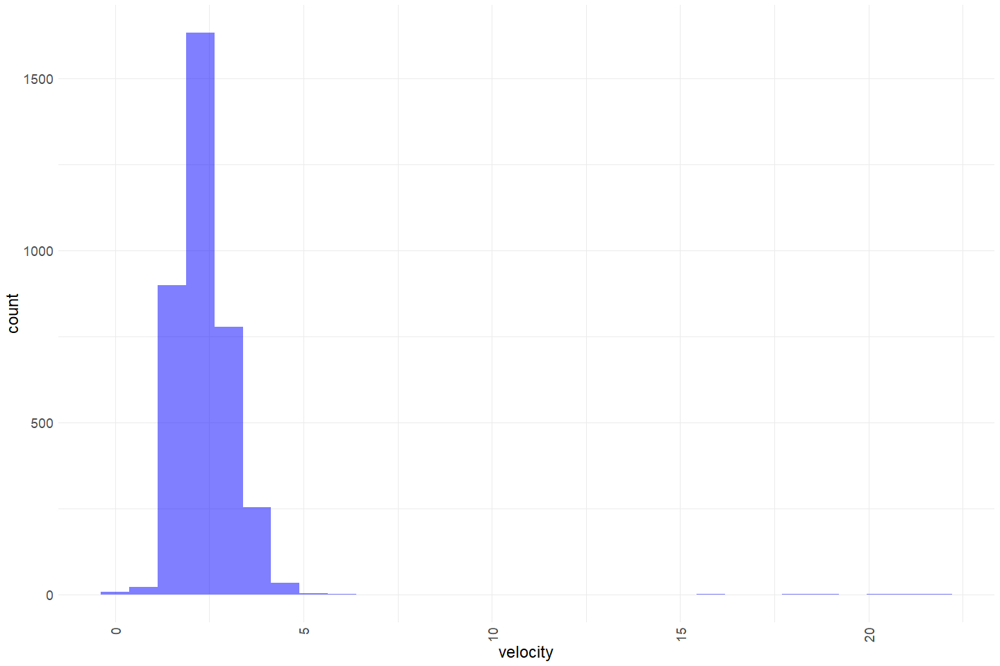<!-- -->

``` r
cleaner_rst_environmental %>%
  mutate(wy = factor(ifelse(month(sample_date) %in% 10:12, year(sample_date) + 1, year(sample_date))),
         fake_year = 2000,
         fake_year = ifelse(month(sample_date) %in% 10:12, fake_year - 1, fake_year),
         fake_date = ymd(paste(fake_year, month(sample_date), day(sample_date)))) %>%
  ggplot(aes(x = fake_date, y = velocity)) +
  scale_x_date(date_breaks = "3 month", date_labels = "%b") +
  geom_line(size = 0.5) +
  xlab("") +
  facet_wrap(~wy, scales = "free") + 
  theme_minimal()
```

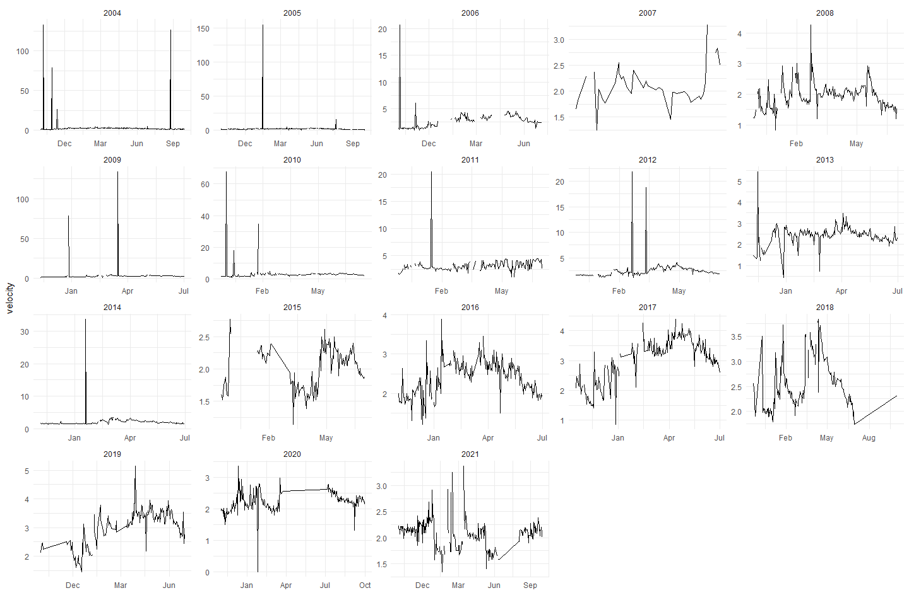<!-- -->

**Numeric Summary of velocity**

``` r
summary(cleaner_rst_environmental$velocity)
```

    ##    Min. 1st Qu.  Median    Mean 3rd Qu.    Max.    NA's 
    ##   0.000   1.870   2.270   2.601   2.740 155.090     107

A velocity of 155.090 seems out of the range of posibilities. It seems
like every velocity greater than 7 is probably a mistake that should be
scaled down or filtered out.

**NA and Unknown Values**

-   2.9 % of values in the `velocity` column are NA.

### Variable: `turbidity`

Turbidity result from a grab sample taken at the trap on the SampleDate
and SampleTime

**Plotting distribution of turbidity**

``` r
cleaner_rst_environmental %>% 
  filter(counter < 200) %>% # filter out values < 200
  ggplot() +
  geom_histogram(aes(x = turbidity), fill = "blue", alpha = .5) +
  theme_minimal() + 
  theme(text = element_text(size = 18),
        axis.text.x = element_text(angle = 90, vjust = 0.5, hjust=1)) 
```

    ## `stat_bin()` using `bins = 30`. Pick better value with `binwidth`.

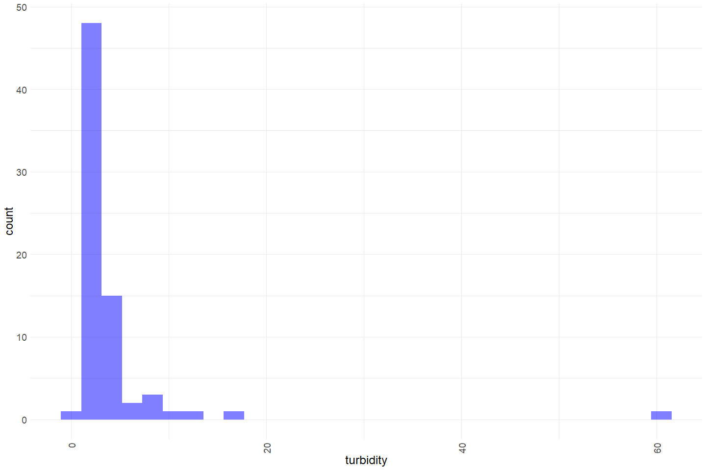<!-- -->

``` r
cleaner_rst_environmental %>% 
  group_by(date = as.Date(sample_date)) %>%
  mutate(avg_turbidity_ntu = mean(turbidity)) %>%
  filter(avg_turbidity_ntu < 100) %>%
  ungroup() %>%
  ggplot() + 
  geom_boxplot(aes(x = as.factor(month(date)), y = avg_turbidity_ntu)) + 
  # facet_wrap(~year(date), scales = "free") + 
  # scale_x_date(labels = date_format("%b"), date_breaks = "1 month") + 
  theme_minimal() + 
  theme(text = element_text(size = 15),
        axis.text.x = element_text(angle = 90, vjust = 0.5, hjust=1),
        legend.position = "none") + 
  labs(title = "Daily Turbidity Measures sumarized by month",
       x = "Month", 
       y = "Average Daily Turbidity NTUs")  
```

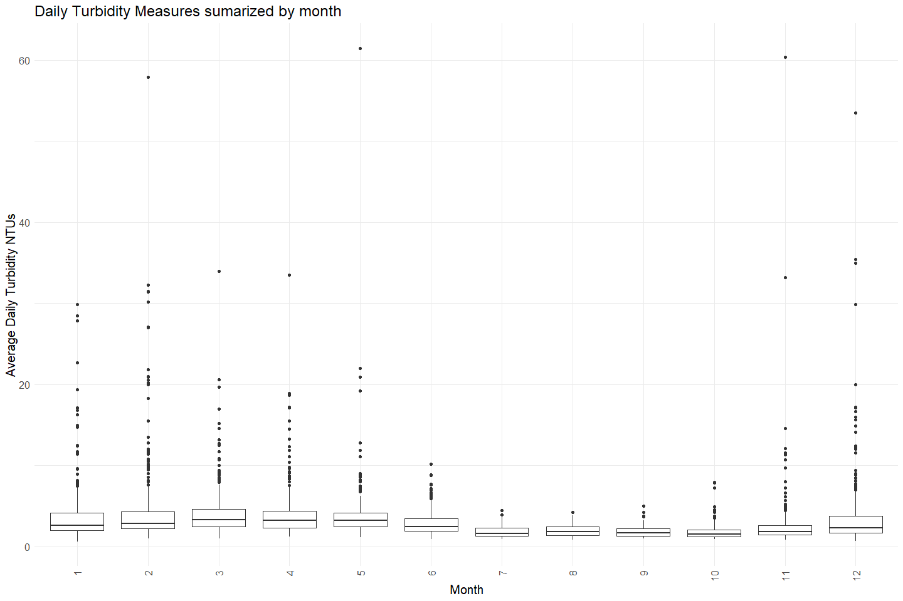<!-- -->

``` r
cleaner_rst_environmental %>%
  mutate(wy = factor(ifelse(month(sample_date) %in% 10:12, year(sample_date) + 1, year(sample_date))),
         fake_year = 2000,
         fake_year = ifelse(month(sample_date) %in% 10:12, fake_year - 1, fake_year),
         fake_date = ymd(paste(fake_year, month(sample_date), day(sample_date)))) %>%
  ggplot(aes(x = fake_date, y = turbidity)) +
  scale_x_date(date_breaks = "3 month", date_labels = "%b") +
  geom_line(size = 0.5) +
  xlab("") +
  facet_wrap(~wy, scales = "free") + theme_minimal()
```

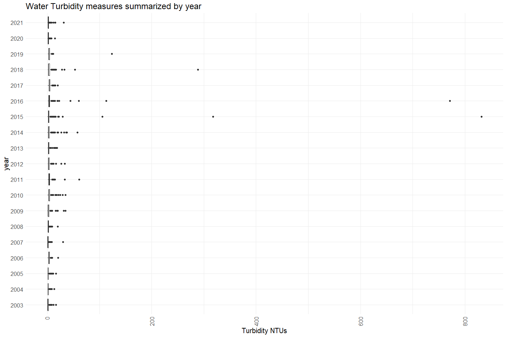<!-- -->

Most turbidity measures are low but a few outliers going up until 850

**Numeric Summary of turbidity over Period of Record**

``` r
summary(cleaner_rst_environmental$turbidity)
```

    ##    Min. 1st Qu.  Median    Mean 3rd Qu.    Max.    NA's 
    ##   0.630   1.895   2.600   4.157   3.900 832.000      96

**NA and Unknown Values**

-   2.6 % of values in the `turbidity` column are NA.

### Variables: `cone`

Definition `cone`: Was the trap fished at cone full-cone (1.0) or
half-cone (0.5) setting  
(same as `sample_weight` column removed above)

**Plotting distribution of cone**

``` r
cleaner_rst_environmental %>% 
  ggplot() +
  geom_histogram(aes(x = cone), fill = "blue", alpha = .5) +
  theme_minimal() + 
  theme(text = element_text(size = 18),
        axis.text.x = element_text(angle = 90, vjust = 0.5, hjust=1)) 
```

    ## `stat_bin()` using `bins = 30`. Pick better value with `binwidth`.

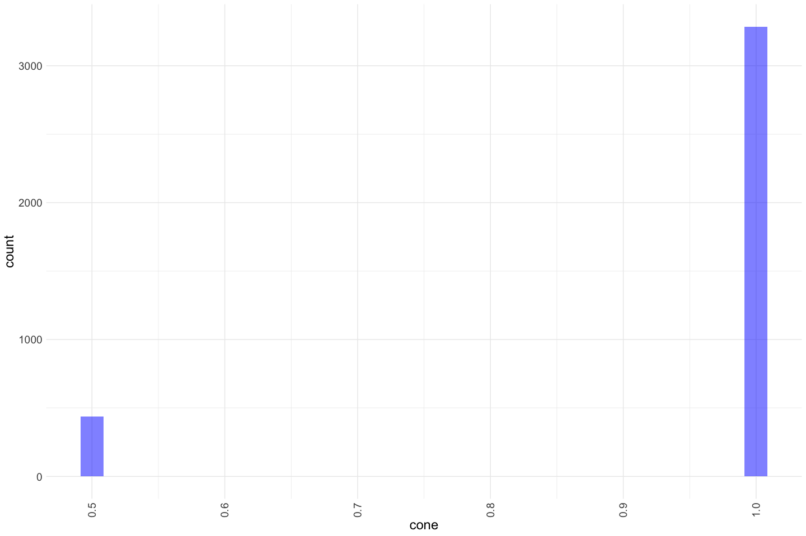<!-- -->

All sample weights and cone measures are either .5 o 1.

**Numeric Summary of cone over Period of Record**

``` r
summary(cleaner_rst_environmental$cone)
```

    ##    Min. 1st Qu.  Median    Mean 3rd Qu.    Max.    NA's 
    ##  0.5000  1.0000  1.0000  0.9412  1.0000  1.0000      27

**NA and Unknown Values**

-   0.7 % of values in the `cone` column are NA.

### Variable: `river_left_depth`, `river_right_depth`, `river_center_depth`

Unit for depth is feet, definitions of measurements are:

-   River depth from directly in the center of cone off crossbeam \#2
    (cone crossbeam)  
-   River depth from inside of the river left (facing down stream)
    pontoon off crossbeam \#2 (cone crossbeam)  
-   River depth from inside of the river right (facing down stream)
    pontoon off crossbeam \#2 (cone crossbeam)

**Plotting distribution of depth measures**

``` r
depth_1 <- cleaner_rst_environmental %>% 
  # filter(counter < 200) %>% # filter out values < 200
  ggplot() +
  geom_histogram(aes(x = river_left_depth), fill = "blue", alpha = .5) +
  geom_histogram(aes(x = river_center_depth), fill = "gray", alpha = .75) +
  geom_histogram(aes(x = river_right_depth), fill = "green", alpha = .5) +
  theme_minimal() + 
  theme(text = element_text(size = 18),
        axis.text.x = element_text(angle = 90, vjust = 0.5, hjust=1)) +
  labs(x = "River Depth: left (blue), right (green), and center (gray)")

depth_2 <- cleaner_rst_environmental %>% 
  filter(river_right_depth > 1) %>% # filter out values < 200
  ggplot() +
  geom_histogram(aes(x = river_left_depth), fill = "blue", alpha = .5) +
  geom_histogram(aes(x = river_center_depth), fill = "gray", alpha = .75) +
  geom_histogram(aes(x = river_right_depth), fill = "green", alpha = .5) +
  theme_minimal() + 
  theme(text = element_text(size = 18),
        axis.text.x = element_text(angle = 90, vjust = 0.5, hjust=1)) +
  labs(x = "River Depth: left (blue), right (green), and center (gray)",
       title = "Filtered Depth Distribution")
gridExtra::grid.arrange(depth_1, depth_2)
```

    ## `stat_bin()` using `bins = 30`. Pick better value with `binwidth`.
    ## `stat_bin()` using `bins = 30`. Pick better value with `binwidth`.
    ## `stat_bin()` using `bins = 30`. Pick better value with `binwidth`.
    ## `stat_bin()` using `bins = 30`. Pick better value with `binwidth`.
    ## `stat_bin()` using `bins = 30`. Pick better value with `binwidth`.
    ## `stat_bin()` using `bins = 30`. Pick better value with `binwidth`.

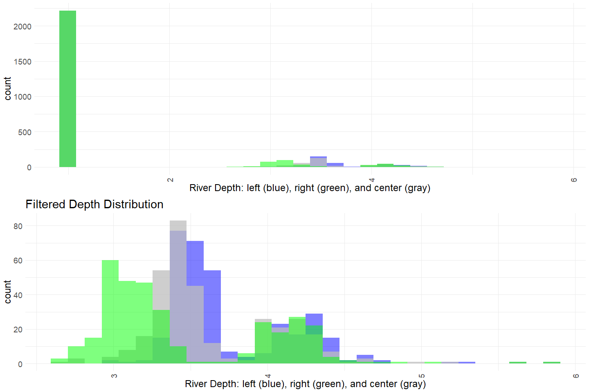<!-- -->

**Numeric Summary of river depth over Period of Record**

``` r
summary(cleaner_rst_environmental$river_left_depth)
```

    ##    Min. 1st Qu.  Median    Mean 3rd Qu.    Max.    NA's 
    ##    1.00    1.00    1.00    1.36    1.00    5.80    1200

``` r
summary(cleaner_rst_environmental$river_center_depth)
```

    ##    Min. 1st Qu.  Median    Mean 3rd Qu.    Max.    NA's 
    ##   1.000   1.000   1.000   1.348   1.000   5.800    1201

``` r
summary(cleaner_rst_environmental$river_right_depth)
```

    ##    Min. 1st Qu.  Median    Mean 3rd Qu.    Max.    NA's 
    ##   1.000   1.000   1.000   1.325   1.000   5.800    1201

**NA and Unknown Values**

-   32 % of values in the `river_left_depth` column are NA.
-   32 % of values in the `river_center_depth` column are NA.
-   32 % of values in the `river_right_depth` column are NA.

### Variable: `depth_adjust`

The depth of the bottom of the cone (measured in Inches) Depth in
relation to the cone (not to the surface of the water) - not sure how it
is used.

**Plotting distribution of depth adjustment**

``` r
cleaner_rst_environmental %>% 
  # filter(counter < 25000) %>% # filter out 5 values > 25000
  ggplot() +
  geom_histogram(aes(x = depth_adjust), fill = "blue", alpha = .5, binwidth = 1) +
  theme_minimal() + 
  theme(text = element_text(size = 18),
        axis.text.x = element_text(angle = 90, vjust = 0.5, hjust=1)) 
```

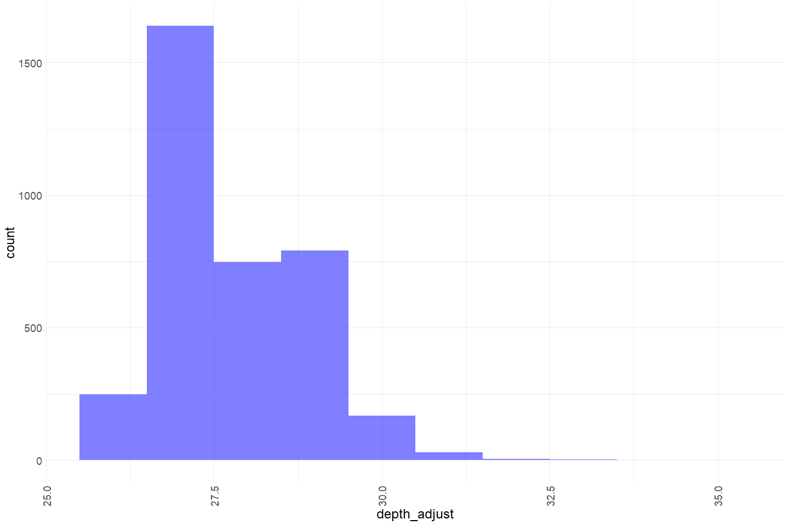<!-- -->

``` r
cleaner_rst_environmental %>% 
  ggplot() +
  geom_boxplot(aes(x = depth_adjust, y = as.factor(year(sample_date))), fill = "blue", alpha = .5) +
  theme_minimal() + 
  theme(text = element_text(size = 18),
        axis.text.x = element_text(angle = 90, vjust = 0.5, hjust=1)) +
  labs(y = "Year")
```

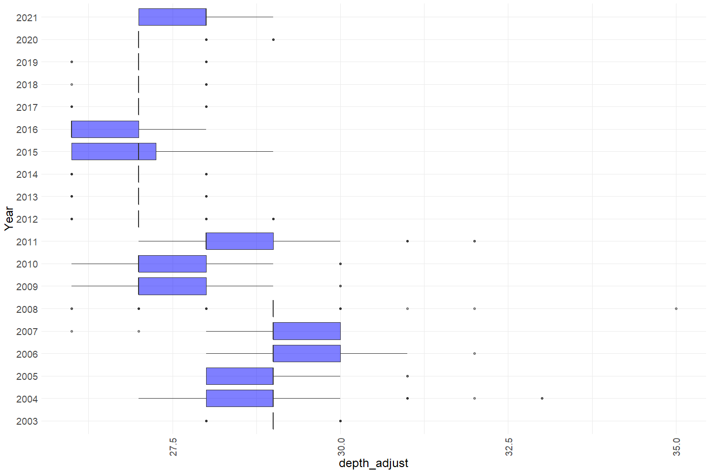<!-- -->
Looks like depth adjust varies by year depending on how the trap was
positioned.

**Numeric Summary of depth adjustment over Period of Record**

``` r
summary(cleaner_rst_environmental$depth_adjust)
```

    ##    Min. 1st Qu.  Median    Mean 3rd Qu.    Max.    NA's 
    ##   26.00   27.00   27.00   27.76   29.00   35.00     119

**NA and Unknown Values**

-   3.2 % of values in the `depth_adjust` column are NA.

### Variable: `debris_tubs`

The number of 10-g tubs of debris removed from the trap during the
sample period (volumetrically)  
**Plotting distribution of debris\_tubs**

``` r
cleaner_rst_environmental %>% 
  # filter(counter < 25000) %>% # filter out 5 values > 25000
  ggplot() +
  geom_histogram(aes(x = debris_tubs), fill = "blue", alpha = .5) +
  theme_minimal() + 
  theme(text = element_text(size = 18),
        axis.text.x = element_text(angle = 90, vjust = 0.5, hjust=1)) 
```

    ## `stat_bin()` using `bins = 30`. Pick better value with `binwidth`.

<!-- -->

``` r
cleaner_rst_environmental %>% 
  ggplot() +
  geom_boxplot(aes(x = debris_tubs, y = as.factor(month(sample_date))), fill = "blue", alpha = .5) +
  theme_minimal() + 
  theme(text = element_text(size = 18),
        axis.text.x = element_text(angle = 90, vjust = 0.5, hjust=1)) +
  labs(y = "Year")
```

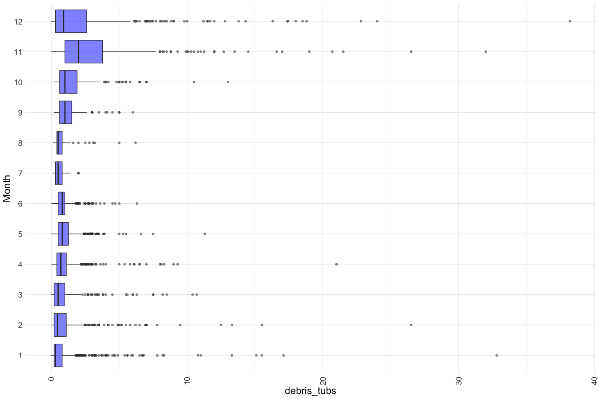<!-- -->

Debris looks relatively evenly distributed throughout the months.

**Numeric Summary of debris over Period of Record**

``` r
summary(cleaner_rst_environmental$debris_tubs)
```

    ##    Min. 1st Qu.  Median    Mean 3rd Qu.    Max.    NA's 
    ##   0.000   0.300   0.700   1.378   1.400  38.200      43

**NA and Unknown Values**

-   1.1 % of values in the `debris_tubs` column are NA.

### Variable: `avg_time_per_rev`

The average time per cone rotation (average of three rotations) - units
are seconds

**Plotting distribution of average time per revolution**

``` r
cleaner_rst_environmental %>% 
  # filter(counter < 25000) %>% # filter out 5 values > 25000
  ggplot() +
  geom_histogram(aes(x = avg_time_per_rev), fill = "blue", alpha = .5) +
  theme_minimal() + 
  theme(text = element_text(size = 18),
        axis.text.x = element_text(angle = 90, vjust = 0.5, hjust=1)) 
```

    ## `stat_bin()` using `bins = 30`. Pick better value with `binwidth`.

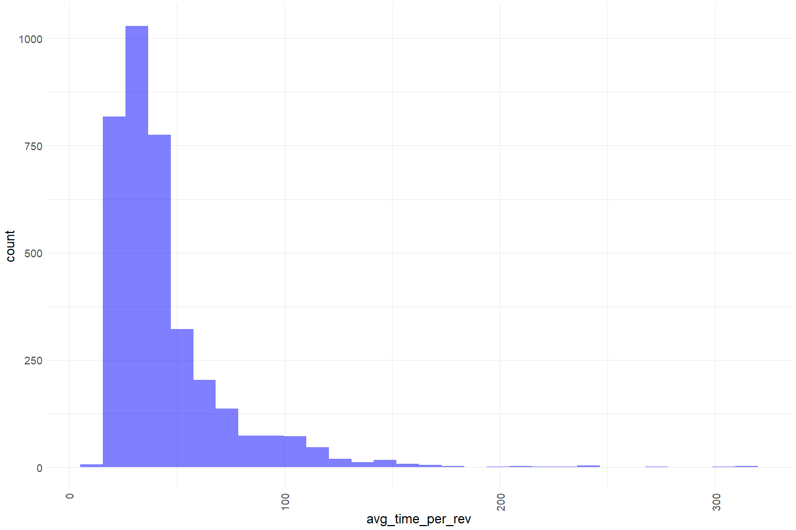<!-- -->

``` r
cleaner_rst_environmental %>% 
  ggplot() +
  geom_boxplot(aes(x = avg_time_per_rev, y = as.factor(year(sample_date))), fill = "blue", alpha = .5) +
  theme_minimal() + 
  theme(text = element_text(size = 18),
        axis.text.x = element_text(angle = 90, vjust = 0.5, hjust=1)) +
  labs(y = "Year")
```

<!-- -->

**Numeric Summary of average time per rev over Period of Record**

``` r
summary(cleaner_rst_environmental$avg_time_per_rev)
```

    ##    Min. 1st Qu.  Median    Mean 3rd Qu.    Max.    NA's 
    ##   14.00   27.00   36.00   44.08   50.00  318.00     120

**NA and Unknown Values**

-   3.2 % of values in the `avg_time_per_rev` column are NA.

### Variable: `baileys_eff`

Trap Efficiency = (Recaptured+1)/(Released+1); used to calculate daily
passage

**Plotting distribution of counter**

``` r
cleaner_rst_environmental %>% 
  # filter(counter < 25000) %>% # filter out 5 values > 25000
  ggplot() +
  geom_histogram(aes(x = baileys_eff), fill = "blue", alpha = .5) +
  theme_minimal() + 
  theme(text = element_text(size = 18),
        axis.text.x = element_text(angle = 90, vjust = 0.5, hjust=1)) 
```

    ## `stat_bin()` using `bins = 30`. Pick better value with `binwidth`.

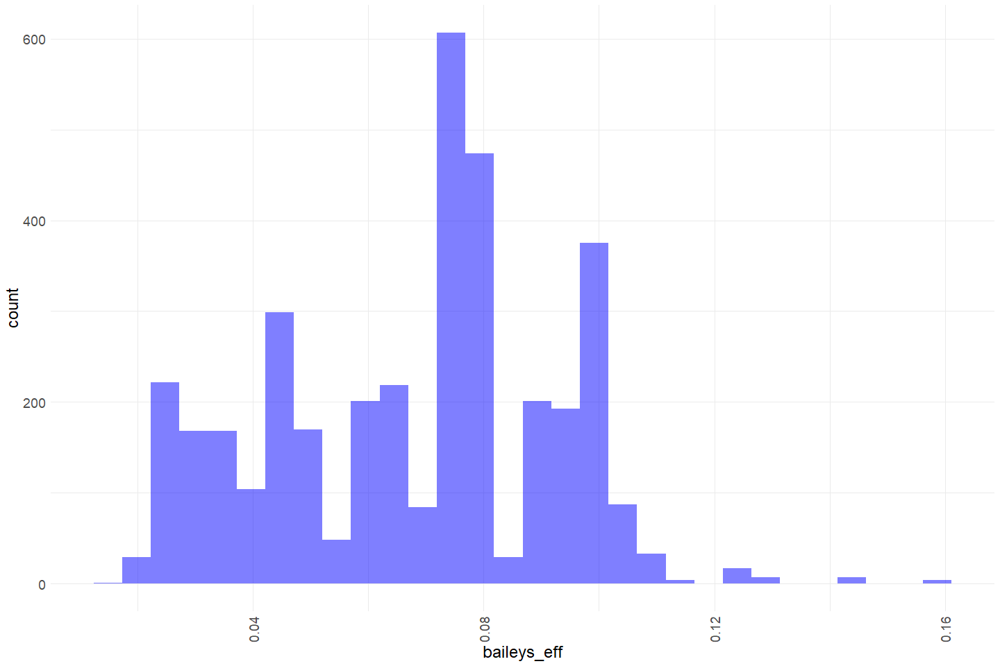<!-- -->

``` r
cleaner_rst_environmental %>% 
  ggplot() +
  geom_boxplot(aes(x = baileys_eff, y = as.factor(year(sample_date))), fill = "blue", alpha = .5) +
  theme_minimal() + 
  theme(text = element_text(size = 18),
        axis.text.x = element_text(angle = 90, vjust = 0.5, hjust=1)) +
  labs(y = "Year")
```

<!-- -->

**Numeric Summary of baileys efficency over Period of Record**

``` r
summary(cleaner_rst_environmental$baileys_eff)
```

    ##    Min. 1st Qu.  Median    Mean 3rd Qu.    Max. 
    ## 0.01490 0.04670 0.07580 0.06818 0.08470 0.15870

**NA and Unknown Values**

-   0 % of values in the `baileys_eff` column are NA.

### Variable: `num_released`

Number fish released

**Plotting distribution of number released**

``` r
cleaner_rst_environmental %>% 
  # filter(counter < 25000) %>% # filter out 5 values > 25000
  ggplot() +
  geom_histogram(aes(x = num_released), fill = "blue", alpha = .5) +
  theme_minimal() + 
  theme(text = element_text(size = 18),
        axis.text.x = element_text(angle = 90, vjust = 0.5, hjust=1)) 
```

    ## `stat_bin()` using `bins = 30`. Pick better value with `binwidth`.

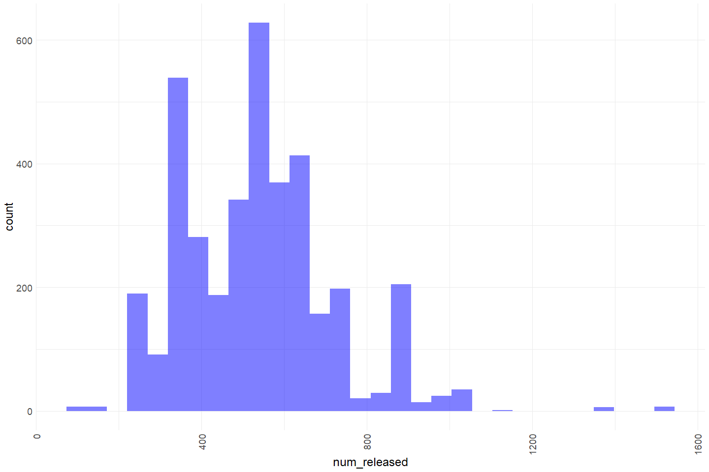<!-- -->

``` r
cleaner_rst_environmental %>% 
  ggplot() +
  geom_boxplot(aes(x = num_released, y = as.factor(year(sample_date))), fill = "blue", alpha = .5) +
  theme_minimal() + 
  theme(text = element_text(size = 18),
        axis.text.x = element_text(angle = 90, vjust = 0.5, hjust=1)) +
  labs(y = "Year")
```

<!-- -->

**Numeric Summary of counter over Period of Record**

``` r
summary(cleaner_rst_environmental$num_released)
```

    ##    Min. 1st Qu.  Median    Mean 3rd Qu.    Max. 
    ##    89.0   395.0   551.0   536.4   621.0  1511.0

**NA and Unknown Values**

-   0 % of values in the `num_released` column are NA.

### Variable: `start_counter`

Beginning cone revolution counter number, usually zero.

All values either 0 or NA.

**Numeric Summary of counter over Period of Record**

``` r
summary(cleaner_rst_environmental$start_counter)
```

    ##    Min. 1st Qu.  Median    Mean 3rd Qu.    Max.    NA's 
    ##       0       0       0       0       0       0    3387

**NA and Unknown Values**

-   90.3 % of values in the `start_counter` column are NA.

### Variable: `report_baileys_eff`

The Bailey’s efficiency used in old reports. Bailey’s efficiency has
been standardized to only four significant digits.

**Plotting distribution of counter**

``` r
cleaner_rst_environmental %>% 
  ggplot() +
  geom_histogram(aes(x = report_baileys_eff), fill = "blue", alpha = .5, binwidth = .01) +
  theme_minimal() + 
  theme(text = element_text(size = 18),
        axis.text.x = element_text(angle = 90, vjust = 0.5, hjust=1)) 
```

<!-- -->

**Numeric Summary of baileys efficency measures for reports over Period
of Record**

``` r
summary(cleaner_rst_environmental$report_baileys_eff)
```

    ##    Min. 1st Qu.  Median    Mean 3rd Qu.    Max.    NA's 
    ##   0.037   0.077   0.077   0.083   0.103   0.144    3387

**NA and Unknown Values**

-   90.3 % of values in the `report_baileys_eff` column are NA.

## Explore Categorical variables:

``` r
cleaner_rst_environmental %>% select_if(is.character) %>% colnames
```

    ##  [1] "sample_id"           "weather_code"        "lunar_phase"        
    ##  [4] "trap_sample_type"    "habitat"             "thalweg"            
    ##  [7] "diel"                "debris_type"         "fish_properly"      
    ## [10] "sub_week"            "trap_comments"       "gear_condition_code"
    ## [13] "trap_fishing"        "partial_sample"

### Variable: `sample_id`

The calendar year Julian date and year code for that \~24-h sample
period (ddd\_yy)

``` r
nrow(cleaner_rst_environmental) == length(unique(cleaner_rst_environmental$sample_id))
```

    ## [1] FALSE

There are 3742 unique sample IDs.

**NA and Unknown Values**

-   0 % of values in the `sample_id` column are NA.

### Variable: `weather_code`

A code for the weather conditions on the SampleDate and SampleTime. See
VariableCodesLookUp table

| code | description   |
|------|---------------|
| CLR  | sunny         |
| RAN  | precipitation |
| FOG  | foggy         |
| CLD  | overcast      |

``` r
table(cleaner_rst_environmental$weather_code) 
```

    ## 
    ##     cld     CLD  CLOUDY     CLR     FOG    PCLD     RAN WIN/CLR   WINDY 
    ##       2     685       1    2381      35     280     293       2      41

Fix inconsistencies with spelling, capitalization, and abbreviations.

``` r
cleaner_rst_environmental$weather_code <- case_when(
  cleaner_rst_environmental$weather_code %in% c("CLD", "cld", "CLOUDY") ~ "cloudy", 
  cleaner_rst_environmental$weather_code == "CLR" ~ "clear",
  cleaner_rst_environmental$weather_code == "FOG" ~ "fog", 
  cleaner_rst_environmental$weather_code == "PCLD" ~ "partially cloudy", 
  cleaner_rst_environmental$weather_code == "RAN" ~ "precipitation",
  cleaner_rst_environmental$weather_code == "WIN/CLR" ~ "windy and clear",
  cleaner_rst_environmental$weather_code == "WINDY" ~ "windy"
)

table(cleaner_rst_environmental$weather_code) 
```

    ## 
    ##            clear           cloudy              fog partially cloudy 
    ##             2381              688               35              280 
    ##    precipitation            windy  windy and clear 
    ##              293               41                2

**NA and Unknown Values**

-   0.8 % of values in the `weather_code` column are NA.

### Variable: `lunar_phase`

Stage of the Moon on the SampleDate and SampleTime, from:
<http://aa.usno.navy.mil/data/docs/MoonFraction.php>. See
VariableCodesLookUp table

``` r
table(cleaner_rst_environmental$lunar_phase) 
```

    ## 
    ##    F    H    N 
    ##  892 1897  929

Fix inconsistencies with spelling, capitalization, and abbreviations.

``` r
cleaner_rst_environmental$lunar_phase <- case_when(
  cleaner_rst_environmental$lunar_phase == "F" ~ "full", 
  cleaner_rst_environmental$lunar_phase == "H" ~ "half", 
  cleaner_rst_environmental$lunar_phase == "N" ~ "new"
)

table(cleaner_rst_environmental$lunar_phase) 
```

    ## 
    ## full half  new 
    ##  892 1897  929

**NA and Unknown Values**

-   0.9 % of values in the `lunar_phase` column are NA.

### Variable: `trap_sample_type`

The type of sample regime, see VariableCodesLookUp table

| code | definition     |
|------|----------------|
| N    | non-intensive  |
| I    | intensive      |
| S    | sunrise-sunset |
| R    | random         |

``` r
table(cleaner_rst_environmental$trap_sample_type) 
```

    ## 
    ##    N    R 
    ## 3666   57

Fix inconsistencies with spelling, capitalization, and abbreviations.

``` r
cleaner_rst_environmental$trap_sample_type <- case_when(
  cleaner_rst_environmental$trap_sample_type == "N" ~ "non-intensive",
  cleaner_rst_environmental$trap_sample_type == "R" ~ "random"
)

table(cleaner_rst_environmental$trap_sample_type) 
```

    ## 
    ## non-intensive        random 
    ##          3666            57

**NA and Unknown Values**

-   0.7 % of values in the `trap_sample_type` column are NA.

### Variable: `habitat`

The type of flow habitat the trap fished in, see VariableCodesLookUp
table

| code | definition     |
|------|----------------|
| P    | plunge pool    |
| R    | run            |
| G    | glide          |
| B    | backwater pool |
| L    | lateral flood  |

``` r
table(cleaner_rst_environmental$habitat) 
```

    ## 
    ##    B    R 
    ##    1 3723

Fix inconsistencies with spelling, capitalization, and abbreviations.

``` r
cleaner_rst_environmental$habitat <- case_when(
  cleaner_rst_environmental$habitat == "B" ~ "backwater pool",
  cleaner_rst_environmental$habitat == "R" ~ "run"
)

table(cleaner_rst_environmental$habitat) 
```

    ## 
    ## backwater pool            run 
    ##              1           3723

**NA and Unknown Values**

-   0.7 % of values in the `habitat` column are NA.

### Variable: `thalweg`

Was trap fishing in the thalweg at SampleDate and SampleTime

``` r
table(cleaner_rst_environmental$thalweg) 
```

    ## 
    ##    N    Y 
    ##   21 3698

Fix inconsistencies with spelling, capitalization, and abbreviations.

``` r
cleaner_rst_environmental$thalweg <- case_when(
  cleaner_rst_environmental$thalweg == "Y" ~ TRUE, 
  cleaner_rst_environmental$thalweg == "N" ~ FALSE
)

table(cleaner_rst_environmental$thalweg) 
```

    ## 
    ## FALSE  TRUE 
    ##    21  3698

**NA and Unknown Values**

-   0.9 % of values in the `thalweg` column are NA.

### Variable: `diel`

The time of day relative to the sun, see VariableCodesLookUp table

| code | definition   |
|------|--------------|
| C1   | pre-sunrise  |
| C2   | post-sunrise |
| C3   | pre-sunset   |
| C4   | post-sunset  |
| D    | day          |
| N    | night        |

``` r
table(cleaner_rst_environmental$diel) 
```

    ## 
    ##   C1    D    N 
    ##    4 2578   16

Fix inconsistencies with spelling, capitalization, and abbreviations.

``` r
cleaner_rst_environmental$diel <- case_when(cleaner_rst_environmental$diel == "D" ~ "day", 
                                            cleaner_rst_environmental$diel == "N" ~ "night", 
                                            cleaner_rst_environmental$diel == "C1" ~ "pre-sunrise")
table(cleaner_rst_environmental$diel) 
```

    ## 
    ##         day       night pre-sunrise 
    ##        2578          16           4

**NA and Unknown Values**

-   30.7 % of values in the `diel` column are NA.

### Variable: `debris_type`

The type of debris found in the live-box, see VariableCodesLookUp table

| code | definition          |
|------|---------------------|
| a    | aquatic vegetation  |
| l    | large woody debris  |
| s    | sticks              |
| al   | veg + wood          |
| as   | veg + sticks        |
| ls   | wood + sticks       |
| als  | veg + wood + sticks |

``` r
table(cleaner_rst_environmental$debris_type) 
```

    ## 
    ##    a    A   AL  als  ALS   as   AS    L   ls   LS 
    ##   40  303   20  115 3070  133    3    5    3   26

Fix inconsistencies with spelling, capitalization, and abbreviations.

``` r
cleaner_rst_environmental$debris_type <- tolower(cleaner_rst_environmental$debris_type)
table(cleaner_rst_environmental$debris_type) 
```

    ## 
    ##    a   al  als   as    l   ls 
    ##  343   20 3185  136    5   29

**Create lookup rda for gear debris encoding:**

``` r
# View description of domain for viewing condition 
battle_rst_debris_type <- c('a','l','s','al','as','ls','als')
names(battle_rst_debris_type) <- c(
  "aquatic vegetation",
  "large woody debris",
  "sticks",
  "veg + wood",
  "veg + sticks",
  "wood + sticks",
  "veg + wood + sticks")
# write_rds(battle_rst_debris_type, "../../../data/battle_rst_debris_type.rds")
tibble(code = battle_rst_debris_type, 
       definitions = names(battle_rst_debris_type))
```

    ## # A tibble: 7 x 2
    ##   code  definitions        
    ##   <chr> <chr>              
    ## 1 a     aquatic vegetation 
    ## 2 l     large woody debris 
    ## 3 s     sticks             
    ## 4 al    veg + wood         
    ## 5 as    veg + sticks       
    ## 6 ls    wood + sticks      
    ## 7 als   veg + wood + sticks

**NA and Unknown Values**

-   0.9 % of values in the `debris_type` column are NA.

### Variable: `fish_properly`

Was there a problem with the trap at SampleDate and SampleTime

``` r
table(cleaner_rst_environmental$fish_properly) 
```

    ## 
    ##    N    Y 
    ##  109 3276

Fix inconsistencies with spelling, capitalization, and abbreviations.

``` r
cleaner_rst_environmental$fish_properly <- case_when(
  cleaner_rst_environmental$fish_properly == "Y" ~ TRUE, 
  cleaner_rst_environmental$fish_properly == "N" ~ FALSE
)

table(cleaner_rst_environmental$fish_properly) 
```

    ## 
    ## FALSE  TRUE 
    ##   109  3276

**NA and Unknown Values**

-   9.8 % of values in the `fish_properly` column are NA.

### Variable: `sub_week`

If sample week has more than one efficiency, which part of week is
sample from  
TODO figure out what each one stands for

``` r
table(cleaner_rst_environmental$sub_week) 
```

    ## 
    ##    A    B    C 
    ## 3477  267    7

**NA and Unknown Values**

-   0 % of values in the `sub_week` column are NA.

### Variable: `trap_comments`

``` r
unique(cleaner_rst_environmental$trap_comments)[1:5]
```

    ## [1] NA                                                                                                           
    ## [2] "Flow end meter data incorrect, so is velocity"                                                              
    ## [3] "Sticks jammed against the side of the cone prevented rotation Flow end meter data incorrect, so is velocity"
    ## [4] "Flapper not hitting counter"                                                                                
    ## [5] "Flapper not hitting counter (fixed 11-2-03)"

**NA and Unknown Values**

-   76.5 % of values in the `trap_comments` column are NA.

### Variable: `gear_condition_code`

A code for the condition of the trap on the SampleDate and SampleTime;
see VariableCodesLookUp table

| code | definition    |
|------|---------------|
| n    | normal        |
| pb   | partial block |
| tb   | total block   |
| nr   | not rotating  |

``` r
table(cleaner_rst_environmental$gear_condition_code) 
```

    ## 
    ##  BP   N  NR  TB 
    ##   1 332   4   1

Fix inconsistencies with spelling, capitalization, and abbreviations.

``` r
cleaner_rst_environmental$gear_condition_code <- case_when(
  cleaner_rst_environmental$gear_condition_code == "BP" ~ "partial block",
  cleaner_rst_environmental$gear_condition_code == "N" ~ "normal", 
  cleaner_rst_environmental$gear_condition_code == "NR" ~ "not rotating",
  cleaner_rst_environmental$gear_condition_code == "TB" ~ "total block"
)
```

**NA and Unknown Values**

-   91 % of values in the `gear_condition_code` column are NA.

### Variable: `trap_fishing`

``` r
table(cleaner_rst_environmental$trap_fishing) 
```

    ## 
    ##  No Yes 
    ##  27 337

Fix inconsistencies with spelling, capitalization, and abbreviations.

``` r
cleaner_rst_environmental$trap_fishing <- case_when(
  cleaner_rst_environmental$trap_fishing == "Yes" ~ TRUE, 
  cleaner_rst_environmental$trap_fishing == "No" ~ FALSE
)

table(cleaner_rst_environmental$trap_fishing) 
```

    ## 
    ## FALSE  TRUE 
    ##    27   337

**NA and Unknown Values**

-   90.3 % of values in the `trap_fishing` column are NA.

### Variable: `partial_sample`

``` r
table(cleaner_rst_environmental$partial_sample) 
```

    ## 
    ##  No Yes 
    ## 354  10

Fix inconsistencies with spelling, capitalization, and abbreviations.

``` r
cleaner_rst_environmental$partial_sample <- case_when(
  cleaner_rst_environmental$partial_sample == "Yes" ~ TRUE, 
  cleaner_rst_environmental$partial_sample == "No" ~ FALSE
)

table(cleaner_rst_environmental$partial_sample) 
```

    ## 
    ## FALSE  TRUE 
    ##   354    10

**NA and Unknown Values**

-   90.3 % of values in the `partial_sample` column are NA.

## Summary of identified issues

-   Need to figure out what sub\_week column values stand for. Answer
    from Mike: The sub weeks do not describe specific days of the week,
    they indicate when a stratum (usually one week) is split into
    substrata based upon the trap efficiency used for the strata or
    substrata. If a stratum is not split all days in the stratum will be
    an A. If it is split the days in the first substratum are A’s, the
    second are B’s, etc.  
-   Outliers in some of the numeric variables:
    -   Velocity (seems like anything greater than 7 needs to be
        addressed)
    -   Turbidity (everything greater than 100 needs to be addressed)
    -   Counter (one value way larger than the others)
-   There are a few variables that I am unsure of how they would be used
    (ex `depth_adjust`). Asking Mike and these may not be relevant to us
    and can be filtered out.

## Save cleaned data back to google cloud

``` r
battle_rst_environmental <- cleaner_rst_environmental %>% glimpse()
```

    ## Rows: 3,751
    ## Columns: 35
    ## $ sample_id           <chr> "274_03", "275_03", "276_03", "277_03", "278_03", ~
    ## $ trap_start_date     <date> 2003-09-30, 2003-10-01, 2003-10-02, 2003-10-03, 2~
    ## $ trap_start_time     <time> 14:35:00, 14:22:00, 13:20:00, 08:25:00, 11:57:00,~
    ## $ sample_date         <date> 2003-10-01, 2003-10-02, 2003-10-03, 2003-10-04, 2~
    ## $ sample_time         <time> 14:22:00, 13:20:00, 08:25:00, 11:57:00, 11:07:00,~
    ## $ counter             <dbl> 2417, 2260, 1954, 2943, 2649, 3087, 2208, 6750, 19~
    ## $ flow_start_meter    <dbl> 939000, 13400, 23000, 91800, 118400, 187000, 26200~
    ## $ flow_end_meter      <dbl> 953398, 23664, 31605, 97155, 123798, 200379, 27058~
    ## $ flow_set_time       <dbl> 900, 627, 556, 330, 323, 840, 503, 510, 780, 1320,~
    ## $ velocity            <dbl> 1.40, 1.43, 1.35, 1.42, 1.46, 1.39, 133.09, 1.29, ~
    ## $ turbidity           <dbl> 1.7, 1.2, 1.3, 1.1, 1.8, 1.7, 1.5, 1.4, 1.7, 1.4, ~
    ## $ cone                <dbl> 1, 1, 1, 1, 1, 1, 1, 1, 1, 1, 1, 1, 1, 1, 1, 1, 1,~
    ## $ weather_code        <chr> "clear", "clear", "clear", "clear", "clear", "clea~
    ## $ lunar_phase         <chr> "half", "half", "half", "half", "half", "half", "f~
    ## $ river_left_depth    <dbl> NA, NA, NA, NA, NA, NA, NA, NA, NA, NA, NA, NA, NA~
    ## $ river_center_depth  <dbl> NA, NA, NA, NA, NA, NA, NA, NA, NA, NA, NA, NA, NA~
    ## $ river_right_depth   <dbl> NA, NA, NA, NA, NA, NA, NA, NA, NA, NA, NA, NA, NA~
    ## $ trap_sample_type    <chr> "non-intensive", "non-intensive", "non-intensive",~
    ## $ habitat             <chr> "run", "run", "run", "run", "run", "run", "run", "~
    ## $ thalweg             <lgl> TRUE, TRUE, TRUE, TRUE, TRUE, TRUE, TRUE, TRUE, TR~
    ## $ diel                <chr> NA, NA, NA, NA, NA, NA, NA, NA, NA, NA, NA, NA, NA~
    ## $ depth_adjust        <dbl> 29, 29, 29, 29, 28, 29, 29, 29, 28, 29, 28, 28, 28~
    ## $ debris_type         <chr> "als", "als", "als", "als", "als", "als", "als", "~
    ## $ debris_tubs         <dbl> 0.7, 0.4, 1.3, 0.8, 0.5, 0.5, 0.7, 1.0, 1.5, 4.2, ~
    ## $ avg_time_per_rev    <dbl> 160, 164, 127, 89, 80, 90, 90, 115, 115, 126, 111,~
    ## $ fish_properly       <lgl> TRUE, TRUE, TRUE, TRUE, TRUE, TRUE, TRUE, TRUE, TR~
    ## $ sub_week            <chr> "A", "A", "A", "A", "A", "A", "A", "A", "A", "A", ~
    ## $ baileys_eff         <dbl> 0.0782, 0.0782, 0.0782, 0.0782, 0.0782, 0.0782, 0.~
    ## $ num_released        <dbl> 490, 490, 490, 490, 490, 490, 490, 490, 490, 490, ~
    ## $ trap_comments       <chr> NA, NA, NA, NA, NA, NA, "Flow end meter data incor~
    ## $ gear_condition_code <chr> NA, NA, NA, NA, NA, NA, NA, NA, NA, NA, NA, NA, NA~
    ## $ start_counter       <dbl> NA, NA, NA, NA, NA, NA, NA, NA, NA, NA, NA, NA, NA~
    ## $ trap_fishing        <lgl> NA, NA, NA, NA, NA, NA, NA, NA, NA, NA, NA, NA, NA~
    ## $ partial_sample      <lgl> NA, NA, NA, NA, NA, NA, NA, NA, NA, NA, NA, NA, NA~
    ## $ report_baileys_eff  <dbl> NA, NA, NA, NA, NA, NA, NA, NA, NA, NA, NA, NA, NA~

``` r
# Write to google cloud 
# Name file [watershed]_[data type].csv
f <- function(input, output) write_csv(input, file = output)
gcs_upload(battle_rst_environmental,
           object_function = f,
           type = "csv",
           name = "rst/battle-creek/data/battle_rst_environmental.csv")
```
