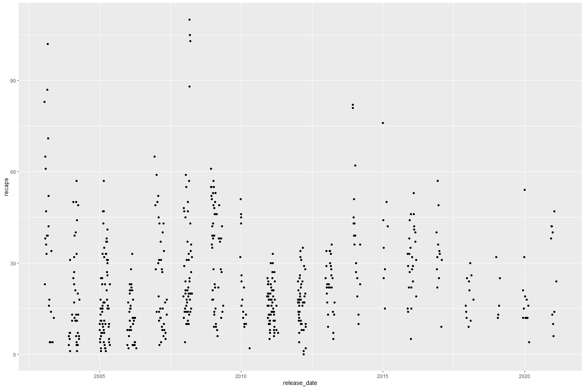

Clear Creek Mark Recapture Data
================
Erin Cain
9/29/2021

# Clear Creek Mark Recapture Data

## Description of Monitoring Data

Mike Schraml provided us with Mark Recapture data for Clear Creek.

**Timeframe:** 2003 - 2021

**Completeness of Record throughout timeframe:**

**Sampling Location:** Clear Creek

**Data Contact:** [Mike Schraml](mailto:mike_schraml@fws.gov)

**Additional description provided by Mike:**

Here are the data you requested. We consider any trial where six or
fewer are recaptured to be an invalid trial. Our season average
efficiencies are calculated only from valid trial data. During some
years we released clipped (upper caudal or lower caudal, or both clip
types) and just dyed fish at nearly the same time. These data were
combined for the efficiency calculation. See 04/12/12 release data at
Vulture Bar (VB) on the Mark-Recap Database MASTER CC DWR Data.xlsx
spreadsheet (and below) as an example.

Released Upper 161 Lower 143 Unclipped 165 Total 469

Recaptured Upper 2 Lower 9 Unclipped 10 Total 21

Bailey’s efficiency = (21+1) / (469+/) = 0.0468

In this case, because the fish were released at nearly the same time we
would use the upper clip data in the efficiency calculation and consider
the trial valid.

I hope this helps you understand these data. If you have more questions
please ask me.

## Access Cloud Data

``` r
# Run Sys.setenv() to specify GCS_AUTH_FILE and GCS_DEFAULT_BUCKET before running 
# getwd() to see how to specify paths 
# Open object from google cloud storage
# Set your authentication using gcs_auth
gcs_auth(json_file = Sys.getenv("GCS_AUTH_FILE"))
# Set global bucket 
gcs_global_bucket(bucket = Sys.getenv("GCS_DEFAULT_BUCKET"))

# git data and save as xlsx
gcs_get_object(object_name = "rst/clear-creek/data-raw/Mark-Recap Database MASTER CC DWR Data.xlsx",
               bucket = gcs_get_global_bucket(),
               saveToDisk = "raw_clear_mark_recapture_data.xlsx",
               overwrite = TRUE)
```

Read in data from google cloud, glimpse raw data: Data is stored in a
multi-tab sheet, we are interested in tab 2, Data Entry. There are
additional non tidy merged cells at the top of the sheet that catagorize
variables that we will skip when reading in.

``` r
# read in data to clean 
raw_mark_recapture <- readxl::read_excel("raw_clear_mark_recapture_data.xlsx", sheet = 2, skip  = 2) %>% glimpse()
```

    ## Rows: 568
    ## Columns: 55
    ## $ `Valid for Corr. Analysis?(Y/N)`      <lgl> NA, NA, NA, NA, NA, NA, NA, NA, ~
    ## $ `Valid For Prod. Est?  (Y/N)`         <chr> "Y", "Y", "Y", "Y", "Y", "Y", "Y~
    ## $ `Release Date`                        <dttm> 2003-01-22, 2003-01-28, 2003-01~
    ## $ `Release Site`                        <chr> "VB", "VB", "VB", "VB", "VB", "V~
    ## $ `Origin of marked fish`               <chr> NA, NA, NA, NA, NA, NA, NA, NA, ~
    ## $ `(D)ay or (N)ight    Release`         <chr> "N", "N", "N", "N", "N", "N", "N~
    ## $ `Release Time`                        <chr> "0.86458333333333337", "0.9375",~
    ## $ `No. Marked`                          <dbl> 1000, 975, 1041, 1010, 1000, 100~
    ## $ `No. Released`                        <dbl> 996, 975, 1032, 1005, 992, 993, ~
    ## $ Recaps                                <dbl> 83, 23, 65, 38, 61, 36, 47, 33, ~
    ## $ `Bailey's Trap Efficiency`            <dbl> 0.0843, 0.0246, 0.0639, 0.0388, ~
    ## $ `Peterson Trap Efficiency`            <dbl> 0.0833, 0.0236, 0.0630, 0.0378, ~
    ## $ `Mark Med Fork Length(mm)`            <dbl> 36.0, 37.0, 37.0, 36.0, 36.0, 37~
    ## $ `Recap Med Fork Length(mm)`           <chr> "37", "35", "37", "38", "37", "3~
    ## $ Clip                                  <chr> "N", "N", "C", "U", "L", "C", "C~
    ## $ `Days Held Post-mark`                 <dbl> 0, 2, 1, 1, 1, 1, 1, 1, 1, 1, 1,~
    ## $ `Max Days Held Pre-Mark`              <dbl> NA, NA, NA, NA, NA, NA, NA, NA, ~
    ## $ `Release Temp`                        <dbl> 48.76, 48.48, 49.45, 49.03, 44.6~
    ## $ `Flow @ Release`                      <dbl> 411, 542, 279, 264, 247, 241, 24~
    ## $ `Barom. Pressure`                     <dbl> 30.22, 30.15, 30.20, 30.19, 30.1~
    ## $ `<U+2206>B.P. after`                         <dbl> 0.07, 0.13, -0.17, -0.01, 0.02, ~
    ## $ `<U+2206>B.P. before`                        <dbl> 0.03, 0.03, -0.13, -0.05, 0.01, ~
    ## $ `Release Turbidity`                   <dbl> NA, NA, NA, NA, NA, NA, NA, NA, ~
    ## $ `Peak Wind Speed @ Release`           <dbl> 7, 9, 6, 15, 25, 9, 6, 6, 14, 14~
    ## $ `Hourly Average Wind Speed @ Release` <dbl> 0, 5, 4, 8, 14, 3, 2, 3, 6, 5, 1~
    ## $ `Sky Cover @ Rel`                     <dbl> 8, 0, 3, 0, 0, 0, 8, 0, 0, 0, 5,~
    ## $ `Weather/Sky Condition`               <chr> "mod rain, fog", "clear", "fog",~
    ## $ `Event (day of release)`              <chr> "Rain", "0", "Fog", "0", "0", "0~
    ## $ `Event (day after release)`           <chr> "Fog", "0", "Fog-Rain", "0", "0"~
    ## $ `Rain (Y/N)`                          <chr> "Y", "N", "Y", "N", "N", "N", "Y~
    ## $ `Rain @ Release (in)`                 <chr> "1.3", "0", "0.01", "0", "0", "0~
    ## $ `Light from moon`                     <chr> NA, NA, NA, NA, NA, NA, NA, NA, ~
    ## $ `Nightly Moon Fraction`               <dbl> 0.72, 0.11, 0.00, 0.09, 0.31, 0.~
    ## $ `Adjusted Moon Fraction`              <dbl> 0.072, 0.110, 0.000, 0.090, 0.31~
    ## $ `Date of 1st Recap`                   <chr> "37644", "37650", "37653", "3765~
    ## $ `Time of 1st Recap`                   <dbl> 0.4375000, 0.3937500, 0.4319444,~
    ## $ `Turbidity @ Recap`                   <dbl> 2.1, 5.9, 5.1, 4.0, 2.6, 2.5, 2.~
    ## $ `Flow @ time 1st Recap`               <dbl> 346, 493, 276, 261, 247, 241, 24~
    ## $ `Cone Velocity`                       <dbl> 4.4, 4.8, 3.9, 4.1, 3.8, 3.2, 3.~
    ## $ `Sec/ 3 Rotation (@ Recap)`           <dbl> 19, 17, 2, 21, 22, 25, 23, 21, 2~
    ## $ `Cone Status (H/F) @ Recap`           <chr> "F", "H", "H", "H", "H", "H", "H~
    ## $ `Mean Temp Day of Rel`                <dbl> 48.404, 48.445, 49.400, 47.580, ~
    ## $ `Mean Temp Day 1+ 2`                  <dbl> 48.86000, 48.22000, 49.45000, 47~
    ## $ `Mean Flow    Day 1 to Day 5.`        <dbl> 328.8, 455.8, 270.0, 254.6, 245.~
    ## $ `Mean Flow Day of Rel`                <dbl> 339, 1020, 280, 266, 249, 241, 2~
    ## $ `Mean Flow Day 1+ 2`                  <dbl> 343.5, 720.5, 277.5, 262.5, 248.~
    ## $ `Caught Day 1`                        <dbl> 73, 20, 58, 38, 58, 31, 39, 30, ~
    ## $ `Caught Day 2`                        <dbl> 10, 3, 7, 0, 3, 5, 8, 3, 1, 10, ~
    ## $ `Caught Day 3`                        <dbl> 0, 0, 0, 0, 0, 0, 0, 0, 0, 2, 0,~
    ## $ `Caught Day 4`                        <dbl> 0, 0, 0, 0, 0, 0, 0, 0, 1, 0, 0,~
    ## $ `Caught Day 5`                        <dbl> 0, 0, 0, 0, 0, 0, 0, 0, 0, 0, 0,~
    ## $ `Caught Day 5+`                       <dbl> 0, 0, 0, 0, 0, 0, 0, 0, 0, 0, 0,~
    ## $ `Days past Dec 31`                    <dbl> 22, 28, 31, 34, 37, 41, 44, 48, ~
    ## $ `Trap Year`                           <dbl> 2003, 2003, 2003, 2003, 2003, 20~
    ## $ `Bailey's E (Full Cone Equivalence)`  <dbl> 0.08430000, 0.04815574, 0.126815~

## Data transformations

``` r
# For different excel sheets for each year read in and combine years here
mark_recapture_data <- raw_mark_recapture %>% 
  janitor::clean_names() %>% 
  glimpse
```

    ## Rows: 568
    ## Columns: 55
    ## $ valid_for_corr_analysis_y_n       <lgl> NA, NA, NA, NA, NA, NA, NA, NA, NA, ~
    ## $ valid_for_prod_est_y_n            <chr> "Y", "Y", "Y", "Y", "Y", "Y", "Y", "~
    ## $ release_date                      <dttm> 2003-01-22, 2003-01-28, 2003-01-31,~
    ## $ release_site                      <chr> "VB", "VB", "VB", "VB", "VB", "VB", ~
    ## $ origin_of_marked_fish             <chr> NA, NA, NA, NA, NA, NA, NA, NA, NA, ~
    ## $ d_ay_or_n_ight_release            <chr> "N", "N", "N", "N", "N", "N", "N", "~
    ## $ release_time                      <chr> "0.86458333333333337", "0.9375", "0.~
    ## $ no_marked                         <dbl> 1000, 975, 1041, 1010, 1000, 1002, 9~
    ## $ no_released                       <dbl> 996, 975, 1032, 1005, 992, 993, 983,~
    ## $ recaps                            <dbl> 83, 23, 65, 38, 61, 36, 47, 33, 39, ~
    ## $ baileys_trap_efficiency           <dbl> 0.0843, 0.0246, 0.0639, 0.0388, 0.06~
    ## $ peterson_trap_efficiency          <dbl> 0.0833, 0.0236, 0.0630, 0.0378, 0.06~
    ## $ mark_med_fork_length_mm           <dbl> 36.0, 37.0, 37.0, 36.0, 36.0, 37.0, ~
    ## $ recap_med_fork_length_mm          <chr> "37", "35", "37", "38", "37", "37", ~
    ## $ clip                              <chr> "N", "N", "C", "U", "L", "C", "C", "~
    ## $ days_held_post_mark               <dbl> 0, 2, 1, 1, 1, 1, 1, 1, 1, 1, 1, 1, ~
    ## $ max_days_held_pre_mark            <dbl> NA, NA, NA, NA, NA, NA, NA, NA, NA, ~
    ## $ release_temp                      <dbl> 48.76, 48.48, 49.45, 49.03, 44.60, 4~
    ## $ flow_release                      <dbl> 411, 542, 279, 264, 247, 241, 247, 2~
    ## $ barom_pressure                    <dbl> 30.22, 30.15, 30.20, 30.19, 30.12, 3~
    ## $ b_p_after                         <dbl> 0.07, 0.13, -0.17, -0.01, 0.02, -0.1~
    ## $ b_p_before                        <dbl> 0.03, 0.03, -0.13, -0.05, 0.01, -0.1~
    ## $ release_turbidity                 <dbl> NA, NA, NA, NA, NA, NA, NA, NA, NA, ~
    ## $ peak_wind_speed_release           <dbl> 7, 9, 6, 15, 25, 9, 6, 6, 14, 14, 18~
    ## $ hourly_average_wind_speed_release <dbl> 0, 5, 4, 8, 14, 3, 2, 3, 6, 5, 1, 2,~
    ## $ sky_cover_rel                     <dbl> 8, 0, 3, 0, 0, 0, 8, 0, 0, 0, 5, 0, ~
    ## $ weather_sky_condition             <chr> "mod rain, fog", "clear", "fog", "cl~
    ## $ event_day_of_release              <chr> "Rain", "0", "Fog", "0", "0", "0", "~
    ## $ event_day_after_release           <chr> "Fog", "0", "Fog-Rain", "0", "0", "0~
    ## $ rain_y_n                          <chr> "Y", "N", "Y", "N", "N", "N", "Y", "~
    ## $ rain_release_in                   <chr> "1.3", "0", "0.01", "0", "0", "0", "~
    ## $ light_from_moon                   <chr> NA, NA, NA, NA, NA, NA, NA, NA, NA, ~
    ## $ nightly_moon_fraction             <dbl> 0.72, 0.11, 0.00, 0.09, 0.31, 0.68, ~
    ## $ adjusted_moon_fraction            <dbl> 0.072, 0.110, 0.000, 0.090, 0.310, 0~
    ## $ date_of_1st_recap                 <chr> "37644", "37650", "37653", "37656", ~
    ## $ time_of_1st_recap                 <dbl> 0.4375000, 0.3937500, 0.4319444, 0.4~
    ## $ turbidity_recap                   <dbl> 2.1, 5.9, 5.1, 4.0, 2.6, 2.5, 2.0, 2~
    ## $ flow_time_1st_recap               <dbl> 346, 493, 276, 261, 247, 241, 241, 2~
    ## $ cone_velocity                     <dbl> 4.4, 4.8, 3.9, 4.1, 3.8, 3.2, 3.8, 4~
    ## $ sec_3_rotation_recap              <dbl> 19, 17, 2, 21, 22, 25, 23, 21, 23, 2~
    ## $ cone_status_h_f_recap             <chr> "F", "H", "H", "H", "H", "H", "H", "~
    ## $ mean_temp_day_of_rel              <dbl> 48.404, 48.445, 49.400, 47.580, 45.5~
    ## $ mean_temp_day_1_2                 <dbl> 48.86000, 48.22000, 49.45000, 47.060~
    ## $ mean_flow_day_1_to_day_5          <dbl> 328.8, 455.8, 270.0, 254.6, 245.0, 2~
    ## $ mean_flow_day_of_rel              <dbl> 339, 1020, 280, 266, 249, 241, 248, ~
    ## $ mean_flow_day_1_2                 <dbl> 343.5, 720.5, 277.5, 262.5, 248.0, 2~
    ## $ caught_day_1                      <dbl> 73, 20, 58, 38, 58, 31, 39, 30, 37, ~
    ## $ caught_day_2                      <dbl> 10, 3, 7, 0, 3, 5, 8, 3, 1, 10, 1, 3~
    ## $ caught_day_3                      <dbl> 0, 0, 0, 0, 0, 0, 0, 0, 0, 2, 0, 1, ~
    ## $ caught_day_4                      <dbl> 0, 0, 0, 0, 0, 0, 0, 0, 1, 0, 0, 0, ~
    ## $ caught_day_5                      <dbl> 0, 0, 0, 0, 0, 0, 0, 0, 0, 0, 0, 0, ~
    ## $ caught_day_5_2                    <dbl> 0, 0, 0, 0, 0, 0, 0, 0, 0, 0, 0, 0, ~
    ## $ days_past_dec_31                  <dbl> 22, 28, 31, 34, 37, 41, 44, 48, 51, ~
    ## $ trap_year                         <dbl> 2003, 2003, 2003, 2003, 2003, 2003, ~
    ## $ baileys_e_full_cone_equivalence   <dbl> 0.08430000, 0.04815574, 0.12681510, ~

Currently efficiency is just a function of number of number recaptured /
number released. (with a x2 adjustment if the trap is fished at 1/2
cone)

## Exploratory Analysis:

Analysis to explore other variables that may be correlated with trap
efficiency:

``` r
mark_recapture_data %>% 
  group_by(release_date) %>%
  summarise(daily_flow = mean(flow_release),
            mean_efficency = mean(baileys_trap_efficiency)) %>%
  ggplot() +
  geom_point(aes(x = daily_flow, y = mean_efficency)) + 
  theme_minimal()
```

<!-- -->

## Explore Numeric Variables:

``` r
mark_recapture_data %>% select_if(is.numeric) %>% colnames 
```

    ##  [1] "no_marked"                         "no_released"                      
    ##  [3] "recaps"                            "baileys_trap_efficiency"          
    ##  [5] "peterson_trap_efficiency"          "mark_med_fork_length_mm"          
    ##  [7] "days_held_post_mark"               "max_days_held_pre_mark"           
    ##  [9] "release_temp"                      "flow_release"                     
    ## [11] "barom_pressure"                    "b_p_after"                        
    ## [13] "b_p_before"                        "release_turbidity"                
    ## [15] "peak_wind_speed_release"           "hourly_average_wind_speed_release"
    ## [17] "sky_cover_rel"                     "nightly_moon_fraction"            
    ## [19] "adjusted_moon_fraction"            "time_of_1st_recap"                
    ## [21] "turbidity_recap"                   "flow_time_1st_recap"              
    ## [23] "cone_velocity"                     "sec_3_rotation_recap"             
    ## [25] "mean_temp_day_of_rel"              "mean_temp_day_1_2"                
    ## [27] "mean_flow_day_1_to_day_5"          "mean_flow_day_of_rel"             
    ## [29] "mean_flow_day_1_2"                 "caught_day_1"                     
    ## [31] "caught_day_2"                      "caught_day_3"                     
    ## [33] "caught_day_4"                      "caught_day_5"                     
    ## [35] "caught_day_5_2"                    "days_past_dec_31"                 
    ## [37] "trap_year"                         "baileys_e_full_cone_equivalence"

The most relevant columns of this dataset are `no_released`, `recaps`,
and `baileys_trap_efficiency`

### Variable: `no_released`

**Plotting no\_released over Period of Record**

``` r
mark_recapture_data %>% ggplot() +
  geom_point(aes(x = release_date, y = no_released))
```

<!-- -->

**Numeric Summary of no\_released over Period of Record**

``` r
# Table with summary statistics
summary(mark_recapture_data$no_released)
```

    ##    Min. 1st Qu.  Median    Mean 3rd Qu.    Max.    NA's 
    ##     8.0   282.0   393.0   360.9   411.0  1032.0       2

Looks like there are anywhere from 8 - 1032 fish released.

### Variable: `recaps`

**Plotting recaps over Period of Record**

``` r
mark_recapture_data %>% ggplot() +
  geom_point(aes(x = release_date, y = recaps))
```

<!-- -->

**Numeric Summary of recaps over Period of Record**

``` r
# Table with summary statistics
summary(mark_recapture_data$recaps)
```

    ##    Min. 1st Qu.  Median    Mean 3rd Qu.    Max.    NA's 
    ##    0.00   12.00   20.00   23.95   33.00  110.00       3

Looks like there are anywhere from 0 - 110 fish recaptured

### Variable: `baileys_trap_efficiency`

**Plotting baileys\_trap\_efficiency over Period of Record**

``` r
mark_recapture_data %>% ggplot() +
  geom_point(aes(x = release_date, y = baileys_trap_efficiency))
```

<!-- -->

**Numeric Summary of baileys\_trap\_efficiency over Period of Record**

``` r
# Table with summary statistics
summary(mark_recapture_data$baileys_trap_efficiency)
```

    ##    Min. 1st Qu.  Median    Mean 3rd Qu.    Max.    NA's 
    ## 0.00240 0.03973 0.06660 0.07421 0.09525 0.50000       2

Looks like baileys efficiency is anywhere from .002 - .5.

## Summary of identified issues

-   What are all other variables doing in dataset if not being used to
    calculate trap efficiency?
-   Does not look like consistent amount of mark recapture trials each
    year

## Select relevent data, & save cleaned data to cloud

``` r
clear_mark_reacpture <- mark_recapture_data %>% 
  select(release_date, day_or_night_release = d_ay_or_n_ight_release, release_time, no_marked,
         no_released, recaps, mark_med_fork_length_mm, recap_med_fork_length_mm, 
         days_held_post_mark, release_temp, flow_release, release_turbidity, cone_status_h_f_recap, 
         mean_temp_day_of_rel, mean_flow_day_of_rel, caught_day_1, caught_day_2, 
         caught_day_3, caught_day_4, caught_day_5) %>%
  mutate(release_time = hms::hms(as.numeric(release_time)),
         day_or_night_release = case_when(day_or_night_release == "?" ~ "unknown", 
                                          day_or_night_release == "D" ~ "day",
                                          day_or_night_release == "N" ~ "night"),
         release_temp = as.numeric(release_temp),
         cone_status = case_when(cone_status_h_f_recap == "H" ~ "half", 
                                 cone_status_h_f_recap == "F" ~ "full")) %>% 
  select(-cone_status_h_f_recap) %>% glimpse
```

    ## Rows: 568
    ## Columns: 20
    ## $ release_date             <dttm> 2003-01-22, 2003-01-28, 2003-01-31, 2003-02-~
    ## $ day_or_night_release     <chr> "night", "night", "night", "night", "night", ~
    ## $ release_time             <time> 00:00:00.864583, 00:00:00.937500, 00:00:00.7~
    ## $ no_marked                <dbl> 1000, 975, 1041, 1010, 1000, 1002, 994, 989, ~
    ## $ no_released              <dbl> 996, 975, 1032, 1005, 992, 993, 983, 977, 902~
    ## $ recaps                   <dbl> 83, 23, 65, 38, 61, 36, 47, 33, 39, 87, 39, 1~
    ## $ mark_med_fork_length_mm  <dbl> 36.0, 37.0, 37.0, 36.0, 36.0, 37.0, 37.0, 37.~
    ## $ recap_med_fork_length_mm <chr> "37", "35", "37", "38", "37", "37", "37", "37~
    ## $ days_held_post_mark      <dbl> 0, 2, 1, 1, 1, 1, 1, 1, 1, 1, 1, 1, 1, 1, 1, ~
    ## $ release_temp             <dbl> 48.76, 48.48, 49.45, 49.03, 44.60, 47.10, 48.~
    ## $ flow_release             <dbl> 411, 542, 279, 264, 247, 241, 247, 286, 261, ~
    ## $ release_turbidity        <dbl> NA, NA, NA, NA, NA, NA, NA, NA, NA, NA, NA, N~
    ## $ mean_temp_day_of_rel     <dbl> 48.404, 48.445, 49.400, 47.580, 45.500, 46.60~
    ## $ mean_flow_day_of_rel     <dbl> 339, 1020, 280, 266, 249, 241, 248, 292, 263,~
    ## $ caught_day_1             <dbl> 73, 20, 58, 38, 58, 31, 39, 30, 37, 75, 38, 9~
    ## $ caught_day_2             <dbl> 10, 3, 7, 0, 3, 5, 8, 3, 1, 10, 1, 3, 6, 3, 8~
    ## $ caught_day_3             <dbl> 0, 0, 0, 0, 0, 0, 0, 0, 0, 2, 0, 1, 0, 0, 0, ~
    ## $ caught_day_4             <dbl> 0, 0, 0, 0, 0, 0, 0, 0, 1, 0, 0, 0, 0, 0, 0, ~
    ## $ caught_day_5             <dbl> 0, 0, 0, 0, 0, 0, 0, 0, 0, 0, 0, 0, 0, 0, 0, ~
    ## $ cone_status              <chr> "full", "half", "half", "half", "half", "half~

``` r
f <- function(input, output) write_csv(input, file = output)

gcs_upload(clear_mark_reacpture,
           object_function = f,
           type = "csv",
           name = "rst/clear-creek/data/clear_mark_reacpture.csv")
```
