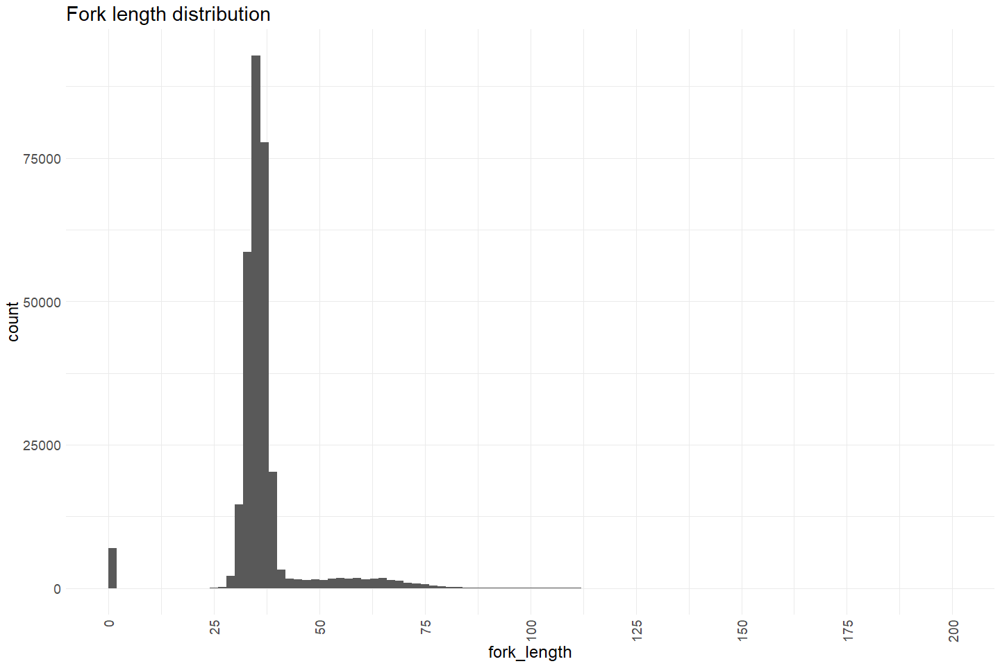
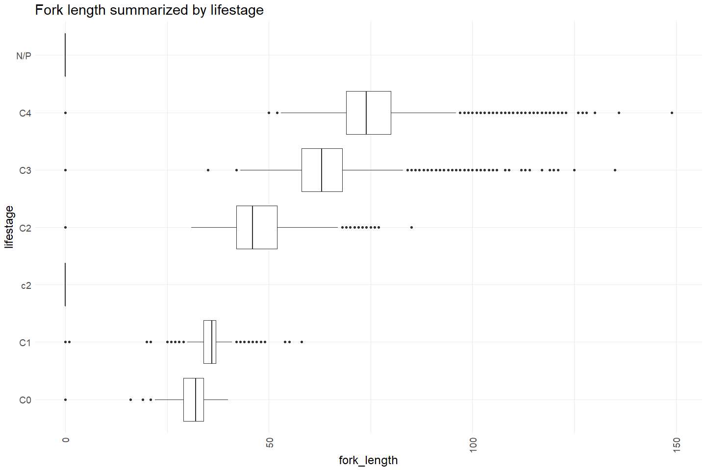
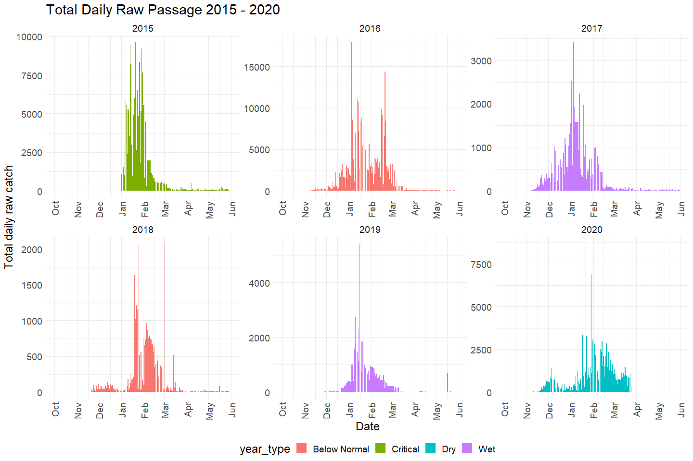
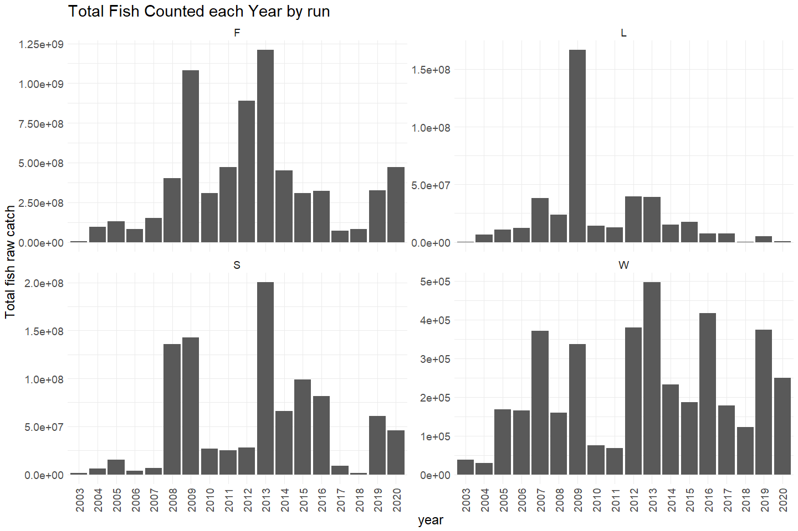

Clear Creek RST QC
================
Erin Cain
9/29/2021

# Clear Creek Rotary Screw Trap Data

## Description of Monitoring Data

These data were collected by the U.S. Fish and Wildlife Service’s, Red
Bluff Fish and Wildlife Office’s, Clear Creek Monitoring Program. These
data represent brood years (BY) 2003-2020 The fish were captured in the
lower Clear Creek rotary screw trap site (LCC), Shasta County,
California, from September 30, 2003, through June 30, 2021. The catch
data were collected using a 5-ft diameter rotary screw trap located at
river mile at river mile 1.7. The data represent both the raw catch and
processed catch values. The trap was only fished through March 25, 2020,
during BY2019 sampling.

**Timeframe:** 2003 - 2021

**Screw Trap Season:** September - June

**Completeness of Record throughout timeframe:** Some variation across
years but sampled every year.

**Sampling Location:** Upper Clear Creek (UCC) and Lower Clear Creek
(LCC)

**Data Contact:** [Mike Schraml](mailto:mike_schraml@fws.gov)

Any additional info?

## Access Cloud Data

``` r
# Run Sys.setenv() to specify GCS_AUTH_FILE and GCS_DEFAULT_BUCKET before running 
# getwd() to see how to specify paths 
# Open object from google cloud storage
# Set your authentication using gcs_auth
gcs_auth(json_file = Sys.getenv("GCS_AUTH_FILE"))
# Set global bucket 
gcs_global_bucket(bucket = Sys.getenv("GCS_DEFAULT_BUCKET"))

gcs_list_objects()
# git data and save as xlsx
gcs_get_object(object_name = "rst/clear-creek/data-raw/UCC Spring.xlsx",
               bucket = gcs_get_global_bucket(),
               saveToDisk = "raw_upper_clear_rst_data.xlsx",
               overwrite = TRUE)

gcs_get_object(object_name = "rst/clear-creek/data-raw/LCC Spring.xlsx",
               bucket = gcs_get_global_bucket(),
               saveToDisk = "raw_lower_clear_rst_data.xlsx",
               overwrite = TRUE)
```

Read in data from google cloud, glimpse raw data and domain description
sheet:

``` r
# Lower Clear Creek Catch
sheets <- excel_sheets("raw_lower_clear_rst_data.xlsx")
sheets
```

    ## [1] "Metadata"                "LCC Environmental Data" 
    ## [3] "LCC Environmental Data2" "LCC Catch Data"

``` r
raw_lower_rst_count_data <- read_excel("raw_lower_clear_rst_data.xlsx", sheet = "LCC Catch Data") %>% glimpse()
```

    ## Rows: 252,221
    ## Columns: 14
    ## $ OrganismCode <chr> "CHN", "CHN", "CHN", "CHN", "CHN", "CHN", "CHN", "CHN", "~
    ## $ StationCode  <chr> "LCC", "LCC", "LCC", "LCC", "LCC", "LCC", "LCC", "LCC", "~
    ## $ SampleDate   <dttm> 2003-10-01, 2003-10-05, 2003-10-06, 2003-10-06, 2003-10-~
    ## $ SampleID     <chr> "274_03", "278_03", "279_03", "279_03", "279_03", "280_03~
    ## $ IDWeek       <dbl> 40, 40, 40, 40, 40, 40, 41, 42, 42, 42, 42, 43, 43, 44, 4~
    ## $ FWSRace      <chr> "L", "L", "L", "L", "L", "L", "L", "L", "L", "L", "L", "L~
    ## $ Race         <chr> "L", "L", "L", "L", "L", "L", "L", "L", "L", "L", "L", "L~
    ## $ ForkLength   <dbl> 90, 92, 98, 93, 71, 86, 69, 96, 84, 84, 84, 89, 74, 92, 8~
    ## $ LifeStage    <chr> "C3", "C4", "C3", "C3", "C3", "C4", "C3", "C4", "C3", "C4~
    ## $ RCatch       <dbl> 1, 1, 1, 1, 1, 1, 1, 1, 1, 1, 1, 1, 1, 1, 1, 1, 1, 1, 1, ~
    ## $ Count        <dbl> 1, 1, 1, 1, 1, 1, 1, 1, 1, 1, 1, 1, 1, 1, 1, 1, 1, 1, 1, ~
    ## $ BroodYear    <dbl> 2003, 2003, 2003, 2003, 2003, 2003, 2003, 2003, 2003, 200~
    ## $ Dead         <chr> "NO", "NO", "NO", "NO", "NO", "NO", "NO", "NO", "NO", "NO~
    ## $ Interp       <chr> "NO", "NO", "NO", "NO", "NO", "NO", "NO", "NO", "NO", "NO~

``` r
# Upper Clear Creek Catch
sheets <- excel_sheets("raw_upper_clear_rst_data.xlsx")
sheets
```

    ## [1] "Metadata"                "UCC Environmental Data" 
    ## [3] "UCC Environmental Data2" "UCC Catch Data"

``` r
raw_upper_rst_count_data <- read_excel("raw_upper_clear_rst_data.xlsx", sheet = "UCC Catch Data") %>% glimpse()
```

    ## Rows: 50,449
    ## Columns: 14
    ## $ OrganismCode <chr> "CHN", "CHN", "CHN", "CHN", "CHN", "CHN", "CHN", "CHN", "~
    ## $ StationCode  <chr> "UCC", "UCC", "UCC", "UCC", "UCC", "UCC", "UCC", "UCC", "~
    ## $ SampleDate   <dttm> 2003-10-16, 2003-10-26, 2003-11-16, 2003-11-29, 2003-11-~
    ## $ SampleID     <chr> "289_03", "299_03", "320_03", "333_03", "334_03", "334_03~
    ## $ IDWeek       <dbl> 42, 43, 46, 48, 48, 48, 48, 48, 48, 48, 48, 48, 48, 48, 4~
    ## $ FWSRace      <chr> "L", "L", "S", "S", "S", "S", "S", "S", "S", "S", "S", "S~
    ## $ Race         <chr> "F", "L", "S", "S", "S", "S", "S", "S", "S", "S", "S", "S~
    ## $ ForkLength   <dbl> 130, 126, 32, 35, 34, 35, 32, 33, 36, 34, 35, 34, 33, 32,~
    ## $ LifeStage    <chr> "C4", "C4", "C0", "C1", "C1", "C1", "C1", "C1", "C1", "C1~
    ## $ RCatch       <dbl> 1, 1, 1, 1, 1, 21, 4, 13, 3, 46, 16, 25, 10, 1, 1, 1, 4, ~
    ## $ Count        <dbl> 1, 1, 1, 1, 1, 21, 4, 13, 3, 46, 16, 25, 10, 1, 1, 1, 4, ~
    ## $ BroodYear    <dbl> 2002, 2002, 2003, 2003, 2003, 2003, 2003, 2003, 2003, 200~
    ## $ Dead         <chr> "NO", "NO", "NO", "NO", "YES", "NO", "NO", "NO", "NO", "N~
    ## $ Interp       <chr> "NO", "NO", "NO", "NO", "NO", "NO", "NO", "NO", "NO", "NO~

## Data transformations

``` r
raw_rst_count_data <- bind_rows(raw_lower_rst_count_data, raw_upper_rst_count_data)

cleaner_rst_count <- raw_rst_count_data %>%
  janitor::clean_names() %>%
  rename("date" = sample_date,
         "fork_length" = fork_length,
         "lifestage" = life_stage,
         "count_2" = count,
         "count" = r_catch,
         "interpolated" = interp,
         "run" = race) %>%
  mutate(date = as.Date(date)) %>%
  select(-organism_code,
         -brood_year, 
         -id_week, -fws_race,
         -count_2) %>% # raw catch data, I kept interpolated catch (less than 1% of the data is interpolated)
  glimpse()
```

    ## Rows: 302,670
    ## Columns: 9
    ## $ station_code <chr> "LCC", "LCC", "LCC", "LCC", "LCC", "LCC", "LCC", "LCC", "~
    ## $ date         <date> 2003-10-01, 2003-10-05, 2003-10-06, 2003-10-06, 2003-10-~
    ## $ sample_id    <chr> "274_03", "278_03", "279_03", "279_03", "279_03", "280_03~
    ## $ run          <chr> "L", "L", "L", "L", "L", "L", "L", "L", "L", "L", "L", "L~
    ## $ fork_length  <dbl> 90, 92, 98, 93, 71, 86, 69, 96, 84, 84, 84, 89, 74, 92, 8~
    ## $ lifestage    <chr> "C3", "C4", "C3", "C3", "C3", "C4", "C3", "C4", "C3", "C4~
    ## $ count        <dbl> 1, 1, 1, 1, 1, 1, 1, 1, 1, 1, 1, 1, 1, 1, 1, 1, 1, 1, 1, ~
    ## $ dead         <chr> "NO", "NO", "NO", "NO", "NO", "NO", "NO", "NO", "NO", "NO~
    ## $ interpolated <chr> "NO", "NO", "NO", "NO", "NO", "NO", "NO", "NO", "NO", "NO~

``` r
sum(cleaner_rst_count$interpolated == "YES")/nrow(cleaner_rst_count) * 100 # % of the catch data is interpolated
```

    ## [1] 0.3436086

Notes:

-   `r_catch` value has an interpolated catch for times the trap did not
    fish. Not an estimate just for missed days interpolates values based
    on prior/future days

-   I selected only one race, the data has two races, I do not know
    which one is best to keep, here are details on the two:

    -   fWSRace - USFWS run designation base upon location or emergence
        timing used in reports and for passage indices, W=winter-run,
        S=spring-run, F=fall-run, L=late-fall run Chinook Salmon  
    -   race - Database generated Sheila Greene run designation of
        catch, W=winter-run, S=spring-run, F=fall-run, L=late-fall run
        Chinook Salmon, see RunDesignation and RunChart tables

## Explore Numeric Variables:

``` r
cleaner_rst_count %>% select_if(is.numeric) %>% colnames()
```

    ## [1] "fork_length" "count"

### Variable: `fork_length`

Fork length of the fish captured. If it is recorded as zero it indicates
that the fish was not measured

**Plotting fork\_length**

``` r
p1 <- cleaner_rst_count %>% filter(fork_length < 250) %>% # filter out 13 points so we can more clearly see distribution
  ggplot(aes(x = fork_length)) + 
  geom_histogram(breaks=seq(0, 200, by=2)) + 
  scale_x_continuous(breaks=seq(0, 200, by=25)) +
  theme_minimal() +
  labs(title = "Fork length distribution") + 
  theme(text = element_text(size = 18),
        axis.text.x = element_text(angle = 90, vjust = 0.5, hjust=1)) 

p2 <- cleaner_rst_count %>% filter(fork_length < 250, fork_length > 0) %>% # filter out 13 points so we can more clearly see distribution
  ggplot(aes(x = fork_length)) + 
  geom_histogram(breaks=seq(25, 200, by=2)) + 
  scale_x_continuous(breaks=seq(25, 200, by=25)) +
  theme_minimal() +
  labs(title = "Fork length distribution, filtered to not show 0 values (NA)") + 
  theme(text = element_text(size = 18),
        axis.text.x = element_text(angle = 90, vjust = 0.5, hjust=1)) 

gridExtra::grid.arrange(p1, p2)
```

<!-- -->

``` r
cleaner_rst_count %>% 
  mutate(year = as.factor(year(date))) %>%
  ggplot(aes(x = fork_length, y = case_when(cleaner_rst_count$lifestage == "C0" ~ "yolk-sac fry", 
                                   cleaner_rst_count$lifestage == "C1" ~ "fry",
                                   cleaner_rst_count$lifestage %in% c("C2", "c2") ~ "parr",
                                   cleaner_rst_count$lifestage == "C3" ~ "silvery parr",
                                   cleaner_rst_count$lifestage == "C4" ~ "smolt"))) + 
  geom_boxplot() + 
  theme_minimal() +
  labs(title = "Fork length summarized by lifestage",
       y = "Lifestage") + 
  theme(text = element_text(size = 18),
        axis.text.x = element_text(angle = 90, vjust = 0.5, hjust=1)) 
```

<!-- -->

**Numeric Summary of fork\_length over Period of Record**

``` r
# Table with summary statistics
summary(cleaner_rst_count$fork_length)
```

    ##    Min. 1st Qu.  Median    Mean 3rd Qu.    Max. 
    ##       0      34      36      37      38     149

**NA and Unknown Values**

-   0 % of values in the `fork_length` column are NA.

-   0 for `fork_length` seems like an NA or error

``` r
cleaner_rst_count %>% filter(fork_length == 0 & !is.na(count))
```

    ## # A tibble: 6,995 x 9
    ##    station_code date       sample_id run   fork_length lifestage count dead 
    ##    <chr>        <date>     <chr>     <chr>       <dbl> <chr>     <dbl> <chr>
    ##  1 LCC          2003-12-14 348_03    <NA>            0 C1          154 NO   
    ##  2 LCC          2003-12-14 348_03    <NA>            0 C1           23 YES  
    ##  3 LCC          2003-12-14 348_03    <NA>            0 C1           58 YES  
    ##  4 LCC          2003-12-14 348_03    <NA>            0 C1           60 NO   
    ##  5 LCC          2003-12-15 349_03    <NA>            0 C1          251 NO   
    ##  6 LCC          2003-12-15 349_03    <NA>            0 C1           49 NO   
    ##  7 LCC          2003-12-20 354_03    <NA>            0 C1          135 NO   
    ##  8 LCC          2003-12-20 354_03    S               0 C1            5 NO   
    ##  9 LCC          2003-12-24 358_03    <NA>            0 C1          821 YES  
    ## 10 LCC          2003-12-24 358_03    <NA>            0 C1          736 NO   
    ## # ... with 6,985 more rows, and 1 more variable: interpolated <chr>

``` r
cleaner_rst_count$fork_length <- ifelse(cleaner_rst_count$fork_length == 0, NA, cleaner_rst_count$fork_length)
```

### Variable: `count`

Catch number used to generate passage indices for reports, plus counts
are split into races, zero fork lengths have been assigned

-   Definition given in Spreadsheet metadata, do not know what 0 fork
    lengths have been assigned means (i know if fish is not measured
    they give it a fork length of 0 so maybe they are assigning these 0
    values lifestages or counts on interpolated days) TODO ask Mike

**Plotting fish counts over period of record**

``` r
cleaner_rst_count %>% 
  filter(year(date) > 2014, year(date) < 2021) %>%
  mutate(water_year = ifelse(month(date) %in% 10:12, year(date) + 1, year(date))) %>% 
  left_join(sac_indices) %>%
  mutate(year = as.factor(year(date)),
         fake_year = if_else(month(date) %in% 10:12, 1900, 1901),
         fake_date = as.Date(paste0(fake_year,"-", month(date), "-", day(date)))) %>%
  filter(water_year < 2021) %>%
  group_by(date) %>%
  mutate(total_daily_catch = sum(count)) %>%
  ungroup() %>%
  ggplot(aes(x = fake_date, y = total_daily_catch, fill = year_type)) + 
  geom_col() + 
  scale_x_date(labels = date_format("%b"), limits = c(as.Date("1900-10-01"), as.Date("1901-06-01")), date_breaks = "1 month") + 
  theme_minimal() + 
  theme(text = element_text(size = 18),
        axis.text.x = element_text(angle = 90, vjust = 0.5, hjust=1),
        legend.position = "bottom") + 
  labs(title = "Total Daily Raw Passage 2015 - 2020",
       y = "Total daily raw catch",
       x = "Date")+ 
  facet_wrap(~water_year, scales = "free") +
  scale_color_manual(palette)
```

    ## Joining, by = "water_year"

<!-- -->

``` r
cleaner_rst_count  %>%
  filter(year(date) < 2021, 
         run %in% c("F", "L", "S", "W")
         ) %>% 
  mutate(year = as.factor(year(date))) %>%
  group_by(year) %>%
  mutate(total_yearly_catch = sum(count)) %>%
  ggplot(aes(x = year, y = total_yearly_catch)) + 
  geom_col() + 
  theme_minimal() +
  labs(title = "Total Fish Counted each Year by run",
       y = "Total fish raw catch") + 
  theme(text = element_text(size = 18),
        axis.text.x = element_text(angle = 90, vjust = 0.5, hjust=1)) + 
  facet_wrap(~run, scales = "free_y")
```

<!-- -->

**Numeric Summary of counts over Period of Record**

``` r
# Table with summary statistics
summary(cleaner_rst_count$count)
```

    ##     Min.  1st Qu.   Median     Mean  3rd Qu.     Max. 
    ##     0.00     1.00     1.00    15.92     1.00 84426.00

**NA and Unknown Values**

-   0 % of values in the `count` column are NA.

## Explore Categorical variables:

``` r
cleaner_rst_count %>% select_if(is.character) %>% colnames()
```

    ## [1] "station_code" "sample_id"    "run"          "lifestage"    "dead"        
    ## [6] "interpolated"

### Variable: `station_code`

The station code, two stations Lower Clear Creek (LCC) and Upper Clear
Creek (UCC)

``` r
table(cleaner_rst_count$station_code)
```

    ## 
    ##    LCC    UCC 
    ## 252221  50449

**NA and Unknown Values**

-   0 % of values in the `station_code` column are NA.

### Variable: `sample_id`

The calendar year Julian date and year code for that \~24-h sample
period (ddd\_yy)

``` r
length(unique(cleaner_rst_count$sample_id)) 
```

    ## [1] 4064

There are 4064 unique sample ID

**NA and Unknown Values**

-   0 % of values in the `sample_id` column are NA.

### Variable: `run`

``` r
table(cleaner_rst_count$run)
```

    ## 
    ##      F      L      S      W 
    ## 249547  13646  32845    175

Fix inconsistencies with spelling, capitalization, and abbreviations.
“N/P” is changed to NA in the case\_when statement below.

``` r
cleaner_rst_count$run <- case_when(cleaner_rst_count$run == "F" ~ "fall", 
                                   cleaner_rst_count$run == "S" ~ "spring",
                                   cleaner_rst_count$run == "L" ~ "late fall",
                                   cleaner_rst_count$run == "W" ~ "winter")
table(cleaner_rst_count$run)
```

    ## 
    ##      fall late fall    spring    winter 
    ##    249547     13646     32845       175

**NA and Unknown Values**

-   2.1 % of values in the `run` column are NA.

### Variable: `lifestage`

Life stage of the catch (CHN = C0 - yolk-sac fry, C1 - fry, C2 - parr,
C3 - silvery parr, C4 - smolt, n/p - Not provided; RBT = R1 - yolk-sac
fry, R2 - fry, R3 - parr, R4 - silvery parr, R5 - smolt, R6 - adult).
“N/P” is changed to NA in the case\_when statement below.

``` r
table(cleaner_rst_count$lifestage)
```

    ## 
    ##     C0     C1     c2     C2     C3     C4    N/P 
    ##   4708 266985      1  12979  13300   3362   1335

Fix inconsistencies with spelling, capitalization, and abbreviations.

``` r
cleaner_rst_count$lifestage <- case_when(cleaner_rst_count$lifestage == "C0" ~ "yolk-sac fry", 
                                   cleaner_rst_count$lifestage == "C1" ~ "fry",
                                   cleaner_rst_count$lifestage %in% c("C2", "c2") ~ "parr",
                                   cleaner_rst_count$lifestage == "C3" ~ "silvery parr",
                                   cleaner_rst_count$lifestage == "C4" ~ "smolt")
table(cleaner_rst_count$lifestage)
```

    ## 
    ##          fry         parr silvery parr        smolt yolk-sac fry 
    ##       266985        12980        13300         3362         4708

**NA and Unknown Values**

-   0.4 % of values in the `lifestage` column are NA.

### Variable: `dead`

Indicates if the fish was a mortality (YES = mortality)

``` r
table(cleaner_rst_count$dead)
```

    ## 
    ##     no     No     NO    Yes    YES 
    ##    126     33 296488      1   6018

Fix inconsistencies with spelling, capitalization, and abbreviations.

``` r
cleaner_rst_count$dead <- case_when(tolower(cleaner_rst_count$dead) == "yes" ~ TRUE, 
                                    tolower(cleaner_rst_count$dead) == "no" ~ FALSE)
table(cleaner_rst_count$dead)
```

    ## 
    ##  FALSE   TRUE 
    ## 296647   6019

**NA and Unknown Values**

-   0 % of values in the `dead` column are NA.

### Variable: `interpolated`

Is count value an interpolated catch for times the trap did not fish?
Yes = the data is interpolated data and not actual catch data

``` r
table(cleaner_rst_count$interpolated)
```

    ## 
    ##     NO    YES 
    ## 301630   1040

Fix inconsistencies with spelling, capitalization, and abbreviations.

``` r
cleaner_rst_count$interpolated <- case_when(cleaner_rst_count$interpolated == "YES" ~ TRUE, 
                                            cleaner_rst_count$interpolated == "NO" ~ FALSE)
table(cleaner_rst_count$interpolated)
```

    ## 
    ##  FALSE   TRUE 
    ## 301630   1040

**NA and Unknown Values**

-   0 % of values in the `interpolated` column are NA.

## Summary of identified issues

-   Count values are interpolated on days where the traps were not
    fished, to see if interpolated or not refer to `interpolated`
    column - not exactly clear how interpolation is calculated
-   Need to decide what Race (run) measure to keep (`fws_race` or
    `race`)
-   Investigate what it means for: zero fork lengths have been
    assigned - 0 `fork_length` values mean fish was not measured. TODO
    Ask Mike

## Save cleaned data back to google cloud

``` r
clear_rst_catch <- cleaner_rst_count %>% glimpse()
```

    ## Rows: 302,670
    ## Columns: 9
    ## $ station_code <chr> "LCC", "LCC", "LCC", "LCC", "LCC", "LCC", "LCC", "LCC", "~
    ## $ date         <date> 2003-10-01, 2003-10-05, 2003-10-06, 2003-10-06, 2003-10-~
    ## $ sample_id    <chr> "274_03", "278_03", "279_03", "279_03", "279_03", "280_03~
    ## $ run          <chr> "late fall", "late fall", "late fall", "late fall", "late~
    ## $ fork_length  <dbl> 90, 92, 98, 93, 71, 86, 69, 96, 84, 84, 84, 89, 74, 92, 8~
    ## $ lifestage    <chr> "silvery parr", "smolt", "silvery parr", "silvery parr", ~
    ## $ count        <dbl> 1, 1, 1, 1, 1, 1, 1, 1, 1, 1, 1, 1, 1, 1, 1, 1, 1, 1, 1, ~
    ## $ dead         <lgl> FALSE, FALSE, FALSE, FALSE, FALSE, FALSE, FALSE, FALSE, F~
    ## $ interpolated <lgl> FALSE, FALSE, FALSE, FALSE, FALSE, FALSE, FALSE, FALSE, F~

``` r
# Write to google cloud 

# Name file [watershed]_[data type].csv
f <- function(input, output) write_csv(input, file = output)
gcs_upload(clear_rst_catch,
           object_function = f,
           type = "csv",
           name = "rst/clear-creek/data/clear_rst_catch.csv")
```
