Clear Creek RST QC
================
Erin Cain
9/29/2021

# Clear Creek Rotary Screw Trap Data

## Description of Monitoring Data

These data were collected by the U.S. Fish and Wildlife Service’s, Red
Bluff Fish and Wildlife Office’s, clear Creek Monitoring Program. These
data represent environmental conditions for clear Creek RST.

**Timeframe:** 2003 - 2021

**Screw Trap Season:** September - June

**Completeness of Record throughout timeframe:** Some variation across
years but sampled every year.

**Sampling Location:** Upper Clear Creek (UCC) and Lower Clear Creek
(LCC)

**Data Contact:** [Mike Schraml](mailto:mike_schraml@fws.gov)

Any additional info?

## Access Cloud Data

``` r
# Run Sys.setenv() to specify GCS_AUTH_FILE and GCS_DEFAULT_BUCKET before running 
# getwd() to see how to specify paths 
# Open object from google cloud storage
# Set your authentication using gcs_auth
gcs_auth(json_file = Sys.getenv("GCS_AUTH_FILE"))
# Set global bucket 
gcs_global_bucket(bucket = Sys.getenv("GCS_DEFAULT_BUCKET"))

gcs_list_objects()
# git data and save as xlsx
gcs_get_object(object_name = "rst/clear-creek/data-raw/UCC Spring.xlsx",
               bucket = gcs_get_global_bucket(),
               saveToDisk = "raw_upper_clear_rst_data.xlsx",
               overwrite = TRUE)

gcs_get_object(object_name = "rst/clear-creek/data-raw/LCC Spring.xlsx",
               bucket = gcs_get_global_bucket(),
               saveToDisk = "raw_lower_clear_rst_data.xlsx",
               overwrite = TRUE)
```

Read in data from google cloud, glimpse raw data for upper and lower
Clear Creek:

``` r
upper_sheets <- excel_sheets("raw_upper_clear_rst_data.xlsx")
upper_sheets
```

    ## [1] "Metadata"                "UCC Environmental Data" 
    ## [3] "UCC Environmental Data2" "UCC Catch Data"

``` r
raw_environmental_upper_1 <- read_excel("raw_upper_clear_rst_data.xlsx", 
                                  sheet = "UCC Environmental Data") %>% glimpse()
```

    ## Rows: 3,262
    ## Columns: 32
    ## $ StationCode      <chr> "UCC", "UCC", "UCC", "UCC", "UCC", "UCC", "UCC", "UCC~
    ## $ SampleID         <chr> "288_03", "289_03", "290_03", "291_03", "292_03", "29~
    ## $ TrapStartDate    <dttm> 2003-10-14, 2003-10-15, 2003-10-16, 2003-10-17, 2003~
    ## $ TrapStartTime    <dttm> 1899-12-31 10:00:00, 1899-12-31 10:22:00, 1899-12-31~
    ## $ SampleDate       <dttm> 2003-10-15, 2003-10-16, 2003-10-17, 2003-10-18, 2003~
    ## $ SampleTime       <dttm> 1899-12-31 10:22:00, 1899-12-31 09:59:00, 1899-12-31~
    ## $ Counter          <dbl> NA, NA, NA, NA, NA, NA, NA, NA, NA, NA, NA, NA, NA, N~
    ## $ FlowStartMeter   <dbl> 258000, 275000, 294000, 864000, 904000, 947400, 98800~
    ## $ FlowEndMeter     <dbl> 269659, 286594, 305055, 895943, 928917, 979885, 2823,~
    ## $ FlowSetTime      <dbl> 303, 300, 302, 798, 720, 1080, 385, 300, 300, 540, 11~
    ## $ Velocity         <dbl> 3.37, 3.38, 3.20, 3.50, 3.03, 2.63, 3.37, 3.32, 3.04,~
    ## $ Turbidity        <dbl> 1.5, 0.8, 0.8, 1.1, 0.7, 0.9, 0.6, 0.9, 1.0, 0.7, 0.5~
    ## $ SampleWeight     <dbl> 1, 1, 1, 1, 1, 1, 1, 1, 1, 1, 1, 1, 1, 1, 1, 1, 1, 1,~
    ## $ Cone             <dbl> 1, 1, 1, 1, 1, 1, 1, 1, 1, 1, 1, 1, 1, 1, 1, 1, 1, 1,~
    ## $ WeatherCode      <chr> "CLR", "CLR", "CLR", "CLR", "CLR", "CLR", "CLR", "CLR~
    ## $ LunarPhase       <chr> "H", "H", "H", "H", "H", "H", "H", "H", "H", "N", "N"~
    ## $ RiverLeftDepth   <lgl> NA, NA, NA, NA, NA, NA, NA, NA, NA, NA, NA, NA, NA, N~
    ## $ RiverCenterDepth <lgl> NA, NA, NA, NA, NA, NA, NA, NA, NA, NA, NA, NA, NA, N~
    ## $ RiverRightDepth  <lgl> NA, NA, NA, NA, NA, NA, NA, NA, NA, NA, NA, NA, NA, N~
    ## $ TrapSampleType   <chr> "N", "N", "N", "N", "N", "N", "N", "N", "N", "N", "N"~
    ## $ Habitat          <chr> "R", "R", "R", "R", "R", "R", "R", "R", "R", "R", "R"~
    ## $ Thalweg          <chr> "Y", "Y", "Y", "Y", "Y", "Y", "Y", "Y", "Y", "Y", "Y"~
    ## $ Diel             <lgl> NA, NA, NA, NA, NA, NA, NA, NA, NA, NA, NA, NA, NA, N~
    ## $ DepthAdjust      <dbl> 28, 28, 26, 26, 26, 27, 26, 26, 26, 26, 26, 26, 27, 2~
    ## $ DebrisType       <chr> "ALS", "ALS", "ALS", "ALS", "ALS", "ALS", "ALS", "ALS~
    ## $ DebrisTubs       <dbl> 0.6, 0.5, 0.7, 1.0, 1.6, 0.8, 0.3, 0.8, 4.0, 1.9, 4.6~
    ## $ AvgTimePerRev    <dbl> 24, 24, 23, 22, 22, 31, 22, 24, 23, 32, 22, 22, 22, 2~
    ## $ FishProperly     <chr> "Y", "Y", "Y", "Y", "Y", "Y", "Y", "Y", "Y", "Y", "Y"~
    ## $ SubWeek          <chr> "A", "A", "A", "A", "A", "A", "A", "A", "A", "A", "A"~
    ## $ BaileysEff       <dbl> 0.1003, 0.1003, 0.1003, 0.1003, 0.1003, 0.1003, 0.100~
    ## $ NumReleased      <dbl> 348, 348, 348, 348, 348, 348, 348, 348, 348, 348, 348~
    ## $ TrapComments     <chr> "no counter", "no counter", "no counter", "no counter~

``` r
raw_environmental_upper_2 <- read_excel("raw_upper_clear_rst_data.xlsx", 
                                  sheet = "UCC Environmental Data2") %>% glimpse()
```

    ## Rows: 226
    ## Columns: 37
    ## $ StationCode       <chr> "UCC", "UCC", "UCC", "UCC", "UCC", "UCC", "UCC", "UC~
    ## $ SampleDate        <dttm> 2020-10-28, 2020-10-29, 2020-10-30, 2020-10-31, 202~
    ## $ SampleTime        <dttm> 1899-12-31 12:43:00, 1899-12-31 12:04:00, 1899-12-3~
    ## $ SampleID          <chr> "302_20", "303_20", "304_20", "305_20", "306_20", "3~
    ## $ UserName          <chr> "GM", "CT", "SP", "NS", "KC", "CT", "NS", "CT", "NP"~
    ## $ UserName2         <chr> "TU", "GM", "AG", "JK", "JK", "JP", "GB", "AG", "TU"~
    ## $ DepthAdjust       <dbl> 28, 27, 29, 28, 28, 28, 28, 28, 28, 28, 28, 28, 28, ~
    ## $ AvgTimePerRev     <dbl> 21, 24, 22, 22, 23, 22, 21, 21, 20, 24, 23, 22, 20, ~
    ## $ FlowStartMeter    <dbl> NA, 167000, 191000, 237000, 282000, 323000, 363000, ~
    ## $ FlowEndMeter      <dttm> NA, 2394-04-06, 2488-09-27, 2637-11-08, 2743-02-13,~
    ## $ FlowSetTime       <dttm> NA, 1900-10-26, 1901-08-07, 1902-02-16, 1901-08-22,~
    ## $ RiverLeftDepth    <dbl> 3.8, 3.7, 3.6, 3.7, 3.7, 3.6, 3.4, 3.6, 3.7, 3.6, 3.~
    ## $ RiverCenterDepth  <dbl> 4.0, 3.9, 3.8, 3.9, 3.8, 4.0, 3.0, 3.9, 4.0, 3.8, 3.~
    ## $ RiverRightDepth   <dbl> 4.0, 3.6, 3.9, 3.4, 3.4, 3.4, 3.9, 3.9, 3.5, 3.8, 3.~
    ## $ WeatherCode       <chr> "CLR", "CLR", "CLR", "CLR", "CLR", "CLR", "CLR", "CL~
    ## $ GearConditionCode <chr> "N", "N", "N", "N", "N", "N", "N", "N", "N", "N", "N~
    ## $ Habitat           <chr> "R", "R", "R", "R", "R", "R", "R", "R", "R", "R", "R~
    ## $ Thalweg           <chr> "Y", "Y", "Y", "Y", "Y", "Y", "Y", "Y", "Y", "Y", "Y~
    ## $ Cone              <dbl> 0.5, 0.5, 0.5, 0.5, 0.5, 0.5, 0.5, 0.5, 0.5, 0.5, 0.~
    ## $ TrapSampleType    <chr> "N", "N", "N", "N", "N", "N", "N", "N", "N", "N", "N~
    ## $ Diel              <chr> "D", "D", "D", "D", "D", "D", "D", "D", "D", "D", "D~
    ## $ StartCounter      <dbl> 0, 0, 0, 0, 0, 0, 0, 0, 0, 0, 0, 0, 0, 0, 0, 0, 0, 0~
    ## $ Counter           <dbl> 0, 8361, 7175, 9550, 10260, 4402, 10604, 10898, 1200~
    ## $ DebrisType        <chr> "ALS", "ALS", "ALS", "ALS", "ALS", "ALS", "ALS", "AL~
    ## $ DebrisTubs        <dbl> 0.50, 0.50, 0.25, 0.30, 0.25, 0.30, 0.25, 0.50, 1.00~
    ## $ Velocity          <dbl> NA, 3.95, 3.59, 3.65, 3.78, 3.56, 3.68, 3.58, 3.72, ~
    ## $ Turbidity         <dbl> 1.06, 1.13, 1.49, 1.19, 1.15, 1.01, 1.06, 1.18, 1.19~
    ## $ LunarPhase        <chr> "F", "F", "F", "F", "F", "F", "F", "H", "H", "H", "H~
    ## $ TrapFishing       <chr> "Yes", "Yes", "Yes", "Yes", "Yes", "Yes", "Yes", "Ye~
    ## $ PartialSample     <chr> "No", "No", "No", "No", "No", "No", "No", "No", "No"~
    ## $ NumReleased       <dbl> 320, 320, 320, 320, 320, 320, 320, 320, 320, 320, 32~
    ## $ BaileysEff        <dbl> 0.1246, 0.1246, 0.1246, 0.1246, 0.1246, 0.1246, 0.12~
    ## $ ReportBaileysEff  <lgl> NA, NA, NA, NA, NA, NA, NA, NA, NA, NA, NA, NA, NA, ~
    ## $ SubWeek           <chr> "A", "A", "A", "A", "A", "A", "A", "A", "A", "A", "A~
    ## $ TrapStartDate     <dttm> 2020-10-27, 2020-10-28, 2020-10-29, 2020-10-30, 202~
    ## $ TrapStartTime     <dttm> 1899-12-31 12:15:00, 1899-12-31 12:43:00, 1899-12-3~
    ## $ TrapComments      <chr> "Counter up and not deployed at time of setting cone~

``` r
lower_sheets <- excel_sheets("raw_lower_clear_rst_data.xlsx")
lower_sheets
```

    ## [1] "Metadata"                "LCC Environmental Data" 
    ## [3] "LCC Environmental Data2" "LCC Catch Data"

``` r
raw_environmental_lower_1 <- read_excel("raw_lower_clear_rst_data.xlsx", 
                                  sheet = "LCC Environmental Data") %>% glimpse()
```

    ## Rows: 3,854
    ## Columns: 32
    ## $ StationCode      <chr> "LCC", "LCC", "LCC", "LCC", "LCC", "LCC", "LCC", "LCC~
    ## $ SampleID         <chr> "274_03", "275_03", "276_03", "277_03", "278_03", "27~
    ## $ TrapStartDate    <dttm> 2003-09-30, 2003-10-01, 2003-10-02, 2003-10-03, 2003~
    ## $ TrapStartTime    <dttm> 1899-12-31 09:19:00, 1899-12-31 09:05:00, 1899-12-31~
    ## $ SampleDate       <dttm> 2003-10-01, 2003-10-02, 2003-10-03, 2003-10-04, 2003~
    ## $ SampleTime       <dttm> 1899-12-31 09:05:00, 1899-12-31 10:07:00, 1899-12-31~
    ## $ Counter          <dbl> 8631, 9031, 8946, 7829, 8577, 8925, 8989, 9047, 694, ~
    ## $ FlowStartMeter   <dbl> 905500, 984000, 74800, 83000, 109300, 134000, 229000,~
    ## $ FlowEndMeter     <dbl> 939098, 994175, 83242, 91780, 118409, 186925, 262909,~
    ## $ FlowSetTime      <dbl> 1200, 352, 300, 300, 304, 1740, 1064, 300, 240, 1620,~
    ## $ Velocity         <dbl> 2.45, 2.53, 2.46, 2.56, 2.62, 2.66, 2.79, 2.97, 2.94,~
    ## $ Turbidity        <dbl> 1.9, 1.3, 1.6, 0.6, 1.9, 1.6, 1.9, 1.8, 1.9, 1.6, 1.7~
    ## $ SampleWeight     <dbl> 1, 1, 1, 1, 1, 1, 1, 1, 1, 1, 1, 1, 1, 1, 1, 1, 1, 1,~
    ## $ Cone             <dbl> 1, 1, 1, 1, 1, 1, 1, 1, 1, 1, 1, 1, 1, 1, 1, 1, 1, 1,~
    ## $ WeatherCode      <chr> "CLR", "CLR", "CLR", "CLD", "CLR", "CLR", "CLR", "CLR~
    ## $ LunarPhase       <chr> "H", "H", "H", "H", "H", "H", "F", "F", "F", "F", "F"~
    ## $ RiverLeftDepth   <lgl> NA, NA, NA, NA, NA, NA, NA, NA, NA, NA, NA, NA, NA, N~
    ## $ RiverCenterDepth <lgl> NA, NA, NA, NA, NA, NA, NA, NA, NA, NA, NA, NA, NA, N~
    ## $ RiverRightDepth  <lgl> NA, NA, NA, NA, NA, NA, NA, NA, NA, NA, NA, NA, NA, N~
    ## $ TrapSampleType   <chr> "N", "N", "N", "N", "N", "N", "N", "N", "N", "N", "N"~
    ## $ Habitat          <chr> "R", "R", "R", "R", "R", "R", "R", "R", "R", "R", "R"~
    ## $ Thalweg          <chr> "Y", "Y", "Y", "Y", "Y", "Y", "Y", "Y", "Y", "Y", "Y"~
    ## $ Diel             <lgl> NA, NA, NA, NA, NA, NA, NA, NA, NA, NA, NA, NA, NA, N~
    ## $ DepthAdjust      <dbl> 29, 29, 28, 28, 28, 29, 29, 28, 29, 28, 29, 28, 28, 2~
    ## $ DebrisType       <chr> "ALS", "ALS", "ALS", "ALS", "ALS", "ALS", "ALS", "ALS~
    ## $ DebrisTubs       <dbl> 1.0, 1.7, 2.2, 1.6, 1.0, 1.3, 1.7, 1.5, NA, 3.1, 3.3,~
    ## $ AvgTimePerRev    <dbl> 30, 30, 30, 27, 37, 29, 30, 30, 30, 39, 30, 29, 30, 3~
    ## $ FishProperly     <chr> "Y", "Y", "Y", "Y", "Y", "Y", "Y", "Y", "N", "Y", "Y"~
    ## $ SubWeek          <chr> "A", "A", "A", "A", "A", "A", "A", "A", "A", "A", "A"~
    ## $ BaileysEff       <dbl> 0.0401, 0.0401, 0.0401, 0.0401, 0.0401, 0.0401, 0.040~
    ## $ NumReleased      <dbl> 348, 348, 348, 348, 348, 348, 348, 348, 348, 348, 348~
    ## $ TrapComments     <chr> NA, NA, NA, NA, NA, "`", NA, NA, "Trap not rotating-l~

``` r
raw_environmental_lower_2 <- read_excel("raw_lower_clear_rst_data.xlsx", 
                                  sheet = "LCC Environmental Data2") %>% glimpse()
```

    ## Rows: 246
    ## Columns: 37
    ## $ StationCode       <chr> "LCC", "LCC", "LCC", "LCC", "LCC", "LCC", "LCC", "LC~
    ## $ SampleDate        <dttm> 2020-10-28, 2020-10-29, 2020-10-30, 2020-10-31, 202~
    ## $ SampleTime        <dttm> 1899-12-31 13:51:00, 1899-12-31 13:45:00, 1899-12-3~
    ## $ SampleID          <chr> "302_20", "303_20", "304_20", "305_20", "306_20", "3~
    ## $ UserName          <chr> "TU", "GM", "NP", "JK", "JK", "NP", "GB", "NP", "TU"~
    ## $ UserName2         <chr> "GM", "JP CT", "AG", "NS", "KC", "CT", "NS", "CT", "~
    ## $ DepthAdjust       <dbl> 27, 27, 28, 28, 27, 27, 28, 28, 27, 27, 27, 27, 28, ~
    ## $ AvgTimePerRev     <dbl> 54, 46, 50, 38, 40, 56, 40, 42, 37, 40, 41, 45, 47, ~
    ## $ FlowStartMeter    <dbl> 158000, 181000, 215000, 270000, 308000, 336000, 3800~
    ## $ FlowEndMeter      <dbl> 167213, 190802, 236764, 281373, 322532, 362722, 3943~
    ## $ FlowSetTime       <dbl> 361, 361, 840, 420, 540, 1013, 540, 300, 324, 610, 3~
    ## $ RiverLeftDepth    <dbl> 3.4, 3.5, 3.5, 3.7, 3.4, 2.5, 3.6, 3.6, 3.4, 3.6, 3.~
    ## $ RiverCenterDepth  <dbl> 3.3, 3.5, 3.5, 3.7, 3.6, 3.6, 3.6, 3.5, 3.6, 3.5, 3.~
    ## $ RiverRightDepth   <dbl> 2.9, 3.2, 3.3, 3.3, 3.3, 3.4, 3.3, 3.4, 3.2, 3.4, 3.~
    ## $ WeatherCode       <chr> "CLR", "CLR", "CLR", "CLR", "CLR", "CLR", "CLR", "CL~
    ## $ GearConditionCode <chr> "N", "N", "NR", "N", "N", "N", "N", "N", "N", "N", "~
    ## $ Habitat           <chr> "R", "R", "R", "R", "R", "R", "R", "R", "R", "R", "R~
    ## $ Thalweg           <chr> "Y", "Y", "Y", "Y", "Y", "Y", "Y", "Y", "Y", "Y", "Y~
    ## $ Cone              <dbl> 0.5, 0.5, 0.5, 0.5, 0.5, 0.5, 0.5, 0.5, 0.5, 0.5, 0.~
    ## $ TrapSampleType    <chr> "N", "N", "N", "N", "N", "N", "N", "N", "N", "N", "N~
    ## $ Diel              <chr> "D", "D", "D", "D", "D", "D", "D", "D", "D", "D", "D~
    ## $ StartCounter      <dbl> 0, 0, 0, 0, 0, 0, 0, 0, 0, 0, 0, 0, 0, 0, 0, 0, 0, 0~
    ## $ Counter           <dbl> 0, 0, 0, 0, 0, 5704, 6589, 6798, 7098, 6433, 6384, 6~
    ## $ DebrisType        <chr> "ALS", "ALS", "ALS", "ALS", "ALS", "ALS", "ALS", "AL~
    ## $ DebrisTubs        <dbl> NA, 0.30, 0.70, 0.50, 0.50, 0.20, 0.25, 0.30, 0.40, ~
    ## $ Velocity          <dbl> 2.23, 2.38, 2.27, 2.37, 2.35, 2.31, 2.33, 2.32, 2.28~
    ## $ Turbidity         <dbl> 1.76, 2.44, 1.54, 2.55, 0.92, 1.15, 2.86, 1.24, 1.62~
    ## $ LunarPhase        <chr> "F", "F", "F", "F", "F", "F", "F", "H", "H", "H", "H~
    ## $ TrapFishing       <chr> "Yes", "Yes", "Yes", "Yes", "Yes", "Yes", "Yes", "Ye~
    ## $ PartialSample     <chr> "No", "No", "Yes", "No", "No", "No", "No", "No", "No~
    ## $ NumReleased       <dbl> 457, 457, 457, 457, 457, 457, 457, 457, 457, 457, 45~
    ## $ BaileysEff        <dbl> 0.0371, 0.0371, 0.0371, 0.0371, 0.0371, 0.0371, 0.03~
    ## $ ReportBaileysEff  <lgl> NA, NA, NA, NA, NA, NA, NA, NA, NA, NA, NA, NA, NA, ~
    ## $ SubWeek           <chr> "A", "A", "A", "A", "A", "A", "A", "A", "A", "A", "A~
    ## $ TrapStartDate     <dttm> 2020-10-27, 2020-10-28, 2020-10-29, 2020-10-30, 202~
    ## $ TrapStartTime     <dttm> 1899-12-31 14:00:00, 1899-12-31 13:51:00, 1899-12-3~
    ## $ TrapComments      <chr> "no counter", "No counter", "raised cone before clea~

## Data transformations

``` r
raw_environmental_upper_2 <- raw_environmental_upper_2 %>% 
  mutate(FlowEndMeter = as.numeric((FlowEndMeter)),
         FlowSetTime = as.numeric((FlowSetTime)))

raw_rst_environmental <- bind_rows(raw_environmental_upper_1, raw_environmental_upper_2,
                                   raw_environmental_lower_1, raw_environmental_lower_2) 

cleaner_rst_environmental <- raw_rst_environmental %>%
  janitor::clean_names() %>%
  rename() %>%
  mutate(velocity_ft_per_s = velocity *3.281,
         trap_start_date = as.Date(trap_start_date),
         trap_start_time = hms::as_hms(trap_start_time),
         sample_date = as.Date(sample_date),
         sample_time = hms::as_hms(sample_time)) %>%
  select(-user_name, -user_name2,
          -sample_weight, # remove sample weight because it is defined to be the same as cone) %>%
         -report_baileys_eff, -velocity) %>% # remove report baileys eff all NA
  glimpse
```

    ## Rows: 7,588
    ## Columns: 35
    ## $ station_code        <chr> "UCC", "UCC", "UCC", "UCC", "UCC", "UCC", "UCC", "~
    ## $ sample_id           <chr> "288_03", "289_03", "290_03", "291_03", "292_03", ~
    ## $ trap_start_date     <date> 2003-10-14, 2003-10-15, 2003-10-16, 2003-10-17, 2~
    ## $ trap_start_time     <time> 10:00:00, 10:22:00, 09:59:00, 10:19:00, 09:57:00,~
    ## $ sample_date         <date> 2003-10-15, 2003-10-16, 2003-10-17, 2003-10-18, 2~
    ## $ sample_time         <time> 10:22:00, 09:59:00, 10:19:00, 09:57:00, 11:28:00,~
    ## $ counter             <dbl> NA, NA, NA, NA, NA, NA, NA, NA, NA, NA, NA, NA, NA~
    ## $ flow_start_meter    <dbl> 258000, 275000, 294000, 864000, 904000, 947400, 98~
    ## $ flow_end_meter      <dbl> 269659, 286594, 305055, 895943, 928917, 979885, 28~
    ## $ flow_set_time       <dbl> 303, 300, 302, 798, 720, 1080, 385, 300, 300, 540,~
    ## $ turbidity           <dbl> 1.5, 0.8, 0.8, 1.1, 0.7, 0.9, 0.6, 0.9, 1.0, 0.7, ~
    ## $ cone                <dbl> 1, 1, 1, 1, 1, 1, 1, 1, 1, 1, 1, 1, 1, 1, 1, 1, 1,~
    ## $ weather_code        <chr> "CLR", "CLR", "CLR", "CLR", "CLR", "CLR", "CLR", "~
    ## $ lunar_phase         <chr> "H", "H", "H", "H", "H", "H", "H", "H", "H", "N", ~
    ## $ river_left_depth    <dbl> NA, NA, NA, NA, NA, NA, NA, NA, NA, NA, NA, NA, NA~
    ## $ river_center_depth  <dbl> NA, NA, NA, NA, NA, NA, NA, NA, NA, NA, NA, NA, NA~
    ## $ river_right_depth   <dbl> NA, NA, NA, NA, NA, NA, NA, NA, NA, NA, NA, NA, NA~
    ## $ trap_sample_type    <chr> "N", "N", "N", "N", "N", "N", "N", "N", "N", "N", ~
    ## $ habitat             <chr> "R", "R", "R", "R", "R", "R", "R", "R", "R", "R", ~
    ## $ thalweg             <chr> "Y", "Y", "Y", "Y", "Y", "Y", "Y", "Y", "Y", "Y", ~
    ## $ diel                <chr> NA, NA, NA, NA, NA, NA, NA, NA, NA, NA, NA, NA, NA~
    ## $ depth_adjust        <dbl> 28, 28, 26, 26, 26, 27, 26, 26, 26, 26, 26, 26, 27~
    ## $ debris_type         <chr> "ALS", "ALS", "ALS", "ALS", "ALS", "ALS", "ALS", "~
    ## $ debris_tubs         <dbl> 0.6, 0.5, 0.7, 1.0, 1.6, 0.8, 0.3, 0.8, 4.0, 1.9, ~
    ## $ avg_time_per_rev    <dbl> 24, 24, 23, 22, 22, 31, 22, 24, 23, 32, 22, 22, 22~
    ## $ fish_properly       <chr> "Y", "Y", "Y", "Y", "Y", "Y", "Y", "Y", "Y", "Y", ~
    ## $ sub_week            <chr> "A", "A", "A", "A", "A", "A", "A", "A", "A", "A", ~
    ## $ baileys_eff         <dbl> 0.1003, 0.1003, 0.1003, 0.1003, 0.1003, 0.1003, 0.~
    ## $ num_released        <dbl> 348, 348, 348, 348, 348, 348, 348, 348, 348, 348, ~
    ## $ trap_comments       <chr> "no counter", "no counter", "no counter", "no coun~
    ## $ gear_condition_code <chr> NA, NA, NA, NA, NA, NA, NA, NA, NA, NA, NA, NA, NA~
    ## $ start_counter       <dbl> NA, NA, NA, NA, NA, NA, NA, NA, NA, NA, NA, NA, NA~
    ## $ trap_fishing        <chr> NA, NA, NA, NA, NA, NA, NA, NA, NA, NA, NA, NA, NA~
    ## $ partial_sample      <chr> NA, NA, NA, NA, NA, NA, NA, NA, NA, NA, NA, NA, NA~
    ## $ velocity_ft_per_s   <dbl> 11.05697, 11.08978, 10.49920, 11.48350, 9.94143, 8~

## Data Dictionary

The following table describes the variables included in this dataset and
the percent that do not include data.

``` r
percent_na <- cleaner_rst_environmental %>%
  summarise_all(list(name = ~sum(is.na(.))/length(.))) %>%
  pivot_longer(cols = everything())
  
data_dictionary <- tibble(variables = colnames(cleaner_rst_environmental),
                          description = c("The station code, two stations Lower Clear Creek (LCC) and Upper Clear Creek (UCC)",
                                          "The calendar year Julian date and year code for that ~24-h sample period (ddd_yy)",
                                          "Trap start date",
                                          "Trap start time",
                                          "Sample date",
                                          "Sample time",
                                          "Number on the cone revolution counter at SampleDate and SampleTime",
                                          "The read out number on the mechanical counter of the flow meter at the start and end of the velocity",
                                          "The read out number on the mechanical counter of the flow meter at the start and end of the velocity",
                                          "How long the General Oceanics mechanical flow meter was in the water taking a reading, used to calculate water velocity in front of the cone",
                                          "Calculated water velocityin front of the cone using a General Oceanics mechanical flow meter (Oceanic ® Model 2030) = ( (Flowmeter end - flow meter begin)/time in seconds)*.0875 (multiplied by 3.281 to convert from m/s to ft/s)",
                                          "Turbidity result from a grab sample taken at the trap on the SampleDate and SampleTime",
                                          "Was the trap fished at cone full-cone (1.0) or half-cone (0.5) setting",
                                          "A code for the weather conditions on the SampleDate and SampleTime. See VariableCodesLookUp table",
                                          "Stage of the Moon on the SampleDate and SampleTime",
                                          "River depth (ft) from inside of the river left (facing down stream) pontoon off crossbeam #2 (cone crossbeam)",
                                          "River depth (ft) from directly in the center of cone off crossbeam #2 (cone crossbeam)",
                                          "River depth (ft) from inside of the river right (facing down stream) pontoon off crossbeam #2 (cone crossbeam)",
                                          "The type of sample regime",
                                          "The type of flow habitat the trap fished in",
                                          "Was trap fishing in the thalweg at SampleDate and SampleTime",
                                          "The time of day relative to the sun",
                                          "The depth of the bottom of the cone (measured in Inches) Depth in relation to the cone (not to the surface of the water)",
                                          "The type of debris found in the live-box",
                                          "The number of 10-g tubs of debris removed from the trap during the sample period (volumetrically)",
                                          "The average time per cone rotation (average of three rotations) - units are seconds",
                                          "Was there a problem with the trap at SampleDate and SampleTime",
                                          "If sample week has more than one efficiency, which part of week is sample from",
                                          "Trap Efficiency = (Recaptured+1)/(Released+1); used to calculate daily passage",
                                          "Number fish released",
                                          "Trap comments",
                                          "A code for the condition of the trap on the SampleDate and SampleTime",
                                          "Beginning cone revolution counter number, usually zero",
                                          "Trap fished or not",
                                          "Partial sample"
                                          ),
                          
                          percent_na = round(percent_na$value*100)
                          
)
knitr::kable(data_dictionary)
```

| variables             | description                                                                                                                                                                                                                          | percent\_na |
|:----------------------|:-------------------------------------------------------------------------------------------------------------------------------------------------------------------------------------------------------------------------------------|------------:|
| station\_code         | The station code, two stations Lower Clear Creek (LCC) and Upper Clear Creek (UCC)                                                                                                                                                   |           0 |
| sample\_id            | The calendar year Julian date and year code for that \~24-h sample period (ddd\_yy)                                                                                                                                                  |           0 |
| trap\_start\_date     | Trap start date                                                                                                                                                                                                                      |           2 |
| trap\_start\_time     | Trap start time                                                                                                                                                                                                                      |           2 |
| sample\_date          | Sample date                                                                                                                                                                                                                          |           0 |
| sample\_time          | Sample time                                                                                                                                                                                                                          |           0 |
| counter               | Number on the cone revolution counter at SampleDate and SampleTime                                                                                                                                                                   |           4 |
| flow\_start\_meter    | The read out number on the mechanical counter of the flow meter at the start and end of the velocity                                                                                                                                 |           4 |
| flow\_end\_meter      | The read out number on the mechanical counter of the flow meter at the start and end of the velocity                                                                                                                                 |           4 |
| flow\_set\_time       | How long the General Oceanics mechanical flow meter was in the water taking a reading, used to calculate water velocity in front of the cone                                                                                         |           4 |
| turbidity             | Calculated water velocityin front of the cone using a General Oceanics mechanical flow meter (Oceanic ® Model 2030) = ( (Flowmeter end - flow meter begin)/time in seconds)\*.0875 (multiplied by 3.281 to convert from m/s to ft/s) |           3 |
| cone                  | Turbidity result from a grab sample taken at the trap on the SampleDate and SampleTime                                                                                                                                               |           2 |
| weather\_code         | Was the trap fished at cone full-cone (1.0) or half-cone (0.5) setting                                                                                                                                                               |           2 |
| lunar\_phase          | A code for the weather conditions on the SampleDate and SampleTime. See VariableCodesLookUp table                                                                                                                                    |           2 |
| river\_left\_depth    | Stage of the Moon on the SampleDate and SampleTime                                                                                                                                                                                   |          36 |
| river\_center\_depth  | River depth (ft) from inside of the river left (facing down stream) pontoon off crossbeam \#2 (cone crossbeam)                                                                                                                       |          36 |
| river\_right\_depth   | River depth (ft) from directly in the center of cone off crossbeam \#2 (cone crossbeam)                                                                                                                                              |          36 |
| trap\_sample\_type    | River depth (ft) from inside of the river right (facing down stream) pontoon off crossbeam \#2 (cone crossbeam)                                                                                                                      |           2 |
| habitat               | The type of sample regime                                                                                                                                                                                                            |           2 |
| thalweg               | The type of flow habitat the trap fished in                                                                                                                                                                                          |           2 |
| diel                  | Was trap fishing in the thalweg at SampleDate and SampleTime                                                                                                                                                                         |          95 |
| depth\_adjust         | The time of day relative to the sun                                                                                                                                                                                                  |           4 |
| debris\_type          | The depth of the bottom of the cone (measured in Inches) Depth in relation to the cone (not to the surface of the water)                                                                                                             |           2 |
| debris\_tubs          | The type of debris found in the live-box                                                                                                                                                                                             |           2 |
| avg\_time\_per\_rev   | The number of 10-g tubs of debris removed from the trap during the sample period (volumetrically)                                                                                                                                    |           3 |
| fish\_properly        | The average time per cone rotation (average of three rotations) - units are seconds                                                                                                                                                  |           6 |
| sub\_week             | Was there a problem with the trap at SampleDate and SampleTime                                                                                                                                                                       |           0 |
| baileys\_eff          | If sample week has more than one efficiency, which part of week is sample from                                                                                                                                                       |           0 |
| num\_released         | Trap Efficiency = (Recaptured+1)/(Released+1); used to calculate daily passage                                                                                                                                                       |           2 |
| trap\_comments        | Number fish released                                                                                                                                                                                                                 |          78 |
| gear\_condition\_code | Trap comments                                                                                                                                                                                                                        |          95 |
| start\_counter        | A code for the condition of the trap on the SampleDate and SampleTime                                                                                                                                                                |          94 |
| trap\_fishing         | Beginning cone revolution counter number, usually zero                                                                                                                                                                               |          94 |
| partial\_sample       | Trap fished or not                                                                                                                                                                                                                   |          94 |
| velocity\_ft\_per\_s  | Partial sample                                                                                                                                                                                                                       |           4 |

## Explore Numeric Variables:

``` r
cleaner_rst_environmental %>% select_if(is.numeric) %>% colnames 
```

    ##  [1] "counter"            "flow_start_meter"   "flow_end_meter"    
    ##  [4] "flow_set_time"      "turbidity"          "cone"              
    ##  [7] "river_left_depth"   "river_center_depth" "river_right_depth" 
    ## [10] "depth_adjust"       "debris_tubs"        "avg_time_per_rev"  
    ## [13] "baileys_eff"        "num_released"       "start_counter"     
    ## [16] "velocity_ft_per_s"

### Variable: `counter`

Number on the cone revolution counter at SampleDate and SampleTime

**Plotting distribution of counter**

``` r
cleaner_rst_environmental %>% 
  filter(counter < 25000) %>% # filter out 5 values > 25000
  ggplot() +
  geom_histogram(aes(x = counter), fill = "blue", alpha = .5) +
  theme_minimal() + 
  theme(text = element_text(size = 18),
        axis.text.x = element_text(angle = 90, vjust = 0.5, hjust=1)) 
```

    ## `stat_bin()` using `bins = 30`. Pick better value with `binwidth`.

<!-- -->

``` r
cleaner_rst_environmental %>% 
  ggplot() +
  geom_boxplot(aes(x = counter, y = as.factor(year(sample_date))), fill = "blue", alpha = .5) +
  theme_minimal() + 
  theme(text = element_text(size = 18),
        axis.text.x = element_text(angle = 90, vjust = 0.5, hjust=1)) +
  labs(y = "Year")
```

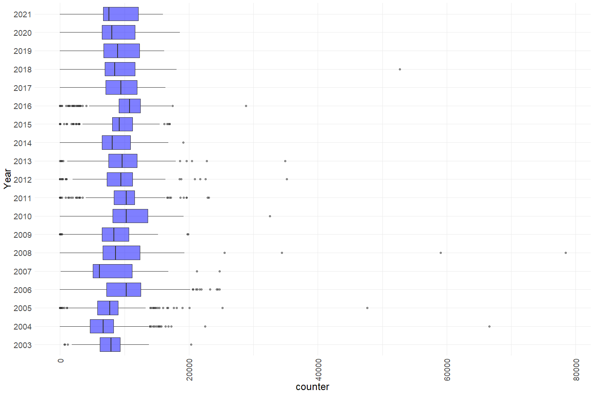<!-- -->

**Numeric Summary of counter over Period of Record**

``` r
summary(cleaner_rst_environmental$counter)
```

    ##    Min. 1st Qu.  Median    Mean 3rd Qu.    Max.    NA's 
    ##       0    6610    8817    8918   11444   78428     269

**NA and Unknown Values**

-   3.5 % of values in the `counter` column are NA.

### Variables: `flow_start_meter`, `flow_end_meter`

The read out number on the mechanical counter of the flow meter at the
start and end of the velocity

**Plotting distribution of flow start meter and flow end meter**

``` r
cleaner_rst_environmental %>% 
  ggplot() +
  geom_histogram(aes(x = flow_start_meter), fill = "blue", alpha = .5) +
  geom_histogram(aes(x = flow_end_meter), fill = "blue", alpha = .5) +
  theme_minimal() + 
  theme(text = element_text(size = 18),
        axis.text.x = element_text(angle = 90, vjust = 0.5, hjust=1)) + 
  labs(x = "Flow Start and End Meter Numbers")
```

    ## `stat_bin()` using `bins = 30`. Pick better value with `binwidth`.
    ## `stat_bin()` using `bins = 30`. Pick better value with `binwidth`.

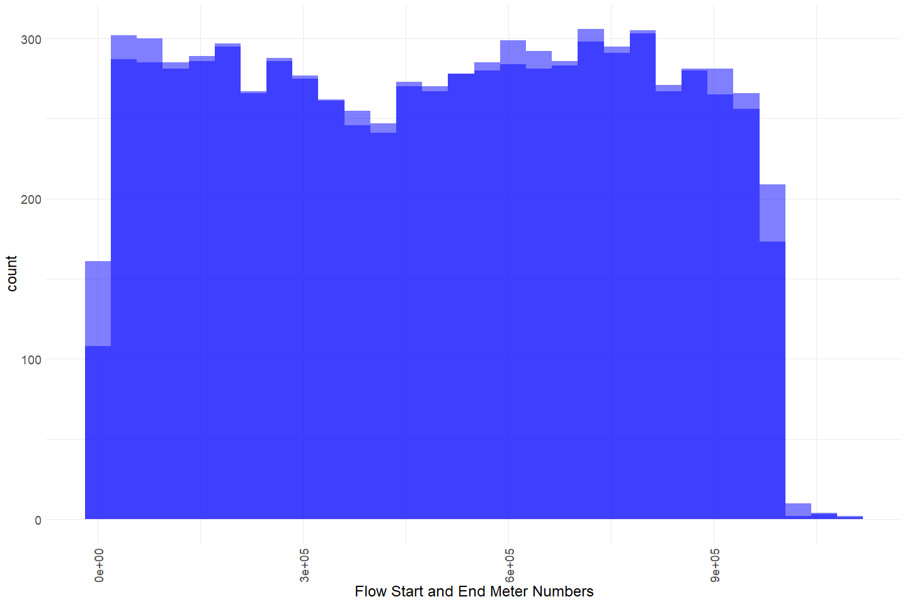<!-- -->

Start times and end times appear to have a similar distribution.

**Numeric Summary**

``` r
summary(cleaner_rst_environmental$flow_start_meter)
```

    ##    Min. 1st Qu.  Median    Mean 3rd Qu.    Max.    NA's 
    ##       0  240000  500400  493575  742375 1099600     266

``` r
summary(cleaner_rst_environmental$flow_end_meter)
```

    ##       Min.    1st Qu.     Median       Mean    3rd Qu.       Max.       NA's 
    ## -1.050e+09  2.522e+05  5.187e+05  9.682e+08  7.656e+05  8.292e+10        268

**NA and Unknown Values**

-   3.5 % of values in the `flow_start_meter` column are NA.
-   3.5 % of values in the `flow_end_meter` column are NA.

### Variable: `flow_set_time`

How long the General Oceanics mechanical flow meter (Oceanic ® Model
2030) was in the water taking a reading, used to calculate water
velocity in front of the cone

Time is in seconds

**Plotting distribution of flow set time**

``` r
cleaner_rst_environmental %>% 
  ggplot() +
  geom_histogram(aes(x = flow_set_time)) +
  theme_minimal() +
  theme(text = element_text(size = 18),
        axis.text.x = element_text(angle = 90, vjust = 0.5, hjust=1)) 
```

    ## `stat_bin()` using `bins = 30`. Pick better value with `binwidth`.

<!-- -->

Flow set times appear mainly between 100 and 1000 with some values up to
almost 4500.

**Numeric Summary of flow set time over Period of Record**

``` r
summary(cleaner_rst_environmental$flow_set_time)
```

    ##       Min.    1st Qu.     Median       Mean    3rd Qu.       Max.       NA's 
    ## -2.183e+09  3.000e+02  3.000e+02 -5.114e+07  3.600e+02  4.394e+03        270

**NA and Unknown Values**

-   3.6 % of values in the `flow_set_time` column are NA.

### Variable: `velocity_ft_per_s`

Calculated water velocity\_ft\_per\_s in front of the cone using a
General Oceanics mechanical flow meter (Oceanic ® Model 2030) = (
(Flowmeter end - flow meter begin)/time in seconds)\*.0875

**Plotting distribution of velocity\_ft\_per\_s**

``` r
cleaner_rst_environmental %>% 
  filter(velocity_ft_per_s < 25) %>% # filter out values greater than 25
  ggplot() +
  geom_histogram(aes(x = velocity_ft_per_s), fill = "blue", alpha = .5) +
  theme_minimal() + 
  theme(text = element_text(size = 18),
        axis.text.x = element_text(angle = 90, vjust = 0.5, hjust=1)) 
```

    ## `stat_bin()` using `bins = 30`. Pick better value with `binwidth`.

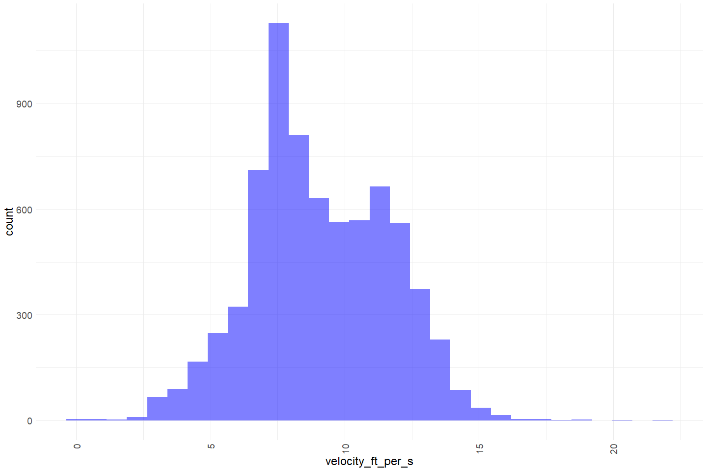<!-- -->

``` r
cleaner_rst_environmental %>%
  mutate(wy = factor(ifelse(month(sample_date) %in% 10:12, year(sample_date) + 1, year(sample_date))),
         fake_year = 2000,
         fake_year = ifelse(month(sample_date) %in% 10:12, fake_year - 1, fake_year),
         fake_date = ymd(paste(fake_year, month(sample_date), day(sample_date)))) %>%
  ggplot(aes(x = fake_date, y = velocity_ft_per_s)) +
  scale_x_date(date_breaks = "3 month", date_labels = "%b") +
  geom_line(size = 0.5) +
  xlab("") +
  facet_wrap(~wy, scales = "free") + 
  theme_minimal()
```

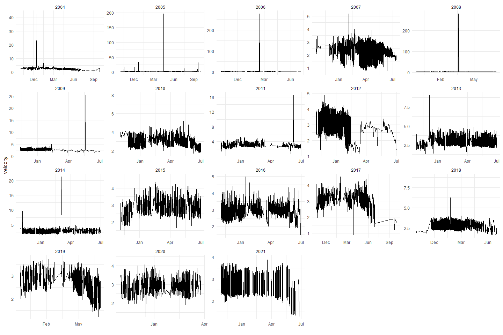<!-- -->

A lot of outliers are shown. These are clear because they create a large
spike and make the other velocity\_ft\_per\_s measurements difficult to
see.

**Numeric Summary of velocity\_ft\_per\_s**

``` r
summary(cleaner_rst_environmental$velocity_ft_per_s)
```

    ##     Min.  1st Qu.   Median     Mean  3rd Qu.     Max.     NA's 
    ##   0.0984   7.3166   8.7603   9.5219  11.0898 921.1736      278

A velocity\_ft\_per\_s of 750 seems out of the range of possibilities.
It seems like every velocity\_ft\_per\_s greater than 7 is probably a
mistake that should be scaled down or filtered out.

**NA and Unknown Values**

-   3.7 % of values in the `velocity_ft_per_s` column are NA.

### Variable: `turbidity`

Turbidity result from a grab sample taken at the trap on the SampleDate
and SampleTime

**Plotting distribution of turbidity**

``` r
cleaner_rst_environmental %>% 
  filter(counter < 200) %>% # filter out values < 200
  ggplot() +
  geom_histogram(aes(x = turbidity), fill = "blue", alpha = .5) +
  theme_minimal() + 
  theme(text = element_text(size = 18),
        axis.text.x = element_text(angle = 90, vjust = 0.5, hjust=1)) 
```

    ## `stat_bin()` using `bins = 30`. Pick better value with `binwidth`.

<!-- -->

``` r
cleaner_rst_environmental %>% 
  group_by(date = as.Date(sample_date)) %>%
  mutate(avg_turbidity_ntu = mean(turbidity)) %>%
  filter(avg_turbidity_ntu < 100) %>%
  ungroup() %>%
  ggplot() + 
  geom_boxplot(aes(x = as.factor(month(date)), y = avg_turbidity_ntu)) + 
  # facet_wrap(~year(date), scales = "free") + 
  # scale_x_date(labels = date_format("%b"), date_breaks = "1 month") + 
  theme_minimal() + 
  theme(text = element_text(size = 15),
        axis.text.x = element_text(angle = 90, vjust = 0.5, hjust=1),
        legend.position = "none") + 
  labs(title = "Daily Turbidity Measures sumarized by month",
       x = "Month", 
       y = "Average Daily Turbidity NTUs")  
```

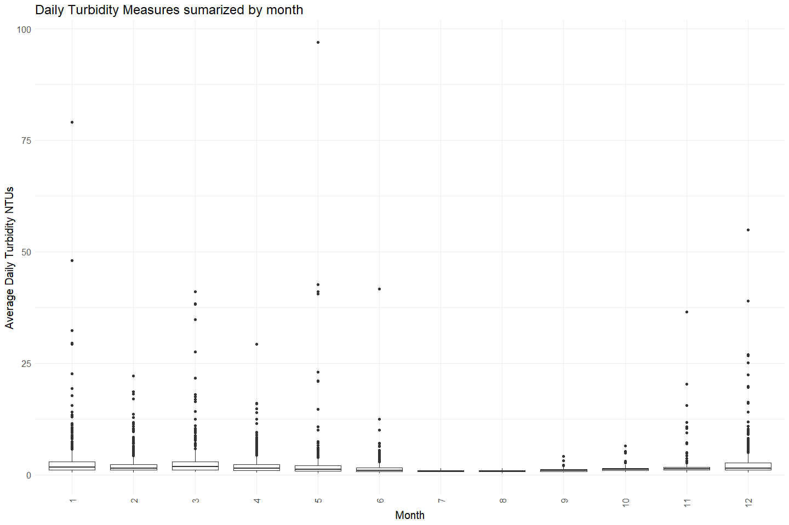<!-- -->

``` r
cleaner_rst_environmental %>%
  mutate(wy = factor(ifelse(month(sample_date) %in% 10:12, year(sample_date) + 1, year(sample_date))),
         fake_year = 2000,
         fake_year = ifelse(month(sample_date) %in% 10:12, fake_year - 1, fake_year),
         fake_date = ymd(paste(fake_year, month(sample_date), day(sample_date)))) %>%
  ggplot(aes(x = fake_date, y = turbidity)) +
  scale_x_date(date_breaks = "3 month", date_labels = "%b") +
  geom_line(size = 0.5) +
  xlab("") +
  facet_wrap(~wy, scales = "free") + theme_minimal()
```

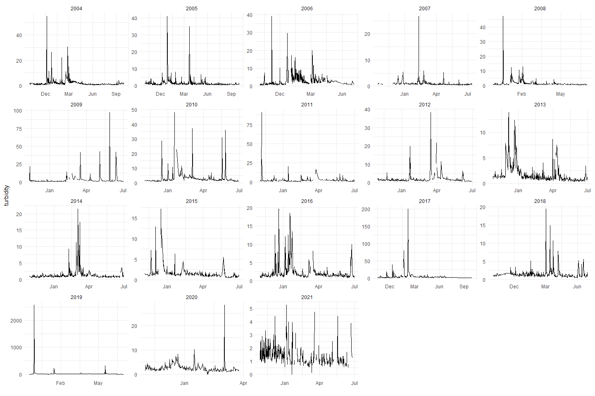<!-- -->

Most turbidity measures are low but a few outliers going up until over
2500. This seems WAY too high! Should probably be scaled down or
removed.

**Numeric Summary of turbidity over Period of Record**

``` r
summary(cleaner_rst_environmental$turbidity)
```

    ##    Min. 1st Qu.  Median    Mean 3rd Qu.    Max.    NA's 
    ##    0.00    0.93    1.35    2.81    2.20 2564.00     246

**NA and Unknown Values**

-   3.2 % of values in the `turbidity` column are NA.

### Variables: `cone`

Definition `cone`: Was the trap fished at cone full-cone (1.0) or
half-cone (0.5) setting  
(same as `sample_weight` column removed above)

**Plotting distribution of cone**

``` r
cleaner_rst_environmental %>% 
  ggplot() +
  geom_histogram(aes(x = cone), fill = "blue", alpha = .5) +
  theme_minimal() + 
  theme(text = element_text(size = 18),
        axis.text.x = element_text(angle = 90, vjust = 0.5, hjust=1)) 
```

    ## `stat_bin()` using `bins = 30`. Pick better value with `binwidth`.

<!-- -->

All sample weights and cone measures are either .5 o 1.

**Numeric Summary of cone over Period of Record**

``` r
summary(cleaner_rst_environmental$cone)
```

    ##    Min. 1st Qu.  Median    Mean 3rd Qu.    Max.    NA's 
    ##  0.5000  0.5000  0.5000  0.5946  0.5000  1.0000     125

**NA and Unknown Values**

-   1.6 % of values in the `cone` column are NA.

### Variable: `river_left_depth`, `river_right_depth`, `river_center_depth`

Unit for depth is feet, definitions of measurements are:

-   River depth from directly in the center of cone off crossbeam \#2
    (cone crossbeam)  
-   River depth from inside of the river left (facing down stream)
    pontoon off crossbeam \#2 (cone crossbeam)  
-   River depth from inside of the river right (facing down stream)
    pontoon off crossbeam \#2 (cone crossbeam)

**Plotting distribution of depth measures**

``` r
depth_1 <- cleaner_rst_environmental %>% 
  # filter(counter < 200) %>% # filter out values < 200
  ggplot() +
  geom_histogram(aes(x = river_left_depth), fill = "blue", alpha = .5) +
  geom_histogram(aes(x = river_center_depth), fill = "gray", alpha = .75) +
  geom_histogram(aes(x = river_right_depth), fill = "green", alpha = .5) +
  theme_minimal() + 
  theme(text = element_text(size = 18),
        axis.text.x = element_text(angle = 90, vjust = 0.5, hjust=1)) +
  labs(x = "River Depth: left (blue), right (green), and center (gray)")

depth_2 <- cleaner_rst_environmental %>% 
  filter(river_right_depth > 1) %>% # filter out values < 200
  ggplot() +
  geom_histogram(aes(x = river_left_depth), fill = "blue", alpha = .5) +
  geom_histogram(aes(x = river_center_depth), fill = "gray", alpha = .75) +
  geom_histogram(aes(x = river_right_depth), fill = "green", alpha = .5) +
  theme_minimal() + 
  theme(text = element_text(size = 18),
        axis.text.x = element_text(angle = 90, vjust = 0.5, hjust=1)) +
  labs(x = "River Depth: left (blue), right (green), and center (gray)",
       title = "Filtered Depth Distribution")
gridExtra::grid.arrange(depth_1, depth_2)
```

    ## `stat_bin()` using `bins = 30`. Pick better value with `binwidth`.
    ## `stat_bin()` using `bins = 30`. Pick better value with `binwidth`.
    ## `stat_bin()` using `bins = 30`. Pick better value with `binwidth`.
    ## `stat_bin()` using `bins = 30`. Pick better value with `binwidth`.
    ## `stat_bin()` using `bins = 30`. Pick better value with `binwidth`.
    ## `stat_bin()` using `bins = 30`. Pick better value with `binwidth`.

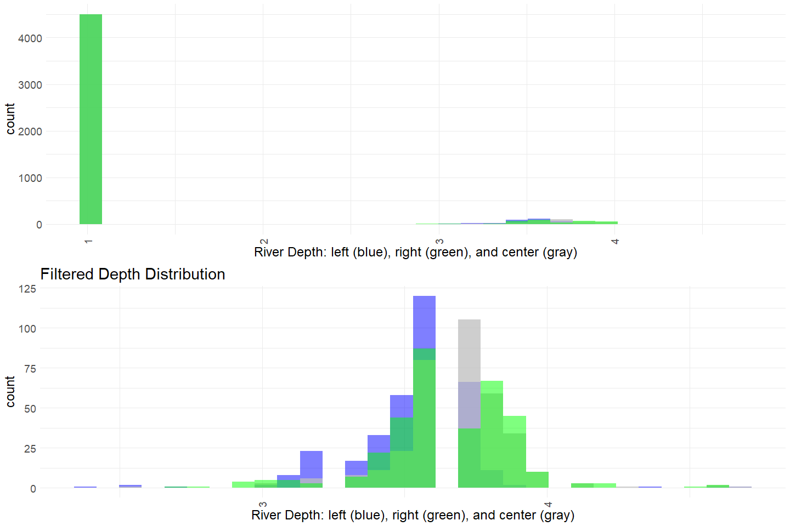<!-- -->

**Numeric Summary of river depth over Period of Record**

``` r
summary(cleaner_rst_environmental$river_left_depth)
```

    ##    Min. 1st Qu.  Median    Mean 3rd Qu.    Max.    NA's 
    ##   1.000   1.000   1.000   1.181   1.000   4.700    2742

``` r
summary(cleaner_rst_environmental$river_center_depth)
```

    ##    Min. 1st Qu.  Median    Mean 3rd Qu.    Max.    NA's 
    ##   1.000   1.000   1.000   1.192   1.000   4.700    2744

``` r
summary(cleaner_rst_environmental$river_right_depth)
```

    ##    Min. 1st Qu.  Median    Mean 3rd Qu.    Max.    NA's 
    ##    1.00    1.00    1.00    1.19    1.00    4.60    2742

**NA and Unknown Values**

-   36.1 % of values in the `river_left_depth` column are NA.
-   36.2 % of values in the `river_center_depth` column are NA.
-   36.1 % of values in the `river_right_depth` column are NA.

### Variable: `depth_adjust`

The depth of the bottom of the cone (measured in Inches) Depth in
relation to the cone (not to the surface of the water) - not sure how it
is used.

**Plotting distribution of depth adjustment**

``` r
cleaner_rst_environmental %>% 
  # filter(counter < 25000) %>% # filter out 5 values > 25000
  ggplot() +
  geom_histogram(aes(x = depth_adjust), fill = "blue", alpha = .5, binwidth = 1) +
  theme_minimal() + 
  theme(text = element_text(size = 18),
        axis.text.x = element_text(angle = 90, vjust = 0.5, hjust=1)) 
```

<!-- -->

``` r
cleaner_rst_environmental %>% 
  ggplot() +
  geom_boxplot(aes(x = depth_adjust, y = as.factor(year(sample_date))), fill = "blue", alpha = .5) +
  theme_minimal() + 
  theme(text = element_text(size = 18),
        axis.text.x = element_text(angle = 90, vjust = 0.5, hjust=1)) +
  labs(y = "Year")
```

<!-- -->
Looks like depth adjust varies by year depending on how the trap was
positioned.

**Numeric Summary of depth adjustment over Period of Record**

``` r
summary(cleaner_rst_environmental$depth_adjust)
```

    ##    Min. 1st Qu.  Median    Mean 3rd Qu.    Max.    NA's 
    ##   23.00   27.00   28.00   27.65   28.00   38.00     288

**NA and Unknown Values**

-   3.8 % of values in the `depth_adjust` column are NA.

### Variable: `debris_tubs`

The number of 10-g tubs of debris removed from the trap during the
sample period (volumetrically)  
**Plotting distribution of debris\_tubs**

``` r
cleaner_rst_environmental %>% 
  # filter(counter < 25000) %>% # filter out 5 values > 25000
  ggplot() +
  geom_histogram(aes(x = debris_tubs), fill = "blue", alpha = .5) +
  theme_minimal() + 
  theme(text = element_text(size = 18),
        axis.text.x = element_text(angle = 90, vjust = 0.5, hjust=1)) 
```

    ## `stat_bin()` using `bins = 30`. Pick better value with `binwidth`.

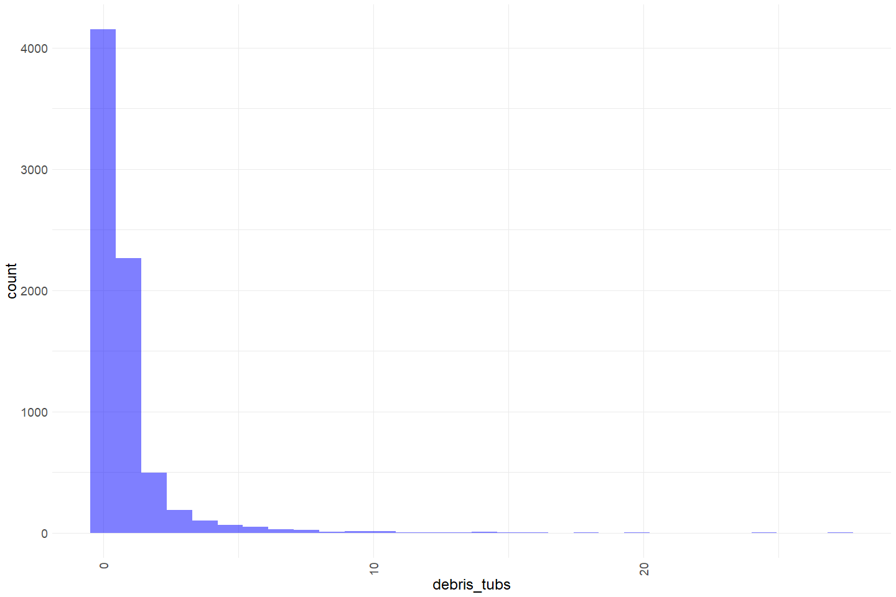<!-- -->

``` r
cleaner_rst_environmental %>% 
  ggplot() +
  geom_boxplot(aes(x = debris_tubs, y = as.factor(month(sample_date))), fill = "blue", alpha = .5) +
  theme_minimal() + 
  theme(text = element_text(size = 18),
        axis.text.x = element_text(angle = 90, vjust = 0.5, hjust=1)) +
  labs(y = "Year")
```

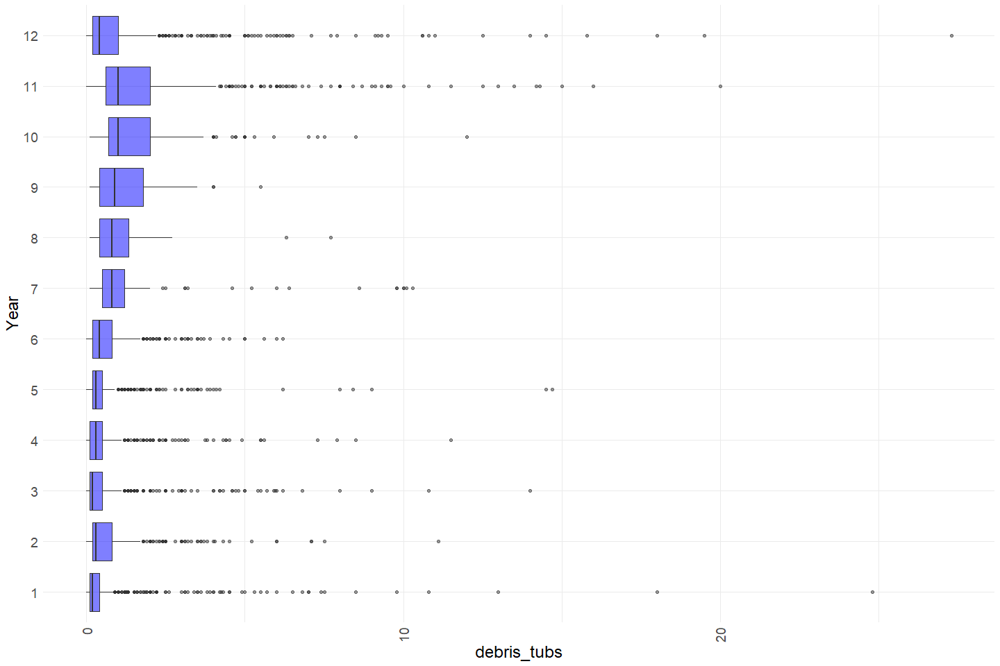<!-- -->

Debris look a bit higher in the late fall early winter months

**Numeric Summary of debris over Period of Record**

``` r
summary(cleaner_rst_environmental$debris_tubs)
```

    ##    Min. 1st Qu.  Median    Mean 3rd Qu.    Max.    NA's 
    ##  0.0000  0.2000  0.4000  0.8189  0.8375 27.3000     170

**NA and Unknown Values**

-   2.2 % of values in the `debris_tubs` column are NA.

### Variable: `avg_time_per_rev`

The average time per cone rotation (average of three rotations) - units
are seconds

**Plotting distribution of average time per revolution**

``` r
cleaner_rst_environmental %>% 
  # filter(counter < 25000) %>% # filter out 5 values > 25000
  ggplot() +
  geom_histogram(aes(x = avg_time_per_rev), fill = "blue", alpha = .5) +
  theme_minimal() + 
  theme(text = element_text(size = 18),
        axis.text.x = element_text(angle = 90, vjust = 0.5, hjust=1)) 
```

    ## `stat_bin()` using `bins = 30`. Pick better value with `binwidth`.

<!-- -->

``` r
cleaner_rst_environmental %>% 
  ggplot() +
  geom_boxplot(aes(x = avg_time_per_rev, y = as.factor(year(sample_date))), fill = "blue", alpha = .5) +
  theme_minimal() + 
  theme(text = element_text(size = 18),
        axis.text.x = element_text(angle = 90, vjust = 0.5, hjust=1)) +
  labs(y = "Year")
```

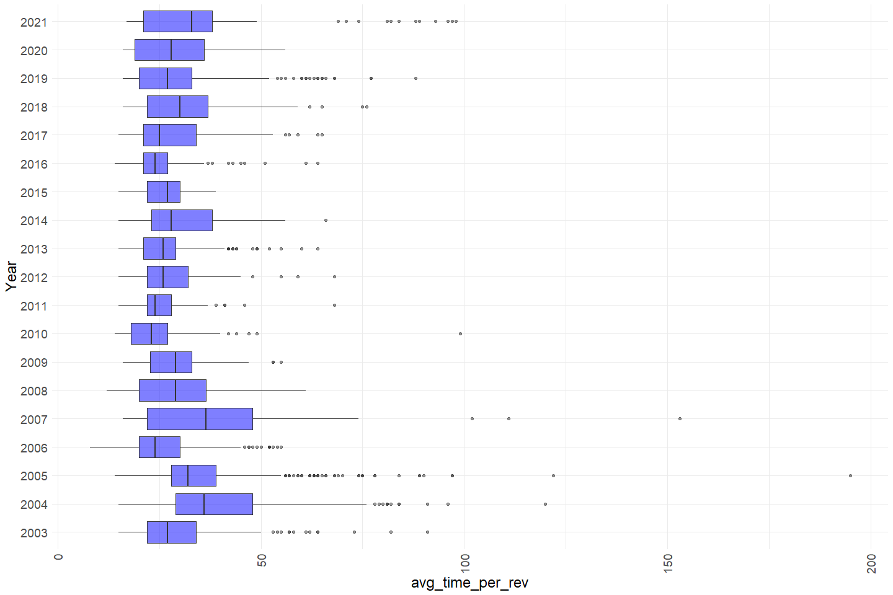<!-- -->

**Numeric Summary of average time per rev over Period of Record**

``` r
summary(cleaner_rst_environmental$avg_time_per_rev)
```

    ##    Min. 1st Qu.  Median    Mean 3rd Qu.    Max.    NA's 
    ##    8.00   22.00   27.00   29.81   35.00  195.00     236

**NA and Unknown Values**

-   3.1 % of values in the `avg_time_per_rev` column are NA.

### Variable: `baileys_eff`

Trap Efficiency = (Recaptured+1)/(Released+1); used to calculate daily
passage

**Plotting distribution of baileys\_eff**

``` r
cleaner_rst_environmental %>% 
  # filter(counter < 25000) %>% # filter out 5 values > 25000
  ggplot() +
  geom_histogram(aes(x = baileys_eff), fill = "blue", alpha = .5) +
  theme_minimal() + 
  theme(text = element_text(size = 18),
        axis.text.x = element_text(angle = 90, vjust = 0.5, hjust=1)) 
```

    ## `stat_bin()` using `bins = 30`. Pick better value with `binwidth`.

<!-- -->

``` r
cleaner_rst_environmental %>% 
  ggplot() +
  geom_boxplot(aes(x = baileys_eff, y = as.factor(year(sample_date))), fill = "blue", alpha = .5) +
  theme_minimal() + 
  theme(text = element_text(size = 18),
        axis.text.x = element_text(angle = 90, vjust = 0.5, hjust=1)) +
  labs(y = "Year")
```

<!-- -->

**Numeric Summary of baileys efficiency over Period of Record**

``` r
summary(cleaner_rst_environmental$baileys_eff)
```

    ##    Min. 1st Qu.  Median    Mean 3rd Qu.    Max. 
    ## 0.01810 0.04550 0.07160 0.07396 0.09640 0.27540

**NA and Unknown Values**

-   0 % of values in the `baileys_eff` column are NA.

### Variable: `num_released`

Number fish released

**Plotting distribution of number released**

``` r
cleaner_rst_environmental %>% 
  # filter(counter < 25000) %>% # filter out 5 values > 25000
  ggplot() +
  geom_histogram(aes(x = num_released), fill = "blue", alpha = .5) +
  theme_minimal() + 
  theme(text = element_text(size = 18),
        axis.text.x = element_text(angle = 90, vjust = 0.5, hjust=1)) 
```

    ## `stat_bin()` using `bins = 30`. Pick better value with `binwidth`.

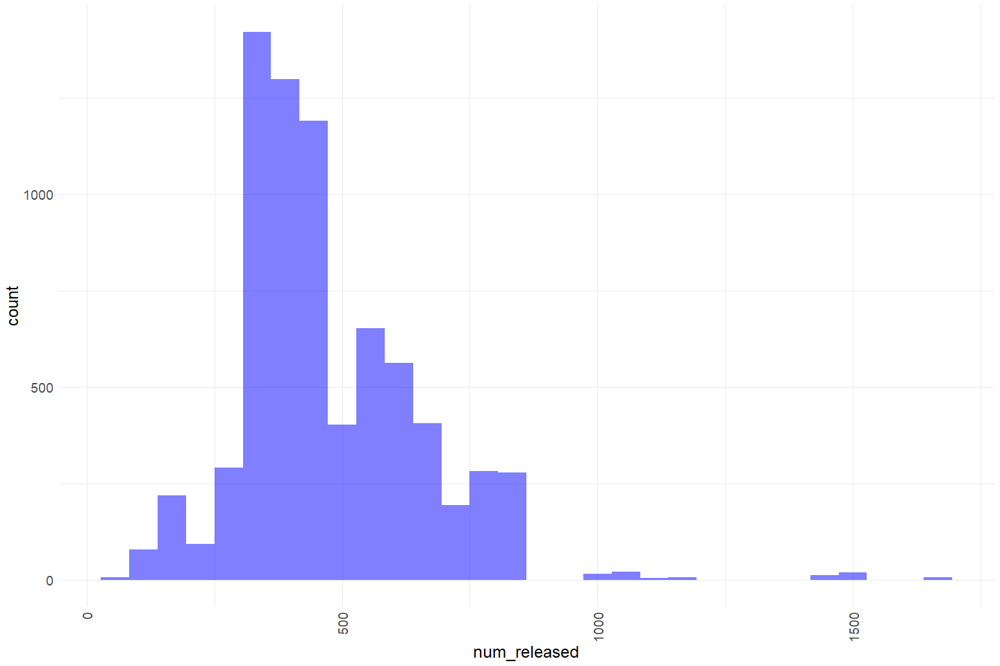<!-- -->

``` r
cleaner_rst_environmental %>% 
  ggplot() +
  geom_boxplot(aes(x = num_released, y = as.factor(year(sample_date))), fill = "blue", alpha = .5) +
  theme_minimal() + 
  theme(text = element_text(size = 18),
        axis.text.x = element_text(angle = 90, vjust = 0.5, hjust=1)) +
  labs(y = "Year")
```

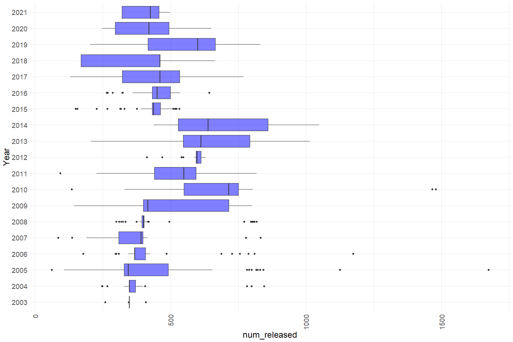<!-- -->

**Numeric Summary of num\_released over Period of Record**

``` r
summary(cleaner_rst_environmental$num_released)
```

    ##    Min. 1st Qu.  Median    Mean 3rd Qu.    Max.    NA's 
    ##    62.0   348.0   437.0   471.7   549.0  1673.0     132

**NA and Unknown Values**

-   1.7 % of values in the `num_released` column are NA.

### Variable: `start_counter`

Beginning cone revolution counter number, usually zero.

All values either 0 or NA.

**Numeric Summary of start\_counter over Period of Record**

``` r
summary(cleaner_rst_environmental$start_counter)
```

    ##    Min. 1st Qu.  Median    Mean 3rd Qu.    Max.    NA's 
    ##       0       0       0       0       0       0    7116

**NA and Unknown Values**

-   93.8 % of values in the `start_counter` column are NA.

## Explore Categorical variables:

``` r
cleaner_rst_environmental %>% select_if(is.character) %>% colnames
```

    ##  [1] "station_code"        "sample_id"           "weather_code"       
    ##  [4] "lunar_phase"         "trap_sample_type"    "habitat"            
    ##  [7] "thalweg"             "diel"                "debris_type"        
    ## [10] "fish_properly"       "sub_week"            "trap_comments"      
    ## [13] "gear_condition_code" "trap_fishing"        "partial_sample"

### Variable: `station_code`

The station code, two stations Lower Clear Creek (LCC) and Upper Clear
Creek (UCC)

``` r
table(cleaner_rst_environmental$station_code)
```

    ## 
    ##  LCC  UCC 
    ## 4100 3488

**NA and Unknown Values**

-   0 % of values in the `station_code` column are NA.

### Variable: `sample_id`

The calendar year Julian date and year code for that \~24-h sample
period (ddd\_yy)

``` r
nrow(cleaner_rst_environmental) == length(unique(cleaner_rst_environmental$sample_id))
```

    ## [1] FALSE

There are 4145 unique sample IDs.

**NA and Unknown Values**

-   0 % of values in the `sample_id` column are NA.

### Variable: `weather_code`

A code for the weather conditions on the SampleDate and SampleTime. See
VariableCodesLookUp table

| code | description   |
|------|---------------|
| CLR  | sunny         |
| RAN  | precipitation |
| FOG  | foggy         |
| CLD  | overcast      |

``` r
table(cleaner_rst_environmental$weather_code) 
```

    ## 
    ##     CLD     CLR     FOG     N/P    PCLD    RAIN     RAN WIN/CLR WIN/RAN   WINDY 
    ##    1323    4754      37       1     544       1     755       2       1      37

Fix inconsistencies with spelling, capitalization, and abbreviations.

``` r
cleaner_rst_environmental$weather_code <- case_when(
  cleaner_rst_environmental$weather_code %in% c("CLD", "cld", "CLOUDY") ~ "cloudy", 
  cleaner_rst_environmental$weather_code == "CLR" ~ "clear",
  cleaner_rst_environmental$weather_code == "FOG" ~ "fog", 
  cleaner_rst_environmental$weather_code == "PCLD" ~ "partially cloudy", 
  cleaner_rst_environmental$weather_code %in% c("RAN", "RAIN") ~ "precipitation",
  cleaner_rst_environmental$weather_code == "WIN/CLR" ~ "windy and clear",
  cleaner_rst_environmental$weather_code == "WIN/RAN" ~ "windy and precipitation",
  cleaner_rst_environmental$weather_code == "WINDY" ~ "windy"
)

table(cleaner_rst_environmental$weather_code) 
```

    ## 
    ##                   clear                  cloudy                     fog 
    ##                    4754                    1323                      37 
    ##        partially cloudy           precipitation                   windy 
    ##                     544                     756                      37 
    ##         windy and clear windy and precipitation 
    ##                       2                       1

**NA and Unknown Values**

-   1.8 % of values in the `weather_code` column are NA.

### Variable: `lunar_phase`

Stage of the Moon on the SampleDate and SampleTime, from:
<http://aa.usno.navy.mil/data/docs/MoonFraction.php>. See
VariableCodesLookUp table

``` r
table(cleaner_rst_environmental$lunar_phase) 
```

    ## 
    ##    F    H    N 
    ## 1850 3775 1820

Fix inconsistencies with spelling, capitalization, and abbreviations.

``` r
cleaner_rst_environmental$lunar_phase <- case_when(
  cleaner_rst_environmental$lunar_phase == "F" ~ "full", 
  cleaner_rst_environmental$lunar_phase == "H" ~ "half", 
  cleaner_rst_environmental$lunar_phase == "N" ~ "new"
)

table(cleaner_rst_environmental$lunar_phase) 
```

    ## 
    ## full half  new 
    ## 1850 3775 1820

**NA and Unknown Values**

-   1.9 % of values in the `lunar_phase` column are NA.

### Variable: `trap_sample_type`

The type of sample regime, see VariableCodesLookUp table

| code | definition     |
|------|----------------|
| N    | non-intensive  |
| I    | intensive      |
| S    | sunrise-sunset |
| R    | random         |

``` r
table(cleaner_rst_environmental$trap_sample_type) 
```

    ## 
    ##    I    N  N/P    R    S 
    ##    8 7414    1   36    1

Fix inconsistencies with spelling, capitalization, and abbreviations.

``` r
cleaner_rst_environmental$trap_sample_type <- case_when(
  cleaner_rst_environmental$trap_sample_type == "N" ~ "non-intensive",
  cleaner_rst_environmental$trap_sample_type == "R" ~ "random",
  cleaner_rst_environmental$trap_sample_type == "I" ~ "intensive",
  cleaner_rst_environmental$trap_sample_type == "S" ~ "sunrise-sunset"
)

table(cleaner_rst_environmental$trap_sample_type) 
```

    ## 
    ##      intensive  non-intensive         random sunrise-sunset 
    ##              8           7414             36              1

**NA and Unknown Values**

-   1.7 % of values in the `trap_sample_type` column are NA.

### Variable: `habitat`

The type of flow habitat the trap fished in, see VariableCodesLookUp
table

| code | definition     |
|------|----------------|
| P    | plunge pool    |
| R    | run            |
| G    | glide          |
| B    | backwater pool |
| L    | lateral flood  |

``` r
table(cleaner_rst_environmental$habitat) 
```

    ## 
    ##    G    R 
    ##   15 7444

Fix inconsistencies with spelling, capitalization, and abbreviations.

``` r
cleaner_rst_environmental$habitat <- case_when(
  cleaner_rst_environmental$habitat == "G" ~ "glide",
  cleaner_rst_environmental$habitat == "R" ~ "run"
)

table(cleaner_rst_environmental$habitat) 
```

    ## 
    ## glide   run 
    ##    15  7444

**NA and Unknown Values**

-   1.7 % of values in the `habitat` column are NA.

### Variable: `thalweg`

Was trap fishing in the thalweg at SampleDate and SampleTime

``` r
table(cleaner_rst_environmental$thalweg) 
```

    ## 
    ##    N    Y 
    ##   63 7392

Fix inconsistencies with spelling, capitalization, and abbreviations.

``` r
cleaner_rst_environmental$thalweg <- case_when(
  cleaner_rst_environmental$thalweg == "Y" ~ TRUE, 
  cleaner_rst_environmental$thalweg == "N" ~ FALSE
)

table(cleaner_rst_environmental$thalweg) 
```

    ## 
    ## FALSE  TRUE 
    ##    63  7392

**NA and Unknown Values**

-   1.8 % of values in the `thalweg` column are NA.

### Variable: `diel`

The time of day relative to the sun, see VariableCodesLookUp table

| code | definition   |
|------|--------------|
| C1   | pre-sunrise  |
| C2   | post-sunrise |
| C3   | pre-sunset   |
| C4   | post-sunset  |
| D    | day          |
| N    | night        |

``` r
table(cleaner_rst_environmental$diel) 
```

    ## 
    ##   D 
    ## 347

Fix inconsistencies with spelling, capitalization, and abbreviations.

``` r
cleaner_rst_environmental$diel <- case_when(cleaner_rst_environmental$diel == "D" ~ "day", 
                                            cleaner_rst_environmental$diel == "N" ~ "night", 
                                            cleaner_rst_environmental$diel == "C1" ~ "pre-sunrise")
table(cleaner_rst_environmental$diel) 
```

    ## 
    ## day 
    ## 347

**NA and Unknown Values**

-   95.4 % of values in the `diel` column are NA.

### Variable: `debris_type`

The type of debris found in the live-box, see VariableCodesLookUp table

| code | definition          |
|------|---------------------|
| a    | aquatic vegetation  |
| l    | large woody debris  |
| s    | sticks              |
| al   | veg + wood          |
| as   | veg + sticks        |
| ls   | wood + sticks       |
| als  | veg + wood + sticks |

``` r
table(cleaner_rst_environmental$debris_type) 
```

    ## 
    ##    a    A   AL  als  ALS   as   AS    L   ls   LS    S 
    ##   60  712   32  220 6065  246    5   10   10   80    1

Fix inconsistencies with spelling, capitalization, and abbreviations.

``` r
cleaner_rst_environmental$debris_type <- tolower(cleaner_rst_environmental$debris_type)
table(cleaner_rst_environmental$debris_type) 
```

    ## 
    ##    a   al  als   as    l   ls    s 
    ##  772   32 6285  251   10   90    1

**Create lookup rda for gear debris encoding:**

``` r
# View description of domain for viewing condition 
clear_rst_debris_type <- c('a','l','s','al','as','ls','als')
names(clear_rst_debris_type) <- c(
  "aquatic vegetation",
  "large woody debris",
  "sticks",
  "veg + wood",
  "veg + sticks",
  "wood + sticks",
  "veg + wood + sticks")
# write_rds(clear_rst_debris_type, "../../../data/clear_rst_debris_type.rds")
tibble(code = clear_rst_debris_type, 
       definitions = names(clear_rst_debris_type))
```

    ## # A tibble: 7 x 2
    ##   code  definitions        
    ##   <chr> <chr>              
    ## 1 a     aquatic vegetation 
    ## 2 l     large woody debris 
    ## 3 s     sticks             
    ## 4 al    veg + wood         
    ## 5 as    veg + sticks       
    ## 6 ls    wood + sticks      
    ## 7 als   veg + wood + sticks

**NA and Unknown Values**

-   1.9 % of values in the `debris_type` column are NA.

### Variable: `fish_properly`

Was there a problem with the trap at SampleDate and SampleTime

``` r
table(cleaner_rst_environmental$fish_properly) 
```

    ## 
    ##    N    Y 
    ##  315 6799

Fix inconsistencies with spelling, capitalization, and abbreviations.

``` r
cleaner_rst_environmental$fish_properly <- case_when(
  cleaner_rst_environmental$fish_properly == "Y" ~ TRUE, 
  cleaner_rst_environmental$fish_properly == "N" ~ FALSE
)

table(cleaner_rst_environmental$fish_properly) 
```

    ## 
    ## FALSE  TRUE 
    ##   315  6799

**NA and Unknown Values**

-   6.2 % of values in the `fish_properly` column are NA.

### Variable: `sub_week`

If sample week has more than one efficiency, which part of week is
sample from  
TODO figure out what each one stands for

``` r
table(cleaner_rst_environmental$sub_week) 
```

    ## 
    ##    A    B    C 
    ## 7227  342   19

**NA and Unknown Values**

-   0 % of values in the `sub_week` column are NA.

### Variable: `trap_comments`

``` r
unique(cleaner_rst_environmental$trap_comments)[1:5]
```

    ## [1] "no counter"                                                                                                  
    ## [2] "no cunter"                                                                                                   
    ## [3] "Flow bomb not working, checked at trailer and everything fine, liquid must have leaded out in route to trap."
    ## [4] NA                                                                                                            
    ## [5] "CHN 32 mm is a sac-fry"

**NA and Unknown Values**

-   77.8 % of values in the `trap_comments` column are NA.

### Variable: `gear_condition_code`

A code for the condition of the trap on the SampleDate and SampleTime;
see VariableCodesLookUp table

| code | definition    |
|------|---------------|
| n    | normal        |
| pb   | partial block |
| tb   | total block   |
| nr   | not rotating  |

``` r
table(cleaner_rst_environmental$gear_condition_code) 
```

    ## 
    ##   N  NR 
    ## 339   8

Fix inconsistencies with spelling, capitalization, and abbreviations.

``` r
cleaner_rst_environmental$gear_condition_code <- case_when(
  cleaner_rst_environmental$gear_condition_code == "BP" ~ "partial block",
  cleaner_rst_environmental$gear_condition_code == "N" ~ "normal", 
  cleaner_rst_environmental$gear_condition_code == "NR" ~ "not rotating",
  cleaner_rst_environmental$gear_condition_code == "TB" ~ "total block"
)
```

**NA and Unknown Values**

-   95.4 % of values in the `gear_condition_code` column are NA.

### Variable: `trap_fishing`

``` r
table(cleaner_rst_environmental$trap_fishing) 
```

    ## 
    ##  No Yes 
    ## 124 348

Fix inconsistencies with spelling, capitalization, and abbreviations.

``` r
cleaner_rst_environmental$trap_fishing <- case_when(
  cleaner_rst_environmental$trap_fishing == "Yes" ~ TRUE, 
  cleaner_rst_environmental$trap_fishing == "No" ~ FALSE
)

table(cleaner_rst_environmental$trap_fishing) 
```

    ## 
    ## FALSE  TRUE 
    ##   124   348

**NA and Unknown Values**

-   93.8 % of values in the `trap_fishing` column are NA.

### Variable: `partial_sample`

``` r
table(cleaner_rst_environmental$partial_sample) 
```

    ## 
    ##  No Yes 
    ## 454  18

Fix inconsistencies with spelling, capitalization, and abbreviations.

``` r
cleaner_rst_environmental$partial_sample <- case_when(
  cleaner_rst_environmental$partial_sample == "Yes" ~ TRUE, 
  cleaner_rst_environmental$partial_sample == "No" ~ FALSE
)

table(cleaner_rst_environmental$partial_sample) 
```

    ## 
    ## FALSE  TRUE 
    ##   454    18

**NA and Unknown Values**

-   93.8 % of values in the `partial_sample` column are NA.

## Summary of identified issues

-   Need to figure out what sub\_week column values stand for. Answer
    from Mike: The sub weeks do not describe specific days of the week,
    they indicate when a stratum (usually one week) is split into
    substrata based upon the trap efficiency used for the strata or
    substrata. If a stratum is not split all days in the stratum will be
    an A. If it is split the days in the first substratum are A’s, the
    second are B’s, etc.  
-   Outliers in some of the numeric variables:
    -   velocity\_ft\_per\_s (some outliers that need to be addressed)
    -   Turbidity (some outliers that need to be addressed)
    -   Counter (some outliers that need to be addressed)
-   There are a few variables that I am unsure of how they would be used
    (ex `depth_adjust`). Asking Mike and these may not be relevant to us
    and can be filtered out.

## Next steps

-   Need to figure out what RST data variables could be used. So far RST
    environmental variables have been varied.Some variables such as
    `diel` is only available for a this datasets and could be removed.
    Other variable such as`avg_time_per_rev`, `baileys_eff`,
    `flow_start_meter`, `flow_end_meter` needs to be standardized with
    other RST environmental cone related variables.

## Save cleaned data back to google cloud

``` r
clear_rst_environmental <- cleaner_rst_environmental %>% glimpse()
```

    ## Rows: 7,588
    ## Columns: 35
    ## $ station_code        <chr> "UCC", "UCC", "UCC", "UCC", "UCC", "UCC", "UCC", "~
    ## $ sample_id           <chr> "288_03", "289_03", "290_03", "291_03", "292_03", ~
    ## $ trap_start_date     <date> 2003-10-14, 2003-10-15, 2003-10-16, 2003-10-17, 2~
    ## $ trap_start_time     <time> 10:00:00, 10:22:00, 09:59:00, 10:19:00, 09:57:00,~
    ## $ sample_date         <date> 2003-10-15, 2003-10-16, 2003-10-17, 2003-10-18, 2~
    ## $ sample_time         <time> 10:22:00, 09:59:00, 10:19:00, 09:57:00, 11:28:00,~
    ## $ counter             <dbl> NA, NA, NA, NA, NA, NA, NA, NA, NA, NA, NA, NA, NA~
    ## $ flow_start_meter    <dbl> 258000, 275000, 294000, 864000, 904000, 947400, 98~
    ## $ flow_end_meter      <dbl> 269659, 286594, 305055, 895943, 928917, 979885, 28~
    ## $ flow_set_time       <dbl> 303, 300, 302, 798, 720, 1080, 385, 300, 300, 540,~
    ## $ turbidity           <dbl> 1.5, 0.8, 0.8, 1.1, 0.7, 0.9, 0.6, 0.9, 1.0, 0.7, ~
    ## $ cone                <dbl> 1, 1, 1, 1, 1, 1, 1, 1, 1, 1, 1, 1, 1, 1, 1, 1, 1,~
    ## $ weather_code        <chr> "clear", "clear", "clear", "clear", "clear", "clea~
    ## $ lunar_phase         <chr> "half", "half", "half", "half", "half", "half", "h~
    ## $ river_left_depth    <dbl> NA, NA, NA, NA, NA, NA, NA, NA, NA, NA, NA, NA, NA~
    ## $ river_center_depth  <dbl> NA, NA, NA, NA, NA, NA, NA, NA, NA, NA, NA, NA, NA~
    ## $ river_right_depth   <dbl> NA, NA, NA, NA, NA, NA, NA, NA, NA, NA, NA, NA, NA~
    ## $ trap_sample_type    <chr> "non-intensive", "non-intensive", "non-intensive",~
    ## $ habitat             <chr> "run", "run", "run", "run", "run", "run", "run", "~
    ## $ thalweg             <lgl> TRUE, TRUE, TRUE, TRUE, TRUE, TRUE, TRUE, TRUE, TR~
    ## $ diel                <chr> NA, NA, NA, NA, NA, NA, NA, NA, NA, NA, NA, NA, NA~
    ## $ depth_adjust        <dbl> 28, 28, 26, 26, 26, 27, 26, 26, 26, 26, 26, 26, 27~
    ## $ debris_type         <chr> "als", "als", "als", "als", "als", "als", "als", "~
    ## $ debris_tubs         <dbl> 0.6, 0.5, 0.7, 1.0, 1.6, 0.8, 0.3, 0.8, 4.0, 1.9, ~
    ## $ avg_time_per_rev    <dbl> 24, 24, 23, 22, 22, 31, 22, 24, 23, 32, 22, 22, 22~
    ## $ fish_properly       <lgl> TRUE, TRUE, TRUE, TRUE, TRUE, TRUE, TRUE, TRUE, TR~
    ## $ sub_week            <chr> "A", "A", "A", "A", "A", "A", "A", "A", "A", "A", ~
    ## $ baileys_eff         <dbl> 0.1003, 0.1003, 0.1003, 0.1003, 0.1003, 0.1003, 0.~
    ## $ num_released        <dbl> 348, 348, 348, 348, 348, 348, 348, 348, 348, 348, ~
    ## $ trap_comments       <chr> "no counter", "no counter", "no counter", "no coun~
    ## $ gear_condition_code <chr> NA, NA, NA, NA, NA, NA, NA, NA, NA, NA, NA, NA, NA~
    ## $ start_counter       <dbl> NA, NA, NA, NA, NA, NA, NA, NA, NA, NA, NA, NA, NA~
    ## $ trap_fishing        <lgl> NA, NA, NA, NA, NA, NA, NA, NA, NA, NA, NA, NA, NA~
    ## $ partial_sample      <lgl> NA, NA, NA, NA, NA, NA, NA, NA, NA, NA, NA, NA, NA~
    ## $ velocity_ft_per_s   <dbl> 11.05697, 11.08978, 10.49920, 11.48350, 9.94143, 8~

``` r
# Write to google cloud 
# Name file [watershed]_[data type].csv
f <- function(input, output) write_csv(input, file = output)
gcs_upload(clear_rst_environmental,
           object_function = f,
           type = "csv",
           name = "rst/clear-creek/data/clear_rst_environmental.csv")
```
