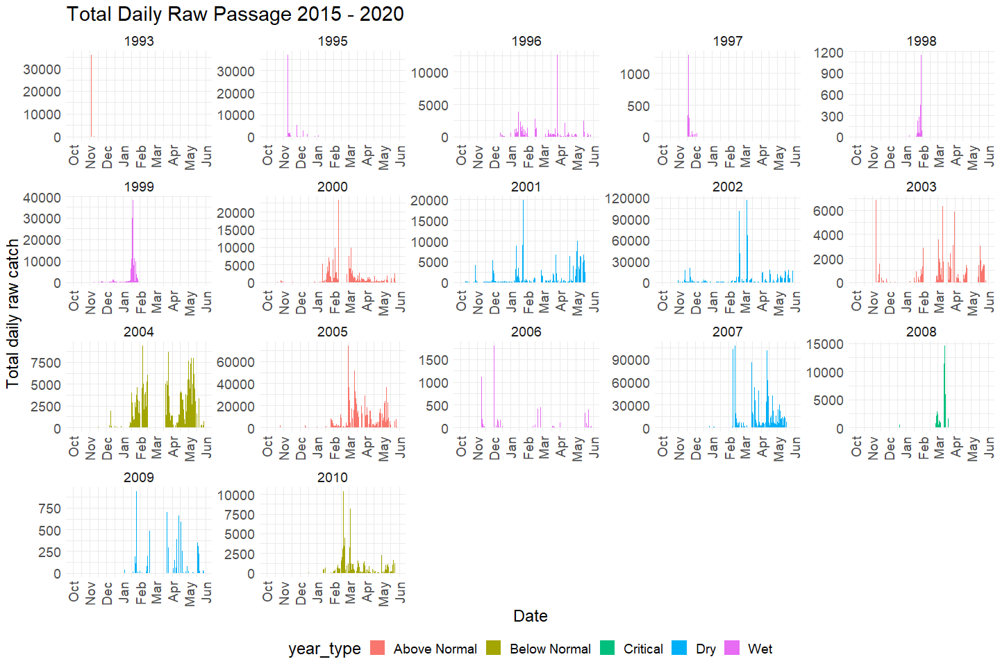
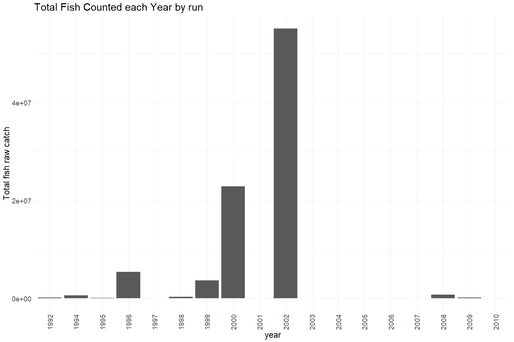
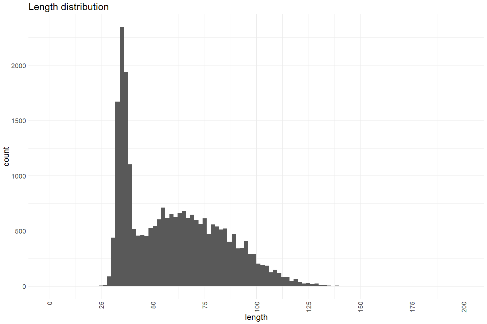
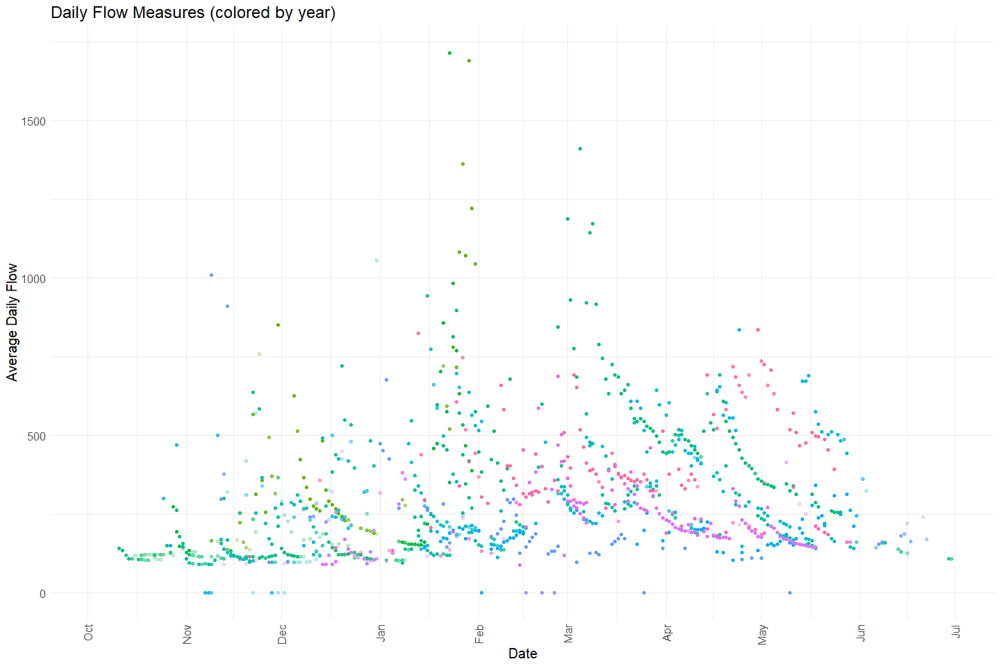
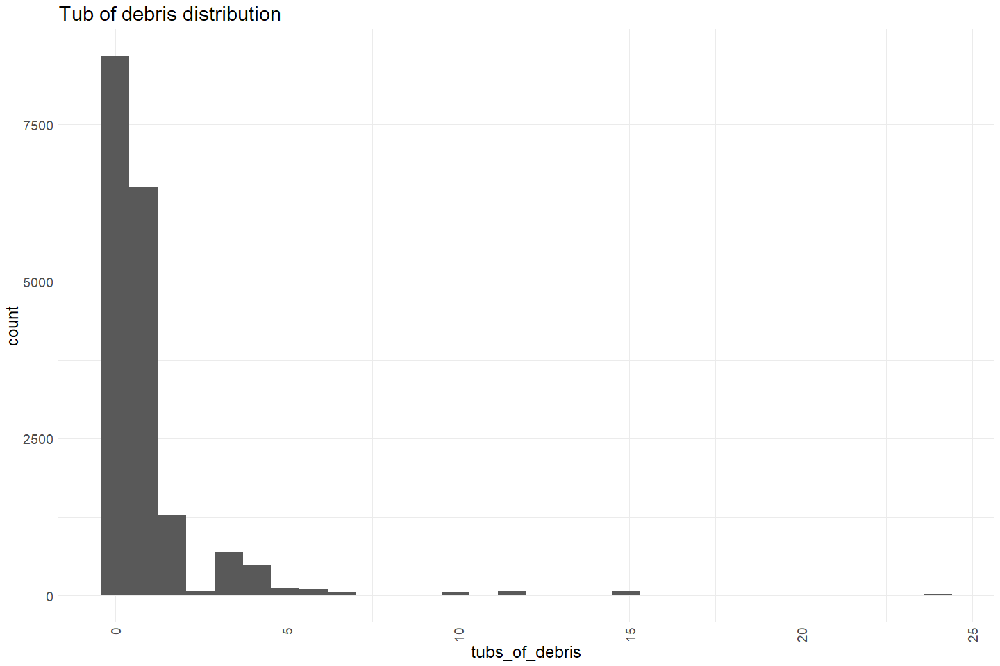
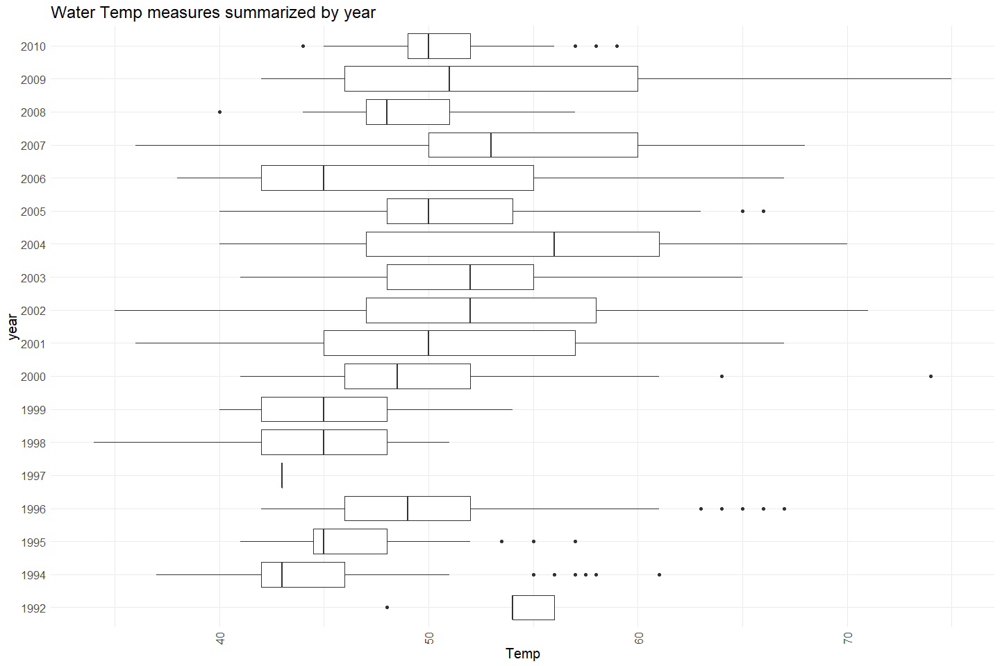
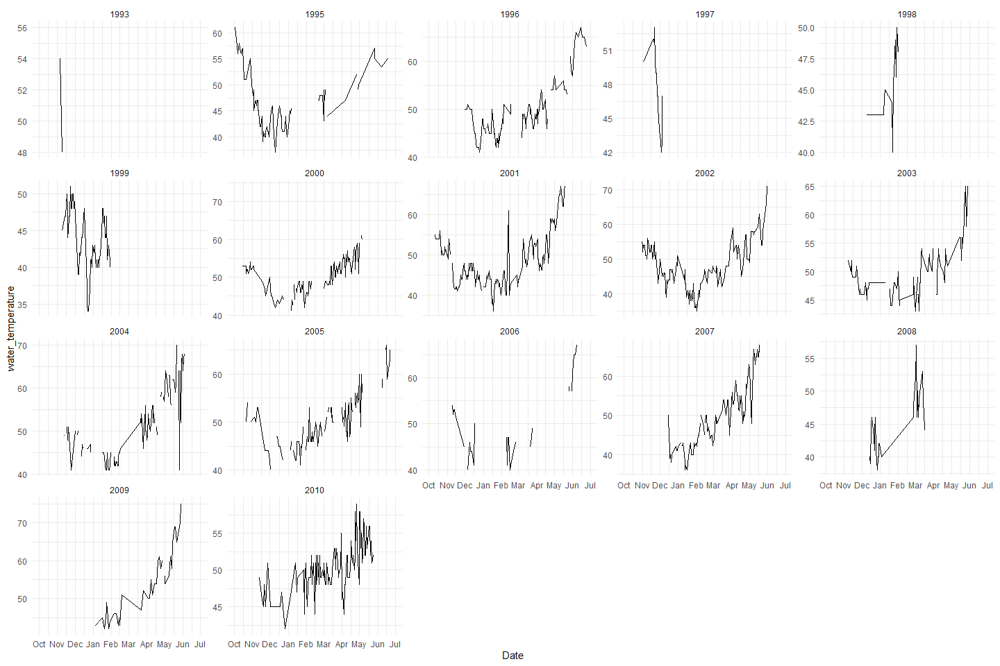
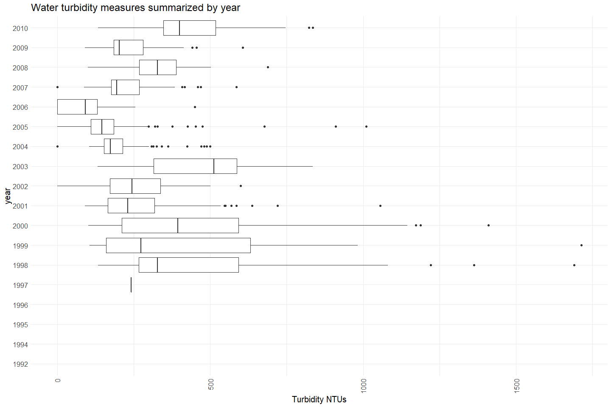

Deer Creek RST Data QC
================
Erin Cain
9/29/2021

# Deer Creek RST Data

## Description of Monitoring Data

RST data was shared with us in an access database. I quiried it to
include both fish catch and trap condions information.

**Timeframe:**

**Video Season:**

**Completeness of Record throughout timeframe:**

**Sampling Location:**

**Data Contact:**

Comments from Matt: Let me know if you need any help with interpreting
what is in that database. It is not mine, I inherited it from a retired
CDFW biologist, but I did work on those RST’s as a Scientific Aide, and
entered data into the database. So I at least have some working
knowledge of the forms/tables in there.

## Access Cloud Data

``` r
# Run Sys.setenv() to specify GCS_AUTH_FILE and GCS_DEFAULT_BUCKET before running 
# getwd() to see how to specify paths 
# Open object from google cloud storage
# Set your authentication using gcs_auth
gcs_auth(json_file = Sys.getenv("GCS_AUTH_FILE"))
# Set global bucket 
gcs_global_bucket(bucket = Sys.getenv("GCS_DEFAULT_BUCKET"))

# git data and save as xlsx
gcs_get_object(object_name = 
                 "rst/deer-creek/data-raw/mill_deer_rst_trap_catch_and_conditions.xlsx",
               bucket = gcs_get_global_bucket(),
               saveToDisk = "raw_rst_deer_and_mill.xlsx",
               overwrite = TRUE)
```

Read in data from google cloud, glimpse raw data:

``` r
raw_rst_data <- read_excel("raw_rst_deer_and_mill.xlsx", col_types =c("date", "text", "numeric", "text", "numeric", 
                                                                      "numeric", "numeric", "numeric", "numeric", "numeric", 
                                                                      "numeric", "numeric", "numeric", "text")) %>% glimpse()
```

    ## Rows: 96,528
    ## Columns: 14
    ## $ Date                      <dttm> 1992-10-14, 1992-10-14, 1992-10-14, 1992-10~
    ## $ Location                  <chr> "Deer Creek Canyon Mouth", "Deer Creek Canyo~
    ## $ Count                     <dbl> 1, 1, 1, 1, 1, 1, 1, 1, 1, 1, 1, 1, 1, 1, 1,~
    ## $ Species                   <chr> "CHISAL", "CHISAL", "CHISAL", "CHISAL", "CHI~
    ## $ Length                    <dbl> 93, 98, 94, 115, 79, 87, 110, 93, 87, 79, 76~
    ## $ Weight                    <dbl> NA, NA, NA, NA, NA, NA, NA, NA, NA, NA, NA, ~
    ## $ Flow                      <dbl> NA, NA, NA, NA, NA, NA, NA, NA, NA, NA, NA, ~
    ## $ `Time for 10 Revolutions` <dbl> NA, NA, NA, NA, NA, NA, NA, NA, NA, NA, NA, ~
    ## $ `Tubs of Debris`          <dbl> NA, NA, NA, NA, NA, NA, NA, NA, NA, NA, NA, ~
    ## $ `Trap Condition Code`     <dbl> 1, 1, 1, 1, 1, 1, 1, 1, 1, 1, 1, 1, 1, 1, 1,~
    ## $ `Water Temperature`       <dbl> NA, NA, NA, NA, NA, NA, NA, NA, NA, NA, NA, ~
    ## $ Turbidity                 <dbl> NA, NA, NA, NA, NA, NA, NA, NA, NA, NA, NA, ~
    ## $ Weather                   <dbl> NA, NA, NA, NA, NA, NA, NA, NA, NA, NA, NA, ~
    ## $ Comments                  <chr> "Data sheet does not show sampling method - ~

``` r
unique(raw_rst_data$Location)
```

    ## [1] "Deer Creek Canyon Mouth"           "Deer Creek Canyon Mouth Diversion"
    ## [3] "Deer Creek Canyon Mouth Trap"      "Deer Creek RSTR"                  
    ## [5] "Mill Creek RSTR"

## Data transformations

``` r
cleaner_rst_data <- raw_rst_data%>% 
  filter(Location %in% c("Deer Creek Canyon Mouth", "Deer Creek Canyon Mouth Diversion", 
                         "Deer Creek Canyon Mouth Trap", "Deer Creek RSTR"),
         Species == "CHISAL") %>%
  janitor::clean_names() %>% 
  mutate(date = as.Date(date),
         trap_condition_code = as.character(trap_condition_code), 
         weather = as.character(weather)) %>%
  select(-species) %>%
  glimpse()
```

    ## Rows: 25,245
    ## Columns: 13
    ## $ date                    <date> 1992-10-14, 1992-10-14, 1992-10-14, 1992-10-1~
    ## $ location                <chr> "Deer Creek Canyon Mouth", "Deer Creek Canyon ~
    ## $ count                   <dbl> 1, 1, 1, 1, 1, 1, 1, 1, 1, 1, 1, 1, 1, 1, 1, 1~
    ## $ length                  <dbl> 93, 98, 94, 115, 79, 87, 110, 93, 87, 79, 76, ~
    ## $ weight                  <dbl> NA, NA, NA, NA, NA, NA, NA, NA, NA, NA, NA, NA~
    ## $ flow                    <dbl> NA, NA, NA, NA, NA, NA, NA, NA, NA, NA, NA, NA~
    ## $ time_for_10_revolutions <dbl> NA, NA, NA, NA, NA, NA, NA, NA, NA, NA, NA, NA~
    ## $ tubs_of_debris          <dbl> NA, NA, NA, NA, NA, NA, NA, NA, NA, NA, NA, NA~
    ## $ trap_condition_code     <chr> "1", "1", "1", "1", "1", "1", "1", "1", "1", "~
    ## $ water_temperature       <dbl> NA, NA, NA, NA, NA, NA, NA, NA, NA, NA, NA, NA~
    ## $ turbidity               <dbl> NA, NA, NA, NA, NA, NA, NA, NA, NA, NA, NA, NA~
    ## $ weather                 <chr> NA, NA, NA, NA, NA, NA, NA, NA, NA, NA, NA, NA~
    ## $ comments                <chr> "Data sheet does not show sampling method - di~

## Explore Numeric Variables:

``` r
cleaner_rst_data %>% select_if(is.numeric) %>% colnames()
```

    ## [1] "count"                   "length"                 
    ## [3] "weight"                  "flow"                   
    ## [5] "time_for_10_revolutions" "tubs_of_debris"         
    ## [7] "water_temperature"       "turbidity"

### Variable: `count`

**Plotting fish counts over period of record**

``` r
cleaner_rst_data %>% 
  mutate(water_year = ifelse(month(date) %in% 10:12, year(date) + 1, year(date))) %>% 
  left_join(sac_indices) %>%
  mutate(year = as.factor(year(date)),
         fake_year = if_else(month(date) %in% 10:12, 1900, 1901),
         fake_date = as.Date(paste0(fake_year,"-", month(date), "-", day(date)))) %>%
  filter(water_year < 2021) %>%
  group_by(date) %>%
  mutate(total_daily_catch = sum(count)) %>%
  ungroup() %>%
  ggplot(aes(x = fake_date, y = total_daily_catch, fill = year_type)) + 
  geom_col() + 
  scale_x_date(labels = date_format("%b"), limits = c(as.Date("1900-10-01"), as.Date("1901-06-01")), date_breaks = "1 month") + 
  theme_minimal() + 
  theme(text = element_text(size = 18),
        axis.text.x = element_text(angle = 90, vjust = 0.5, hjust=1),
        legend.position = "bottom") + 
  labs(title = "Total Daily Raw Passage 2015 - 2020",
       y = "Total daily raw catch",
       x = "Date")+ 
  facet_wrap(~water_year, scales = "free") +
  scale_color_manual(palette)
```

    ## Joining, by = "water_year"

<!-- -->

Early years looks like sampling happened infrequently.

``` r
cleaner_rst_data  %>%
  mutate(year = as.factor(year(date))) %>%
  group_by(year) %>%
  mutate(total_yearly_catch = sum(count)) %>%
  ggplot(aes(x = year, y = total_yearly_catch)) + 
  geom_col() + 
  theme_minimal() +
  labs(title = "Total Fish Counted each Year by run",
       y = "Total fish raw catch") + 
  theme(text = element_text(size = 18),
        axis.text.x = element_text(angle = 90, vjust = 0.5, hjust=1)) 
```

<!-- -->

Looks like some sampling gaps.

**Numeric Summary of counts over Period of Record**

``` r
# Table with summary statistics
summary(cleaner_rst_data$count)
```

    ##     Min.  1st Qu.   Median     Mean  3rd Qu.     Max.     NA's 
    ##    1.000    1.000    1.000    5.677    2.000 4057.000       39

**NA and Unknown Values**

-   0.2 % of values in the `count` column are NA.

### Variable: `length`

Length of the fish captured

**Plotting length**

``` r
cleaner_rst_data %>% filter(length < 250) %>% # filter out 13 points so we can more clearly see distribution
  ggplot(aes(x = length)) + 
  geom_histogram(breaks=seq(0, 200, by=2)) + 
  scale_x_continuous(breaks=seq(0, 200, by=25)) +
  theme_minimal() +
  labs(title = "Length distribution") + 
  theme(text = element_text(size = 18),
        axis.text.x = element_text(angle = 90, vjust = 0.5, hjust=1)) 
```

<!-- -->

**Numeric Summary of length over Period of Record**

``` r
# Table with summary statistics
summary(cleaner_rst_data$length)
```

    ##    Min. 1st Qu.  Median    Mean 3rd Qu.    Max.    NA's 
    ##   25.00   38.00   58.00   60.88   78.00  200.00     555

**NA and Unknown Values**

-   2.2 % of values in the `length` column are NA.

### Variable: `weight`

weight of the fish captured

**Plotting weight**

``` r
cleaner_rst_data %>% 
  ggplot(aes(x = weight)) + 
  geom_histogram() + 
  theme_minimal() +
  labs(title = "Weight distribution") + 
  theme(text = element_text(size = 18),
        axis.text.x = element_text(angle = 90, vjust = 0.5, hjust=1)) 
```

    ## `stat_bin()` using `bins = 30`. Pick better value with `binwidth`.

<!-- -->

**Numeric Summary of weight over Period of Record**

``` r
# Table with summary statistics
summary(cleaner_rst_data$weight)
```

    ##    Min. 1st Qu.  Median    Mean 3rd Qu.    Max.    NA's 
    ##   0.100   2.600   4.800   5.839   8.000  45.800   16424

**NA and Unknown Values**

-   65.1 % of values in the `weight` column are NA.

### Variable: `flow`

Flow, units?

**Plotting flow over Period of Record**

``` r
# Make whatever plot is appropriate 
# maybe 2 plots is appropriate
cleaner_rst_data %>% 
  group_by(date) %>%
  mutate(avg_flow = mean(flow)) %>%
  ungroup() %>%
  mutate(year = as.factor(year(date)),
         fake_year = if_else(month(date) %in% 10:12, 1900, 1901),
         fake_date = as.Date(paste0(fake_year,"-", month(date), "-", day(date)))) %>%
  ggplot(aes(x = fake_date, y = avg_flow, color = year)) + 
  geom_point(alpha = .25) + 
  # facet_wrap(~year(date), scales = "free") + 
  scale_x_date(labels = date_format("%b"), date_breaks = "1 month") + 
  theme_minimal() + 
  theme(text = element_text(size = 15),
        axis.text.x = element_text(angle = 90, vjust = 0.5, hjust=1),
        legend.position = "none") + 
  labs(title = "Daily Flow Measures (colored by year)",
       x = "Date", 
       y = "Average Daily Flow")  
```

<!-- -->

``` r
cleaner_rst_data %>%  
  mutate(year = as.factor(year(date))) %>%
  ggplot(aes(x = flow, y = year)) + 
  geom_boxplot() + 
  theme_minimal() +
  labs(title = "Water Flow measures summarized by year",
       x = "Flow") + 
  theme(text = element_text(size = 15),
        axis.text.x = element_text(angle = 90, vjust = 0.5, hjust=1)) 
```

<!-- -->

Notes:

-   No measures pre 1997

**Numeric Summary of flow over Period of Record**

``` r
# Table with summary statistics
summary(cleaner_rst_data$flow)
```

    ##    Min. 1st Qu.  Median    Mean 3rd Qu.    Max.    NA's 
    ##     0.0   172.0   241.0   304.1   381.0  1714.0    7060

**NA and Unknown Values**

-   28 % of values in the `flow` column are NA.

### Variable: `time_for_10_revolutions`

Length of the fish captured

**Plotting time\_for\_10\_revolutions**

``` r
cleaner_rst_data %>% 
  ggplot(aes(x = time_for_10_revolutions)) + 
  geom_histogram() + 
  # scale_x_continuous(breaks=seq(0, 200, by=25)) +
  theme_minimal() +
  labs(title = "Time it takes to do 10 revolutions distribution") + 
  theme(text = element_text(size = 18),
        axis.text.x = element_text(angle = 90, vjust = 0.5, hjust=1)) 
```

    ## `stat_bin()` using `bins = 30`. Pick better value with `binwidth`.

<!-- -->
A lot of spread in this time. 0 seems like a non functional trap. Very
high values seem like outliers.

**Numeric Summary of time\_for\_10\_revolutions over Period of Record**

``` r
# Table with summary statistics
summary(cleaner_rst_data$time_for_10_revolutions)
```

    ##    Min. 1st Qu.  Median    Mean 3rd Qu.    Max.    NA's 
    ##     0.0    90.0   140.0   134.2   188.0  1200.0    6865

**NA and Unknown Values**

-   27.2 % of values in the `time_for_10_revolutions` column are NA.

### Variable: `tubs_of_debris`

tubs\_of\_debris of the fish captured

**Plotting Debris**

``` r
cleaner_rst_data %>% 
  ggplot(aes(x = tubs_of_debris)) + 
  geom_histogram() + 
  theme_minimal() +
  labs(title = "Tub of debris distribution") + 
  theme(text = element_text(size = 18),
        axis.text.x = element_text(angle = 90, vjust = 0.5, hjust=1)) 
```

    ## `stat_bin()` using `bins = 30`. Pick better value with `binwidth`.

<!-- -->

**Numeric Summary of tub of debris over Period of Record**

``` r
# Table with summary statistics
summary(cleaner_rst_data$tubs_of_debris)
```

    ##    Min. 1st Qu.  Median    Mean 3rd Qu.    Max.    NA's 
    ##   0.000   0.000   0.500   0.951   1.000  24.000    7132

**NA and Unknown Values**

-   28.3 % of values in the `tubs_of_debris` column are NA.

### Variable: `water_temperature`

water\_temperature F

**Plotting water\_temperature over Period of Record**

``` r
# Make whatever plot is appropriate 
# maybe 2 plots is appropriate
cleaner_rst_data %>% 
  group_by(date) %>%
  mutate(avg_temp = mean(water_temperature)) %>%
  ungroup() %>%
  mutate(year = as.factor(year(date)),
         fake_year = if_else(month(date) %in% 10:12, 1900, 1901),
         fake_date = as.Date(paste0(fake_year,"-", month(date), "-", day(date)))) %>%
  ggplot(aes(x = fake_date, y = avg_temp, color = year)) + 
  geom_point(alpha = .25) + 
  # facet_wrap(~year(date), scales = "free") + 
  scale_x_date(labels = date_format("%b"), date_breaks = "1 month") + 
  theme_minimal() + 
  theme(text = element_text(size = 15),
        axis.text.x = element_text(angle = 90, vjust = 0.5, hjust=1),
        legend.position = "none") + 
  labs(title = "Daily Temp Measures F (colored by year)",
       x = "Date", 
       y = "Average Daily Temp")  
```

<!-- -->

``` r
cleaner_rst_data %>%  
  mutate(year = as.factor(year(date))) %>%
  ggplot(aes(x = water_temperature, y = year)) + 
  geom_boxplot() + 
  theme_minimal() +
  labs(title = "Water Temp measures summarized by year",
       x = "Temp") + 
  theme(text = element_text(size = 15),
        axis.text.x = element_text(angle = 90, vjust = 0.5, hjust=1)) 
```

<!-- -->

Notes:

-   No measures pre 1997

**Numeric Summary of water\_temperature over Period of Record**

``` r
# Table with summary statistics
summary(cleaner_rst_data$water_temperature)
```

    ##    Min. 1st Qu.  Median    Mean 3rd Qu.    Max.    NA's 
    ##   34.00   47.00   50.00   51.33   55.00   75.00    3116

**NA and Unknown Values**

-   12.3 % of values in the `water_temperature` column are NA.

### Variable: `turbidity`

turbidity, units?

**Plotting turbidity over Period of Record**

``` r
# Make whatever plot is appropriate 
# maybe 2 plots is appropriate
cleaner_rst_data %>% 
  group_by(date) %>%
  mutate(avg_turbidity = mean(turbidity)) %>%
  ungroup() %>%
  mutate(year = as.factor(year(date)),
         fake_year = if_else(month(date) %in% 10:12, 1900, 1901),
         fake_date = as.Date(paste0(fake_year,"-", month(date), "-", day(date)))) %>%
  ggplot(aes(x = fake_date, y = avg_turbidity, color = year)) + 
  geom_point(alpha = .25) + 
  # facet_wrap(~year(date), scales = "free") + 
  scale_x_date(labels = date_format("%b"), date_breaks = "1 month") + 
  theme_minimal() + 
  theme(text = element_text(size = 15),
        axis.text.x = element_text(angle = 90, vjust = 0.5, hjust=1),
        legend.position = "none") + 
  labs(title = "Daily turbidity Measures (colored by year)",
       x = "Date", 
       y = "Average Daily turbidity NTUs")  
```

<!-- -->

``` r
cleaner_rst_data %>%  
  mutate(year = as.factor(year(date))) %>%
  ggplot(aes(x = flow, y = year)) + 
  geom_boxplot() + 
  theme_minimal() +
  labs(title = "Water turbidity measures summarized by year",
       x = "Turbidity NTUs") + 
  theme(text = element_text(size = 15),
        axis.text.x = element_text(angle = 90, vjust = 0.5, hjust=1)) 
```

<!-- -->

Notes:

-   No measures pre 1997
-   One outlier greater than 150

**Numeric Summary of turbidity over Period of Record**

``` r
# Table with summary statistics
summary(cleaner_rst_data$turbidity)
```

    ##    Min. 1st Qu.  Median    Mean 3rd Qu.    Max.    NA's 
    ##   0.000   1.200   1.800   2.964   2.860 180.000    9094

**NA and Unknown Values**

-   36 % of values in the `turbidity` column are NA.

## Explore Categorical variables:

``` r
cleaner_rst_data %>% select_if(is.character) %>% colnames()
```

    ## [1] "location"            "trap_condition_code" "weather"            
    ## [4] "comments"

### Variable: `location`

``` r
table(cleaner_rst_data$location) 
```

    ## 
    ##           Deer Creek Canyon Mouth Deer Creek Canyon Mouth Diversion 
    ##                                73                                93 
    ##      Deer Creek Canyon Mouth Trap                   Deer Creek RSTR 
    ##                                54                             25025

**NA and Unknown Values**

-   0 % of values in the `location` column are NA.

### Variable: `trap_condition_code`

Code describing trap condition. TODO figure out code definitions (Ask
Matt)

``` r
table(cleaner_rst_data$trap_condition_code) 
```

    ## 
    ##     1     2     3     4    48    65 
    ## 19687   160     1   812    19     2

**NA and Unknown Values**

-   18.1 % of values in the `trap_condition_code` column are NA.

### Variable: `weather`

Code describing weather condition. TODO figure out code definitions (Ask
Matt)

``` r
table(cleaner_rst_data$weather) 
```

    ## 
    ##     1     2     3     4     6 
    ## 11297  4356  4239  1813   416

**NA and Unknown Values**

-   12.4 % of values in the `weather` column are NA.

### Variable: `comments`

First 5 unique comments displayed to see what info they contain

``` r
unique(cleaner_rst_data$comments)[1:5] 
```

    ## [1] "Data sheet does not show sampling method - diversion bypass trap????"      
    ## [2] "Data source screen trap ??? Oct. 14,17,30 . Data recorded is from Oct. 17."
    ## [3] "Data from screen shop ???"                                                 
    ## [4] "Data source Diversion Bypass Trap ???"                                     
    ## [5] "Data source screen trap ??? Nov. 4,5,9. Data recorded from Nov. 5."

**NA and Unknown Values**

-   54.1 % of values in the `comments` column are NA.

## Summary of identified issues

-   Lots of environmental variables are not collected before 1997
-   Lots of sampling gaps
-   Need to figure out code definitions - weather, condition

## Save cleaned data back to google cloud

``` r
cleaner_rst_data %>% glimpse()
```

    ## Rows: 25,245
    ## Columns: 13
    ## $ date                    <date> 1992-10-14, 1992-10-14, 1992-10-14, 1992-10-1~
    ## $ location                <chr> "Deer Creek Canyon Mouth", "Deer Creek Canyon ~
    ## $ count                   <dbl> 1, 1, 1, 1, 1, 1, 1, 1, 1, 1, 1, 1, 1, 1, 1, 1~
    ## $ length                  <dbl> 93, 98, 94, 115, 79, 87, 110, 93, 87, 79, 76, ~
    ## $ weight                  <dbl> NA, NA, NA, NA, NA, NA, NA, NA, NA, NA, NA, NA~
    ## $ flow                    <dbl> NA, NA, NA, NA, NA, NA, NA, NA, NA, NA, NA, NA~
    ## $ time_for_10_revolutions <dbl> NA, NA, NA, NA, NA, NA, NA, NA, NA, NA, NA, NA~
    ## $ tubs_of_debris          <dbl> NA, NA, NA, NA, NA, NA, NA, NA, NA, NA, NA, NA~
    ## $ trap_condition_code     <chr> "1", "1", "1", "1", "1", "1", "1", "1", "1", "~
    ## $ water_temperature       <dbl> NA, NA, NA, NA, NA, NA, NA, NA, NA, NA, NA, NA~
    ## $ turbidity               <dbl> NA, NA, NA, NA, NA, NA, NA, NA, NA, NA, NA, NA~
    ## $ weather                 <chr> NA, NA, NA, NA, NA, NA, NA, NA, NA, NA, NA, NA~
    ## $ comments                <chr> "Data sheet does not show sampling method - di~

``` r
f <- function(input, output) write_csv(input, file = output)

gcs_upload(deer_rst,
           object_function = f,
           type = "csv",
           name = "rst/deer-creek/data/deer_rst.csv")
```
