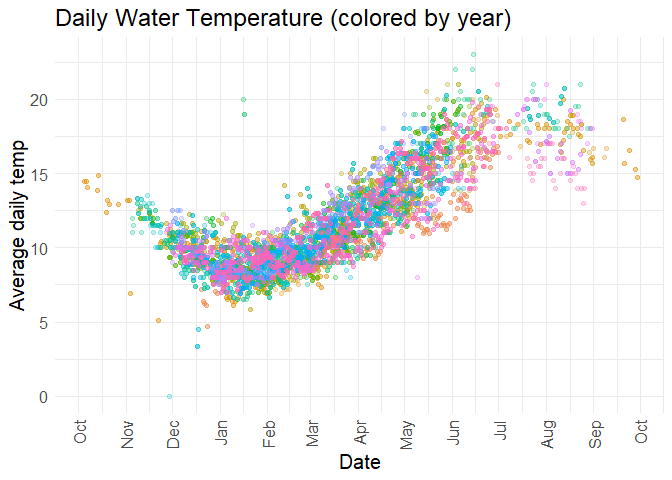
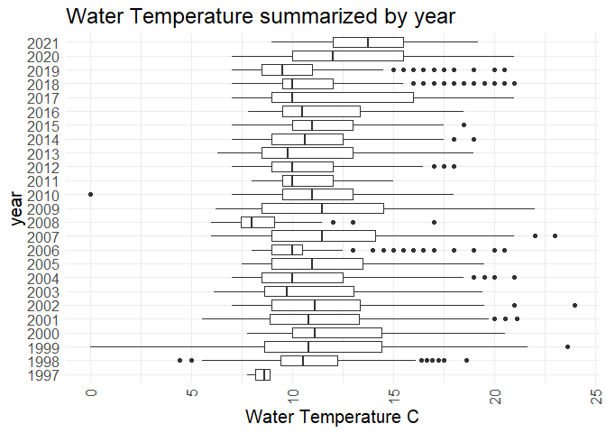

Feather River RST Effort Data QC
================
Erin Cain
9/29/2021

# Feather River RST Effort Data

## Description of Monitoring Data

This data contains information describing trapping effort, location
information, and environmental data that can be used in combination with
feather river RST catch data.

*Notes from xlsx:*

-   A typical sampling year is from November-June sometimes into
    July/August if water temperatures allowed. There are some years
    where sampling was continuous throughout the year (i.e SY 1999) so
    these quereies provide data from, for example, 11/1/1998 to
    10/1/1999 to encompass a typical RST sampling year.  
-   In cases where cones are not spinning properly (covered in algae,
    clogged with debris or some other circumstance) it is marked as
    ‘Functioning, but not normally’  
-   When cones are lowered (marked ‘Start trapping’) there may be some
    variations on how the Trap Function and Fish Processed was recorded.
    Assume all are functioning normal and fish processed is not
    applicable since no fish had been captured or processed. Cones are
    simply lowered and left to trap until the next service time.  
-   The Low Flow Channel (LFC) begins at the Fish Barrier Dam and
    continues until the Thermalito Afterbay Outlet (TAO) which is where
    the High Flow Channel (HFC) begins

**Timeframe:** Dec 1997 - May 2021

**Trapping Season:** Typically December - June, looks like it varies
quite a bit.

**Completeness of Record throughout timeframe:** There are trap
efficiency measures for every year that we have RST catch data.

**Data Contact:** [Kassie Hickey](mailto:KHickey@psmfc.org)

## Access Cloud Data

``` r
# Run Sys.setenv() to specify GCS_AUTH_FILE and GCS_DEFAULT_BUCKET before running 
# getwd() to see how to specify paths 
# Open object from google cloud storage
# Set your authentication using gcs_auth
gcs_auth(json_file = Sys.getenv("GCS_AUTH_FILE"))
# Set global bucket 
gcs_global_bucket(bucket = Sys.getenv("GCS_DEFAULT_BUCKET"))

gcs_list_objects()
# git data and save as xlsx
gcs_get_object(object_name = "rst/feather-river/data-raw/Feather River RST Sampling Effort_1998-2021.xlsx",
               bucket = gcs_get_global_bucket(),
               saveToDisk = "raw_feather_rst_sampling_effort_data.xlsx",
               overwrite = TRUE)
```

Read in data from google cloud, glimpse raw data and location
description sheet:

**Location Information:** Join onto sampling effort data in
`sub_site_name` section.

``` r
# read in data to clean
# RST Data
rst_data_sheets <- readxl::excel_sheets("raw_feather_rst_sampling_effort_data.xlsx")
location_details  <- readxl::read_excel("raw_feather_rst_sampling_effort_data.xlsx", 
                                          sheet = "RST Location Details",
                                          range = "A1:F18") 
# I will join location details to df in the subsite variable section below
location_details
```

    ## # A tibble: 17 x 6
    ##    SiteName         subSiteName `River location` Latitude Longitude `River Mile`
    ##    <chr>            <chr>       <chr>            <chr>    <chr>            <dbl>
    ##  1 Steep Riffle     #Steep Rif~ LFC              "39°27'~ "121°36'~         61  
    ##  2 Steep Riffle     Steep Riff~ LFC              "39°27'~ "121°36'~         61  
    ##  3 Steep Riffle     Steep Side~ LFC              "39°27'~ "121°36'~         61  
    ##  4 Eye Riffle       Eye riffle~ LFC              "39°27'~ "121°36'~         60.2
    ##  5 Eye Riffle       Eye riffle~ LFC              "39°27'~ "121°36'~         60.2
    ##  6 Live Oak         Live Oak    HFC              "39°16'~ "121°37'~         41  
    ##  7 Herringer Riffle Herringer_~ HFC              "39°18'~ "121°37'~         46  
    ##  8 Herringer Riffle Herringer_~ HFC              "39°18'~ "121°37'~         46  
    ##  9 Herringer Riffle Herringer_~ HFC              "39°18'~ "121°37'~         46  
    ## 10 Sunset Pumps     Sunset Eas~ HFC              "39°14'~ "121°38'~         38.5
    ## 11 Sunset Pumps     Sunset Wes~ HFC              "39°14'~ "121°38'~         38.5
    ## 12 Shawns Beach     Shawns_east HFC              "39°12'~ "121°36'~         35  
    ## 13 Shawns Beach     Shawns_west HFC              "39°12'~ "121°36'~         35  
    ## 14 Gateway Riffle   Gateway_ma~ LFC              "39°27'~ "121°37'~         59.7
    ## 15 Gateway Riffle   Gateway_Ro~ LFC              "39°27'~ "121°37'~         59.7
    ## 16 Gateway Riffle   Gateway Ma~ LFC              "39°27'~ "121°37'~         59.7
    ## 17 Gateway Riffle   Gateway_Ro~ LFC              "39°27'~ "121°37'~         59.7

**Raw Data**

``` r
# create function to read in all sheets of a 
read_sheets <- function(sheet){
  data <- read_excel("raw_feather_rst_sampling_effort_data.xlsx", sheet = sheet)
}

raw_effort <- purrr::map(rst_data_sheets[-1], read_sheets) %>%
  reduce(bind_rows)

raw_effort %>% glimpse()
```

    ## Rows: 8,557
    ## Columns: 7
    ## $ subSiteName        <chr> "Eye riffle_north", "Eye riffle_north", "Eye riffle~
    ## $ visitTime          <dttm> 1997-12-22 10:40:00, 1997-12-23 11:40:00, 1997-12-~
    ## $ visitType          <chr> "Start trap & begin trapping", "End trapping", "Sta~
    ## $ trapFunctioning    <chr> "Trap not in service", "Not recorded", "Trap not in~
    ## $ fishProcessed      <chr> "Not applicable", "Processed fish", "Not applicable~
    ## $ `Water Temp (C)`   <dbl> NA, 8.888889, NA, 7.777778, 8.333333, 8.888889, 8.3~
    ## $ `Turbidity (NTUs)` <dbl> NA, NA, NA, NA, NA, NA, NA, NA, NA, NA, NA, NA, NA,~

## Data transformations

``` r
# Snake case, 
# Columns are appropriate types
# Remove redundant columns
cleaner_effort_data <- raw_effort %>% 
  rename("sub_site_name" = subSiteName, "visit_time" = visitTime, 
         "visit_type" = visitType, "trap_functioning" = trapFunctioning, 
         "fish_processed" = fishProcessed, "water_temp_c" = `Water Temp (C)`, 
         "turbidity_ntu" = `Turbidity (NTUs)`) %>% glimpse()
```

    ## Rows: 8,557
    ## Columns: 7
    ## $ sub_site_name    <chr> "Eye riffle_north", "Eye riffle_north", "Eye riffle_n~
    ## $ visit_time       <dttm> 1997-12-22 10:40:00, 1997-12-23 11:40:00, 1997-12-26~
    ## $ visit_type       <chr> "Start trap & begin trapping", "End trapping", "Start~
    ## $ trap_functioning <chr> "Trap not in service", "Not recorded", "Trap not in s~
    ## $ fish_processed   <chr> "Not applicable", "Processed fish", "Not applicable",~
    ## $ water_temp_c     <dbl> NA, 8.888889, NA, 7.777778, 8.333333, 8.888889, 8.333~
    ## $ turbidity_ntu    <dbl> NA, NA, NA, NA, NA, NA, NA, NA, NA, NA, NA, NA, NA, N~

## Explore Numeric Variables:

``` r
# Filter clean data to show only numeric variables 
cleaner_effort_data %>% select_if(is.numeric) %>% colnames()
```

    ## [1] "water_temp_c"  "turbidity_ntu"

### Variable: `water_temp_c`

**Plotting water\_temp\_c over Period of Record**

``` r
# Make whatever plot is appropriate 
# maybe 2 plots is appropriate
cleaner_effort_data %>% 
  group_by(date = as.Date(visit_time)) %>%
  mutate(avg_temp = mean(water_temp_c)) %>%
  ungroup() %>%
  mutate(year = as.factor(year(date)),
         fake_year = if_else(month(date) %in% 10:12, 1900, 1901),
         fake_date = as.Date(paste0(fake_year,"-", month(date), "-", day(date)))) %>%
  ggplot(aes(x = fake_date, y = avg_temp, color = year)) + 
  geom_point(alpha = .25) + 
  # facet_wrap(~year(date), scales = "free") + 
  scale_x_date(labels = date_format("%b"), date_breaks = "1 month") + 
  theme_minimal() + 
  theme(text = element_text(size = 15),
        axis.text.x = element_text(angle = 90, vjust = 0.5, hjust=1),
        legend.position = "none") + 
  labs(title = "Daily Water Temperature (colored by year)",
       y = "Average daily temp", 
       x = "Date")  
```

<!-- -->

``` r
cleaner_effort_data %>% 
  mutate(year = as.factor(year(as.Date(visit_time)))) %>%
  ggplot(aes(x = water_temp_c, y = year)) + 
  geom_boxplot() + 
  theme_minimal() +
  labs(title = "Water Temperature summarized by year",
       x = "Water Temperature C") + 
  theme(text = element_text(size = 15),
        axis.text.x = element_text(angle = 90, vjust = 0.5, hjust=1)) 
```

<!-- -->

``` r
# All points where water temp = 0 degrees C occur in November or December and happen when trap is not in service or functioning
zero_values <- cleaner_effort_data %>% filter(water_temp_c == 0)
```

**Numeric Summary of water\_temp\_c over Period of Record**

``` r
# Table with summary statistics
summary(cleaner_effort_data$water_temp_c)
```

    ##    Min. 1st Qu.  Median    Mean 3rd Qu.    Max.    NA's 
    ##    0.00    9.00   10.50   11.45   13.06   24.00    1005

**NA and Unknown Values**

-   11.7 % of values in the `water_temp_c` column are NA.
-   315 of the NA values are in 2008 (maybe a funding issue?)
-   Typically there are around 23 NA values in a year

### Variable: `turbidity_ntu`

Turbidity is measured in Nephelometric Turbidity unit, i.e. the presence
of suspended particles in water. The higher NTU the more solids are
suspended in water and the dirtier the water is.

**Plotting turbidity\_ntu over Period of Record**

``` r
# Make whatever plot is appropriate 
# maybe 2 plots is appropriate
cleaner_effort_data %>% 
  group_by(date = as.Date(visit_time)) %>%
  mutate(avg_turbidity_ntu = mean(turbidity_ntu)) %>%
  ungroup() %>%
 mutate(year = as.factor(year(date)),
         fake_year = if_else(month(date) %in% 10:12, 1900, 1901),
         fake_date = as.Date(paste0(fake_year,"-", month(date), "-", day(date)))) %>%
  ggplot(aes(x = fake_date, y = avg_turbidity_ntu, color = year)) + 
  geom_point(alpha = .25) + 
  # facet_wrap(~year(date), scales = "free") + 
  scale_x_date(labels = date_format("%b"), date_breaks = "1 month") + 
  theme_minimal() + 
  theme(text = element_text(size = 15),
        axis.text.x = element_text(angle = 90, vjust = 0.5, hjust=1),
        legend.position = "none") + 
  labs(title = "Daily Turbidity Measures (colored by year)",
       x = "Date", 
       y = "Average Daily Turbidity NTUs")  
```

<!-- -->

``` r
cleaner_effort_data %>% 
  filter(year(as.Date(visit_time)) > 1999) %>% # Filter because only a few measure before this date
  mutate(year = as.factor(year(as.Date(visit_time)))) %>%
  ggplot(aes(x = turbidity_ntu, y = year)) + 
  geom_boxplot() + 
  theme_minimal() +
  labs(title = "Water Turbidity measures summarized by year",
       x = "Turbidity NTUs") + 
  theme(text = element_text(size = 15),
        axis.text.x = element_text(angle = 90, vjust = 0.5, hjust=1)) 
```

<!-- -->

Notes: - 2006, 2017 were both wet years with low catch (see
`feather-rst.md`) and high turbidity.

**Numeric Summary of turbidity\_ntu over Period of Record**

``` r
# Table with summary statistics
summary(cleaner_effort_data$turbidity_ntu)
```

    ##    Min. 1st Qu.  Median    Mean 3rd Qu.    Max.    NA's 
    ##   0.000   1.390   2.280   3.066   3.580  82.500    1971

**NA and Unknown Values**

-   23 % of values in the `turbidity_ntu` column are NA.
-   Early sampling years: 1998, 1999, 2000 have many NA values
-   There are less NA in the most recent years with the exception of
    2016

## Explore Categorical variables:

``` r
# Filter clean data to show only categorical variables 
cleaner_effort_data %>% select_if(is.character) %>% colnames()
```

    ## [1] "sub_site_name"    "visit_type"       "trap_functioning" "fish_processed"

### Variable: `sub_site_name`

``` r
table(cleaner_effort_data$sub_site_name) 
```

    ## 
    ##           #Steep Riffle_RST            Eye riffle_north 
    ##                        1012                        1995 
    ##     Eye riffle_Side Channel  Gateway Main 400' Up River 
    ##                          77                          24 
    ##               Gateway_main1            Gateway_Rootball 
    ##                         395                         178 
    ## Gateway_Rootball_River_Left              Herringer_east 
    ##                          32                         985 
    ##        Herringer_Upper_west              Herringer_west 
    ##                         956                        1076 
    ##                    Live Oak                 Shawns_east 
    ##                         760                          23 
    ##                 Shawns_west        Steep Riffle_10' ext 
    ##                          24                          83 
    ##          Steep Side Channel            Sunset East bank 
    ##                          38                         470 
    ##            Sunset West bank 
    ##                         429

Fix inconsistencies with spelling, capitalization, and abbreviations.

``` r
format_site_name <- function(string) {
  clean <- str_replace_all(string, "[^[:alnum:]]", " ") %>% 
    trimws() %>% 
    stringr::str_squish() %>%
    stringr::str_to_title()
}
```

``` r
cleaner_effort_data$sub_site_name <- format_site_name(cleaner_effort_data$sub_site_name)
table(cleaner_effort_data$sub_site_name) 
```

    ## 
    ##            Eye Riffle North     Eye Riffle Side Channel 
    ##                        1995                          77 
    ##   Gateway Main 400 Up River               Gateway Main1 
    ##                          24                         395 
    ##            Gateway Rootball Gateway Rootball River Left 
    ##                         178                          32 
    ##              Herringer East        Herringer Upper West 
    ##                         985                         956 
    ##              Herringer West                    Live Oak 
    ##                        1076                         760 
    ##                 Shawns East                 Shawns West 
    ##                          23                          24 
    ##         Steep Riffle 10 Ext            Steep Riffle Rst 
    ##                          83                        1012 
    ##          Steep Side Channel            Sunset East Bank 
    ##                          38                         470 
    ##            Sunset West Bank 
    ##                         429

**NA and Unknown Values**

No values that do not have an associated site with them.

**Add in latitude and longitude points from location table:**

``` r
# First clean location data
cleaned_location <- location_details %>% 
  rename("site_name" = SiteName, "sub_site_name" = subSiteName, 
         "river_location" = `River location`, "river_mile" = `River Mile`) %>%
  mutate(degree = OSMscale::degree(Latitude, Longitude),
         latitude = degree$lat,
         longitude = degree$long,
         sub_site_name = format_site_name(sub_site_name)) %>%
  select(-degree, -Latitude, -Longitude) %>%
  glimpse()
```

    ## Rows: 17
    ## Columns: 6
    ## $ site_name      <chr> "Steep Riffle", "Steep Riffle", "Steep Riffle", "Eye Ri~
    ## $ sub_site_name  <chr> "Steep Riffle Rst", "Steep Riffle 10 Ext", "Steep Side ~
    ## $ river_location <chr> "LFC", "LFC", "LFC", "LFC", "LFC", "HFC", "HFC", "HFC",~
    ## $ river_mile     <dbl> 61.0, 61.0, 61.0, 60.2, 60.2, 41.0, 46.0, 46.0, 46.0, 3~
    ## $ latitude       <dbl> 39.46210, 39.46210, 39.46201, 39.45660, 39.45623, 39.27~
    ## $ longitude      <dbl> -121.6046, -121.6046, -121.6040, -121.6153, -121.6145, ~

Check columns `site_name`, `sub_site_name`, and `river_location` to make
sure we do not introduce anything funky..

``` r
table(cleaned_location$site_name) # Values consistent with feather catch data
```

    ## 
    ##       Eye Riffle   Gateway Riffle Herringer Riffle         Live Oak 
    ##                2                4                3                1 
    ##     Shawns Beach     Steep Riffle     Sunset Pumps 
    ##                2                3                2

``` r
table(cleaned_location$sub_site_name) # Values consistent with effort data (will join on this column)
```

    ## 
    ##            Eye Riffle North     Eye Riffle Side Channel 
    ##                           1                           1 
    ##   Gateway Main 400 Up River               Gateway Main1 
    ##                           1                           1 
    ##            Gateway Rootball Gateway Rootball River Left 
    ##                           1                           1 
    ##              Herringer East        Herringer Upper West 
    ##                           1                           1 
    ##              Herringer West                    Live Oak 
    ##                           1                           1 
    ##                 Shawns East                 Shawns West 
    ##                           1                           1 
    ##         Steep Riffle 10 Ext            Steep Riffle Rst 
    ##                           1                           1 
    ##          Steep Side Channel            Sunset East Bank 
    ##                           1                           1 
    ##            Sunset West Bank 
    ##                           1

``` r
table(cleaned_location$river_location)
```

    ## 
    ## HFC LFC 
    ##   8   9

``` r
# Join location data on sub site name 
cleaner_effort_data <-  left_join(cleaner_effort_data, cleaned_location) 
```

    ## Joining, by = "sub_site_name"

Map of Feather River RST:

### Variable: `visit_type`

``` r
table(cleaner_effort_data$visit_type) 
```

    ## 
    ##           Continue trapping               Drive-by only 
    ##                        6844                           9 
    ##                End trapping   Service/adjust/clean trap 
    ##                         684                         123 
    ## Start trap & begin trapping           Unplanned restart 
    ##                         684                         213

**NA and Unknown Values**

No values that do not have an associated visit type with them.

### Variable: `trap_functioning`

``` r
table(cleaner_effort_data$trap_functioning) 
```

    ## 
    ##                       Not recorded          Trap functioning normally 
    ##                                665                               6783 
    ## Trap functioning, but not normally                Trap not in service 
    ##                                451                                333 
    ##           Trap stopped functioning 
    ##                                325

Replace Not Recorded with NA

``` r
cleaner_effort_data$trap_functioning <- ifelse(cleaner_effort_data$trap_functioning == "Not recorded", NA, cleaner_effort_data$trap_functioning)
```

**NA and Unknown Values**

-   7.8 % of values in the `trap_functioning` column are listed as NA.

-   NA % of values in the `trap_functioning` column state that the trap
    is not function at normal capacity.

### Variable: `fish_processed`

``` r
table(cleaner_effort_data$fish_processed) 
```

    ## 
    ## No catch data; fish left in live box         No catch data; fish released 
    ##                                   93                                   34 
    ##                  No fish were caught                       Not applicable 
    ##                                   98                                  694 
    ##                       Processed fish 
    ##                                 7638

Fix inconsistencies with spelling, capitalization, and abbreviations.

``` r
cleaner_effort_data$fish_processed <- ifelse(cleaner_effort_data$fish_processed == "Not applicable", NA, cleaner_effort_data$fish_processed)
```

**NA and Unknown Values**

-   8.1 % of values in the `fish_processed` column are NA.

### Save cleaned data back to google cloud

First I am going to add in a date column, we can use this date column to
join effort data with catch data.

``` r
# Create date column so join able 
feather_rst_effort <- cleaner_effort_data %>% 
  mutate(date = as.Date(visit_time)) %>%
  select(date, site_name, sub_site_name, visit_time, # reorder columns 
         visit_type, trap_functioning, fish_processed, 
         water_temp_c, turbidity_ntu, river_location, 
         river_mile, latitude, longitude) %>%
  glimpse
```

    ## Rows: 8,557
    ## Columns: 13
    ## $ date             <date> 1997-12-22, 1997-12-23, 1997-12-26, 1997-12-27, 1997~
    ## $ site_name        <chr> "Eye Riffle", "Eye Riffle", "Eye Riffle", "Eye Riffle~
    ## $ sub_site_name    <chr> "Eye Riffle North", "Eye Riffle North", "Eye Riffle N~
    ## $ visit_time       <dttm> 1997-12-22 10:40:00, 1997-12-23 11:40:00, 1997-12-26~
    ## $ visit_type       <chr> "Start trap & begin trapping", "End trapping", "Start~
    ## $ trap_functioning <chr> "Trap not in service", NA, "Trap not in service", NA,~
    ## $ fish_processed   <chr> NA, "Processed fish", NA, "Processed fish", "Processe~
    ## $ water_temp_c     <dbl> NA, 8.888889, NA, 7.777778, 8.333333, 8.888889, 8.333~
    ## $ turbidity_ntu    <dbl> NA, NA, NA, NA, NA, NA, NA, NA, NA, NA, NA, NA, NA, N~
    ## $ river_location   <chr> "LFC", "LFC", "LFC", "LFC", "LFC", "LFC", "LFC", "LFC~
    ## $ river_mile       <dbl> 60.2, 60.2, 60.2, 60.2, 60.2, 60.2, 60.2, 60.2, 60.2,~
    ## $ latitude         <dbl> 39.4566, 39.4566, 39.4566, 39.4566, 39.4566, 39.4566,~
    ## $ longitude        <dbl> -121.6153, -121.6153, -121.6153, -121.6153, -121.6153~

``` r
# Write to google cloud 
# Name file [watershed]_[data type].csv
f <- function(input, output) write_csv(input, file = output)

gcs_upload(feather_rst_effort,
           object_function = f,
           type = "csv",
           name = "rst/feather-river/data/feather_rst_effort.csv")
```
