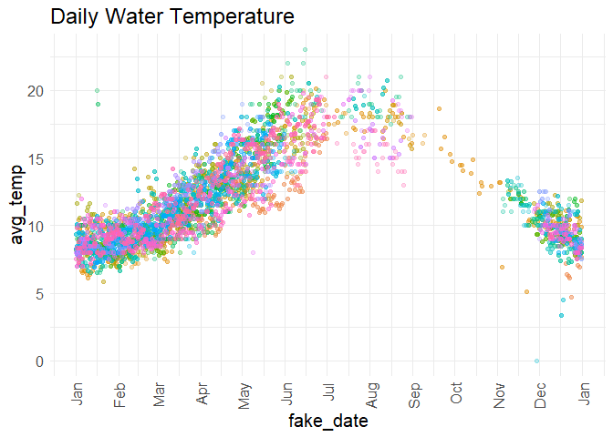
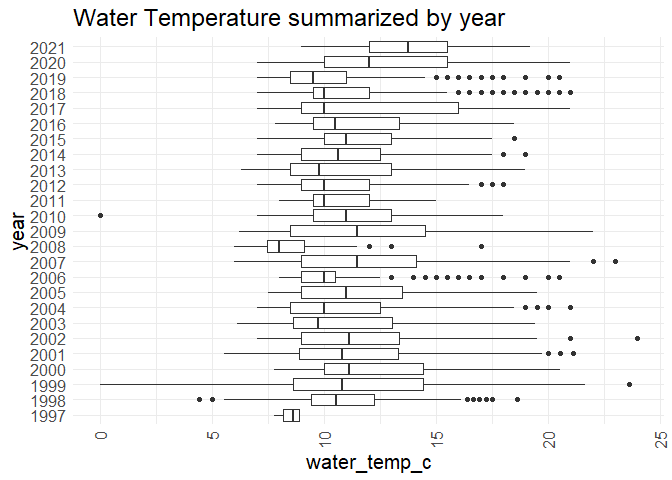
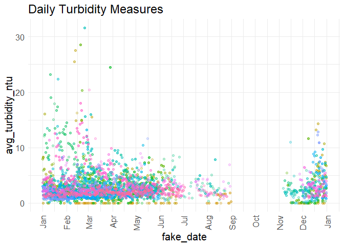
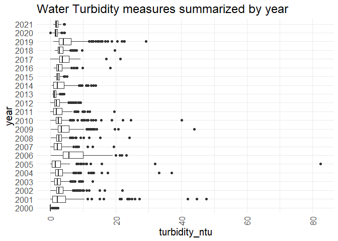

Feather River RST Trap Efficency Data QC
================
Erin Cain
9/29/2021

# Feather River RST Catch Data

## Description of Monitoring Data

This data is trap efficency data that can be used in combination with
feather river rst data. To combine join by date?…TODO check

**Timeframe:** Dec 1997 - May 2021

**Trapping Season:** Typically December - June, looks like it varies
quite a bit.

**Completeness of Record throughout timeframe:** There are trap
efficiency measures for every year that we have RST catch data.

**Data Contact:** [Kassie Hickey](mailto:KHickey@psmfc.org)

## Access Cloud Data

``` r
# Run Sys.setenv() to specify GCS_AUTH_FILE and GCS_DEFAULT_BUCKET before running 
# getwd() to see how to specify paths 
# Open object from google cloud storage
# Set your authentication using gcs_auth
gcs_auth(json_file = Sys.getenv("GCS_AUTH_FILE"))
# Set global bucket 
gcs_global_bucket(bucket = Sys.getenv("GCS_DEFAULT_BUCKET"))

gcs_list_objects()
# git data and save as xlsx
gcs_get_object(object_name = "rst/feather-river/data-raw/Feather River RST Sampling Effort_1998-2021.xlsx",
               bucket = gcs_get_global_bucket(),
               saveToDisk = "raw_feather_rst_sampling_effort_data.xlsx",
               overwrite = TRUE)
```

Read in data from google cloud, glimpse raw data and domain description
sheet:

``` r
# read in data to clean
# RST Data
rst_data_sheets <- readxl::excel_sheets("raw_feather_rst_sampling_effort_data.xlsx")
location_details  <- readxl::read_excel("raw_feather_rst_sampling_effort_data.xlsx", 
                                           sheet = "RST Location Details") 
location_details
```

    ## # A tibble: 23 x 6
    ##    SiteName         subSiteName `River location` Latitude Longitude `River Mile`
    ##    <chr>            <chr>       <chr>            <chr>    <chr>            <dbl>
    ##  1 Steep Riffle     #Steep Rif~ LFC              "39°27'~ "121°36'~         61  
    ##  2 Steep Riffle     Steep Riff~ LFC              "39°27'~ "121°36'~         61  
    ##  3 Steep Riffle     Steep Side~ LFC              "39°27'~ "121°36'~         61  
    ##  4 Eye Riffle       Eye riffle~ LFC              "39°27'~ "121°36'~         60.2
    ##  5 Eye Riffle       Eye riffle~ LFC              "39°27'~ "121°36'~         60.2
    ##  6 Live Oak         Live Oak    HFC              "39°16'~ "121°37'~         41  
    ##  7 Herringer Riffle Herringer_~ HFC              "39°18'~ "121°37'~         46  
    ##  8 Herringer Riffle Herringer_~ HFC              "39°18'~ "121°37'~         46  
    ##  9 Herringer Riffle Herringer_~ HFC              "39°18'~ "121°37'~         46  
    ## 10 Sunset Pumps     Sunset Eas~ HFC              "39°14'~ "121°38'~         38.5
    ## # ... with 13 more rows

``` r
# create function to read in all sheets of a 
read_sheets <- function(sheet){
  data <- read_excel("raw_feather_rst_sampling_effort_data.xlsx", sheet = sheet)
}

raw_efficency <- purrr::map(rst_data_sheets[-1], read_sheets) %>%
  reduce(bind_rows)

raw_efficency %>% glimpse()
```

    ## Rows: 8,557
    ## Columns: 7
    ## $ subSiteName        <chr> "Eye riffle_north", "Eye riffle_north", "Eye riffle~
    ## $ visitTime          <dttm> 1997-12-22 10:40:00, 1997-12-23 11:40:00, 1997-12-~
    ## $ visitType          <chr> "Start trap & begin trapping", "End trapping", "Sta~
    ## $ trapFunctioning    <chr> "Trap not in service", "Not recorded", "Trap not in~
    ## $ fishProcessed      <chr> "Not applicable", "Processed fish", "Not applicable~
    ## $ `Water Temp (C)`   <dbl> NA, 8.888889, NA, 7.777778, 8.333333, 8.888889, 8.3~
    ## $ `Turbidity (NTUs)` <dbl> NA, NA, NA, NA, NA, NA, NA, NA, NA, NA, NA, NA, NA,~

## Data transformations

``` r
# Snake case, 
# Columns are appropriate types
# Remove redundant columns
cleaner_efficency_data <- raw_efficency %>% 
  rename("sub_site_name" = subSiteName, "visit_time" = visitTime, 
         "visit_type" = visitType, "trap_functioning" = trapFunctioning, 
         "fish_processed" = fishProcessed, "water_temp_c" = `Water Temp (C)`, 
         "turbidity_ntu" = `Turbidity (NTUs)`) %>% glimpse()
```

    ## Rows: 8,557
    ## Columns: 7
    ## $ sub_site_name    <chr> "Eye riffle_north", "Eye riffle_north", "Eye riffle_n~
    ## $ visit_time       <dttm> 1997-12-22 10:40:00, 1997-12-23 11:40:00, 1997-12-26~
    ## $ visit_type       <chr> "Start trap & begin trapping", "End trapping", "Start~
    ## $ trap_functioning <chr> "Trap not in service", "Not recorded", "Trap not in s~
    ## $ fish_processed   <chr> "Not applicable", "Processed fish", "Not applicable",~
    ## $ water_temp_c     <dbl> NA, 8.888889, NA, 7.777778, 8.333333, 8.888889, 8.333~
    ## $ turbidity_ntu    <dbl> NA, NA, NA, NA, NA, NA, NA, NA, NA, NA, NA, NA, NA, N~

## Explore Numeric Variables:

``` r
# Filter clean data to show only numeric variables 
cleaner_efficency_data %>% select_if(is.numeric) %>% colnames()
```

    ## [1] "water_temp_c"  "turbidity_ntu"

### Variable: `water_temp_c`

**Plotting water\_temp\_c over Period of Record**

``` r
# Make whatever plot is appropriate 
# maybe 2 plots is appropriate
cleaner_efficency_data %>% 
  group_by(date = as.Date(visit_time)) %>%
  mutate(avg_temp = mean(water_temp_c)) %>%
  ungroup() %>%
  mutate(year = as.factor(year(date)),
         fake_date = as.Date(paste0("1900-", month(date), "-", day(date)))) %>%
  ggplot(aes(x = fake_date, y = avg_temp, color = year)) + 
  geom_point(alpha = .25) + 
  # facet_wrap(~year(date), scales = "free") + 
  scale_x_date(labels = date_format("%b"), date_breaks = "1 month") + 
  theme_minimal() + 
  theme(text = element_text(size = 15),
        axis.text.x = element_text(angle = 90, vjust = 0.5, hjust=1),
        legend.position = "none") + 
  labs(title = "Daily Water Temperature")  
```

<!-- -->

``` r
cleaner_efficency_data %>% 
  mutate(year = as.factor(year(as.Date(visit_time)))) %>%
  ggplot(aes(x = water_temp_c, y = year)) + 
  geom_boxplot() + 
  theme_minimal() +
  labs(title = "Water Temperature summarized by year") + 
  theme(text = element_text(size = 15),
        axis.text.x = element_text(angle = 90, vjust = 0.5, hjust=1)) 
```

<!-- -->

**Numeric Summary of water\_temp\_c over Period of Record**

``` r
# Table with summary statistics
summary(cleaner_efficency_data$water_temp_c)
```

    ##    Min. 1st Qu.  Median    Mean 3rd Qu.    Max.    NA's 
    ##    0.00    9.00   10.50   11.45   13.06   24.00    1005

**NA and Unknown Values**

-   11.7 % of values in the `water_temp_c` column are NA.

### Variable: `turbidity_ntu`

Turbidity is measured in Nephelometric Turbidity unit, i.e. the presence
of suspended particles in water. The higher NTU the more solids are
suspended in water and the dirtier the water is.

**Plotting turbidity\_ntu over Period of Record**

``` r
# Make whatever plot is appropriate 
# maybe 2 plots is appropriate
cleaner_efficency_data %>% 
  group_by(date = as.Date(visit_time)) %>%
  mutate(avg_turbidity_ntu = mean(turbidity_ntu)) %>%
  ungroup() %>%
  mutate(year = as.factor(year(date)),
         fake_date = as.Date(paste0("1900-", month(date), "-", day(date)))) %>%
  ggplot(aes(x = fake_date, y = avg_turbidity_ntu, color = year)) + 
  geom_point(alpha = .25) + 
  # facet_wrap(~year(date), scales = "free") + 
  scale_x_date(labels = date_format("%b"), date_breaks = "1 month") + 
  theme_minimal() + 
  theme(text = element_text(size = 15),
        axis.text.x = element_text(angle = 90, vjust = 0.5, hjust=1),
        legend.position = "none") + 
  labs(title = "Daily Turbidity Measures")  
```

<!-- -->

``` r
cleaner_efficency_data %>% 
  filter(year(as.Date(visit_time)) > 1999) %>% # Filter because only a few measure before this date
  mutate(year = as.factor(year(as.Date(visit_time)))) %>%
  ggplot(aes(x = turbidity_ntu, y = year)) + 
  geom_boxplot() + 
  theme_minimal() +
  labs(title = "Water Turbidity measures summarized by year") + 
  theme(text = element_text(size = 15),
        axis.text.x = element_text(angle = 90, vjust = 0.5, hjust=1)) 
```

<!-- -->
**Numeric Summary of turbidity\_ntu over Period of Record**

``` r
# Table with summary statistics
summary(cleaner_efficency_data$turbidity_ntu)
```

    ##    Min. 1st Qu.  Median    Mean 3rd Qu.    Max.    NA's 
    ##   0.000   1.390   2.280   3.066   3.580  82.500    1971

**NA and Unknown Values**

-   23 % of values in the `turbidity_ntu` column are NA.

## Explore Categorical variables:

General notes: If there is an opertunity to turn yes no into boolean do
so, but not if you loose value

``` r
# Filter clean data to show only categorical variables (this way we know we do not miss any)
```

### Variable: `[name]`

``` r
# table() 
```

Fix inconsistencies with spelling, capitalization, and abbreviations.

``` r
# Fix any inconsistancies with catagorical variables
```

**Create lookup rda for \[variable\] encoding:**

``` r
# Create named lookup vector
# Name rda [watershed]_[data type]_[variable_name].rda
# save rda to data/ 
```

**NA and Unknown Values**

Provide a stat on NA or unknown values

### Save cleaned data back to google cloud

``` r
# Write to google cloud 
# Name file [watershed]_[data type].csv
```
