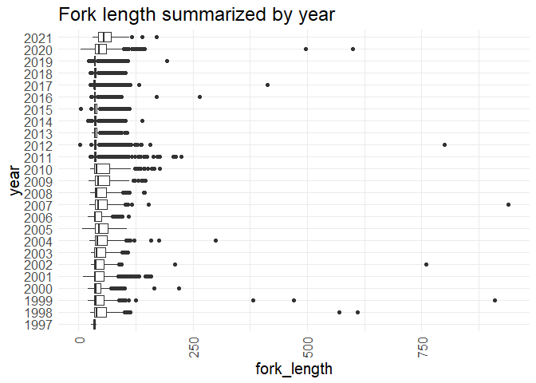
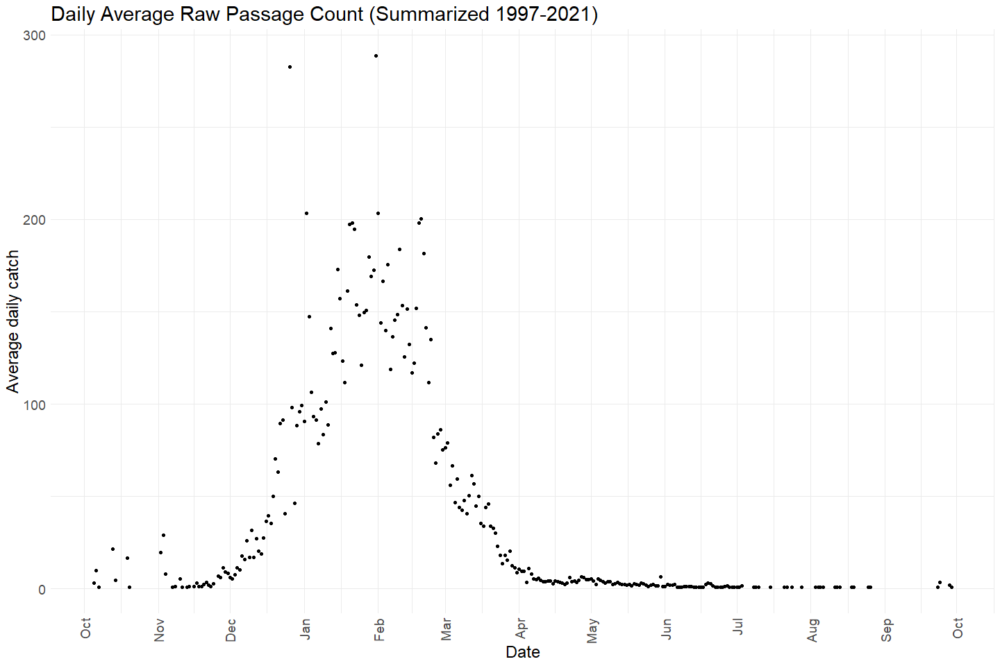

Feather River RST Catch Data QC
================
Erin Cain
9/29/2021

# Feather River RST Catch Data

## Description of Monitoring Data

RST catch data for all natural origin Chinook salmon on the Feather
River.

Background: The traps are typically operated for approximately seven
months (December through June). Traps are necessary on both the Low Flow
Channel (LFC) and High Flow Channel (HFC) because flow is strictly
regulated above the Thermalito Outlet (on the LFC) and therefore
emigration cues and species composition may be different for the two
reaches.

**QC/raw or estimates** This data is raw passage counts and is QC.

**Timeframe:** Dec 1997 - May 2021

**Trapping Season:** Typically December - June, looks like it varies
quite a bit.

**Completeness of Record throughout timeframe:** Data for every year in
the sample timeframe, detailed start and end dates for the season are
given in the `survey_year_details` table (Only the last 8 years are
displayed below):

| Water Year | Eye Riffle | Live Oak | Herringer Riffle | Steep Riffle | Sunset Pumps | Shawns Beach | Gateway Riffle |
|-----------:|:-----------|:---------|:-----------------|:-------------|:-------------|:-------------|:---------------|
|       2014 |            |          | Dec - May        |              |              |              | Dec - Apr      |
|       2015 |            |          | Dec - May        | Dec - Apr    |              |              | Dec - May      |
|       2016 |            |          | Dec - Apr        | Dec - Aug    |              |              | Dec - Apr      |
|       2017 |            |          | Dec - Aug        |              |              |              | Dec - Jun      |
|       2018 | Nov - Jun  |          | Nov - Jun        |              |              |              |                |
|       2019 | Dec - Jun  |          | Dec - Jun        |              |              |              |                |
|       2020 | Dec - Aug  |          | Dec - Jul        |              |              |              |                |
|       2021 | Dec - Jun  |          | Dec - May        |              |              |              |                |

**Sampling Location:** Two RST locations are generally used, one at the
lower end of each of the two study reaches. Typically, one RST is
stationed at the bottom of Eye Side Channel, RM 60.2 (approximately one
mile above the Thermalito Afterbay Outlet) and one stationed in the HFC
below Herringer riffle, at RM 45.7.

See `feather-rst-effort` for additional Location information.

**Data Contact:** [Kassie Hickey](mailto:KHickey@psmfc.org)

## Access Cloud Data

``` r
# Run Sys.setenv() to specify GCS_AUTH_FILE and GCS_DEFAULT_BUCKET before running 
# getwd() to see how to specify paths 
# Open object from google cloud storage
# Set your authentication using gcs_auth
gcs_auth(json_file = Sys.getenv("GCS_AUTH_FILE"))
# Set global bucket 
gcs_global_bucket(bucket = Sys.getenv("GCS_DEFAULT_BUCKET"))

gcs_list_objects()
# git data and save as xlsx
gcs_get_object(object_name = "rst/feather-river/data-raw/Feather River RST Natural Origin Chinook Catch Data_1998-2021.xlsx",
               bucket = gcs_get_global_bucket(),
               saveToDisk = "raw_feather_rst_data.xlsx",
               overwrite = TRUE)
```

Read in data from google cloud, glimpse raw data and domain description
sheet:

``` r
# read in data to clean
# RST Data
rst_data_sheets <- readxl::excel_sheets("raw_feather_rst_data.xlsx")
survey_year_details  <- readxl::read_excel("raw_feather_rst_data.xlsx", 
                                           sheet = "Survey Year Details") 
survey_year_details
```

    ## # A tibble: 55 x 5
    ##    Site       Location          `Survery Start`     `Survey End`        Notes   
    ##    <chr>      <chr>             <dttm>              <dttm>              <chr>   
    ##  1 Eye Riffle Low Flow Channel  1997-12-22 00:00:00 1998-07-01 00:00:00 <NA>    
    ##  2 Live Oak   High Flow Channel 1997-12-22 00:00:00 1998-07-01 00:00:00 <NA>    
    ##  3 Eye Riffle Low Flow Channel  1998-12-10 00:00:00 1999-08-31 00:00:00 Fished ~
    ##  4 Live Oak   High Flow Channel 1998-12-16 00:00:00 1999-09-09 00:00:00 Fished ~
    ##  5 Eye Riffle Low Flow Channel  1999-09-20 00:00:00 2000-08-31 00:00:00 <NA>    
    ##  6 Live Oak   High Flow Channel 1999-09-20 00:00:00 2000-08-31 00:00:00 <NA>    
    ##  7 Eye Riffle Low Flow Channel  2000-11-27 00:00:00 2001-06-21 00:00:00 <NA>    
    ##  8 Live Oak   High Flow Channel 2000-11-27 00:00:00 2001-06-21 00:00:00 <NA>    
    ##  9 Eye Riffle Low Flow Channel  2001-11-26 00:00:00 2002-06-14 00:00:00 <NA>    
    ## 10 Live Oak   High Flow Channel 2001-11-26 00:00:00 2002-01-14 00:00:00 <NA>    
    ## # ... with 45 more rows

``` r
# create function to read in all sheets of a 
read_sheets <- function(sheet){
  data <- read_excel("raw_feather_rst_data.xlsx", sheet = sheet)
}

raw_catch <- purrr::map(rst_data_sheets[-1], read_sheets) %>%
    reduce(bind_rows)

raw_catch %>% glimpse()
```

    ## Rows: 180,871
    ## Columns: 7
    ## $ Date             <dttm> 1997-12-23, 1997-12-23, 1997-12-23, 1997-12-23, 1997~
    ## $ siteName         <chr> "Eye Riffle", "Eye Riffle", "Eye Riffle", "Eye Riffle~
    ## $ commonName       <chr> "Chinook salmon", "Chinook salmon", "Chinook salmon",~
    ## $ `At Capture Run` <chr> "Fall", "Fall", "Fall", "Fall", "Fall", "Fall", "Fall~
    ## $ lifeStage        <chr> "Not recorded", "Parr", "Parr", "Parr", "Parr", "Parr~
    ## $ FL               <dbl> NA, 30, 32, 33, 34, 35, 38, 29, 37, 36, 31, 34, 33, 3~
    ## $ n                <dbl> 65, 2, 6, 8, 16, 10, 1, 1, 2, 2, 2, 19, 10, 2, 9, 7, ~

## Data transformations

``` r
# Snake case, 
# Columns are appropriate types
# Remove redundant columns
cleaner_catch_data <- raw_catch %>%
  rename("date" = Date, "site_name" = siteName, 
         "run" = `At Capture Run`, 
         "lifestage" = lifeStage, 
         "fork_length" = FL, "count" = n) %>%
  mutate(date = as.Date(date)) %>%
  filter(commonName == "Chinook salmon") %>%
  select(-commonName)

cleaner_catch_data %>% glimpse()
```

    ## Rows: 180,871
    ## Columns: 6
    ## $ date        <date> 1997-12-23, 1997-12-23, 1997-12-23, 1997-12-23, 1997-12-2~
    ## $ site_name   <chr> "Eye Riffle", "Eye Riffle", "Eye Riffle", "Eye Riffle", "E~
    ## $ run         <chr> "Fall", "Fall", "Fall", "Fall", "Fall", "Fall", "Fall", "F~
    ## $ lifestage   <chr> "Not recorded", "Parr", "Parr", "Parr", "Parr", "Parr", "P~
    ## $ fork_length <dbl> NA, 30, 32, 33, 34, 35, 38, 29, 37, 36, 31, 34, 33, 31, 35~
    ## $ count       <dbl> 65, 2, 6, 8, 16, 10, 1, 1, 2, 2, 2, 19, 10, 2, 9, 7, 1, 1,~

## Explore Numeric Variables:

``` r
# Filter clean data to show only numeric variables 
cleaner_catch_data %>% select_if(is.numeric) %>% colnames()
```

    ## [1] "fork_length" "count"

### Variable: `fork_length`

**Plotting fork\_length**

``` r
cleaner_catch_data %>% filter(fork_length < 250) %>% # filter out 13 points so we can more clearly see distribution
  ggplot(aes(x = fork_length)) + 
  geom_histogram(breaks=seq(0, 200, by=2)) + 
  scale_x_continuous(breaks=seq(0, 200, by=25)) +
  theme_minimal() +
  labs(title = "Fork length distribution") + 
  theme(text = element_text(size = 18),
        axis.text.x = element_text(angle = 90, vjust = 0.5, hjust=1)) 
```

<!-- -->

``` r
cleaner_catch_data %>% 
  mutate(year = as.factor(year(date))) %>%
  ggplot(aes(x = fork_length, y = year)) + 
  geom_boxplot() + 
  theme_minimal() +
  labs(title = "Fork length summarized by year") + 
  theme(text = element_text(size = 18),
        axis.text.x = element_text(angle = 90, vjust = 0.5, hjust=1)) 
```

<!-- -->

``` r
cleaner_catch_data %>% 
  mutate(year = as.factor(year(date))) %>%
  ggplot(aes(x = fork_length, y = lifestage)) + 
  geom_boxplot() + 
  theme_minimal() +
  labs(title = "Fork length summarized by lifestage") + 
  theme(text = element_text(size = 18),
        axis.text.x = element_text(angle = 90, vjust = 0.5, hjust=1)) 
```

<!-- -->

**Numeric Summary of fork\_length over Period of Record**

``` r
# Table with summary statistics
summary(cleaner_catch_data$fork_length)
```

    ##    Min. 1st Qu.  Median    Mean 3rd Qu.    Max.    NA's 
    ##    3.00   35.00   37.00   44.17   49.00  940.00    9216

**NA and Unknown Values**

-   5.1 % of values in the `fork_length` column are NA.

### Variable: `count`

**Plotting raw passage counts over period of record**

``` r
cleaner_catch_data %>% 
  filter(year(date) > 2014, year(date) < 2021) %>%
  mutate(water_year = ifelse(month(date) %in% 10:12, year(date) + 1, year(date))) %>% 
  left_join(sac_indices) %>%
  mutate(year = as.factor(year(date)),
         fake_year = if_else(month(date) %in% 10:12, 1900, 1901),
         fake_date = as.Date(paste0(fake_year,"-", month(date), "-", day(date)))) %>%
  filter(water_year < 2021) %>%
  group_by(date) %>%
  mutate(total_daily_catch = sum(count)) %>%
  ungroup() %>%
  ggplot(aes(x = fake_date, y = total_daily_catch, fill = year_type)) + 
  geom_col() + 
  scale_x_date(labels = date_format("%b"), limits = c(as.Date("1900-10-01"), as.Date("1901-06-01")), date_breaks = "1 month") + 
  theme_minimal() + 
  theme(text = element_text(size = 18),
        axis.text.x = element_text(angle = 90, vjust = 0.5, hjust=1),
        legend.position = "bottom") + 
  labs(title = "Total Daily Raw Passage 2015 - 2020",
       y = "Total daily catch",
       x = "Date")+ 
  facet_wrap(~water_year, scales = "free") + 
  scale_fill_manual(values = palette)
```

    ## Joining, by = "water_year"

<!-- -->

``` r
cleaner_catch_data  %>%
  filter(year(date) < 2021) %>% 
  mutate(year = as.factor(year(date))) %>%
  ggplot(aes(x = year, y = count)) + 
  geom_col() + 
  theme_minimal() +
  labs(title = "Total Fish Counted each Year by run",
       y = "Total fish count") + 
  theme(text = element_text(size = 18),
        axis.text.x = element_text(angle = 90, vjust = 0.5, hjust=1)) + 
  facet_wrap(~run, scales = "free_y")
```

<!-- -->

The majority of “Not recorded” run values occur in 2015. 28.3502636 % of
the values in 2005 are “Not recorded”.

**Numeric Summary of count over Period of Record**

``` r
# Table with summary statistics
summary(cleaner_catch_data$count)
```

    ##      Min.   1st Qu.    Median      Mean   3rd Qu.      Max. 
    ##      1.00      1.00      1.00     78.63      1.00 123556.00

**NA and Unknown Values**

-   0 % of values in the `count` column are NA.

## Explore Categorical variables:

``` r
# Filter clean data to show only categorical variables 
cleaner_catch_data %>% select_if(is.character) %>% colnames()
```

    ## [1] "site_name" "run"       "lifestage"

### Variable: `site_name`

The feather river efficiency data contains additional information about
sub sites and lat/long values.

``` r
table(cleaner_catch_data$site_name) 
```

    ## 
    ##       Eye Riffle   Gateway Riffle Herringer Riffle         Live Oak 
    ##            35969            19010            77310             8020 
    ##    Shawn's Beach     Steep Riffle     Sunset Pumps 
    ##               45            24642            15875

``` r
cleaner_catch_data$site_name <- str_replace_all(cleaner_catch_data$site_name, "'", "")

table(cleaner_catch_data$site_name) 
```

    ## 
    ##       Eye Riffle   Gateway Riffle Herringer Riffle         Live Oak 
    ##            35969            19010            77310             8020 
    ##     Shawns Beach     Steep Riffle     Sunset Pumps 
    ##               45            24642            15875

**NA and Unknown Values**

-   0 % of values in the `site_name` column are NA.

### Variable: \`run\`\`

``` r
table(cleaner_catch_data$run) 
```

    ## 
    ##         Fall    Late fall Not recorded       Spring       Winter 
    ##       167243         3091          127        10407            3

``` r
cleaner_catch_data$run <- ifelse(cleaner_catch_data$run == "Not recorded", NA, tolower(cleaner_catch_data$run))
```

**NA and Unknown Values**

-   0.1 % of values in the `run` column are NA.

### Variable: `lifestage`

``` r
table(cleaner_catch_data$lifestage) 
```

    ## 
    ##                   Adult                     Fry                Juvenile 
    ##                      42                   26917                       1 
    ##            Not recorded                    Parr               Pre-smolt 
    ##                    9484                  116135                    1097 
    ##            Silvery parr                   Smolt   Yolk sac fry (alevin) 
    ##                   24053                    1478                    1663 
    ## YOY (young of the year) 
    ##                       1

``` r
cleaner_catch_data$lifestage <- ifelse(cleaner_catch_data$lifestage == "Not recorded", NA, tolower(cleaner_catch_data$lifestage))
```

**NA and Unknown Values**

-   5.2 % of values in the `lifestage` column are NA.

``` r
feather_rst <- cleaner_catch_data %>% glimpse()
```

    ## Rows: 180,871
    ## Columns: 6
    ## $ date        <date> 1997-12-23, 1997-12-23, 1997-12-23, 1997-12-23, 1997-12-2~
    ## $ site_name   <chr> "Eye Riffle", "Eye Riffle", "Eye Riffle", "Eye Riffle", "E~
    ## $ run         <chr> "fall", "fall", "fall", "fall", "fall", "fall", "fall", "f~
    ## $ lifestage   <chr> NA, "parr", "parr", "parr", "parr", "parr", "parr", "parr"~
    ## $ fork_length <dbl> NA, 30, 32, 33, 34, 35, 38, 29, 37, 36, 31, 34, 33, 31, 35~
    ## $ count       <dbl> 65, 2, 6, 8, 16, 10, 1, 1, 2, 2, 2, 19, 10, 2, 9, 7, 1, 1,~

### Save cleaned data back to google cloud

``` r
# Write to google cloud 
# Name file [watershed]_[data type].csv
f <- function(input, output) write_csv(input, file = output)

gcs_upload(feather_rst,
           object_function = f,
           type = "csv",
           name = "rst/feather-river/data/feather_rst.csv")
```
