Lower Sacramento (Knight’s Landing) RST data QC - sampling effort
================
Ashley Vizek
10/19/2021

# Lower Sacramento (Knight’s Landing) Rotary Screw Trap Data

## Description of Monitoring Data

**Timeframe:**

10/04/2002 through 05/31/2021

**Completeness of Record throughout timeframe:**

-   The 2013 sampling period is not complete (includes Oct 2012 through
    Dec 2012)
-   We are missing data for 2017 and 2018.

**Sampling Location:**

Lower Sacramento - Knight’s Landing

**Data Contact:**

[Jeanine Phillips](mailto::Jeanine.Phillips@wildlife.ca.gov)

## Access Cloud Data

``` r
# Run Sys.setenv() to specify GCS_AUTH_FILE and GCS_DEFAULT_BUCKET before running 
# getwd() to see how to specify paths 
# Open object from google cloud storage
# Set your authentication using gcs_auth
gcs_auth(json_file = Sys.getenv("GCS_AUTH_FILE"))
# Set global bucket 
gcs_global_bucket(bucket = Sys.getenv("GCS_DEFAULT_BUCKET"))

gcs_list_objects()

get_data <- function(name) {
gcs_get_object(object_name = paste0("rst/lower-sac-river/data/knights-landing/knl_combine_", name,".csv"),
               bucket = gcs_get_global_bucket(),
               saveToDisk = paste0("knl_combine_", name, ".csv"),
               overwrite = TRUE)
}

get_data("sampling_effort")
```

Read in data from google cloud, glimpse raw data and domain description
sheet. All transformations are implemented at the end of this document.
- Need to change date, start\_date, stop\_date into appropriate format.

``` r
# read in data to clean 
knl_effort <- read_csv("knl_combine_sampling_effort.csv", show_col_types = F)
glimpse(knl_effort)
```

    ## Rows: 6,744
    ## Columns: 19
    ## $ date                 <date> 2002-10-04, 2002-10-04, 2002-10-11, 2002-10-11, …
    ## $ start_date           <dttm> NA, NA, NA, NA, NA, NA, NA, NA, NA, NA, NA, NA, …
    ## $ stop_date            <dttm> NA, NA, NA, NA, NA, NA, NA, NA, NA, NA, NA, NA, …
    ## $ location             <chr> "KL", "KL", "KL", "KL", "KL", "KL", "KL", "KL", "…
    ## $ gear                 <chr> "RST", "RST", "RST", "RST", "RST", "RST", "RST", …
    ## $ number_traps         <dbl> 2, 2, 2, 2, 2, 2, 2, 2, 2, 2, 2, 2, 2, 2, 2, 2, 2…
    ## $ hrs_fished           <dbl> 110.50, 110.50, 335.00, 335.00, 196.50, 196.50, 9…
    ## $ sampling_period_hrs  <dbl> NA, NA, NA, NA, NA, NA, NA, NA, NA, NA, NA, NA, N…
    ## $ flow_cfs             <dbl> 6031, 6031, 4819, 4819, 5249, 5249, 5186, 5186, 5…
    ## $ secchi_ft            <dbl> NA, NA, NA, NA, 3.0, 3.0, 4.6, 4.6, 3.3, 3.3, 3.5…
    ## $ water_t_f            <dbl> 59, 59, 64, 64, 60, 60, 58, 58, 60, 60, 60, 60, 5…
    ## $ klci                 <dbl> NA, NA, NA, NA, NA, NA, NA, NA, NA, NA, NA, NA, N…
    ## $ cone_sampling_effort <chr> NA, NA, NA, NA, NA, NA, NA, NA, NA, NA, NA, NA, N…
    ## $ comments             <chr> NA, NA, NA, NA, NA, NA, NA, NA, NA, NA, NA, NA, N…
    ## $ turbidity            <dbl> NA, NA, NA, NA, NA, NA, NA, NA, NA, NA, NA, NA, N…
    ## $ turbidity_units      <chr> "NTU", "NTU", "NTU", "NTU", "NTU", "NTU", "NTU", …
    ## $ cone_id              <dbl> 8.3, 8.4, 8.3, 8.4, 8.3, 8.4, 8.3, 8.4, 8.3, 8.4,…
    ## $ cone_rpm             <dbl> NA, NA, NA, NA, NA, NA, NA, NA, NA, NA, NA, NA, N…
    ## $ total_cone_rev       <dbl> NA, NA, NA, NA, NA, NA, NA, NA, NA, NA, NA, NA, N…

## Data Dictionary

The following table describes the variables included in this dataset and
the percent that do not include data.

``` r
percent_na <- knl_effort %>%
  summarise_all(list(name = ~sum(is.na(.))/length(.))) %>%
  pivot_longer(cols = everything())
  
data_dictionary <- tibble(variables = colnames(knl_effort),
                          description = c("Date of sampling. In more recent years, start and stop date are collected in which case date is the stop date.",
                                          "Date and time when sampling started. This was not collected in earlier sampling years.",
                                          "Date and time when sampling stopped. This was not collected in earlier sampling years.",
                                          "Site name/code for the RST trap. All are KL.",
                                          "Type of gear used. The options used are RST or 2 x 8 cone.",
                                          "The number of traps used. Consistently 2 except in a few cases.",
                                          "Calculated as the (total cone revolutions/RPMs)/60 and combined for both traps.",
                                          "Number of hours since trap was last checked.",
                                          "River flow (cfs) at Wilkins gage.",
                                          "Measurement of water transparency (ft).",
                                          "Water temperature (F)",
                                          "FILL IN DETAILS FOR KLCI",
                                          "Percent of cones functioning. Very little data here.",
                                          "Qualitative comments about data collection and equipment.",
                                          "Measurement of turbidity.",
                                          "Units used for turbidity. In all years except 2014 NTU is used. FTU is used in 2014.",
                                          "Identification number of cone/trap.",
                                          "Revolutions per minute. These may differ by cone_id.",
                                          "Total cone revolutions. These may differ by cone_id."),
                          percent_na = round(percent_na$value*100)
                          
)
kable(data_dictionary)
```

| variables              | description                                                                                                    | percent\_na |
|:-----------------------|:---------------------------------------------------------------------------------------------------------------|------------:|
| date                   | Date of sampling. In more recent years, start and stop date are collected in which case date is the stop date. |           0 |
| start\_date            | Date and time when sampling started. This was not collected in earlier sampling years.                         |          51 |
| stop\_date             | Date and time when sampling stopped. This was not collected in earlier sampling years.                         |          51 |
| location               | Site name/code for the RST trap. All are KL.                                                                   |          44 |
| gear                   | Type of gear used. The options used are RST or 2 x 8 cone.                                                     |          44 |
| number\_traps          | The number of traps used. Consistently 2 except in a few cases.                                                |          55 |
| hrs\_fished            | Calculated as the (total cone revolutions/RPMs)/60 and combined for both traps.                                |           0 |
| sampling\_period\_hrs  | Number of hours since trap was last checked.                                                                   |          45 |
| flow\_cfs              | River flow (cfs) at Wilkins gage.                                                                              |           1 |
| secchi\_ft             | Measurement of water transparency (ft).                                                                        |          40 |
| water\_t\_f            | Water temperature (F)                                                                                          |           0 |
| klci                   | FILL IN DETAILS FOR KLCI                                                                                       |          93 |
| cone\_sampling\_effort | Percent of cones functioning. Very little data here.                                                           |          77 |
| comments               | Qualitative comments about data collection and equipment.                                                      |          86 |
| turbidity              | Measurement of turbidity.                                                                                      |           4 |
| turbidity\_units       | Units used for turbidity. In all years except 2014 NTU is used. FTU is used in 2014.                           |           0 |
| cone\_id               | Identification number of cone/trap.                                                                            |           0 |
| cone\_rpm              | Revolutions per minute. These may differ by cone\_id.                                                          |          45 |
| total\_cone\_rev       | Total cone revolutions. These may differ by cone\_id.                                                          |          45 |

## Data transformations

This work was primarily done in
[1\_knights\_landing\_initial\_clean.Rmd](https://github.com/FlowWest/JPE-datasets/blob/main/scripts/rst/lower-sac/knights_landing/1_knights_landing_initial_clean.Rmd)
and
[2\_knights\_landing\_combined\_data.Rmd](https://github.com/FlowWest/JPE-datasets/blob/main/scripts/rst/lower-sac/knights_landing/2_knights_landing_combined_data.Rmd)

## Explore Numeric Variables

``` r
# Filter clean data to show only numeric variables (this way we know we do not miss any)
knl_effort %>%
  select_if(is.numeric) %>%
  colnames()
```

    ##  [1] "number_traps"        "hrs_fished"          "sampling_period_hrs"
    ##  [4] "flow_cfs"            "secchi_ft"           "water_t_f"          
    ##  [7] "klci"                "turbidity"           "cone_id"            
    ## [10] "cone_rpm"            "total_cone_rev"

### Variable: `number_traps`

**Plotting `number_traps` over Period of Record**

This variable exists for years 2002-2011 and is consistently 2; except
in a few cases.

``` r
filter(knl_effort, year(date) <= 2011) %>%
ggplot(aes(y = number_traps)) +
  geom_histogram() +
  facet_wrap(~year(date))
```

    ## `stat_bin()` using `bins = 30`. Pick better value with `binwidth`.

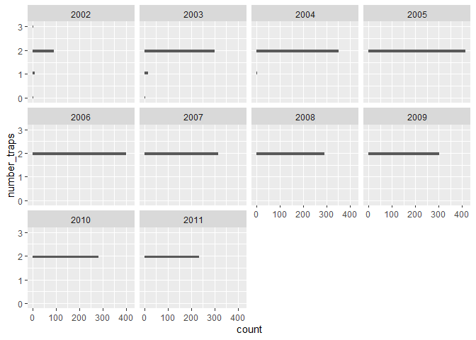<!-- -->

**Numeric Summary of `number_traps` over Period of Record**

``` r
knl_effort %>%
  group_by(year(date)) %>%
  summarize(mean = mean(number_traps, na.rm = T),
            median = median(number_traps, na.rm = T),
            min = min(number_traps, na.rm = T),
            max = max(number_traps, na.rm = T),
            na = length(which(is.na(number_traps))))
```

    ## # A tibble: 19 × 6
    ##    `year(date)`   mean median   min   max    na
    ##           <dbl>  <dbl>  <dbl> <dbl> <dbl> <int>
    ##  1         2002   1.85      2     0     3     0
    ##  2         2003   1.94      2     0     2     0
    ##  3         2004   1.99      2     1     2     0
    ##  4         2005   2         2     2     2     0
    ##  5         2006   2         2     2     2     0
    ##  6         2007   2         2     2     2     0
    ##  7         2008   2         2     2     2     0
    ##  8         2009   2         2     2     2     0
    ##  9         2010   2         2     2     2     0
    ## 10         2011   2         2     2     2    70
    ## 11         2012 NaN        NA   Inf  -Inf   320
    ## 12         2013 NaN        NA   Inf  -Inf   272
    ## 13         2014 NaN        NA   Inf  -Inf   628
    ## 14         2015 NaN        NA   Inf  -Inf   522
    ## 15         2016 NaN        NA   Inf  -Inf   324
    ## 16         2018 NaN        NA   Inf  -Inf   214
    ## 17         2019 NaN        NA   Inf  -Inf   576
    ## 18         2020 NaN        NA   Inf  -Inf   488
    ## 19         2021 NaN        NA   Inf  -Inf   304

**NA and Unknown Values**

Percent of NA:

55.1 % of values in the `number_traps` column are NA.

### Variable: `hrs_fished`

**Plotting `hrs_fished` over Period of Record**

``` r
# knl_effort %>%
#   mutate(fake_year = 2000, 
#          fake_date = ymd(paste(fake_year, month(date), day(date)))) %>%
  
  
  ggplot(knl_effort, aes(hrs_fished)) +
  geom_histogram() +
  facet_wrap(~year(date))
```

    ## `stat_bin()` using `bins = 30`. Pick better value with `binwidth`.

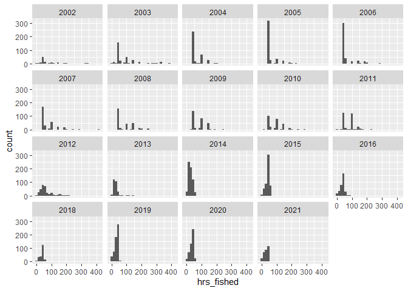<!-- -->

**Numeric Summary of `hrs_fished` over Period of Record**

``` r
knl_effort %>%
  group_by(year(date)) %>%
  summarize(mean = round(mean(hrs_fished, na.rm = T),2),
            median = round(median(hrs_fished, na.rm = T),2),
            min = round(min(hrs_fished, na.rm = T),2),
            max = round(max(hrs_fished, na.rm = T),2),
            na = length(which(is.na(hrs_fished))))
```

    ## # A tibble: 19 × 6
    ##    `year(date)`  mean median   min   max    na
    ##           <dbl> <dbl>  <dbl> <dbl> <dbl> <int>
    ##  1         2002  76.2   48.2  0    337.      0
    ##  2         2003  87.6   48.8  0    384       0
    ##  3         2004  65.8   48.5 36.5  197.      0
    ##  4         2005  61.4   48.1 40.2  228       0
    ##  5         2006  64.6   48.2 38.5  288.      0
    ##  6         2007  79.8   49.5 40.5  415.      0
    ##  7         2008  86.6   49   43.2  242.      0
    ##  8         2009  81.9   73.5 27.8  236.      0
    ##  9         2010  90.9   93.5  8    289       0
    ## 10         2011  79.8   94    0    225.      0
    ## 11         2012  63.3   50.8  5.81 219.      2
    ## 12         2013  27.1   25.7  4.82 149.      0
    ## 13         2014  26.5   22.9  0     60.8     0
    ## 14         2015  40.2   45.4  3.72  58.6     0
    ## 15         2016  36.2   39.3  2.75  86.4     0
    ## 16         2018  36.3   41.9  3.79  61.6     0
    ## 17         2019  32.5   35.2  0     54.0     0
    ## 18         2020  35.1   37.9  2.14 280.      0
    ## 19         2021  29.8   30.0  0     79.6     4

**NA and Unknown Values**

Percent of NA:

0.1 % of values in the `hrs_fished` column are NA.

### Variable: `sampling_period_hrs`

**Plotting `sampling_period_hrs` over Period of Record**

Data for this variable was collected beginning in 2011 (sampling year
2012).

``` r
ggplot(filter(knl_effort, year(date) >= 2011), aes(sampling_period_hrs)) +
  geom_histogram() +
  facet_wrap(~year(date))
```

    ## `stat_bin()` using `bins = 30`. Pick better value with `binwidth`.

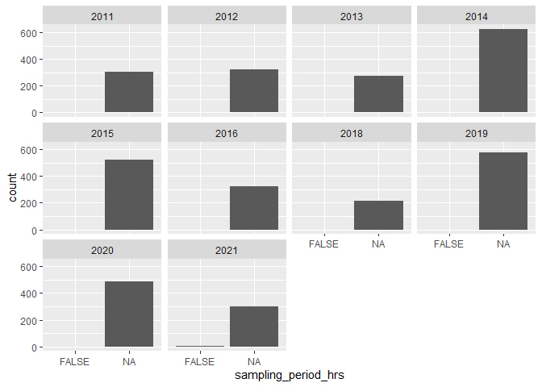<!-- -->

**Numeric Summary of `sampling_period_hrs` over Period of Record**

``` r
filter(knl_effort, year(date) >= 2011) %>%
  group_by(year(date)) %>%
  summarize(mean = round(mean(sampling_period_hrs, na.rm = T),2),
            median = round(median(sampling_period_hrs, na.rm = T),2),
            min = round(min(sampling_period_hrs, na.rm = T),2),
            max = round(max(sampling_period_hrs, na.rm = T),2),
            na = length(which(is.na(sampling_period_hrs))))
```

    ## # A tibble: 10 × 6
    ##    `year(date)`  mean median   min   max    na
    ##           <dbl> <dbl>  <dbl> <dbl> <dbl> <int>
    ##  1         2011  58.2   49   21.5   96.8   234
    ##  2         2012  37.8   24.5 21    120.      0
    ##  3         2013  14.3   14.5  6     70.5     0
    ##  4         2014  14.5   13    0     27.2     0
    ##  5         2015  23.4   24    3     29.5     0
    ##  6         2016  22.4   23.8  2.5   26.5     0
    ##  7         2018  23.6   24    3.25  27.5     0
    ##  8         2019  23.2   23.8  1.25  30.8     0
    ##  9         2020  24     24   19.8   27.8     0
    ## 10         2021  23.7   24    0     28.2     4

**NA and Unknown Values**

Percent of NA:

44.9 % of values in the `sampling_period_hrs` column are NA.

### Variable: `flow_cfs`

**Plotting `flow_cfs` over Period of Record**

``` r
ggplot(knl_effort, aes(y = flow_cfs)) +
  geom_histogram() +
  facet_wrap(~year(date))
```

    ## `stat_bin()` using `bins = 30`. Pick better value with `binwidth`.

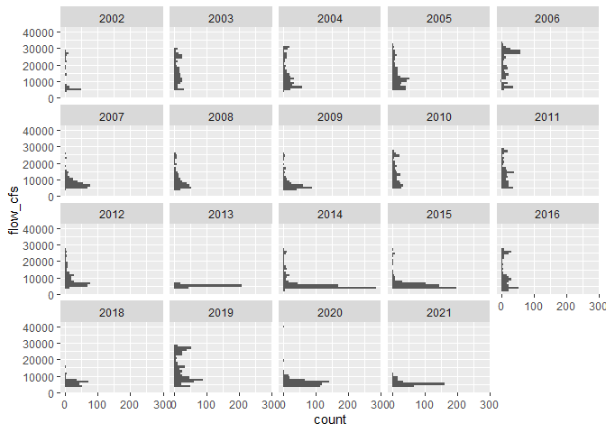<!-- -->

``` r
knl_effort %>%
  mutate(wy = factor(ifelse(month(date) %in% 10:12, year(date) + 1, year(date))),
         fake_year = 2000,
         fake_year = ifelse(month(date) %in% 10:12, fake_year - 1, fake_year),
         fake_date = ymd(paste(fake_year, month(date), day(date)))) %>%
  ggplot(aes(x = fake_date, y = flow_cfs)) +
  scale_x_date(date_breaks = "3 month", date_labels = "%b") +
  geom_line(size = 0.5) +
  xlab("") +
  facet_wrap(~wy)
```

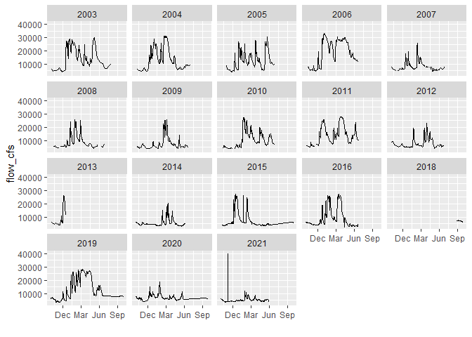<!-- -->

**Numeric Summary of `flow_cfs` over Period of Record**

``` r
knl_effort %>%
  group_by(year(date)) %>%
  summarize(mean = round(mean(flow_cfs, na.rm = T),2),
            median = round(median(flow_cfs, na.rm = T),2),
            min = round(min(flow_cfs, na.rm = T),2),
            max = round(max(flow_cfs, na.rm = T),2),
            na = length(which(is.na(flow_cfs))))
```

    ## # A tibble: 19 × 6
    ##    `year(date)`   mean median   min   max    na
    ##           <dbl>  <dbl>  <dbl> <dbl> <dbl> <int>
    ##  1         2002 11271.  6031   4435 27971     0
    ##  2         2003 15979. 14825   4615 30000     0
    ##  3         2004 13975. 11227   4276 31258     0
    ##  4         2005 13444. 11479   4951 32321     0
    ##  5         2006 20338. 22708   5111 33258     4
    ##  6         2007  8246.  7224.  4402 25904     8
    ##  7         2008  9909.  7758.  4142 25913     8
    ##  8         2009  7937.  6028.  3623 25688     8
    ##  9         2010 13511. 12467   4752 27175     4
    ## 10         2011 13927. 13221   5030 27858     2
    ## 11         2012  9516.  7044   3810 26421     2
    ## 12         2013  4785.  4645   3520  6000     0
    ## 13         2014  6505.  4640   3090 27000     0
    ## 14         2015  6103.  5110   3490 26400     0
    ## 15         2016 12062.  9330   2690 27100     0
    ## 16         2018  5914.  6058   3358 15011     0
    ## 17         2019 13855. 10700.  4004 27992     0
    ## 18         2020  6159.  5865   3614 40004     2
    ## 19         2021  5514.  5153   3917 11664     2

**NA and Unknown Values**

Percent of NA:

0.6 % of values in the `flow_cfs` column are NA.

### Variable: `secchi_ft`

**Plotting `secchi_ft` over Period of Record**

Data for this variable was not collected after 2014.

``` r
ggplot(filter(knl_effort, year(date) <= 2014), aes(y = secchi_ft)) +
  geom_histogram() +
  facet_wrap(~year(date))
```

    ## `stat_bin()` using `bins = 30`. Pick better value with `binwidth`.

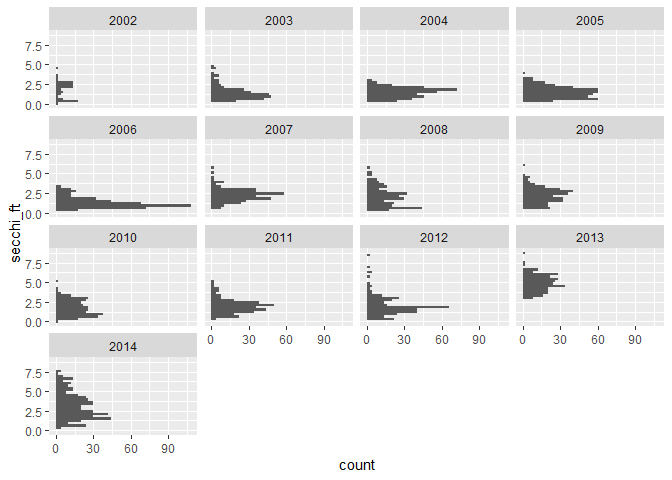<!-- -->

``` r
filter(knl_effort, year(date) <= 2014) %>%
  mutate(wy = factor(ifelse(month(date) %in% 10:12, year(date) + 1, year(date))),
         fake_year = 2000,
         fake_year = ifelse(month(date) %in% 10:12, fake_year - 1, fake_year),
         fake_date = ymd(paste(fake_year, month(date), day(date)))) %>%
  ggplot(aes(x = fake_date, y = secchi_ft)) +
  scale_x_date(date_breaks = "3 month", date_labels = "%b") +
  geom_line(size = 0.5) +
  xlab("") +
  facet_wrap(~wy)
```

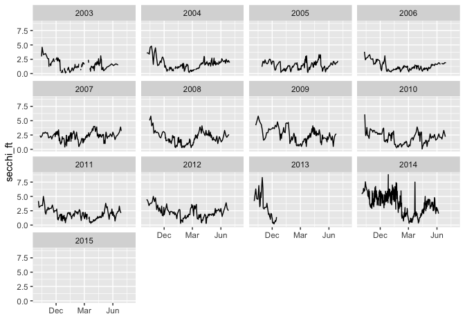<!-- -->

**Numeric Summary of `secchi_ft` over Period of Record**

``` r
filter(knl_effort, year(date) <= 2014) %>%
  group_by(year(date)) %>%
  summarize(mean = round(mean(secchi_ft, na.rm = T),2),
            median = round(median(secchi_ft, na.rm = T),2),
            min = round(min(secchi_ft, na.rm = T),2),
            max = round(max(secchi_ft, na.rm = T),2),
            na = length(which(is.na(secchi_ft))))
```

    ## # A tibble: 13 × 6
    ##    `year(date)`  mean median   min   max    na
    ##           <dbl> <dbl>  <dbl> <dbl> <dbl> <int>
    ##  1         2002  1.74    2.1  0.1    4.6    14
    ##  2         2003  1.39    1.1  0.2    4.8    56
    ##  3         2004  1.45    1.5  0.2    3       4
    ##  4         2005  1.47    1.4  0.2    3.8     2
    ##  5         2006  1.26    1.1  0.3    3.4     4
    ##  6         2007  2.26    2.3  0.5    5.8     2
    ##  7         2008  2.01    1.9  0.3    5.8     2
    ##  8         2009  2.23    2.3  0.5    6.1     0
    ##  9         2010  1.75    1.6  0.06   5       2
    ## 10         2011  1.94    1.9  0.3    5       2
    ## 11         2012  1.98    1.8  0.2    8.3     0
    ## 12         2013  4.91    4.9  2.9    8.8     0
    ## 13         2014  3.16    2.9  0.3    7.5   166

**NA and Unknown Values**

Percent of NA:

39.8 % of values in the `secchi_ft` column are NA.

### Variable: `water_t_f`

**Plotting `water_t_f` over Period of Record**

``` r
ggplot(knl_effort, aes(y = water_t_f)) +
  geom_histogram() +
  facet_wrap(~year(date))
```

    ## `stat_bin()` using `bins = 30`. Pick better value with `binwidth`.

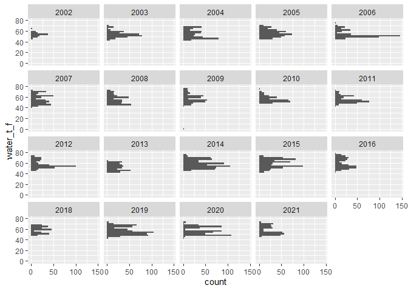<!-- -->

``` r
knl_effort %>%
  mutate(wy = factor(ifelse(month(date) %in% 10:12, year(date) + 1, year(date))),
         fake_year = 2000,
         fake_year = ifelse(month(date) %in% 10:12, fake_year - 1, fake_year),
         fake_date = ymd(paste(fake_year, month(date), day(date)))) %>%
  ggplot(aes(x = fake_date, y = water_t_f)) +
  scale_x_date(date_breaks = "3 month", date_labels = "%b") +
  geom_line(size = 0.5) +
  xlab("") +
  facet_wrap(~wy)
```

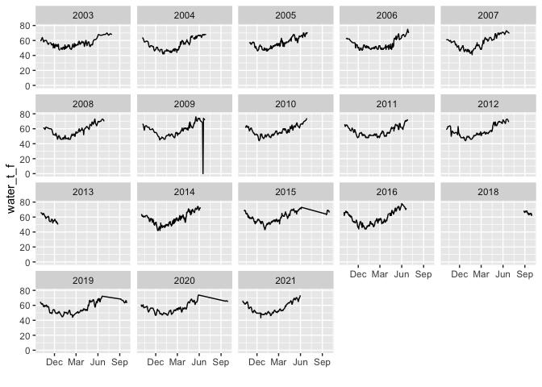<!-- -->

**Numeric Summary of `water_t_f` over Period of Record**

``` r
knl_effort %>%
  group_by(year(date)) %>%
  summarize(mean = round(mean(water_t_f, na.rm = T),2),
            median = round(median(water_t_f, na.rm = T),2),
            min = round(min(water_t_f, na.rm = T),2),
            max = round(max(water_t_f, na.rm = T),2),
            na = length(which(is.na(water_t_f))))
```

    ## # A tibble: 19 × 6
    ##    `year(date)`  mean median   min   max    na
    ##           <dbl> <dbl>  <dbl> <dbl> <dbl> <int>
    ##  1         2002  53.6   54    47    64       6
    ##  2         2003  53.7   53    42    70       2
    ##  3         2004  54.2   55    42    68       2
    ##  4         2005  56.0   55    46    71       0
    ##  5         2006  53.4   51    45    75       0
    ##  6         2007  56.0   54    41    73       0
    ##  7         2008  55.8   55    45    73       0
    ##  8         2009  57.1   56.5   0    76       0
    ##  9         2010  55.9   55    48    74       0
    ## 10         2011  55.0   53    44    72       0
    ## 11         2012  57.0   55    46    73       0
    ## 12         2013  52.4   52    42    64       0
    ## 13         2014  58.2   57    46    74       0
    ## 14         2015  59.0   60    43    73       0
    ## 15         2016  59.2   56    44    78       2
    ## 16         2018  58.4   59    48.9  68       0
    ## 17         2019  56.0   54.2  44    72.2     0
    ## 18         2020  56.6   55.4  43.3  73.8     0
    ## 19         2021  57.4   54.6  46.2  73.4     2

Seems unlikely that water temp would be 0 in 2009. Check to make sure
this isn’t a typo. I think this is a typo and should be changed to 70.
Made that change to knl\_effort\_changes in change section below.

``` r
filter(knl_effort, year(date) == 2009, water_t_f == 0)
```

    ## # A tibble: 2 × 19
    ##   date       start_date stop_date location gear  number_traps
    ##   <date>     <dttm>     <dttm>    <chr>    <chr>        <dbl>
    ## 1 2009-06-17 NA         NA        KL       RST              2
    ## 2 2009-06-17 NA         NA        KL       RST              2
    ## # … with 13 more variables: hrs_fished <dbl>, sampling_period_hrs <dbl>,
    ## #   flow_cfs <dbl>, secchi_ft <dbl>, water_t_f <dbl>, klci <dbl>,
    ## #   cone_sampling_effort <chr>, comments <chr>, turbidity <dbl>,
    ## #   turbidity_units <chr>, cone_id <dbl>, cone_rpm <dbl>, total_cone_rev <dbl>

``` r
filter(knl_effort, year(date) == 2009, month(date) == 6)
```

    ## # A tibble: 20 × 19
    ##    date       start_date stop_date location gear 
    ##    <date>     <dttm>     <dttm>    <chr>    <chr>
    ##  1 2009-06-01 NA         NA        KL       RST  
    ##  2 2009-06-01 NA         NA        KL       RST  
    ##  3 2009-06-03 NA         NA        KL       RST  
    ##  4 2009-06-03 NA         NA        KL       RST  
    ##  5 2009-06-05 NA         NA        KL       RST  
    ##  6 2009-06-05 NA         NA        KL       RST  
    ##  7 2009-06-09 NA         NA        KL       RST  
    ##  8 2009-06-09 NA         NA        KL       RST  
    ##  9 2009-06-12 NA         NA        KL       RST  
    ## 10 2009-06-12 NA         NA        KL       RST  
    ## 11 2009-06-15 NA         NA        KL       RST  
    ## 12 2009-06-15 NA         NA        KL       RST  
    ## 13 2009-06-17 NA         NA        KL       RST  
    ## 14 2009-06-17 NA         NA        KL       RST  
    ## 15 2009-06-19 NA         NA        KL       RST  
    ## 16 2009-06-19 NA         NA        KL       RST  
    ## 17 2009-06-22 NA         NA        KL       RST  
    ## 18 2009-06-22 NA         NA        KL       RST  
    ## 19 2009-06-25 NA         NA        KL       RST  
    ## 20 2009-06-25 NA         NA        KL       RST  
    ## # … with 14 more variables: number_traps <dbl>, hrs_fished <dbl>,
    ## #   sampling_period_hrs <dbl>, flow_cfs <dbl>, secchi_ft <dbl>,
    ## #   water_t_f <dbl>, klci <dbl>, cone_sampling_effort <chr>, comments <chr>,
    ## #   turbidity <dbl>, turbidity_units <chr>, cone_id <dbl>, cone_rpm <dbl>,
    ## #   total_cone_rev <dbl>

**NA and Unknown Values**

Percent of NA:

0.2 % of values in the `water_t_f` column are NA.

### Variable: `klci`

**Plotting `klci` over Period of Record**

Data for this variable was only collected in 2020 and 2021. Very few
observations that are not 0. I may remove this variable from the
combined dataset because there is so little information.

``` r
ggplot(knl_effort, aes(y = klci)) +
  geom_histogram()
```

    ## `stat_bin()` using `bins = 30`. Pick better value with `binwidth`.

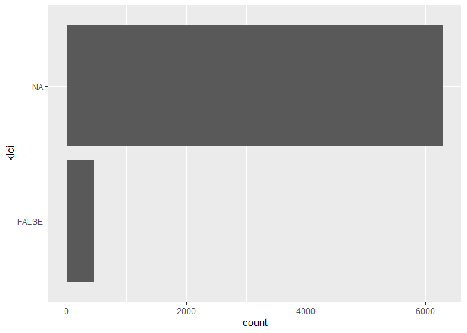<!-- -->

**Numeric Summary of `klci` over Period of Record**

``` r
knl_effort %>%
  group_by(year(date)) %>%
  summarize(mean = round(mean(klci, na.rm = T),2),
            median = round(median(klci, na.rm = T),2),
            min = round(min(klci, na.rm = T),2),
            max = round(max(klci, na.rm = T),2),
            na = length(which(is.na(klci))))
```

    ## # A tibble: 19 × 6
    ##    `year(date)`   mean median   min     max    na
    ##           <dbl>  <dbl>  <dbl> <dbl>   <dbl> <int>
    ##  1         2002 NaN        NA   Inf -Inf      106
    ##  2         2003 NaN        NA   Inf -Inf      316
    ##  3         2004 NaN        NA   Inf -Inf      356
    ##  4         2005 NaN        NA   Inf -Inf      416
    ##  5         2006 NaN        NA   Inf -Inf      402
    ##  6         2007 NaN        NA   Inf -Inf      316
    ##  7         2008 NaN        NA   Inf -Inf      292
    ##  8         2009 NaN        NA   Inf -Inf      304
    ##  9         2010 NaN        NA   Inf -Inf      284
    ## 10         2011 NaN        NA   Inf -Inf      304
    ## 11         2012 NaN        NA   Inf -Inf      320
    ## 12         2013 NaN        NA   Inf -Inf      272
    ## 13         2014 NaN        NA   Inf -Inf      628
    ## 14         2015 NaN        NA   Inf -Inf      522
    ## 15         2016 NaN        NA   Inf -Inf      324
    ## 16         2018 NaN        NA   Inf -Inf      214
    ## 17         2019 NaN        NA   Inf -Inf      576
    ## 18         2020   0.06      0     0    1.12   290
    ## 19         2021   0.18      0     0    7.78     8

**NA and Unknown Values**

Percent of NA:

92.7 % of values in the `klci` column are NA.

### Variable: `turbidity`

**Plotting `turbidity` over Period of Record**

There are two turbidity units - NTU and FTU. FTU was only collected in
2014. I didn’t notice any big differences though between values for NTU
v FTU. There are some cases where turbidity gets to 1,000 which is in
the realm of possibility.

``` r
knl_effort %>%
  mutate(wy = factor(ifelse(month(date) %in% 10:12, year(date) + 1, year(date))),
         fake_year = 2000,
         fake_year = ifelse(month(date) %in% 10:12, fake_year - 1, fake_year),
         fake_date = ymd(paste(fake_year, month(date), day(date)))) %>%
  ggplot(aes(x = fake_date, y = turbidity)) +
  scale_x_date(date_breaks = "3 month", date_labels = "%b") +
  geom_line(size = 0.5) +
  xlab("") +
  facet_wrap(~wy)
```

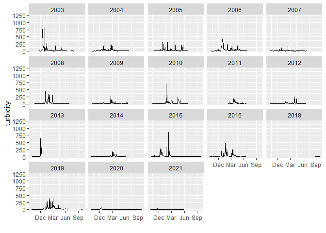<!-- -->

**Numeric Summary of `turbidity` over Period of Record**

``` r
knl_effort %>%
  group_by(year(date)) %>%
  summarize(mean = round(mean(turbidity, na.rm = T),2),
            median = round(median(turbidity, na.rm = T),2),
            min = round(min(turbidity, na.rm = T),2),
            max = round(max(turbidity, na.rm = T),2),
            na = length(which(is.na(turbidity))))
```

    ## # A tibble: 19 × 6
    ##    `year(date)`   mean median   min    max    na
    ##           <dbl>  <dbl>  <dbl> <dbl>  <dbl> <int>
    ##  1         2002 105.     9.8   2.1  1080      48
    ##  2         2003  35.4   14     2.74  822       6
    ##  3         2004  29.3   12.6   4.12  314.      0
    ##  4         2005  33.0   14.4   3.09  321       2
    ##  5         2006  41.4   26.9   3.96  510.      0
    ##  6         2007  11.9    8.66  3.04  187.      2
    ##  7         2008  42.0   12.2   2.25  439       0
    ##  8         2009  19.4   10.6   3.1   266       0
    ##  9         2010  50.8   21.6   3.7   716.     96
    ## 10         2011  29.1   17.4   4.52  231      58
    ## 11         2012  47.8   19.4   0    1201       0
    ## 12         2013   3.5    3.5   0.42    6.6     0
    ## 13         2014  20.5    6.68  1.4   294       2
    ## 14         2015  22.0   10.4   2.57  850       2
    ## 15         2016  50.6   23.5   6.52  467       4
    ## 16         2018   7.83   5.58  2.33   54.6     0
    ## 17         2019  40.9   23.1   3.87  409.     26
    ## 18         2020   6.88   6.34  1.7    40       0
    ## 19         2021   7.45   6.12  2.77   25.4     2

**NA and Unknown Values**

Percent of NA:

3.7 % of values in the `turbidity` column are NA.

### Variable: `cone_id`

**Plotting `cone_id` over Period of Record**

Data exists for all years. This variable should be re-categorized as a
character. Changes are made in the make\_changes section below.

``` r
# knl_effort %>%
#   mutate(fake_year = 2000, 
#          fake_date = ymd(paste(fake_year, month(date), day(date)))) %>%

unique(knl_effort$cone_id)
```

    ## [1] 8.3 8.4

**Numeric Summary of `cone_id` over Period of Record**

``` r
knl_effort %>%
  group_by(year(date)) %>%
  summarize(na = length(which(is.na(cone_id))))
```

    ## # A tibble: 19 × 2
    ##    `year(date)`    na
    ##           <dbl> <int>
    ##  1         2002     0
    ##  2         2003     0
    ##  3         2004     0
    ##  4         2005     0
    ##  5         2006     0
    ##  6         2007     0
    ##  7         2008     0
    ##  8         2009     0
    ##  9         2010     0
    ## 10         2011     0
    ## 11         2012     0
    ## 12         2013     0
    ## 13         2014     0
    ## 14         2015     0
    ## 15         2016     0
    ## 16         2018     0
    ## 17         2019     0
    ## 18         2020     0
    ## 19         2021     0

**NA and Unknown Values**

Percent of NA:

0 % of values in the `cone_id` column are NA.

### Variable: `cone_rpm`

**Plotting `cone_rpm` over Period of Record**

Data collected beginning in 2011 (sampling year 2012).

``` r
ggplot(filter(knl_effort, year(date) >= 2011), aes(y = cone_rpm)) +
  geom_histogram() +
  facet_wrap(~year(date))
```

    ## `stat_bin()` using `bins = 30`. Pick better value with `binwidth`.

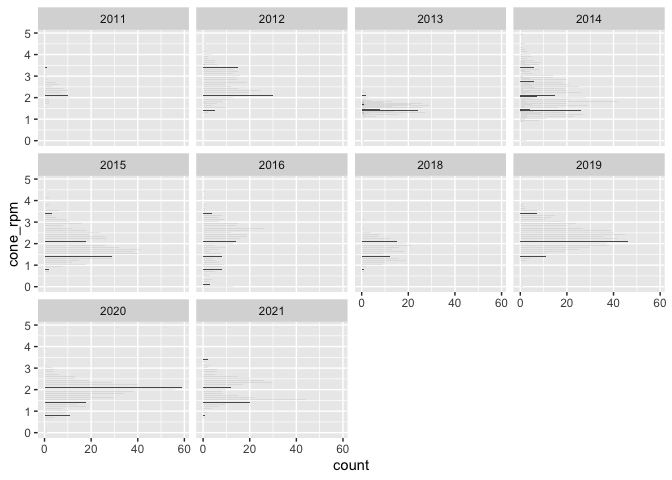<!-- -->

**Numeric Summary of `cone_rpm` over Period of Record**

``` r
knl_effort %>%
  group_by(year(date)) %>%
  summarize(mean = round(mean(cone_rpm, na.rm = T),2),
            median = round(median(cone_rpm, na.rm = T),2),
            min = round(min(cone_rpm, na.rm = T),2),
            max = round(max(cone_rpm, na.rm = T),2),
            na = length(which(is.na(cone_rpm))))
```

    ## # A tibble: 19 × 6
    ##    `year(date)`   mean median   min    max    na
    ##           <dbl>  <dbl>  <dbl> <dbl>  <dbl> <int>
    ##  1         2002 NaN     NA    Inf   -Inf     106
    ##  2         2003 NaN     NA    Inf   -Inf     316
    ##  3         2004 NaN     NA    Inf   -Inf     356
    ##  4         2005 NaN     NA    Inf   -Inf     416
    ##  5         2006 NaN     NA    Inf   -Inf     402
    ##  6         2007 NaN     NA    Inf   -Inf     316
    ##  7         2008 NaN     NA    Inf   -Inf     292
    ##  8         2009 NaN     NA    Inf   -Inf     304
    ##  9         2010 NaN     NA    Inf   -Inf     284
    ## 10         2011   2.27   2.25   1.5    3.4   234
    ## 11         2012   2.59   2.5    1.3    4.5     1
    ## 12         2013   1.52   1.5    0      2.3     0
    ## 13         2014   2.13   2      0      4.9     0
    ## 14         2015   1.96   1.8    0      4.5     0
    ## 15         2016   2.06   2.3    0      4.4     1
    ## 16         2018   1.7    1.7    0.7    3.1     0
    ## 17         2019   2.34   2.3    0      3.8     0
    ## 18         2020   1.87   2      0      3.9     1
    ## 19         2021   1.98   2      0.7    3.4     6

**NA and Unknown Values**

Percent of NA:

45 % of values in the `cone_rpm` column are NA.

### Variable: `total_cone_rev`

**Plotting `total_cone_rev` over Period of Record**

Data for this variable was collected beginning in 2011 (sampling year
2012).

``` r
ggplot(filter(knl_effort, year(date) >= 2011), aes(y = total_cone_rev)) +
  geom_histogram() +
  facet_wrap(~year(date))
```

    ## `stat_bin()` using `bins = 30`. Pick better value with `binwidth`.

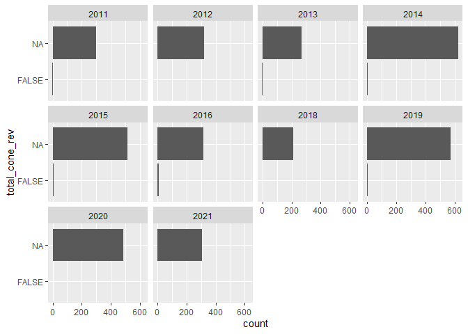<!-- -->

**Numeric Summary of `total_cone_rev` over Period of Record**

``` r
knl_effort %>%
  group_by(year(date)) %>%
  summarize(mean = round(mean(total_cone_rev, na.rm = T),2),
            median = round(median(total_cone_rev, na.rm = T),2),
            min = round(min(total_cone_rev, na.rm = T),2),
            max = round(max(total_cone_rev, na.rm = T),2),
            na = length(which(is.na(total_cone_rev))))
```

    ## # A tibble: 19 × 6
    ##    `year(date)`  mean median   min   max    na
    ##           <dbl> <dbl>  <dbl> <dbl> <dbl> <int>
    ##  1         2002  NaN     NA    Inf  -Inf   106
    ##  2         2003  NaN     NA    Inf  -Inf   316
    ##  3         2004  NaN     NA    Inf  -Inf   356
    ##  4         2005  NaN     NA    Inf  -Inf   416
    ##  5         2006  NaN     NA    Inf  -Inf   402
    ##  6         2007  NaN     NA    Inf  -Inf   316
    ##  7         2008  NaN     NA    Inf  -Inf   292
    ##  8         2009  NaN     NA    Inf  -Inf   304
    ##  9         2010  NaN     NA    Inf  -Inf   284
    ## 10         2011 6829.  6420.     0 20495   234
    ## 11         2012 4446.  4060      0 14645     1
    ## 12         2013 1249.  1052.     0  6853     0
    ## 13         2014 1616.  1473      0  5220     0
    ## 14         2015 2319.  2340      0  5322     0
    ## 15         2016 2237.  2258      0  5752     2
    ## 16         2018 1810.  1804    123  3329     0
    ## 17         2019 2301.  2531      0  5196     6
    ## 18         2020 1903.  2069      0  4957     1
    ## 19         2021 1746.  1822     72  4414     8

It seems like the total\_cone\_rev at 20,495 is a typo but not enough
information to be sure. Will leave as is.

``` r
filter(knl_effort, total_cone_rev > 20000)
```

    ## # A tibble: 1 × 19
    ##   date       start_date stop_date location gear       number_traps
    ##   <date>     <dttm>     <dttm>    <chr>    <chr>             <dbl>
    ## 1 2011-10-21 NA         NA        KL       2X 8' Cone           NA
    ## # … with 13 more variables: hrs_fished <dbl>, sampling_period_hrs <dbl>,
    ## #   flow_cfs <dbl>, secchi_ft <dbl>, water_t_f <dbl>, klci <dbl>,
    ## #   cone_sampling_effort <chr>, comments <chr>, turbidity <dbl>,
    ## #   turbidity_units <chr>, cone_id <dbl>, cone_rpm <dbl>, total_cone_rev <dbl>

``` r
filter(knl_effort, total_cone_rev > 12000)
```

    ## # A tibble: 10 × 19
    ##    date       start_date stop_date location gear      
    ##    <date>     <dttm>     <dttm>    <chr>    <chr>     
    ##  1 2011-10-10 NA         NA        KL       2X 8' Cone
    ##  2 2011-10-13 NA         NA        KL       2X 8' Cone
    ##  3 2011-10-17 NA         NA        KL       2X 8' Cone
    ##  4 2011-10-21 NA         NA        KL       2X 8' Cone
    ##  5 2011-10-21 NA         NA        KL       2X 8' Cone
    ##  6 2011-11-07 NA         NA        KL       2X 8' Cone
    ##  7 2011-12-05 NA         NA        KL       2X 8' Cone
    ##  8 2012-10-16 NA         NA        KL       2X 8' Cone
    ##  9 2012-10-16 NA         NA        KL       2X 8' Cone
    ## 10 2012-11-05 NA         NA        KL       2X 8' Cone
    ## # … with 14 more variables: number_traps <dbl>, hrs_fished <dbl>,
    ## #   sampling_period_hrs <dbl>, flow_cfs <dbl>, secchi_ft <dbl>,
    ## #   water_t_f <dbl>, klci <dbl>, cone_sampling_effort <chr>, comments <chr>,
    ## #   turbidity <dbl>, turbidity_units <chr>, cone_id <dbl>, cone_rpm <dbl>,
    ## #   total_cone_rev <dbl>

**NA and Unknown Values**

Percent of NA:

45.1 % of values in the `total_cone_rev` column are NA.

## Explore Categorical variables:

General notes: If there is an opportunity to turn yes no into boolean do
so, but not if you loose value

Need to change dates to appropriate format!

``` r
knl_effort %>%
  select_if(is.character) %>%
  colnames()
```

    ## [1] "location"             "gear"                 "cone_sampling_effort"
    ## [4] "comments"             "turbidity_units"

### Variable: `location`

``` r
table(knl_effort$location) 
```

    ## 
    ##   KL 
    ## 3778

Some years do not have location variable filled in. Fill in with `KL`
for these years.

``` r
filter(knl_effort, is.na(location)) %>%
  group_by(year(date)) %>%
  tally()
```

    ## # A tibble: 9 × 2
    ##   `year(date)`     n
    ##          <dbl> <int>
    ## 1         2004    62
    ## 2         2005   310
    ## 3         2014   166
    ## 4         2015   522
    ## 5         2016   324
    ## 6         2018   214
    ## 7         2019   576
    ## 8         2020   488
    ## 9         2021   304

**NA and Unknown Values**

44 % of values in the `location` column are NA.

### Variable: `gear`

``` r
table(knl_effort$gear) 
```

    ## 
    ## 2 x 8' Cone  2X 8' Cone         RST 
    ##         734         390        2654

Some years do not have gear filled in. Leave blank because do not know
what gear type. Change to “2x 8 in” for the 2 x 8. I think these mean
two 8 in cones.

``` r
filter(knl_effort, is.na(gear)) %>%
  group_by(year(date)) %>%
  tally()
```

    ## # A tibble: 9 × 2
    ##   `year(date)`     n
    ##          <dbl> <int>
    ## 1         2004    62
    ## 2         2005   310
    ## 3         2014   166
    ## 4         2015   522
    ## 5         2016   324
    ## 6         2018   214
    ## 7         2019   576
    ## 8         2020   488
    ## 9         2021   304

**NA and Unknown Values**

44 % of values in the `gear` column are NA.

### Variable: `cone_sampling_effort`

I don’t think this variable is very informative. Missing values for
every year.

``` r
table(knl_effort$cone_sampling_effort) 
```

    ## 
    ##   0% 100% 200% 300% 400%  50%  75% 
    ##    4 1236    2    2    2  326   10

``` r
filter(knl_effort, is.na(cone_sampling_effort)) %>%
  group_by(year(date)) %>%
  tally()
```

    ## # A tibble: 15 × 2
    ##    `year(date)`     n
    ##           <dbl> <int>
    ##  1         2002   106
    ##  2         2003   316
    ##  3         2004   356
    ##  4         2005   416
    ##  5         2006   402
    ##  6         2007   316
    ##  7         2008   292
    ##  8         2009   304
    ##  9         2010   284
    ## 10         2011   304
    ## 11         2012   320
    ## 12         2013   272
    ## 13         2014   628
    ## 14         2015   522
    ## 15         2016   324

**NA and Unknown Values**

76.5 % of values in the `cone_sampling_effort` column are NA.

### Variable: `turbidity_units`

``` r
table(knl_effort$turbidity_units) 
```

    ## 
    ##  FTU  NTU 
    ##  734 6010

Some years do not have location variable filled in. Fill in for these
years.

``` r
filter(knl_effort, is.na(turbidity_units)) %>%
  group_by(year(date)) %>%
  tally()
```

    ## # A tibble: 0 × 2
    ## # … with 2 variables: year(date) <dbl>, n <int>

**NA and Unknown Values**

0 % of values in the `turbidity_units` column are NA.

### Variable: `comments`

``` r
filter(knl_effort, is.na(comments)) %>%
  group_by(year(date)) %>%
  tally()
```

    ## # A tibble: 19 × 2
    ##    `year(date)`     n
    ##           <dbl> <int>
    ##  1         2002   106
    ##  2         2003   316
    ##  3         2004   356
    ##  4         2005   416
    ##  5         2006   402
    ##  6         2007   316
    ##  7         2008   292
    ##  8         2009   296
    ##  9         2010   278
    ## 10         2011   302
    ## 11         2012   292
    ## 12         2013   254
    ## 13         2014   408
    ## 14         2015   184
    ## 15         2016   188
    ## 16         2018   208
    ## 17         2019   492
    ## 18         2020   440
    ## 19         2021   240

**NA and Unknown Values**

85.8 % of values in the `comments` column are NA.

## Make any changes identified

``` r
knl_effort_changes <- knl_effort %>%
  # fix typo in water_t_f
  mutate(water_t_f = case_when(date == "2009-06-17" ~ 70,
                               T ~ water_t_f),
         # cone_id as character instead of numeric
         cone_id = as.character(cone_id),
         # fix date formatting
         date = as.Date(date),
         start_date = ymd_hms(start_date),
         stop_date = ymd_hms(stop_date),
         # fill in location for all
         location = "KL",
         # change name for gear
         gear = case_when(gear %in% c("2 x 8' Cone", "2X 8' Cone") ~ "2x 8 in cone",
                          # all rst data so just leave blank for now
                          gear == "RST" ~ NA_character_,
                          T ~ gear)) %>%
  # very little data, only for sampling year 2021 so remove.
  select(-klci)
```

### Save cleaned data back to google cloud

``` r
# Write to google cloud 
# Name file [watershed]_[data type].csv
f <- function(input, output) write_csv(input, file = output)

upload_data <- function(data, name) {
gcs_upload(data,
           object_function = f,
           type = "csv",
           name = paste0("rst/lower-sac-river/data/knights-landing/knl_combine_", name, ".csv"))
}

upload_data(knl_effort_changes, "sampling_effort_clean")
```

    ## ℹ 2021-11-24 08:38:47 > File size detected as  689.4 Kb

    ## ℹ 2021-11-24 08:38:47 > Request Status Code:  400

    ## ! API returned: Cannot insert legacy ACL for an object when uniform bucket-level access is enabled. Read more at https://cloud.google.com/storage/docs/uniform-bucket-level-access - Retrying with predefinedAcl='bucketLevel'

    ## ℹ 2021-11-24 08:38:47 > File size detected as  689.4 Kb

    ## ==Google Cloud Storage Object==
    ## Name:                rst/lower-sac-river/data/knights-landing/knl_combine_sampling_effort_clean.csv 
    ## Type:                csv 
    ## Size:                689.4 Kb 
    ## Media URL:           https://www.googleapis.com/download/storage/v1/b/jpe-dev-bucket/o/rst%2Flower-sac-river%2Fdata%2Fknights-landing%2Fknl_combine_sampling_effort_clean.csv?generation=1637771928149960&alt=media 
    ## Download URL:        https://storage.cloud.google.com/jpe-dev-bucket/rst%2Flower-sac-river%2Fdata%2Fknights-landing%2Fknl_combine_sampling_effort_clean.csv 
    ## Public Download URL: https://storage.googleapis.com/jpe-dev-bucket/rst%2Flower-sac-river%2Fdata%2Fknights-landing%2Fknl_combine_sampling_effort_clean.csv 
    ## Bucket:              jpe-dev-bucket 
    ## ID:                  jpe-dev-bucket/rst/lower-sac-river/data/knights-landing/knl_combine_sampling_effort_clean.csv/1637771928149960 
    ## MD5 Hash:            jyRHq/0ubWnBLSg7uuEEQg== 
    ## Class:               STANDARD 
    ## Created:             2021-11-24 16:38:48 
    ## Updated:             2021-11-24 16:38:48 
    ## Generation:          1637771928149960 
    ## Meta Generation:     1 
    ## eTag:                CMi/gPC3sfQCEAE= 
    ## crc32c:              QDriew==
