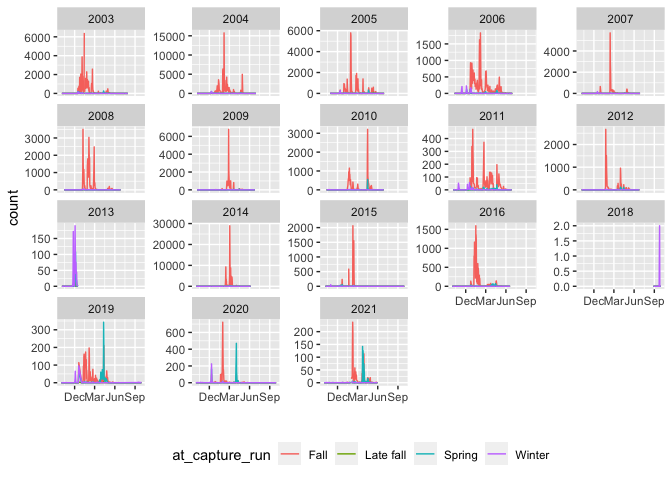
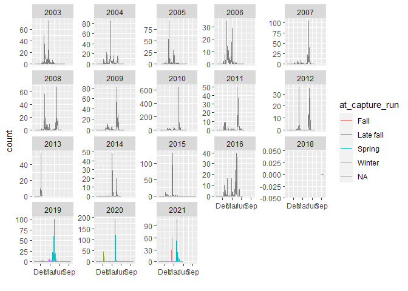
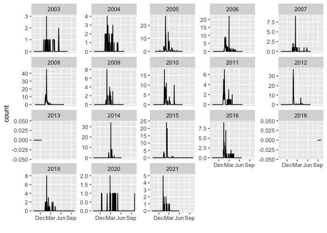

Lower Sacramento (Knight’s Landing) RST data QC - trap data
================
Ashley Vizek
10/22/2021

## Description of Monitoring Data

**Timeframe:**

10/04/2002 through 05/31/2021

**Completeness of Record throughout timeframe:**

-   The 2013 sampling period is not complete (Oct 2012 through Dec 2012)
-   We are missing data for 2017 and 2018.

**Sampling Location:**

Knight’s Landing

**Data Contact:**

[Jeanine Phillips](mailto::Jeanine.Phillips@wildlife.ca.gov)

## Access Cloud Data

``` r
# Run Sys.setenv() to specify GCS_AUTH_FILE and GCS_DEFAULT_BUCKET before running 
# getwd() to see how to specify paths 
# Open object from google cloud storage
# Set your authentication using gcs_auth
gcs_auth(json_file = Sys.getenv("GCS_AUTH_FILE"))
# Set global bucket 
gcs_global_bucket(bucket = Sys.getenv("GCS_DEFAULT_BUCKET"))

gcs_list_objects()

get_data <- function(name) {
gcs_get_object(object_name = paste0("rst/lower-sac-river/data/knights-landing/knl_combine_", name,".csv"),
               bucket = gcs_get_global_bucket(),
               saveToDisk = paste0("knl_combine_", name, ".csv"),
               overwrite = TRUE)
}

get_data("rst")
```

Read in data from google cloud, glimpse raw data and domain description
sheet. Need to change date, start\_date, stop\_date into appropriate
format. Make changes in changes section at end.

``` r
# read in data to clean 
knl_rst <- read_csv("knl_combine_rst.csv") %>% glimpse()
```

    ## 
    ## -- Column specification --------------------------------------------------------
    ## cols(
    ##   date = col_date(format = ""),
    ##   start_date = col_logical(),
    ##   stop_date = col_logical(),
    ##   location = col_character(),
    ##   fork_length_max_mm = col_double(),
    ##   fork_length_min_mm = col_double(),
    ##   species = col_character(),
    ##   count = col_double(),
    ##   at_capture_run = col_character(),
    ##   lifestage = col_character(),
    ##   marked = col_logical(),
    ##   cpue = col_double()
    ## )

    ## Rows: 40,464
    ## Columns: 12
    ## $ date               <date> 2002-10-04, 2002-10-04, 2002-10-04, 2002-10-04, 20~
    ## $ start_date         <lgl> NA, NA, NA, NA, NA, NA, NA, NA, NA, NA, NA, NA, NA,~
    ## $ stop_date          <lgl> NA, NA, NA, NA, NA, NA, NA, NA, NA, NA, NA, NA, NA,~
    ## $ location           <chr> "KL", "KL", "KL", "KL", "KL", "KL", "KL", "KL", "KL~
    ## $ fork_length_max_mm <dbl> NA, NA, NA, NA, NA, NA, NA, NA, NA, NA, NA, NA, NA,~
    ## $ fork_length_min_mm <dbl> NA, NA, NA, NA, NA, NA, NA, NA, NA, NA, NA, NA, NA,~
    ## $ species            <chr> "Chinook", "Steelhead", "Chinook", "Chinook", "Chin~
    ## $ count              <dbl> 0, 0, 0, 0, 0, 0, 0, NA, NA, NA, NA, NA, 0, 0, 0, 0~
    ## $ at_capture_run     <chr> NA, NA, "Fall", "Late fall", "Spring", NA, "Winter"~
    ## $ lifestage          <chr> NA, NA, NA, NA, NA, NA, NA, NA, NA, NA, NA, "older ~
    ## $ marked             <lgl> TRUE, TRUE, FALSE, FALSE, FALSE, FALSE, FALSE, TRUE~
    ## $ cpue               <dbl> NA, NA, 0.0000000, 0.0000000, 0.0000000, NA, 0.0000~

## Data Dictionary

The following table describes the variables included in this dataset and
the percent that do not include data. Most of the NAs are due to no fish
being caught. The percent\_na is calculated only when count is greater
than 0 and species is Chinook.

``` r
percent_na <- filter(knl_rst, count > 0, species == "Chinook") %>%
  summarise_all(list(name = ~sum(is.na(.))/length(.))) %>%
  pivot_longer(cols = everything())
  
data_dictionary <- tibble(variables = colnames(knl_rst),
                          description = c("Date of sampling. In more recent years, start and stop date are collected in which case date is the stop date.",
                                          "Date and time when sampling started. This was not collected in earlier sampling years.",
                                          "Date and time when sampling stopped. This was not collected in earlier sampling years.",
                                          "Site name/code for the RST trap. All are KL.",
                                          "Maximum fork length of sample in mm.",
                                          "Minimum fork length of sample in mm.",
                                          "Species of fish. Options are Chinook or Steelhead.",
                                          "Count of fish in sample.",
                                          "Run of fish determined at capture. Options are Spring, Fall, Late fall, Winter.",
                                          "Lifestage only includes Older juvenile.",
                                          "Indicates if fish was marked (TRUE/FALSE).",
                                          "Catch per unit effort is calculated as the number of fish caught divided by the total hours fished."),
                          percent_na = round(percent_na$value*100)
                          
)
kable(data_dictionary)
```

| variables             | description                                                                                                    | percent\_na |
|:----------------------|:---------------------------------------------------------------------------------------------------------------|------------:|
| date                  | Date of sampling. In more recent years, start and stop date are collected in which case date is the stop date. |           0 |
| start\_date           | Date and time when sampling started. This was not collected in earlier sampling years.                         |         100 |
| stop\_date            | Date and time when sampling stopped. This was not collected in earlier sampling years.                         |         100 |
| location              | Site name/code for the RST trap. All are KL.                                                                   |          37 |
| fork\_length\_max\_mm | Maximum fork length of sample in mm.                                                                           |          20 |
| fork\_length\_min\_mm | Minimum fork length of sample in mm.                                                                           |          22 |
| species               | Species of fish. Options are Chinook or Steelhead.                                                             |           0 |
| count                 | Count of fish in sample.                                                                                       |           0 |
| at\_capture\_run      | Run of fish determined at capture. Options are Spring, Fall, Late fall, Winter.                                |          16 |
| lifestage             | Lifestage only includes Older juvenile.                                                                        |          97 |
| marked                | Indicates if fish was marked (TRUE/FALSE).                                                                     |           3 |
| cpue                  | Catch per unit effort is calculated as the number of fish caught divided by the total hours fished.            |          27 |

## Data transformations

This work was done in other rmd
(1\_knights\_landing\_initial\_clean.Rmd,
2\_knights\_landing\_combined\_data.Rmd)

## Explore Numeric Variables:

``` r
# Filter clean data to show only numeric variables (this way we know we do not miss any)
knl_rst %>%
  select_if(is.numeric) %>%
  colnames()
```

    ## [1] "fork_length_max_mm" "fork_length_min_mm" "count"             
    ## [4] "cpue"

### Variable: `fork_length_max_mm`

**Plotting `fork_length_max_mm` over Period of Record**

``` r
ggplot(knl_rst, aes(y = fork_length_max_mm, x = factor(year(date)))) +
  geom_point() 
```

<!-- -->

There are some datapoints that extend to 200. These may be spring run
salmon but unable to tell because min/max fork length is collected for
all unmarked salmon/runs and not separated by run.

**Numeric Summary of `fork_length_max_mm` over Period of Record**

There are a lot of NAs for this variable because it is not collected for
marked salmon and for marked/unmarked steelhead.

``` r
knl_rst %>%
  group_by(year(date)) %>%
  summarize(mean = mean(fork_length_max_mm, na.rm = T),
            median = median(fork_length_max_mm, na.rm = T),
            min = min(fork_length_max_mm, na.rm = T),
            max = max(fork_length_max_mm, na.rm = T),
            na = length(which(is.na(fork_length_max_mm))))
```

    ## # A tibble: 19 x 6
    ##    `year(date)`   mean median   min   max    na
    ##           <dbl>  <dbl>  <dbl> <dbl> <dbl> <int>
    ##  1         2002 104     113      37   159   540
    ##  2         2003  88.3    91       0   215  1340
    ##  3         2004  89.7    91      42   142  1496
    ##  4         2005  79.9    85.5     0   170  1696
    ##  5         2006  80.7    84      35   210  1632
    ##  6         2007  75.9    81.5     0   146  1376
    ##  7         2008  85.5    90      34   148  1312
    ##  8         2009  73.6    84       0   149  1252
    ##  9         2010  68.5    82       0   180  1164
    ## 10         2011  58.3    69       0   123  1252
    ## 11         2012  63.3    73       0   191  1280
    ## 12         2013   1.44    0       0    41  1088
    ## 13         2014  40.2    37       0   146  2512
    ## 14         2015  40.2    38       0   185  2452
    ## 15         2016  55.2    57.5     0   115  1304
    ## 16         2018  72.3    69      37   129  1224
    ## 17         2019  70.3    69      32   171  2660
    ## 18         2020  37.7    40       0   125  2124
    ## 19         2021  49.4    57.5     0   113  1232

I do not think that zeros should exist and should be NAs. Only one day
when fork length was 0 and count was not 0 and I think it just wasn’t
recorded on this day rather than being a real 0.

``` r
filter(knl_rst, fork_length_max_mm == 0 & count > 0)
```

    ## # A tibble: 4 x 12
    ##   date       start_date stop_date location fork_length_max_mm fork_length_min_mm
    ##   <date>     <lgl>      <lgl>     <chr>                 <dbl>              <dbl>
    ## 1 2003-12-15 NA         NA        KL                        0                  0
    ## 2 2003-12-15 NA         NA        KL                        0                  0
    ## 3 2003-12-15 NA         NA        KL                        0                  0
    ## 4 2003-12-15 NA         NA        KL                        0                  0
    ## # ... with 6 more variables: species <chr>, count <dbl>, at_capture_run <chr>,
    ## #   lifestage <chr>, marked <lgl>, cpue <dbl>

**NA and Unknown Values**

Percent of NA:

71.5 % of values in the `fork_length_max_mm` column are NA.

### Variable: `fork_length_min_mm`

**Plotting `fork_length_min_mm` over Period of Record**

``` r
ggplot(knl_rst, aes(y = fork_length_min_mm, x = factor(year(date)))) +
  geom_point() 
```

<!-- -->

**Numeric Summary of `fork_length_min_mm` over Period of Record**

``` r
knl_rst %>%
  group_by(year(date)) %>%
  summarize(mean = round(mean(fork_length_min_mm, na.rm = T),2),
            median = round(median(fork_length_min_mm, na.rm = T),2),
            min = round(min(fork_length_min_mm, na.rm = T),2),
            max = round(max(fork_length_min_mm, na.rm = T),2),
            na = length(which(is.na(fork_length_min_mm))))
```

    ## # A tibble: 19 x 6
    ##    `year(date)`  mean median   min   max    na
    ##           <dbl> <dbl>  <dbl> <dbl> <dbl> <int>
    ##  1         2002 50.6    32      29   136   540
    ##  2         2003 38.0    33       0   141  1340
    ##  3         2004 47.8    38.5    29   133  1592
    ##  4         2005 40.3    35       0    89  1716
    ##  5         2006 40.5    34      28    99  1632
    ##  6         2007 50.8    38.5     0   146  1376
    ##  7         2008 48.0    35.5    29   121  1312
    ##  8         2009 46.0    38       0   149  1252
    ##  9         2010 36.8    34       0   121  1164
    ## 10         2011 33.4    34       0    86  1252
    ## 11         2012 33.6    34       0    96  1280
    ## 12         2013  1.42    0       0    41  1088
    ## 13         2014 23.3    30       0   100  2512
    ## 14         2015 29.1    33       0   112  2452
    ## 15         2016 35.7    35       0    85  1304
    ## 16         2018 45.7    49      28    64  1224
    ## 17         2019 41.7    37      30   102  2660
    ## 18         2020 30.4    33       0   115  2124
    ## 19         2021 36.9    37       0    93  1232

I do not think that zeros should exist and should be NAs. Only one day
when fork length was 0 and count was not 0 and I think it just wasn’t
recorded on this day rather than being a real 0.

``` r
filter(knl_rst, fork_length_min_mm == 0 & count > 0)
```

    ## # A tibble: 4 x 12
    ##   date       start_date stop_date location fork_length_max_mm fork_length_min_mm
    ##   <date>     <lgl>      <lgl>     <chr>                 <dbl>              <dbl>
    ## 1 2003-12-15 NA         NA        KL                        0                  0
    ## 2 2003-12-15 NA         NA        KL                        0                  0
    ## 3 2003-12-15 NA         NA        KL                        0                  0
    ## 4 2003-12-15 NA         NA        KL                        0                  0
    ## # ... with 6 more variables: species <chr>, count <dbl>, at_capture_run <chr>,
    ## #   lifestage <chr>, marked <lgl>, cpue <dbl>

**NA and Unknown Values**

Percent of NA:

71.8 % of values in the `fork_length_min_mm` column are NA.

### Variable: `count`

**Plotting `count` over Period of Record**

*Natural Chinook*

Data is dominated by fall run. There are some spring run peaks
2019-2021.

``` r
knl_rst %>%
  filter(species == "Chinook", marked == F) %>%
  mutate(wy = factor(ifelse(month(date) %in% 10:12, year(date) + 1, year(date))),
         fake_year = 2000,
         fake_year = ifelse(month(date) %in% 10:12, fake_year - 1, fake_year),
         fake_date = ymd(paste(fake_year, month(date), day(date)))) %>%
ggplot(aes(y = count, x = fake_date, color = at_capture_run)) +
  scale_x_date(date_breaks = "3 month", date_labels = "%b") +
  geom_line() +
  facet_wrap(~wy, scales = "free_y") +
  xlab("") +
  theme(legend.position="bottom")
```

<!-- -->

*Marked Chinook*

Marked Chinook are not recorded by run until 2019-2021 datasets. Much
fewer counts than natural run.

``` r
knl_rst %>%
  filter(species == "Chinook", marked == T) %>%
  mutate(wy = factor(ifelse(month(date) %in% 10:12, year(date) + 1, year(date))),
         fake_year = 2000,
         fake_year = ifelse(month(date) %in% 10:12, fake_year - 1, fake_year),
         fake_date = ymd(paste(fake_year, month(date), day(date)))) %>%
ggplot(aes(y = count, x = fake_date, color = at_capture_run)) +
  scale_x_date(date_breaks = "3 month", date_labels = "%b") +
  geom_line() +
  facet_wrap(~wy, scales = "free_y") +
  xlab("")
```

<!-- -->

*Natural Steelhead*

Few Steelhead are recorded.

``` r
knl_rst %>%
  filter(species == "Steelhead", marked == F) %>%
  mutate(wy = factor(ifelse(month(date) %in% 10:12, year(date) + 1, year(date))),
         fake_year = 2000,
         fake_year = ifelse(month(date) %in% 10:12, fake_year - 1, fake_year),
         fake_date = ymd(paste(fake_year, month(date), day(date)))) %>%
ggplot(aes(y = count, x = fake_date)) +
  scale_x_date(date_breaks = "3 month", date_labels = "%b") +
  geom_line() +
  facet_wrap(~wy, scales = "free_y") +
  xlab("")
```

<!-- -->

*Marked Steelhead*

More marked than natural Steelhead recorded.

``` r
knl_rst %>%
  filter(species == "Steelhead", marked == T) %>%
  mutate(wy = factor(ifelse(month(date) %in% 10:12, year(date) + 1, year(date))),
         fake_year = 2000,
         fake_year = ifelse(month(date) %in% 10:12, fake_year - 1, fake_year),
         fake_date = ymd(paste(fake_year, month(date), day(date)))) %>%
ggplot(aes(y = count, x = fake_date)) +
  scale_x_date(date_breaks = "3 month", date_labels = "%b") +
  geom_line() +
  facet_wrap(~wy, scales = "free_y") +
  xlab("")
```

<!-- -->

**Numeric Summary of `count` over Period of Record**

Only providing summary for natural Chinook.

Summary by water year

``` r
knitr::kable(knl_rst %>%
  filter(species == "Chinook", marked == F) %>%
  mutate(wy = factor(ifelse(month(date) %in% 10:12, year(date) + 1, year(date)))) %>%
  group_by(wy) %>%
  summarize(mean = round(mean(count, na.rm = T),2),
            median = round(median(count, na.rm = T),2),
            min = round(min(count, na.rm = T),2),
            max = round(max(count, na.rm = T),2),
            na = length(which(is.na(count)))))
```

| wy   |   mean | median | min |   max |  na |
|:-----|-------:|-------:|----:|------:|----:|
| 2003 |  87.62 |      0 |   0 |  6417 |  12 |
| 2004 | 151.11 |      0 |   0 | 15759 |   0 |
| 2005 |  64.94 |      0 |   0 |  5792 |   0 |
| 2006 |  45.19 |      1 |   0 |  1834 |   0 |
| 2007 |  28.66 |      0 |   0 |  5704 |   0 |
| 2008 |  62.49 |      0 |   0 |  3500 |   0 |
| 2009 |  38.16 |      0 |   0 |  6790 |   0 |
| 2010 |  34.99 |      0 |   0 |  3208 |   0 |
| 2011 |  10.71 |      0 |   0 |   472 |   0 |
| 2012 |  22.55 |      0 |   0 |  2670 |   0 |
| 2013 |   8.01 |      0 |   0 |   190 |   0 |
| 2014 |  74.53 |      0 |   0 | 28948 |   0 |
| 2015 |   8.34 |      0 |   0 |  2063 |   0 |
| 2016 |  16.80 |      0 |   0 |  1594 |   0 |
| 2018 |   0.03 |      0 |   0 |     2 |   0 |
| 2019 |   5.45 |      0 |   0 |   343 |   0 |
| 2020 |   4.63 |      0 |   0 |   722 |   0 |
| 2021 |   2.79 |      0 |   0 |   237 |  16 |

Total counts by year and run

``` r
knitr::kable(knl_rst %>%
  filter(species == "Chinook", marked == F) %>%
  mutate(wy = factor(ifelse(month(date) %in% 10:12, year(date) + 1, year(date)))) %>%
  group_by(wy, at_capture_run) %>%
  summarize(cumulative = sum(count, na.rm = T)) %>%
  pivot_wider(names_from = at_capture_run, values_from = cumulative))
```

    ## `summarise()` has grouped output by 'wy'. You can override using the `.groups` argument.

| wy   |   Fall | Late fall | Spring | Winter |
|:-----|-------:|----------:|-------:|-------:|
| 2003 |  55154 |       176 |   2364 |    838 |
| 2004 | 109055 |        33 |   2499 |   2051 |
| 2005 |  45450 |       292 |   1721 |    853 |
| 2006 |  33827 |       294 |   1399 |   1714 |
| 2007 |  18592 |        13 |    330 |    666 |
| 2008 |  37469 |        13 |    326 |    434 |
| 2009 |  20258 |        10 |    511 |    130 |
| 2010 |  17976 |        86 |   1220 |    170 |
| 2011 |   6145 |        11 |    466 |    361 |
| 2012 |  12790 |         6 |    723 |    103 |
| 2013 |     92 |        30 |    284 |   1004 |
| 2014 | 107758 |         0 |   1513 |    146 |
| 2015 |   7786 |        21 |    435 |    195 |
| 2016 |  16038 |         0 |    908 |     52 |
| 2018 |      0 |         0 |      0 |      3 |
| 2019 |   4013 |        24 |   1570 |    321 |
| 2020 |   2745 |        15 |   1459 |    409 |
| 2021 |   1873 |         1 |    722 |     27 |

Some of the max counts are in the tens of thousands. Either there was an
error in some data transformations or perhaps some of these are passage
estimates and not raw counts. Check raw data to see if these large
counts exist. If not, may need to reach back out to data contact. These
values exist in the data. Contacted Jeanine and she said they seem right
to her.

``` r
filter(knl_rst, count > 5000)
```

    ## # A tibble: 14 x 12
    ##    date       start_date stop_date location fork_length_max_mm fork_length_min_~
    ##    <date>     <lgl>      <lgl>     <chr>                 <dbl>             <dbl>
    ##  1 2003-01-14 NA         NA        KL                      215                32
    ##  2 2004-01-31 NA         NA        KL                       81                33
    ##  3 2004-02-01 NA         NA        KL                       85                33
    ##  4 2004-02-06 NA         NA        KL                      121                34
    ##  5 2004-02-07 NA         NA        KL                      114                33
    ##  6 2005-01-30 NA         NA        <NA>                    101                31
    ##  7 2005-01-31 NA         NA        <NA>                    107                32
    ##  8 2007-02-13 NA         NA        KL                      134                34
    ##  9 2009-02-27 NA         NA        KL                      120                34
    ## 10 2014-02-14 NA         NA        KL                      113                35
    ## 11 2014-03-02 NA         NA        KL                      127                34
    ## 12 2014-03-03 NA         NA        KL                      146                30
    ## 13 2014-03-04 NA         NA        KL                       92                36
    ## 14 2014-03-07 NA         NA        KL                      135                37
    ## # ... with 6 more variables: species <chr>, count <dbl>, at_capture_run <chr>,
    ## #   lifestage <chr>, marked <lgl>, cpue <dbl>

``` r
# 2004-02-06
filter(knl_rst, count == 15759)
```

    ## # A tibble: 1 x 12
    ##   date       start_date stop_date location fork_length_max_mm fork_length_min_mm
    ##   <date>     <lgl>      <lgl>     <chr>                 <dbl>              <dbl>
    ## 1 2004-02-06 NA         NA        KL                      121                 34
    ## # ... with 6 more variables: species <chr>, count <dbl>, at_capture_run <chr>,
    ## #   lifestage <chr>, marked <lgl>, cpue <dbl>

``` r
# 2014-03-03
filter(knl_rst, count == 28948)
```

    ## # A tibble: 1 x 12
    ##   date       start_date stop_date location fork_length_max_mm fork_length_min_mm
    ##   <date>     <lgl>      <lgl>     <chr>                 <dbl>              <dbl>
    ## 1 2014-03-03 NA         NA        KL                      146                 30
    ## # ... with 6 more variables: species <chr>, count <dbl>, at_capture_run <chr>,
    ## #   lifestage <chr>, marked <lgl>, cpue <dbl>

``` r
# 2014-03-04
filter(knl_rst, count == 12560)
```

    ## # A tibble: 1 x 12
    ##   date       start_date stop_date location fork_length_max_mm fork_length_min_mm
    ##   <date>     <lgl>      <lgl>     <chr>                 <dbl>              <dbl>
    ## 1 2014-03-04 NA         NA        KL                       92                 36
    ## # ... with 6 more variables: species <chr>, count <dbl>, at_capture_run <chr>,
    ## #   lifestage <chr>, marked <lgl>, cpue <dbl>

**NA and Unknown Values**

Percent of NA:

34.5 % of values in the `count` column are NA.

### Variable: `cpue`

**Plotting `cpue` over Period of Record**

*Natural Chinook*

Catch per unit effort seems very high for 2003 and 2004. Could these be
passage estimates? Or maybe cpue is being miscalculated? These high
values correspond to the high count values identified.

cpue only calculated for natural species.

cpue for fall/spring and spue late fall/winter was calculated prior to
2015 when they were calculate separately.

``` r
knl_rst %>%
  filter(species == "Chinook", marked == F) %>%
  mutate(wy = factor(ifelse(month(date) %in% 10:12, year(date) + 1, year(date))),
         fake_year = 2000,
         fake_year = ifelse(month(date) %in% 10:12, fake_year - 1, fake_year),
         fake_date = ymd(paste(fake_year, month(date), day(date)))) %>%
ggplot(aes(y = cpue, x = fake_date, color = at_capture_run)) +
  scale_x_date(date_breaks = "3 month", date_labels = "%b") +
  geom_line(alpha = 0.5) +
  facet_wrap(~wy, scales = "free_y") +
  xlab("")
```

<!-- -->

*Natural Steelhead*

``` r
knl_rst %>%
  filter(species == "Steelhead", marked == F) %>%
  mutate(wy = factor(ifelse(month(date) %in% 10:12, year(date) + 1, year(date))),
         fake_year = 2000,
         fake_year = ifelse(month(date) %in% 10:12, fake_year - 1, fake_year),
         fake_date = ymd(paste(fake_year, month(date), day(date)))) %>%
ggplot(aes(y = cpue, x = fake_date)) +
  scale_x_date(date_breaks = "3 month", date_labels = "%b") +
  geom_line(alpha = 0.5) +
  facet_wrap(~wy, scales = "free_y") +
  xlab("")
```

<!-- -->

**Numeric Summary of `cpue` over Period of Record**

Only provide summary for natural Chinook

``` r
knl_rst %>%
  filter(species == "Chinook", marked == F) %>%
  group_by(year(date), at_capture_run, species, marked, lifestage) %>%
  group_by(year(date)) %>%
  summarize(mean = round(mean(cpue, na.rm = T),2),
            median = round(median(cpue, na.rm = T),2),
            min = round(min(cpue, na.rm = T),2),
            max = round(max(cpue, na.rm = T),2),
            na = length(which(is.na(cpue))))
```

    ## # A tibble: 19 x 6
    ##    `year(date)`   mean median   min     max    na
    ##           <dbl>  <dbl>  <dbl> <dbl>   <dbl> <int>
    ##  1         2002  59.5    0        0 1053.       8
    ##  2         2003  90.6    2.46     0 3551.       4
    ##  3         2004 180.     2.02     0 8368.     124
    ##  4         2005  32.5    0.52     0  488.     620
    ##  5         2006  39      0.95     0  945.       0
    ##  6         2007  28.4    0        0 2880.       0
    ##  7         2008  65.3    0.25     0 1799.       0
    ##  8         2009  32.4    0.17     0 3392.       0
    ##  9         2010  39.3    0.25     0 2027.       0
    ## 10         2011   7.88   0        0  160.       0
    ## 11         2012   1.29   0        0   67.8      4
    ## 12         2013   0      0        0    0.06     0
    ## 13         2014  12.2    0        0 2098.       0
    ## 14         2015   0.47   0        0  106.       0
    ## 15         2016   1.42   0        0   99.9      0
    ## 16         2018   0.05   0        0    4.64     0
    ## 17         2019   0.27   0        0   37.3     12
    ## 18         2020   0.16   0        0   40.2      3
    ## 19         2021   0.19   0        0   26.5     16

**NA and Unknown Values**

Only calculated for natural species so there is a high amount of NAs.

Percent of NA:

61.2 % of values in the `cpue` column are NA.

## Explore Categorical variables:

General notes: If there is an opportunity to turn yes no into boolean do
so, but not if you loose value

Need to change dates to appropriate format!

``` r
knl_rst %>%
  select_if(is.character) %>%
  colnames()
```

    ## [1] "location"       "species"        "at_capture_run" "lifestage"

### Variable: `location`

``` r
table(knl_rst$location) 
```

    ## 
    ##    KL 
    ## 22668

Some years do not have location variable filled in. Fill in for these
years.

``` r
filter(knl_rst, is.na(location)) %>%
  group_by(year(date)) %>%
  tally()
```

    ## # A tibble: 9 x 2
    ##   `year(date)`     n
    ##          <dbl> <int>
    ## 1         2004   372
    ## 2         2005  1860
    ## 3         2014   996
    ## 4         2015  3132
    ## 5         2016  1944
    ## 6         2018  1284
    ## 7         2019  3456
    ## 8         2020  2928
    ## 9         2021  1824

**NA and Unknown Values**

44 % of values in the `location` column are NA.

### Variable: `species`

``` r
table(knl_rst$species) 
```

    ## 
    ##   Chinook Steelhead 
    ##     33720      6744

``` r
filter(knl_rst, is.na(species)) %>%
  group_by(year(date)) %>%
  tally()
```

    ## # A tibble: 0 x 2
    ## # ... with 2 variables: year(date) <dbl>, n <int>

**NA and Unknown Values**

0 % of values in the `species` column are NA.

### Variable: `at_capture_run`

``` r
table(knl_rst$at_capture_run) 
```

    ## 
    ##      Fall Late fall    Spring    Winter 
    ##      6744      6744      6744      6744

Sometimes marked salmon were not recorded by run. Older juvenile salmon
were not given a run. Steelhead do not have a run associated.

``` r
filter(knl_rst, is.na(at_capture_run)) %>%
  group_by(year(date)) %>%
  tally()
```

    ## # A tibble: 19 x 2
    ##    `year(date)`     n
    ##           <dbl> <int>
    ##  1         2002   212
    ##  2         2003   632
    ##  3         2004   712
    ##  4         2005   832
    ##  5         2006   804
    ##  6         2007   632
    ##  7         2008   584
    ##  8         2009   608
    ##  9         2010   568
    ## 10         2011   608
    ## 11         2012   640
    ## 12         2013   544
    ## 13         2014  1256
    ## 14         2015  1044
    ## 15         2016   648
    ## 16         2018   428
    ## 17         2019  1152
    ## 18         2020   976
    ## 19         2021   608

**NA and Unknown Values**

33.3 % of values in the `at_capture_run` column are NA.

### Variable: `lifestage`

``` r
table(knl_rst$lifestage) 
```

    ## 
    ## older juvenile 
    ##           3372

Only one lifestage called older juvenile. If not in this lifestage then
none recorded.

``` r
filter(knl_rst, is.na(lifestage)) %>%
  group_by(year(date)) %>%
  tally()
```

    ## # A tibble: 19 x 2
    ##    `year(date)`     n
    ##           <dbl> <int>
    ##  1         2002   583
    ##  2         2003  1738
    ##  3         2004  1958
    ##  4         2005  2288
    ##  5         2006  2211
    ##  6         2007  1738
    ##  7         2008  1606
    ##  8         2009  1672
    ##  9         2010  1562
    ## 10         2011  1672
    ## 11         2012  1760
    ## 12         2013  1496
    ## 13         2014  3454
    ## 14         2015  2871
    ## 15         2016  1782
    ## 16         2018  1177
    ## 17         2019  3168
    ## 18         2020  2684
    ## 19         2021  1672

**NA and Unknown Values**

Lifestage is NA unless older juvenile.

91.7 % of values in the `lifestage` column are NA.

## Make any changes identified

``` r
knl_rst_changes <- knl_rst %>%
  # fix typo in water_t_f
  mutate(location = "KL",
         # fix date formatting
         date = as.Date(date),
         start_date = ymd_hms(start_date),
         stop_date = ymd_hms(stop_date),
         # change 0s for fork length to NAs
         fork_length_max_mm = case_when(fork_length_max_mm == 0 ~ NA_real_,
                                        T ~ as.numeric(fork_length_max_mm)),
         fork_length_min_mm = case_when(fork_length_min_mm == 0 ~ NA_real_,
                                        T ~ as.numeric(fork_length_min_mm))) %>%
  rename(catch_per_unit_effort = cpue)
```

### Next Steps

#### Questions for follow up

Very large counts on 2014-03-03, 2014-03-04, and 2004-02-06. These exist
in the raw data. Follow up with contact to double check that these are
raw counts or if these might be typos.

### Save cleaned data back to google cloud

``` r
# Write to google cloud 
# Name file [watershed]_[data type].csv
# f <- function(input, output) write_csv(input, file = output)
# 
# upload_data <- function(data, name) {
# gcs_upload(data,
#            object_function = f,
#            type = "csv",
#            name = paste0("rst/lower-sac-river/data/knights-landing/knl_combine_", name, ".csv"))
# }
# 
# upload_data(knl_rst_changes, "rst_clean")
```
