Mill Creek RST Data QC
================
Erin Cain
9/29/2021

# Mill Creek RST Data

## Description of Monitoring Data

RST data was shared with us in an access database. I queried it to
include both fish catch and trap conditions information.

**Timeframe:** 1995 - 2010

**Completeness of Record throughout timeframe:**

-   Very little environmental data collected in beginning of timeframe
-   Very little trap efficiency data collected in beginning of timeframe

**Sampling Location:** Mill Creek RSTR

**Data Contact:** [Matt Johsnson](Matt.Johnson@wildlife.ca.gov)

Comments from Matt: Let me know if you need any help with interpreting
what is in that database. It is not mine, I inherited it from a retired
CDFW biologist, but I did work on those RST’s as a Scientific Aide, and
entered data into the database. So I at least have some working
knowledge of the forms/tables in there.

## Access Cloud Data

``` r
# Run Sys.setenv() to specify GCS_AUTH_FILE and GCS_DEFAULT_BUCKET before running 
# getwd() to see how to specify paths 
# Open object from google cloud storage
# Set your authentication using gcs_auth
gcs_auth(json_file = Sys.getenv("GCS_AUTH_FILE"))
# Set global bucket 
gcs_global_bucket(bucket = Sys.getenv("GCS_DEFAULT_BUCKET"))

gcs_list_objects()

# git data and save as xlsx
gcs_get_object(object_name = 
                 "rst/mill-creek/data-raw/mill_deer_rst_trap_catch_and_conditions.xlsx",
               bucket = gcs_get_global_bucket(),
               saveToDisk = "raw_rst_deer_and_mill.xlsx",
               overwrite = TRUE)
```

Read in data from google cloud, glimpse raw data:

``` r
raw_rst_data <- read_excel("raw_rst_deer_and_mill.xlsx", col_types =c("date", "text", "numeric", "text", "numeric", 
                                                                      "numeric", "numeric", "numeric", "numeric", "numeric", 
                                                                      "numeric", "numeric", "numeric", "text")) %>% glimpse()
```

    ## Rows: 96,528
    ## Columns: 14
    ## $ Date                      <dttm> 1992-10-14, 1992-10-14, 1992-10-14, 1992-10~
    ## $ Location                  <chr> "Deer Creek Canyon Mouth", "Deer Creek Canyo~
    ## $ Count                     <dbl> 1, 1, 1, 1, 1, 1, 1, 1, 1, 1, 1, 1, 1, 1, 1,~
    ## $ Species                   <chr> "CHISAL", "CHISAL", "CHISAL", "CHISAL", "CHI~
    ## $ Length                    <dbl> 93, 98, 94, 115, 79, 87, 110, 93, 87, 79, 76~
    ## $ Weight                    <dbl> NA, NA, NA, NA, NA, NA, NA, NA, NA, NA, NA, ~
    ## $ Flow                      <dbl> NA, NA, NA, NA, NA, NA, NA, NA, NA, NA, NA, ~
    ## $ `Time for 10 Revolutions` <dbl> NA, NA, NA, NA, NA, NA, NA, NA, NA, NA, NA, ~
    ## $ `Tubs of Debris`          <dbl> NA, NA, NA, NA, NA, NA, NA, NA, NA, NA, NA, ~
    ## $ `Trap Condition Code`     <dbl> 1, 1, 1, 1, 1, 1, 1, 1, 1, 1, 1, 1, 1, 1, 1,~
    ## $ `Water Temperature`       <dbl> NA, NA, NA, NA, NA, NA, NA, NA, NA, NA, NA, ~
    ## $ Turbidity                 <dbl> NA, NA, NA, NA, NA, NA, NA, NA, NA, NA, NA, ~
    ## $ Weather                   <dbl> NA, NA, NA, NA, NA, NA, NA, NA, NA, NA, NA, ~
    ## $ Comments                  <chr> "Data sheet does not show sampling method - ~

``` r
unique(raw_rst_data$Location) # View unique locations so I can filter for only Mill 
```

    ## [1] "Deer Creek Canyon Mouth"           "Deer Creek Canyon Mouth Diversion"
    ## [3] "Deer Creek Canyon Mouth Trap"      "Deer Creek RSTR"                  
    ## [5] "Mill Creek RSTR"

## Data transformations

``` r
cleaner_rst_data <- raw_rst_data%>% 
  filter(Location == "Mill Creek RSTR",
         Species == "CHISAL") %>%
  janitor::clean_names() %>% 
  rename(fork_length = length) %>% # confirmed with matt that this is fork length
  mutate(date = as.Date(date),
         trap_condition_code = as.character(trap_condition_code), 
         weather = as.character(weather)) %>%
  select(-species) %>%
  glimpse()
```

    ## Rows: 25,529
    ## Columns: 13
    ## $ date                    <date> 1995-12-09, 1995-12-13, 1995-12-13, 1995-12-1~
    ## $ location                <chr> "Mill Creek RSTR", "Mill Creek RSTR", "Mill Cr~
    ## $ count                   <dbl> 1, 2, 1, 1, 3, 8, 8, 1, 5, 16, 5, 1, 17, 2, 2,~
    ## $ fork_length             <dbl> 32, 34, 35, 35, 36, NA, 36, 38, 37, 35, 33, 31~
    ## $ weight                  <dbl> NA, NA, NA, NA, NA, NA, NA, NA, NA, NA, NA, NA~
    ## $ flow                    <dbl> NA, NA, NA, NA, NA, NA, NA, NA, NA, NA, NA, NA~
    ## $ time_for_10_revolutions <dbl> NA, NA, NA, NA, NA, NA, NA, NA, NA, NA, NA, NA~
    ## $ tubs_of_debris          <dbl> NA, NA, NA, NA, NA, NA, NA, NA, NA, NA, NA, NA~
    ## $ trap_condition_code     <chr> "1", "1", "1", "1", "1", "1", "1", "1", "1", "~
    ## $ water_temperature       <dbl> 50, 49, 49, 47, 47, 47, 47, 47, 47, 47, 47, 47~
    ## $ turbidity               <dbl> NA, NA, NA, NA, NA, NA, NA, NA, NA, NA, NA, NA~
    ## $ weather                 <chr> NA, NA, NA, "4", "4", "4", "4", "4", "4", "4",~
    ## $ comments                <chr> "1995 BY-CHISAL said to weigh 1mg.", "Fished c~

## Explore Numeric Variables:

``` r
cleaner_rst_data %>% select_if(is.numeric) %>% colnames()
```

    ## [1] "count"                   "fork_length"            
    ## [3] "weight"                  "flow"                   
    ## [5] "time_for_10_revolutions" "tubs_of_debris"         
    ## [7] "water_temperature"       "turbidity"

### Variable: `count`

**Plotting fish counts over period of record**

``` r
cleaner_rst_data %>% 
  group_by(date) %>%
  summarise(total_daily_catch = sum(count, na.rm = T)) %>%
  mutate(water_year = ifelse(month(date) %in% 10:12, year(date) + 1, year(date))) %>% 
  left_join(sac_indices) %>%
  mutate(year = as.factor(year(date)),
         fake_year = if_else(month(date) %in% 10:12, 1900, 1901),
         fake_date = as.Date(paste0(fake_year,"-", month(date), "-", day(date)))) %>%
  filter(water_year < 2021) %>%
  ggplot(aes(x = fake_date, y = total_daily_catch, fill = year_type)) + 
  geom_col() + 
  scale_x_date(labels = date_format("%b"), limits = c(as.Date("1900-10-01"), as.Date("1901-06-01")), date_breaks = "1 month") + 
  theme_minimal() + 
  theme(text = element_text(size = 18),
        axis.text.x = element_text(angle = 90, vjust = 0.5, hjust=1),
        legend.position = "bottom") + 
  labs(title = "Total Daily Raw Passage 2015 - 2020",
       y = "Total daily raw catch",
       x = "Date")+ 
  facet_wrap(~water_year, scales = "free") +
  scale_color_manual(palette)
```

    ## Joining, by = "water_year"

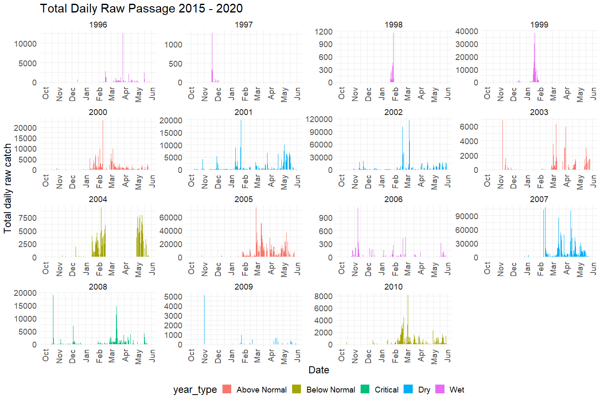<!-- -->

Early years looks like sampling happened infrequently.

``` r
cleaner_rst_data  %>%
  mutate(year = as.factor(year(date))) %>%
  group_by(year) %>%
  summarise(total_yearly_catch = sum(count, na.rm = T)) %>%
  ggplot(aes(x = year, y = total_yearly_catch)) + 
  geom_col() + 
  theme_minimal() +
  labs(title = "Total Fish Counted each Year by run",
       y = "Total fish raw catch") + 
  theme(text = element_text(size = 18),
        axis.text.x = element_text(angle = 90, vjust = 0.5, hjust=1)) 
```

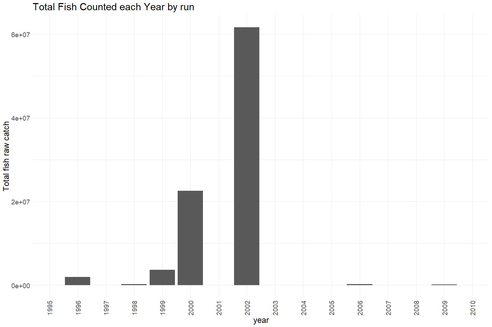<!-- -->

**Numeric Summary of counts over Period of Record**

``` r
# Table with summary statistics
summary(cleaner_rst_data$count)
```

    ##    Min. 1st Qu.  Median    Mean 3rd Qu.    Max.    NA's 
    ##    1.00    1.00    1.00    5.59    2.00 4057.00      72

**NA and Unknown Values**

-   0.3 % of values in the `count` column are NA.

### Variable: `fork_length`

fork\_length of the fish captured, units: mm

**Plotting fork length**

``` r
cleaner_rst_data %>% 
  ggplot(aes(x = fork_length)) + 
  geom_histogram(breaks=seq(0, 200, by=2)) + 
  scale_x_continuous(breaks=seq(0, 200, by=25)) +
  theme_minimal() +
  labs(title = "fork length distribution") + 
  theme(text = element_text(size = 18),
        axis.text.x = element_text(angle = 90, vjust = 0.5, hjust=1)) 
```

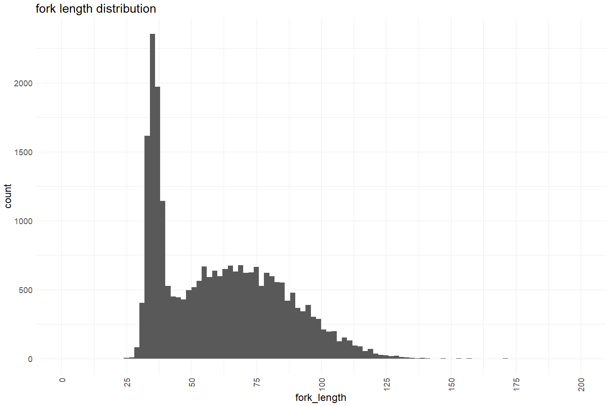<!-- -->

**Numeric Summary of fork length over Period of Record**

``` r
# Table with summary statistics
summary(cleaner_rst_data$fork_length)
```

    ##    Min. 1st Qu.  Median    Mean 3rd Qu.    Max.    NA's 
    ##   25.00   38.00   59.00   61.41   79.00  171.00     576

**NA and Unknown Values**

-   2.3 % of values in the `fork_length` column are NA.

### Variable: `weight`

weight of the fish captured, units: grams

**Plotting weight**

``` r
cleaner_rst_data %>% 
  ggplot(aes(x = weight)) + 
  geom_histogram() + 
  theme_minimal() +
  labs(title = "Weight distribution") + 
  theme(text = element_text(size = 18),
        axis.text.x = element_text(angle = 90, vjust = 0.5, hjust=1)) 
```

    ## `stat_bin()` using `bins = 30`. Pick better value with `binwidth`.

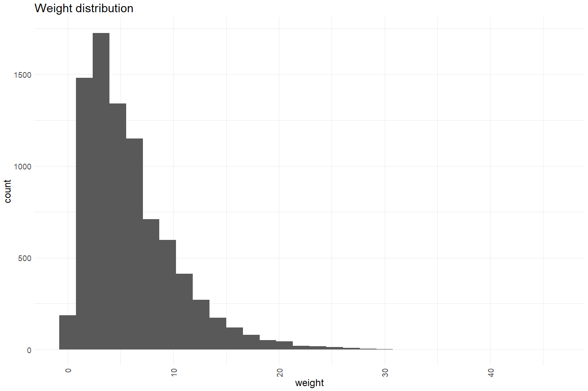<!-- -->

**Numeric Summary of weight over Period of Record**

``` r
# Table with summary statistics
summary(cleaner_rst_data$weight)
```

    ##    Min. 1st Qu.  Median    Mean 3rd Qu.    Max.    NA's 
    ##   0.000   2.700   4.900   5.973   8.000  45.800   17111

**NA and Unknown Values**

-   67 % of values in the `weight` column are NA.

### Variable: `flow`

Flow, cfs

**Plotting flow over Period of Record**

``` r
# Make whatever plot is appropriate 
# maybe 2 plots is appropriate
cleaner_rst_data %>% 
  group_by(date) %>%
  summarise(avg_flow = mean(flow, na.rm = T)) %>%
  mutate(year = as.factor(year(date)),
         fake_year = if_else(month(date) %in% 10:12, 1900, 1901),
         fake_date = as.Date(paste0(fake_year,"-", month(date), "-", day(date)))) %>%
  ggplot(aes(x = fake_date, y = avg_flow, color = year)) + 
  geom_point(alpha = .5) + 
  # facet_wrap(~year(date), scales = "free") + 
  scale_x_date(labels = date_format("%b"), date_breaks = "1 month") + 
  theme_minimal() + 
  theme(text = element_text(size = 15),
        axis.text.x = element_text(angle = 90, vjust = 0.5, hjust=1),
        legend.position = "none") + 
  labs(title = "Daily Flow Measures (colored by year)",
       x = "Date", 
       y = "Average Daily Flow")  
```

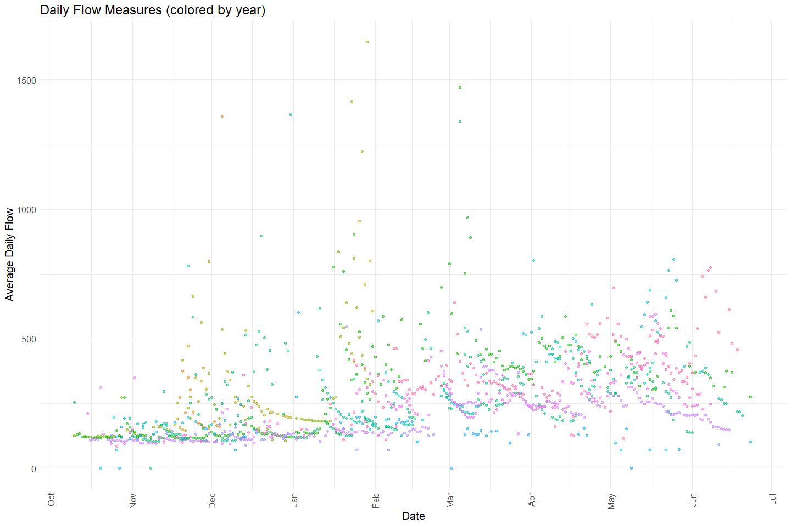<!-- -->

``` r
cleaner_rst_data %>% 
  ggplot(aes(x = flow)) + 
  geom_histogram() + 
  theme_minimal() +
  labs(title = "Flow distribution") + 
  theme(text = element_text(size = 18),
        axis.text.x = element_text(angle = 90, vjust = 0.5, hjust=1)) 
```

    ## `stat_bin()` using `bins = 30`. Pick better value with `binwidth`.

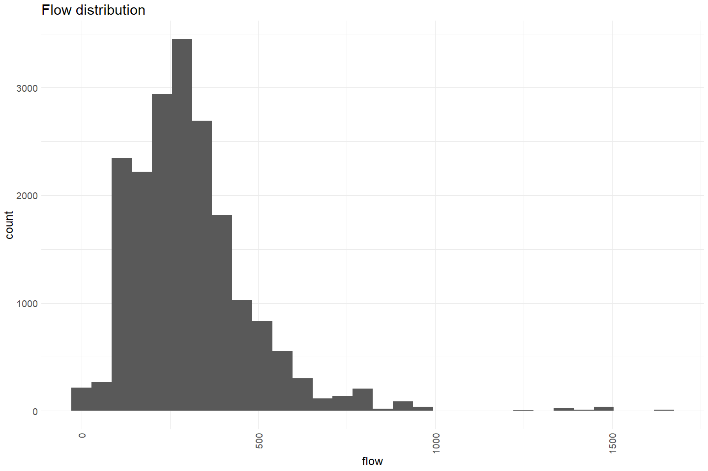<!-- -->

``` r
cleaner_rst_data %>%
  mutate(wy = factor(ifelse(month(date) %in% 10:12, year(date) + 1, year(date))),
         fake_year = 2000,
         fake_year = ifelse(month(date) %in% 10:12, fake_year - 1, fake_year),
         fake_date = ymd(paste(fake_year, month(date), day(date)))) %>%
  ggplot(aes(x = fake_date, y = flow)) +
  scale_x_date(date_breaks = "1 month", date_labels = "%b") +
  geom_line(size = 0.5) +
  xlab("Date") +
  facet_wrap(~wy, scales = "free_y") + 
  theme_minimal()
```

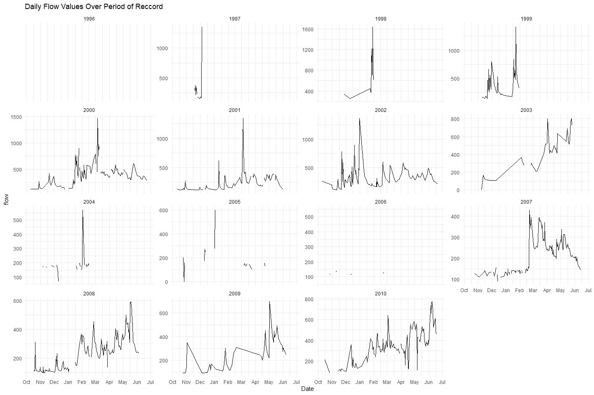<!-- -->

Lots of gaps in flow data.

**Numeric Summary of flow over Period of Record**

``` r
# Table with summary statistics
summary(cleaner_rst_data$flow)
```

    ##    Min. 1st Qu.  Median    Mean 3rd Qu.    Max.    NA's 
    ##     0.0   193.0   279.0   307.8   378.0  1647.0    6181

**NA and Unknown Values**

-   24.2 % of values in the `flow` column are NA.

### Variable: `time_for_10_revolutions`

**Plotting time\_for\_10\_revolutions**

``` r
cleaner_rst_data %>% 
  ggplot(aes(x = time_for_10_revolutions)) + 
  geom_histogram() + 
  # scale_x_continuous(breaks=seq(0, 200, by=25)) +
  theme_minimal() +
  labs(title = "Time it takes to do 10 revolutions distribution") + 
  theme(text = element_text(size = 18),
        axis.text.x = element_text(angle = 90, vjust = 0.5, hjust=1)) 
```

    ## `stat_bin()` using `bins = 30`. Pick better value with `binwidth`.

<!-- --> A
lot of spread in this time. 0 seems like a non functional trap. Very
high values seem like outliers.

**Numeric Summary of time\_for\_10\_revolutions over Period of Record**

``` r
# Table with summary statistics
summary(cleaner_rst_data$time_for_10_revolutions)
```

    ##    Min. 1st Qu.  Median    Mean 3rd Qu.    Max.    NA's 
    ##       0      78     114     112     142     880    7392

**NA and Unknown Values**

-   29 % of values in the `time_for_10_revolutions` column are NA.

### Variable: `tubs_of_debris`

**Plotting Debris**

``` r
cleaner_rst_data %>% 
  ggplot(aes(x = tubs_of_debris)) + 
  geom_histogram() + 
  theme_minimal() +
  labs(title = "Tub of debris distribution") + 
  theme(text = element_text(size = 18),
        axis.text.x = element_text(angle = 90, vjust = 0.5, hjust=1)) 
```

    ## `stat_bin()` using `bins = 30`. Pick better value with `binwidth`.

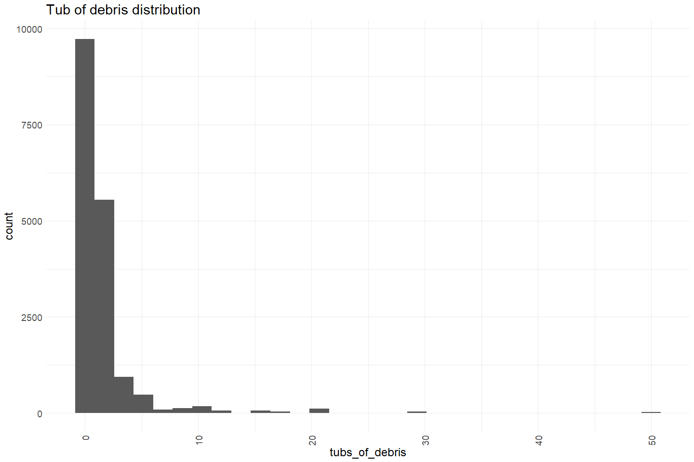<!-- -->

**Numeric Summary of tub of debris over Period of Record**

``` r
# Table with summary statistics
summary(cleaner_rst_data$tubs_of_debris)
```

    ##    Min. 1st Qu.  Median    Mean 3rd Qu.    Max.    NA's 
    ##   0.000   0.000   0.500   1.449   1.000  50.000    8094

**NA and Unknown Values**

-   31.7 % of values in the `tubs_of_debris` column are NA.

### Variable: `water_temperature`

water\_temperature F

**Plotting water\_temperature over Period of Record**

``` r
# Make whatever plot is appropriate 
# maybe 2 plots is appropriate
cleaner_rst_data %>% 
  group_by(date) %>%
  summarise(avg_temp = mean(water_temperature)) %>%
  mutate(year = as.factor(year(date)),
         fake_year = if_else(month(date) %in% 10:12, 1900, 1901),
         fake_date = as.Date(paste0(fake_year,"-", month(date), "-", day(date)))) %>%
  ggplot(aes(x = fake_date, y = avg_temp, color = year)) + 
  geom_point(alpha = .5) + 
  # facet_wrap(~year(date), scales = "free") + 
  scale_x_date(labels = date_format("%b"), date_breaks = "1 month") + 
  theme_minimal() + 
  theme(text = element_text(size = 15),
        axis.text.x = element_text(angle = 90, vjust = 0.5, hjust=1),
        legend.position = "none") + 
  labs(title = "Daily Temp Measures F (colored by year)",
       x = "Date", 
       y = "Average Daily Temp")  
```

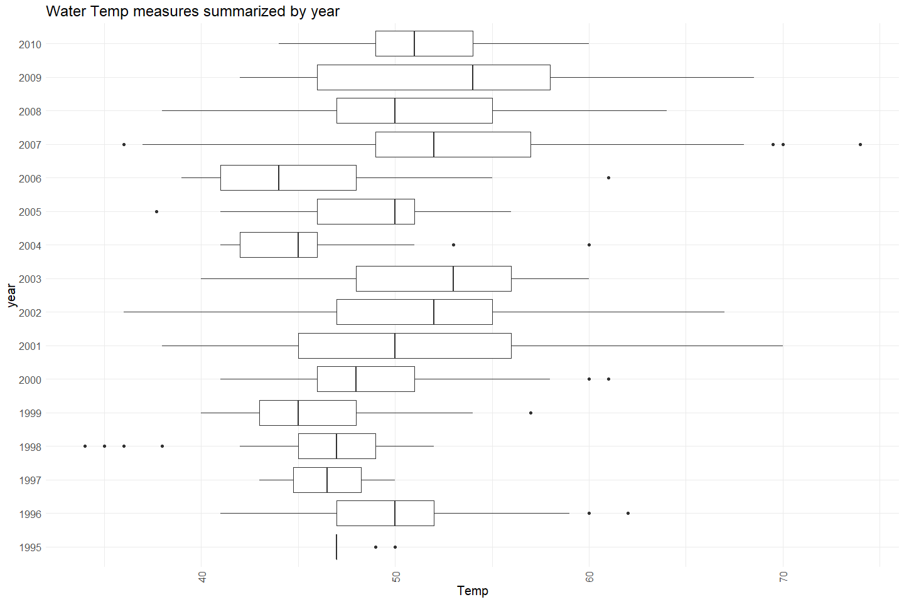<!-- -->

``` r
cleaner_rst_data %>% 
  ggplot(aes(x = water_temperature)) + 
  geom_histogram() + 
  theme_minimal() +
  labs(title = "Temperature distribution") + 
  theme(text = element_text(size = 18),
        axis.text.x = element_text(angle = 90, vjust = 0.5, hjust=1)) 
```

    ## `stat_bin()` using `bins = 30`. Pick better value with `binwidth`.

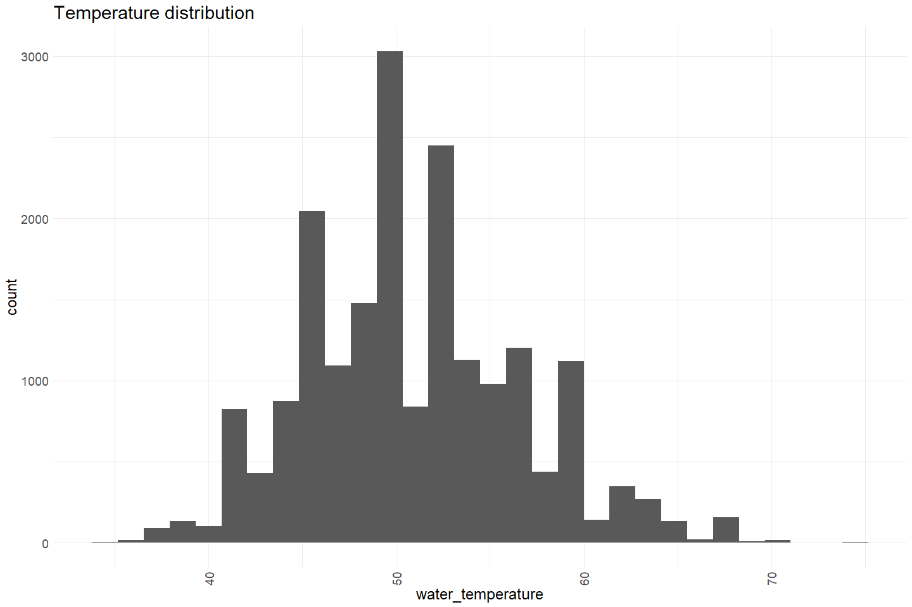<!-- -->

``` r
cleaner_rst_data %>%
  mutate(wy = factor(ifelse(month(date) %in% 10:12, year(date) + 1, year(date))),
         fake_year = 2000,
         fake_year = ifelse(month(date) %in% 10:12, fake_year - 1, fake_year),
         fake_date = ymd(paste(fake_year, month(date), day(date)))) %>%
  ggplot(aes(x = fake_date, y = water_temperature)) +
  scale_x_date(date_breaks = "1 month", date_labels = "%b") +
  geom_line(size = 0.5) +
  xlab("Date") +
  facet_wrap(~wy, scales = "free_y") + 
  theme_minimal()
```

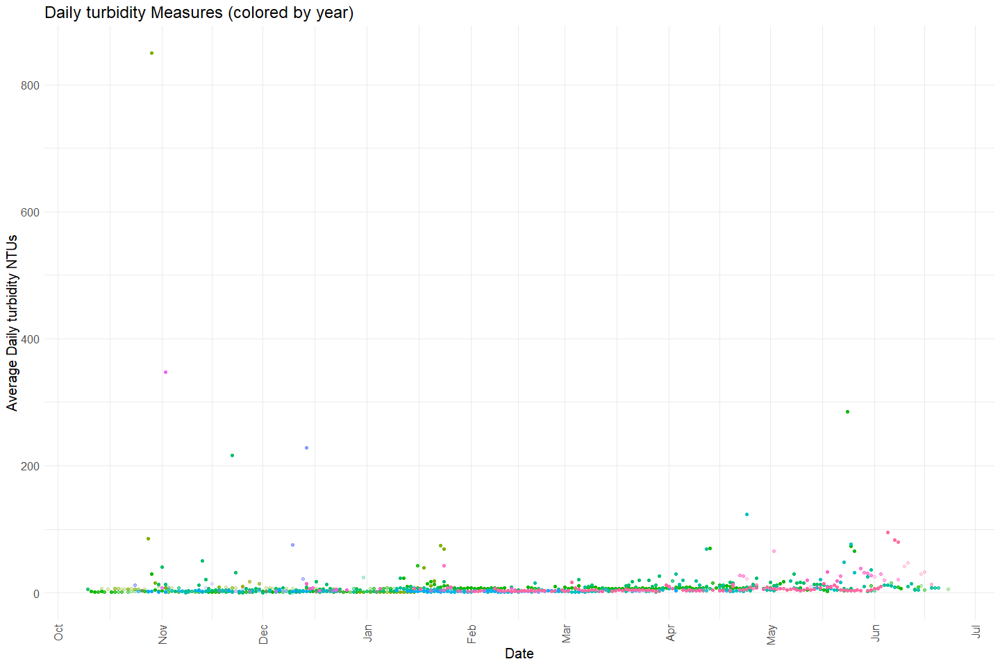<!-- -->

Also a lot of gaps in temp data.

**Numeric Summary of water\_temperature over Period of Record**

``` r
# Table with summary statistics
summary(cleaner_rst_data$water_temperature)
```

    ##    Min. 1st Qu.  Median    Mean 3rd Qu.    Max.    NA's 
    ##    34.0    47.0    50.0    50.9    54.0    74.0    6153

**NA and Unknown Values**

-   24.1 % of values in the `water_temperature` column are NA.

### Variable: `turbidity`

turbidity, NTU’s

**Plotting turbidity over Period of Record**

``` r
# Make whatever plot is appropriate 
# maybe 2 plots is appropriate
cleaner_rst_data %>% 
  group_by(date) %>%
  summarise(avg_turbidity = mean(turbidity, na.rm = T)) %>%
  filter(avg_turbidity < 200) %>% # filter out 5 values above 200 
  mutate(year = as.factor(year(date)),
         fake_year = if_else(month(date) %in% 10:12, 1900, 1901),
         fake_date = as.Date(paste0(fake_year,"-", month(date), "-", day(date)))) %>%
  ggplot(aes(x = fake_date, y = avg_turbidity, color = year)) + 
  geom_point(alpha = .5) + 
  # facet_wrap(~year(date), scales = "free") + 
  scale_x_date(labels = date_format("%b"), date_breaks = "1 month") + 
  theme_minimal() + 
  theme(text = element_text(size = 15),
        axis.text.x = element_text(angle = 90, vjust = 0.5, hjust=1),
        legend.position = "none") + 
  labs(title = "Daily turbidity Measures (colored by year)",
       x = "Date", 
       y = "Average Daily turbidity NTUs")  
```

<!-- -->

``` r
cleaner_rst_data %>% 
  ggplot(aes(x = turbidity)) + 
  geom_histogram() + 
  theme_minimal() +
  labs(title = "Turbidity distribution") + 
  theme(text = element_text(size = 18),
        axis.text.x = element_text(angle = 90, vjust = 0.5, hjust=1)) 
```

    ## `stat_bin()` using `bins = 30`. Pick better value with `binwidth`.

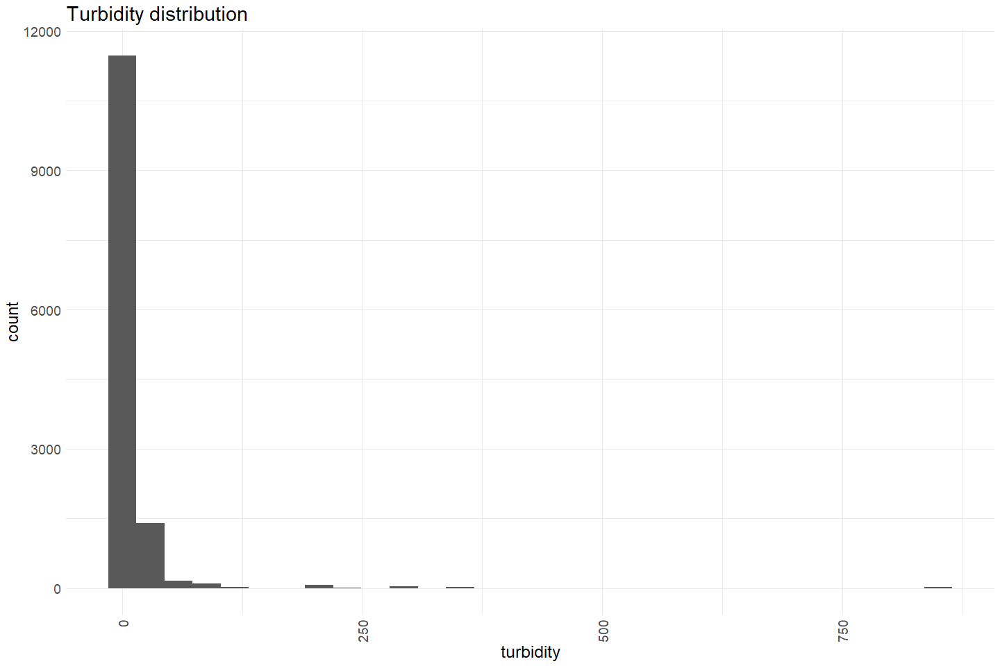<!-- -->

Clustered around very low turbidity measures with some outliers.

``` r
cleaner_rst_data %>%
  mutate(wy = factor(ifelse(month(date) %in% 10:12, year(date) + 1, year(date))),
         fake_year = 2000,
         fake_year = ifelse(month(date) %in% 10:12, fake_year - 1, fake_year),
         fake_date = ymd(paste(fake_year, month(date), day(date)))) %>%
  ggplot(aes(x = fake_date, y = turbidity)) +
  scale_x_date(date_breaks = "1 month", date_labels = "%b") +
  geom_line(size = 0.5) +
  xlab("Date") +
  facet_wrap(~wy, scales = "free_y") + 
  theme_minimal()
```

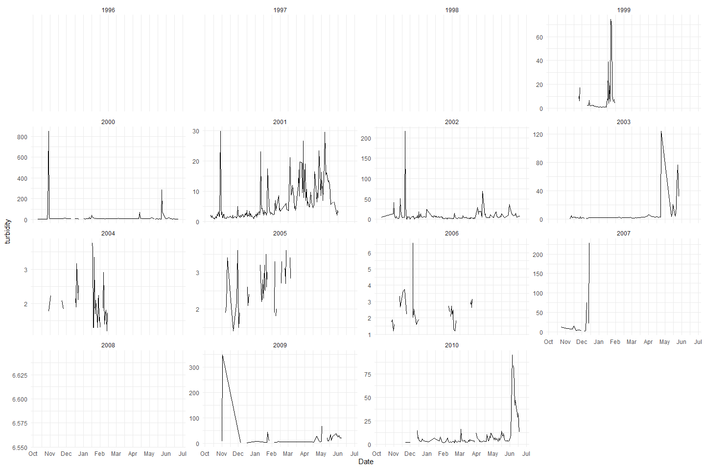<!-- -->

Notes:

-   No turbidity values before 1998
-   Some high turbidity values throughout the years
-   A lot of data gaps

**Numeric Summary of turbidity over Period of Record**

``` r
# Table with summary statistics
summary(cleaner_rst_data$turbidity)
```

    ##    Min. 1st Qu.  Median    Mean 3rd Qu.    Max.    NA's 
    ##    0.00    3.25    5.41   12.92    9.51  850.00   12212

**NA and Unknown Values**

-   47.8 % of values in the `turbidity` column are NA.

## Explore Categorical variables:

``` r
cleaner_rst_data %>% select_if(is.character) %>% colnames()
```

    ## [1] "location"            "trap_condition_code" "weather"            
    ## [4] "comments"

### Variable: `location`

``` r
table(cleaner_rst_data$location) 
```

    ## 
    ## Mill Creek RSTR 
    ##           25529

**NA and Unknown Values**

-   0 % of values in the `location` column are NA.

### Variable: `trap_condition_code`

Code describing trap condition.

Trap condition codes are referenced by the following numerals only:
1,2,3 and 4. Any other numerals in that field are data entry errors. 1=
normal, 2 = partial blockage, 3 = total blockage, and 4 = cone stopped.

``` r
table(cleaner_rst_data$trap_condition_code) 
```

    ## 
    ##     1     2     3     4    54    75 
    ## 19225    70    28   207     7    77

Add in definitions in place of codes:

``` r
cleaner_rst_data$trap_condition_code <- case_when(
  cleaner_rst_data$trap_condition_code == 1 ~ "normal", 
  cleaner_rst_data$trap_condition_code == 2 ~ "partial blockage", 
  cleaner_rst_data$trap_condition_code == 3 ~ "total blockage",
  cleaner_rst_data$trap_condition_code == 4 ~ "cone stopped")

table(cleaner_rst_data$trap_condition_code) 
```

    ## 
    ##     cone stopped           normal partial blockage   total blockage 
    ##              207            19225               70               28

**NA and Unknown Values**

-   23.5 % of values in the `trap_condition_code` column are NA.

### Variable: `weather`

Code describing weather condition.

Weather codes are referenced by the following numerals only: 1,2,3,4,5
and 6. Any other numerals in that field are data entry errors. 1= sunny,
2= partly cloudy, 3= cloudy, 4= rain, 5= snow, and 6= fog.

``` r
table(cleaner_rst_data$weather) 
```

    ## 
    ##     1     2     3     4    48     6 
    ## 12070  5219  3717  1847    46   316

Add in definitions in place of codes:

``` r
cleaner_rst_data$weather <- case_when(
  cleaner_rst_data$weather == 1 ~ "sunny", 
  cleaner_rst_data$weather == 2 ~ "partly cloudy", 
  cleaner_rst_data$weather == 3 ~ "cloudy",
  cleaner_rst_data$weather == 4 ~ "rain",
  cleaner_rst_data$weather == 5 ~ "snow", 
  cleaner_rst_data$weather == 6 ~ "fog")

table(cleaner_rst_data$weather) 
```

    ## 
    ##        cloudy           fog partly cloudy          rain         sunny 
    ##          3717           316          5219          1847         12070

**NA and Unknown Values**

-   9.2 % of values in the `weather` column are NA.

### Variable: `comments`

First 5 unique comments displayed to see what info they contain

``` r
unique(cleaner_rst_data$comments)[1:5] 
```

    ## [1] "1995 BY-CHISAL said to weigh 1mg."                                                                                                                                                                                                                    
    ## [2] "Fished continuously during the storm, water still high and muddy"                                                                                                                                                                                     
    ## [3] "4 fry=1g.  Water up, trubid.  Hatched salmon eggs and some unhatched dead eggs in live box. On 12/15 creek high and turbis, trap flipped upside down and drum tore off.  On 12/17 removed trap and secured to planks over ditch.  Haven't found drum."
    ## [4] "Drum spinning freely.  On 2/4 road too flooded to check trap.  On 2/5 checked trap at 11:00.  High water had deposited trap on planks over the canal.  Nothing was inside the live-box."                                                              
    ## [5] "Water level decreasing, water clear  10 fry=4g."

**NA and Unknown Values**

-   63 % of values in the `comments` column are NA.

## Summary of identified issues

-   Lots of sampling gaps
-   Some funky values in weather and condition code, converted to NA

## Save cleaned data back to google cloud

``` r
mill_rst <- cleaner_rst_data %>% glimpse()
```

    ## Rows: 25,529
    ## Columns: 13
    ## $ date                    <date> 1995-12-09, 1995-12-13, 1995-12-13, 1995-12-1~
    ## $ location                <chr> "Mill Creek RSTR", "Mill Creek RSTR", "Mill Cr~
    ## $ count                   <dbl> 1, 2, 1, 1, 3, 8, 8, 1, 5, 16, 5, 1, 17, 2, 2,~
    ## $ fork_length             <dbl> 32, 34, 35, 35, 36, NA, 36, 38, 37, 35, 33, 31~
    ## $ weight                  <dbl> NA, NA, NA, NA, NA, NA, NA, NA, NA, NA, NA, NA~
    ## $ flow                    <dbl> NA, NA, NA, NA, NA, NA, NA, NA, NA, NA, NA, NA~
    ## $ time_for_10_revolutions <dbl> NA, NA, NA, NA, NA, NA, NA, NA, NA, NA, NA, NA~
    ## $ tubs_of_debris          <dbl> NA, NA, NA, NA, NA, NA, NA, NA, NA, NA, NA, NA~
    ## $ trap_condition_code     <chr> "normal", "normal", "normal", "normal", "norma~
    ## $ water_temperature       <dbl> 50, 49, 49, 47, 47, 47, 47, 47, 47, 47, 47, 47~
    ## $ turbidity               <dbl> NA, NA, NA, NA, NA, NA, NA, NA, NA, NA, NA, NA~
    ## $ weather                 <chr> NA, NA, NA, "rain", "rain", "rain", "rain", "r~
    ## $ comments                <chr> "1995 BY-CHISAL said to weigh 1mg.", "Fished c~

``` r
f <- function(input, output) write_csv(input, file = output)

gcs_upload(mill_rst,
           object_function = f,
           type = "csv",
           name = "rst/mill-creek/data/mill_rst.csv")
```
