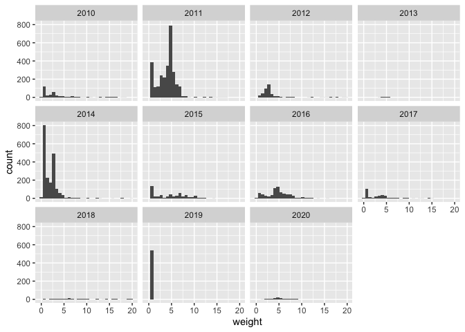
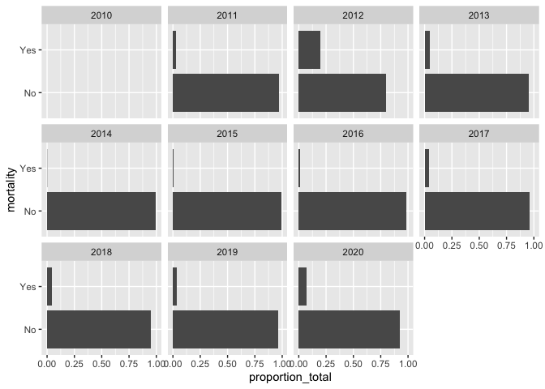
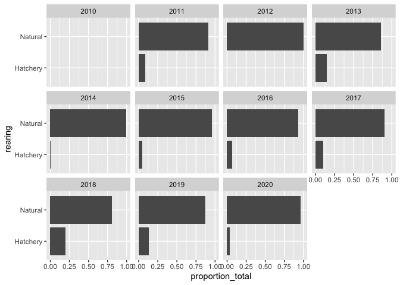
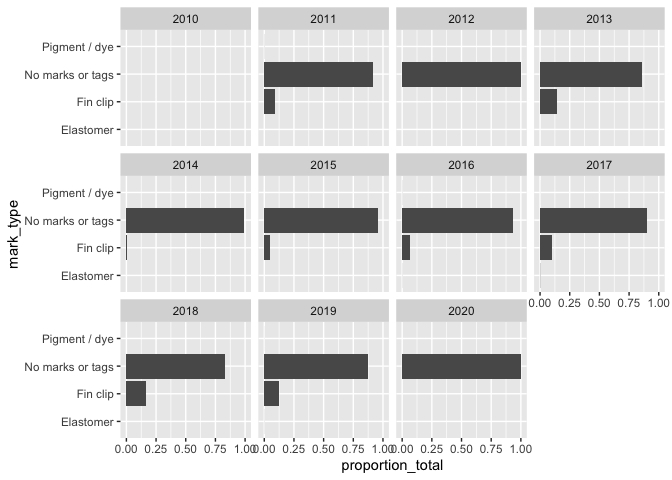

Lower Sacramento (Tisdale) RST data QC
================
Ashley Vizek
11/10/2021

## Description of Monitoring Data

**Timeframe:**

07/07/2010 through 05/28/2020

**Completeness of Record throughout timeframe:**

Water year 2012 has incomplete data.

**Sampling Location:**

Tisdale

**Data Contact:**

[Drew Huneycutt](mailto::andrew.huneycutt@wildlife.ca.gov)

## Access Cloud Data

``` r
# Run Sys.setenv() to specify GCS_AUTH_FILE and GCS_DEFAULT_BUCKET before running 
# getwd() to see how to specify paths 
# Open object from google cloud storage
# Set your authentication using gcs_auth
gcs_auth(json_file = Sys.getenv("GCS_AUTH_FILE"))
# Set global bucket 
gcs_global_bucket(bucket = Sys.getenv("GCS_DEFAULT_BUCKET"))

gcs_list_objects()

gcs_get_object(object_name = "rst/lower-sac-river/data/tisdale/tisdale_raw_clean.csv",
               bucket = gcs_get_global_bucket(),
               saveToDisk = "tisdale_raw_clean.csv",
               overwrite = TRUE)
```

Read in data from google cloud, glimpse raw data and domain description
sheet.

``` r
# read in data to clean 
raw_clean <- read.csv("tisdale_rst_raw_clean.csv")
glimpse(raw_clean)
```

    ## Rows: 21,427
    ## Columns: 21
    ## $ date               <chr> "2010-07-07T00:00:00Z", "2010-07-07T00:00:00Z", "20…
    ## $ trap_position      <chr> "RL", "RR", "RL", "RR", "RL", "RR", "RL", "RR", "RL…
    ## $ fish_processed     <chr> "No fish were caught", "No fish were caught", "No f…
    ## $ species            <chr> "Chinook salmon", "Chinook salmon", "Chinook salmon…
    ## $ fork_length_mm     <int> NA, NA, NA, NA, NA, NA, NA, NA, NA, NA, NA, NA, NA,…
    ## $ weight             <dbl> NA, NA, NA, NA, NA, NA, NA, NA, NA, NA, NA, NA, NA,…
    ## $ life_stage         <chr> "Not recorded", "Not recorded", "Not recorded", "No…
    ## $ at_capture_run     <chr> "Not recorded", "Not recorded", "Not recorded", "No…
    ## $ final_run          <chr> NA, NA, NA, NA, NA, NA, NA, NA, NA, NA, NA, NA, NA,…
    ## $ mortality          <chr> "No", "No", "No", "No", "No", "No", "No", "No", "No…
    ## $ random             <chr> "No", "No", "No", "No", "No", "No", "No", "No", "No…
    ## $ analyses           <chr> "Yes", "Yes", "Yes", "Yes", "Yes", "Yes", "Yes", "Y…
    ## $ rearing            <chr> "Natural", "Natural", "Natural", "Natural", "Natura…
    ## $ release_id         <int> 255, 255, 255, 255, 255, 255, 255, 255, 255, 255, 2…
    ## $ mark_type          <chr> "No marks or tags", "No marks or tags", "No marks o…
    ## $ mark_position      <chr> "Not applicable (n/a)", "Not applicable (n/a)", "No…
    ## $ mark_color         <chr> "Not applicable (n/a)", "Not applicable (n/a)", "No…
    ## $ trap_visit_comment <chr> NA, NA, NA, NA, NA, NA, NA, NA, NA, NA, NA, NA, NA,…
    ## $ catch_comment      <lgl> NA, NA, NA, NA, NA, NA, NA, NA, NA, NA, NA, NA, NA,…
    ## $ location           <chr> "Tisdale Weir RST", "Tisdale Weir RST", "Tisdale We…
    ## $ count              <int> 0, 0, 0, 0, 0, 0, 0, 0, 0, 0, 0, 0, 0, 0, 0, 0, 0, …

## Data transformations

This work was done in other rmd (1\_tisdale\_initial\_clean.Rmd)

## Explore Numeric Variables:

``` r
# Filter clean data to show only numeric variables (this way we know we do not miss any)
raw_clean %>%
  select_if(is.numeric) %>%
  colnames()
```

    ## [1] "fork_length_mm" "weight"         "release_id"     "count"

### Variable: `fork_length_mm`

**Plotting `fork_length_mm` over Period of Record**

There are some outliers - fork length greater than 300.

``` r
filter(raw_clean, fork_length_mm < 300) %>%
ggplot(aes(x = fork_length_mm)) +
  geom_histogram() +
  facet_wrap(~year(date))
```

    ## `stat_bin()` using `bins = 30`. Pick better value with `binwidth`.

<!-- -->

**Numeric Summary of `fork_length_mm` over Period of Record**

``` r
raw_clean %>%
  group_by(year(date)) %>%
  summarize(mean = mean(fork_length_mm, na.rm = T),
            median = median(fork_length_mm, na.rm = T),
            min = min(fork_length_mm, na.rm = T),
            max = max(fork_length_mm, na.rm = T),
            na = length(which(is.na(fork_length_mm))))
```

    ## # A tibble: 11 × 6
    ##    `year(date)`  mean median   min   max    na
    ##           <dbl> <dbl>  <dbl> <int> <int> <int>
    ##  1         2010  61.6   56.5     0   160   186
    ##  2         2011  64.1   71      27   154   270
    ##  3         2012  62.0   57      30   191   176
    ##  4         2013  78.8   80      34    98   353
    ##  5         2014  55.2   50       0   220   597
    ##  6         2015  58.9   44      27   180   584
    ##  7         2016  59.2   55      28   200   578
    ##  8         2017  59.7   62      31   150   646
    ##  9         2018  76.7   71      28   193   580
    ## 10         2019  65.2   71       0   181   548
    ## 11         2020  66.8   64      17  4038   314

Looks like the outlier should be 40 rather than 4038.

``` r
filter(raw_clean, fork_length_mm > 300)
```

    ##                   date trap_position fish_processed        species
    ## 1 2020-01-27T00:00:00Z            RL Processed fish Chinook salmon
    ##   fork_length_mm weight life_stage at_capture_run final_run mortality random
    ## 1           4038     NA       Parr           Fall      <NA>        No    Yes
    ##   analyses rearing release_id        mark_type        mark_position
    ## 1      Yes Natural        255 No marks or tags Not applicable (n/a)
    ##             mark_color trap_visit_comment catch_comment         location count
    ## 1 Not applicable (n/a)               <NA>            NA Tisdale Weir RST     1

``` r
raw_clean %>%
  group_by(life_stage) %>%
  summarize(mean = mean(fork_length_mm, na.rm = T),
            median = median(fork_length_mm, na.rm = T))
```

    ## # A tibble: 8 × 3
    ##   life_stage             mean median
    ##   <chr>                 <dbl>  <dbl>
    ## 1 Button-up fry          36.3   35  
    ## 2 Fry                    36.2   36  
    ## 3 Juvenile               39     39  
    ## 4 Not recorded           60.4   55.5
    ## 5 Parr                   53.9   48  
    ## 6 Silvery parr           81.1   79  
    ## 7 Smolt                 118.   115  
    ## 8 Yolk sac fry (alevin)  33.5   33

**NA and Unknown Values**

Percent of NA:

22.6 % of values in the `fork_length_mm` column are NA.

### Variable: `weight`

**Plotting `weight` over Period of Record**

``` r
filter(raw_clean, weight < 20) %>%
ggplot(aes(x = weight)) +
  geom_histogram() +
  facet_wrap(~year(date))
```

    ## `stat_bin()` using `bins = 30`. Pick better value with `binwidth`.

<!-- -->

**Numeric Summary of `weight` over Period of Record**

``` r
raw_clean %>%
  group_by(year(date)) %>%
  summarize(mean = mean(weight, na.rm = T),
            median = median(weight, na.rm = T),
            min = min(weight, na.rm = T),
            max = max(weight, na.rm = T),
            na = length(which(is.na(weight))))
```

    ## # A tibble: 11 × 6
    ##    `year(date)`  mean median   min   max    na
    ##           <dbl> <dbl>  <dbl> <dbl> <dbl> <int>
    ##  1         2010  5.37    2.5  0     59     285
    ##  2         2011  3.97    4    0.5   63    1152
    ##  3         2012  5.25    2.5  1     87.5   339
    ##  4         2013  4.5     4.5  3.5    5.5   744
    ##  5         2014  2.06    1.5  0    131.   2386
    ##  6         2015  4.63    5    0.5   20.5  1317
    ##  7         2016  5.00    4.6  0.25  83    2139
    ##  8         2017  3.11    2.9  0.2   35.7  1934
    ##  9         2018 19.8    12.2  0.4   77.6   895
    ## 10         2019  1       1    1      1    1465
    ## 11         2020  5.32    5.1  1.7    8.7   988

**NA and Unknown Values**

Percent of NA:

63.7 % of values in the `weight` column are NA.

### Variable: `count`

**Plotting `count` over Period of Record**

``` r
raw_clean %>%
  group_by(date, at_capture_run) %>%
  summarize(count = sum(count)) %>%
  mutate(wy = factor(ifelse(month(date) %in% 10:12, year(date) + 1, year(date))),
         fake_year = 2000,
         fake_year = ifelse(month(date) %in% 10:12, fake_year - 1, fake_year),
         fake_date = ymd(paste(fake_year, month(date), day(date)))) %>%
ggplot(aes(y = count, x = fake_date, color = at_capture_run)) +
  scale_x_date(date_breaks = "3 month", date_labels = "%b") +
  geom_line() +
  facet_wrap(~wy, scales = "free_y") +
  xlab("") +
  theme(legend.position="bottom")
```

    ## `summarise()` has grouped output by 'date'. You can override using the `.groups` argument.

<!-- -->

**Numeric Summary of `count` over Period of Record**

``` r
knitr::kable(raw_clean %>%
  group_by(date, at_capture_run) %>%
  summarize(count = sum(count)) %>%
  mutate(wy = factor(ifelse(month(date) %in% 10:12, year(date) + 1, year(date)))) %>%
  group_by(wy) %>%
  summarize(mean = round(mean(count, na.rm = T),2),
            median = round(median(count, na.rm = T),2),
            min = round(min(count, na.rm = T),2),
            max = round(max(count, na.rm = T),2),
            na = length(which(is.na(count)))))
```

    ## `summarise()` has grouped output by 'date'. You can override using the `.groups` argument.

| wy   |   mean | median | min |  max |  na |
|:-----|-------:|-------:|----:|-----:|----:|
| 2010 |   0.00 |      0 |   0 |    0 |   0 |
| 2011 |  19.95 |      1 |   0 |  563 |   0 |
| 2012 |   0.11 |      0 |   0 |    1 |   0 |
| 2013 |   9.94 |      0 |   0 |  692 |   0 |
| 2014 | 120.44 |      0 |   0 | 8636 |   0 |
| 2015 |  14.57 |      0 |   0 | 2017 |   0 |
| 2016 |  21.57 |      1 |   0 |  632 |   0 |
| 2017 |   7.28 |      0 |   0 |  276 |   0 |
| 2018 |   0.85 |      0 |   0 |   29 |   0 |
| 2019 |   5.59 |      0 |   0 |  162 |   0 |
| 2020 |  14.18 |      0 |   0 | 2470 |   0 |

**NA and Unknown Values**

Percent of NA:

0 % of values in the `count` column are NA.

### Variable: `release_id`

**Plotting `release_id` over Period of Record**

`release_id` is always the same value. Make this a character instead of
numeric.

## Explore Categorical variables:

General notes: If there is an opportunity to turn yes no into boolean do
so, but not if you loose value

Need to change data to the correct format.

I don’t think we need the variables random and analyses but will leave
them in.

``` r
raw_clean %>%
  select_if(is.character) %>%
  colnames()
```

    ##  [1] "date"               "trap_position"      "fish_processed"    
    ##  [4] "species"            "life_stage"         "at_capture_run"    
    ##  [7] "final_run"          "mortality"          "random"            
    ## [10] "analyses"           "rearing"            "mark_type"         
    ## [13] "mark_position"      "mark_color"         "trap_visit_comment"
    ## [16] "location"

### Variable: `trap_position`

`RL` is river left and `RR` is river right

``` r
unique(raw_clean$trap_position) 
```

    ## [1] "RL"  "RR"  "N/A"

``` r
filter(raw_clean, trap_position == "N/A")
```

    ##                   date trap_position fish_processed        species
    ## 1 2019-11-29T00:00:00Z           N/A Processed fish Chinook salmon
    ##   fork_length_mm weight   life_stage at_capture_run final_run mortality random
    ## 1             NA     NA Not recorded   Not recorded      <NA>        No     No
    ##   analyses rearing release_id        mark_type        mark_position
    ## 1      Yes Natural        255 No marks or tags Not applicable (n/a)
    ##             mark_color trap_visit_comment catch_comment         location count
    ## 1 Not applicable (n/a)               <NA>            NA Tisdale Weir RST     0

``` r
group_by(raw_clean, date) %>%
  tally() %>%
  filter(n > 2)
```

    ## # A tibble: 1,107 × 2
    ##    date                     n
    ##    <chr>                <int>
    ##  1 2010-10-28T00:00:00Z    58
    ##  2 2010-10-29T00:00:00Z    17
    ##  3 2010-10-30T00:00:00Z     5
    ##  4 2010-10-31T00:00:00Z     4
    ##  5 2010-11-02T00:00:00Z     3
    ##  6 2010-11-13T00:00:00Z     5
    ##  7 2010-11-15T00:00:00Z     3
    ##  8 2010-11-24T00:00:00Z     3
    ##  9 2010-11-26T00:00:00Z     3
    ## 10 2010-11-27T00:00:00Z     3
    ## # … with 1,097 more rows

Some years do not have `trap_location` variable filled in but it is
labeled as “N / A” so change that to NA.

**NA and Unknown Values**

0 % of values in the `trap_position` column are NA.

### Variable: `fish_processed`

Two instances where `fish_processed` is `No fish were caught` when count
is greater than 0. I think these are mistakes and should be changes to
`Processed fished`

``` r
unique(raw_clean$fish_processed) 
```

    ## [1] "No fish were caught"       "Processed fish"           
    ## [3] "N/A; not a sampling visit"

``` r
filter(raw_clean, fish_processed == "No fish were caught", count > 0) %>%
  select(date, fish_processed, fork_length_mm, at_capture_run, count)
```

    ##                   date      fish_processed fork_length_mm at_capture_run count
    ## 1 2019-04-25T00:00:00Z No fish were caught             74           Fall     1
    ## 2 2020-03-10T00:00:00Z No fish were caught             55           Fall     1

``` r
filter(raw_clean, fish_processed == "N/A; not a sampling visit") %>%
  select(date, fish_processed, fork_length_mm, at_capture_run, count)
```

    ##                   date            fish_processed fork_length_mm at_capture_run
    ## 1 2019-01-19T00:00:00Z N/A; not a sampling visit             NA   Not recorded
    ## 2 2019-03-30T00:00:00Z N/A; not a sampling visit             NA   Not recorded
    ## 3 2019-03-31T00:00:00Z N/A; not a sampling visit             NA   Not recorded
    ##   count
    ## 1     0
    ## 2     0
    ## 3     0

**NA and Unknown Values**

0 % of values in the `fish_processed` column are NA.

### Variable: `species`

Data only includes `Chinook salmon`

``` r
unique(raw_clean$species)
```

    ## [1] "Chinook salmon"

**NA and Unknown Values**

0 % of values in the `species` column are NA.

### Variable: `life_stage`

Parr is the most abundant life stage.

``` r
unique(raw_clean$life_stage)
```

    ## [1] "Not recorded"          "Parr"                  "Silvery parr"         
    ## [4] "Fry"                   "Smolt"                 "Button-up fry"        
    ## [7] "Yolk sac fry (alevin)" "Juvenile"

``` r
total <- raw_clean %>%
  mutate(wy = factor(ifelse(month(date) %in% 10:12, year(date) + 1, year(date)))) %>%
  group_by(wy) %>%
  summarize(total = sum(count))
raw_clean %>%
  mutate(wy = factor(ifelse(month(date) %in% 10:12, year(date) + 1, year(date)))) %>%
  group_by(wy, life_stage) %>%
  summarize(count = sum(count)) %>%
  left_join(total) %>%
  mutate(proportion_total = count/total) %>%
  ggplot(aes(y = life_stage, x = proportion_total)) +
  geom_col() +
  facet_wrap(~wy)
```

    ## `summarise()` has grouped output by 'wy'. You can override using the `.groups` argument.

    ## Joining, by = "wy"

<!-- -->

**NA and Unknown Values**

0 % of values in the `life_stage` column are NA.

### Variable: `at_capture_run`

10 instances where `at_capture_run` is `Not applicable (n/a)`. Change
these to be NA.

Fall is the most abundant run.

``` r
unique(raw_clean$at_capture_run)
```

    ## [1] "Not recorded"         "Winter"               "Late fall"           
    ## [4] "Spring"               "Fall"                 "Not applicable (n/a)"

``` r
filter(raw_clean, at_capture_run == "Not applicable (n/a)") %>%
  select(date, fish_processed, fork_length_mm, at_capture_run, count)
```

    ##                    date fish_processed fork_length_mm       at_capture_run
    ## 1  2019-12-20T00:00:00Z Processed fish            158 Not applicable (n/a)
    ## 2  2020-01-10T00:00:00Z Processed fish            139 Not applicable (n/a)
    ## 3  2020-01-10T00:00:00Z Processed fish             NA Not applicable (n/a)
    ## 4  2020-01-20T00:00:00Z Processed fish            100 Not applicable (n/a)
    ## 5  2020-02-06T00:00:00Z Processed fish             35 Not applicable (n/a)
    ## 6  2020-02-06T00:00:00Z Processed fish             38 Not applicable (n/a)
    ## 7  2020-02-06T00:00:00Z Processed fish             39 Not applicable (n/a)
    ## 8  2020-02-06T00:00:00Z Processed fish             40 Not applicable (n/a)
    ## 9  2020-02-06T00:00:00Z Processed fish             45 Not applicable (n/a)
    ## 10 2020-02-06T00:00:00Z Processed fish             46 Not applicable (n/a)
    ##    count
    ## 1      1
    ## 2      1
    ## 3      0
    ## 4      1
    ## 5      1
    ## 6      1
    ## 7      3
    ## 8      3
    ## 9      1
    ## 10     1

``` r
total <- raw_clean %>%
  mutate(wy = factor(ifelse(month(date) %in% 10:12, year(date) + 1, year(date)))) %>%
  group_by(wy) %>%
  summarize(total = sum(count))
raw_clean %>%
  mutate(wy = factor(ifelse(month(date) %in% 10:12, year(date) + 1, year(date)))) %>%
  group_by(wy, at_capture_run) %>%
  summarize(count = sum(count)) %>%
  left_join(total) %>%
  mutate(proportion_total = count/total) %>%
  ggplot(aes(y = at_capture_run, x = proportion_total)) +
  geom_col() +
  facet_wrap(~wy)
```

    ## `summarise()` has grouped output by 'wy'. You can override using the `.groups` argument.

    ## Joining, by = "wy"

<!-- -->

**NA and Unknown Values**

0 % of values in the `at_capture_run` column are NA.

### Variable: `final_run`

Assuming that `final_run` is the qa/qc version of `at_capture_run`. For
the most part it doesn’t make much of a difference - there are only 13
instances when the run is adjusted in `final_run`. I think we should use
`final_run` as the `run` variable.

``` r
unique(raw_clean$final_run)
```

    ## [1] NA             "Winter"       "Late fall"    "Spring"       "Fall"        
    ## [6] "Not recorded"

``` r
filter(raw_clean, !is.na(final_run), final_run != at_capture_run, final_run != "Not recorded") %>%
  select(date, fish_processed, fork_length_mm, at_capture_run, count)
```

    ##                    date fish_processed fork_length_mm at_capture_run count
    ## 1  2012-12-07T00:00:00Z Processed fish             35         Spring     3
    ## 2  2012-12-07T00:00:00Z Processed fish             36         Spring     6
    ## 3  2012-12-07T00:00:00Z Processed fish             40         Spring     1
    ## 4  2012-12-07T00:00:00Z Processed fish             42         Spring     1
    ## 5  2012-12-07T00:00:00Z Processed fish             45         Spring     2
    ## 6  2012-12-07T00:00:00Z Processed fish             46         Spring     1
    ## 7  2014-01-06T00:00:00Z Processed fish              0   Not recorded     0
    ## 8  2014-01-09T00:00:00Z Processed fish              0   Not recorded     0
    ## 9  2014-04-08T00:00:00Z Processed fish             80           Fall     1
    ## 10 2014-04-18T00:00:00Z Processed fish             82           Fall     1
    ## 11 2015-12-28T00:00:00Z Processed fish             40         Winter     1
    ## 12 2020-01-02T00:00:00Z Processed fish             83         Winter     1
    ## 13 2020-01-04T00:00:00Z Processed fish             41         Spring     1

**NA and Unknown Values**

38.8 % of values in the `final_run` column are NA.

### Variable: `mortality`

Transform to T/F. Typically alive.

``` r
unique(raw_clean$mortality)
```

    ## [1] "No"  "Yes"

``` r
total <- raw_clean %>%
  mutate(wy = factor(ifelse(month(date) %in% 10:12, year(date) + 1, year(date)))) %>%
  group_by(wy) %>%
  summarize(total = sum(count))
raw_clean %>%
  mutate(wy = factor(ifelse(month(date) %in% 10:12, year(date) + 1, year(date)))) %>%
  group_by(wy, mortality) %>%
  summarize(count = sum(count)) %>%
  left_join(total) %>%
  mutate(proportion_total = count/total) %>%
  ggplot(aes(y = mortality, x = proportion_total)) +
  geom_col() +
  facet_wrap(~wy)
```

    ## `summarise()` has grouped output by 'wy'. You can override using the `.groups` argument.

    ## Joining, by = "wy"

<!-- -->

**NA and Unknown Values**

0 % of values in the `mortality` column are NA.

### Variable: `random`

Only two values where `random` is `Not recorded`. Most all cases are
`Yes`. I’m not sure how useful this information is. I will keep it in
the dataset though.

Transform to T/F.

``` r
unique(raw_clean$random)
```

    ## [1] "No"           "Yes"          "Not recorded"

``` r
filter(raw_clean, random == "Not recorded") %>%
  select(date, fish_processed, fork_length_mm, at_capture_run, count, random)
```

    ##                   date fish_processed fork_length_mm at_capture_run count
    ## 1 2018-04-01T00:00:00Z Processed fish             NA   Not recorded     0
    ## 2 2019-01-10T00:00:00Z Processed fish             NA   Not recorded     0
    ##         random
    ## 1 Not recorded
    ## 2 Not recorded

``` r
total <- raw_clean %>%
  mutate(wy = factor(ifelse(month(date) %in% 10:12, year(date) + 1, year(date)))) %>%
  group_by(wy) %>%
  summarize(total = sum(count))
raw_clean %>%
  mutate(wy = factor(ifelse(month(date) %in% 10:12, year(date) + 1, year(date)))) %>%
  group_by(wy, random) %>%
  summarize(count = sum(count)) %>%
  left_join(total) %>%
  mutate(proportion_total = count/total)
```

    ## `summarise()` has grouped output by 'wy'. You can override using the `.groups` argument.

    ## Joining, by = "wy"

    ## # A tibble: 24 × 5
    ## # Groups:   wy [11]
    ##    wy    random count total proportion_total
    ##    <fct> <chr>  <int> <int>            <dbl>
    ##  1 2010  No         0     0       NaN       
    ##  2 2010  Yes        0     0       NaN       
    ##  3 2011  No         6  9896         0.000606
    ##  4 2011  Yes     9890  9896         0.999   
    ##  5 2012  No         0     5         0       
    ##  6 2012  Yes        5     5         1       
    ##  7 2013  No         6  2217         0.00271 
    ##  8 2013  Yes     2211  2217         0.997   
    ##  9 2014  No         9 55765         0.000161
    ## 10 2014  Yes    55756 55765         1.00    
    ## # … with 14 more rows

**NA and Unknown Values**

0 % of values in the `random` column are NA.

### Variable: `analyses`

All cases are `Yes`. This doesn’t provide any information. Remove this
variable from dataset.

``` r
unique(raw_clean$analyses)
```

    ## [1] "Yes"

**NA and Unknown Values**

0 % of values in the `analyses` column are NA.

### Variable: `rearing`

Natural and Hatchery are the options for this variable. Most all are
Natural but there are some Hatchery.

``` r
unique(raw_clean$rearing)
```

    ## [1] "Natural"  "Hatchery"

``` r
filter(raw_clean, rearing == "Natural", mark_type != "No marks or tags") %>%
  select(date, fork_length_mm, at_capture_run, count, rearing)
```

    ##                    date fork_length_mm at_capture_run count rearing
    ## 1  2011-01-20T00:00:00Z             35           Fall     1 Natural
    ## 2  2011-01-20T00:00:00Z             39           Fall     1 Natural
    ## 3  2011-01-20T00:00:00Z             41           Fall     1 Natural
    ## 4  2011-01-20T00:00:00Z             43           Fall     1 Natural
    ## 5  2011-04-28T00:00:00Z             78           Fall     1 Natural
    ## 6  2011-05-01T00:00:00Z             81           Fall     1 Natural
    ## 7  2011-05-01T00:00:00Z             86           Fall     1 Natural
    ## 8  2011-05-02T00:00:00Z             61           Fall     1 Natural
    ## 9  2013-05-10T00:00:00Z             90           Fall     1 Natural
    ## 10 2013-05-10T00:00:00Z             91           Fall     1 Natural
    ## 11 2016-01-17T00:00:00Z             37           Fall     1 Natural
    ## 12 2016-01-18T00:00:00Z             37           Fall     1 Natural
    ## 13 2016-01-18T00:00:00Z             37           Fall     1 Natural
    ## 14 2016-01-19T00:00:00Z             38           Fall     1 Natural
    ## 15 2016-01-21T00:00:00Z             32           Fall     1 Natural
    ## 16 2016-01-21T00:00:00Z             39           Fall     1 Natural
    ## 17 2016-01-23T00:00:00Z             40           Fall     1 Natural
    ## 18 2016-04-16T00:00:00Z             90         Spring     1 Natural
    ## 19 2017-04-04T00:00:00Z             73           Fall     1 Natural
    ## 20 2018-11-01T00:00:00Z            135           Fall     1 Natural
    ## 21 2018-11-01T00:00:00Z            137           Fall     1 Natural
    ## 22 2019-01-17T00:00:00Z             34           Fall     1 Natural

``` r
total <- raw_clean %>%
  mutate(wy = factor(ifelse(month(date) %in% 10:12, year(date) + 1, year(date)))) %>%
  group_by(wy) %>%
  summarize(total = sum(count))
raw_clean %>%
  mutate(wy = factor(ifelse(month(date) %in% 10:12, year(date) + 1, year(date)))) %>%
  group_by(wy, rearing) %>%
  summarize(count = sum(count)) %>%
  left_join(total) %>%
  mutate(proportion_total = count/total) %>%
  ggplot(aes(y = rearing, x = proportion_total)) +
  geom_col() +
  facet_wrap(~wy)
```

    ## `summarise()` has grouped output by 'wy'. You can override using the `.groups` argument.

    ## Joining, by = "wy"

<!-- -->

**NA and Unknown Values**

0 % of values in the \`rearing\`\` column are NA.

### Variable: `mark_type`

Simplified the names of categories:

-   No marks or tags = None
-   Pigment / dye = Pigment
-   Elastomer = Elastomer

Data is for fish with mostly no marks or tags.

``` r
unique(raw_clean$mark_type)
```

    ## [1] "No marks or tags" "Fin clip"         "Pigment / dye"    "Elastomer"

``` r
# curious whether there are cases when natural fish have marks.
filter(raw_clean, rearing == "Natural", mark_type != "No marks or tags") %>%
  select(date, fork_length_mm, at_capture_run, count, rearing, mark_type)
```

    ##                    date fork_length_mm at_capture_run count rearing
    ## 1  2011-01-20T00:00:00Z             35           Fall     1 Natural
    ## 2  2011-01-20T00:00:00Z             39           Fall     1 Natural
    ## 3  2011-01-20T00:00:00Z             41           Fall     1 Natural
    ## 4  2011-01-20T00:00:00Z             43           Fall     1 Natural
    ## 5  2011-04-28T00:00:00Z             78           Fall     1 Natural
    ## 6  2011-05-01T00:00:00Z             81           Fall     1 Natural
    ## 7  2011-05-01T00:00:00Z             86           Fall     1 Natural
    ## 8  2011-05-02T00:00:00Z             61           Fall     1 Natural
    ## 9  2013-05-10T00:00:00Z             90           Fall     1 Natural
    ## 10 2013-05-10T00:00:00Z             91           Fall     1 Natural
    ## 11 2016-01-17T00:00:00Z             37           Fall     1 Natural
    ## 12 2016-01-18T00:00:00Z             37           Fall     1 Natural
    ## 13 2016-01-18T00:00:00Z             37           Fall     1 Natural
    ## 14 2016-01-19T00:00:00Z             38           Fall     1 Natural
    ## 15 2016-01-21T00:00:00Z             32           Fall     1 Natural
    ## 16 2016-01-21T00:00:00Z             39           Fall     1 Natural
    ## 17 2016-01-23T00:00:00Z             40           Fall     1 Natural
    ## 18 2016-04-16T00:00:00Z             90         Spring     1 Natural
    ## 19 2017-04-04T00:00:00Z             73           Fall     1 Natural
    ## 20 2018-11-01T00:00:00Z            135           Fall     1 Natural
    ## 21 2018-11-01T00:00:00Z            137           Fall     1 Natural
    ## 22 2019-01-17T00:00:00Z             34           Fall     1 Natural
    ##        mark_type
    ## 1  Pigment / dye
    ## 2  Pigment / dye
    ## 3  Pigment / dye
    ## 4  Pigment / dye
    ## 5  Pigment / dye
    ## 6  Pigment / dye
    ## 7  Pigment / dye
    ## 8  Pigment / dye
    ## 9       Fin clip
    ## 10      Fin clip
    ## 11 Pigment / dye
    ## 12 Pigment / dye
    ## 13 Pigment / dye
    ## 14 Pigment / dye
    ## 15 Pigment / dye
    ## 16 Pigment / dye
    ## 17 Pigment / dye
    ## 18 Pigment / dye
    ## 19 Pigment / dye
    ## 20      Fin clip
    ## 21     Elastomer
    ## 22 Pigment / dye

``` r
total <- raw_clean %>%
  mutate(wy = factor(ifelse(month(date) %in% 10:12, year(date) + 1, year(date)))) %>%
  group_by(wy) %>%
  summarize(total = sum(count))
raw_clean %>%
  mutate(wy = factor(ifelse(month(date) %in% 10:12, year(date) + 1, year(date)))) %>%
  group_by(wy, mark_type) %>%
  summarize(count = sum(count)) %>%
  left_join(total) %>%
  mutate(proportion_total = count/total) %>%
  ggplot(aes(y = mark_type, x = proportion_total)) +
  geom_col() +
  facet_wrap(~wy)
```

    ## `summarise()` has grouped output by 'wy'. You can override using the `.groups` argument.

    ## Joining, by = "wy"

<!-- -->

**NA and Unknown Values**

0 % of values in the \`mark\_type\`\` column are NA.

### Variable: `mark_position`

Left category names as is but changed Not applicable (n/a) to NA.

-   Adipose fin
-   Whole body
-   Nose
-   Pelvic fin, right
-   Pelvic fin, left

Most all marks are on the adipose fin.

``` r
unique(raw_clean$mark_position)
```

    ## [1] "Not applicable (n/a)" "Adipose fin"          "Whole body"          
    ## [4] "Nose"                 "Pelvic fin, right"    "Pelvic fin, left"

``` r
# curious whether this variable is filled out when mark_type is none
filter(raw_clean, mark_type == "No marks or tags", mark_position != "Not applicable (n/a)")
```

    ##  [1] date               trap_position      fish_processed     species           
    ##  [5] fork_length_mm     weight             life_stage         at_capture_run    
    ##  [9] final_run          mortality          random             analyses          
    ## [13] rearing            release_id         mark_type          mark_position     
    ## [17] mark_color         trap_visit_comment catch_comment      location          
    ## [21] count             
    ## <0 rows> (or 0-length row.names)

``` r
total <- raw_clean %>%
  mutate(wy = factor(ifelse(month(date) %in% 10:12, year(date) + 1, year(date)))) %>%
  group_by(wy) %>%
  summarize(total = sum(count))
filter(raw_clean, mark_type != "No marks or tags") %>%
  mutate(wy = factor(ifelse(month(date) %in% 10:12, year(date) + 1, year(date)))) %>%
  group_by(wy, mark_position) %>%
  summarize(count = sum(count)) %>%
  left_join(total) %>%
  mutate(proportion_total = count/total) %>%
  ggplot(aes(y = mark_position, x = proportion_total)) +
  geom_col() +
  facet_wrap(~wy)
```

    ## `summarise()` has grouped output by 'wy'. You can override using the `.groups` argument.

    ## Joining, by = "wy"

<!-- -->

**NA and Unknown Values**

0 % of values in the `mark_positon` column are NA.

### Variable: `mark_color`

Left category names as is but changed Not applicable (n/a) to NA.

-   Blue
-   Red
-   Brown
-   Yellow
-   Green
-   White
-   Orange

Most all data is NA. Only 35 cases when a color is recorded.

``` r
unique(raw_clean$mark_color)
```

    ## [1] "Not applicable (n/a)" "Blue"                 "Red"                 
    ## [4] "Brown"                "Yellow"               "Green"               
    ## [7] "White"                "Orange"

``` r
# curious whether this variable is filled out when mark_type is none
filter(raw_clean, mark_type == "No marks or tags", mark_color != "Not applicable (n/a)")
```

    ##  [1] date               trap_position      fish_processed     species           
    ##  [5] fork_length_mm     weight             life_stage         at_capture_run    
    ##  [9] final_run          mortality          random             analyses          
    ## [13] rearing            release_id         mark_type          mark_position     
    ## [17] mark_color         trap_visit_comment catch_comment      location          
    ## [21] count             
    ## <0 rows> (or 0-length row.names)

``` r
filter(raw_clean, mark_color != "Not applicable (n/a)") %>%
  select(date, fork_length_mm, at_capture_run, count, rearing, mark_type, mark_color)
```

    ##                    date fork_length_mm at_capture_run count  rearing
    ## 1  2011-01-20T00:00:00Z             35           Fall     1  Natural
    ## 2  2011-01-20T00:00:00Z             39           Fall     1  Natural
    ## 3  2011-01-20T00:00:00Z             41           Fall     1  Natural
    ## 4  2011-01-20T00:00:00Z             43           Fall     1  Natural
    ## 5  2011-04-28T00:00:00Z             78           Fall     1  Natural
    ## 6  2011-05-01T00:00:00Z             81           Fall     1  Natural
    ## 7  2011-05-01T00:00:00Z             86           Fall     1  Natural
    ## 8  2011-05-02T00:00:00Z             61           Fall     1  Natural
    ## 9  2016-01-17T00:00:00Z             37           Fall     1  Natural
    ## 10 2016-01-18T00:00:00Z             37           Fall     1  Natural
    ## 11 2016-01-18T00:00:00Z             37           Fall     1  Natural
    ## 12 2016-01-19T00:00:00Z             38           Fall     1  Natural
    ## 13 2016-01-21T00:00:00Z             32           Fall     1  Natural
    ## 14 2016-01-21T00:00:00Z             39           Fall     1  Natural
    ## 15 2016-01-23T00:00:00Z             40           Fall     1  Natural
    ## 16 2016-02-10T00:00:00Z             36           Fall     1 Hatchery
    ## 17 2016-02-19T00:00:00Z             54           Fall     1 Hatchery
    ## 18 2016-04-07T00:00:00Z             52           Fall     1 Hatchery
    ## 19 2016-04-14T00:00:00Z             54           Fall     1 Hatchery
    ## 20 2016-04-14T00:00:00Z             54           Fall     1 Hatchery
    ## 21 2016-04-16T00:00:00Z             90         Spring     1  Natural
    ## 22 2016-04-16T00:00:00Z             61           Fall     1 Hatchery
    ## 23 2016-04-28T00:00:00Z             66           Fall     1 Hatchery
    ## 24 2016-09-30T00:00:00Z            125           Fall     1 Hatchery
    ## 25 2016-10-21T00:00:00Z            145           Fall     1 Hatchery
    ## 26 2016-11-17T00:00:00Z             98      Late fall     1 Hatchery
    ## 27 2016-11-17T00:00:00Z            178           Fall     1 Hatchery
    ## 28 2016-11-17T00:00:00Z            109      Late fall     1 Hatchery
    ## 29 2016-11-17T00:00:00Z            173           Fall     1 Hatchery
    ## 30 2017-02-25T00:00:00Z             48           Fall     1 Hatchery
    ## 31 2017-02-25T00:00:00Z             52           Fall     1 Hatchery
    ## 32 2017-04-04T00:00:00Z             73           Fall     1  Natural
    ## 33 2018-11-01T00:00:00Z            137           Fall     1  Natural
    ## 34 2019-01-17T00:00:00Z             34           Fall     1  Natural
    ## 35 2019-03-09T00:00:00Z             58           Fall     1 Hatchery
    ##        mark_type mark_color
    ## 1  Pigment / dye       Blue
    ## 2  Pigment / dye        Red
    ## 3  Pigment / dye       Blue
    ## 4  Pigment / dye       Blue
    ## 5  Pigment / dye        Red
    ## 6  Pigment / dye        Red
    ## 7  Pigment / dye        Red
    ## 8  Pigment / dye        Red
    ## 9  Pigment / dye      Brown
    ## 10 Pigment / dye      Brown
    ## 11 Pigment / dye      Brown
    ## 12 Pigment / dye      Brown
    ## 13 Pigment / dye      Brown
    ## 14 Pigment / dye      Brown
    ## 15 Pigment / dye      Brown
    ## 16     Elastomer     Yellow
    ## 17     Elastomer      Green
    ## 18     Elastomer      Green
    ## 19     Elastomer      White
    ## 20     Elastomer      White
    ## 21 Pigment / dye      Brown
    ## 22     Elastomer      White
    ## 23     Elastomer      Green
    ## 24     Elastomer     Yellow
    ## 25     Elastomer      White
    ## 26     Elastomer     Orange
    ## 27     Elastomer     Orange
    ## 28     Elastomer     Orange
    ## 29     Elastomer     Orange
    ## 30     Elastomer     Orange
    ## 31     Elastomer     Orange
    ## 32 Pigment / dye      Brown
    ## 33     Elastomer     Yellow
    ## 34 Pigment / dye      Brown
    ## 35     Elastomer     Orange

**NA and Unknown Values**

0 % of values in the `mark_color` column are NA.

### Variable: `trap_visit_comment`

There are some comments entered. I am not going to standardize these at
this point.

``` r
filter(raw_clean, !is.na(trap_visit_comment)) %>%
  group_by(year(date)) %>%
  tally()
```

    ## # A tibble: 10 × 2
    ##    `year(date)`     n
    ##           <dbl> <int>
    ##  1         2010    21
    ##  2         2011   194
    ##  3         2012    20
    ##  4         2013   118
    ##  5         2014   148
    ##  6         2015    79
    ##  7         2016   479
    ##  8         2017   690
    ##  9         2018   130
    ## 10         2019   232

``` r
filter(raw_clean, !is.na(trap_visit_comment)) %>%
  select(trap_visit_comment) %>%
  glimpse()
```

    ## Rows: 2,111
    ## Columns: 1
    ## $ trap_visit_comment <chr> "Lost data sheet, entry for today made with environ…

**NA and Unknown Values**

90.1 % of values in the `trap_visit_comment` column are NA.

### Variable: `catch_comment`

There are no comments entered. Remove this variable.

``` r
filter(raw_clean, !is.na(catch_comment)) %>%
  group_by(year(date)) %>%
  tally()
```

    ## # A tibble: 0 × 2
    ## # … with 2 variables: year(date) <dbl>, n <int>

**NA and Unknown Values**

100 % of values in the `catch_comment` column are NA.

### Variable: `location`

Location is Tisdale Weir RST

``` r
unique(raw_clean$location)
```

    ## [1] "Tisdale Weir RST"

``` r
filter(raw_clean, is.na(location))
```

    ##  [1] date               trap_position      fish_processed     species           
    ##  [5] fork_length_mm     weight             life_stage         at_capture_run    
    ##  [9] final_run          mortality          random             analyses          
    ## [13] rearing            release_id         mark_type          mark_position     
    ## [17] mark_color         trap_visit_comment catch_comment      location          
    ## [21] count             
    ## <0 rows> (or 0-length row.names)

**NA and Unknown Values**

0 % of values in the `location` column are NA.

## Make any changes identified

``` r
rst_changes <- raw_clean %>%
  select(-analyses, -catch_comment) %>%
  # change release_id to categorical
  mutate(release_id = as.character(release_id),
         date = as.Date(date),
         trap_position = ifelse(trap_position == "N/A", NA_character_, trap_position),
         fork_length_mm = ifelse(fork_length_mm == 4038, 40, fork_length_mm),
         fish_processed = case_when(fish_processed == "No fish were caught" & count > 0 ~ "Processed fish",
                                    T ~ fish_processed),
         at_capture_run = ifelse(at_capture_run == "Not applicable (n/a)", NA_character_, at_capture_run),
         run = case_when(!is.na(final_run) & final_run != "Not recorded" ~ final_run,
                         T ~ at_capture_run),
         mortality = ifelse(mortality == "Yes",T,F),
         random = case_when(random == "Yes" ~ T,
                            random == "No" ~ F,
                            T ~ NA),
         mark_type = case_when(mark_type == "No marks or tags" ~ "None",
                               mark_type == "Pigment / dye" ~ "Pigment",
                               T ~ mark_type),
         mark_position = ifelse(mark_position == "Not applicable (n/a)", NA_character_, mark_position))
```

### Save cleaned data back to google cloud

``` r
# Write to google cloud 
# Name file [watershed]_[data type].csv
# f <- function(input, output) write_csv(input, file = output)
# 
# gcs_upload(rst_changes,
#            object_function = f,
#            type = "csv",
#            name = "rst/lower-sac-river/data/tisdale/rst_clean.csv")
```
