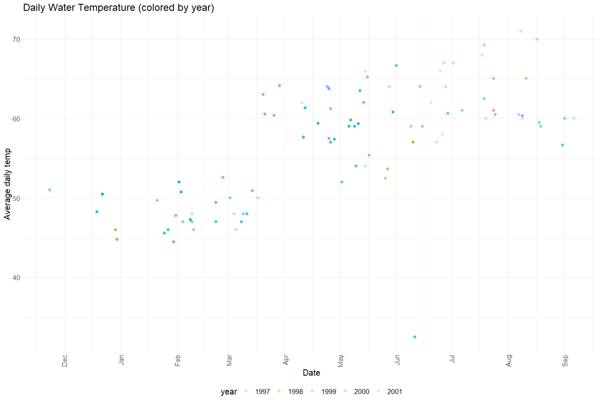
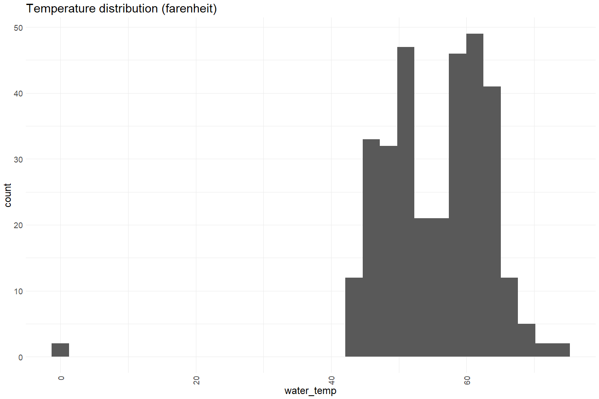
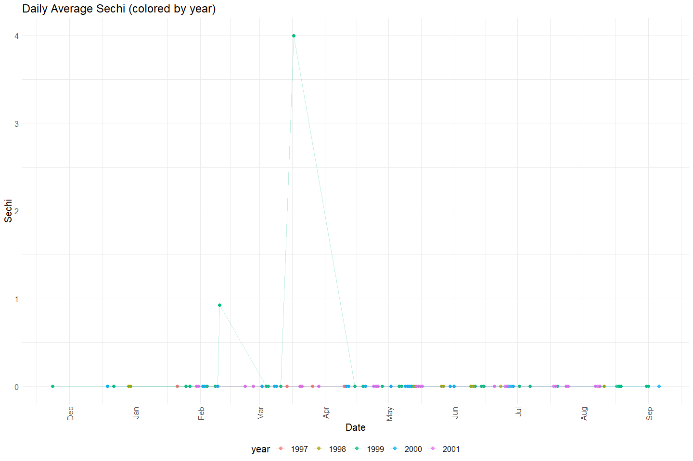
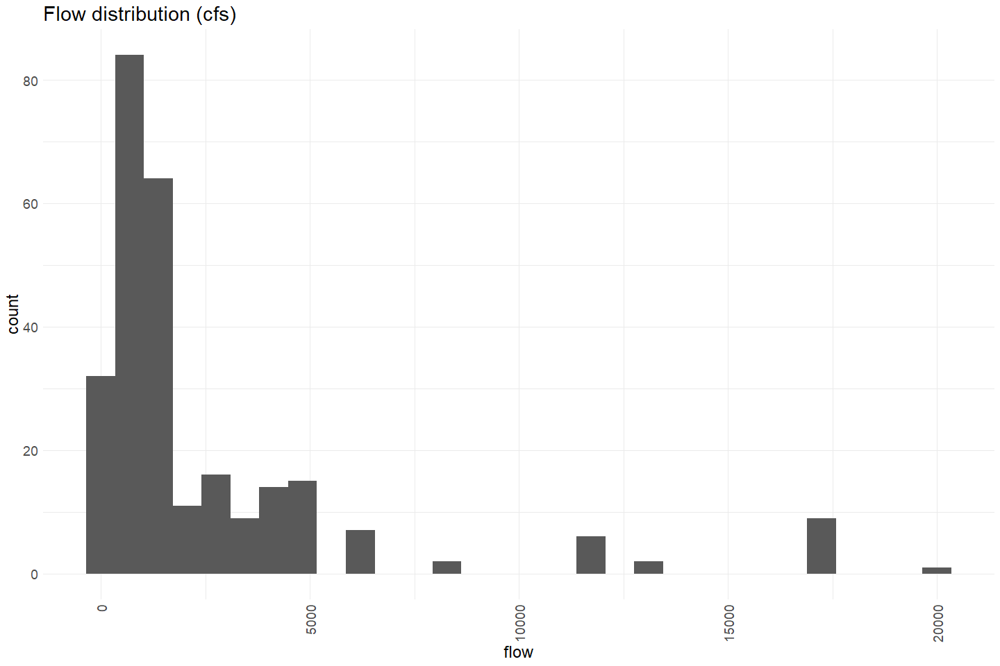
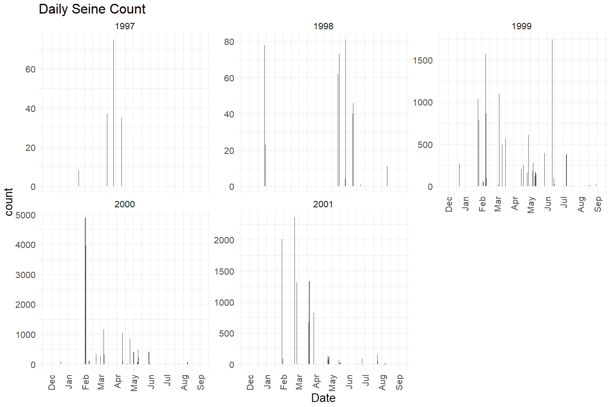
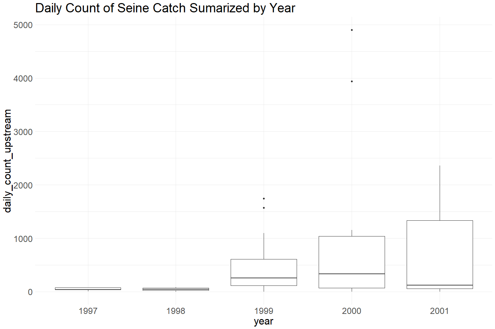

Feather River Seine Data 1997 - 2001 QC
================
Erin Cain
9/29/2021

# Feather River Seine and Snorkel Data

## Description of Monitoring Data

Feather River Seine data 1997 - 2021. This dataset contains less
attributes than the more recent data.

? TODO elaborate

**Timeframe:** 1997 - 2001

**Seine Season:** ? TODO

**Completeness of Record throughout timeframe:**

**Sampling Location:** Feather River

**Data Contact:** [Casey Campos](mailto:Casey.Campos@water.ca.gov)

Any additional info?

## Access Cloud Data

``` r
# Run Sys.setenv() to specify GCS_AUTH_FILE and GCS_DEFAULT_BUCKET before running 
# getwd() to see how to specify paths 
# Open object from google cloud storage
# Set your authentication using gcs_auth
gcs_auth(json_file = Sys.getenv("GCS_AUTH_FILE"))
# Set global bucket 
gcs_global_bucket(bucket = Sys.getenv("GCS_DEFAULT_BUCKET"))
gcs_list_objects()
# git data and save as xlsx
gcs_get_object(object_name = 
                 "juvenile-rearing-monitoring/seine-and-snorkel-data/feather-river/data-raw/all_seine_1997-2001.xlsx",
               bucket = gcs_get_global_bucket(),
               saveToDisk = "raw_seine_1997-2001.xlsx",
               overwrite = TRUE)
```

Read in data from google cloud, glimpse raw data and domain description
sheet:

``` r
# read in data to clean 
raw_seine_1997 <- read_xlsx("raw_seine_1997-2001.xlsx") %>% 
  glimpse()
```

    ## Rows: 1,756
    ## Columns: 14
    ## $ SeineID      <dbl> 297, 21, 23, 297, 297, 297, 297, 297, 297, 297, 297, 297,~
    ## $ Date         <dttm> 1997-01-21, 1997-01-21, 1997-01-21, 1997-01-21, 1997-01-~
    ## $ Year         <chr> "1997", "1997", "1997", "1997", "1997", "1997", "1997", "~
    ## $ Month        <chr> "01", "01", "01", "01", "01", "01", "01", "01", "01", "01~
    ## $ Location     <chr> "Trailer Park Riffle", "Trailer Park Riffle", "Trailer Pa~
    ## $ StationCode  <chr> "FR064.3", "FR064.3E", "FR064.3E", "FR064.3", "FR064.3", ~
    ## $ Time         <dttm> 1899-12-31 14:00:00, 1899-12-31 13:00:00, 1899-12-31 13:~
    ## $ WaterTemp    <dbl> 49.0, 50.0, 50.0, 49.0, 49.0, 49.0, 49.0, 49.0, 49.0, 49.~
    ## $ Flow         <dbl> NA, NA, NA, NA, NA, NA, NA, NA, NA, NA, NA, NA, NA, NA, N~
    ## $ HUCsubstrate <dbl> NA, NA, NA, NA, NA, NA, NA, NA, NA, NA, NA, NA, NA, NA, N~
    ## $ HUCcover     <chr> NA, NA, NA, NA, NA, NA, NA, NA, NA, NA, NA, NA, NA, NA, N~
    ## $ HUCunit      <chr> "P", NA, NA, "P", "P", "P", "P", "P", "P", "P", "P", "P",~
    ## $ SpeciesCode  <chr> "HH", "CHNF", "CHNF", "FHM", "MIN", "MQF", "PRS", "SASQ",~
    ## $ TotalCatch   <dbl> 7, 2, 3, 1, 9, 1, 2, 2, 2, 5, 24, 3, 9, 2, 2, 3, 6, 10, 1~

## Data transformations

``` r
cleaner_seine_data <- raw_seine_1997 %>%
  janitor::clean_names() %>% 
  filter(species_code %in% c("CHN", "CHNF", "CHNFT", "CHNI",
                        "CHNL", "CHNS", "CHNST", "CHNT","CHNW")) %>%
  rename("cover" = hu_ccover, 
         "substrate" = hu_csubstrate, 
         "HUC_stream_feature" = hu_cunit,
         "count" = total_catch) %>% 
  mutate(time = hms::as_hms(time),
         seine_id = as.character(seine_id), 
         substrate = as.character(substrate)) %>%
  select(-year, -month, -species_code) %>% 
  glimpse()
```

    ## Rows: 348
    ## Columns: 11
    ## $ seine_id           <chr> "21", "23", "297", "20", "16", "17", "18", "19", "1~
    ## $ date               <dttm> 1997-01-21, 1997-01-21, 1997-01-21, 1997-03-14, 19~
    ## $ location           <chr> "Trailer Park Riffle", "Trailer Park Riffle", "Trai~
    ## $ station_code       <chr> "FR064.3E", "FR064.3E", "FR064.3", "FR059R", "FR066~
    ## $ time               <time> 13:00:00, 13:15:00, 14:00:00, 15:20:00, 12:07:00, ~
    ## $ water_temp         <dbl> 50.0, 50.0, 49.0, 52.5, 50.0, 50.0, 50.0, 52.0, 62.~
    ## $ flow               <dbl> NA, NA, NA, NA, NA, NA, NA, NA, NA, NA, NA, NA, NA,~
    ## $ substrate          <chr> NA, NA, NA, NA, NA, NA, NA, "1", NA, "3", NA, NA, N~
    ## $ cover              <chr> NA, NA, NA, NA, NA, NA, NA, NA, NA, NA, NA, NA, NA,~
    ## $ HUC_stream_feature <chr> NA, NA, "P", "P", NA, "P", NA, "P", "P", "P", "P", ~
    ## $ count              <dbl> 2, 3, 3, 9, 2, 10, 9, 7, 6, 4, 19, 23, 23, 35, 30, ~

## Explore Numeric Variables:

``` r
cleaner_seine_data %>% select_if(is.numeric) %>% colnames()
```

    ## [1] "water_temp" "flow"       "count"

### Variable: `water_temp`

**Plotting water\_temp over Period of Record**

Daily average water temperature measures appear to be lower in Dec -
March and tehn increase April - September. They appear to typically
range from 44 - 72.

``` r
cleaner_seine_data %>% 
  group_by(date = as.Date(date)) %>%
  mutate(avg_temp = mean(water_temp)) %>%
  ungroup() %>%
  mutate(year = as.factor(year(date)),
         fake_year = if_else(month(date) %in% 10:12, 1900, 1901),
         fake_date = as.Date(paste0(fake_year,"-", month(date), "-", day(date)))) %>%
  ggplot(aes(x = fake_date, y = avg_temp, color = year)) + 
  geom_point(alpha = .25, size = 2) + 
  # facet_wrap(~year(date), scales = "free") + 
  scale_x_date(labels = date_format("%b"), date_breaks = "1 month") + 
  theme_minimal() + 
  theme(text = element_text(size = 15),
        axis.text.x = element_text(angle = 90, vjust = 0.5, hjust=1),
        legend.position = "bottom") + 
  labs(title = "Daily Water Temperature (colored by year)",
       y = "Average daily temp", 
       x = "Date")  
```

<!-- -->

``` r
cleaner_seine_data %>%  
  ggplot(aes(x = water_temp)) + 
  geom_histogram() + 
  scale_x_continuous() +
  theme_minimal() +
  labs(title = "Temperature distribution (farenheit)") +  
  theme(text = element_text(size = 18),
        axis.text.x = element_text(angle = 90, vjust = 0.5, hjust=1)) 
```

    ## `stat_bin()` using `bins = 30`. Pick better value with `binwidth`.

<!-- -->

**Numeric Summary of water\_temp over Period of Record**

``` r
summary(cleaner_seine_data$water_temp)
```

    ##    Min. 1st Qu.  Median    Mean 3rd Qu.    Max.    NA's 
    ##    0.00   50.00   57.00   55.44   61.00   74.00      23

### Variable: `flow`

**Plotting flow over Period of Record**

``` r
cleaner_seine_data %>% 
  group_by(date = as.Date(date)) %>%
  mutate(avg_flow = mean(flow)) %>%
  ungroup() %>%
  mutate(year = as.factor(year(date)),
         fake_year = if_else(month(date) %in% 10:12, 1900, 1901),
         fake_date = as.Date(paste0(fake_year,"-", month(date), "-", day(date)))) %>%
  ggplot(aes(x = fake_date, y = avg_flow, color = year)) + 
  geom_point(alpha = .75, size = 2) + 
  geom_line(alpha = .25) + 
  # facet_wrap(~year(date), scales = "free") + 
  scale_x_date(labels = date_format("%b"), date_breaks = "1 month") + 
  theme_minimal() + 
  theme(text = element_text(size = 15),
        axis.text.x = element_text(angle = 90, vjust = 0.5, hjust=1),
        legend.position = "bottom") + 
  labs(title = "Daily Average Flow (colored by year)",
       y = "Flow (CFS)", 
       x = "Date")  
```

<!-- -->

Flow measurements are not taken frequently. It looks like about \~ 15 -
30 days out of the year.

``` r
cleaner_seine_data %>%  
  ggplot(aes(x = flow)) + 
  geom_histogram() + 
  scale_x_continuous() +
  theme_minimal() +
  labs(title = "Flow distribution (cfs)") +  
  theme(text = element_text(size = 18),
        axis.text.x = element_text(angle = 90, vjust = 0.5, hjust=1)) 
```

    ## `stat_bin()` using `bins = 30`. Pick better value with `binwidth`.

<!-- -->

**Numeric Summary of flow over Period of Record**

``` r
summary(cleaner_seine_data$flow)
```

    ##    Min. 1st Qu.  Median    Mean 3rd Qu.    Max.    NA's 
    ##       0     600    1700    2612    3000   20000      76

**NA and Unknown Values**

Provide a stat on NA or unknown values

### Variable: `count`

**Plotting Count over Period of Record**

``` r
cleaner_seine_data %>% 
  mutate(year = as.factor(year(date)),
         fake_year = if_else(month(date) %in% 10:12, 1900, 1901),
         fake_date = as.Date(paste0(fake_year,"-", month(date), "-", day(date)))) %>%
  ggplot(aes(x = fake_date, y = count)) + 
  geom_col() + 
  facet_wrap(~year(date), scales = "free") + 
  scale_x_date(labels = date_format("%b"), date_breaks = "1 month") + 
  theme_minimal() + 
  theme(text = element_text(size = 20),
        axis.text.x = element_text(angle = 90, vjust = 0.5, hjust=1)) + 
  labs(title = "Daily Seine Count", 
       x = "Date")  
```

<!-- -->

``` r
cleaner_seine_data %>% group_by(date) %>%
  mutate(daily_count_upstream = sum(count)) %>%
  mutate(year = as.factor(year(date))) %>% 
  ungroup() %>%
  ggplot(aes(x = year, y = daily_count_upstream)) + 
  geom_boxplot() + 
  theme_minimal() +
  theme(text = element_text(size = 23)) + 
  labs(title = "Daily Count of Seine Catch Sumarized by Year") 
```

<!-- -->

There is no data on runs (or fork length) so we cannot differentiate
spring from other runs.

**Numeric Summary of Count over Period of Record**

``` r
# daily numeric summary 
cleaner_seine_data %>% group_by(date) %>%
  summarise(daily_count = sum(count, na.rm = T)) %>%
  pull(daily_count) %>%
  summary()
```

    ##    Min. 1st Qu.  Median    Mean 3rd Qu.    Max. 
    ##     1.0    12.0    81.0   375.3   378.0  4900.0

**NA and Unknown Values**

-   0 % of values in the `count` column are NA. However, there are
    clearly gaps in data.

## Explore Categorical variables:

``` r
cleaner_seine_data %>% select_if(is.character) %>% colnames()
```

    ## [1] "seine_id"           "location"           "station_code"      
    ## [4] "substrate"          "cover"              "HUC_stream_feature"

### Variable: `seine_id`

TODO join seineData onto Seine Id can be used to get additional
information describing seine equipment. (Information on crew, depth,
temp, ect…)

**NA and Unknown Values**

-   0 % of values in the `seine_id` column are NA.

### Variable: `location`

``` r
table(cleaner_seine_data$location)
```

    ## 
    ##         1/4 Mile Downstream of Yuba City Boat Ramp 
    ##                                                 12 
    ##               1/4 Mile Upstream of Big Hole Island 
    ##                                                  2 
    ##           1/4 Mile Upstream of Boyd Pump Boat Ramp 
    ##                                                  4 
    ##            1/4 Mile Upstream of Live Oak Boat Ramp 
    ##                                                 10 
    ##                  250 yards below Honcut Confluence 
    ##                                                  2 
    ##                                  Auditorium Riffle 
    ##                                                  1 
    ##                                       Bedrock Park 
    ##                                                 38 
    ##                                     Below Big Hole 
    ##                                                  3 
    ##                            Below Gridley Boat Ramp 
    ##                                                  5 
    ##                             Below Herringer Riffle 
    ##                                                  1 
    ##                              Below Junkyard Riffle 
    ##                                                  1 
    ##                                   Below Long Glide 
    ##                                                  1 
    ##                              Below Upper Herringer 
    ##                                                  1 
    ##                               bend backwater (562) 
    ##                                                  2 
    ## between bend backwater and honcutt confluence(566) 
    ##                                                  1 
    ##                                            Big Bar 
    ##                                                  1 
    ##                          Big Hole Island Boat Ramp 
    ##                                                  3 
    ##                                         Big Riffle 
    ##                                                 11 
    ##                                Boyd Pump Boat Ramp 
    ##                                                 19 
    ##                        d/s end of big hole islands 
    ##                                                  1 
    ##                    Eye Riffle - Upper Side Channel 
    ##                                                  6 
    ##                                               G-95 
    ##                                                  2 
    ##    G95 (Bar Complex btwn Big Hole Isl/Hour Riffle) 
    ##                                                 19 
    ##                                       Goose Riffle 
    ##                                                  8 
    ##                                  Gridley Boat Ramp 
    ##                                                  8 
    ##                                       Gridley Pool 
    ##                                                  2 
    ##                                     Gridley Riffle 
    ##                                                  2 
    ##                                     HATCHERY DITCH 
    ##                                                 17 
    ##                            HATCHERY DITCH - bottom 
    ##                                                  2 
    ##                            Hatchery Ditch (Bottom) 
    ##                                                  3 
    ##                              Hatchery Ditch(upper) 
    ##                                                  2 
    ##                                    Hatchery Riffle 
    ##                                                 11 
    ##                             Herringer Side Channel 
    ##                                                  1 
    ##                                  Honcut Confluence 
    ##                                                  1 
    ##                                     Hour Backwater 
    ##                                                  2 
    ##                  Hour Bar Side Channel (alternate) 
    ##                                                  3 
    ##                                         Hour Glide 
    ##                                                  5 
    ##                                    Junkyard Riffle 
    ##                                                  1 
    ##                                 Live Oak Boat Ramp 
    ##                                                 25 
    ##                               Lower Hatchery ditch 
    ##                                                  1 
    ##                                   Lower MacFarland 
    ##                                                  1 
    ##                                         MacFarland 
    ##                                                  6 
    ##                                     Mathews Riffle 
    ##                                                  1 
    ##                                        Moe's Ditch 
    ##                                                  3 
    ##                                        MOE'S DITCH 
    ##                                                  7 
    ##                Montgomery Street (River Bend Park) 
    ##                                                 22 
    ##                                 Palm avenue access 
    ##                                                  1 
    ##                                  Robinson's Riffle 
    ##                                                  2 
    ##                                     Shallow Riffle 
    ##                                                  1 
    ##                              Shallow Riffle  (523) 
    ##                                                  1 
    ##                                       Steep Riffle 
    ##                                                 10 
    ##                               Thermalito Boat Ramp 
    ##                                                 18 
    ##                                Trailer Park Riffle 
    ##                                                  4 
    ##    u/s end of bar complex, d/s of big hole islands 
    ##                                                  1 
    ##                                       Vance Avenue 
    ##                                                  2 
    ##                             Vance Avenue Boat Ramp 
    ##                                                  6 
    ##                                Yuba City Boat Ramp 
    ##                                                 22

Fix inconsistencies with spelling, capitalization, and abbreviations.

``` r
format_site_name <- function(string) {
  clean <- str_replace_all(string, "1/2", "half") %>%
    str_replace_all("1/4", "quarter") %>%
    str_replace_all("S.C.", "SC") %>%
    str_replace_all("'", "") %>%
    str_replace_all("G-95", "G95") %>% 
    str_replace_all("[^[:alnum:]]", " ") %>% 
    trimws() %>% 
    stringr::str_squish() %>%
    stringr::str_to_title()
}

cleaner_seine_data$location <- format_site_name(cleaner_seine_data$location)
table(cleaner_seine_data$location)
```

    ## 
    ##                 250 Yards Below Honcut Confluence 
    ##                                                 2 
    ##                                 Auditorium Riffle 
    ##                                                 1 
    ##                                      Bedrock Park 
    ##                                                38 
    ##                                    Below Big Hole 
    ##                                                 3 
    ##                           Below Gridley Boat Ramp 
    ##                                                 5 
    ##                            Below Herringer Riffle 
    ##                                                 1 
    ##                             Below Junkyard Riffle 
    ##                                                 1 
    ##                                  Below Long Glide 
    ##                                                 1 
    ##                             Below Upper Herringer 
    ##                                                 1 
    ##                                Bend Backwater 562 
    ##                                                 2 
    ## Between Bend Backwater And Honcutt Confluence 566 
    ##                                                 1 
    ##                                           Big Bar 
    ##                                                 1 
    ##                         Big Hole Island Boat Ramp 
    ##                                                 3 
    ##                                        Big Riffle 
    ##                                                11 
    ##                               Boyd Pump Boat Ramp 
    ##                                                19 
    ##                       D S End Of Big Hole Islands 
    ##                                                 1 
    ##                     Eye Riffle Upper Side Channel 
    ##                                                 6 
    ##                                               G95 
    ##                                                 2 
    ##     G95 Bar Complex Btwn Big Hole Isl Hour Riffle 
    ##                                                19 
    ##                                      Goose Riffle 
    ##                                                 8 
    ##                                 Gridley Boat Ramp 
    ##                                                 8 
    ##                                      Gridley Pool 
    ##                                                 2 
    ##                                    Gridley Riffle 
    ##                                                 2 
    ##                                    Hatchery Ditch 
    ##                                                17 
    ##                             Hatchery Ditch Bottom 
    ##                                                 5 
    ##                              Hatchery Ditch Upper 
    ##                                                 2 
    ##                                   Hatchery Riffle 
    ##                                                11 
    ##                            Herringer Side Channel 
    ##                                                 1 
    ##                                 Honcut Confluence 
    ##                                                 1 
    ##                                    Hour Backwater 
    ##                                                 2 
    ##                   Hour Bar Side Channel Alternate 
    ##                                                 3 
    ##                                        Hour Glide 
    ##                                                 5 
    ##                                   Junkyard Riffle 
    ##                                                 1 
    ##                                Live Oak Boat Ramp 
    ##                                                25 
    ##                              Lower Hatchery Ditch 
    ##                                                 1 
    ##                                  Lower Macfarland 
    ##                                                 1 
    ##                                        Macfarland 
    ##                                                 6 
    ##                                    Mathews Riffle 
    ##                                                 1 
    ##                                        Moes Ditch 
    ##                                                10 
    ##                 Montgomery Street River Bend Park 
    ##                                                22 
    ##                                Palm Avenue Access 
    ##                                                 1 
    ##    Quarter Mile Downstream Of Yuba City Boat Ramp 
    ##                                                12 
    ##          Quarter Mile Upstream Of Big Hole Island 
    ##                                                 2 
    ##      Quarter Mile Upstream Of Boyd Pump Boat Ramp 
    ##                                                 4 
    ##       Quarter Mile Upstream Of Live Oak Boat Ramp 
    ##                                                10 
    ##                                  Robinsons Riffle 
    ##                                                 2 
    ##                                    Shallow Riffle 
    ##                                                 1 
    ##                                Shallow Riffle 523 
    ##                                                 1 
    ##                                      Steep Riffle 
    ##                                                10 
    ##                              Thermalito Boat Ramp 
    ##                                                18 
    ##                               Trailer Park Riffle 
    ##                                                 4 
    ##    U S End Of Bar Complex D S Of Big Hole Islands 
    ##                                                 1 
    ##                                      Vance Avenue 
    ##                                                 2 
    ##                            Vance Avenue Boat Ramp 
    ##                                                 6 
    ##                               Yuba City Boat Ramp 
    ##                                                22

**NA and Unknown Values**

-   0 % of values in the `location` column are NA.

### Variable: `station_code`

TODO add to this

``` r
table(cleaner_seine_data$station_code)
```

    ## 
    ##   FR0231   FR023R   FR028R   FR028W   FR042R   FR042W  FR043.9   FR044. 
    ##        4       19       22       12       25       10        2        1 
    ##  FR044.3  FR045.4  FR045.7    FR046    FR047  FR048.5    FR049  FR049.3 
    ##        4        1        1        1        2        2        5        3 
    ##  FR049.4   FR050R  FR051.9 FR052.75  FR053.5 FR053.85 FR054.65  FR055.2 
    ##        1        8        1        6        1       11        8        1 
    ##  FR055.7  FR056.3  FR056.6 FR057.2W  FR057.4 FR057.85   FR057W  FR058.4 
    ##        3        2        5        4        4        4       17        2 
    ##  FR058.7    FR059   FR059R  FR060.3    FR061    FR062  FR064.1  FR064.3 
    ##        3        5       18        6       10        2        1        1 
    ## FR064.3E  FR064.4  FR065.8   FR065E FR066.5S FR066.6N  FR066.7   FR066S 
    ##        3        1        8       22        3        3       11       30 
    ## FRO66.4N   FRO66N 
    ##       10       19

**NA and Unknown Values**

-   0 % of values in the `station_code` column are NA.

### Variable: `substrate`

TODO add to this

``` r
table(cleaner_seine_data$substrate)
```

    ## 
    ##   1   2   3   4   5 
    ## 121  93  60   7  42

**NA and Unknown Values**

-   7.2 % of values in the `substrate` column are NA.

### Variable: `cover`

TODO add to this

``` r
table(cleaner_seine_data$cover)
```

    ## 
    ##   A   B  BD   C   D  DE   E 
    ## 197   6   5   1   8   1  23

**NA and Unknown Values**

-   30.7 % of values in the `cover` column are NA.

### Variable: `HUC_strean_feature`

TODO add to this

``` r
table(cleaner_seine_data$HUC_strean_feature)
```

    ## < table of extent 0 >

**NA and Unknown Values**

-   0 % of values in the `HUC_strean_feature` column are NA.

## Summary of identified issues

-   There is no data on runs (or fork length) so we cannot differentiate
    spring from other runs.
-   Sampling does not occur that frequently each year

## Save cleaned data back to google cloud

``` r
# Write to google cloud 
# Name file [watershed]_[data type].csv
```
