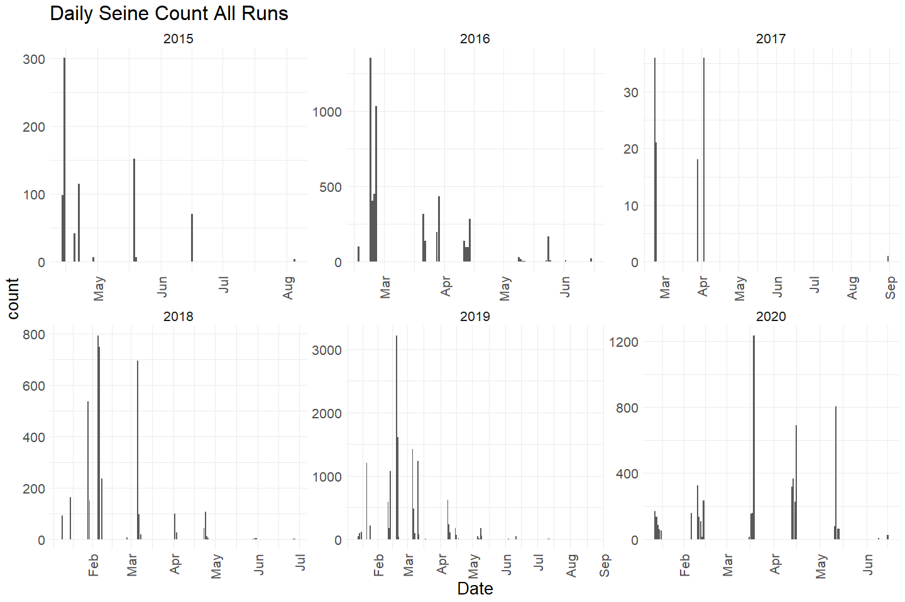
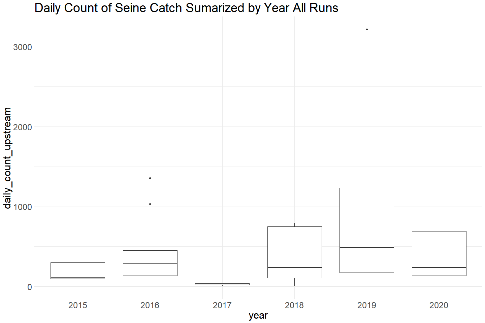
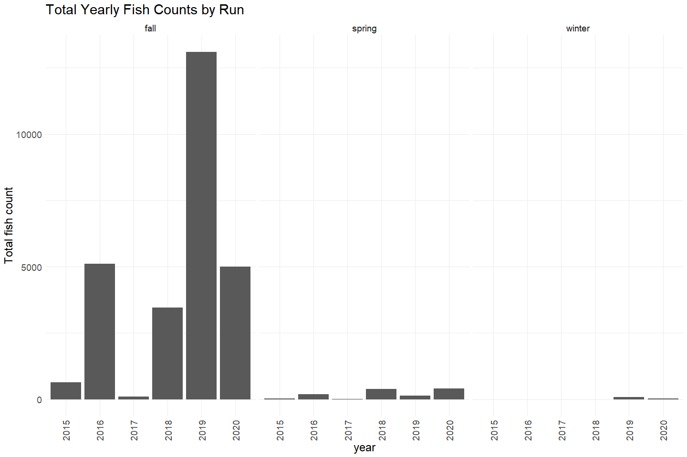
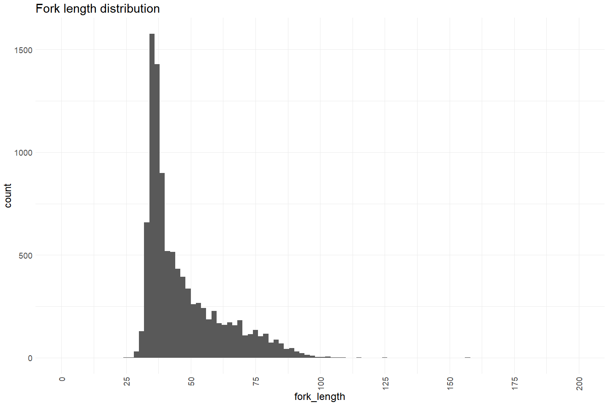
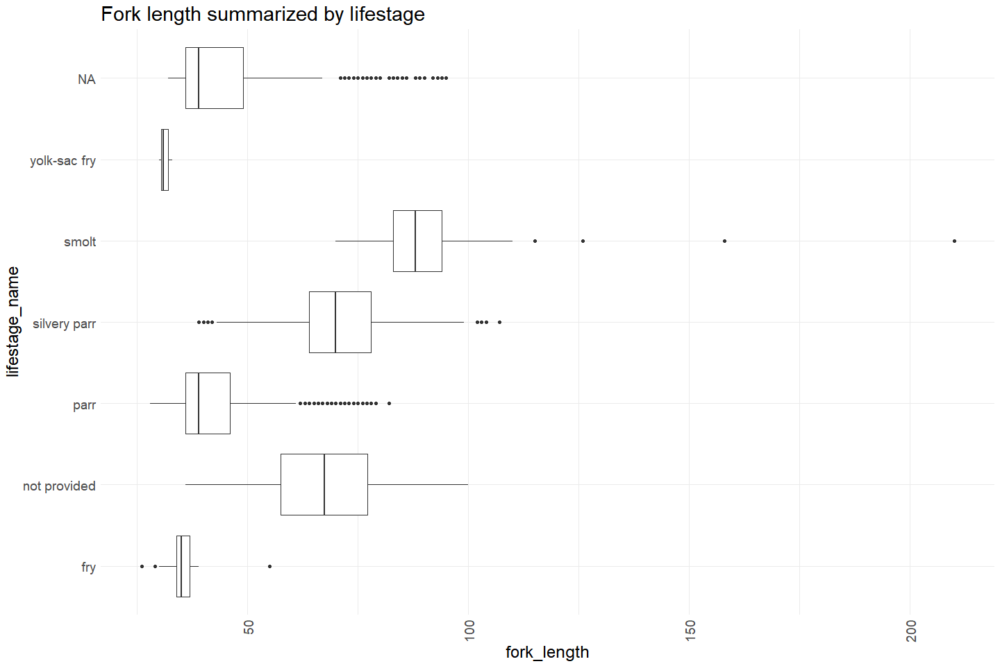

Feather River Seine Data 2015 - 2021 QC
================
Erin Cain
9/29/2021

# Feather River Seine and Snorkel Data

## Description of Monitoring Data

Feather River Seine data 2015 - 2021. All new data will be stored in
this format in the current access database.

**Timeframe:** 2015 - 2021

**Seine Season:** ? TODO

**Completeness of Record throughout timeframe:**

Sampling occurred every year between 2015 - 2021

**Sampling Location:** Feather River

**Data Contact:** [Casey Campos](mailto:Casey.Campos@water.ca.gov)

Any additional info?

## Access Cloud Data

``` r
# Run Sys.setenv() to specify GCS_AUTH_FILE and GCS_DEFAULT_BUCKET before running 
# getwd() to see how to specify paths 
# Open object from google cloud storage
# Set your authentication using gcs_auth
gcs_auth(json_file = Sys.getenv("GCS_AUTH_FILE"))
# Set global bucket 
gcs_global_bucket(bucket = Sys.getenv("GCS_DEFAULT_BUCKET"))
gcs_list_objects()
# git data and save as xlsx
gcs_get_object(object_name = 
                 "juvenile-rearing-monitoring/seine-and-snorkel-data/feather-river/data-raw/all_fields_seine_2008-2014.xlsx",
               bucket = gcs_get_global_bucket(),
               saveToDisk = "raw_seine_2008-2014.xlsx",
               overwrite = TRUE)

gcs_get_object(object_name = 
                 "juvenile-rearing-monitoring/seine-and-snorkel-data/feather-river/data-raw/all_fields_seine_2014-2021.xlsx",
               bucket = gcs_get_global_bucket(),
               saveToDisk = "raw_seine_2015-2021.xlsx",
               overwrite = TRUE)
```

Read in data from google cloud, glimpse raw data:

``` r
# read in data to clean 
raw_seine_2015 <- read_xlsx("raw_seine_2015-2021.xlsx") %>% glimpse()
```

    ## Rows: 19,403
    ## Columns: 52
    ## $ `SAMPLE ID`              <dbl> 372, 372, 372, 372, 372, 372, 372, 372, 372, ~
    ## $ Species                  <chr> "CHNF", "CHNF", "CHNF", "CHNF", "CHNF", "CHNF~
    ## $ Count                    <dbl> 1, 1, 1, 1, 1, 1, 1, 1, 1, 1, 1, 1, 1, 1, 1, ~
    ## $ `Fork Length`            <dbl> 47, 58, 62, 50, 65, 60, 59, 60, 67, 59, 54, 8~
    ## $ `Total Length`           <lgl> NA, NA, NA, NA, NA, NA, NA, NA, NA, NA, NA, N~
    ## $ `Salmonid Life Stage`    <dbl> 7, 7, 7, 7, 7, 7, 7, 7, 7, 7, 7, 7, 7, 7, 7, ~
    ## $ id                       <dbl> 6225, 6226, 6227, 6228, 6229, 6230, 6231, 623~
    ## $ Dead                     <lgl> FALSE, FALSE, FALSE, FALSE, FALSE, FALSE, FAL~
    ## $ `Weight (g)`             <chr> "1.1", "2", "2.3", "1.3", "2.9", "2.4", "2", ~
    ## $ `Catch TBL_Comments`     <lgl> NA, NA, NA, NA, NA, NA, NA, NA, NA, NA, NA, N~
    ## $ `Site ID`                <dbl> 59, 59, 59, 59, 59, 59, 59, 59, 59, 59, 59, 5~
    ## $ Date                     <dttm> 2015-05-19, 2015-05-19, 2015-05-19, 2015-05-~
    ## $ Time                     <dttm> 1899-12-31 10:30:00, 1899-12-31 10:30:00, 18~
    ## $ GearCode                 <dbl> 3, 3, 3, 3, 3, 3, 3, 3, 3, 3, 3, 3, 3, 3, 3, ~
    ## $ ConditionCode            <dbl> 4, 4, 4, 4, 4, 4, 4, 4, 4, 4, 4, 4, 4, 4, 4, ~
    ## $ Temperature              <dbl> NA, NA, NA, NA, NA, NA, NA, NA, NA, NA, NA, N~
    ## $ WeatherCode              <chr> "CLR", "CLR", "CLR", "CLR", "CLR", "CLR", "CL~
    ## $ Flow                     <lgl> NA, NA, NA, NA, NA, NA, NA, NA, NA, NA, NA, N~
    ## $ `EFBS Length`            <lgl> NA, NA, NA, NA, NA, NA, NA, NA, NA, NA, NA, N~
    ## $ `EFBS Width`             <lgl> NA, NA, NA, NA, NA, NA, NA, NA, NA, NA, NA, N~
    ## $ `EFBS Depth (Top)`       <lgl> NA, NA, NA, NA, NA, NA, NA, NA, NA, NA, NA, N~
    ## $ `EFBS Depth (Bottom)`    <lgl> NA, NA, NA, NA, NA, NA, NA, NA, NA, NA, NA, N~
    ## $ `EFBS Velocity (Top)`    <lgl> NA, NA, NA, NA, NA, NA, NA, NA, NA, NA, NA, N~
    ## $ `EFBS Velocity (Bottom)` <lgl> NA, NA, NA, NA, NA, NA, NA, NA, NA, NA, NA, N~
    ## $ `BS Start Length`        <dbl> NA, NA, NA, NA, NA, NA, NA, NA, NA, NA, NA, N~
    ## $ `BS Close Width`         <lgl> NA, NA, NA, NA, NA, NA, NA, NA, NA, NA, NA, N~
    ## $ `BS Distance Out`        <dbl> NA, NA, NA, NA, NA, NA, NA, NA, NA, NA, NA, N~
    ## $ `BS Depth (1/2)`         <dbl> NA, NA, NA, NA, NA, NA, NA, NA, NA, NA, NA, N~
    ## $ `BS Depth (Full)`        <lgl> NA, NA, NA, NA, NA, NA, NA, NA, NA, NA, NA, N~
    ## $ `BS Velocity (1/2)`      <lgl> NA, NA, NA, NA, NA, NA, NA, NA, NA, NA, NA, N~
    ## $ `BS Velocity (Full)`     <lgl> NA, NA, NA, NA, NA, NA, NA, NA, NA, NA, NA, N~
    ## $ `Substrate 1`            <dbl> 1, 1, 1, 1, 1, 1, 1, 1, 1, 1, 1, 1, 1, 1, 1, ~
    ## $ `Substrate 2`            <dbl> 2, 2, 2, 2, 2, 2, 2, 2, 2, 2, 2, 2, 2, 2, 2, ~
    ## $ `Substrate 3`            <dbl> 3, 3, 3, 3, 3, 3, 3, 3, 3, 3, 3, 3, 3, 3, 3, ~
    ## $ `Substrate 4`            <lgl> NA, NA, NA, NA, NA, NA, NA, NA, NA, NA, NA, N~
    ## $ `Substrate 5`            <lgl> NA, NA, NA, NA, NA, NA, NA, NA, NA, NA, NA, N~
    ## $ `Cover 1`                <chr> "B", "B", "B", "B", "B", "B", "B", "B", "B", ~
    ## $ `Cover 2`                <chr> "D", "D", "D", "D", "D", "D", "D", "D", "D", ~
    ## $ `Cover 3`                <chr> "C", "C", "C", "C", "C", "C", "C", "C", "C", ~
    ## $ `Cover 4`                <chr> "E", "E", "E", "E", "E", "E", "E", "E", "E", ~
    ## $ `Cover 5`                <chr> "F", "F", "F", "F", "F", "F", "F", "F", "F", ~
    ## $ `Cover 6`                <lgl> NA, NA, NA, NA, NA, NA, NA, NA, NA, NA, NA, N~
    ## $ RPGRu                    <chr> "GRRU", "GRRU", "GRRU", "GRRU", "GRRU", "GRRU~
    ## $ GearHeight               <lgl> NA, NA, NA, NA, NA, NA, NA, NA, NA, NA, NA, N~
    ## $ `Dissolved Oxygen`       <lgl> NA, NA, NA, NA, NA, NA, NA, NA, NA, NA, NA, N~
    ## $ EC                       <lgl> NA, NA, NA, NA, NA, NA, NA, NA, NA, NA, NA, N~
    ## $ OBJECTID                 <dbl> 59, 59, 59, 59, 59, 59, 59, 59, 59, 59, 59, 5~
    ## $ site_name                <chr> "Hatchery Ditch", "Hatchery Ditch", "Hatchery~
    ## $ gear_type                <chr> "SEIN", "SEIN", "SEIN", "SEIN", "SEIN", "SEIN~
    ## $ `UTM Easting`            <dbl> -121.5588, -121.5588, -121.5588, -121.5588, -~
    ## $ `UTM Northing`           <dbl> 39.51619, 39.51619, 39.51619, 39.51619, 39.51~
    ## $ Location_LU_Channel      <chr> "LFC", "LFC", "LFC", "LFC", "LFC", "LFC", "LF~

## Data transformations

``` r
# Snake case, 
# Columns are appropriate types
# Remove redundant columns
cleaner_seine_data <- raw_seine_2015 %>% 
  janitor::clean_names() %>% 
  rename("bs_depth_half" = bs_depth_1_2, 
         "lifestage" = salmonid_life_stage,
         "latitude" = ) %>%
  filter(species %in% c("CHN", "CHNF", "CHNFT", "CHNI",
                        "CHNL", "CHNS", "CHNST", "CHNT","CHNW")) %>%
  mutate(date = as.Date(date),
         time = hms::as_hms(time),
         total_length = as.numeric(total_length),
         weight_g = as.numeric(weight_g),
         sample_id = as.character(sample_id),
         id = as.character(id),
         gear_code = as.character(gear_code),
         condition_code = as.character(condition_code),
         lifestage = as.character(lifestage),
         substrate_1 = as.character(substrate_1), # Should I change these to the actual cover type ex: fine_substrate T/F values?
         substrate_2 = as.character(substrate_2),
         substrate_3 = as.character(substrate_3),
         objectid = as.character(objectid),
         run = case_when(species %in% c("CHNF", "CHNFT") ~ "fall",
                         species %in% c("CHNS", "CHNST") ~ "spring",
                         species == "CHNW" ~ "winter",
                         species == "CHNI" ~ "inland", 
                         species %in% c("CHN", "CHNT") ~ "unknown"),
         tagged = if_else(grepl('T$', species), TRUE, FALSE)) %>% 
  select(-catch_tbl_comments, -dissolved_oxygen, -ec, -gear_height, -substrate_4, -substrate_5, -cover_6,
         -bs_velocity_full, -bs_velocity_1_2, -bs_depth_full, -species) %>% # Remove because all values are NA, species redundant
  glimpse()
```

    ## Rows: 10,100
    ## Columns: 43
    ## $ sample_id            <chr> "372", "372", "372", "372", "372", "372", "372", ~
    ## $ count                <dbl> 1, 1, 1, 1, 1, 1, 1, 1, 1, 1, 1, 1, 1, 1, 1, 1, 1~
    ## $ fork_length          <dbl> 47, 58, 62, 50, 65, 60, 59, 60, 67, 59, 54, 82, 6~
    ## $ total_length         <dbl> NA, NA, NA, NA, NA, NA, NA, NA, NA, NA, NA, NA, N~
    ## $ lifestage            <chr> "7", "7", "7", "7", "7", "7", "7", "7", "7", "7",~
    ## $ id                   <chr> "6225", "6226", "6227", "6228", "6229", "6230", "~
    ## $ dead                 <lgl> FALSE, FALSE, FALSE, FALSE, FALSE, FALSE, FALSE, ~
    ## $ weight_g             <dbl> 1.1, 2.0, 2.3, 1.3, 2.9, 2.4, 2.0, 2.5, 3.4, 2.3,~
    ## $ site_id              <dbl> 59, 59, 59, 59, 59, 59, 59, 59, 59, 59, 59, 59, 5~
    ## $ date                 <date> 2015-05-19, 2015-05-19, 2015-05-19, 2015-05-19, ~
    ## $ time                 <time> 10:30:00, 10:30:00, 10:30:00, 10:30:00, 10:30:00~
    ## $ gear_code            <chr> "3", "3", "3", "3", "3", "3", "3", "3", "3", "3",~
    ## $ condition_code       <chr> "4", "4", "4", "4", "4", "4", "4", "4", "4", "4",~
    ## $ temperature          <dbl> NA, NA, NA, NA, NA, NA, NA, NA, NA, NA, NA, NA, N~
    ## $ weather_code         <chr> "CLR", "CLR", "CLR", "CLR", "CLR", "CLR", "CLR", ~
    ## $ flow                 <lgl> NA, NA, NA, NA, NA, NA, NA, NA, NA, NA, NA, NA, N~
    ## $ efbs_length          <lgl> NA, NA, NA, NA, NA, NA, NA, NA, NA, NA, NA, NA, N~
    ## $ efbs_width           <lgl> NA, NA, NA, NA, NA, NA, NA, NA, NA, NA, NA, NA, N~
    ## $ efbs_depth_top       <lgl> NA, NA, NA, NA, NA, NA, NA, NA, NA, NA, NA, NA, N~
    ## $ efbs_depth_bottom    <lgl> NA, NA, NA, NA, NA, NA, NA, NA, NA, NA, NA, NA, N~
    ## $ efbs_velocity_top    <lgl> NA, NA, NA, NA, NA, NA, NA, NA, NA, NA, NA, NA, N~
    ## $ efbs_velocity_bottom <lgl> NA, NA, NA, NA, NA, NA, NA, NA, NA, NA, NA, NA, N~
    ## $ bs_start_length      <dbl> NA, NA, NA, NA, NA, NA, NA, NA, NA, NA, NA, NA, N~
    ## $ bs_close_width       <lgl> NA, NA, NA, NA, NA, NA, NA, NA, NA, NA, NA, NA, N~
    ## $ bs_distance_out      <dbl> NA, NA, NA, NA, NA, NA, NA, NA, NA, NA, NA, NA, N~
    ## $ bs_depth_half        <dbl> NA, NA, NA, NA, NA, NA, NA, NA, NA, NA, NA, NA, N~
    ## $ substrate_1          <chr> "1", "1", "1", "1", "1", "1", "1", "1", "1", "1",~
    ## $ substrate_2          <chr> "2", "2", "2", "2", "2", "2", "2", "2", "2", "2",~
    ## $ substrate_3          <chr> "3", "3", "3", "3", "3", "3", "3", "3", "3", "3",~
    ## $ cover_1              <chr> "B", "B", "B", "B", "B", "B", "B", "B", "B", "B",~
    ## $ cover_2              <chr> "D", "D", "D", "D", "D", "D", "D", "D", "D", "D",~
    ## $ cover_3              <chr> "C", "C", "C", "C", "C", "C", "C", "C", "C", "C",~
    ## $ cover_4              <chr> "E", "E", "E", "E", "E", "E", "E", "E", "E", "E",~
    ## $ cover_5              <chr> "F", "F", "F", "F", "F", "F", "F", "F", "F", "F",~
    ## $ rpg_ru               <chr> "GRRU", "GRRU", "GRRU", "GRRU", "GRRU", "GRRU", "~
    ## $ objectid             <chr> "59", "59", "59", "59", "59", "59", "59", "59", "~
    ## $ site_name            <chr> "Hatchery Ditch", "Hatchery Ditch", "Hatchery Dit~
    ## $ gear_type            <chr> "SEIN", "SEIN", "SEIN", "SEIN", "SEIN", "SEIN", "~
    ## $ utm_easting          <dbl> -121.5588, -121.5588, -121.5588, -121.5588, -121.~
    ## $ utm_northing         <dbl> 39.51619, 39.51619, 39.51619, 39.51619, 39.51619,~
    ## $ location_lu_channel  <chr> "LFC", "LFC", "LFC", "LFC", "LFC", "LFC", "LFC", ~
    ## $ run                  <chr> "fall", "fall", "fall", "fall", "fall", "fall", "~
    ## $ tagged               <lgl> FALSE, FALSE, FALSE, FALSE, FALSE, FALSE, FALSE, ~

``` r
unique(cleaner_seine_data$flow)
```

    ## [1]   NA TRUE

## Explore Numeric Variables:

``` r
# Filter clean data to show only numeric variables
cleaner_seine_data %>% select_if(is.numeric) %>% colnames()
```

    ##  [1] "count"           "fork_length"     "total_length"    "weight_g"       
    ##  [5] "site_id"         "temperature"     "bs_start_length" "bs_distance_out"
    ##  [9] "bs_depth_half"   "utm_easting"     "utm_northing"

### Variable: `count`

**Plotting Count over Period of Record**

``` r
cleaner_seine_data %>% 
  mutate(year = as.factor(year(date)),
         fake_year = if_else(month(date) %in% 10:12, 1900, 1901),
         fake_date = as.Date(paste0(fake_year,"-", month(date), "-", day(date)))) %>%
  ggplot(aes(x = fake_date, y = count)) + 
  geom_col() + 
  facet_wrap(~year(date), scales = "free") + 
  scale_x_date(labels = date_format("%b"), date_breaks = "1 month") + 
  theme_minimal() + 
  theme(text = element_text(size = 20),
        axis.text.x = element_text(angle = 90, vjust = 0.5, hjust=1)) + 
  labs(title = "Daily Seine Count All Runs", 
       x = "Date")  
```

<!-- -->

``` r
cleaner_seine_data %>% group_by(date) %>%
  mutate(daily_count_upstream = sum(count)) %>%
  mutate(year = as.factor(year(date))) %>% 
  ungroup() %>%
  ggplot(aes(x = year, y = daily_count_upstream)) + 
  geom_boxplot() + 
  theme_minimal() +
  theme(text = element_text(size = 23)) + 
  labs(title = "Daily Count of Seine Catch Sumarized by Year All Runs") 
```

<!-- -->

``` r
cleaner_seine_data  %>%
  mutate(year = as.factor(year(date))) %>%
  filter(run %in% c("fall", "spring", "winter")) %>% # Filter to only show runs that have more than one data point and are not NA/Unknown
  ggplot(aes(x = year, y = count)) + 
  geom_col() + 
  theme_minimal() +
  labs(title = "Total Yearly Fish Counts by Run",
       y = "Total fish count") + 
  theme(text = element_text(size = 18),
        axis.text.x = element_text(angle = 90, vjust = 0.5, hjust=1)) + 
  facet_grid(~run)
```

<!-- -->
Not a lot of spring run fish caught in comparison to fall run fish
caught. **Numeric Summary of Count over Period of Record**

``` r
# daily numeric summary 
cleaner_seine_data %>% group_by(date) %>%
  summarise(daily_count = sum(count, na.rm = T)) %>%
  pull(daily_count) %>%
  summary()
```

    ##    Min. 1st Qu.  Median    Mean 3rd Qu.    Max. 
    ##     1.0    17.5    96.0   244.1   230.0  3216.0

``` r
# daily numeric summary SR
cleaner_seine_data %>% 
  filter(run == "spring") %>%
  group_by(date) %>%
  summarise(daily_count = sum(count, na.rm = T)) %>%
  pull(daily_count) %>%
  summary()
```

    ##    Min. 1st Qu.  Median    Mean 3rd Qu.    Max. 
    ##    1.00    2.25    7.00   21.13   24.00  173.00

**NA and Unknown Values**

-   0 % of values in the `count` column are NA. However, there are
    clearly gaps in data.

### Variable: `fork_length`

**Plotting fork\_length over Period of Record**

``` r
cleaner_seine_data %>%  
  ggplot(aes(x = fork_length)) + 
  geom_histogram(breaks=seq(0, 200, by=2)) + 
  scale_x_continuous(breaks=seq(0, 200, by=25)) +
  theme_minimal() +
  labs(title = "Fork length distribution") + 
  theme(text = element_text(size = 18),
        axis.text.x = element_text(angle = 90, vjust = 0.5, hjust=1)) 
```

<!-- -->

``` r
lifestage_code <- c(1, 2, 3, 4, 5, 6, 7, 8)
names(lifestage_code)  <- c("yolk-sac fry", "fry", "parr", "silvery parr", "smolt", "adult", "not provided", NA)

cleaner_seine_data %>% 
  mutate(year = as.factor(year(date)),
         lifestage_name = names(lifestage_code[as.numeric(lifestage)])) %>%
  ggplot(aes(x = fork_length, y = lifestage_name)) + 
  geom_boxplot() + 
  theme_minimal() +
  labs(title = "Fork length summarized by lifestage") + 
  theme(text = element_text(size = 18),
        axis.text.x = element_text(angle = 90, vjust = 0.5, hjust=1)) 
```

<!-- -->

**Numeric Summary of fork\_length over Period of Record**

``` r
summary(cleaner_seine_data$fork_length)
```

    ##    Min. 1st Qu.  Median    Mean 3rd Qu.    Max.    NA's 
    ##   26.00   37.00   41.00   47.46   55.00  210.00     166

**NA and Unknown Values**

-   1.6 % of values in the `fork_length` column are NA.

### Variable: `total_length`

**Plotting total\_length over Period of Record**

``` r
# Make whatever plot is appropriate 
# maybe 2+ plots are appropriate
```

**Numeric Summary of total\_length over Period of Record**

``` r
# Table with summary statistics
```

**NA and Unknown Values**

Provide a stat on NA or unknown values

### Variable: `weight_g`

**Plotting weight\_g over Period of Record**

``` r
# Make whatever plot is appropriate 
# maybe 2+ plots are appropriate
```

**Numeric Summary of weight\_g over Period of Record**

``` r
# Table with summary statistics
```

**NA and Unknown Values**

Provide a stat on NA or unknown values

### Variable: `temperature`

**Plotting \[Variable\] over Period of Record**

``` r
# Make whatever plot is appropriate 
# maybe 2+ plots are appropriate
```

**Numeric Summary of \[Variable\] over Period of Record**

``` r
# Table with summary statistics
```

**NA and Unknown Values**

Provide a stat on NA or unknown values

### Variable: `bs_start_length`

**Plotting \[Variable\] over Period of Record**

``` r
# Make whatever plot is appropriate 
# maybe 2+ plots are appropriate
```

**Numeric Summary of \[Variable\] over Period of Record**

``` r
# Table with summary statistics
```

**NA and Unknown Values**

Provide a stat on NA or unknown values

### Variable: `bs_distance_out`

**Plotting \[Variable\] over Period of Record**

``` r
# Make whatever plot is appropriate 
# maybe 2+ plots are appropriate
```

**Numeric Summary of \[Variable\] over Period of Record**

``` r
# Table with summary statistics
```

**NA and Unknown Values**

Provide a stat on NA or unknown values

### Variable: `bs_depth_half`

**Plotting \[Variable\] over Period of Record**

``` r
# Make whatever plot is appropriate 
# maybe 2+ plots are appropriate
```

**Numeric Summary of \[Variable\] over Period of Record**

``` r
# Table with summary statistics
```

**NA and Unknown Values**

Provide a stat on NA or unknown values

### Variables: `utm_northing`, `utm_easting`

These are the latitude and longitude columns. **Plotting \[Variable\]
over Period of Record**

``` r
# Make whatever plot is appropriate 
# maybe 2+ plots are appropriate
```

**Numeric Summary of \[Variable\] over Period of Record**

``` r
# Table with summary statistics
```

**NA and Unknown Values**

Provide a stat on NA or unknown values

## Explore Categorical variables:

General notes: If there is an opportunity to turn yes no into boolean do
so, but not if you loose value

``` r
# Filter clean data to show only categorical variables
```

### Variable: `[name]`

``` r
#table() 
```

Fix inconsistencies with spelling, capitalization, and abbreviations.

``` r
# Fix any inconsistencies with categorical variables
```

**Create lookup rda for \[variable\] encoding:**

``` r
# Create named lookup vector
# Name rda [watershed]_[data type]_[variable_name].rda
# save rda to data/ 
```

**NA and Unknown Values**

Provide a stat on NA or unknown values

## Summary of identified issues

-   List things that are funcky/bothering us but that we don’t feel like
    should be changed without more investigation

## Save cleaned data back to google cloud

``` r
# Write to google cloud 
# Name file [watershed]_[data type].csv
```
