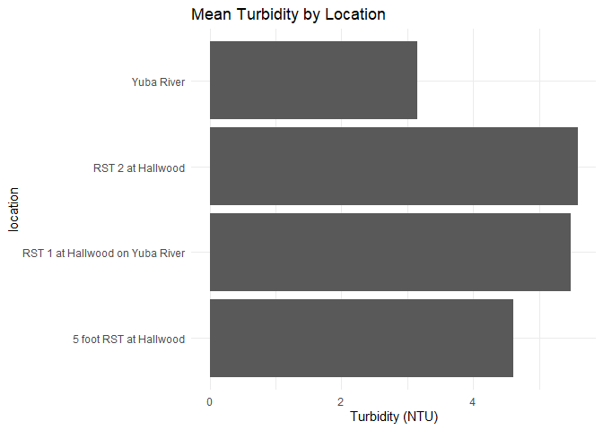
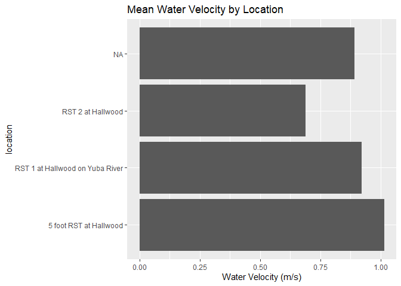
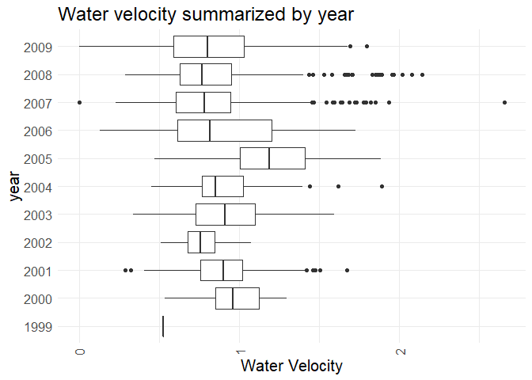
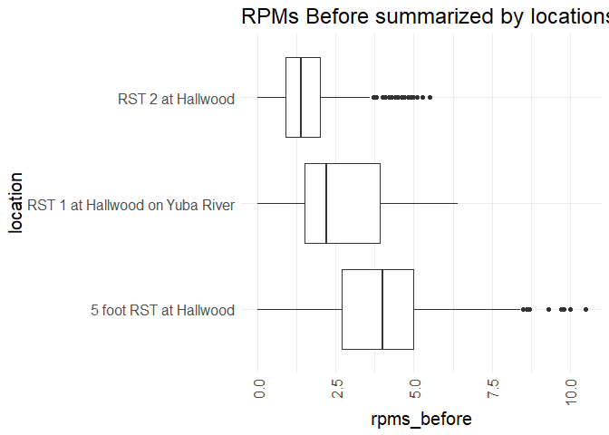
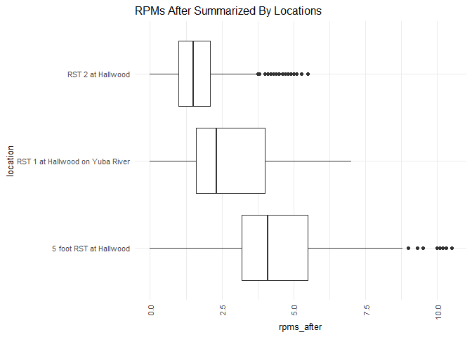
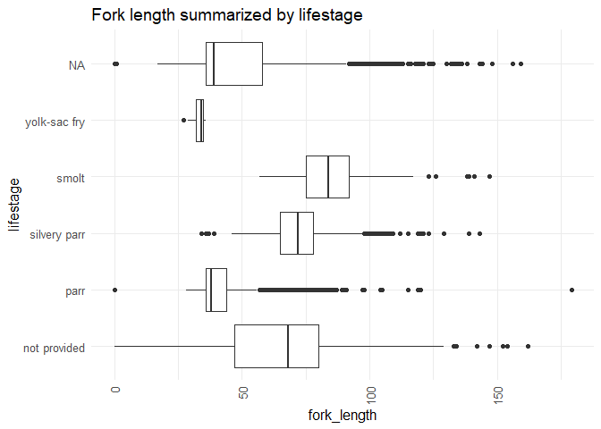

yuba-river-rst-qc-checklist
================
Inigo Peng
10/11/2021

# Yuba River RST Data

## Description of Monitoring Data:

Robyn Bilski sent the Yuba RST data in an Access Database via email. The
data is limited to just from 2000 to 2008. Initial query in the Access
Database was required before uploading it to Googlecloud. Furhter
information regarding the data could be found in the Draft CAMP screw
trap database dictionary.doc and Rotary Screws Traps Report 2007-2008.

**Timeframe:** 2000-2009

**Completeness of Record throughout timeframe:**

-   There is no longitude or latitude data for RST locations
-   Fish life stage data was only tracked from 2007-2009
-   Most of the salmon counted were fall run salmon

**Sampling Location:** Yuba River

**Data Contact:** [Robyn Bilski](Robyn.Bilski@Wildlife.ca.gov)

## Access Cloud Data

``` r
# Run Sys.setenv() to specify GCS_AUTH_FILE and GCS_DEFAULT_BUCKET before running
# Open object from google cloud storage
# Set your authentication using gcs_auth
gcs_auth(json_file = Sys.getenv("GCS_AUTH_FILE"))
# Set global bucket 
gcs_global_bucket(bucket = Sys.getenv("GCS_DEFAULT_BUCKET"))
gcs_list_objects()
# git data and save as xlsx
gcs_get_object(object_name = "rst/yuba-river/data-raw/yuba-river-rst-data.xlsx",
               bucket = gcs_get_global_bucket(),
               saveToDisk = "yuba_rst_raw.xlsx",
               overwrite = TRUE)
```

Read in data from google cloud, glimpse raw data:

``` r
raw_data = readxl::read_excel('yuba_rst_raw.xlsx', col_types = c("text","date","date","text","numeric","numeric","numeric",
                                                             "text","numeric","numeric","text","numeric","numeric","text",
                                                             "text","text","text","numeric","numeric","text","numeric",'text','numeric','numeric'))
glimpse(raw_data)
```

    ## Rows: 168,869
    ## Columns: 24
    ## $ Sample_Entry_SampleRowID <chr> "{29A956AB-0CE1-4B87-90B5-7FB70785A215}", "{2~
    ## $ SampleDate               <dttm> 2000-05-07, 2000-05-07, 2000-05-07, 2000-05-~
    ## $ SampleTime               <dttm> 1899-12-31 10:00:00, 1899-12-31 10:00:00, 18~
    ## $ MethodCode               <chr> "FSR", "FSR", "FSR", "FSR", "FSR", "FSR", "FS~
    ## $ WaterTemperature         <dbl> 11.5, 11.5, 11.5, 11.5, 11.5, 11.5, 11.5, 11.~
    ## $ Turbidity                <dbl> NA, NA, NA, NA, NA, NA, NA, NA, NA, NA, NA, N~
    ## $ WaterVelocity            <dbl> NA, NA, NA, NA, NA, NA, NA, NA, NA, NA, NA, N~
    ## $ TrapStatus               <chr> "Check", "Check", "Check", "Check", "Check", ~
    ## $ TrapRevolutions          <dbl> NA, NA, NA, NA, NA, NA, NA, NA, NA, NA, NA, N~
    ## $ TrapRevolutions2         <dbl> NA, NA, NA, NA, NA, NA, NA, NA, NA, NA, NA, N~
    ## $ Debris                   <chr> NA, NA, NA, NA, NA, NA, NA, NA, NA, NA, NA, N~
    ## $ RPMsBefore               <dbl> NA, NA, NA, NA, NA, NA, NA, NA, NA, NA, NA, N~
    ## $ RPMsAfter                <dbl> NA, NA, NA, NA, NA, NA, NA, NA, NA, NA, NA, N~
    ## $ Comments                 <chr> NA, NA, NA, NA, NA, NA, NA, NA, NA, NA, NA, N~
    ## $ Catch_Entry_SampleRowID  <chr> "{29A956AB-0CE1-4B87-90B5-7FB70785A215}", "{2~
    ## $ CatchRowID               <chr> "{6571EC2C-9845-4959-AB9C-F8F602237451}", "{6~
    ## $ OrganismCode             <chr> "CHN", "CHN", "CHN", "CHN", "CHN", "CHN", "CH~
    ## $ ForkLength               <dbl> 79, 80, 73, 70, 56, 92, 53, 74, 56, 69, 77, 7~
    ## $ Weight                   <dbl> 5.29, 5.14, 4.14, 0.00, 0.00, 0.00, 0.00, 4.8~
    ## $ StageCode                <chr> "n/p", "n/p", "n/p", "n/p", "n/p", "n/p", "n/~
    ## $ Count                    <dbl> 1, 1, 1, 3, 2, 2, 2, 1, 1, 2, 2, 1, 1, 1, 1, ~
    ## $ Location                 <chr> "RST 1 at Hallwood on Yuba River", "RST 1 at ~
    ## $ Northing                 <dbl> NA, NA, NA, NA, NA, NA, NA, NA, NA, NA, NA, N~
    ## $ Easting                  <dbl> NA, NA, NA, NA, NA, NA, NA, NA, NA, NA, NA, N~

## Data Transformation

``` r
cleaner_data <- raw_data %>% 
  select(-c('Sample_Entry_SampleRowID','Catch_Entry_SampleRowID', 'CatchRowID', 'Comments', 'Northing', 'Easting')) %>% 
  rename('date'= SampleDate,
         'time' = SampleTime,
         'method' = MethodCode,
         'temperature' = WaterTemperature,
         'turbidity' = Turbidity,
         'velocity' = WaterVelocity,
         'trap_status' = TrapStatus,
         'trap_revolutions' = TrapRevolutions,
         'trap_revolutions2' = TrapRevolutions2,
         'rpms_before' = RPMsBefore,
         'rpms_after' = RPMsAfter,
         'organism_code' = OrganismCode,
         'fork_length' = ForkLength,
         'lifestage' = StageCode
         ) %>%
  mutate(time = hms::as_hms(time)) %>%
  filter(organism_code == 'CHN', rm.na = TRUE)
cleaner_data <- cleaner_data %>% 
  set_names(tolower(colnames(cleaner_data))) %>% 
  glimpse()
```

    ## Rows: 133,217
    ## Columns: 18
    ## $ date              <dttm> 2000-05-07, 2000-05-07, 2000-05-07, 2000-05-07, 200~
    ## $ time              <time> 10:00:00, 10:00:00, 10:00:00, 10:00:00, 10:00:00, 1~
    ## $ method            <chr> "FSR", "FSR", "FSR", "FSR", "FSR", "FSR", "FSR", "FS~
    ## $ temperature       <dbl> 11.5, 11.5, 11.5, 11.5, 11.5, 11.5, 11.5, 11.5, 11.5~
    ## $ turbidity         <dbl> NA, NA, NA, NA, NA, NA, NA, NA, NA, NA, NA, NA, NA, ~
    ## $ velocity          <dbl> NA, NA, NA, NA, NA, NA, NA, NA, NA, NA, NA, NA, NA, ~
    ## $ trap_status       <chr> "Check", "Check", "Check", "Check", "Check", "Check"~
    ## $ trap_revolutions  <dbl> NA, NA, NA, NA, NA, NA, NA, NA, NA, NA, NA, NA, NA, ~
    ## $ trap_revolutions2 <dbl> NA, NA, NA, NA, NA, NA, NA, NA, NA, NA, NA, NA, NA, ~
    ## $ debris            <chr> NA, NA, NA, NA, NA, NA, NA, NA, NA, NA, NA, NA, NA, ~
    ## $ rpms_before       <dbl> NA, NA, NA, NA, NA, NA, NA, NA, NA, NA, NA, NA, NA, ~
    ## $ rpms_after        <dbl> NA, NA, NA, NA, NA, NA, NA, NA, NA, NA, NA, NA, NA, ~
    ## $ organism_code     <chr> "CHN", "CHN", "CHN", "CHN", "CHN", "CHN", "CHN", "CH~
    ## $ fork_length       <dbl> 79, 80, 73, 70, 56, 92, 53, 74, 56, 69, 77, 77, 76, ~
    ## $ weight            <dbl> 5.29, 5.14, 4.14, 0.00, 0.00, 0.00, 0.00, 4.81, 1.87~
    ## $ lifestage         <chr> "n/p", "n/p", "n/p", "n/p", "n/p", "n/p", "n/p", "n/~
    ## $ count             <dbl> 1, 1, 1, 3, 2, 2, 2, 1, 1, 2, 2, 1, 1, 2, 3, 1, 1, 2~
    ## $ location          <chr> "RST 1 at Hallwood on Yuba River", "RST 1 at Hallwoo~

## Explore Categorical Variables

``` r
cleaner_data %>% select_if(is.character) %>% colnames()
```

    ## [1] "method"        "trap_status"   "debris"        "organism_code"
    ## [5] "lifestage"     "location"

### Variable: `method`

**Description: ‘method’ is an alphanumeric code defining the type of
sampling action taken.**

-   FSR - Fish Screen Diversion Trap

-   RSTR - Rotary Screen Trap

``` r
table(cleaner_data$method) 
```

    ## 
    ##    FSR   RSTR 
    ##   3683 129534

``` r
cleaner_data <- cleaner_data %>% 
  mutate(method = case_when(
    method == "FSR" ~ "fish screen diversion trap",
    method == "RSTR" ~ "rotary screen trap"
  ))
table(cleaner_data$method)
```

    ## 
    ## fish screen diversion trap         rotary screen trap 
    ##                       3683                     129534

**NA and Unknown Values**

-   0 % of values in the `method` column are NA.

### Variable: `trap_status`

**Description: trap\_status indicate if trap was checked for fish or
just set or pulled.**

``` r
table(cleaner_data$trap_status) 
```

    ## 
    ## Breached    Check     Pull      Set Set/Pull 
    ##       48   130279      308      571      392

**NA and Unknown Values**

-   1.2 % of values in the `trap_status` column are NA.

### Variable: `organism_code`

**Description: organism\_code indicate the alphanumeric code for a
species of fish or other oragnism present in the catch.**

Note: previously filtered data to Chinook salmon only.

**NA and Unknown Values**

-   0 % of values in the `organism_code` column are NA.

### Variable: `lifestage`

**Description: lifestage describes the life stage of an organism. It is
a combination of ‘run’ and ‘lifestage’ data. The following operations
creates a new column based on run.**

-   FR - Fall Run salmon
-   FRY - Fry
-   lfr - Late Fall Run salmon
-   n/p - Not Provided
-   out - Outlier Salmon
-   PAR - Parr
-   SMT - Smolt
-   SPR - Silvery Parr
-   SR - Spring Run salmon
-   UNK - Unknown
-   YSF - Yolk-sac Fry

``` r
table(cleaner_data$lifestage) 
```

    ## 
    ##    fr    FR   FRY   lfr   LFR   n/p   N/P   out   OUT   PAR   SMT   SPR    sr 
    ##  5718 67777   434   934  5247 10056    16     3    27 30435   110  1824  1424 
    ##    SR   UNK   YSF 
    ##  8996   174    42

``` r
cleaner_data <- cleaner_data %>% 
  mutate(lifestage = set_names(tolower(lifestage))) %>% 
  mutate(run = case_when(
           lifestage == "fr" ~ "fall",
           lifestage == "lfr" ~ "late fall",
           lifestage == "unk" ~ "unknown",
           lifestage == "sr" ~ "spring",
           lifestage == "out" ~ "outlier salmon"),
         lifestage = case_when(
           lifestage == 'n/p'~ 'not provided',
           lifestage == 'par'~ 'parr',
           lifestage == 'smt'~ 'smolt',
           lifestage == 'spr'~ 'silvery parr',
           lifestage == 'ysf'~ 'yolk-sac fry'
         )
    ) %>% 
  glimpse()
```

    ## Rows: 133,217
    ## Columns: 19
    ## $ date              <dttm> 2000-05-07, 2000-05-07, 2000-05-07, 2000-05-07, 200~
    ## $ time              <time> 10:00:00, 10:00:00, 10:00:00, 10:00:00, 10:00:00, 1~
    ## $ method            <chr> "fish screen diversion trap", "fish screen diversion~
    ## $ temperature       <dbl> 11.5, 11.5, 11.5, 11.5, 11.5, 11.5, 11.5, 11.5, 11.5~
    ## $ turbidity         <dbl> NA, NA, NA, NA, NA, NA, NA, NA, NA, NA, NA, NA, NA, ~
    ## $ velocity          <dbl> NA, NA, NA, NA, NA, NA, NA, NA, NA, NA, NA, NA, NA, ~
    ## $ trap_status       <chr> "Check", "Check", "Check", "Check", "Check", "Check"~
    ## $ trap_revolutions  <dbl> NA, NA, NA, NA, NA, NA, NA, NA, NA, NA, NA, NA, NA, ~
    ## $ trap_revolutions2 <dbl> NA, NA, NA, NA, NA, NA, NA, NA, NA, NA, NA, NA, NA, ~
    ## $ debris            <chr> NA, NA, NA, NA, NA, NA, NA, NA, NA, NA, NA, NA, NA, ~
    ## $ rpms_before       <dbl> NA, NA, NA, NA, NA, NA, NA, NA, NA, NA, NA, NA, NA, ~
    ## $ rpms_after        <dbl> NA, NA, NA, NA, NA, NA, NA, NA, NA, NA, NA, NA, NA, ~
    ## $ organism_code     <chr> "CHN", "CHN", "CHN", "CHN", "CHN", "CHN", "CHN", "CH~
    ## $ fork_length       <dbl> 79, 80, 73, 70, 56, 92, 53, 74, 56, 69, 77, 77, 76, ~
    ## $ weight            <dbl> 5.29, 5.14, 4.14, 0.00, 0.00, 0.00, 0.00, 4.81, 1.87~
    ## $ lifestage         <chr> "not provided", "not provided", "not provided", "not~
    ## $ count             <dbl> 1, 1, 1, 3, 2, 2, 2, 1, 1, 2, 2, 1, 1, 2, 3, 1, 1, 2~
    ## $ location          <chr> "RST 1 at Hallwood on Yuba River", "RST 1 at Hallwoo~
    ## $ run               <chr> NA, NA, NA, NA, NA, NA, NA, NA, NA, NA, NA, NA, NA, ~

**NA and Unknown Values**

-   68.1 % of values in the `lifestage` column are NA.

-   7.6 % of value in the `lifestage` column are `not provided`.

-   32.2 % of values in the `run` column are NA.

-   0.1 % of value in the `run` column are `unknown`.

### Variable: `location`

**Description: location of Rotary Screw Traps**

``` r
table(cleaner_data$location)
```

    ## 
    ##           5 foot RST at Halwood             RST # 2 at Hallwood 
    ##                           21963                           23192 
    ## RST 1 at Hallwood on Yuba River                      Yuba River 
    ##                           47811                           40251

``` r
cleaner_data <- cleaner_data %>% 
  mutate(location = case_when(
    location == '5 foot RST at Halwood' ~ '5 foot RST at Hallwood',
    location == 'RST # 2 at Hallwood' ~  'RST 2 at Hallwood',
    location == 'RST 1 at Hallwood on Yuba River' ~ 'RST 1 at Hallwood on Yuba River')
  )
table(cleaner_data$location)
```

    ## 
    ##          5 foot RST at Hallwood RST 1 at Hallwood on Yuba River 
    ##                           21963                           47811 
    ##               RST 2 at Hallwood 
    ##                           23192

## Explore Numeric Variables

``` r
cleaner_data %>% 
  select_if(is.numeric) %>% colnames()
```

    ##  [1] "temperature"       "turbidity"         "velocity"         
    ##  [4] "trap_revolutions"  "trap_revolutions2" "rpms_before"      
    ##  [7] "rpms_after"        "fork_length"       "weight"           
    ## [10] "count"

### Variable:`temperature`

**Description: temperature measured with an ACME Industries infrared
Cramomatic 444 automatic sensor. Units: degrees Celsius.**

``` r
cleaner_data %>% 
  group_by(date) %>%
  mutate(avg_temp = mean(temperature, na.rm = T)) %>%
  ungroup() %>% 
  mutate(year = as.factor(year(date)),
         fake_year = if_else(month(date) %in% 10:12, 1900, 1901),
         fake_date = as.Date(paste0(fake_year,"-", month(date), "-", day(date)))) %>% 
  ggplot(aes(x = fake_date, y = avg_temp, color = year)) + 
  geom_point(alpha = .25) + 
  scale_x_date(labels = date_format("%b"), date_breaks = "1 month") + 
  theme_minimal() + 
  theme(text = element_text(size = 15),
        axis.text.x = element_text(angle = 90, vjust = 0.5, hjust=1),
        legend.position = "none") + 
  labs(title = "Daily Water Temperature (colored by year)",
       y = "Average daily temp", 
       x = "Date")  
```

<!-- -->

There are a series of temperature points that is above 50 degrees
celsius. It is unlikely that the water reached such high temperature.

``` r
cleaner_data %>% 
  mutate(year = as.factor(year(date))) %>%
  ggplot(aes(x = temperature, y = year)) + 
  geom_boxplot() + 
  theme_minimal() +
  labs(title = "Water Temperature summarized by year",
       x = "Water Temperature (C)") + 
  theme(text = element_text(size = 15),
        axis.text.x = element_text(angle = 90, vjust = 0.5, hjust=1)) 
```

<!-- -->

**Numeric Summary of temperature From 1999 to 2009**

``` r
summary(cleaner_data$temperature)
```

    ##    Min. 1st Qu.  Median    Mean 3rd Qu.    Max.    NA's 
    ##    5.00    8.50   10.00   13.42   12.00   67.00    1486

**NA and Unknown Values**

-   1.1 % of values in the `temperature` column are NA.

``` r
summary(cleaner_data$temperature)
```

    ##    Min. 1st Qu.  Median    Mean 3rd Qu.    Max.    NA's 
    ##    5.00    8.50   10.00   13.42   12.00   67.00    1486

### Variable:`turbidity`

**Description: water turbidity measured with an ACME Industries
Turbido2000 meter. Units: NTU.**

``` r
cleaner_data %>% 
  group_by(location) %>% 
  summarise(mean_turbidity = mean(turbidity, na.rm = TRUE)) %>% 
  ggplot(aes(y = location,
             x = mean_turbidity))+
  theme_minimal()+
  geom_bar(position = 'stack', stat = 'identity') +
  labs(title = "Mean Turbidity by Location",
       x = "Turbidity (NTU)")
```

<!-- -->

``` r
cleaner_data %>% 
  group_by(date) %>%
  mutate(avg_turb = mean(turbidity, na.rm = T)) %>%
  ungroup() %>% 
  mutate(year = as.factor(year(date)),
         fake_year = if_else(month(date) %in% 10:12, 1900, 1901),
         fake_date = as.Date(paste0(fake_year,"-", month(date), "-", day(date)))) %>% 
  ggplot(aes(x = fake_date, y = avg_turb, color = year)) + 
  geom_point(alpha = .25) + 
  scale_x_date(labels = date_format("%b"), date_breaks = "1 month") + 
  theme_minimal() + 
  theme(text = element_text(size = 15),
        axis.text.x = element_text(angle = 90, vjust = 0.5, hjust=1),
        legend.position = "none") + 
  labs(title = "Daily Water Turbidity (colored by year)",
       y = "Average daily turbdity", 
       x = "Date")  
```

<!-- -->

``` r
cleaner_data %>% 
  mutate(year = as.factor(year(date))) %>%
  ggplot(aes(x = turbidity, y = year)) + 
  geom_boxplot() + 
  theme_minimal() +
  labs(title = "Turbdity summarized by year",
       x = "Turbidity (NTU)") + 
  theme(text = element_text(size = 15),
        axis.text.x = element_text(angle = 90, vjust = 0.5, hjust=1)) 
```

<!-- -->

**Numeric Summary of turbidity 1999 to 2009**

``` r
summary(cleaner_data$turbidity)
```

    ##    Min. 1st Qu.  Median    Mean 3rd Qu.    Max.    NA's 
    ##   0.133   1.660   2.850   4.646   5.140  72.100    6657

**NA and Unknown Values**

-   5 % of values in the `turbidity` column are NA.

### Variable:`velocity`

**Description: Water velocity measured with ACME Industries’ heavy duty
Torpedo 3000 velorecroder. Unit: feet per second. The following
operations convert the data to m per second for standardization with the
rest of the JPE data.**

``` r
cleaner_data <- cleaner_data %>% 
  mutate(velocity = velocity/3.281)

cleaner_data %>% 
  group_by(location) %>% 
  summarise(mean_velocity = mean(velocity, na.rm = TRUE)) %>% 
  ggplot(aes(y = location,
             x = mean_velocity))+
  geom_bar(position = 'stack', stat = 'identity') +
  labs(title = "Mean Water Velocity by Location",
       x = 'Water Velocity (m/s)')
```

<!-- -->

``` r
cleaner_data %>% 
  group_by(date) %>%
  mutate(avg_velocity = mean(velocity, na.rm = T)) %>%
  ungroup() %>% 
  mutate(year = as.factor(year(date)),
         fake_year = if_else(month(date) %in% 10:12, 1900, 1901),
         fake_date = as.Date(paste0(fake_year,"-", month(date), "-", day(date)))) %>% 
  ggplot(aes(x = fake_date, y = avg_velocity, color = year)) + 
  geom_point(alpha = .25) + 
  scale_x_date(labels = date_format("%b"), date_breaks = "1 month") + 
  theme_minimal() + 
  theme(text = element_text(size = 15),
        axis.text.x = element_text(angle = 90, vjust = 0.5, hjust=1),
        legend.position = "none") + 
  labs(title = "Daily Water Velocity (colored by year)",
       y = "Average daily velocity", 
       x = "Date")  
```

<!-- -->

``` r
cleaner_data %>% 
  mutate(year = as.factor(year(date))) %>%
  ggplot(aes(x = velocity, y = year)) + 
  geom_boxplot() + 
  theme_minimal() +
  labs(title = "Water velocity summarized by year",
       x = "Water Velocity") + 
  theme(text = element_text(size = 15),
        axis.text.x = element_text(angle = 90, vjust = 0.5, hjust=1)) 
```

<!-- -->

**Numeric Summary of velocity 1999 to 2009**

``` r
summary(cleaner_data$velocity)
```

    ##    Min. 1st Qu.  Median    Mean 3rd Qu.    Max.    NA's 
    ##   0.000   0.677   0.847   0.886   1.058   2.658   14849

**NA and Unknown Values**

-   11.1 % of values in the `velocity` column are NA.

### Variable:`trap_revolutions`

**Description: Number of trap revolutions corresponding to a particular
catch.**

``` r
#Filter out significant high outliers (revolution > 10,000 )
revolution_plot_1 <- cleaner_data %>% 
  ggplot(aes(x=trap_revolutions))+
  geom_histogram(binwidth = 1000)+
  theme_minimal()+
  labs(title = "Trap Revolutions Distribution Without Filtering")+
  theme(plot.title = element_text(size = 10))
```

``` r
#Filter out significant significant higher values (277 points at revolution between 112178 rpms and 890793 rpms )
revolution_plot_2 <- cleaner_data %>% 
  filter(trap_revolutions < 100000) %>% 
  ggplot(aes(x=trap_revolutions))+
  geom_histogram(binwidth = 1000)+
  theme_minimal()+
  labs(title = "Trap Revolutions Distribution After Filtering")+
  theme(plot.title = element_text(size = 10))
```

``` r
grid.arrange(revolution_plot_1, revolution_plot_2, ncol=2)
```

<!-- -->

The trap\_revolutions have a 277 points at revolution between 112178 rpm
and 890793 rpm. These points are significantly higher than the rest of
the trap\_revolutions which are below 10000 rpm.

**Numeric Summary of trap\_revolutions 1999 to 2009**

``` r
summary(cleaner_data$trap_revolutions)
```

    ##    Min. 1st Qu.  Median    Mean 3rd Qu.    Max.    NA's 
    ##       0    2209    3764    5244    5774  890793   10630

**NA and Unknown Values**

-   8 % of values in the `trap_revolutions` column are NA.

### Variable:`trap_revolutions2`

**Description: Number of trap revolutions corresponding to a particular
catch, results from second counter.**

``` r
revolution2_plot_1 <- cleaner_data %>% 
  ggplot(aes(x=trap_revolutions2))+
  geom_histogram(binwidth = 1000)+
  theme_minimal()+
  labs(title = "Trap Revolutions2 Distribution Before Filtering")+
  theme(plot.title = element_text(size = 10))
```

``` r
#Filter out significant significant higher values (220 points at revolution between 112178 rpms and 890793 rpms )
revolution2_plot_2 <- cleaner_data %>% 
  filter(trap_revolutions2 < 100000) %>%
  ggplot(aes(x=trap_revolutions2))+
  geom_histogram(binwidth = 1000)+
  theme_minimal()+
  labs(title = "Trap Revolutions2 Distribution After Filtering")+
  theme(plot.title = element_text(size = 10))
```

``` r
grid.arrange(revolution2_plot_1, revolution2_plot_2, ncol=2)
```

<!-- -->

The trap\_revolutions have a 220 points at revolution between 112178 rpm
and 890793 rpm. These points are significantly higher than the rest of
the trap\_revolutions which are below 10000 rpm.

**Numeric Summary of trap\_revolutions2 1999 to 2009**

``` r
summary(cleaner_data$trap_revolutions2)
```

    ##    Min. 1st Qu.  Median    Mean 3rd Qu.    Max.    NA's 
    ##       0    1130    2424    5933    4241  890793   88499

**NA and Unknown Values**

-   66.4 % of values in the `trap_revolutions2` column are NA.

### Variable:`rpms_before`

**Description: Revolutions per minute before the trap was sampled.**

``` r
cleaner_data %>% 
  filter(!is.na(location)) %>% 
  ggplot(aes(x = rpms_before, y = location)) + 
  geom_boxplot() + 
  theme_minimal() +
  labs(title = "RPMs Before summarized by locations",
       x = "rpms_before") + 
  theme(text = element_text(size = 15),
        axis.text.x = element_text(angle = 90, vjust = 0.5, hjust=1)) 
```

<!-- -->

**Numeric Summary of rpms\_before 1999 to 2009**

``` r
summary(cleaner_data$rpms_before)
```

    ##    Min. 1st Qu.  Median    Mean 3rd Qu.    Max.    NA's 
    ##   0.000   1.600   2.600   2.932   4.100  10.500    4121

**NA and Unknown Values**

-   3.1 % of values in the `rpms_before` column are NA.

### Variable:`rpms_after`

**Description: Revolutions per minute after the trap was sampled**

``` r
cleaner_data %>% 
  filter(!is.na(location)) %>% 
  filter(rpms_after < 50) %>% #filter out 149 points that had significantly higher value-66 points at 50 rpm, 83 points at 1877 rpm 
  ggplot(aes(x = rpms_after, y = location)) + 
  geom_boxplot() + 
  theme_minimal() +
  labs(title = "RPMs After Summarized By Locations",
       x = "rpms_after") + 
  theme(text = element_text(size = 10),
        axis.text.x = element_text(angle = 90, vjust = 0.5, hjust=1)) 
```

<!-- -->

**Numeric Summary of rpms\_after 1999 to 2009**

``` r
summary(cleaner_data$rpms_after)
```

    ##    Min. 1st Qu.  Median    Mean 3rd Qu.    Max.    NA's 
    ##     0.0     1.6     2.6     4.6     4.2  1877.0   34298

**NA and Unknown Values**

-   25.7 % of values in the `rpms_after` column are NA.

### Variable:`fork_length`

``` r
cleaner_data %>%
  filter(fork_length < 200) %>%  #filter out outlier bigger than 110 for more clear distribution graph
  ggplot(aes(x=fork_length))+
  geom_histogram(breaks = seq(0,110, by =2))+
  labs(title = "Fork Length Distribution")+
  theme(axis.text.x = element_text(angle = 90, vjust = 0.5, hjust =1 ))
```

<!-- -->

``` r
cleaner_data %>% 
  filter(fork_length < 200) %>% #filtered one outlier (>600) from 2001
  mutate(year = as.factor(year(date))) %>%
  ggplot(aes(x = fork_length, y = year)) + 
  geom_boxplot() + 
  theme_minimal() +
  labs(title = "Fork length summarized by year",
       x = "Fork Length") + 
  theme(text = element_text(size = 15),
        axis.text.x = element_text(angle = 90, vjust = 0.5, hjust=1)) 
```

<!-- -->

``` r
cleaner_data %>% 
  filter(fork_length < 200) %>% 
  ggplot(aes(x = fork_length, y = lifestage)) + 
  geom_boxplot() + 
  theme_minimal() +
  labs(title = "Fork length summarized by lifestage") + 
  theme(text = element_text(size = 12),
        axis.text.x = element_text(angle = 90, vjust = 0.5, hjust=1)) 
```

<!-- -->

**Numeric Summary of fork\_length from 1999 to 2009**

``` r
summary(cleaner_data$fork_length)
```

    ##    Min. 1st Qu.  Median    Mean 3rd Qu.    Max. 
    ##    0.00   36.00   39.00   46.93   59.00  723.00

**NA and Unknown Values**

-   0 % of values in the `fork_length` column are NA.

### Variable:`weight`

``` r
#Filter out 216 points with weight bigger than 12 for a more clear distribution graph
cleaner_data %>% 
  filter(weight<12) %>% 
  ggplot(aes(x=weight))+
  geom_histogram(breaks = seq(0,11, by =0.2))+
  scale_x_continuous(breaks=seq(0, 12, by=1)) +
  labs(title = "Weight Distribution")+
  theme(axis.text.x = element_text(angle = 90, vjust = 0.5, hjust =1 ))
```

<!-- -->

``` r
cleaner_data %>% 
  filter(weight< 60) %>% 
  ggplot(aes(x = weight, y = lifestage)) + 
  geom_boxplot() + 
  theme_minimal() +
  labs(title = "Weight summarized by lifestage") + 
  theme(text = element_text(size = 12),
        axis.text.x = element_text(angle = 90, vjust = 0.5, hjust=1)) 
```

<!-- -->

**Numeric Summary of weight from 1999 to 2009**

``` r
summary(cleaner_data$weight)
```

    ##     Min.  1st Qu.   Median     Mean  3rd Qu.     Max. 
    ##    0.000    0.000    0.300    0.966    0.600 8310.000

**NA and Unknown Values**

-   0 % of values in the `weight` column are NA.

### Variable:`count`

``` r
cleaner_data %>% 
  mutate(water_year = ifelse(month(date) %in% 10:12, year(date) + 1, year(date))) %>% 
  mutate(year = as.factor(year(date)),
         fake_year = if_else(month(date) %in% 10:12, 1900, 1901),
         fake_date = as.Date(paste0(fake_year,"-", month(date), "-", day(date)))) %>%
  group_by(date) %>%
  mutate(total_daily_catch = sum(count)) %>%
  ungroup() %>%
  ggplot(aes(x = fake_date, y = total_daily_catch)) + 
  geom_col() + 
  scale_x_date(labels = date_format("%b"), limits = c(as.Date("1900-10-01"), as.Date("1901-06-01")), date_breaks = "1 month") + 
  theme_minimal() + 
  theme(text = element_text(size = 10),
        axis.text.x = element_text(angle = 90, vjust = 0.5, hjust=1),
        legend.position = "bottom") + 
  labs(title = "Total Daily Raw Passage 2000 - 2010",
       y = "Total daily catch",
       x = "Date")+ 
  facet_wrap(~water_year, scales = "free")
```

<!-- -->

``` r
cleaner_data  %>%
  mutate(year = as.factor(year(date))) %>%
  ggplot(aes(x = year, y = count)) + 
  geom_col() + 
  theme_minimal() +
  labs(title = "Total Fish Counted Each Year by Run",
       y = "Total fish count") + 
  theme(text = element_text(size = 10),
        axis.text.x = element_text(angle = 90, vjust = 0.5, hjust=1)) + 
  facet_wrap(~run, scales = "free_y")
```

<!-- -->

``` r
cleaner_data  %>%
  mutate(year = as.factor(year(date))) %>%
  ggplot(aes(x = year, y = count)) + 
  geom_col() + 
  theme_minimal() +
  labs(title = "Total Fish Counted Each Year by Life Stage",
       y = "Total fish count") + 
  theme(text = element_text(size = 10),
        axis.text.x = element_text(angle = 90, vjust = 0.5, hjust=1)) + 
  facet_wrap(~lifestage, scales = "free_y")
```

<!-- -->

**Numeric Summary of count from 1999 to 2009**

``` r
summary(cleaner_data$count)
```

    ##     Min.  1st Qu.   Median     Mean  3rd Qu.     Max. 
    ##     0.00     1.00     1.00    20.51     1.00 85000.00

**NA and Unknown Values**

-   0 % of values in the `count` column are NA.

### Identified issues with this dataset

-   There is significant high temperature days (in the 60s) in the early
    2000s. On the same day, different trap locations had temperature
    difference of up to 45 degrees.

-   TrapRevolutions and TrapRevolutions2 both have about 200 points that
    are significantly higher (750,000 revolutions vs 30,000 revolutions)

-   A few outliers for both weight and forklength measured.

-   2005 had the highest fish count followed by 2009 and 2008.

### Add cleaned data back to google cloud

``` r
# Write to google cloud 
# Name file [watershed]_[data type].csv

yuba_rst <- cleaner_data %>% glimpse()
```

    ## Rows: 133,217
    ## Columns: 19
    ## $ date              <dttm> 2000-05-07, 2000-05-07, 2000-05-07, 2000-05-07, 200~
    ## $ time              <time> 10:00:00, 10:00:00, 10:00:00, 10:00:00, 10:00:00, 1~
    ## $ method            <chr> "fish screen diversion trap", "fish screen diversion~
    ## $ temperature       <dbl> 11.5, 11.5, 11.5, 11.5, 11.5, 11.5, 11.5, 11.5, 11.5~
    ## $ turbidity         <dbl> NA, NA, NA, NA, NA, NA, NA, NA, NA, NA, NA, NA, NA, ~
    ## $ velocity          <dbl> NA, NA, NA, NA, NA, NA, NA, NA, NA, NA, NA, NA, NA, ~
    ## $ trap_status       <chr> "Check", "Check", "Check", "Check", "Check", "Check"~
    ## $ trap_revolutions  <dbl> NA, NA, NA, NA, NA, NA, NA, NA, NA, NA, NA, NA, NA, ~
    ## $ trap_revolutions2 <dbl> NA, NA, NA, NA, NA, NA, NA, NA, NA, NA, NA, NA, NA, ~
    ## $ debris            <chr> NA, NA, NA, NA, NA, NA, NA, NA, NA, NA, NA, NA, NA, ~
    ## $ rpms_before       <dbl> NA, NA, NA, NA, NA, NA, NA, NA, NA, NA, NA, NA, NA, ~
    ## $ rpms_after        <dbl> NA, NA, NA, NA, NA, NA, NA, NA, NA, NA, NA, NA, NA, ~
    ## $ organism_code     <chr> "CHN", "CHN", "CHN", "CHN", "CHN", "CHN", "CHN", "CH~
    ## $ fork_length       <dbl> 79, 80, 73, 70, 56, 92, 53, 74, 56, 69, 77, 77, 76, ~
    ## $ weight            <dbl> 5.29, 5.14, 4.14, 0.00, 0.00, 0.00, 0.00, 4.81, 1.87~
    ## $ lifestage         <chr> "not provided", "not provided", "not provided", "not~
    ## $ count             <dbl> 1, 1, 1, 3, 2, 2, 2, 1, 1, 2, 2, 1, 1, 2, 3, 1, 1, 2~
    ## $ location          <chr> "RST 1 at Hallwood on Yuba River", "RST 1 at Hallwoo~
    ## $ run               <chr> NA, NA, NA, NA, NA, NA, NA, NA, NA, NA, NA, NA, NA, ~

``` r
write_csv(yuba_rst, "yuba_rst.csv")
```

``` r
f <- function(input, output) write_csv(input, file = output)

gcs_upload(yuba_rst,
           object_function = f,
           type = "csv",
           name = "rst/yuba-river/data/yuba_rst.csv")
```
